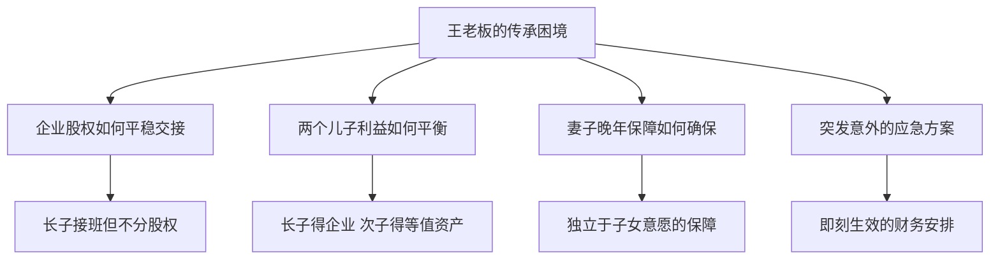
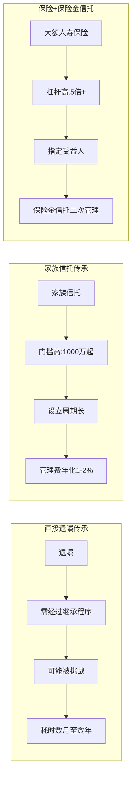
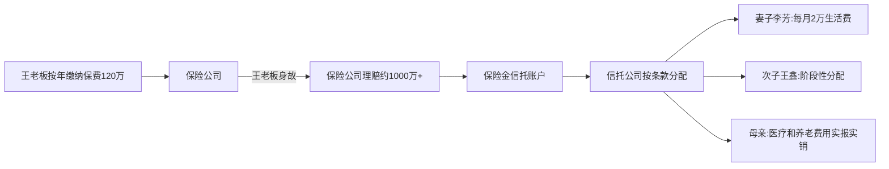

## 案例四：王老板的保险传承方案——中小企业家如何用保险撬动千万级传承

### 案例背景

#### 人物画像

王建国，52岁，浙江某地级市一家中型建材企业的创始人兼实际控制人。企业经营二十余年，年营收约8000万元，净利润稳定在1200万元左右。王老板个人资产构成如下：

| 资产类别 | 估值（万元） | 占比 | 备注 |
|----------|-------------|------|------|
| 企业股权（70%控股） | 5,000 | 50% | 账面净资产基础估值 |
| 自住房产（2套） | 1,200 | 12% | 一套自住、一套给父母 |
| 投资性房产（3套） | 1,500 | 15% | 均有按揭贷款 |
| 金融资产（理财+存款） | 800 | 8% | 分散在多个银行 |
| 车辆及其他 | 200 | 2% | 两辆车+收藏品 |
| **总资产** | **8,700** | **100%** | — |
| 房贷及其他负债 | -1,200 | — | 含企业经营性贷款 |
| **净资产** | **7,500** | — | — |

#### 家庭结构

王老板的家庭结构属于典型的中国中产偏上家庭，但存在传承中的典型复杂性：

- **本人**：52岁，身体健康，但父亲68岁时因心梗去世，家族有心血管病史
- **妻子李芳**：49岁，全职太太，婚后未参与企业经营
- **长子王磊**：28岁，海外MBA毕业，已在企业工作3年，担任副总，是王老板心目中的接班人
- **次子王鑫**：24岁，艺术专业毕业，在上海从事设计工作，对企业经营无兴趣
- **母亲**：75岁，与王老板同住，需要持续的医疗和养老支出

#### 王老板面临的核心传承困境

王老板并非不知道传承的重要性。他的同乡好友、某家具厂老板张某，三年前突发脑溢血去世，因没有做任何传承安排，妻子与两个兄弟为争夺企业控制权打了两年官司，企业最终倒闭，原本估值过亿的资产缩水到不足2000万。这件事深深触动了王老板。

王老板的困境集中在四个问题上：

**困境一：企业股权如何平稳交接？** 企业是王老板最核心的资产，但股权传承涉及工商变更、公司章程修改、其他股东权益、税务处理等复杂问题。如果直接将股权分给两个儿子，次子不参与经营却持有股权，未来可能成为隐患。

**困境二：两个儿子的利益如何平衡？** 王老板希望长子接班企业，但又不想让次子觉得被亏待。"手心手背都是肉"——这几乎是所有多子女家庭传承中最敏感的问题。

**困境三：妻子的晚年保障如何确保？** 如果王老板先离世，妻子没有独立收入来源，虽然有房产和存款，但如果儿子们不善待母亲，或者企业出了问题波及家庭资产，妻子的晚年将面临风险。

**困境四：如果自己突发意外怎么办？** 家族病史让王老板对健康问题格外敏感。他需要一个"即使明天出事，今天也能启动"的传承方案。

***

### 方案设计：为什么选择保险作为核心工具

#### 工具选择的逻辑

王老板咨询了三位专业人士：一位律师、一位信托经理、一位保险经纪人。在综合比较了遗嘱、家族信托、保险金信托、直接赠与等多种方案后，团队最终确定了以**大额人寿保险+保险金信托**为核心、遗嘱为补充的组合方案。

选择保险作为核心工具的理由有五个：

| 理由 | 具体说明 | 对应王老板的需求 |
|------|----------|-----------------|
| **杠杆效应** | 用较少保费撬动数倍保额，放大传承金额 | 用200万/年保费锁定1000万保额 |
| **指定受益人** | 赔偿金直接给付指定人，无需经过遗产分割程序 | 确保妻子和次子获得确定金额 |
| **债务隔离** | 指定受益人的保险金不属于被保险人遗产，原则上不被用于偿还债务 | 保护传承资产不被企业经营风险波及 |
| **快速到账** | 理赔通常在材料齐全后10-30天内完成 | 相比遗产继承可能耗时数月甚至数年 |
| **税务优势** | 中国目前保险赔款免征个人所得税 | 未来遗产税开征后的提前布局 |

#### 与其他工具的对比分析

为了确保方案选择的合理性，团队做了详细的工具对比：

**遗嘱方案的局限**：如果王老板仅通过遗嘱传承，首先，遗嘱需要经过继承权公证或法院确认，涉及所有法定继承人（妻子、两个儿子、母亲）的签字同意，任何一方有异议就会陷入诉讼。其次，遗嘱无法解决企业股权的经营权与所有权分离问题。第三，遗嘱传承的资产属于遗产，可能被用于清偿被继承人的债务。

**家族信托方案的局限**：家族信托门槛较高（通常1000万起），王老板的可投资资产约800万现金+房产，难以达到门槛。且设立周期长（3-6个月），管理费年化1-2%，对于王老板这个资产规模来说性价比不够高。

**保险方案的优势**：大额人寿保险门槛低（年缴数万元起），设立快（通常1-2周完成核保），杠杆高（52岁男性，20年缴费的终身寿险，保额/总保费比约2.5-3倍），且具有债务隔离和指定受益人的法律优势。

***

### 具体方案设计

#### 第一层：大额终身寿险——锁定传承基础金额

**产品选择**：某大型保险公司的增额终身寿险，保额逐年递增，兼具保障和储蓄功能。

**投保方案**：

| 项目 | 详情 |
|------|------|
| 投保人 | 王建国本人 |
| 被保险人 | 王建国 |
| 受益人 | 妻子李芳（60%）、次子王鑫（40%） |
| 年缴保费 | 120万元 |
| 缴费期限 | 10年 |
| 初始保额 | 约1000万元 |
| 保额增长 | 每年3.0%复利递增 |

**为什么受益人只设妻子和次子？** 这是方案设计中最精妙的一点。长子王磊将通过继承企业股权获得最大份额的资产（企业估值约5000万），保险赔偿金给妻子和次子，实现"长子得企业、次子得现金"的利益平衡。

**为什么选择增额终身寿险而非定额终身寿险？** 增额终身寿险的保额逐年递增，时间越长杠杆越大。如果王老板活到80岁（还有28年），保额将增长到约2300万（按3%复利），此时已缴保费总额为1200万，杠杆接近2倍。如果不幸早逝，保额虽然较低，但此时杠杆效应反而更大（已缴保费少、赔付比例高）。

**关键设计：受益人的精确比例设定**

受益人比例不是随意设定的，而是基于精确的资产测算：

| 继承人 | 获得的资产 | 估值（万元） | 占家庭总资产比例 |
|--------|-----------|-------------|----------------|
| 长子王磊 | 企业股权70% | 5,000 | 56% |
| 妻子李芳 | 保险赔偿金60%+自住房产 | 600+700=1,300 | 15% |
| 次子王鑫 | 保险赔偿金40%+投资房产 | 400+1,500=1,900 | 21% |
| 母亲 | 遗嘱安排+每月赡养费 | 预留200 | 2% |
| 其他（税费、丧葬等） | — | 预留500 | 6% |

#### 第二层：保险金信托——防止赔偿金被挥霍

仅仅购买保险还不够。王老板最担心的问题是：如果自己突然离世，24岁的次子王鑫拿到400万现金，以他目前的消费习惯（月光族、喜欢潮牌和旅行），这笔钱可能三年就花光。

解决方案是设立**保险金信托**：将保险的受益人从个人改为信托，由信托按照预设条件向受益人分配。

**保险金信托的运作机制**：

**信托分配条款设计**（这是整个方案的核心细节）：

**对妻子李芳的分配**：
- 每月固定生活费2万元，确保基本生活不受影响
- 重大医疗费用实报实销（凭医院发票和诊断证明）
- 每年额外发放旅游基金5万元
- 李芳去世后，剩余信托资产按比例分配给两个儿子

**对次子王鑫的分配**（重点设计，防挥霍）：
- 25-30岁：每月1.5万元基本生活费
- 30岁一次性发放50万元（用于创业或购房首付）
- 30-35岁：每月2万元
- 35岁一次性发放100万元
- 35岁以后：按季度分配信托收益的50%
- 特别条款：如王鑫取得硕士以上学位或创业满3年，额外奖励30万元

**对母亲的分配**：
- 医疗费用实报实销
- 护理费用每月上限1.5万元
- 母亲去世后，该部分额度并入其他受益人分配

**为什么用保险金信托而不是直接买保险？** 直接购买保险，赔偿金是一次性给付的。对于妻子来说问题不大，但对于年轻且消费观念尚未成熟的次子来说，一次性获得数百万现金反而可能是灾难。保险金信托实现了"钱给你但不一次给你"的效果，既保障了受益人的长期利益，又防止了短期挥霍。

#### 第三层：遗嘱——覆盖保险和信托无法触及的资产

保险和信托主要覆盖金融资产，但王老板还有房产、车辆、收藏品等非金融资产需要安排。因此，遗嘱作为补充工具必不可少。

**遗嘱的核心内容**：

| 遗产项目 | 分配方案 | 备注 |
|----------|---------|------|
| 自住房产（给父母的那套） | 由母亲终身居住，母亲去世后归长子 | 设居住权保障母亲 |
| 自住房产（自住那套） | 妻子李芳继承 | 妻子的居住保障 |
| 投资性房产（3套） | 全部归次子王鑫 | 与保险金配合，平衡利益 |
| 金融资产（理财+存款） | 妻子60%、次子40% | 作为保险方案的补充 |
| 车辆 | 长子、次子各一辆 | — |
| 收藏品 | 次子 | 次子学艺术，有兴趣 |

**遗嘱形式**：采用**公证遗嘱+自书遗嘱**双保险。虽然《民法典》已取消公证遗嘱的优先效力，但公证遗嘱的形式规范性最高，被法院采信的概率最大。同时保留一份自书遗嘱作为备份，记录对家庭的情感表达和对子女的嘱托。

***

### 执行过程

#### 阶段一：资产盘点与家庭沟通（第1-2个月）

**资产盘点**：在律师和会计师的协助下，王老板完成了全面的资产清单梳理，包括所有房产的权属证书、企业股权结构、银行账户、保险保单、对外债权债务等。盘点过程中发现了两个意外：一是三年前借给朋友的80万没有借条；二是企业有一笔未入账的应收账款约200万。这些都需要在传承方案中一并考虑。

**家庭沟通**：这是整个过程中最敏感也最关键的环节。王老板分别与妻子、两个儿子进行了深入沟通。

与长子王磊的沟通要点：
- 明确他将继承企业股权，成为实际控制人
- 解释为什么保险赔偿金不给他——不是偏心，而是他已经获得了最大份额的企业资产
- 要求他承担照顾母亲的主要责任

与次子王鑫的沟通要点：
- 解释保险金信托的存在和分配条件
- 强调"不是不信任你，而是希望这笔钱能保护你更久"
- 鼓励他追求自己的事业，信托条款中的创业奖励就是对他的支持

与妻子的沟通要点：
- 确保她了解整个方案的基本框架
- 告知她保险经纪人和信托经理的联系方式
- 确保她知道自己有独立的法律权利

#### 阶段二：保险投保与信托设立（第3-4个月）

**保险投保**：王老板选择了两家大型保险公司的产品，分别投保60万/年和60万/年，保额各约500万。选择两家而非一家的原因是分散风险——虽然中国有保险保障基金，但分散投保仍是审慎的做法。

**核保过程**：52岁的王老板在核保中遇到了一个小问题——体检发现轻度脂肪肝和血压偏高。保险公司最终标准体承保，但要求加费5%。这提醒我们：**传承规划越早做越好**，年龄和健康状况直接影响保费和承保条件。

**保险金信托设立**：在保险生效后，王老板与信托公司签订了保险金信托合同。信托合同的关键条款包括：

- **信托期限**：至最后一位受益人去世
- **受托人**：某持牌信托公司
- **信托监察人**：王老板的弟弟（王老板去世后监督信托运作）
- **分配条款**：如前所述的详细分配规则
- **投资限制**：信托资产仅限投资国债、银行存款、大型银行理财产品，不得投资股票、基金等高风险资产
- **终止条款**：如信托资产低于50万，一次性分配给当时存活的受益人

#### 阶段三：遗嘱订立与配套安排（第5-6个月）

**遗嘱订立**：在律师见证下，王老板订立了公证遗嘱和自书遗嘱。

**配套安排**：

- **企业章程修改**：在律师协助下，修改了公司章程，增加了"实际控制人去世后，其继承人继承股权但需委托专业经理人管理企业至少3年"的条款
- **借条补签**：追回了借给朋友的80万，补签了正式借条
- **信息整理**：将所有保单、信托合同、遗嘱、房产证、银行账户信息整理成一份《家庭资产与传承安排手册》，交给妻子和弟弟各一份
- **律师联系方式**：确保妻子和儿子都知道遇到问题时该找谁

***

### 方案的财务分析

#### 保费支出与保额杠杆

| 指标 | 数值 | 说明 |
|------|------|------|
| 年缴保费 | 120万元 | 两家保险公司各60万 |
| 缴费总期限 | 10年 | 到62岁缴清 |
| 总保费 | 1,200万元 | 10年×120万 |
| 初始保额 | 约1,000万元 | 两家各500万 |
| 55岁时保额 | 约1,100万元 | 增额部分 |
| 60岁时保额 | 约1,270万元 | 增额部分 |
| 70岁时保额 | 约1,710万元 | 增额部分 |
| 80岁时保额 | 约2,300万元 | 增额部分 |

**关键结论**：如果王老板在65岁前去世（缴费期内），杠杆约为1.5-2倍（保额/已缴保费）。如果活到80岁，虽然杠杆降至约1.9倍（2300万/1200万），但考虑到保额的确定性和传承功能，仍然具有很高的价值——这笔钱是**确定的、免税的、不受债务追索的、快速到账的**。

#### 与其他方案的成本对比

| 方案 | 设立成本 | 年维护成本 | 传承确定性 | 隔离性 | 灵活性 |
|------|---------|-----------|-----------|--------|--------|
| 纯遗嘱 | 几千元 | 无 | 低（可能被挑战） | 无 | 高 |
| 家族信托（1000万起） | 10-20万 | 10-20万/年 | 高 | 最强 | 高 |
| 保险+保险金信托 | 保费120万/年 | 信托管理费约1万/年 | 高 | 强 | 中 |
| 直接赠与 | 几千元 | 无 | 高（不可逆） | 无 | 无 |

***

### 方案执行五年后的实际效果

#### 客观数据

| 指标 | 方案执行前 | 执行5年后 |
|------|-----------|----------|
| 王老板的安心程度 | 焦虑，经常失眠 | 坦然，专注企业经营 |
| 妻子的安全感 | 不确定，担忧未来 | 安心，了解自己的保障 |
| 长子的状态 | 压力大，担心弟弟争产 | 专注企业，已独立管理3个项目 |
| 次子的状态 | 抗拒，觉得被安排 | 理解，开始创业设计工作室 |
| 家庭关系 | 紧张（讨论传承时） | 和谐（方案透明，各得其所） |
| 已缴保费 | 0 | 600万元（5年×120万） |
| 累计保额 | 0 | 约1,100万元（含增额部分） |

#### 意外收获

方案执行过程中出现了几个王老板没有预料到的正面效果：

**企业经营的意外改善**：在修改公司章程时，王老板被迫重新审视了企业的治理结构，引入了职业经理人制度和董事会机制。结果企业管理效率提升，第二年营收增长了15%。传承规划倒逼了企业治理的现代化。

**家庭关系的改善**：在家庭沟通环节，王老板第一次和两个儿子坐下来认真讨论"如果爸爸不在了怎么办"这个话题。虽然过程有些沉重，但之后家庭成员之间的信任感明显增强。次子王鑫说："以前觉得你偏心哥哥，现在明白你是在用不同的方式爱我们。"

**个人健康意识的提升**：核保时的体检报告让王老板开始重视健康。他开始规律运动、控制饮食，两年后体重下降了8公斤，血压恢复正常。

***

### 常见问题与应对策略

#### 问题一：如果保险公司倒闭怎么办？

**应对策略**：中国有保险保障基金制度。根据《保险保障基金管理办法》，人寿保险合同会由其他保险公司接手，保单持有人的权益有保障。此外，王老板选择的两家保险公司均为"大到不能倒"的系统重要性保险公司，破产概率极低。即便极端情况发生，保险保障基金对个人保单的救助比例为保单利益的90%。

#### 问题二：如果未来开征遗产税，保险赔偿金是否免税？

**应对策略**：中国目前没有遗产税，保险赔偿金免征个人所得税。从国际经验看，多数国家对指定受益人的人寿保险赔偿金给予遗产税减免或豁免。但政策存在不确定性，因此王老板的方案设计为"保险为主、遗嘱为辅"，即便未来保险赔偿金被纳入遗产税征收范围，保险金信托的结构也能提供一定的税务筹划空间。

#### 问题三：如果次子王鑫对分配方案不满怎么办？

**应对策略**：方案设计时已充分考虑了公平性。长子获得企业股权（5000万），但同时也承担了企业经营的风险和照顾母亲的主要责任。次子获得的保险赔偿金和房产（约1900万）虽然绝对金额较少，但风险也更低、流动性更强。在家庭沟通中，王老板向次子详细解释了"名义价值"与"实际价值"的区别——企业股权看着值5000万，但如果经营不善可能一文不值，而保险赔偿金和房产的价值是确定的。

#### 问题四：如果王老板想中途退保怎么办？

**应对策略**：增额终身寿险在前几年退保会有较大损失（现金价值低于已缴保费）。以王老板的保单为例，前3年退保只能拿回约60%的已缴保费。这也是方案设计的"强制储蓄"效果——正因为退保有损失，王老板才更不会冲动退保。如果确实需要资金，可以选择保单贷款（通常可贷现金价值的80%），而非退保。

#### 问题五：如果未来离婚怎么办？

**应对策略**：这是保险传承方案的一个潜在风险。如果王老板与妻子离婚，保险保单的现金价值可能被作为夫妻共同财产分割。应对方式：一是保持婚姻稳定（根本方案）；二是在婚前或婚内财产协议中约定保单属于个人财产；三是保险金信托的结构在一定程度上隔离了婚姻风险——即使离婚，信托条款中的受益人和分配方式不会因此改变。

***

### 方案的局限性与适用边界

这个方案并非万能，它有明确的适用边界：

**适用场景**：
- 家庭净资产在500万-5000万之间的中小企业主
- 有2个以上子女，需要平衡利益
- 配偶没有独立收入来源，需要长期保障
- 希望实现"企业归经营、现金归生活"的分离

**不适用场景**：
- 净资产超过5000万的高净值家庭（应以家族信托为核心）
- 净资产低于200万的家庭（保费压力过大）
- 家庭关系极度复杂（如多段婚姻、非婚生子女等，需要更复杂的法律安排）
- 企业股权结构过于复杂（涉及多个股东、代持等）

**需要定期审视和调整的情况**：
- 家庭结构变化（离婚、再婚、新增子女）
- 资产规模重大变化（企业上市、重大投资）
- 法律环境变化（遗产税开征、保险法规修订）
- 受益人情况变化（子女婚姻状况、健康状况）

***

### 核心经验提炼

王老板的案例揭示了中小企业家保险传承方案设计的六个核心原则：

**原则一：保险是"地基"，不是"全部"。** 保险解决了传承金额的确定性和快速到账问题，但无法覆盖所有资产类型。遗嘱、信托、企业章程等工具需要配合使用。

**原则二：受益人设计比产品选择更重要。** 买什么产品是技术问题，给谁、给多少、怎么给是战略问题。王老板方案的核心智慧在于"长子得企业、次子得现金"的利益平衡设计。

**原则三：保险金信托是中产家庭的"性价比之王"。** 家族信托门槛太高，直接给付风险太大，保险金信托恰好处于两者之间——用保险的杠杆撬动资金，用信托的条款控制分配。

**原则四：家庭沟通是方案成功的前提。** 再完美的方案，如果家庭成员不理解、不接受，在执行时必然出问题。王老板在方案设计阶段就引入家庭沟通，避免了"身后子女争产"的悲剧。

**原则五：传承规划要趁早、趁健康。** 王老板52岁投保被加费5%，如果40岁投保，同样的保额保费可能只需要60万/年。年龄和健康状况是保险传承方案最大的变量。

**原则六：方案需要"活"的维护。** 传承不是一次性事件。王老板每年都会和保险经纪人、信托经理做一次方案回顾，根据家庭和资产变化调整方案。这种"活"的维护，才是方案长期有效的保障。

> **一句话总结**：王老板的保险传承方案，本质上是用保险的确定性对抗人生的不确定性，用信托的规则性对抗人性的不确定性，用家庭沟通的温度对抗利益分配的冰冷。
