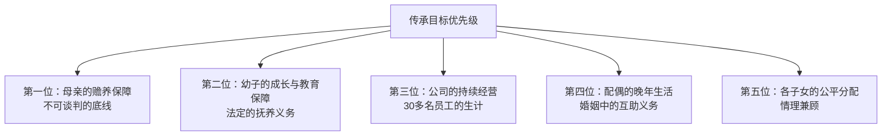
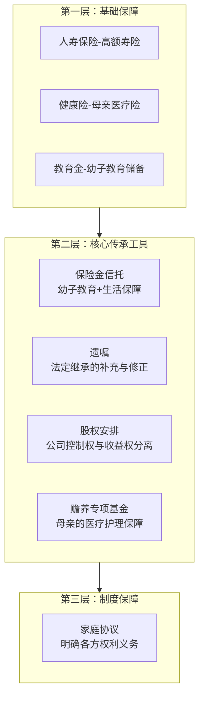
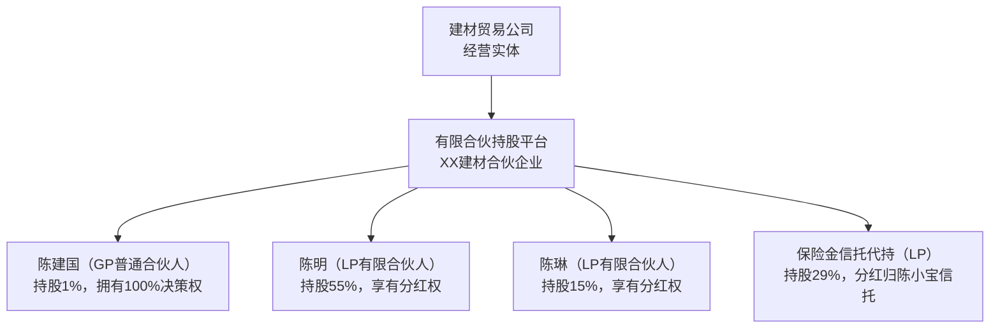

## 案例五：再婚家庭的传承方案——如何在复杂家庭结构中实现公平与和谐

### 为什么再婚家庭是传承规划中难度最高的场景

在所有传承场景中，再婚家庭的复杂程度几乎可以排到首位。原因很简单：它同时叠加了多个高难度变量——**多方利益博弈、情感与理性的冲突、法律关系的交织、以及信任基础的薄弱**。

一组数据可以帮助你理解这个群体的规模和紧迫性：

| 指标 | 数据 | 来源 |
|------|------|------|
| 中国再婚登记对数（年） | 约400万对 | 民政部统计数据 |
| 再婚家庭中涉及子女抚养的比例 | 超过60% | 家庭社会学研究 |
| 再婚家庭遗产纠纷诉讼率 | 是初婚家庭的3-4倍 | 各级法院裁判文书统计 |
| 再婚家庭中未做传承规划的比例 | 超过80% | 财富管理行业调研 |

再婚家庭传承失败的核心原因，不是法律工具不够，而是**没有在再婚之前就想清楚"我的钱到底要给谁"这个根本问题**。本案例将完整展示一个真实的再婚家庭如何从混乱走向清晰，最终建立了一套让各方都能接受的传承方案。

***

### 案例背景：一个典型的再婚家庭

#### 家庭成员构成

**男主人公：陈建国（化名）**，52岁，某二线城市私营企业主，经营一家建材贸易公司，年营收约3000万元，个人名下资产约2800万元（含公司股权价值）。

**陈建国的前婚**：与前妻李芳（化名）育有一子一女——陈明（30岁，已婚，在陈建国公司工作）、陈琳（27岁，已婚，在外地工作）。2016年离婚，离婚时已对部分共同财产做了分割，但公司股权未做分割。

**现任妻子：王丽华（化名）**，45岁，原公司财务主管，2018年与陈建国再婚。王丽华带有一女刘小雨（化名，20岁，大学在读），陈建国与王丽华婚后又生一子陈小宝（化名，4岁）。

**陈建国的母亲**：赵桂兰（化名），78岁，随陈建国生活，有慢性病需长期护理。

#### 资产全景

| 资产类别 | 具体内容 | 估值（万元） | 权属状态 |
|----------|----------|-------------|----------|
| 公司股权 | 建材公司90%股权 | 2000 | 婚前取得，但婚后增值部分存争议 |
| 不动产1 | 早年购买的商铺2间 | 500 | 婚前个人财产（有证据） |
| 不动产2 | 现住房（300㎡复式） | 350 | 再婚后购买，登记在陈建国名下 |
| 不动产3 | 投资性公寓1套 | 180 | 再婚后购买，登记在王丽华名下 |
| 金融资产 | 理财、股票、基金 | 400 | 部分婚前、部分婚后 |
| 保险 | 多份人寿保险 | 保额共500 | 受益人待梳理 |
| 车辆 | 2辆 | 60 | — |
| 母亲赡养 | 母亲医疗+护理年支出约20万 | — | 长期义务 |

#### 核心矛盾梳理

陈建国找到传承规划师时，坦承自己"一想到遗产的事就头疼"。经过深度访谈，规划师梳理出以下核心矛盾：

**矛盾一：前婚子女 vs 现婚家庭的资源分配**

陈明在公司工作多年，认为自己理应继承公司大部分股权。王丽华则认为，公司婚后增值巨大，自己作为配偶和公司员工（她任财务主管），应当享有相应权益。陈琳虽未参与公司经营，但认为自己不应被排除在外。

**矛盾二：继子女的权益问题**

王丽华带来的女儿刘小雨，陈建国虽有抚养之情，但在法律上并非其法定继承人。王丽华希望刘小雨也能获得一定的经济保障。

**矛盾三：幼子的未来保障**

4岁的陈小宝是陈建国的亲生儿子，但年龄太小，无法独立管理财产。如果陈建国发生意外，如何确保幼子的利益不被侵占？

**矛盾四：母亲的赡养保障**

赵桂兰年迈多病，陈建国是主要赡养人。如果陈建国先于母亲去世，谁来保障母亲的晚年生活？

**矛盾五：公司经营的连续性**

建材公司有30多名员工，如果因遗产分割导致公司股权分散，可能影响公司正常经营，甚至导致企业倒闭。

***

### 第一步：全面资产确权——厘清"什么是我的，什么是我们的"

传承规划的第一步，不是讨论"给谁多少"，而是**先搞清楚"到底有多少"以及"哪些属于个人，哪些属于夫妻共同财产"**。

#### 婚前财产与婚后财产的界定

这是再婚家庭最关键的一步。根据《民法典》第1062条和第1063条：

- **婚前个人财产**：一方婚前取得的财产，不因婚姻关系存续而转化为共同财产
- **婚后共同财产**：婚姻存续期间取得的工资、经营收益、投资收益等

陈建国的资产确权结果如下：

| 资产 | 确权结论 | 法律依据 | 确权难度 |
|------|----------|----------|----------|
| 公司原始股权（婚前部分） | 个人财产 | 婚前取得，有工商登记 | 低 |
| 公司婚后增值部分 | 需区分"自然增值"与"主动经营增值" | 最高法婚姻法司法解释三第5条 | 高 |
| 商铺2间 | 个人财产 | 婚前购买，有产权证 | 低 |
| 现住房 | 共同财产 | 婚后购买 | 低 |
| 投资公寓 | 共同财产 | 婚后购买，登记谁名下不影响性质 | 低 |
| 金融资产（婚前部分） | 个人财产 | 需要资金流水证明 | 中 |
| 金融资产（婚后部分） | 共同财产 | 婚后取得的收益 | 低 |
| 保险 | 需逐份审查 | 看保费来源和投保时间 | 中 |

#### 公司股权增值的专项分析

这是本案最复杂的部分。陈建国的公司是婚前创立，但婚后十年间从年营收500万增长到3000万，股权增值巨大。

根据司法实践中的裁判规则，关键在于区分两种增值：

**自然增值**（属于个人财产）：因市场行情、通货膨胀等外部因素导致的增值，与配偶的贡献无关。例如商铺因地段升值。

**主动经营增值**（可能被认定为共同财产）：因一方或双方投入时间、精力、劳动而实现的增值。如果配偶参与了公司经营（如王丽华担任财务主管），增值部分更可能被认定为共同财产。

本案中，王丽华婚后在公司担任财务主管，参与了公司的经营管理，因此公司婚后增值部分存在被认定为夫妻共同财产的风险。初步评估，公司婚前价值约800万元，婚后增值约1200万元，其中**至少40%-60%可能被认定为共同财产**。

规划师建议陈建国与王丽华签订一份**婚内财产协议**，明确公司股权的归属和增值部分的分配比例，为后续传承规划奠定基础。

#### 婚内财产协议的核心条款设计

经过多轮协商，陈建国与王丽华签订了婚内财产协议，核心条款如下：

1. **公司股权归属**：陈建国婚前持有的公司90%股权为其个人财产，王丽华放弃对该部分股权的主张
2. **婚后增值分配**：考虑到王丽华的经营贡献，公司婚后增值部分的30%归王丽华所有，70%归陈建国所有
3. **王丽华的补偿安排**：陈建国将投资公寓（180万元）单独赠与王丽华，作为其放弃公司股权增值主张的补偿
4. **现有住房**：现住房为共同财产，双方各占50%
5. **金融资产**：各自名下婚前金融资产归各自所有；婚后新增收益为共同财产

这份协议的价值在于：**在陈建国健在时就把财产边界划清楚，避免去世后的"糊涂账"**。

***

### 第二步：传承目标设定——让每个人都说清楚自己的诉求

规划师分别与家庭中的每个关键成员进行了单独访谈，了解他们的真实诉求。这一步至关重要，因为很多家庭矛盾的根源是**各自以为知道对方想要什么，但实际上谁也没有说清楚**。

#### 各方诉求梳理

| 家庭成员 | 核心诉求 | 隐含担忧 |
|----------|----------|----------|
| 陈建国 | 公司继续经营、幼子有保障、母亲有人赡养、各子女都照顾到、家庭和睦 | 担心自己去世后家庭反目 |
| 王丽华 | 自己和小宝的生活有保障、不被前婚子女排挤、公司能正常运营 | 担心陈建国把所有东西都给了前婚子女 |
| 陈明 | 继承公司、获得与其贡献匹配的回报 | 担心继母和幼弟"分走"属于自己的东西 |
| 陈琳 | 获得公平的财产分配 | 感觉自己一直被忽视 |
| 赵桂兰（母亲） | 晚年有人照顾、看病有钱 | 担心儿子先走自己无人管 |

#### 传承目标的优先级排序

经过家庭会议和多轮沟通，确定了以下优先级：

***

### 第三步：方案设计——工具组合与结构搭建

#### 方案总架构

根据陈建国的家庭结构和资产状况，规划师设计了一套"三层四柱"的传承架构：

#### 工具一：遗嘱——奠定分配格局

陈建国需要立一份**合法有效且全面覆盖**的遗嘱。考虑到再婚家庭的复杂性，建议采用**律师见证遗嘱**（代书遗嘱的一种强化形式），而非简单的自书遗嘱。

遗嘱的核心分配方案：

| 资产 | 分配方案 | 设计理由 |
|------|----------|----------|
| 公司股权（个人部分的70%） | 陈明获得55%，陈琳获得15% | 陈明参与经营，贡献更大；陈琳不参与经营但享有基本权益 |
| 公司股权（个人部分的30%） | 暂不分配，设立投票权委托 | 保持公司决策权集中 |
| 商铺2间 | 陈明1间、陈琳1间 | 婚前个人财产，给前婚子女 |
| 现住房（陈建国的50%份额） | 王丽华居住至终老，产权归陈小宝 | 保障配偶居住权+幼子产权 |
| 投资公寓 | 已在婚内协议中归王丽华 | 补偿性质 |
| 金融资产（个人部分） | 50%归王丽华，30%归陈小宝信托，20%均分给陈明陈琳 | 兼顾各方 |
| 保险理赔金 | 按保险合同约定的受益人分配 | 走保险通道，不进入遗产 |

#### 工具二：保险金信托——幼子的核心保障

这是本案最关键的一环。陈小宝年仅4岁，如果陈建国发生意外，将面临两个严重问题：

1. **财产管理问题**：4岁孩子无法管理任何财产，监护人（母亲王丽华）代管，但如果王丽华再婚或出现其他变故，财产安全难以保障
2. **财产被挪用风险**：巨额财产直接给到监护人手中，存在被挪用、被侵占的风险

保险金信托的设计如下：

**保单结构**：
- 投保人：陈建国
- 被保险人：陈建国
- 受益人：保险金信托（非个人）
- 保额：500万元（年缴保费约15万元）
- 保险类型：终身寿险（确定性强）

**信托条款设计**：

| 条款 | 具体内容 | 设计意图 |
|------|----------|----------|
| 受益人 | 陈小宝为第一顺位受益人 | 确保幼子利益 |
| 信托期限 | 至陈小宝年满35周岁 | 覆盖成长和创业期 |
| 教育金发放 | 每年15万元，凭学校录取通知书领取 | 保障完成高等教育 |
| 生活津贴 | 每月1万元，由监护人代领用于抚养 | 保障基本生活 |
| 大额支出 | 单笔超过20万元需信托委员会审批 | 防止资金被滥用 |
| 激励条款 | 取得硕士学位奖励20万，创业奖励50万 | 鼓励上进 |
| 退出条款 | 35周岁一次性领取剩余资产 | 成年后自主管理 |

信托委员会由三人组成：专业受托人（信托公司）、陈建国的律师、陈建国信任的家族长辈。王丽华作为监护人可以申请使用信托资金，但需要经过审批流程。

#### 工具三：股权安排——公司的持续经营保障

公司是陈建国最大的资产，也是最容易引发纠纷的资产。股权传承需要同时解决三个问题：**控制权集中、收益权分配、经营权延续**。

**方案设计：有限合伙持股平台**

这个结构的核心逻辑是：

**GP（普通合伙人）**：陈建国持有1%的GP份额，拥有100%的经营决策权。GP份额的继承另行安排——如果陈建国去世，GP份额由陈明继承，确保公司的决策权不会分散。

**LP（有限合伙人）**：其他家庭成员作为LP，只享有分红权，不参与经营决策。这样既保障了各方的经济利益，又避免了"外行指挥内行"的问题。

**关键优势**：
- 陈明获得实际经营权，匹配其多年付出
- 陈琳和陈小宝享有经济回报，不用承担经营风险
- 王丽华不直接持有公司股权（避免前婚子女的抵触），但通过共同财产份额间接享有权益

#### 工具四：母亲赡养专项安排

赵桂兰的赡养问题容易被忽略，但却是陈建国最牵挂的事。规划师设计了一套独立的赡养保障方案：

**赡养保障的三重防线**：

| 防线 | 具体安排 | 覆盖场景 |
|------|----------|----------|
| 第一重 | 为赵桂兰购买高端医疗险（年缴2.4万元），覆盖住院、手术、特殊门诊 | 日常医疗开支 |
| 第二重 | 从金融资产中划出100万元设立赡养专项账户，由陈建国的姐姐代管 | 陈建国健在时的补充保障 |
| 第三重 | 遗嘱中明确：陈建国去世后，从遗产中优先拨付200万元作为母亲赡养基金，由信托公司管理，每月向护理机构支付费用 | 陈建国去世后的长期保障 |

第三重防线的优先级设定至关重要——在遗嘱中写明"赡养基金优先于其他继承分配"，确保母亲的权益不会因遗产争夺而受到影响。

***

### 第四步：家庭沟通——比法律工具更重要的环节

方案设计完成后，最关键也最艰难的一步是**让所有家庭成员理解和接受这个方案**。

#### 沟通策略：分层、分步、有针对性

规划师建议陈建国采用"分层沟通"策略，而非一次性召开家庭会议：

**第一层：与王丽华单独沟通（夫妻之间）**

沟通要点：
- 婚内财产协议的意义：不是"防着你"，而是"保护你"
- 王丽华的具体保障：投资公寓归你、住房你有居住权、金融资产你有一半、保险金信托保障小宝
- 对刘小雨的安排：虽然法律上陈建国对刘小雨没有继承义务，但可以通过赠与方式给予经济支持（建议每年赠与5万元教育基金，至大学毕业）

**第二层：与陈明单独沟通（核心继承人）**

沟通要点：
- 股权安排的逻辑：你获得55%的LP份额+未来的GP控制权，是最大的受益者
- 但你需要接受的条件：陈琳和小宝也有份，公司的利润分配需要公平
- 王丽华的定位：她是爸爸的妻子，不是"外人"，不要把她放在对立面

**第三层：与陈琳单独沟通（容易被忽视的一方）**

沟通要点：
- 你获得了商铺一间+15%公司股权+金融资产份额，总价值约500万元
- 你虽然不参与经营，但LP份额保障了你的经济权益
- 家庭和睦比多分一点钱更重要

**第四层：家庭全体会议**

在前三层沟通基本达成共识后，召开一次全体家庭会议，由律师和规划师在场，正式介绍方案。会议的目标不是讨论方案（讨论已经在之前完成），而是**形成正式的家庭共识**。

#### 沟通过程中发现的问题与调整

实际沟通过程并非一帆风顺，出现了以下问题：

**问题一：陈明要求更多股权**

陈明认为自己在公司工作8年，从基层做到副总，55%的LP份额"太少"。他的诉求是至少70%。

**解决方案**：规划师帮陈明算了一笔账——公司2000万估值的90%股权（陈建国个人部分）中，55%对应约990万元的资产价值，加上未来每年的分红（公司年净利润约300万元，55%份额对应约150万元/年），再加上未来获得GP控制权的安排，陈明已经是最大的受益者。同时提醒他：如果坚持要70%，陈琳和小宝的份额被压缩，可能引发诉讼，公司经营反而受影响。

陈明最终接受了原方案。

**问题二：王丽华对刘小雨的安排不满**

王丽华认为每年5万元的教育基金"太少了"，希望刘小雨也能获得一份房产或股权。

**解决方案**：规划师解释了法律现实——刘小雨不是陈建国的法定继承人，从法律角度她没有继承权。但陈建国可以通过遗嘱中的"遗赠"条款给予刘小雨一定财产。最终方案调整为：遗嘱中增加一项遗赠条款，将一套投资性公寓（价值约80万元）遗赠给刘小雨，但附加条件——该房产在刘小雨年满25周岁前由王丽华代管。

**问题三：赵桂兰的赡养人问题**

陈建国的姐姐陈建芳提出：如果弟弟先于母亲去世，她愿意照顾母亲，但需要经济保障。

**解决方案**：赡养基金的管理人设为陈建芳，每月从信托中支付护理费用和生活费。同时在遗嘱中增加条款：如果陈建芳承担了母亲的养老送终义务，可以获得额外的50万元"感恩金"。

***

### 第五步：法律文件签署与资产过户

方案确定后，需要完成一系列法律文件的签署和资产的过户安排：

| 序号 | 法律文件 | 签署时间 | 核心内容 | 注意事项 |
|------|----------|----------|----------|----------|
| 1 | 婚内财产协议 | 第1周 | 明确公司股权、房产、金融资产的权属 | 需公证，确保效力 |
| 2 | 遗嘱（律师见证） | 第2周 | 资产分配方案、赡养安排、遗赠条款 | 至少两名无利害关系见证人 |
| 3 | 保险合同变更 | 第2-3周 | 受益人改为保险金信托 | 需与信托同步设立 |
| 4 | 信托合同签署 | 第3-4周 | 保险金信托条款、管理规则、分配机制 | 选择信誉良好的信托公司 |
| 5 | 有限合伙企业设立 | 第4-6周 | 持股平台的GP/LP结构、合伙协议 | 需要工商登记 |
| 6 | 赡养专项账户设立 | 第2周 | 100万元赡养基金、管理人指定 | 建议银行托管 |

#### 法律文件的定期审查机制

传承方案不是一劳永逸的。规划师建议建立以下审查机制：

- **年度审查**：每年年底对资产状况进行一次全面梳理，确认资产价值变化
- **重大事件触发审查**：家庭成员变动（出生、死亡、婚姻变化）、资产重大变动（大额买卖、公司股权变动）、法律环境变化（税法修订、信托法修订）
- **每3-5年全面复审**：重新评估方案是否仍然适用，必要时进行调整

***

### 方案实施效果与后续跟踪

方案实施两年后的跟踪结果显示：

| 评估维度 | 实施前 | 实施后 | 变化 |
|----------|--------|--------|------|
| 家庭关系和谐度 | 各方互相猜忌 | 基本和谐，偶尔小摩擦 | 显著改善 |
| 公司经营稳定性 | 陈明与王丽华有冲突 | 明确分工，冲突减少 | 显著改善 |
| 母亲赡养状况 | 完全依赖陈建国 | 三重保障到位 | 从根本解决 |
| 幼子保障程度 | 无任何安排 | 保险金信托500万保障 | 从根本解决 |
| 陈建国的心理状态 | 焦虑、失眠 | 安心、可以专注经营 | 显著改善 |

陈建国在一次回访中对规划师说："以前一想到遗产的事就睡不着觉，现在终于踏实了。最重要的是，我老婆和孩子们的关系比以前好了——因为他们知道，我已经把事情安排清楚了，不需要互相争。"

***

### 本案的核心教训与规律提炼

#### 教训一：再婚前就必须做传承规划

陈建国2018年再婚，但直到2024年才开始做传承规划，中间6年处于"裸奔"状态。如果这6年间发生意外，后果不堪设想。**再婚前就应该完成至少基础的传承安排**——婚内财产协议、遗嘱、保险，这三样是再婚前的"必修课"。

#### 教训二：公司股权是最大的雷区

再婚家庭中，如果一方持有公司股权，股权传承几乎必然引发纠纷。原因在于：公司股权的价值认定模糊、婚前婚后增值难以区分、经营权与所有权的分离需要精心设计。**持股平台（有限合伙）是解决这一问题的最佳工具**，它能实现控制权与收益权的分离，让"能者经营，人人受益"。

#### 教训三：保险金信托是再婚家庭幼子保障的最优解

直接把钱给监护人（通常是幼子的母亲）？有被挪用的风险。直接给幼子？他才4岁。设立普通信托？门槛太高。保险金信托完美解决了这三个问题——用保险的杠杆效应降低门槛（年缴15万撬动500万保额），用信托的隔离和分配机制保障资金安全，用灵活的条款设计覆盖教育、生活、创业等各阶段需求。

#### 教训四：沟通比法律工具更重要

本案中，最终让方案落地的关键不是律师的文书多完善，而是陈建国花了大量时间与每位家庭成员**一对一沟通**。很多再婚家庭的传承失败，不是因为方案不好，而是因为家人觉得"被蒙在鼓里"或"被亏待了"。**先沟通，再出方案；先理解，再分配**——这是再婚家庭传承的黄金法则。

#### 教训五：继子女的安排需要提前想清楚

刘小雨在法律上不是陈建国的法定继承人，但她是王丽华的女儿，是陈小宝同母异父的姐姐。如果完全忽视她的权益，王丽华必然不满，家庭和谐无从谈起。**通过遗赠、赠与等方式给予继子女适当安排，既是法律允许的，也是维护家庭关系的智慧之举**。

***

### 常见误区警示

#### 误区一："立了遗嘱就万事大吉"

遗嘱只是传承方案的一个组成部分，不是全部。遗嘱无法实现资产隔离、无法控制分配节奏、无法防止继承人挥霍。再婚家庭需要的是**遗嘱+信托+保险+持股平台的组合方案**，而非一纸遗嘱。

#### 误区二："财产给了谁就是谁的，不需要隔离"

很多再婚家庭的传承失败发生在继承之后——继承人离婚，配偶分走一半；继承人负债，债权人申请执行。**传承方案必须考虑"给出去之后怎么保护"**，信托和保险的资产隔离功能正是为此设计的。

#### 误区三："前婚子女和现婚配偶一定是对立的"

这个假设导致很多再婚家庭的传承方案走向极端——要么全部给前婚子女（配偶不满），要么大部分给现婚配偶（前婚子女不满）。实际上，只要方案设计合理、沟通充分，各方是可以达成共识的。关键在于**让每个人都能看到自己的利益被尊重和保障**。

#### 误区四："现在还用不着，等老了再说"

陈建国52岁才开始做规划，已经晚了6年。再婚家庭的传承规划应该在**再婚之前就开始**，至少完成婚内财产协议和基础遗嘱。等到生病或年老再做规划，可能已经来不及了——一方面精力不足，另一方面可能引发"趁人之危"的质疑。

#### 误区五："继子女没有继承权就不用管"

法律上确实如此——继父母与继子女之间如果没有形成抚养关系，就没有法定继承权。但在家庭关系中，完全忽视继子女会造成配偶的不满和家庭矛盾。**通过遗赠、赠与、保险受益人等方式给予适当安排，是维护家庭和谐的低成本策略**。

***

### 进阶内容：再婚家庭传承的高级策略

#### 策略一：家族信托替代遗嘱

对于资产规模较大（3000万元以上）的再婚家庭，可以考虑用家族信托完全替代遗嘱。家族信托的优势在于：
- **资产隔离**：信托资产独立于委托人、受托人、受益人，不受任何一方的债务、离婚、破产影响
- **灵活分配**：可以设计复杂的分配条款，如附条件分配、阶段性分配、激励性分配
- **隐私保护**：信托不需要像遗嘱那样公开执行，家庭财务信息不会暴露
- **跨代传承**：信托可以存续数十年，覆盖多代人的传承需求

#### 策略二：跨境传承安排

如果再婚家庭有海外资产或家庭成员在海外生活，需要考虑跨境传承问题。不同国家和地区的继承法、税法差异巨大，可能需要在多个司法管辖区分别设立传承安排。例如：中国大陆的遗嘱在中国香港可能不被直接承认，需要另行设立符合香港法律的遗嘱。

#### 策略三：家族治理制度化

当再婚家庭的资产规模和家庭成员数量达到一定程度时，建议建立家族治理制度——类似一个小型的"家族宪法"。核心内容包括：
- **家族会议制度**：定期召开家族会议，讨论家族事务
- **冲突解决机制**：出现分歧时的解决流程，如调解、仲裁
- **家族基金使用规则**：家族共同基金的设立和使用原则
- **新成员接纳规则**：再婚配偶、新生儿如何融入家族治理

***

### 本案例的适用范围与变体

本案适用于以下类型的再婚家庭：
- 一方或双方有前婚子女
- 一方持有企业股权
- 婚后有共同子女（尤其是幼年子女）
- 有需要赡养的老人
- 资产规模在1000万元以上的中高净值家庭

对于不同情况的家庭，方案需要做相应调整：

| 家庭特征 | 方案调整重点 |
|----------|-------------|
| 双方都有前婚子女 | 需要更复杂的分配方案，建议用家族信托 |
| 没有企业股权 | 方案复杂度大幅降低，遗嘱+保险+信托即可 |
| 资产规模较小（<500万） | 以遗嘱+保险为主，信托门槛可能过高 |
| 双方都有高额资产 | 建议各自设立独立传承方案，共同资产单独安排 |
| 有海外资产或移民计划 | 需要多法域传承规划，建议聘请跨境律师 |

***

### 行动清单：再婚家庭传承规划的10个必做事项

1. **再婚前**：签订婚内财产协议，明确各自的婚前财产和婚后财产归属（公证）
2. **再婚前**：各自更新遗嘱，确保新配偶和前婚子女的利益都有安排
3. **再婚后3个月内**：梳理全部资产清单，区分个人财产和共同财产
4. **再婚后6个月内**：为幼年子女设立保险金信托或专项保障
5. **再婚后1年内**：如果持有企业股权，搭建持股平台实现控制权与收益权分离
6. **再婚后1年内**：为需要赡养的老人设立专项保障
7. **再婚后1年内**：与配偶和子女充分沟通，达成家庭共识
8. **每年**：审查保险受益人是否需要更新
9. **每3年**：全面复审传承方案，根据家庭和资产变化进行调整
10. **持续**：维护家庭关系——再好的传承方案也比不上一个和谐的家庭
