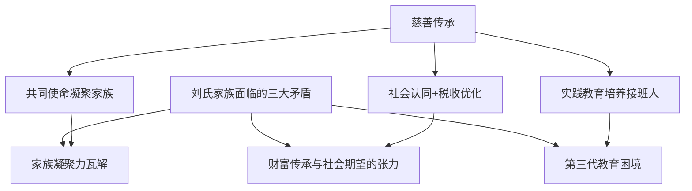
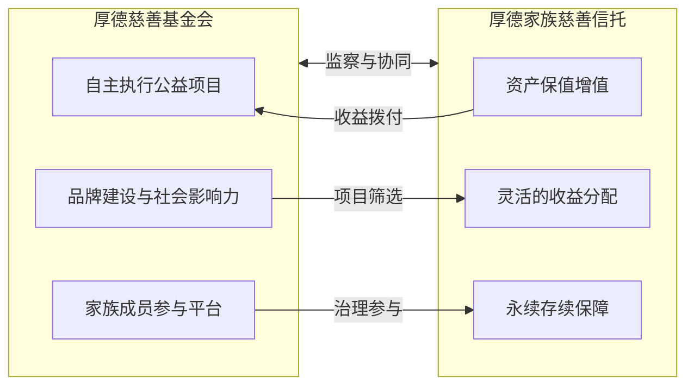

## 案例六：刘氏家族的慈善传承——用公益撬动家族永续

### 案例背景

#### 家族画像

刘氏家族是中国南方某省的制造业巨头，家族第一代刘德厚（化名）在改革开放初期创办了一家五金加工厂，经过三十年的发展，企业已扩展为涵盖精密制造、新材料、智能装备三大板块的综合性集团，年营收超过60亿元，员工4000余人。

刘德厚育有三名子女：

- **长子刘承志**（45岁）：海外MBA毕业，已在集团担任总裁五年，是外界公认的接班人选
- **次女刘承慧**（42岁）：医学博士，三甲医院副主任医师，对家族企业不感兴趣但关心家族事务
- **幼子刘承远**（36岁）：连续创业者，自己创办了两家科技公司，独立性最强

#### 核心挑战

2019年，刘德厚在一次体检中发现早期肺部问题（后确认为良性），这次健康危机让他认真审视家族传承的现状，发现了三个深层矛盾：

**矛盾一：家族凝聚力正在瓦解。** 三个子女各自发展，对家族事务的参与度越来越低。家族聚会从每月一次变成每年春节才有一次。长子认为弟妹不关心企业，弟妹觉得大哥独揽大权。刘德厚意识到，如果没有一个共同的"锚点"，家族资产再丰厚也可能因离心力而分崩离析。

**矛盾二：财富传承与社会期望的张力。** 刘氏家族在当地有较高知名度，企业享受过地方政府的政策扶持。如果将数十亿资产完全私有传承，可能面临社会舆论压力，尤其在共同富裕的政策背景下。刘德厚需要一种既能传承家族财富、又能获得社会认同的方式。

**矛盾三：第三代教育的困境。** 刘德厚有五个孙辈，年龄从8岁到16岁不等。他观察到富裕家庭第三代常见的问题——物质过度满足导致缺乏进取心。如何让孙辈理解财富的意义，而不是只学会挥霍？

#### 为什么选择慈善传承

刘德厚在研究了多个中外家族案例后，发现慈善传承恰好能同时回应这三个矛盾：

1. **凝聚功能**：共同的慈善使命能让家族成员围绕一个超越个人利益的目标团结起来
2. **社会功能**：合法的慈善安排既能回馈社会赢得尊重，又能享受税收优惠
3. **教育功能**：参与慈善项目是培养下一代责任感和领导力的最佳途径

### 慈善传承方案设计

#### 第一层：家族慈善基金会

**设立架构**

2020年初，刘德厚家族发起设立了"厚德慈善基金会"（化名），初始捐赠资产为人民币5000万元现金加上价值1500万元的两处商铺（商铺租金收入作为基金会的持续性收入来源）。

基金会选择在省民政厅登记为非公募基金会，原始基金不低于全国性非公募基金会的200万元法定门槛，远超标准以确保运作空间。

**治理结构**

| 职位 | 人选 | 职责 | 任期 |
|------|------|------|------|
| 理事长 | 刘德厚（创始阶段） | 战略方向、重大决策、对外代表 | 5年 |
| 副理事长 | 刘承志 | 日常运营监督、企业资源对接 | 5年 |
| 理事 | 刘承慧 | 医疗健康类公益项目审核 | 3年 |
| 理事 | 刘承远 | 科技教育类公益项目审核 | 3年 |
| 理事 | 外部专家（法律） | 合规审查、风险控制 | 3年 |
| 理事 | 外部专家（财务） | 财务审计、税务筹划 | 3年 |
| 监事 | 刘承慧配偶 | 独立监督、制衡权力 | 3年 |

关键设计原则：

- **家族成员占多数但不独占**：5名家族成员+2名外部专家，确保专业性与独立性
- **权力制衡**：设立监事职位，由非核心家族成员担任
- **明确的退出机制**：理事任期三年可连任，但连续任职不得超过三届
- **重大决策需2/3多数通过**：防止任何一人独断

#### 第二层：家族慈善信托

**为什么基金会还不够**

基金会虽然提供了制度框架，但存在几个局限：

- 年度公益支出不得低于上年基金余额的8%（《基金会管理条例》要求），对现金流有压力
- 投资渠道受限，资产增值空间有限
- 行政管理成本较高（专职人员、办公场地、年检审计）

刘德厚的财富顾问建议在基金会之外，额外设立一个慈善信托，形成"基金会+慈善信托"的双轨架构。

**慈善信托架构**

2021年，刘德厚以个人名义设立了"厚德家族慈善信托"，具体安排如下：

| 要素 | 具体安排 |
|------|----------|
| 委托人 | 刘德厚 |
| 受托人 | 某信托公司（持牌金融机构） |
| 信托财产 | 人民币3000万元现金 |
| 信托期限 | 永续（无固定终止日） |
| 信托目的 | 教育扶贫、乡村医疗、青年创业扶持 |
| 受益人 | 符合条件的社会公众（非特定个人） |
| 监察人 | 厚德慈善基金会（代表家族监督信托运作） |
| 信托报酬 | 信托财产年净值的0.5% |
| 收益分配 | 每年不低于信托财产净值的5%用于公益支出 |

**双轨架构的优势**

基金会负责"做事"——策划和执行具体的公益项目；慈善信托负责"管钱"——通过专业信托公司进行资产配置和增值。两者互相监督、互相补充。

#### 第三层：慈善与商业的融合

刘德厚没有把慈善仅仅当作"花钱做好事"，而是将其融入企业战略：

**企业社会责任（CSR）与业务协同**

集团的精密制造板块与职业院校合作，设立了"厚德工匠奖学金"，每年资助100名贫困学生学习精密加工技术。这些学生毕业后优先进入刘氏集团工作，既解决了社会就业问题，也为企业培养了技能人才。这是一个"公益+商业"双赢的经典设计。

**社会影响力投资**

通过基金会下设的社会影响力投资基金，刘德厚投资了三家社会企业：

- 一家为残疾人提供远程数据标注工作的科技公司
- 一家在农村地区推广太阳能灌溉系统的农业科技公司
- 一家培训贫困妇女制作手工艺品并在线销售的电商平台

这些投资的目标不是最大化财务回报，而是实现可量化的社会影响，同时保持本金的可持续性——年化回报率在3%-5%之间，低于商业投资但高于银行存款，且产生了远超财务指标的社会价值。

### 家族治理与传承制度

#### 家族宪法中的慈善条款

刘德厚主导制定了刘氏家族的第一部《家族宪法》，其中专门设立了"慈善传承"章节，核心条款包括：

**第一条：慈善承诺**

> 刘氏家族承诺将每年税前利润的3%持续投入慈善事业，此承诺不受家族企业经营状况波动的影响。如企业利润下降，慈善投入以家族净资产的0.5%为最低保障。

**第二条：家族成员参与义务**

> 每位成年家族成员每年须至少投入40小时参与家族慈善项目。25岁以下成员可通过参与项目策划满足此要求；25岁以上成员须至少参与一次一线执行。

**第三条：第三代培养计划**

> 家族第三代成员在年满16岁时，须参与一个为期一年的慈善项目实习。实习内容包括需求调研、方案设计、执行管理和效果评估四个阶段。完成实习是其未来参与家族资产管理的前提条件。

**第四条：慈善优先权**

> 当家族面临资产分配争议时，慈善基金部分不受争议影响。任何家族成员不得要求将慈善基金转为私人用途。

#### 第三代培养的实际运作

刘德厚的慈善传承方案中最令人称道的部分，是第三代培养计划的精心设计。

**16岁慈善实习计划**

| 阶段 | 时长 | 内容 | 能力培养 |
|------|------|------|----------|
| 需求调研 | 3个月 | 深入贫困社区，访谈受助对象，撰写调研报告 | 同理心、调研能力、写作能力 |
| 方案设计 | 3个月 | 基于调研结果设计公益项目方案，包括预算、时间表、评估指标 | 项目管理、逻辑思维、预算能力 |
| 执行管理 | 3个月 | 带队执行项目，管理志愿者团队，处理突发问题 | 领导力、沟通能力、应变能力 |
| 效果评估 | 3个月 | 收集数据、评估项目效果、撰写结项报告并向家族理事会汇报 | 数据分析、批判思维、演讲能力 |

刘德厚的大孙女刘若兰（化名）是第一个完成实习计划的第三代成员。她在实习中负责了一个乡村图书角项目，从选址、采购图书、招募志愿者到运营维护全程参与。项目最终覆盖了三个村庄，服务了200多名留守儿童。

刘若兰后来在大学申请文书中写道："在村里，我第一次理解了爷爷说的'财富是社会对你的信任'这句话的含义。那些孩子拿到新书时的眼神，比任何一门商学院课程都让我学到更多。"

这段经历帮助她成功申请到了海外顶尖大学的录取，也让她成为第三代中对家族事务最积极的参与者。

#### 家族会议制度

| 会议类型 | 频率 | 参与人 | 核心议题 |
|----------|------|--------|----------|
| 家族年会 | 每年1次 | 全体家族成员 | 年度慈善报告、战略方向审议、重大人事任命 |
| 理事会会议 | 每季度1次 | 基金会理事 | 项目审批、预算审议、效果评估 |
| 第三代工作坊 | 每半年1次 | 第三代成员+导师 | 慈善项目学习、领导力培训、经验分享 |
| 家庭日 | 每月1次 | 全体家族成员 | 非正式交流、项目探访、家庭建设 |

### 实施过程中的关键节点

#### 节点一：长子的抵触

方案推行初期，最大的阻力来自长子刘承志。他担心慈善基金会会稀释家族对企业资产的控制权——"每年几千万投到慈善里，这些钱本来可以用来扩大再生产。"

刘德厚的回应策略不是说服，而是数据：

1. 他让财务团队计算了慈善捐赠带来的税收减免：以企业所得税25%计算，每年2000万的公益性捐赠可抵扣应纳税所得额，直接节税约500万元
2. 他分析了品牌价值的提升：慈善项目带来的媒体曝光和社会好感度，折算为广告价值约800万-1200万元/年
3. 他引用了ESG（环境、社会与治理）投资趋势：越来越多的大型采购商将供应商的社会责任表现纳入评估体系，慈善投入实际上是在增强企业的商业竞争力

刘承志最终被说服，后来成为慈善基金会最积极的执行者之一。

#### 节点二：专业团队的搭建

最初的慈善项目由家族成员兼职管理，效果不佳。一个乡村教育项目因为缺乏专业评估，投入了80万元但成效甚微。刘德厚随后做出了三个关键决策：

1. **招聘专职秘书长**：年薪60万聘请了一位有十年公益行业经验的专业人士担任基金会秘书长
2. **引入第三方评估**：每年委托专业机构对所有公益项目进行独立评估
3. **建立项目管理系统**：使用公益行业标准的项目管理工具，对每个项目设定KPI并跟踪执行

#### 节点三：家族内部的权力平衡

当慈善基金会运营三年后，一个问题浮现：长子掌控企业运营，次女负责医疗公益项目，幼子负责科技教育项目——表面上各有分工，实际上长子因为控制着企业的慈善预算，话语权远超其他两人。

刘德厚通过两项制度设计化解了这个矛盾：

1. **独立预算制度**：基金会的慈善预算独立于企业利润分配，由理事会投票决定用途，企业总裁无权干预
2. **项目认领制**：每个家族成员可以独立认领公益项目，拥有该项目的完整管理权，不受其他成员干涉

### 成果数据

#### 财务成果

| 指标 | 第1年（2020） | 第3年（2022） | 第5年（2024） | 累计 |
|------|--------------|--------------|--------------|------|
| 慈善总投入 | 2,200万元 | 3,100万元 | 3,800万元 | 1.52亿元 |
| 其中基金会支出 | 1,500万元 | 2,000万元 | 2,400万元 | 9,200万元 |
| 其中信托分配 | 700万元 | 1,100万元 | 1,400万元 | 6,000万元 |
| 税收减免 | 550万元 | 775万元 | 950万元 | 3,800万元 |
| 社会影响力投资回报 | — | 180万元 | 320万元 | 500万元 |

#### 社会成果

| 指标 | 数据 |
|------|------|
| 资助贫困学生 | 2,800名 |
| 乡村图书角覆盖 | 45个村庄 |
| 免费健康筛查 | 12,000人次 |
| 扶持社会企业 | 8家 |
| 创造就业岗位 | 350个（含残疾人岗位80个） |
| 家族成员志愿服务时长 | 累计6,200小时 |

#### 家族凝聚成果

| 指标 | 方案实施前 | 方案实施5年后 |
|------|----------|--------------|
| 家族聚会频率 | 每年1次 | 每月1次+季度会议 |
| 第三代对家族事务参与度 | 几乎为零 | 5人中4人主动参与 |
| 家族成员之间的信任评分（自评1-10分） | 4.2分 | 7.8分 |
| 家族成员对"家族认同感"的评分 | 3.5分 | 8.1分 |

### 可复制的经验与普适规律

#### 经验一：慈善不是"花钱"，而是"投资"

刘氏家族的慈善传承之所以成功，根本原因在于刘德厚从一开始就把它定位为一种投资——投资于家族凝聚力、社会资本、品牌价值和第三代人才。这种定位让家族成员不再把慈善视为"损失"，而是"回报丰厚的长期投资"。

具体的回报包括：

- **税收回报**：每年节省数百万税款，长期来看慈善投入的"税后成本"远低于账面金额
- **品牌回报**：媒体正面报道、社会好感度提升、政府关系改善，这些都有隐性商业价值
- **人才回报**：通过工匠奖学金等项目为企业培养了忠实的技能人才
- **家族回报**：第三代在慈善实习中培养的能力和价值观，是花再多学费也买不到的

#### 经验二：制度化是慈善传承的生命线

很多中国家族的慈善行为是"老板说了算"——企业家一人的善心决定了家族慈善的方向和规模。这种方式在企业家在位时效果显著，但一旦企业家退出或去世，慈善往往随之中断。

刘氏家族的制度化设计确保了慈善的永续性：

1. **法律架构保障**：基金会和慈善信托都是独立法人，不受个人变故影响
2. **治理结构保障**：理事会集体决策，不依赖任何单一个人
3. **家族宪法保障**：慈善义务写入家族最高文件，所有成员必须遵守
4. **预算制度保障**：慈善投入有最低保障线，不因企业经营波动而取消

#### 经验三：让每个家族成员找到自己的"慈善角色"

刘氏家族的慈善方案不是让所有人做同一件事，而是让每个人根据自己的专业和兴趣找到参与方式：

- 刘承志：利用企业管理能力监督基金会运营
- 刘承慧：利用医学背景审核医疗健康类项目
- 刘承远：利用科技创业经验孵化社会企业
- 第三代：通过实习计划获得全面锻炼

这种"各展所长"的设计，让慈善成为连接家族成员的纽带，而不是额外的负担。

#### 经验四：慈善传承需要"商业思维"

刘氏家族的慈善不是简单的"捐款了事"，而是引入了商业化管理方法：

- 每个项目都有明确的KPI和评估标准
- 社会影响力投资追求"财务可持续+社会可量化"
- 基金会引入了专业的项目管理系统
- 定期进行第三方独立评估

这种"以商业的严谨做公益"的理念，确保了每一分钱都产生了最大化的社会影响。

### 常见误区与风险警示

#### 误区一：把慈善当作避税工具

有些家族设立慈善基金会的唯一目的是避税。这种做法存在巨大风险：

- 《慈善法》明确规定慈善财产必须用于公益目的，挪用将面临法律追究
- 税务机关对慈善捐赠的税前扣除有严格审核，虚假申报将被追缴税款并处以罚款
- 一旦被曝光"假慈善真避税"，对家族声誉的损害远超节省的税款

**正确做法**：以真实的社会需求为导向设计慈善项目，税收优惠是合法的附带收益，而非主要目的。

#### 误区二：慈善投入过多影响主业

刘德厚在设计方案时设定了一个"安全线"：慈善投入不超过家族净资产的1.5%、不超过企业年净利润的5%。这个比例既能产生显著的社会影响，又不会对主业造成压力。

**关键原则**：慈善传承的前提是家族主业的健康发展。没有健康的主业，慈善就是无源之水。

#### 误区三：忽视家族成员的真实意愿

有些家族领袖一厢情愿地设计慈善方案，没有充分征求其他家族成员的意见，导致执行时阻力重重。刘德厚的做法值得借鉴：

- 方案设计阶段就邀请所有成年家族成员参与讨论
- 给每个人选择自己感兴趣领域的自由
- 通过第三代培养计划让年轻人从"被动参与"变成"主动投入"

#### 误区四：只设立不管理

设立基金会和慈善信托只是开始，持续的有效管理才是关键。常见问题包括：

- 理事会形同虚设，重大决策仍然是"一个人说了算"
- 项目缺乏评估，投入大量资金但无法证明效果
- 财务管理不规范，引发审计问题甚至法律风险

### 与其他传承工具的协同

刘氏家族的慈善传承不是孤立存在的，而是与家族的整体传承规划紧密配合：

| 传承工具 | 与慈善传承的关系 |
|----------|----------------|
| 家族信托 | 管理家族核心资产，慈善信托管理公益资产，两者互相独立但治理结构协同 |
| 持股平台 | 企业股权通过持股平台传承给家族成员，慈善基金会不持有企业股权，避免利益冲突 |
| 保险规划 | 大额人寿保险的受益人之一为慈善信托，确保企业家身故后仍有慈善资金来源 |
| 家族宪法 | 慈善义务写入家族宪法，成为家族治理的核心组成部分 |
| 遗嘱 | 遗嘱中明确慈善基金的安排，防止继承纠纷影响慈善事业 |

### 进阶思考：慈善传承的长期主义

刘氏家族的案例揭示了一个更深层的逻辑：在共同富裕的时代背景下，慈善传承不仅是一种道德选择，更是一种战略智慧。

从全球趋势看，那些延续百年的家族——洛克菲勒、福特、比尔·盖茨——无一不是通过慈善建立了超越商业的社会影响力。慈善让他们从"有钱人"变成了"有影响力的人"，这种影响力反过来又保护和增值了家族的财富。

对于中国家族而言，慈善传承还有特殊的时代意义：

1. **政策环境**：共同富裕政策鼓励先富群体回馈社会，主动的慈善安排比被动的税收调节更优雅
2. **社会期望**：公众对企业家的社会责任期望越来越高，有规划的慈善能有效管理这一期望
3. **家族教育**：在物质极大丰富的环境下，慈善是防止第三代"纨绔化"的最有效手段
4. **永续传承**：商业帝国可能因市场变化而衰落，但以慈善基金形式存在的社会影响力可以永续存续

> 刘德厚在家族年会上说过一句话："我留给你们的不应该只是一个赚钱的企业，而是一个值得你们为之奋斗的使命。企业可能倒，但使命不会。"
>
> 这或许就是慈善传承的终极价值——它让财富有了灵魂，让家族有了超越金钱的凝聚力。

