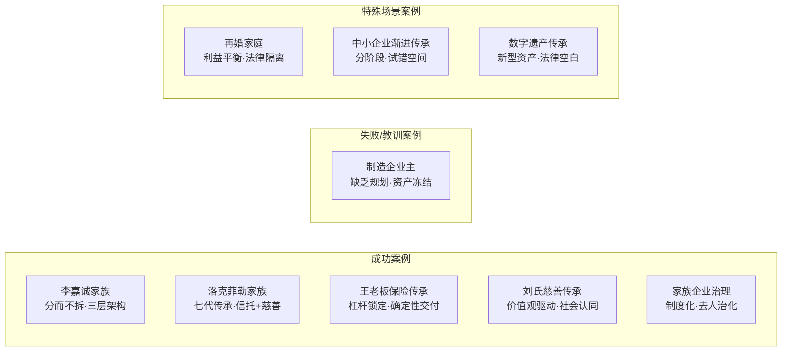
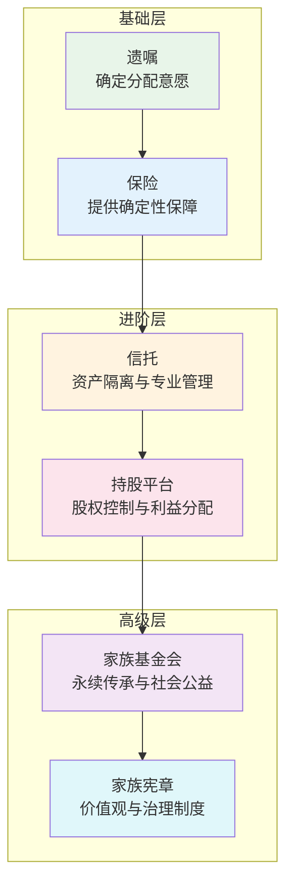
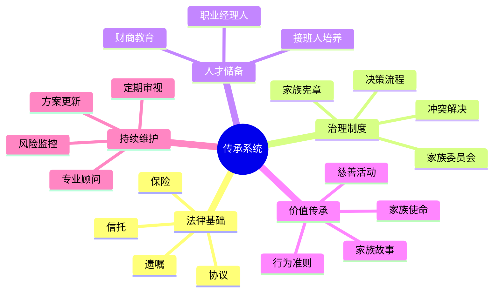

## 案例总结与规律提炼

前面九个案例横跨超级富豪家族（李嘉诚、洛克菲勒）、中小企业主（制造企业、保险方案、渐进式传承）、特殊家庭结构（再婚家庭）、新型资产领域（数字遗产）以及家族治理议题（慈善传承、代际传承与治理），覆盖了从数亿到数百万、从百年布局到突发事件、从传统资产到数字资产的完整光谱。本节对这些案例进行深度交叉分析，提炼出跨越财富等级、家庭结构、资产类型的**通用规律与底层逻辑**。

***

### 一、九个案例的全景对比

在提炼规律之前，先对九个案例的核心要素进行结构化对比，建立全局视野。



| 维度 | 李嘉诚 | 洛克菲勒 | 制造企业主 | 王老板 | 再婚家庭 | 刘氏慈善 | 渐进传承 | 数字遗产 | 家族治理 |
|------|--------|----------|------------|--------|----------|----------|----------|----------|----------|
| **财富规模** | 千亿级 | 千亿级 | 千万级 | 千万级 | 百万至千万 | 千万级 | 百万至千万 | 不定 | 千万至亿 |
| **传承工具** | 信托+持股平台+遗嘱 | 家族信托+基金会+家族宪章 | 无规划 | 保险+保险金信托 | 遗嘱+协议+保险 | 慈善信托+基金会 | 股权渐进转让+保险 | 遗嘱+数字清单 | 家族委员会+宪章 |
| **核心风险** | 子女竞争 | 价值观稀释 | 资产冻结/企业瘫痪 | 保单设计缺陷 | 利益冲突/婚姻风险 | 慈善与商业冲突 | 接班人能力不足 | 法律空白/取证难 | 权力斗争 |
| **成功关键** | 提前布局·公平但不均分 | 制度>个人·价值观传承 | （失败案例） | 确定性杠杆 | 法律工具+情感沟通 | 使命感凝聚家族 | 循序渐进·留退路 | 清单化+技术手段 | 治理结构化 |
| **耗时** | 20年+ | 100年+ | N/A（未规划） | 2-3年 | 6-12个月 | 5年+ | 5-10年 | 1-3年 | 3-5年建立 |

***

### 二、成功传承的七大底层规律

通过对九个案例的交叉分析，可以提炼出以下七大规律。这些规律并非独立存在，而是相互交织、相互强化的系统性原则。

#### 规律一：提前规划是最大的杠杆

**案例佐证**：

- **李嘉诚**在两个儿子分别20多岁时就开始布局，通过长达20年的渐进式安排，确保传承过程平稳可控。到他正式退休时，整个架构已经运转多年，无需大规模调整。
- **洛克菲勒家族**从第一代约翰·D·洛克菲勒就开始建立信托架构，到第七代仍在受益。百年布局的回报是惊人的——家族财富不仅没有消散，反而持续增长。
- **制造企业主**（反面案例）在突发疾病前没有任何传承安排，企业资产与个人资产完全混同，导致遗产被冻结，企业运营陷入瘫痪，客户流失、员工离职、供应链断裂，短短一年内企业价值缩水超过60%。

**规律提炼**：

传承规划的时间杠杆效应极为显著。规划每提前一年，可选工具就多一层，成本就低一档，从容度就高一分。具体而言：

| 规划时机 | 可用工具 | 成本 | 从容度 | 典型结果 |
|----------|----------|------|--------|----------|
| 健康时主动规划 | 全部工具 | 正常 | 高 | 系统性方案，执行顺畅 |
| 体检发现问题后 | 大部分工具 | 略高 | 中 | 紧急方案，可能仓促 |
| 重病卧床后 | 有限工具 | 高 | 低 | 能力认定困难，方案受限 |
| 突发意外后 | 几乎无 | 极高 | 无 | 法定继承，纠纷概率极高 |

**实操建议**：

- 25岁起：至少立一份基础遗嘱
- 30岁起：配置基本的人寿保险
- 40岁起：全面审视传承方案，引入信托等工具
- 50岁起：建立家族治理制度，培养接班人
- 每3-5年或家庭重大变动时：全面更新方案

#### 规律二：工具组合优于单一工具

**案例佐证**：

- **王老板的保险传承方案**：虽然保险提供了确定性的杠杆，但仅靠保险无法解决所有问题——保险金的后续管理、防止子女一次性挥霍、应对通货膨胀等问题，需要信托来补充。最终方案是"保险+保险金信托"的组合。
- **再婚家庭**：仅靠遗嘱无法完全隔离前婚子女与现任配偶的利益冲突。最终方案是"遗嘱+婚前/婚后协议+保险+信托"的多层防护体系。
- **李嘉诚家族**：使用了"家族信托（顶层控制）+ 持股平台（中层隔离）+ 遗嘱（底层兜底）"的三层架构，每一层工具解决不同层面的问题。

**规律提炼**：

单一工具只能解决单一维度的问题。完整的传承方案需要工具矩阵：



| 工具 | 解决的问题 | 不能解决的问题 | 需要的补充工具 |
|------|------------|----------------|----------------|
| 遗嘱 | 谁得到什么 | 资产保护、专业管理、防挥霍 | 信托、保险 |
| 保险 | 确定性现金流 | 资产增值、大额资产管理 | 信托、投资组合 |
| 信托 | 资产隔离、专业管理、条件分配 | 情感凝聚、价值观传承 | 家族宪章、慈善 |
| 持股平台 | 股权不分散 | 日常经营管理 | 职业经理人、治理制度 |
| 家族宪章 | 价值观统一、规则透明 | 无法律强制力 | 法律工具（遗嘱、信托） |

**实操建议**：

根据资产规模选择工具组合层级：

- **100万以下**：遗嘱 + 基础保险（总成本约5000-2万元）
- **100-500万**：遗嘱 + 保险 + 保险金信托（总成本约3-10万元）
- **500-3000万**：遗嘱 + 保险 + 家族信托 + 持股平台（总成本约10-50万元）
- **3000万以上**：全套工具 + 家族宪章 + 家族办公室（总成本视规模而定）

#### 规律三：确定性比收益率更重要

**案例佐证**：

- **王老板的保险方案**之所以成功，核心不在于保险的收益率有多高（事实上保险的长期回报率通常低于股票投资），而在于保险提供了**法律层面的确定性**——保险金不受债务追偿、不进入遗产清算程序、可以指定受益人和分配比例。
- **洛克菲勒家族**的信托架构设计中，投资回报率不是第一优先级，**资产安全和代际可控**才是核心目标。信托条款中设置了大量保护性条款，宁可牺牲部分收益也要确保资产不被挥霍。
- **制造企业主**的失败根源之一，就是把所有精力放在企业经营（追求收益）上，完全忽略了传承规划（提供确定性）。

**规律提炼**：

传承的核心目标不是让资产增值（那是投资的事），而是确保资产**按照意愿**、在**可控的时间**、以**可控的方式**到达**正确的人**手中。这个目标的实现需要的是确定性，而不是高收益。

确定性来源的优先级：

1. **法律确定性** > 金融确定性：信托的法律隔离效力比保险的收益率更重要
2. **结构确定性** > 工具确定性：好的架构设计比选择哪个具体产品更重要
3. **意愿确定性** > 分配确定性：传承人的真实意愿被准确表达比具体分多少更重要

**实操建议**：

在设计传承方案时，始终以"最坏情况下的确定性"为第一考量：

- 如果继承人离婚，资产是否安全？
- 如果继承人负债，资产是否安全？
- 如果继承人挥霍，是否有保护机制？
- 如果继承人早逝，资产如何流转？
- 如果法律变更，方案是否仍然有效？

#### 规律四：价值观传承比资产传承更持久

**案例佐证**：

- **洛克菲勒家族**七代不衰的根本原因，不是信托架构设计得多么精妙（虽然确实精妙），而是家族建立了一套完整的价值观传承体系——节俭、勤奋、慈善、社会责任。每一代洛克菲勒家族成员从小接受的教育就是"财富是社会责任，不是个人特权"。
- **刘氏家族的慈善传承**：通过设立慈善信托和家族基金会，将家族成员凝聚在"回馈社会"的共同使命下。慈善成为家族认同的核心纽带，比单纯的资产分配更能激发家族凝聚力。
- **李嘉诚家族**的家训——"克勤克俭，永不放弃"——贯穿整个传承安排。他给两个儿子的不仅是资产分配方案，更是一套行为准则和思维方式。

**规律提炼**：

```text
资产传承 → 效果随时间递减（通货膨胀、分散消耗、后代挥霍）
价值观传承 → 效果随时间递增（代代强化、形成文化、自我约束）
```

价值观传承的三个层次：

| 层次 | 内容 | 载体 | 效果 |
|------|------|------|------|
| 行为规范层 | 节俭、勤奋、诚信 | 家训、榜样、日常教育 | 防止挥霍和道德风险 |
| 思维方式层 | 企业家精神、长期主义、风险管理 | 传承人培养计划、实习机制 | 培养接班人能力 |
| 使命认同层 | 家族存在的意义、社会责任 | 慈善活动、家族宪章、家族故事 | 凝聚力和方向感 |

**实操建议**：

- 建立家族故事库：记录家族创业史、重大决策、困难时刻，代代相传
- 设计家族仪式：定期的家族聚会、慈善活动、接班人培养计划
- 制定家族宪章：将价值观转化为可执行的行为规范和决策准则
- 将价值观嵌入工具：在信托条款中设置与价值观挂钩的分配条件（如完成学业、参与公益等）

#### 规律五：制度化是家族长期存续的基石

**案例佐证**：

- **李嘉诚家族**设立了家族委员会和家族办公室，重大决策不依赖个人判断，而是通过制度化的决策流程。即使李嘉诚本人退出经营，制度仍在运转。
- **洛克菲勒家族**从第三代开始就建立了完整的家族治理架构——家族大会、家族委员会、投资委员会、慈善委员会、教育委员会。每个委员会有明确的职责和决策流程，确保家族事务不会因为某个人的缺席而停滞。
- **家族企业的代际传承案例**中，成功实现传承的企业无一例外都建立了治理制度——董事会独立运作、职业经理人体系、家族成员任职规则。而失败的案例往往是因为"老爹说了算"的模式无法延续到下一代。

**规律提炼**：

"人治"模式的局限性：

```text
第一代：创始人魅力 → 高效决策 → 但过度依赖个人
第二代：继承人模仿 → 效率下降 → 难以复制第一代的权威
第三代：权威消散 → 家族内斗 → 企业/财富分崩离析
```

"制度化"模式的优势：

```text
第一代：建立制度 → 短期效率可能略低 → 但长期可持续
第二代：执行制度 → 决策有据可依 → 减少冲突
第三代：优化制度 → 代代完善 → 家族基业长青
```

**实操建议**：

家族治理制度的核心组件：

1. **家族宪章**：最高行为准则，涵盖家族愿景、成员权利义务、财富分配原则、冲突解决机制
2. **家族委员会**：3-7人的决策机构，负责日常家族事务
3. **专业委员会**：投资、慈善、教育等专项事务
4. **家族大会**：年度全体会议，重大事项表决
5. **接班人培养计划**：系统化的下一代培养体系
6. **冲突解决机制**：调解→仲裁→诉讼的逐级升级路径

#### 规律六：沟通是传承成功的隐形变量

**案例佐证**：

- **再婚家庭**的传承方案设计中，最大的挑战不是法律工具的选择，而是如何在前婚子女、现任配偶、共同子女之间达成共识。最终方案的成功，70%归功于前期的充分沟通，30%归功于法律架构设计。
- **刘氏家族**的慈善传承能够凝聚家族成员，关键在于每一代都参与了"家族财富应该如何使用"的讨论。讨论本身就是传承——在讨论中，价值观被传递、共识被建立、冲突被化解。
- **制造企业主**的失败案例中，不仅缺乏法律规划，更缺乏与家人的沟通。家庭成员对资产状况一无所知，在创始人突然离世后，各方因为信息不对称而产生严重的猜疑和冲突。

**规律提炼**：

传承规划中"沟通"的三层含义：

| 层次 | 内容 | 缺失的后果 | 实施方法 |
|------|------|------------|----------|
| 信息层 | 告知家人资产状况、遗嘱位置、关键联系人 | 资产"失踪"、遗嘱无法执行 | 建立"传承文件包"，定期更新 |
| 意愿层 | 表达传承安排的逻辑和期望 | 家人不理解、不接受安排 | 家庭会议、书面信件 |
| 共识层 | 与家人讨论并达成一致 | 执行时阻力大、纠纷多 | 家族大会、专业调解 |

**实操建议**：

- **立即做**：建立"传承文件包"——包含资产清单、遗嘱副本、保险合同、信托文件、关键联系人信息，存放在安全且家人知道的位置
- **3个月内做**：与配偶进行一次正式的传承话题沟通
- **1年内做**：召开一次家庭会议，讨论传承安排的基本框架
- **持续做**：每年至少一次家庭会议，更新信息、审视方案、化解分歧

#### 规律七：特殊场景需要特殊策略

**案例佐证**：

- **再婚家庭**：不能简单套用普通家庭的传承方案。需要在遗嘱中明确区分婚前财产和婚后共同财产，通过协议约定各方权益，利用保险和信托实现利益隔离。
- **数字遗产**：传统遗产工具（遗嘱、信托）在面对加密货币、社交媒体账号、数字内容版权、游戏装备等新型资产时，存在法律空白和执行困难。需要专门的数字遗产清单、技术交割方案和法律安排。
- **中小企业渐进传承**：不能照搬大企业的"一次性交接"模式。中小企业主往往"企业即家产"，需要渐进式地让接班人参与经营，逐步放权，同时建立退路机制。

**规律提炼**：

特殊场景的分类与应对策略：

| 场景类型 | 核心复杂性 | 策略原则 | 关键工具 |
|----------|------------|----------|----------|
| 再婚家庭 | 利益主体多、情感敏感 | 法律隔离 + 情感沟通双管齐下 | 婚前协议 + 遗嘱 + 信托 |
| 企业主传承 | 企业资产与家庭资产混同 | 先隔离后传承，分步实施 | 持股平台 + 保险 + 渐进交接 |
| 数字资产 | 法律空白、取证困难 | 清单化 + 技术手段 + 法律兜底 | 数字遗产清单 + 遗嘱附加条款 |
| 跨境资产 | 多法律体系、税务复杂 | 属地化规划 + 全球协调 | 离岸信托 + 专业税务顾问 |
| 慈善传承 | 商业与公益的平衡 | 使命驱动 + 专业运营 | 慈善信托 + 家族基金会 |

***

### 三、失败案例的五条致命教训

从制造企业主的失败案例以及各案例中暴露的风险点，可以提炼出五条致命教训。

#### 教训一：拖延——最常见的致命错误

超过60%的传承失败案例，根源在于**规划拖延**。拖延的原因包括：觉得自己还年轻、不吉利的心理暗示、不知道怎么规划、觉得太麻烦。

**数据对比**：

| 组别 | 规划时间 | 平均财富保全率 | 家庭纠纷发生率 |
|------|----------|----------------|----------------|
| 健康时主动规划 | 提前5-20年 | 85%-95% | <10% |
| 发现健康问题后规划 | 提前1-3年 | 60%-80% | 20%-30% |
| 突发事件后被动处理 | 无提前规划 | 30%-50% | >60% |

**对策**：把传承规划当作"家庭财务体检"的常规项目，就像每年体检一样自然。

#### 教训二：资产混同——企业主的通病

将企业资产与个人资产、家庭资产完全混同，是中国中小企业主最普遍也最危险的做法。一旦企业出现债务纠纷或创始人离世，所有资产都可能被冻结或追偿。

**正确做法**：

- 设立持股平台（有限合伙企业），将股权与个人资产隔离
- 企业经营资金与家庭生活资金严格分开
- 定期将企业利润通过合法渠道（分红、薪酬）转入家庭资产
- 为家庭核心资产（住房、保险、信托）建立独立的法律保护

#### 教训三：只分不教——传承的"半吊子"

很多传承安排只解决了"钱给谁"的问题，完全没有考虑"接班人是否有能力管理这笔钱"。大额资产突然到一个缺乏财务素养的人手中，结果往往是灾难性的。

**正确做法**：

- 接班人培养应从青少年时期开始：财商教育、实习机会、小额投资实践
- 信托条款中设置渐进式分配：25岁获得10%，30岁获得20%，35岁获得剩余部分
- 设置"保护人"角色：在接班人能力不足时，由保护人代为监督资产使用
- 鼓励接班人先创业、先工作，建立独立的事业和财务能力

#### 教训四：忽视婚姻风险——最隐蔽的财富漏洞

子女的婚姻变动可能导致家族财富大幅外流。根据《民法典》，婚后继承的财产原则上属于夫妻共同财产（除非遗嘱或赠与合同中明确指定只归一方所有）。

**数据警示**：

- 中国离婚率已超过40%（部分城市）
- 离婚诉讼中涉及财产分割的案件占比超过70%
- 家族财富因子女离婚外流的案例中，平均损失比例约为30%-50%

**正确做法**：

- 在遗嘱中明确写明"遗产归XX个人所有，不作为夫妻共同财产"
- 通过信托实现资产隔离，信托资产不属于任何个人的婚姻财产
- 鼓励子女签订婚前/婚后财产协议（虽然在中国文化中敏感，但确实有效）
- 保险受益人指定为个人，保险金原则上不属于夫妻共同财产

#### 教训五：方案固化——一次规划管一生的幻觉

传承方案不是一劳永逸的。家庭结构在变、资产规模在变、法律环境在变、经济形势在变，方案也需要随之调整。

**触发更新的关键事件**：

- 家庭成员出生、死亡、婚姻变动
- 资产重大变化（大幅增值或减值、新投资、出售资产）
- 法律法规重大修订（继承法修订、税法变化、信托法完善）
- 经济环境重大变化（市场崩盘、汇率剧烈波动、通胀恶化）
- 个人意愿变化

**正确做法**：

- 建立定期审视机制：每3-5年全面审视一次
- 指定"传承方案维护人"（可以是律师或家族办公室），负责跟踪变化并提醒更新
- 在方案中预设调整触发条件，而非硬性规定

***

### 四、不同资产规模的传承策略矩阵

综合九个案例的经验，按照资产规模分层，给出差异化的传承策略建议。

#### 100万以下：基础防护型

**核心目标**：确保资产不因意外流失，指定受益人

| 工具 | 用途 | 成本 | 优先级 |
|------|------|------|--------|
| 自书遗嘱 | 明确分配意愿 | 0元 | 最高 |
| 定期寿险 | 为家庭提供确定性保障 | 数百至数千元/年 | 高 |
| 受益人指定 | 银行账户、保险、公积金指定受益人 | 0元 | 高 |
| 数字遗产清单 | 记录账号密码和资产 | 0元 | 中 |

#### 100-500万：安全进阶型

**核心目标**：资产隔离 + 确定性保障 + 基本的条件分配

| 工具 | 用途 | 成本 | 优先级 |
|------|------|------|--------|
| 公证遗嘱 | 增强法律效力 | 数千元 | 最高 |
| 大额寿险 | 杠杆式传承 + 避债功能 | 数万元/年 | 高 |
| 保险金信托 | 条件分配 + 资产隔离 | 3-10万元设立费 | 高 |
| 遗嘱执行人 | 确保遗嘱顺利执行 | 视情况而定 | 中 |

#### 500-3000万：系统防御型

**核心目标**：多层次资产保护 + 家族治理 + 接班人培养

| 工具 | 用途 | 成本 | 优先级 |
|------|------|------|--------|
| 家族信托 | 核心资产隔离与管理 | 10-50万元设立费 | 最高 |
| 持股平台 | 股权集中控制 | 5-20万元 | 高 |
| 家族保险方案 | 确定性现金流 + 税务优化 | 规模而定 | 高 |
| 家族宪章 | 价值观与规则制度化 | 3-10万元 | 中 |
| 接班人培养计划 | 系统化培养下一代 | 视内容而定 | 中 |

#### 3000万以上：全面传承型

**核心目标**：永续传承 + 社会影响力 + 家族基业长青

| 工具 | 用途 | 成本 | 优先级 |
|------|------|------|--------|
| 家族办公室 | 全方位财富管理 | 年运营费50-200万 | 最高 |
| 家族信托（多层） | 不同目的的多个信托 | 视规模而定 | 最高 |
| 家族基金会 | 慈善传承 + 税务优化 + 社会影响力 | 100万+设立费 | 高 |
| 离岸架构 | 跨境资产保护与税务规划 | 视复杂度而定 | 高 |
| 家族宪章+治理体系 | 完整的家族治理制度 | 20-50万 | 高 |

***

### 五、九个案例的可迁移经验清单

将九个案例的核心经验转化为可直接使用的检查清单：

**从李嘉诚案例学到的**：
- [ ] 传承安排应在继承人成年后尽早启动
- [ ] "分而不拆"——资产分开但不分散控制权
- [ ] 公平不等于均分——根据能力和发展方向差异化分配
- [ ] 三层架构（信托→持股平台→遗嘱）逐层防护

**从洛克菲勒案例学到的**：
- [ ] 建立家族治理制度，让制度代替个人决策
- [ ] 价值观传承是家族长青的根本
- [ ] 慈善是凝聚家族、建立社会认同的有效手段
- [ ] 接班人培养需要系统化、长期化的安排

**从制造企业主失败案例学到的**：
- [ ] 企业资产与家庭资产必须隔离
- [ ] 不能把所有鸡蛋放在一个篮子里（企业=全部家产）
- [ ] 传承规划不能等到"明天"——明天可能永远不会来
- [ ] 指定遗嘱执行人，避免遗产无人管理

**从王老板保险方案学到的**：
- [ ] 保险是传承中确定性最高的工具之一
- [ ] 保险金信托可以解决保险金"一次性给付"的缺陷
- [ ] 保单设计（投保人、被保险人、受益人）需要专业规划
- [ ] 保险不是万能的——需要与其他工具组合使用

**从再婚家庭案例学到的**：
- [ ] 复杂家庭结构需要更精密的法律架构
- [ ] 婚前/婚后财产协议是必要的保护工具
- [ ] 遗嘱中必须明确区分个人财产和共同财产
- [ ] 情感沟通和法律工具同等重要

**从刘氏慈善传承案例学到的**：
- [ ] 慈善信托和基金会可以成为家族凝聚力的核心
- [ ] 价值观传承需要具体的载体和活动
- [ ] 慈善活动可以为下一代提供"非财富"的成就感来源
- [ ] 慈善与商业并不矛盾——善因营销、社会影响力投资都是结合点

**从中小企业渐进传承案例学到的**：
- [ ] 传承不是"一天交班"，而是"多年渐进"
- [ ] 给接班人试错的空间和退路
- [ ] 职业经理人可以作为过渡期的桥梁
- [ ] 传承计划应包含"失败预案"——如果接班人不行怎么办

**从数字遗产案例学到的**：
- [ ] 建立数字资产清单（平台、账号、价值、交割方式）
- [ ] 加密货币的私钥和助记词必须有安全的传承机制
- [ ] 社交媒体账号、数字内容版权的传承需要提前了解平台规则
- [ ] 在遗嘱中增加数字遗产的附加条款

**从家族企业治理案例学到的**：
- [ ] 董事会独立运作是企业传承的关键
- [ ] 家族成员进入企业需要满足明确的任职资格
- [ ] 职业经理人体系与家族控制权并不矛盾
- [ ] 定期的家族-企业联合会议有助于协调利益

***

### 六、规律总结：一句话版本

如果将九个案例的所有教训浓缩为一句话，那就是：

> **传承不是"给钱"，而是"建系统"——一个在你不在之后仍能运转的、保护你的财富和家人福祉的系统。**

这个系统的核心组件：



九个案例的共同启示：**越早开始、越系统化、越注重制度而非个人、越重视沟通和教育，传承的成功概率就越高。**

***

### 七、从案例到行动：你的下一步

基于以上规律提炼，无论你处于哪个财富等级、哪种家庭结构，都可以从以下三步开始行动：

**第一步：盘点现状（本周完成）**

- 列出所有资产和负债
- 标注每项资产的权属人和受益人
- 识别当前最大的风险点

**第二步：选择工具组合（本月完成）**

- 根据资产规模选择合适的工具层级
- 咨询专业律师或理财师
- 起草至少一份基础遗嘱

**第三步：建立制度（本年完成）**

- 与配偶/家人进行一次正式的传承沟通
- 开始培养下一代的财务意识
- 建立传承文件包并指定保管人

传承规划的最大敌人不是复杂的法律工具，而是"明天再说"的拖延心态。从今天开始，哪怕只是写一份最简单的遗嘱，都是向正确方向迈出的关键一步。
