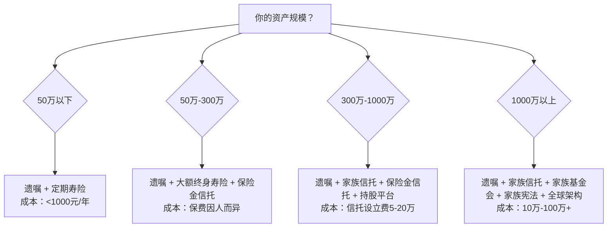
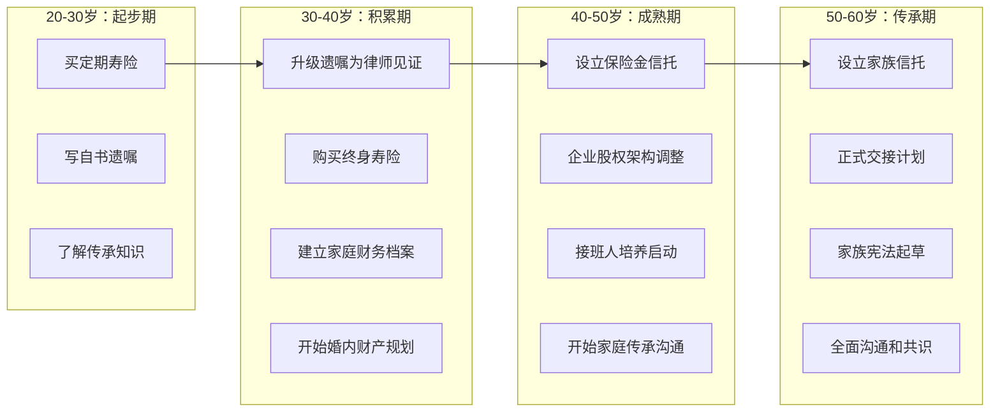

## 行动建议：从今天开始你的传承规划

前面九个案例，从李嘉诚的教科书级安排到洛克菲勒的百年传奇，从制造企业主的惨痛教训到数字遗产的全新探索——每一个故事都在回答同一个问题：**传承这件事，到底该怎么做？**

答案不是某一个工具、某一份文件，而是一套**可执行的行动体系**。本节将前面所有案例的经验教训提炼为具体可操作的行动清单，按照"紧急程度"和"资产规模"两个维度，给出分层分级的行动指南。

---

### 一、立即行动：传承规划的"急救包"（本周完成）

无论你是25岁还是55岁，无论你有10万还是1000万，以下四项行动**今天就可以开始**，成本几乎为零，但可能避免数十万甚至数百万的损失。

#### 1.1 盘点你的全部资产

大多数人并不真正清楚自己拥有什么。传承规划的第一步，是建立一份**完整的资产清单**。

**具体操作：**

打开一个Excel表格，按以下分类逐项填写：

| 资产类别 | 具体项目 | 当前价值（元） | 权属状态 | 备注 |
|----------|----------|---------------|----------|------|
| **不动产** | 自住房产 | 市场估值 | 产权人是谁？有无贷款？ | 房产证号 |
| | 投资房产 | 市场估值 | 产权人是谁？有无贷款？ | |
| **金融资产** | 银行存款 | 精确金额 | 哪些银行？几个账户？ | 含定期、活期、大额存单 |
| | 股票/基金 | 当前市值 | 在哪个券商？ | 含A股、港股、美股 |
| | 理财产品 | 本金+预期收益 | 哪家银行/平台？ | 到期日 |
| | 保险 | 现金价值+保额 | 投保人/被保人/受益人？ | 保单号 |
| **企业资产** | 股权 | 持股比例×估值 | 工商登记的持股人？ | 公司名称、统一社会信用代码 |
| | 合伙份额 | 出资比例 | 协议约定？ | |
| **数字资产** | 加密货币 | 市值 | 钱包地址？私钥在哪？ | 冷钱包/热钱包/交易所 |
| | 网络账号 | 有变现价值的 | 注册信息 | 支付宝、微信、游戏账号等 |
| **其他** | 车辆 | 估值 | 车主是谁？ | |
| | 债权 | 金额 | 借条在哪？谁出的？ | |
| | 知识产权 | 估值 | 权利人？ | 专利、商标、版权 |

**关键提醒：**

- 不要遗漏"看不见的资产"：支付宝余额、微信零钱、各类App账户余额、未提现的收益
- 保险信息特别重要：很多人买了保险但家人不知道，理赔金就白白浪费了
- 共有资产要标注：哪些是婚前个人财产，哪些是夫妻共同财产
- 负债也要列：房贷、车贷、信用卡欠款、担保责任，都是传承中的"减项"

#### 1.2 确认你的法定继承人

根据《民法典》第1127条，法定继承人的范围和顺序是：

```text
第一顺序：配偶、子女、父母
第二顺序：兄弟姐妹、祖父母、外祖父母

继承开始后，由第一顺序继承人继承，第二顺序继承人不继承。
没有第一顺序继承人继承的，由第二顺序继承人继承。
```

**你需要确认的事实：**

1. 你的婚姻状况：已婚/离异/再婚？婚姻关系是否合法登记？
2. 你的子女情况：亲生子女？养子女？继子女？非婚生子女？——法律规定他们享有**同等继承权**
3. 你的父母情况：是否健在？是否有其他子女（你的兄弟姐妹）？
4. 是否存在特殊情况：胎儿（遗产分割时应保留份额）、代位继承（子女先于你去世）

**为什么这一步很重要：**

案例五（再婚家庭）告诉我们，法定继承的结果可能完全不是你想要的——如果你再婚但没有遗嘱，你的现任配偶和你的前婚子女将"共享"你的遗产，而且现任配偶作为第一顺序继承人，可能分走相当大的比例。

#### 1.3 写一份自书遗嘱

即使你之后要做信托、买保险，一份**基本的自书遗嘱**也是所有传承方案的"兜底保障"。

**自书遗嘱的法律要求（《民法典》第1134条）：**

1. 遗嘱人**亲笔书写**全文（不能打印、不能代写）
2. 注明年、月、日
3. 亲笔签名

**模板参考：**

```text
遗    嘁

立遗嘱人：[姓名]，[性别]，[出生年月日]，身份证号码：[号码]，
住址：[地址]。

本人头脑清醒，具有完全民事行为能力，特立此遗嘱，对本人所有
的财产作如下处分：

一、房产
位于[地址]的房产（房产证号：[号码]），由[继承人姓名]
（身份证号：[号码]）继承。

二、存款
本人在[银行名称]账户（账号：[号码]）中的存款，由[继承人
姓名]继承。

三、[其他资产项目]
[具体安排]

四、特别说明
[如有附条件或特殊安排，在此说明]

本遗嘱为本人真实意思表示，未受任何胁迫或欺骗。

立遗嘱人（签名）：
年    月    日
```

**常见错误提醒：**

- ❌ 只写"所有财产归某某"——不够具体，可能引发争议
- ❌ 忘记签名或日期——遗嘱无效
- ❌ 夫妻合写一份遗嘱——每人必须独立立遗嘱
- ❌ 把不属于自己的财产写进遗嘱——该部分无效
- ❌ 未给缺乏劳动能力又没有生活来源的继承人保留必要份额——违反"必留份"规定，该部分无效

**进阶建议：**

自书遗嘱是最低成本的起步方案，但存在被质疑笔迹、精神状态等风险。资产超过50万的家庭，建议在自书遗嘱的基础上，增加以下任意一种强化手段：

- **律师见证遗嘱**：两名无利害关系的见证人在场，遗嘱人和见证人每页签名注明日期
- **公证遗嘱**：到公证处办理，证据效力最强，费用约200-500元
- **录音录像遗嘱**：遗嘱人和两名见证人全程在画面中，口述遗嘱内容，记录年月日

#### 1.4 检查保险受益人

这是一个**五分钟就能完成**但可能价值百万的行动。

拿出你所有的保单，逐一检查：

| 检查项 | 问题 | 风险 |
|--------|------|------|
| 受益人是否填写？ | 如果写的是"法定" | 理赔金进入遗产，可能被所有法定继承人分割，包括你不想分配的人 |
| 受益人是否明确？ | 如果只写"配偶" | 离婚后受益人自动失效？法律上有争议 |
| 受益人顺序和比例 | 是否设置了多个受益人？ | 受益人先于被保人死亡，该份额如何处理？ |
| 投保人与被保人关系 | 是否存在代投保？ | 投保人退保，被保人可能失去保障 |

**最佳实践：**

- 受益人写**具体姓名+身份证号**，不要只写"配偶""子女"
- 设置多个受益人并明确比例，例如"妻子张某某60%，儿子李某某40%"
- 离婚或再婚后**立即更新**受益人信息
- 建议设置第二受益人（当第一受益人先于被保人死亡时自动替补）

---

### 二、短期规划：三个月内完成的核心建设（1-3个月）

#### 2.1 进行一次全面的家庭传承诊断

找一个安静的周末，和配偶一起完成以下诊断问卷：

**家庭传承健康度自评表：**

| 诊断维度 | 问题 | 是/否 | 风险等级 |
|----------|------|-------|----------|
| **遗嘱** | 是否有合法有效的遗嘱？ | | 🔴高 |
| **保险** | 人寿保险的保额是否覆盖家庭3-5年生活开支？ | | 🔴高 |
| **受益人** | 所有保单的受益人是否明确且最新？ | | 🟡中 |
| **资产透明** | 配偶是否知道家庭全部资产的分布？ | | 🔴高 |
| **债务隔离** | 是否存在个人担保可能影响家庭资产？ | | 🔴高 |
| **企业隔离** | 企业资产和个人资产是否已做隔离？ | | 🔴高 |
| **婚姻财产** | 是否有婚前/婚内财产协议？ | | 🟡中 |
| **子女安排** | 多子女情况下，分配方案是否已沟通？ | | 🟡中 |
| **父母赡养** | 父母的医疗和养老是否有安排？ | | 🟡中 |
| **数字资产** | 重要的数字账号和密码是否有人知道如何处理？ | | 🟢低 |
| **专业团队** | 是否有固定的律师/会计师/理财师？ | | 🟡中 |
| **定期审视** | 是否有定期审视传承方案的计划？ | | 🟢低 |

**评分标准：**
- 0-2个🔴高风险：基础扎实，可以进入优化阶段
- 3-5个🔴高风险：需要尽快行动，优先处理高风险项
- 6个以上🔴高风险：紧急状态，建议立即咨询专业人士

#### 2.2 建立家庭资产信息共享机制

案例三（制造企业主）和案例五（再婚家庭）都揭示了一个共同问题：**家人不知道资产在哪里**。

**推荐方案：家庭财务档案系统**

```text
家庭财务档案/
├── 01-资产清单.xlsx          ← 完整的资产明细（第一步已建立）
├── 02-保单汇总.xlsx          ← 所有保险的保单号、险种、保额、受益人
├── 03-重要文件/
│   ├── 房产证/               ← 扫描件
│   ├── 车辆登记证/
│   ├── 股权证书/
│   ├── 保单合同/
│   ├── 遗嘱原件/
│   └── 财产协议/
├── 04-账号信息/              ← 加密存储，注明存放位置
├── 05-专业联系人.txt         ← 律师、会计师、理财师的联系方式
└── 06-传承方案/              ← 信托文件、保险方案、分配计划等
```

**安全建议：**

- 纸质文件：家中保险柜放一份，律师处存放一份副本
- 电子文件：加密存储，密码告知信任的家人
- 定期更新：至少每年更新一次资产清单和保单汇总

#### 2.3 咨询专业律师（首次咨询）

很多人认为请律师很贵、很远，但实际上：

**首次咨询的费用和内容：**

| 服务类型 | 大致费用 | 包含内容 |
|----------|---------|----------|
| 遗嘱见证+审查 | 1000-3000元 | 审查自书遗嘱的合法性，提供修改建议，两名律师见证 |
| 律师遗嘱代书 | 3000-8000元 | 律师根据你的需求起草遗嘱，全程录音录像 |
| 传承方案咨询 | 2000-5000元/次 | 全面分析家庭情况，给出工具组合建议 |
| 家族信托搭建 | 5万-20万起 | 含方案设计、法律文件、税务规划 |

**什么时候必须找律师：**

- 资产规模超过100万
- 存在再婚、非婚生子女、跨国资产等复杂情况
- 企业主需要做股权传承安排
- 有跨境资产（海外房产、海外账户）
- 家庭成员之间存在矛盾或潜在纠纷

**如何选择传承律师：**

1. 专业方向：找**婚姻家事**或**财富传承**方向的律师，不是所有律师都懂这个领域
2. 执业经验：至少5年以上相关经验，处理过类似规模的案件
3. 专业资质：是否有CPA（注册会计师）、CFP（理财规划师）等复合资质
4. 律所规模：传承方案往往需要律师+税务师+信托公司的团队配合，大所更有优势
5. 口碑推荐：通过私人银行、信托公司、会计师事务所的推荐找到靠谱的律师

---

### 三、中期建设：6-12个月的体系搭建

#### 3.1 搭建传承工具组合

根据你的资产规模和家庭情况，选择对应的工具组合方案：



**不同资产规模的推荐方案详解：**

| 资产规模 | 核心工具 | 辅助工具 | 年维护成本 | 预期效果 |
|----------|---------|---------|-----------|---------|
| **<50万** | 自书遗嘱 | 定期寿险（保额50-100万） | 500-2000元 | 确保基本传承意愿不落空 |
| **50-300万** | 律师见证遗嘱 | 终身寿险+保险金信托 | 1-5万元（主要是保费） | 实现指定传承+部分资产隔离 |
| **300-1000万** | 家族信托 | 保险金信托+持股平台 | 5-15万元 | 资产隔离+专业管理+灵活分配 |
| **1000万-5000万** | 家族信托+持股平台 | 保险+慈善信托 | 15-50万元 | 全面资产保护+税务规划+代际安排 |
| **5000万以上** | 家族信托+基金会 | 家族宪法+全球架构+慈善信托 | 50万+ | 永续传承+家族治理+社会影响力 |

#### 3.2 企业主的特殊行动清单

如果你拥有企业（无论大小），以下行动**优先级最高**：

**第一步：企业资产与个人资产的隔离（紧急）**

案例三中制造企业主的教训就是：企业负债最终拖垮了家庭。你需要：

1. **停止个人为企业担保**——如果已经有，尽快与银行协商替换担保方式
2. **规范企业财务**——企业账户和个人账户严格分离，不要公私混用
3. **设立持股平台**——用有限合伙企业或有限公司持有股权，实现控制权与所有权的分离

**第二步：接班人培养计划（重要但不紧急）**

| 阶段 | 时间 | 行动 | 目标 |
|------|------|------|------|
| 观察期 | 1-2年 | 接班人在企业不同部门轮岗 | 了解企业全貌，找到兴趣和擅长 |
| 培养期 | 2-3年 | 赋予独立管理一个部门或项目 | 建立管理能力和领导威信 |
| 过渡期 | 1-2年 | 创始人逐步放权，接班人进入核心决策 | 实现平稳交接 |
| 正式交接 | 1年 | 完成股权过户、工商变更、法人变更 | 法律层面完成传承 |

**第三步：如果子女不愿或不能接班**

这是很多企业主不愿面对但必须提前规划的问题。备选方案：

- **职业经理人制度**：聘请专业管理团队，家族保留所有权和监督权
- **股权激励计划**：将核心管理层纳入持股平台，利益绑定
- **企业出售**：提前规划退出时机和方式，将企业资产转化为金融资产
- **渐进式退出**：案例七中小企业主的做法——分阶段缩减业务，逐步变现

#### 3.3 再婚家庭的特殊行动清单

案例五揭示的教训：再婚家庭的传承复杂度是普通家庭的3-5倍。必须额外做以下安排：

1. **婚前/婚内财产协议**——明确哪些是婚前个人财产，哪些是婚后共同财产
2. **分别立遗嘱**——夫妻各自独立立遗嘱，不要"捆绑"安排
3. **前婚子女的保障**——通过保险或信托确保前婚子女的利益不受再婚影响
4. **受益人精准指定**——所有保单的受益人写具体姓名，不要笼统写"配偶"
5. **设立不可撤销信托**——对关键资产设立不可撤销信托，避免未来婚姻变动影响传承

---

### 四、长期维护：持续优化的机制

#### 4.1 建立定期审视机制

传承方案不是"一劳永逸"的，需要根据生活变化定期调整。

**审视触发条件：**

| 触发事件 | 需要审视的内容 | 紧急程度 |
|----------|---------------|----------|
| **结婚/离婚** | 遗嘱、受益人、财产协议、信托受益人 | 🔴 立即 |
| **子女出生/成年** | 遗嘱分配方案、保险受益人、信托条款 | 🔴 立即 |
| **购置大额资产** | 资产清单更新、遗嘱补充、信托追加 | 🟡 一个月内 |
| **企业重大变动** | 股权结构、持股平台、接班人计划 | 🔴 立即 |
| **家庭成员去世** | 继承顺序变化、受益人替补、遗嘱执行 | 🔴 立即 |
| **法律政策变化** | 遗嘱形式要求、税法变动、信托法规 | 🟡 三个月内 |
| **资产规模显著变化** | 工具组合升级（如从遗嘱升级到信托） | 🟡 三个月内 |
| **年度例行审视** | 全面检查，更新资产清单，确认各文件有效 | 🟢 每年一次 |

**年度审视清单：**

```text
□ 更新家庭资产清单（新增/减少的资产）
□ 检查所有保单的受益人是否仍然正确
□ 确认遗嘱仍然反映当前意愿
□ 检查信托的受益人和分配条款是否需要调整
□ 确认企业持股平台的工商登记信息是否最新
□ 更新数字资产清单（新增账号、关闭旧账号）
□ 与家人进行一次传承沟通（至少让配偶了解基本安排）
□ 确认专业联系人（律师/会计师）的信息是否有效
□ 评估是否需要升级传承工具（如从遗嘱升级到信托）
```

#### 4.2 家庭传承沟通计划

案例六（刘氏家族慈善传承）和案例九（家族企业代际传承）都强调了**沟通**的重要性。传承失败的最大原因之一，不是工具选择错误，而是家人之间没有达成共识。

**沟通的三个层次：**

**第一层：信息告知（最低要求）**

让家人知道以下基本信息的存在和位置：

- 遗嘱放在哪里
- 有哪些保险、保单在哪里
- 重要的资产和账号信息
- 律师/会计师的联系方式
- 紧急情况下的处理流程

**第二层：意愿沟通（推荐）**

在合适的时机（如家庭聚会、子女成年时），主动表达你的传承意愿：

- "我希望家里的房产怎样安排"
- "我对子女的期望和安排是什么"
- "如果我出了意外，第一件事应该找谁"

**第三层：家族治理（高净值家庭）**

建立正式的家族沟通和治理机制：

- 家族会议：定期召开，讨论家族事务
- 家族宪法：明确家族使命、成员权利义务、冲突解决机制
- 家族委员会：设立专门的家族治理机构

**沟通的注意事项：**

- 选择合适的时间和氛围，不要在争吵中讨论
- 以"为家人好"为出发点，而非"分财产"
- 尊重每位家庭成员的感受，尤其是配偶和子女
- 不必一次说完，可以循序渐进
- 重大决定最好有书面记录

#### 4.3 专业团队的长期维护

传承是一个需要**多专业协作**的领域，你需要的核心团队：

| 角色 | 职责 | 何时需要 | 如何找到 |
|------|------|---------|---------|
| **家事律师** | 遗嘱起草审查、继承纠纷处理、财产协议 | 从第一步就需要 | 当地律协推荐、私人银行推荐 |
| **税务师** | 税务规划、跨境税务安排、遗产税预估 | 资产超过300万或有跨境资产 | 会计师事务所、四大会计师事务所 |
| **信托经理** | 信托方案设计、设立和运营管理 | 需要设立信托时 | 信托公司、银行私人银行部 |
| **保险经纪人** | 传承型保险方案设计、保单检视 | 从第一步就需要 | 保险经纪公司（非代理人） |
| **理财规划师** | 整体资产配置、传承规划统筹 | 资产超过500万 | CFP持证人、银行私行 |

**选择标准：**

- 专业资质：看证书、看案例、看客户评价
- 独立性：避免利益冲突，保险经纪人优于保险代理人（经纪人代表客户利益）
- 团队协作能力：传承方案需要律师+税务师+信托经理的配合，看他们是否能协同工作
- 长期关系：传承是长期的事，选择值得长期信任的人

---

### 五、避坑指南：从案例中学到的血泪教训

基于前面九个案例，总结最容易犯的错误和对应的行动建议：

#### 5.1 十大传承错误与纠正

| 排名 | 常见错误 | 案例来源 | 后果 | 正确做法 |
|------|---------|---------|------|---------|
| 1 | **没有遗嘱** | 案例三 | 法定继承可能完全违背意愿 | 立即写一份自书遗嘱 |
| 2 | **遗嘱形式不合法** | 常见 | 遗嘱被法院认定无效 | 严格遵守法定形式要求 |
| 3 | **只写遗嘱不做隔离** | 案例三 | 遗产被债务追索，继承人拿不到钱 | 遗嘱+保险+信托组合使用 |
| 4 | **保险受益人写"法定"** | 案例四 | 理赔金进入遗产被分割 | 明确写具体受益人姓名和比例 |
| 5 | **企业个人资产混同** | 案例三、七 | 企业债务拖垮家庭 | 设立持股平台，公私分明 |
| 6 | **不与家人沟通** | 案例五 | 继承人之间反目成仇 | 生前充分沟通，达成共识 |
| 7 | **不做定期审视** | 案例五 | 遗嘱与实际意愿脱节 | 每年审视一次，重大变化立即更新 |
| 8 | **忽视数字资产** | 案例八 | 加密货币永久丢失、账号价值归零 | 建立数字资产清单，指定处理方案 |
| 9 | **过早放弃控制权** | 案例三 | 被继承人生活无保障 | 用信托的条件分配而非一次性给付 |
| 10 | **一步到位心态** | 案例七 | 方案过于复杂不切实际 | 渐进式规划，从基础工具开始 |

#### 5.2 不同人生阶段的行动优先级



---

### 六、速查卡片：一张图总结全部行动

将本章所有案例的经验浓缩为一张**可打印、可贴墙**的速查卡片：

```text
┌──────────────────────────────────────────────────────────────────────┐
│                    传 承 规 划 行 动 速 查 卡                          │
├──────────────────────────────────────────────────────────────────────┤
│                                                                      │
│  ■ 今天做                                                           │
│    □ 盘点全部资产（用Excel清单）                                      │
│    □ 确认法定继承人（民法典第1127条）                                  │
│    □ 写一份自书遗嘱（亲笔+日期+签名）                                 │
│    □ 检查所有保单受益人（不要写"法定"）                                │
│                                                                      │
│  ■ 本月做                                                           │
│    □ 做家庭传承健康度自评                                            │
│    □ 建立家庭财务档案系统                                            │
│    □ 咨询一位传承律师（1000-3000元）                                  │
│    □ 停止为企业做个人担保（企业主必做）                                │
│                                                                      │
│  ■ 三个月内做                                                        │
│    □ 升级遗嘱为律师见证或公证遗嘱                                     │
│    □ 配置传承型保险（终身寿险/年金）                                   │
│    □ 与配偶进行第一次传承沟通                                         │
│    □ 企业主：评估持股平台需求                                         │
│                                                                      │
│  ■ 六个月内做                                                        │
│    □ 评估是否需要设立信托（资产>300万建议）                            │
│    □ 制定接班人培养计划（企业主）                                     │
│    □ 梳理数字资产清单和处理方案                                       │
│    □ 与家人进行正式的传承沟通                                         │
│                                                                      │
│  ■ 每年做                                                            │
│    □ 更新资产清单和保单汇总                                           │
│    □ 审视遗嘱和信托条款是否需要调整                                   │
│    □ 与家人进行一次传承沟通                                           │
│    □ 评估是否需要升级传承工具                                         │
│                                                                      │
│  ■ 核心原则：早规划 | 多工具 | 勤沟通 | 专业化 | 制度化              │
│                                                                      │
│  ■ 专业联系人                                                        │
│    律师：____________ 电话：____________                              │
│    会计师：__________ 电话：____________                              │
│    理财师：__________ 电话：____________                              │
│    信托经理：________ 电话：____________                              │
│                                                                      │
│  ■ 重要文件位置                                                      │
│    遗嘱原件：____________                                             │
│    保单合同：____________                                             │
│    房产证：____________                                               │
│    股权证书：____________                                             │
│    财务档案：____________                                             │
│                                                                      │
└──────────────────────────────────────────────────────────────────────┘
```

---

### 七、写在最后：传承是一场与时间的赛跑

回顾本章的所有案例，有一个共同的规律：

- **李嘉诚**在70岁前完成了传承布局——他的两个儿子各得其所，家族帝国平稳过渡
- **洛克菲勒家族**从第一代就开始系统规划——七代传承至今，财富持续增长
- **那位制造企业主**在60岁才开始考虑传承——企业负债拖垮家庭，传承失败

**区别不在于财富多少，而在于开始的早晚。**

你不需要等到有1000万才开始想传承的事。一份自书遗嘱、一份定期寿险、一次和配偶的认真对话——这些"小动作"可能在关键时刻价值百万。

传承的最好时机是十年前，其次是**现在**。

> **行动建议的行动建议**：读完这一节后，请拿出手机，设一个明天的提醒："今天完成传承行动速查卡的第一步——盘点资产。"然后，真正去做。知识如果不转化为行动，就只是一堆文字。
