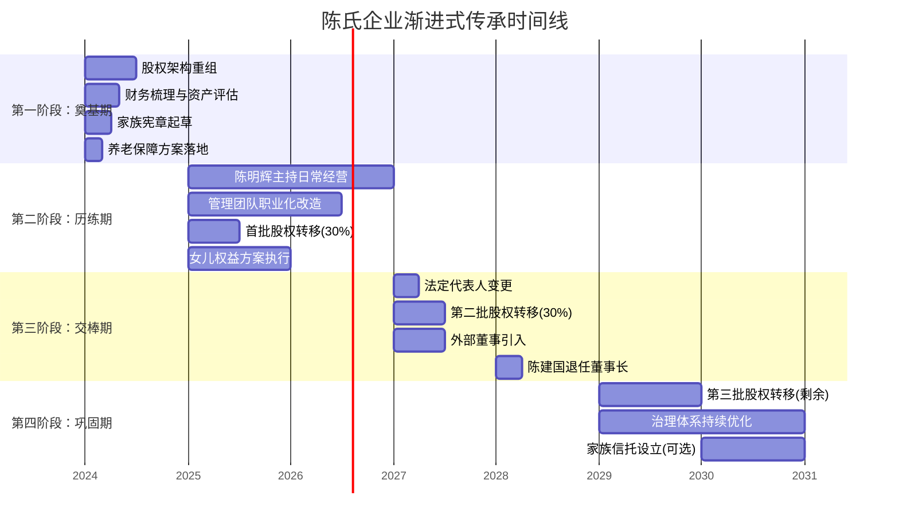
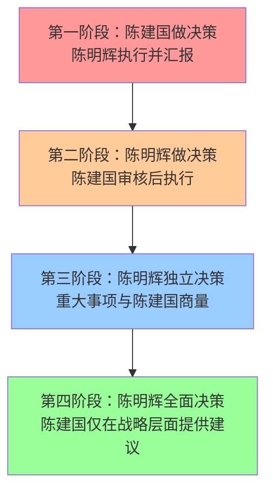
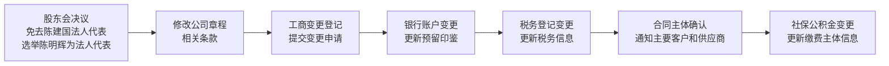
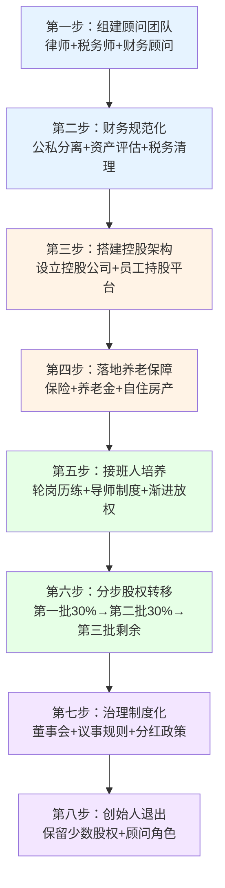

## 案例七：中小企业主的渐进式传承

### 一、案例背景

#### 1. 企业概况

陈建国，56岁，浙江温州人，1998年创办"华鑫五金制品有限公司"，主营建筑五金配件的生产与出口贸易。经过二十余年发展，企业已形成以下格局：

| 维度 | 具体情况 |
|------|----------|
| 年营收 | 约8000万元 |
| 净利润率 | 8%-12% |
| 员工规模 | 120人（含管理层12人） |
| 股权结构 | 陈建国持股90%，妻子张秀兰持股10% |
| 核心资产 | 厂房土地（估值约2000万）、设备（约800万）、应收账款（约1500万）、银行存款及理财（约600万） |
| 负债情况 | 银行贷款1200万（厂房抵押） |

#### 2. 家庭情况

陈建国育有一子一女：

- **长子陈明辉**，32岁，工商管理硕士毕业后在上海某咨询公司工作五年，2019年回到家族企业担任副总经理，已参与企业管理三年。能力中上，对制造业有热情，但管理经验尚浅。
- **女儿陈明霞**，28岁，在杭州从事互联网产品设计工作，对家族企业经营无兴趣，但关心自身应得的财产权益。
- **妻子张秀兰**，54岁，长期负责公司财务审核，熟悉企业运营但不参与决策。

#### 3. 面临的核心问题

陈建国在一次体检中发现早期肺部结节，虽然医生表示预后良好，但这次健康警钟让他意识到传承规划不能再拖。经过梳理，他面临以下困境：

**经营层面的困境：**
- 企业高度依赖陈建国个人的客户关系和行业资源，约60%的大客户由他直接维护
- 管理团队职业化程度低，核心岗位多为跟随多年的老员工，缺乏现代管理能力
- 子女接班意愿和能力的不确定性——儿子愿意接班但尚需历练，女儿无意参与经营

**法律与税务层面的困境：**
- 股权全部集中在夫妻名下，没有任何传承架构安排
- 厂房土地未做评估增值，按历史成本入账，未来过户将面临高额税负
- 企业经营贷款与个人资产混同，存在连带风险

**家庭关系层面的困境：**
- 如何平衡接班的儿子和不接班的女儿之间的利益分配
- 妻子在企业中的角色如何过渡
- 公司元老（创业伙伴）对"少主接班"的态度不确定

#### 4. 为什么选择"渐进式传承"

陈建国最初考虑过两种极端方案：一是自己再干十年，等儿子彻底成熟后一次性交接；二是干脆卖掉企业，将现金分给子女。经过与律师和财务顾问的深入沟通，他认识到两种方案都有严重缺陷：

| 方案 | 核心风险 |
|------|----------|
| 再干十年一次性交接 | 突发健康事件可能导致无序交接；儿子缺乏实战历练窗口；企业错过转型时机 |
| 直接出售企业 | 中小制造企业估值倍数低（通常3-5倍EBITDA），出售价格不理想；失去家族财富根基；员工安置困难 |

渐进式传承的核心逻辑是：**用5-8年时间，分阶段将管理权、经营权、所有权逐步转移，同时在此过程中完成企业治理升级、继承人能力培养、家族财富结构优化。** 这种方式既给了继承人试错和成长的空间，也给了创始人逐步放手的缓冲期。

---

### 二、传承规划全景

#### 1. 顾问团队组建

陈建国首先组建了一个专业的传承顾问团队：

| 角色 | 职责 | 选聘标准 |
|------|------|----------|
| 家族律师 | 股权架构设计、协议起草、法律风险防控 | 有家族企业传承实操经验，熟悉温州本地司法环境 |
| 税务师 | 税务筹划、合规申报、节税方案设计 | 精通企业所得税、个人所得税、增值税综合筹划 |
| 财务顾问 | 资产评估、财务梳理、估值定价 | 具备制造业企业估值经验 |
| 家族治理顾问 | 家族宪章制定、沟通协调、冲突调解 | 有家族企业治理咨询背景 |

**费用预算：** 整套顾问费用约15-25万元，占总资产比例不到0.3%，但可以避免数百万甚至上千万的税务损失和法律风险。

#### 2. 传承目标设定

经过家族会议讨论，陈建国明确了以下传承目标：

**核心目标：**
- 企业持续经营，不因传承而衰落
- 儿子陈明辉在5年内具备独立经营能力
- 女儿获得公平的财产份额（但不介入经营）
- 夫妻二人在传承后有充足的养老保障
- 最大限度降低传承过程中的税负成本

**量化指标：**

| 目标维度 | 具体指标 | 达成时间 |
|----------|----------|----------|
| 管理权交接 | 陈明辉独立主持年度经营会议 | 第2年 |
| 经营权交接 | 陈明辉担任法定代表人、总经理 | 第3年 |
| 股权转移 | 完成60%以上股权的分步转移 | 第5年 |
| 治理完善 | 建立董事会、引入外部独立董事 | 第3年 |
| 女儿权益 | 完成女儿的财产补偿安排 | 第3年 |
| 养老保障 | 夫妻养老金及保险安排到位 | 第1年 |

#### 3. 整体时间线

---

### 三、分阶段执行详解

#### 第一阶段：奠基期（第1年）

##### 3.1 股权架构重组

**问题诊断：** 原有的股权结构（陈建国90%+张秀兰10%）是典型的夫妻档结构，存在三大问题：一是传承时需办理两次过户（先从夫妻到个人，再从个人到子女），手续繁琐且税负叠加；二是夫妻共同持股在债务隔离方面效果差；三是无法实现经营权与收益权的分离。

**重组方案：**

第一步，成立家族控股公司。陈建国以个人名义出资100万元，在温州注册成立"华鑫控股有限公司"（简称"控股公司"），类型为有限责任公司。

第二步，股权划转。将华鑫五金的股权逐步注入控股公司。具体操作路径：

| 步骤 | 操作内容 | 税务影响 |
|------|----------|----------|
| 1 | 张秀兰将10%股权以原始出资额转让给陈建国 | 如能证明夫妻间转让系合理安排，可争取免征个人所得税 |
| 2 | 陈建国将华鑫五金100%股权以账面净资产价格转让给控股公司 | 符合条件的划转可适用特殊性税务处理，暂免企业所得税 |
| 3 | 控股公司成为华鑫五金的唯一股东 | 完成法律架构搭建 |

第三步，预留股权调整空间。在控股公司章程中设置以下条款：
- 预留10%的股权池用于未来引入职业经理人股权激励
- 设置股权转让的优先购买权条款
- 约定表决权与分红权可以分离

**关键法律文件：**
- 控股公司章程（含特殊条款）
- 股权转让协议
- 股东会决议
- 关联交易定价说明（税务备查）

##### 3.2 财务梳理与资产评估

**问题诊断：** 华鑫五金的财务管理长期不规范——公私账混用、固定资产未及时入账、关联交易定价随意。这些问题在日常经营中可以"凑合"，但在传承过户时会成为定时炸弹。

**梳理清单：**

| 梳理项目 | 具体内容 | 完成标准 |
|----------|----------|----------|
| 公私分离 | 清理陈建国个人账户与公司账户的资金往来 | 所有往来形成书面借款协议并约定利率 |
| 资产盘点 | 对厂房、土地、设备进行全面清查和重新评估 | 取得评估机构出具的正式评估报告 |
| 应收清理 | 核实应收账款的真实性和可回收性 | 坏账计提比例合理，账龄分析清晰 |
| 税务合规 | 检查近三年的税务申报情况 | 补缴应缴税款，消除税务隐患 |
| 负债梳理 | 梳理银行贷款、民间借贷、担保等负债 | 形成完整的负债清单和偿还计划 |

**资产评估要点：**

华鑫五金最有价值的资产是厂房所占的工业用地。该地块2003年以120万元取得，当前市场评估价约1800万元。如果直接按市场价转让，将产生约400万元的土地增值税和所得税。税务师建议采用以下策略：

- **策略一：分步增值入账。** 利用会计准则允许的资产重估增值，将土地使用权在账面上逐步调整到接近市场价，分3-5年完成，平滑税负。
- **策略二：先租后转。** 将土地使用权以合理租金出租给新成立的项目公司，待政策窗口或合适时机再行过户。
- **策略三：利用税收优惠。** 关注当地是否有企业重组的税收优惠政策，如温州经济技术开发区对企业改制的税收扶持。

最终选择了策略一和策略三的组合方案。

##### 3.3 家族宪章起草

家族宪章是渐进式传承的"宪法"，它将家族成员之间的约定从口头承诺变成书面制度。陈氏家族宪章的核心内容包括：

**第一章：家族使命与价值观**
- 明确"华鑫"品牌传承的家族承诺
- 定义家族核心价值观：诚信经营、稳健发展、回报社会
- 设立家族基金，每年提取净利润的2%用于公益事业

**第二章：家族成员的权利与义务**
- 家族成员进入企业需满足学历和外部工作经历的基本门槛
- 家族成员在企业的薪酬需与同岗位市场水平挂钩，不得享有特权
- 家族成员之间禁止同业竞争
- 未参与经营的家族成员享有知情权和分红权，但不享有经营决策权

**第三章：传承规则**
- 传承以"能力优先、兼顾公平"为原则
- 接班人需完成至少3年的轮岗历练
- 股权转让以净资产评估价为基准，不得低价转让给特定继承人
- 家族会议每年召开一次，讨论重大事项

**第四章：争议解决**
- 家族内部争议优先通过家族委员会调解
- 调解不成的，提交约定的仲裁机构裁决
- 禁止家族成员之间的诉讼，除非涉及人身安全

##### 3.4 养老保障方案落地

在将资产逐步转移给下一代之前，必须先确保创始人的养老安全网。这是很多传承规划忽视的关键一环——如果老人把资产都给了子女，自己却晚景凄凉，传承就失去了意义。

**具体安排：**

| 保障项目 | 方案 | 年缴费/预留 | 保障内容 |
|----------|------|-------------|----------|
| 商业养老保险 | 某大型保险公司年金险 | 30万元/年×5年 | 60岁起每月领取约1.5万元，终身领取 |
| 重大疾病保险 | 夫妻各投保一份重疾险 | 3万元/年×10年 | 各100万元重疾保障 |
| 医疗保险 | 高端医疗险 | 2万元/年 | 覆盖三甲医院国际部、海外就医 |
| 企业预留 | 在控股公司层面预留养老基金 | 一次性300万元 | 专户管理，年化收益4%-5% |
| 房产保障 | 将自住房产登记在夫妻名下，不做传承 | — | 居住权保障 |

**关键原则：** 养老保障必须在股权转移之前到位，且保障资金来源不应依赖于子女的经营业绩。养老保险和自住房产是"底线保障"，即使企业经营出现变故，老两口的基本生活也不受影响。

#### 第二阶段：历练期（第2-3年）

##### 3.5 陈明辉的接班人培养计划

传承成败的核心不在于股权怎么转，而在于接班人能不能接得住。陈明辉虽然有MBA学历和外部工作经验，但管理一个120人的制造企业与在咨询公司做项目完全不同。

**轮岗计划：**

| 轮岗顺序 | 部门 | 时长 | 核心学习目标 | 考核标准 |
|----------|------|------|-------------|----------|
| 第1轮 | 生产车间 | 6个月 | 熟悉每道工序、了解工艺流程、与一线工人建立信任 | 能独立处理日常生产异常 |
| 第2轮 | 销售部 | 6个月 | 建立客户关系、了解市场需求、掌握报价和谈判 | 独立签约3个以上新客户 |
| 第3轮 | 采购与供应链 | 4个月 | 供应商管理、成本控制、库存优化 | 采购成本降低5%以上 |
| 第4轮 | 财务部 | 4个月 | 看懂三张报表、理解现金流管理、预算编制 | 独立完成年度预算编制 |
| 第5轮 | 综合管理 | 4个月 | 人事行政、政府关系、安全管理 | 主导完成一项管理改进项目 |

**导师制度：**

除了轮岗，陈建国还为儿子安排了两位"导师"：

- **内部导师：** 公司老厂长周师傅（跟随陈建国15年），负责传授行业经验和人际智慧。陈建国私下交代周师傅："明辉在的时候，你要多提点他；但明辉做的决定，只要不出大问题，你要支持他。"
- **外部导师：** 陈建国的一位企业家朋友李总（同行业上市公司创始人），每季度与陈明辉深谈一次，提供战略视角。

**"放权-观察-纠偏"机制：**

陈建国采用渐进式放权：

**关键实践：** 陈建国在第二阶段故意安排了一次"压力测试"——他以身体检查为由离开公司两周，观察陈明辉能否独立处理日常经营。期间出现了两个小插曲：一个供应商交货延迟和一个客户投诉质量问题。陈明辉独立处理了供应商问题（启用备选供应商），但客户投诉处理得不够好（过于急于让步，多赔偿了2万元）。陈建国回来后没有批评，而是复盘了处理过程，指出"让步可以，但要让客户知道你是在给面子，而不是在认错"。

##### 3.6 管理团队职业化改造

中小企业传承的一个常见陷阱是：接班人能力提升了，但管理团队还是老班底，"新帅"指挥不动"老将"。

**改造策略：**

第一步，坦诚沟通。陈建国分别与三位核心元老（生产副总、销售总监、财务经理）进行了深入谈话，表达了三个核心意思：
- 感谢他们的多年付出，公司不会忘记
- 传承不等于清洗，他们的位置和待遇不会降低
- 但公司需要引入新的管理方法，希望他们也能学习成长

第二步，引入新鲜血液。通过猎头招聘了一位运营总监（有外资工厂管理经验）和一位人力资源经理（有上市企业HR背景）。新人的加入不是取代老人，而是带来新的管理理念和工具。

第三步，建立管理层持股平台。设立有限合伙企业"华鑫管理合伙企业"作为员工持股平台，将控股公司5%的股权装入其中，分配给核心管理团队：

| 人员 | 持股比例 | 锁定期 | 退出机制 |
|------|----------|--------|----------|
| 生产副总周师傅 | 1.5% | 3年 | 离职时按净资产回购 |
| 销售总监 | 1.5% | 3年 | 同上 |
| 运营总监（新聘） | 1.0% | 4年 | 同上 |
| 其他管理人员 | 1.0% | 5年 | 同上 |

**激励效果：** 管理层持股后，公司年度管理费用率下降了1.2个百分点（约96万元），员工主动离职率从18%降至8%。

##### 3.7 首批股权转移

在完成架构重组和接班人初步培养后，开始第一批股权转移。通过控股公司层面操作，陈建国将控股公司30%的股权以出资额价格转让给陈明辉。

**税务处理：**
- 控股公司层面：股权转让价格为原始出资额（30万元），因低于净资产份额，税务机关可能核定调整。提前准备了资产评估报告，证明控股公司持有的华鑫五金股权按成本法计量，账面价值与转让价基本匹配。
- 实际税负：约6万元个人所得税（按核定征收）

**法律保障：** 同步签署了以下协议：
- **代持还原协议**（如涉及代持安排）
- **一致行动协议**（陈明辉承诺在重大决策上与陈建国保持一致，有效期3年）
- **竞业禁止协议**（陈明辉不得在外从事同业经营）

##### 3.8 女儿权益方案

陈明霞不参与企业经营，但她的财产权益必须得到公平对待。这是很多家族传承中矛盾最集中的地方——接班的子女认为企业是自己在经营，理应多分；不接班的子女认为企业是父母创建的，自己也有份。

**方案设计：**

陈建国采用"经营权与收益权分离"的思路，为女儿设计了以下安排：

| 安排项目 | 具体内容 | 金额/比例 |
|----------|----------|-----------|
| 现金补偿 | 从家庭储蓄中一次性支付 | 300万元 |
| 控股公司分红权 | 不持有股权，但享有20%的分红权 | 按年分红 |
| 房产赠与 | 将杭州一套房产赠与女儿 | 评估价约250万元 |
| 教育基金 | 为女儿未来子女设立教育基金 | 50万元 |

**法律文件：** 签署《家庭财产分割协议》，明确各方权利义务，并进行公证。

**沟通要点：** 陈建国专门安排了一次家庭聚餐，在轻松的氛围中向两个孩子解释了整个安排的逻辑：
- "明辉接班不是因为他比明霞更重要，而是因为他选择了这条路。接班意味着责任，不是特权。"
- "明霞拿到的现金和房产是确定的，而明辉接的企业能不能做好还两说。所以明霞的安排其实是更安全的。"
- "分红权是长期保障，企业赚钱了明霞也有份，这样你们兄妹的利益就绑在一起了。"

这次坦诚的沟通避免了很多家族因"暗箱操作"而产生的猜忌和怨恨。

#### 第三阶段：交棒期（第3-4年）

##### 3.9 法定代表人变更

经过两年多的历练，陈明辉已基本具备独立管理企业的能力。陈建国启动了法定代表人的变更程序。

**变更流程：**

**风险防控：** 变更法人代表过程中，最容易出问题的是银行账户和合同衔接。陈建国的做法是：
- 提前一个月与开户银行沟通，准备好变更所需材料
- 逐一通知年交易额50万以上的客户和供应商，安排陈明辉上门拜访
- 在变更完成后的三个月内，陈建国保留对大额资金支出（单笔超过50万元）的审批权

##### 3.10 第二批股权转移与外部董事引入

第二批股权转移将陈明辉的持股比例提升至60%（在控股公司层面）。与此同时，引入一位外部独立董事进入控股公司董事会。

**外部董事人选标准：**
- 有制造业管理经验
- 了解温州民营经济生态
- 与陈家无亲属关系和利益关联
- 能够提供战略建议和治理监督

最终聘请了一位退休的行业协会秘书长，每年支付董事津贴6万元，每年参加4次董事会会议。

**董事会构成：**

| 席位 | 人选 | 角色 |
|------|------|------|
| 董事长 | 陈建国（过渡期）→ 陈明辉 | 战略决策 |
| 董事 | 陈明辉 → 运营总监 | 日常经营 |
| 独立董事 | 外聘行业专家 | 监督与建议 |
| 监事 | 张秀兰 | 财务监督 |

##### 3.11 陈建国的角色转换

从"说了算"的老板变成"退居二线"的前任，这个心理转换是很多创始人最难跨越的坎。陈建国的做法值得借鉴：

**明确的角色边界：**
- **继续做：** 参加季度董事会、维护核心客户关系（前5大客户）、在行业活动中为公司站台
- **不再做：** 审批日常经营支出、参加每周管理例会、直接指挥部门负责人
- **偶尔做：** 在重大战略决策（如大额投资、并购）时提供意见

**心理调适：** 陈建国报名了当地企业家协会的"创二代"辅导项目，担任其他年轻企业家的导师。这既让他保持了"价值感"，又避免了把精力过多投回自己的企业。

#### 第四阶段：巩固期（第5年及以后）

##### 3.12 最终股权转移与治理完善

陈明辉已独立运营企业两年，业绩稳定。陈建国完成最后一批股权转移，将自己的持股比例降至25%（保留足够的话语权但不控股），陈明辉持股75%。

**治理制度定型：**

| 制度 | 核心内容 |
|------|----------|
| 董事会议事规则 | 重大投资超过200万需董事会审批；年度预算需2/3以上董事同意 |
| 关联交易管理办法 | 家族成员与公司的交易需经独立董事审批 |
| 信息披露制度 | 每季度向全体股东（含分红权人）报告经营情况 |
| 接班人培养制度 | 建立系统化的管培生计划，不局限于家族成员 |
| 利润分配政策 | 每年分配不低于净利润40%的现金分红 |

##### 3.13 家族信托（可选进阶安排）

如果企业未来发展顺利，陈建国计划在第6-7年将部分股权装入家族信托，实现更长期的传承安排。

**初步构想：**
- 信托资产：控股公司30%的股权
- 受益人：陈明辉、陈明霞及其后代
- 信托期限：30年
- 信托目的：保障家族财富的长期保值增值，防止因婚姻变故、经营失败等风险导致家族财富流失

---

### 四、核心财务数据对比

| 指标 | 传承前 | 传承完成后 | 变化 |
|------|--------|-----------|------|
| 企业年营收 | 8000万元 | 9500万元（第5年） | +18.8% |
| 净利润率 | 8%-12% | 10%-13% | 提升2个百分点 |
| 管理费用率 | 6.5% | 5.3% | 下降1.2个百分点 |
| 核心员工流失率 | 18% | 8% | 下降10个百分点 |
| 创始人税负（传承过程） | — | 约45万元（综合） | 远低于一次性过户的预估200万+ |
| 家族内部纠纷 | — | 0次 | 方案透明，各方认可 |

---

### 五、关键经验与教训

#### 1. 做对了什么

**（1）先保障后传承。** 在转移任何资产之前，先确保了创始人的养老保障。这让整个传承过程有了"安全垫"，即使中途出现变故，老人也不会陷入被动。

**（2）架构先行。** 先搭建控股公司架构，再进行股权转移。直接在自然人之间转让股权，税务成本和操作复杂度都会大幅增加。

**（3）培养与放权同步。** 不是等接班人"完全成熟"才放权——没有人能在没有实权的情况下"成熟"。通过"放权-观察-纠偏"的机制，让接班人在实战中成长。

**（4）公平不等于平均。** 女儿的安排没有追求"与儿子完全相同的份额"，而是通过现金+分红权+房产的组合实现了实质公平。关键是方案透明、沟通坦诚。

**（5）元老不是敌人。** 通过持股平台将核心团队的利益与企业绑定，化解了"少主接班、老臣不服"的经典矛盾。

#### 2. 走过的弯路

**（1）低估了财务梳理的难度。** 二十年的公私混同不是一两个月能理清的，实际花了将近半年。教训是：越早开始财务规范化，传承时越从容。

**（2）第一次放权时过于焦虑。** 陈建国在离开公司两周的"压力测试"期间，几乎每天给儿子打三个电话"关心"工作。这其实干扰了陈明辉的独立判断。后来陈建国意识到问题，改成了每天晚上只通一次电话。

**（3）税务方案执行比设计难得多。** 土地使用权的分步增值入账在理论上有据可依，但在实际操作中需要与税务机关反复沟通。提前做好与税务机关的沟通至关重要。

#### 3. 可复制的核心框架

对于绝大多数中小企业主，这个案例提供了以下可直接借鉴的框架：

---

### 六、常见误区警示

在指导中小企业主进行传承规划时，以下误区反复出现，值得高度警惕：

| 误区 | 错误做法 | 正确做法 |
|------|----------|----------|
| "我还年轻，不用急" | 50岁以后才开始考虑传承 | 40岁就应该启动架构搭建，至少做好股权结构优化 |
| "直接把股权给孩子就行" | 不做架构，自然人之间直接过户 | 先搭建控股架构，再在公司层面操作，大幅降低税负 |
| "孩子都在公司，不用分那么清" | 不签协议、不明确权益 | 书面协议+公证，把丑话说在前面 |
| "外人不能信" | 只用家族成员，不引入外部管理者 | 家族成员+职业经理人混合治理 |
| "先给股权再培养" | 股权转了但接班人还没准备好 | 先培养能力，再转移股权；能力到了一批，股权转一批 |
| "女儿嫁出去就是外人" | 忽视女儿的财产权益 | 提前做好公平安排，避免日后纠纷 |
| "传承就是分钱" | 只关注财产分割 | 传承的核心是能力、价值观和关系的传递 |

---

### 七、适用条件与变体方案

#### 1. 本案例的适用条件

| 条件 | 要求 |
|------|------|
| 企业规模 | 年营收1000万-3亿元的中小企业 |
| 行业特征 | 有一定行业壁垒，非纯贸易型 |
| 接班意愿 | 至少一位子女愿意接班 |
| 创始人健康 | 有3-5年的过渡窗口期 |
| 家庭关系 | 家庭矛盾不尖锐，各方愿意沟通 |

#### 2. 变体方案

**变体一：无子女接班。** 如果没有子女愿意或有能力接班，渐进式传承的重心应转向：培养职业经理人团队 → 引入外部投资者 → 设计管理层收购（MBO）方案。创始人可以通过"对赌协议"确保管理层在接手后维持企业经营质量。

**变体二：多位子女竞争接班。** 如果多个子女都想接班，需要引入更客观的评估机制。建议采用"赛马制"：给每个候选人一个独立的业务板块或区域，用2-3年的业绩来检验谁更适合。但同时要设置"保护机制"，确保竞争不会演变为家族内斗。

**变体三：企业面临行业衰退。** 如果企业所在行业正在萎缩，渐进式传承可能需要与"战略转型"同步进行。传承的时间窗口更紧，因为企业的价值可能随时间递减。此时应考虑：能否在传承的同时引入新的业务方向？是否需要分拆优质资产单独传承？

---

### 八、法律工具箱

以下是本案例中涉及的关键法律文书清单，供中小企业主参考：

| 文书名称 | 用途 | 签署时机 |
|----------|------|----------|
| 控股公司章程 | 明确公司治理规则和股权转让限制 | 设立控股公司时 |
| 股权转让协议 | 记录每次股权转移的价格、条件和限制 | 每次股权转移时 |
| 一致行动协议 | 确保传承过渡期内决策统一 | 首批股权转移时 |
| 家庭财产分割协议 | 明确非接班子女的权益安排 | 传承方案确定后 |
| 代际传承框架协议 | 总括性约定传承的时间表和各方权利义务 | 传承启动时 |
| 竞业禁止协议 | 防止家族成员从事同业竞争 | 子女进入企业时 |
| 管理层持股协议 | 约定持股平台的进入、退出和激励条件 | 设立持股平台时 |
| 家族宪章 | 规范家族成员的行为准则和决策机制 | 传承启动时 |
| 公证书（多份） | 对关键协议进行公证，增强法律效力 | 各协议签署后 |

---

### 九、总结：渐进式传承的核心智慧

陈建国案例的核心启示可以浓缩为三句话：

**第一，传承是一场马拉松，不是百米冲刺。** 试图在短时间内完成所有权、经营权、管理权的同时转移，几乎必然导致混乱。5-8年的渐进式安排，给了所有人——创始人、接班人、管理团队、家族成员——足够的适应时间。

**第二，传承的本质是能力转移，不是资产转移。** 股权过户只是法律层面的操作，真正的传承发生在接班人独立做出正确决策的那一刻。如果没有系统的培养和放权机制，即使把100%的股权给了孩子，企业也可能在几年内衰落。

**第三，专业的事交给专业的人。** 中小企业主通常是"全能型"人才——销售、生产、财务、人事一把抓。但传承规划涉及法律、税务、治理、心理等多个专业领域，单靠个人经验很难周全。组建专业的顾问团队，是传承成功的基础保障。
