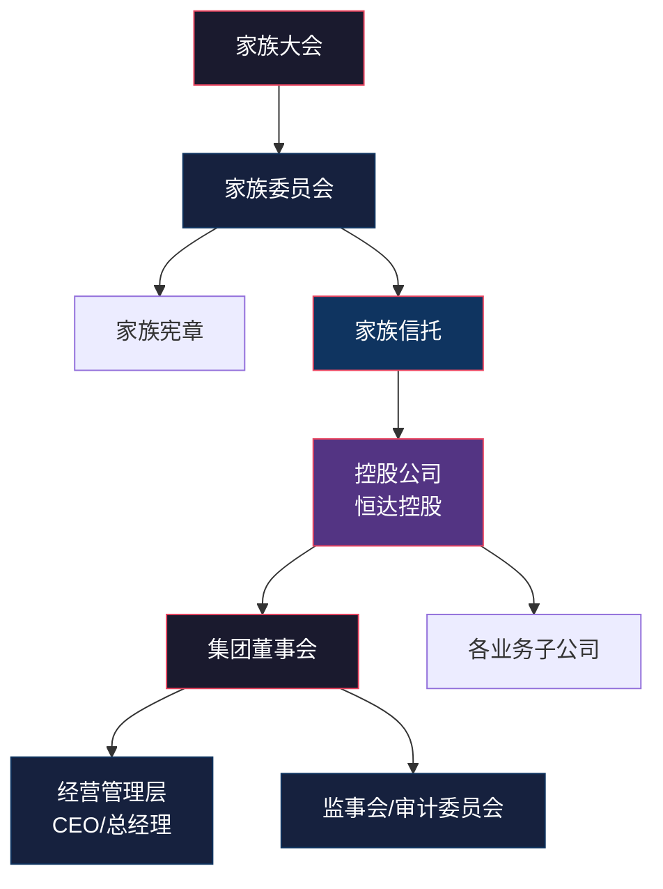
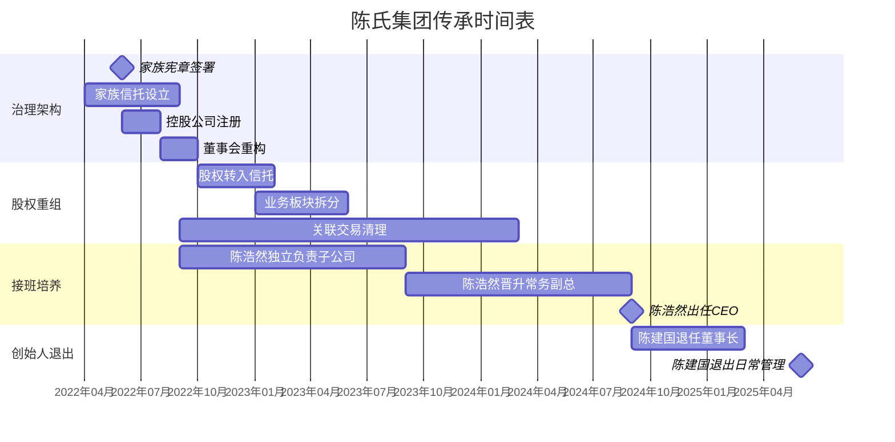

## 案例九：家族企业的代际传承与治理

### 一、案例背景：陈氏集团的"三十年之痒"

#### 1. 家族与企业概况

陈建国（化名），1962年生，浙江宁波人。1993年以20万元起步创办"恒达五金"，从一间小型五金加工作坊发展为横跨精密制造、外贸出口、工业地产三大板块的综合性集团——陈氏恒达集团。截至2022年，集团总资产约18亿元，年营收12亿元，净利润约1.5亿元，员工超过2000人，是当地纳税大户。

**家族成员结构：**

| 成员 | 年龄 | 身份 | 角色 |
|------|------|------|------|
| 陈建国 | 60岁 | 创始人/董事长 | 集团实际控制人，持股62% |
| 妻子王丽华 | 58岁 | 联合创始人 | 持股18%，主管财务审计 |
| 长子陈浩然 | 36岁 | 接班候选人A | 集团副总，持股8%，MBA学历 |
| 次子陈浩宇 | 32岁 | 接班候选人B | 自主创业（互联网），持股6% |
| 长女陈静 | 38岁 | 非参与股东 | 外嫁，持股6%，任中学教师 |
| 陈建国弟弟陈建军 | 55岁 | 创业元老 | 生产总监，无股权（曾赠与后回购） |

#### 2. 传承困境：问题浮现

2021年，陈建国突发心梗住院。虽然手术成功，但这场健康危机像一面照妖镜，暴露出这个看似稳固的家族企业背后的深层危机：

**危机一：权力真空。** 陈建国住院两周，集团多项重大决策被迫搁置。一笔3000万的原材料采购订单因无人签字而丢失；一个持续半年的厂房扩建项目停工待命。全集团上下习惯了"老板一言堂"，离开陈建国，整台机器就停转了。

**危机二：接班悬而未决。** 长子陈浩然在集团工作8年，表面是副总，实际权力有限，核心客户和银行关系仍握在父亲手中。次子陈浩宇明确表态对传统制造业不感兴趣，自己创办了一家SaaS公司。长女陈静从未参与经营。接班人选看似明确（陈浩然），但缺乏正式的授权机制。

**危机三：家族与企业边界模糊。** 妻子王丽华的娘家人在集团采购部任职多年，存在关联交易；陈建国弟弟陈建军虽无股权但掌握生产线，自视为"二老板"；家族成员的薪酬、用车、报销标准全凭陈建国个人决定，没有制度可言。

**危机四：外部资本虎视眈眈。** 一家上市公司多次接触，希望收购恒达集团51%股权。陈浩然对此态度暧昧——他认为引入外部资本可以推动现代化转型；陈建国则视之为"卖祖业"，坚决反对。父子之间第一次出现了根本性的路线分歧。

#### 3. 问题本质：从"人治"到"治理"的转型阵痛

陈氏集团的困境绝非个案。根据全国工商联数据，中国民营企业中85%以上为家族企业，而中国第一代创业者正集体步入退休年龄。麦肯锡的研究指出，全球家族企业中只有约30%能成功传承到第二代，能传到第三代的不足13%。

陈氏集团面临的核心挑战可以归纳为一个根本性问题：**一个靠创始人个人魅力和能力驱动的企业，如何转型为靠制度和治理结构驱动的企业？** 这不仅仅是"把钥匙交给谁"的问题，而是整套权力分配、利益协调、决策机制的系统性重构。

---

### 二、传承规划：专业团队的介入

#### 1. 组建顾问团队

2022年初，陈建国在朋友推荐下，决定正式启动传承规划。他聘请了一支跨领域顾问团队：

- **家族治理顾问：** 某知名家族办公室的合伙人，负责整体架构设计
- **律师团队：** 某头部律所的家事与公司法团队（3人），负责法律架构
- **税务师：** 某四大会计师事务所的税务合伙人，负责税务筹划
- **心理咨询师：** 一位专注家族企业冲突调解的家族治疗师

顾问团队进场后的第一步，不是急着开方案，而是对整个家族进行了为期一个月的深度调研，包括：一对一访谈每位家族成员、审阅集团全部股权和治理文件、梳理家族成员在企业内外的利益关系、评估接班候选人的能力与意愿。

#### 2. 调研发现的核心问题

**（1）股权结构高度集中，缺乏制衡**

陈建国一人持股62%，妻子18%，两人合计80%。这种结构在创业期效率极高，但导致：
- 所有重大决策系于一人
- 其他家族成员没有参与感和归属感
- 一旦创始人失能，企业立即陷入权力真空

**（2）所有权与经营权完全重叠**

陈建国既是大股东、董事长，又是CEO，还直接管理核心客户关系。企业的资产、品牌、客户资源高度依附于他个人。这意味着"传承"实质上传的是"人"而非"组织"——这是不可持续的。

**（3）缺乏家族治理机制**

- 没有家族宪章（Family Constitution）
- 没有家族委员会或家族大会
- 没有家族成员进入和退出企业的明确规则
- 没有分红政策——每年分多少全凭陈建国心情
- 没有冲突解决机制——家族矛盾就是餐桌吵架

**（4）接班人培养缺乏体系**

陈浩然虽然有MBA学历和8年工作经历，但：
- 从未独立负责过一个完整的业务板块
- 核心供应商和客户关系由父亲和叔叔把持
- 缺乏管理团队的权威——老员工仍视他为"小陈总"
- 未经历过真正的危机考验

---

### 三、治理架构设计：四权分离

#### 1. 设计原则：所有权、经营权、监督权、家族权的四权分离

顾问团队提出的架构设计核心理念是"四权分离"：



**四权的具体含义：**

| 权力类型 | 承载机构 | 核心职能 | 关键人员 |
|----------|----------|----------|----------|
| 所有权 | 家族信托+控股公司 | 资产持有、收益分配 | 全体受益人 |
| 经营权 | 董事会+管理层 | 战略决策、日常运营 | 董事+职业经理人 |
| 监督权 | 监事会+审计委员会 | 财务监督、合规审查 | 独立监事+外部审计 |
| 家族权 | 家族委员会+家族宪章 | 家族成员管理、价值观传承 | 全体家族成员 |

#### 2. 股权重组方案

**第一步：设立家族信托。**

将陈建国和王丽华合计80%的股权装入一个不可撤销的家族信托（BVI架构，受托人为持牌信托公司）。信托的受益人为陈建国、王丽华及三个子女，但各受益人的受益份额和条件不同。

**信托关键条款设计：**

| 条款 | 内容 |
|------|------|
| 信托类型 | 不可撤销全权信托 |
| 受托人 | 某持牌信托公司（独立第三方） |
| 保护人 | 陈建国（初期），后由家族委员会推选 |
| 受益人 | 陈建国、王丽华、陈浩然、陈浩宇、陈静 |
| 分配原则 | 基本生活保障+业绩挂钩+特殊情况 |
| 反挥霍条款 | 单笔超过500万需保护人书面同意 |
| 婚姻保护 | 受益权不属于夫妻共同财产 |
| 传承锁定 | 信托存续期80年，期间不得解散 |

**第二步：设立控股公司。**

在家族信托下层设立"恒达控股有限公司"（注册地香港），作为家族资产的统一持股平台。原陈建国个人持有的62%及其他家族成员的股权，全部转入恒达控股。

**第三步：优化业务子公司股权。**

将原来的单一公司拆分为三个业务子公司（精密制造、外贸出口、工业地产），各自独立核算、独立法人。这样做的好处是：风险隔离——一个板块出问题不会拖垮整个集团；估值清晰——为未来引入战略投资者或部分退出创造条件。

**股权重组前后对比：**

| 维度 | 重组前 | 重组后 |
|------|--------|--------|
| 持股主体 | 自然人直接持股 | 家族信托→控股公司→子公司 |
| 股权集中度 | 陈建国62% | 信托持有，按章程分配 |
| 婚姻风险 | 高（夫妻共同财产） | 低（信托资产独立） |
| 传承灵活性 | 低（需过户） | 高（调整受益比例即可） |
| 税务效率 | 低 | 高（避免重复征税） |

#### 3. 董事会重构

**新董事会构成（7人）：**

| 席位 | 人选 | 来源 |
|------|------|------|
| 董事长 | 陈建国（过渡期）→陈浩然 | 家族代表 |
| 副董事长 | 独立董事A（退休官员） | 外部独立 |
| 董事 | 陈浩然 | 家族代表 |
| 董事 | 王丽华 | 家族代表 |
| 董事 | 独立董事B（行业专家） | 外部独立 |
| 董事 | 独立董事C（财务专家） | 外部独立 |
| 董事 | 职业总经理张某 | 经营层代表 |

**关键设计要点：**

- **独立董事占3/7（43%）**，超过三分之一，确保在家族内部分歧时有独立裁决力量
- **引入职业总经理**，逐步将日常经营权从创始人手中转移到专业管理团队
- **设立专业委员会**：战略委员会（陈建国任主席，发挥其经验优势）、审计委员会（独立董事C任主席）、薪酬委员会（独立董事A任主席）、提名委员会（全体董事参与）

---

### 四、接班人培养计划：陈浩然的"三年登顶"之路

#### 1. 培养理念：渐进授权，实战检验

顾问团队拒绝了"一步到位"的接班方案。他们认为，接班人权威不能靠一纸任命获得，必须通过实际业绩赢得。因此设计了一个分三阶段、历时三年的培养计划。

#### 2. 三阶段培养路径

**第一阶段：独立作战（第1年）**

陈浩然被任命为精密制造子公司总经理，全权负责该板块。这是集团的核心业务，营收占比约60%。

- **权力范围：** 人事任免权（部门经理以下）、采购决策权（500万以下）、定价权（标准产品）
- **考核指标：** 营收增长不低于8%、客户满意度不低于90%、核心人才流失率不超过5%
- **支持机制：** 陈建国不再干预日常经营，但每月听取一次经营汇报；配备一位资深副总作为导师
- **关键里程碑：** 独立完成一个大客户的续约谈判（陈建国全程不介入）

**第二阶段：全局历练（第2年）**

陈浩然晋升为集团常务副总，分管精密制造和外贸出口两个板块。

- **权力范围：** 跨板块资源调配、集团层面的供应商整合、中层管理者的人事权
- **新增挑战：** 处理一个历史遗留问题——外贸板块的一笔坏账（约800万），这既是对能力的考验，也是树立权威的机会
- **关键里程碑：** 主导一次集团层面的战略研讨会，形成未来五年发展规划

**第三阶段：权力交接（第3年）**

陈浩然出任集团CEO，陈建国退任董事长（虚职），逐步退出日常管理。

- **权力范围：** 全面经营管理权
- **保留机制：** 陈建国保留董事长头衔和保护人权力，重大资产处置（单笔超过3000万）仍需董事会三分之二通过
- **关键里程碑：** 在陈建国完全不参与的情况下，独立主持一次董事会

#### 3. 次子陈浩宇的安排

陈浩宇明确表示不愿参与家族企业管理。对此，方案设计了"不参与经营但不脱离家族"的安排：

- **股权收益权：** 通过信托享有与陈浩然同等的分红权（各占信托收益的20%）
- **发展支持：** 信托设立一笔2000万的"创业基金"，支持陈浩宇的SaaS创业（以可转债形式投入，既支持又不白送）
- **知情权：** 有权查阅集团年度审计报告，列席董事会但无投票权
- **退出机制：** 若陈浩宇未来想退出，其信托受益权可由其他受益人按评估价回购

#### 4. 长女陈静的安排

陈静不参与经营且无创业诉求，方案侧重于保障其生活：

- **稳定收益：** 通过信托享有固定收益分配（每年不低于200万）
- **教育基金：** 为其子女设立专项教育基金（每人100万，用于留学）
- **信息透明：** 每季度收到一份集团经营简报

---

### 五、家族宪章：陈家的"根本大法"

#### 1. 为什么要写家族宪章

家族宪章是家族治理的最高文件，相当于家族的"宪法"。它解决的核心问题是：**把那些过去靠默契、靠面子、靠一家之主权威维持的规矩，变成白纸黑字的制度。**

陈建国一开始对写家族宪章很抵触——"自家人还要签合同？"顾问团队用一个比喻说服了他："国家有宪法，公司有章程，家族也需要自己的规则。宪法不是因为不信任才写的，而是为了让所有人心中有数。"

#### 2. 家族宪章的核心内容

**第一章：家族使命与价值观**

- 家族使命："实业报国，代代相传"
- 核心价值观：诚信经营、勤俭持家、教育为本、回馈社会
- 家训：每年春节家族聚会时集体诵读（仪式感的作用不可低估）

**第二章：家族成员的权利与义务**

| 权利 | 义务 |
|------|------|
| 享有信托收益分配权 | 遵守家族宪章和信托条款 |
| 知情权（查阅财务报告） | 维护家族声誉 |
| 参加家族大会的投票权 | 不得从事损害家族利益的行为 |
| 子女教育资助权 | 每年至少参加一次家族聚会 |
| 遇重大困难时的救助权 | 配合家族委员会的调解工作 |

**第三章：家族成员进入企业的规则**

这是宪章中最敏感也最关键的部分。过去，陈家亲戚想进集团工作，跟陈建国说一声就行，导致集团里有不少"关系户"。宪章对此做了严格规定：

- **准入门槛：** 本科及以上学历，先在外部企业工作满2年，通过集团统一面试
- **回避制度：** 直系亲属不得在同一部门或存在汇报关系的岗位
- **薪酬标准：** 家族成员薪酬参照同岗位市场水平，不得高于120%
- **晋升规则：** 与非家族员工适用同一考核标准，不得"空降"
- **退出机制：** 连续两年考核不达标，必须调岗或离职

**第四章：分红政策**

- 集团每年净利润的30%-50%用于分红
- 分红比例由董事会根据当年经营状况和未来发展需要决定
- 家族成员之间的分红按信托受益比例分配
- 特别分红（如处置重大资产所得）需家族委员会和董事会双重批准

**第五章：冲突解决机制**

| 层级 | 机构 | 处理范围 |
|------|------|----------|
| 第一层 | 当事人直接沟通 | 日常小摩擦 |
| 第二层 | 家族委员会调解 | 家族内部争议 |
| 第三层 | 独立董事+外部调解人 | 涉及企业治理的争议 |
| 第四层 | 仲裁（约定仲裁机构） | 无法调解的重大分歧 |

**宪章明确规定：家族内部争议不得诉诸公开诉讼，以保护家族隐私和企业声誉。**

**第六章：宪章的修订**

- 宪章每三年修订一次
- 修订需家族大会三分之二以上表决权通过
- 宪章的核心条款（如信托不可撤销、反挥霍条款）五十年内不得修改

---

### 六、关联交易清理与家族成员安置

#### 1. 关联交易问题

调研发现，陈氏集团存在大量关联交易：

| 关联方 | 关系 | 年交易额 | 性质 |
|--------|------|----------|------|
| 王氏贸易公司 | 王丽华弟弟持股 | 约1200万/年 | 原材料采购 |
| 陈建军（叔叔） | 创业元老 | 薪酬+奖金约150万/年 | 生产总监 |
| 张某（王丽华同学） | 供应商 | 约800万/年 | 包装材料供应 |
| 恒达物业公司 | 陈建国堂弟持股 | 约300万/年 | 集团物业管理 |

#### 2. 清理方案

**原则：** 不搞"一刀切"式的清洗，而是用1-2年时间逐步规范化，避免家族矛盾激化。

**具体措施：**

- **王氏贸易公司：** 保留供应商资格，但必须纳入集团统一的供应商评估体系。若评估合格，继续合作但价格必须不高于市场价；若不合格，给予6个月过渡期寻找替代供应商。王丽华弟弟的公司获得的不是"永久饭票"，而是"公平竞争的机会"。

- **陈建军的安置：** 这是最敏感的问题。陈建军是创业元老，掌握核心生产工艺，但年龄渐长且管理理念落后。方案设计了一个"体面退出"的路径：授予"终身荣誉顾问"头衔，每年支付顾问费50万（为期10年）；将其负责的生产管理交给一位外聘的生产副总；同时，由陈建国个人出资为陈建军购买一份年金保险，确保其退休生活无忧。关键在于——这些安排由陈建国亲自跟弟弟谈，而不是通过第三方传达。

- **其他关联方：** 张某的包装材料供应商和堂弟的物业公司，均纳入公开招标体系。若价格和服务有竞争力，继续合作；若无竞争力，按合同正常终止。

---

### 七、传承时间表与关键节点



---

### 八、执行过程中的关键挑战与应对

#### 1. 父子冲突：理念之争

传承规划推进半年后，陈建国和陈浩然爆发了第一次严重冲突。起因是陈浩然要引入一套ERP系统（预算300万），陈建国认为"花这个钱不如多买几台设备"。

这场冲突的本质不是300万的问题，而是两代人管理理念的根本差异。陈建国是草根出身，信奉"肉烂在锅里"的控制型管理；陈浩然是MBA出身，信奉数据驱动的系统化管理。

**应对方式：** 顾问团队没有站在任何一方，而是引导双方进行了一次结构化的对话。核心论点是——父亲的成功证明了在创业期"人治"的效率，但企业到了18亿的体量，靠人盯人已经管不过来了。最终方案是：ERP系统先在一个工厂试点，预算控制在150万，如果6个月内证明效果（库存周转率提升15%以上），再全面推广。

这次冲突反而成了转折点。陈建国开始真正意识到，儿子有自己的判断力和执行力，不是在"纸上谈兵"。

#### 2. 叔叔的抵触：利益与情感的博弈

当陈建军得知自己要从生产总监退为"荣誉顾问"时，反应非常激烈。他跟陈建国说："你忘了当年咱们一起扛机器的时候了？"这句话让陈建国动摇了整整一周。

**应对方式：** 陈建国亲自带着陈建军去日本考察了一家百年家族企业。那家企业的创始人弟弟也经历过类似的"功成身退"，退休后成了企业的文化传承者，负责给新员工讲述创业故事。这次考察让陈建军意识到，退出日常管理不等于被抛弃，而是换一种方式参与。加上丰厚的经济安排（顾问费+年金），陈建军最终接受了方案。

#### 3. 女婿的搅局

陈静的丈夫刘强（化名）得知信托安排后提出异议，认为陈静的分配比例偏低（信托收益的15% vs 两个兄弟各20%）。他私下找律师咨询，试图主张陈静作为法定继承人应享有更多权益。

**应对方式：** 顾问团队指出，信托资产已不属于任何个人的遗产，刘强的法律主张站不住脚。但为了避免家庭关系恶化，方案做了微调：将陈静的教育基金从"每个子女100万"提高到"每个子女150万"，同时在家族宪章中增加了"受益权不得转让给非家族成员配偶"的条款，从根本上堵住了"女婿/儿媳通过婚姻获取家族资产"的漏洞。

---

### 九、三年后：传承效果评估

截至2025年底（方案执行三年后），陈氏集团的传承取得阶段性成果：

#### 1. 量化指标对比

| 维度 | 传承前（2021） | 传承后（2025） | 变化 |
|------|---------------|---------------|------|
| 集团营收 | 12亿元 | 15.6亿元 | +30% |
| 净利润率 | 12.5% | 14.2% | +1.7个百分点 |
| 决策效率（重大决策平均周期） | 15天（等陈建国拍板） | 5天（董事会制度化决策） | 提升67% |
| 核心管理团队稳定性 | 3年内流失4位高管 | 2年内0流失 | 显著改善 |
| 家族内部冲突事件 | 年均5-6次公开争执 | 年均1-2次（均通过调解解决） | 减少70% |
| 关联交易占比 | 约8% | 约2%（均经公开招标） | 合规化 |
| 接班人独立决策比例 | 约20% | 约75% | 显著提升 |

#### 2. 定性成果

- **陈建国的角色转变：** 从"事必躬亲的老板"变成了"运筹帷幄的董事长"。他有了更多时间参加行业论坛、做慈善、陪伴孙辈。他说："以前觉得企业离了我不行，现在才知道，是我离不开企业。"
- **陈浩然的成长：** 在主导ERP系统全面上线和一次成功的海外并购后，陈浩然在管理团队中建立了真正的权威。老员工开始叫他"陈总"而不是"小陈总"——这个称呼的变化，比任何任命文件都更有分量。
- **家族关系改善：** 家族宪章和定期家族聚会成了"安全阀"，家族成员有了表达诉求的正规渠道，不再需要在餐桌上争吵或通过陈建国"仲裁"。

---

### 十、关键经验与教训提炼

#### 1. 家族企业传承的"五先五后"原则

| 原则 | 含义 | 陈氏案例体现 |
|------|------|-------------|
| 先治理后传承 | 先建好制度，再交权力 | 先签宪章、设信托，再培养接班人 |
| 先放权后交权 | 先让接班人试水，再全面交接 | 陈浩然从子公司总经理→常务副总→CEO |
| 先分权后分家 | 先在企业内部分清权责，再考虑资产分配 | 四权分离，产权清晰化 |
| 先沟通后决策 | 先充分听取各方意见，再做决定 | 家族委员会讨论→董事会决议 |
| 先试行后固化 | 先在局部试点，再全面推行 | ERP先试点再推广，宪章试行一年后修订 |

#### 2. 常见误区与纠正

**误区一：传承就是分财产。**
纠正：传承首先是治理权和经营权的制度化安排，其次是家族价值观的延续，最后才是财产的分配。顺序搞反了，财产分得再公平也会出问题。

**误区二：接班人只能是子女。**
纠正：在家族成员中没有合适人选时，引入职业经理人是明智之举。日本百年企业中，相当比例的传承是"养子继承"或"职业经理人接班"。陈氏案例中引入职业总经理张某，就是对这一原则的实践。

**误区三：家族宪章是"自家人不信任的表现"。**
纠正：宪章恰恰是信任的体现——正因为信任，才愿意把规则写下来，让所有人心中有数。没有规则的"信任"，本质上是依赖个人权威的"服从"。

**误区四：传承规划可以等创始人退休再做。**
纠正：传承规划的最佳时机是创始人55-60岁、精力尚充沛时。等到健康出问题或被迫退休，已经丧失了从容安排的窗口期。陈建国60岁才启动，已经算晚了。

**误区五：只关注家族内部，忽视外部治理。**
纠正：独立董事、外部审计、职业经理人这些"外来力量"不是威胁，而是保障。他们为家族内部的制衡提供了第三方视角。

#### 3. 适用范围与局限性

本案例的方案设计基于以下前提条件，读者需根据自身情况调整：

- **企业规模：** 年营收5亿元以上、员工500人以上的中大型家族企业。规模更小的企业可以简化架构（如不设独立董事、用股东协议替代信托）。
- **行业特征：** 传统制造业，资产以实体为主。科技型或轻资产企业可能需要不同的激励机制设计。
- **家族结构：** 多子女家庭，且接班意愿不一致。独生子女家庭可以简化受益权分配方案。
- **法律环境：** 中国大陆法律框架下设计，涉及跨境信托部分需根据具体司法管辖区调整。
- **文化因素：** 方案充分考虑了中国"面子文化"和"关系社会"的特点，对海外家族企业参考价值有限。

---

### 十一、实操工具箱

#### 1. 家族传承自检清单

在启动传承规划之前，创始人可以先用这份清单做自我评估：

- [ ] 我是否明确知道谁是接班人选？（不是"应该是他/她"，而是有明确的评估依据）
- [ ] 接班人是否独立负责过一个完整的业务板块？
- [ ] 企业如果我明天不在了，能正常运转多久？（一个月以上为及格）
- [ ] 家族成员之间是否有公开的、未解决的矛盾？
- [ ] 企业中是否存在未规范的关联交易？
- [ ] 我的股权结构是否考虑了婚姻风险和债务风险？
- [ ] 是否有书面的分红政策和家族成员准入规则？
- [ ] 是否有专业的法律顾问和税务顾问？

**评分标准：** 勾选4项以下——急需启动传承规划；勾选5-6项——有基础但需完善；勾选7-8项——已经走在正确的路上。

#### 2. 家族信托设立流程（简化版）

```text
第一步：需求分析（1-2周）
    ├── 明确信托目的（传承/隔离/税务）
    ├── 梳理家族资产清单
    └── 确定受益人和分配原则

第二步：架构设计（2-4周）
    ├── 选择信托类型（可撤销/不可撤销）
    ├── 选择信托管辖区（国内/香港/BVI）
    ├── 设计信托条款
    └── 确定受托人和保护人

第三步：法律文件（4-8周）
    ├── 起草信托契约
    ├── 起草意愿书（Letter of Wishes）
    ├── 办理股权变更手续
    └── 完成资产过户登记

第四步：运营维护（持续）
    ├── 年度信托审查
    ├── 受益人变动处理
    ├── 分配方案调整
    └── 合规申报
```

#### 3. 家族会议议程模板

| 时间 | 议题 | 主持人 | 材料准备 |
|------|------|--------|----------|
| 09:00-09:30 | 开场与上次会议纪要确认 | 家族委员会主席 | 会议纪要 |
| 09:30-10:30 | 企业经营情况通报 | CEO/董事长 | 经营报告 |
| 10:30-11:30 | 财务报告与分红讨论 | CFO/审计委员会 | 财务报表 |
| 11:30-12:00 | 家族成员事务 | 家族委员会秘书 | 议题清单 |
| 14:00-15:00 | 战略方向讨论 | 董事长 | 战略报告 |
| 15:00-15:30 | 下一代培养计划 | 导师委员会 | 培养方案 |
| 15:30-16:00 | 公益与社会责任 | 公益委员会 | 项目报告 |
| 16:00-16:30 | 闭幕与下次会议安排 | 家族委员会主席 | 行动清单 |

---

### 十二、延伸思考：代际传承的深层逻辑

家族企业传承的本质，是**信任的制度化**。创始人在位时，信任是人格化的——"我信得过老张""老李跟了我20年"。但人格化的信任无法传递给下一代。陈浩然不会天然信任父亲的老部下，老员工也不会天然服从未曾一起打拼的"少东家"。

所以传承要做的是，把依赖个人关系的信任体系，转换为依赖制度规则的信任体系。合同替代承诺，流程替代默契，考核替代感觉。这不是对"人情"的否定，而是让人情在制度的框架内发挥正向作用。

正如陈建国在家族宪章签署仪式上说的那句话："这份文件不是要管住谁，而是要让我们陈家——不管走到哪一代——都有一个可以回头看看的规矩。"

这句话，或许是对家族企业传承最好的注解。
