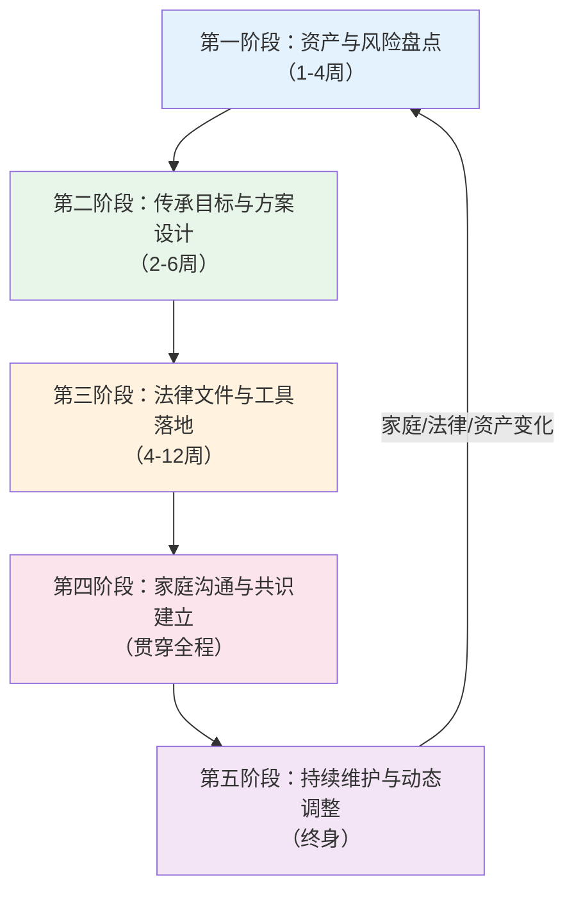

## 零、财富传承实操总流程

> 本节是"核心技巧"模块的全景导览。它不深入某个工具的细节（后续章节会逐一展开），而是帮你建立一张**完整的行动地图**——从"我现在什么都没做"到"我的传承体系已经建立并运转"，中间到底要经历哪些阶段、做哪些决策、用哪些工具、花多少钱、找谁帮忙。

---

### 一、为什么需要一张"总流程图"

财富传承涉及的工具多（遗嘱、保险、信托、持股平台、基金会……）、涉及的专业领域广（法律、税务、金融、家族治理……）、涉及的时间跨度长（从规划到落地可能数月到数年）。如果没有一张全局地图，最常见的三个问题是：

1. **只见树木不见森林**——研究了半天遗嘱怎么写，却不知道遗嘱只是整个方案的一小块拼图
2. **工具错配**——资产500万的家庭用了超高净值家族才需要的架构，成本远超收益
3. **虎头蛇尾**——方案设计得很漂亮，但执行环节掉链子，遗嘱锁在抽屉里从未更新，信托设立后受托人失联

总流程的意义就是：**在你扎进任何一个具体工具之前，先看清全貌。**

---

### 二、财富传承实操的五大阶段



#### 第一阶段：资产与风险盘点（1-4周）

**核心任务**：搞清楚"我有什么"和"我怕什么"。

很多人以为自己了解自己的资产，实际上一盘点就会发现大量盲区。以下是完整的盘点清单：

**资产盘点清单**

| 类别 | 具体项目 | 常见遗漏 |
|------|----------|----------|
| 不动产 | 住宅、商铺、写字楼、土地使用权、小产权房 | 拆迁安置房（尚未办证）、共有产权房、农村宅基地 |
| 金融资产 | 银行存款、股票、基金、债券、理财产品、信托计划 | 休眠账户、多年前买的保险（忘了的）、证券账户里的零碎股 |
| 企业资产 | 公司股权、合伙份额、个体工商户资产 | 代持的股权、未实缴的认缴出资、对赌协议中的或有权益 |
| 保险权益 | 人寿保险、年金保险的现金价值和保额 | 已失效但有现金价值的保单、单位团体险中的个人权益 |
| 海外资产 | 海外房产、海外银行账户、海外投资 | 境外保单、离岸公司股权、海外亲属代持的资产 |
| 数字资产 | 加密货币、网络账号、数字内容、游戏资产 | 冷钱包私钥、交易所账户、域名、自媒体账号的商业价值 |
| 债权债务 | 别人欠你的、你欠别人的 | 没有借条的民间借贷、担保责任、对赌失败的赔付义务 |
| 知识产权 | 专利、商标、著作权、商业秘密 | 正在申请中的专利、未注册的商标、软件著作权 |
| 其他 | 贵金属、艺术品、收藏品、车辆 | 寄存在他人处的物品、保管箱里的东西 |

**风险盘点清单**

| 风险类型 | 具体风险 | 可能后果 |
|----------|----------|----------|
| 婚姻风险 | 子女离婚导致财产外流 | 家族财富被"分走一半" |
| 债务风险 | 经营负债牵连家庭资产 | 房产、存款被法院执行 |
| 税务风险 | 未来遗产税开征、跨境税务 | 传承成本大幅上升 |
| 代持风险 | 代持人反悔、代持人去世 | 资产归属纠纷 |
| 经营风险 | 企业经营失败波及个人 | 连带清偿责任 |
| 健康风险 | 突发疾病或意外导致丧失行为能力 | 来不及安排传承 |
| 政策风险 | 法律法规变化 | 原有安排失效 |

**实操建议**：

1. **制作资产清单表**：用 Excel 或专门的资产盘点工具，逐项列出所有资产，注明权属人、价值、所在地、权证编号
2. **收集关键文件**：房产证、股权证书、保险合同、借条、知识产权证书等，统一归档
3. **评估风险敞口**：对每一类资产，评估其面临的主要风险，标注风险等级（高/中/低）
4. **聘请专业人士**：资产结构复杂的家庭（有企业股权、海外资产、代持安排等），建议请律师和会计师协助盘点，费用通常在5,000-30,000元

> **案例参考**：某民营企业主自认为资产约2,000万元，经过专业盘点后发现：代持在朋友名下的房产价值380万元、多年前购买的3份保单现金价值合计45万元、休眠证券账户中有市值22万元的股票、企业认缴但未实缴的出资义务800万元——实际净资产与自认为的数字相差超过30%。

---

#### 第二阶段：传承目标与方案设计（2-6周）

**核心任务**：搞清楚"我想怎么传"和"我该用什么工具"。

##### 2.1 明确传承目标

传承目标不是一句"都给孩子"那么简单。你需要回答以下问题：

| 决策维度 | 需要确定的内容 | 举例 |
|----------|----------------|------|
| **给谁** | 指定哪些继承人，分配比例如何 | 儿子60%、女儿30%、父母10% |
| **给什么** | 哪些资产给谁，是统一分配还是分类指定 | 房产给儿子、金融资产给女儿、企业股权归长子 |
| **怎么给** | 一次性给、分期给、附条件给 | 30岁前每月领取生活费，30岁后一次性交付 |
| **何时给** | 生前赠与还是身后继承 | 生前过户房产，身后通过信托分配金融资产 |
| **如何保护** | 如何防止资产被挥霍、被骗、被分割 | 设立信托，受益人离婚时信托分配不受影响 |
| **税务优化** | 如何降低传承的税务成本 | 利用保险的税务优惠、合理安排赠与节奏 |

##### 2.2 选择工具组合

根据资产规模和家庭复杂度，选择合适的工具组合。以下是一个简化版的决策框架：

```mermaid
flowchart TD
    START["开始选择工具"] --> Q1{"资产规模？"}

    Q1|"100万以下"| A1["基础方案"]
    Q1|"100-1000万"| A2["进阶方案"]
    Q1|"1000万以上"| A3["高级方案"]

    A1 --> T1["遗嘱 + 人寿保险"]
    A2 --> Q2{"有企业股权？"}
    Q2|"有"| T2["遗嘱 + 保险金信托 + 持股平台"]
    Q2|"没有"| T3["遗嘱 + 保险金信托"]
    A3 --> Q3{"需要家族治理？"}
    Q3|"需要"| T4["遗嘱 + 家族信托 + 持股平台 + 家族宪法"]
    Q3|"暂不需要"| T5["遗嘱 + 家族信托 + 保险"]

    style A1 fill:#e3f2fd
    style A2 fill:#fff3e0
    style A3 fill:#fce4ec
```

**不同资产规模的典型方案对比**

| 维度 | 基础方案（<100万） | 进阶方案（100-1000万） | 高级方案（>1000万） |
|------|---------------------|------------------------|---------------------|
| 核心工具 | 遗嘱 + 定期寿险 | 遗嘱 + 保险金信托 | 遗嘱 + 家族信托 + 持股平台 |
| 设立成本 | <5,000元 | 2-10万元 | 10-50万元 |
| 年维护成本 | 几乎为零 | 5,000-2万元/年 | 2-10万元/年 |
| 资产隔离能力 | 弱（遗嘱无隔离功能） | 强（信托隔离） | 最强（多层架构） |
| 灵活性 | 高（随时改遗嘱） | 较高 | 中（信托条款修改需协商） |
| 专业团队 | 律师（1次咨询即可） | 律师 + 理财师 | 律师 + 会计师 + 信托经理 + 税务师 |
| 规划周期 | 1-2周 | 1-3个月 | 3-6个月 |

##### 2.3 方案设计的关键原则

**原则一：先保底，再优化**

不要一上来就搭建复杂的信托架构。先把最基础的事情做好：一份合法有效的遗嘱 + 足够的寿险保障。这两件事做好，已经能避免80%的传承灾难。

**原则二：工具匹配需求，不追求"高大上"**

资产200万的家庭去做家族信托，每年管理费就吃掉收益的相当部分，得不偿失。保险金信托（100万保额起）是这个量级的更优选择。

**原则三：预留弹性空间**

家庭情况会变——子女出生、离婚再婚、资产增减、法律政策变化。方案设计时要预留调整的余地，不要把所有条款都定死。

---

#### 第三阶段：法律文件与工具落地（4-12周）

**核心任务**：把纸面上的方案变成具有法律效力的文件和安排。

这是最容易掉链子的阶段。很多人方案设计得很好，但执行时拖拖拉拉，或者在细节上出错导致文件无效。

##### 3.1 各工具落地的关键步骤

| 工具 | 落地步骤 | 关键注意事项 | 典型周期 |
|------|----------|--------------|----------|
| **自书遗嘱** | ①全文亲笔书写 ②签名 ③注明年月日 | 必须亲笔书写，不能打印；不能有涂改（否则涂改部分可能无效）；建议同时录像 | 1-3天 |
| **公证遗嘱** | ①准备材料 ②预约公证处 ③现场公证 | 需携带身份证、财产证明；公证遗嘱不再具有优先效力，但证明力最强 | 1-2周 |
| **打印遗嘱** | ①电脑打印全文 ②每一页签名+注明日期 ③两个以上见证人在场并签名 | 见证人不能是继承人或与继承人有利害关系的人；每一页都要签名 | 1-2周 |
| **人寿保险** | ①选择产品 ②如实告知健康状况 ③投保 ④指定受益人（非"法定"） | 受益人必须明确指定姓名和身份关系，不能只写"法定"；投保人和被保险人需有保险利益 | 2-4周 |
| **保险金信托** | ①投保大额寿险 ②与信托公司签订信托合同 ③变更保险受益人为信托公司 | 信托合同中的分配条款是核心——什么条件下分配多少给谁，需要仔细设计 | 4-8周 |
| **家族信托** | ①选择信托公司 ②设计信托架构 ③签订信托合同 ④完成资产过户 | 信托资产必须合法、权属清晰；过户过程可能涉及税费（如房产过户需缴契税） | 2-6个月 |
| **持股平台** | ①设立有限合伙企业 ②将股权装入平台 ③设计合伙协议 | GP（普通合伙人）掌握控制权，LP（有限合伙人）享受收益权；GP需承担无限责任 | 1-3个月 |

##### 3.2 执行落地的检查清单

在提交任何法律文件之前，用以下清单逐项检查：

- [ ] **主体信息准确**：所有人名、身份证号、地址是否正确
- [ ] **资产描述精确**：房产证号、保单号、银行账号等是否与原件一致
- [ ] **受益人信息完整**：姓名、身份证号、与被继承人的关系是否明确
- [ ] **分配比例清晰**：百分比之和是否等于100%；是否有兜底条款
- [ ] **见证人/公证合规**：见证人是否符合资格（非利害关系人、具有完全民事行为能力）
- [ ] **签名日期完整**：每一页是否都有签名和日期
- [ ] **文件保存妥善**：原件放在安全且继承人能找到的地方；建议律师处保留一份副本
- [ ] **告知关键人**：至少一位信任的人知道文件的存在和存放位置

##### 3.3 常见执行陷阱

**陷阱一：遗嘱形式不合法**

中国《民法典》对每种遗嘱形式都有严格要求。自书遗嘱必须"全文亲笔书写"——哪怕标题是打印的，都可能导致整个遗嘱效力存疑。代书遗嘱必须有两个以上见证人，且见证人不能是继承人。

**陷阱二：保险受益人写"法定"**

很多人投保时受益人栏写"法定"或"法定继承人"。这意味着保险金将作为遗产处理，需要走继承程序，可能被冻结、被用于偿还死者债务、引发继承纠纷。正确做法是**明确指定受益人的姓名和身份关系**。

**陷阱三：信托资产未完成过户**

签订了信托合同但没有完成资产过户，信托形同虚设。特别是房产信托，过户涉及契税（3%-5%），很多人因为税费问题拖延过户，导致信托无法生效。

**陷阱四：文件保存不当**

遗嘱立好后锁在只有自己知道密码的保险箱里，去世后家人根本找不到——这种情况比你想象的更常见。建议：原件存放在律师处或公证处，同时告知至少一位家庭成员文件的存在。

---

#### 第四阶段：家庭沟通与共识建立（贯穿全程）

**核心任务**：让方案得到家人的理解和支持，避免身后纷争。

很多传承方案失败，不是因为法律设计有问题，而是因为家庭成员之间缺乏沟通。你精心设计的方案，可能在你去世后被子女视为"偏心"的证据，引发诉讼和反目。

##### 4.1 沟通的三个层次

| 层次 | 沟通内容 | 时机 | 方式 |
|------|----------|------|------|
| **告知层** | 让家人知道你做了传承安排 | 方案确定后 | 家庭会议、书面告知 |
| **解释层** | 让家人理解为什么这样安排 | 方案设计过程中 | 一对一谈话、家庭讨论 |
| **参与层** | 让家人参与方案设计 | 方案设计初期 | 家庭会议、共同决策 |

对于大多数家庭，至少做到"告知层"；对于资产较多或家庭关系复杂的家庭，建议做到"参与层"。

##### 4.2 沟通的关键话术

**避免的说法**：
- "我走了以后这些都归你"（过于沉重，回避型沟通）
- "你哥拿大头是因为他要管理公司"（容易引发不公感）
- "不用管这些，我都安排好了"（剥夺知情权）

**推荐的说法**：
- "我想和你们聊聊家庭财务安排，不是因为有什么问题，而是希望我们都能安心"
- "这样安排是出于这几个考虑……你们有什么想法？"
- "我请了一位律师来帮我们梳理，大家可以一起听听专业意见"

##### 4.3 特殊家庭结构的沟通要点

| 家庭类型 | 沟通难点 | 建议策略 |
|----------|----------|----------|
| 多子女家庭 | 子女之间比较心理 | 强调"公平不等于平均"，解释每个安排的逻辑 |
| 再婚家庭 | 前婚子女与现婚配偶的利益冲突 | 明确区分婚前财产和婚后财产，用信托隔离 |
| 独生子女家庭 | "反正都是我的"心态 | 引入配偶保护条款，防止子女离婚导致财产外流 |
| 有非婚生子女的家庭 | 法律地位和社会压力 | 通过保险或信托隐性安排，避免遗嘱中的公开分配引发争议 |

---

#### 第五阶段：持续维护与动态调整（终身）

**核心任务**：传承方案不是一劳永逸的，需要随着生活变化而调整。

##### 5.1 触发调整的事件清单

| 事件类型 | 具体事件 | 需要调整的内容 |
|----------|----------|----------------|
| **家庭变化** | 出生、死亡、结婚、离婚、收养 | 遗嘱受益人、信托分配条款、保险受益人 |
| **资产变化** | 大额资产购入或出售、企业上市或转让 | 资产清单、信托装入资产、持股平台结构 |
| **法律变化** | 继承法修订、遗产税开征、信托法修订 | 整体方案架构、税务安排 |
| **健康变化** | 本人或关键家庭成员重大疾病 | 加速执行未完成的安排、增加保险保障 |
| **关系变化** | 与某个继承人关系恶化或修复 | 分配比例、附加条件 |

##### 5.2 定期审视的节奏

| 审视内容 | 频率 | 具体操作 |
|----------|------|----------|
| 资产清单更新 | 每年一次 | 核实资产变动，更新清单 |
| 受益人信息核实 | 每年一次 | 确认受益人身份证号、关系未变化 |
| 法律文件有效性检查 | 每2-3年一次 | 请律师审查遗嘱、信托合同是否仍然有效 |
| 保险保障充足性评估 | 每3-5年一次 | 评估保额是否与当前资产规模匹配 |
| 整体方案评审 | 每3-5年一次 | 请专业团队全面评审方案，提出优化建议 |

##### 5.3 动态调整的实操模板

建议建立一份"传承方案维护日志"，记录每次调整的时间、原因、内容：

```text
日期：2026年6月
触发事件：儿子结婚
调整内容：
1. 遗嘱：增加"儿子继承的财产为其个人财产"的条款
2. 保险：将受益人从"儿子"调整为"儿子个人，与其配偶无关"
3. 信托：咨询信托公司是否需要调整分配条款
执行状态：已完成1和2，3待跟进
下次审视：2026年12月
```

---

### 三、全流程时间线与里程碑

以一个**资产500万的三口之家**为例，展示从零开始建立传承体系的典型时间线：

| 阶段 | 时间节点 | 里程碑事件 | 交付物 |
|------|----------|------------|--------|
| 第1周 | 启动 | 确定规划目标和预算 | 传承规划需求表 |
| 第2-3周 | 资产盘点 | 完成资产和风险清单 | 资产清单表、风险评估报告 |
| 第4-5周 | 方案设计 | 确定工具组合和分配方案 | 传承方案草案 |
| 第6周 | 律师审查 | 律师审核方案可行性 | 律师意见书 |
| 第7-8周 | 遗嘱执行 | 完成遗嘱的撰写和公证/见证 | 合法有效的遗嘱 |
| 第9-10周 | 保险投保 | 完成寿险投保和受益人指定 | 保险合同 |
| 第11-12周 | 信托设立（如需要） | 完成保险金信托的设立 | 信托合同 |
| 第13周 | 家庭沟通 | 向家人说明方案 | 家庭会议纪要 |
| 第14周 | 文件归档 | 所有文件妥善保存，告知关键人 | 文件清单和存放位置表 |
| 持续 | 维护 | 每年审视，重大事件时调整 | 维护日志 |

---

### 四、预算规划：传承体系建设要花多少钱

很多人的误区是认为传承规划很贵、只有富人才需要。实际上，根据资产规模不同，成本差异很大：

| 资产规模 | 方案类型 | 一次性成本 | 年维护成本 | 成本占资产比 |
|----------|----------|------------|------------|--------------|
| <50万 | 遗嘱+基础保险 | 1,000-3,000元 | 几乎为零 | <1% |
| 50-200万 | 遗嘱+寿险+律师咨询 | 3,000-1万元 | 0-2,000元 | <0.5% |
| 200-500万 | 遗嘱+保险金信托 | 1-5万元 | 2,000-5,000元 | <0.3% |
| 500-2000万 | 遗嘱+家族信托（或保险金信托） | 3-15万元 | 5,000-3万元 | <0.2% |
| >2000万 | 完整传承体系 | 10-50万元 | 2-10万元 | <0.1% |

**一个简单的判断标准**：传承规划的成本，应该远低于不规划可能导致的损失。如果一份3,000元的遗嘱能避免一场30万元的继承诉讼，这笔钱就花得值。

---

### 五、你需要的专业团队

传承规划不是一个人能完成的事。以下是不同阶段需要的专业支持：

| 角色 | 什么时候需要 | 提供什么服务 | 参考费用 |
|------|--------------|--------------|----------|
| **律师** | 从方案设计到文件执行全程 | 遗嘱撰写审查、法律风险评估、继承纠纷处理 | 咨询500-2,000元/次；遗嘱代书2,000-10,000元 |
| **保险经纪人** | 方案设计和保险投保阶段 | 保险产品选择、投保方案设计、理赔协助 | 通常免费（佣金制） |
| **信托经理** | 设立保险金信托或家族信托 | 信托架构设计、信托合同拟定、资产管理和分配 | 包含在信托管理费中 |
| **会计师/税务师** | 资产规模较大或有跨境资产 | 税务筹划、财务审计、跨境税务安排 | 5,000-50,000元/年 |
| **理财师** | 资产配置和保值增值 | 资产配置建议、投资组合管理 | 视资产规模而定 |
| **家族治理顾问** | 大家族或有家族企业 | 家族宪法制定、家族会议组织、接班人培养 | 按项目收费，通常5万以上 |

**选择专业人士的注意事项**：
- 律师要有**继承法**或**家事法**的专业背景，不是所有律师都擅长这个领域
- 保险经纪人要独立于任何一家保险公司，能客观推荐产品
- 信托经理所在的信托公司要有良好的信誉和管理能力
- 所有专业人士都应该签署保密协议

---

### 六、自检：你目前处于哪个阶段

用以下自测表评估自己当前的传承准备度：

| 自测问题 | 是 | 否 |
|----------|----|----|
| 1. 你是否有一份完整且最新的资产清单？ | □ | □ |
| 2. 你是否立有合法有效的遗嘱？ | □ | □ |
| 3. 你的人寿保险受益人是否明确指定（非"法定"）？ | □ | □ |
| 4. 你的配偶和子女是否了解你的传承安排？ | □ | □ |
| 5. 你是否评估过子女离婚对家族财富的影响？ | □ | □ |
| 6. 你是否知道自己的企业股权在传承中会面临什么问题？ | □ | □ |
| 7. 你是否在最近3年内审视过传承方案？ | □ | □ |
| 8. 你是否指定了一位在你丧失行为能力时可以代为决策的人？ | □ | □ |

**评分解读**：
- **0-2个"是"**：传承准备度极低，建议立即启动第一阶段
- **3-4个"是"**：有基础意识但执行力不足，建议补齐短板
- **5-6个"是"**：有较好的传承准备，建议进入维护阶段
- **7-8个"是"**：传承体系较为完善，保持定期审视即可

---

### 七、本节小结

财富传承实操总流程可以浓缩为五个关键词：

| 关键词 | 阶段 | 核心动作 |
|--------|------|----------|
| **盘** | 资产与风险盘点 | 搞清楚"我有什么"和"我怕什么" |
| **设** | 方案设计 | 确定"给谁、给什么、怎么给" |
| **落** | 法律执行 | 把方案变成合法有效的法律文件 |
| **通** | 家庭沟通 | 让家人理解和支持方案 |
| **养** | 持续维护 | 随生活变化动态调整方案 |

> 下一节我们将深入第一个具体工具——遗嘱规划，从法律条文到实操模板，手把手教你写出一份合法有效的遗嘱。
