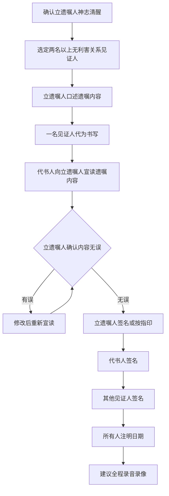
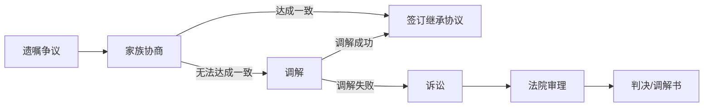

## 一、遗嘱规划实操指南

遗嘱是财富传承最基础、最核心的法律工具。一份合法有效的遗嘱，能够按照立遗嘱人的真实意愿分配财产，避免继承人之间的纷争，最大限度地降低传承成本。然而，中国每年因遗嘱形式瑕疵、内容模糊、保管不善而导致遗嘱无效或引发诉讼的案件数以万计。本节将从法律依据、遗嘱类型、实操流程、常见陷阱四个维度，提供一份可直接落地的遗嘱规划指南。

### 1.1 遗嘱的法律基础

#### 1.1.1 核心法律依据

遗嘱继承的法律框架主要由《中华人民共和国民法典》（2021年1月1日施行）第六编"继承"搭建，关键条款如下：

| 法条 | 内容要点 | 实务意义 |
|------|----------|----------|
| 第1133条 | 自然人可以立遗嘱处分个人财产，可以指定遗嘱执行人 | 确立遗嘱自由原则 |
| 第1134条 | 自书遗嘱：亲笔书写，签名，注明年月日 | 最基本的遗嘱形式 |
| 第1135条 | 代书遗嘱：两个以上见证人，其中一人代书，注明日期，代书人、其他见证人和遗嘱人签名 | 常见但高风险形式 |
| 第1136条 | 打印遗嘱：两个以上见证人，遗嘱人和见证人逐页签名，注明日期 | 民法典新增形式 |
| 第1137条 | 录音录像遗嘱：两个以上见证人，遗嘱人和见证人记录姓名或肖像及日期 | 适合无法书写的立遗嘱人 |
| 第1138条 | 口头遗嘱：危急情况下，两个以上见证人 | 仅限紧急情况，危急解除后失效 |
| 第1139条 | 公证遗嘱：经公证机构公证 | 证明力最强 |
| 第1142条 | 遗嘱人可以撤回、变更自己所立遗嘱；数份遗嘱内容相抵触的，以最后的遗嘱为准 | 民法典取消公证遗嘱优先 |

**关键变化**：2021年民法典取消了原《继承法》中"公证遗嘱效力优先"的规定，改为以最后立立的遗嘱为准。这意味着公证遗嘱不再是"一锤定音"，立遗嘱人可以随时通过新遗嘱变更此前的公证遗嘱，无需再通过公证程序。

#### 1.1.2 遗嘱的实质要件

一份有效遗嘱必须同时满足以下实质要件：

**（1）立遗嘱人具有完全民事行为能力**
- 年满18周岁，或16周岁以上以自己劳动收入为主要生活来源
- 精神正常，能够理解自己行为的性质和后果
- **实务重点**：老年人立遗嘱时，建议提前取得医院出具的精神状态评估报告或认知能力鉴定，避免日后被主张立遗嘱时已丧失行为能力

**（2）意思表示真实**
- 非受胁迫、欺诈所立
- 非在重大误解下所立
- **实务重点**：立遗嘱过程建议录音录像，全程记录立遗嘱人的精神状态和自主意愿表达

**（3）处分的是个人合法财产**
- 只能处分属于自己的财产份额
- 不能处分配偶的共同财产份额
- 不能处分不属于自己的财产（如已赠与他人的财产）

**（4）不违反法律强制性规定和公序良俗**
- 必须为缺乏劳动能力又没有生活来源的继承人（"双缺"继承人）保留必要的遗产份额（第1141条）
- 不能以遗嘱方式逃避债务

### 1.2 六种遗嘱类型详解与操作规范

#### 1.2.1 自书遗嘱——最简单但最容易出错

自书遗嘱是最常见的遗嘱形式，也是门槛最低的形式，但实践中因形式瑕疵被认定无效的比例相当高。

**法定要件（缺一不可）：**

```text
全部由遗嘱人亲笔书写（不能打印后签名）
亲笔签名（不能用印章、指印代替）
注明年、月、日（不能只写年份或年月）
```

**标准格式模板：**

```text
遗  嘱

立遗嘱人：[姓名]，性别[男/女]，[出生日期]出生，
身份证号码：[证件号码]，住址：[详细地址]。

本人头脑清醒，具有完全民事行为能力，特立此遗嘱，
对本人所有的财产作如下处分：

一、房产
位于[地址]的房产（房产证号：[证号]），系本人与配偶
[姓名]的夫妻共同财产。本人自愿将属于本人所有的该
房产份额（即该房产价值的二分之一），在我去世后由
[继承人姓名]（与本人关系：[关系]，身份证号：[号码]）
一人继承。

二、银行存款
本人名下在[银行名称]的存款（账号：[账号]），在我
去世后由[继承人姓名]继承。

三、其他财产
本人名下的其他一切财产（包括但不限于股票、基金、
车辆、家具、珠宝首饰等），在我去世后由[继承人姓名]
继承。

四、遗嘱执行人
本人指定[姓名]（身份证号：[号码]）为本遗嘱执行人，
负责按照本遗嘱的内容分配遗产。

五、声明
本遗嘱为本人真实意思表示，未受任何人的胁迫或欺骗。
此前本人所立的一切遗嘱，均以本遗嘱为准。

立遗嘱人（签名）：___________
日期：____年____月____日
```

**常见错误及纠正：**

| 常见错误 | 后果 | 正确做法 |
|----------|------|----------|
| 用电脑打印后签名 | 不构成自书遗嘱，可能被认定无效 | 必须全文手写 |
| 只写"2024年"不写月日 | 形式瑕疵，效力存疑 | 必须注明年月日 |
| 处分了夫妻共同财产的全部 | 超出处分部分无效 | 只处分属于自己的份额 |
| 将财产留给"我的孩子们" | 指代不明确，容易引发争议 | 明确列出每个继承人的姓名和份额 |
| 使用铅笔书写 | 增加被篡改风险 | 使用黑色签字笔 |
| 有涂改但未签名确认 | 涂改部分不发生效力 | 涂改处签名并注明日期 |
| 将房产地址写错 | 可能导致该处分无效 | 核对房产证上的地址 |

#### 1.2.2 代书遗嘱——见证人是关键

代书遗嘱适用于立遗嘱人因身体原因无法自行书写的情况。这是实践中争议最多的遗嘱形式，因为见证人问题导致的遗嘱无效案例大量存在。

**法定要件：**
- 两个以上见证人在场见证
- 由见证人中的一人代书
- 注明年、月、日
- 代书人、其他见证人和遗嘱人分别签名

**见证人资格要求（第1140条）：**

以下人员**不能**作为遗嘱见证人：
1. 无民事行为能力人、限制民事行为能力人以及其他不具有见证能力的人
2. 继承人、受遗赠人
3. 与继承人、受遗赠人有利害关系的人

**"利害关系人"的范围实务认定：**
- 继承人的配偶、子女、父母
- 继承人的债权人、债务人
- 继承人的合伙人、共同经营人
- 受遗赠人的近亲属

**代书遗嘱操作流程：**



**重要提醒**：代书遗嘱中，立遗嘱人本人不能同时担任代书人，否则等于自书遗嘱，应当适用自书遗嘱的规则。

#### 1.2.3 打印遗嘱——民法典新增形式

打印遗嘱是2021年民法典新增的遗嘱形式，适应了现代人书写习惯的变化。

**法定要件：**
- 两个以上见证人在场见证
- 遗嘱人和见证人应当在遗嘱每一页签名
- 注明年、月、日

**与代书遗嘱的关键区别：**

| 对比项 | 代书遗嘱 | 打印遗嘱 |
|--------|----------|----------|
| 制作方式 | 见证人手写代书 | 电脑打印 |
| 签名要求 | 最后签名即可 | 每一页都要签名 |
| 新增时间 | 继承法已有 | 民法典新增 |
| 真实性审查 | 审查笔迹 | 审查每页签名一致性 |

**打印遗嘱的实操要点：**
1. **逐页签名**：这是打印遗嘱区别于其他遗嘱形式的核心要件。每一页都必须由遗嘱人和所有见证人签名并注明日期
2. **页码标注**：建议在每页注明"第X页，共X页"，防止被替换或插入页面
3. **骑缝签名**：建议在页与页之间的骑缝处签名或按指印
4. **落款日期**：最后一页必须注明完整的年月日

#### 1.2.4 录音录像遗嘱

适用于立遗嘱人无法书写（如手部受伤、失明、文盲等）的情形。

**法定要件：**
- 两个以上见证人在场见证
- 遗嘱人和见证人应当记录其姓名或肖像
- 记录年、月、日

**操作规范：**

1. **设备准备**：使用两台以上设备同时录制，互为备份
2. **开场白**（立遗嘱人陈述）：
   - "我是[姓名]，身份证号[号码]，今天是[日期]"
   - "我现在头脑清醒，具有完全民事行为能力"
   - "我自愿立下此遗嘱，对我的财产作如下安排……"
3. **见证人陈述**：
   - "我是见证人[姓名]，身份证号[号码]"
   - "我确认立遗嘱人神志清醒，系自愿立遗嘱"
4. **全程不间断录制**：不得剪辑、拼接
5. **保管**：录制完成后刻录光盘或存储于安全介质，建议存放在公证处或律师事务所

#### 1.2.5 口头遗嘱——仅限紧急情况

口头遗嘱是最特殊的一种遗嘱形式，有严格的适用条件限制。

**适用条件（必须同时满足）：**
- 立遗嘱人处于危急情况（如突发疾病、自然灾害、事故等）
- 无法以其他形式立遗嘱

**效力规则：**
- 危急情况消除后，如果立遗嘱人能够以书面或录音录像形式立遗嘱，之前所立的口头遗嘱自动失效
- 即使立遗嘱人在危急情况消除后未另立遗嘱，口头遗嘱仍然失效

**实务建议**：口头遗嘱是最容易引发争议的遗嘱形式。如果确实需要在紧急情况下立遗嘱，建议：(1) 用手机录音；(2) 尽快在危急情况消除后补立书面遗嘱；(3) 确保见证人与继承人无利害关系。

#### 1.2.6 公证遗嘱——证明力最强

虽然民法典取消了公证遗嘱的优先效力，但公证遗嘱仍然是最具证明力的遗嘱形式。

**公证遗嘱的优势：**

| 优势 | 说明 |
|------|------|
| 专业把关 | 公证员会审查遗嘱的合法性和规范性 |
| 证明力强 | 法院对公证遗嘱的真实性推定认可 |
| 妥善保管 | 公证处会存档保管，不存在丢失风险 |
| 证据固定 | 公证过程有完整的记录，难以被质疑 |
| 降低争议 | 继承人挑战公证遗嘱的难度远大于自书遗嘱 |

**公证遗嘱的流程：**

1. **预约**：向住所地或主要财产所在地的公证处预约
2. **准备材料**：
   - 身份证、户口簿
   - 婚姻状况证明（结婚证/离婚证）
   - 财产凭证（房产证、银行存单、股权证明等）
   - 继承人的身份证件信息
   - 亲属关系证明
3. **公证员面谈**：公证员会单独与立遗嘱人交谈，确认其真实意愿
4. **起草遗嘱**：公证员根据立遗嘱人的意愿起草遗嘱文本
5. **审查确认**：立遗嘱人审查并确认遗嘱内容
6. **签署公证**：立遗嘱人在公证员面前签名，公证员出具公证书

**公证遗嘱的费用**：通常在200-500元之间，各地公证处收费标准不同。涉及大额财产时可能按标的额比例收费。

### 1.3 遗嘱内容规划实操

#### 1.3.1 财产清单梳理

遗嘱规划的第一步是全面梳理个人及家庭财产。遗漏财产是遗嘱规划中最常见的问题之一——没有被遗嘱覆盖的财产将按照法定继承处理，可能违背立遗嘱人的意愿。

**财产清单模板：**

| 财产类别 | 具体财产 | 权属状态 | 处分意愿 |
|----------|----------|----------|----------|
| 不动产 | 房产A（地址） | 夫妻共同/个人 | 指定继承人 |
| 不动产 | 房产B（地址） | 夫妻共同/个人 | 指定继承人 |
| 银行存款 | 银行A账号 | 个人 | 指定继承人 |
| 银行存款 | 银行B账号 | 个人 | 指定继承人 |
| 金融资产 | 股票账户 | 个人 | 指定继承人 |
| 金融资产 | 基金/理财产品 | 个人 | 指定继承人 |
| 保险 | 人寿保险（保单号） | 指定受益人 | 保险金给付 |
| 股权 | 公司A X%股权 | 个人 | 指定继承人 |
| 车辆 | 品牌型号车牌号 | 个人/夫妻共同 | 指定继承人 |
| 贵重物品 | 珠宝/字画/收藏品 | 个人 | 指定继承人 |
| 数字资产 | 虚拟货币/游戏账号/社交媒体 | 个人 | 指定继承人 |
| 债权 | 借款合同 | 个人 | 指定继承人 |
| 知识产权 | 专利/著作权/商标 | 个人 | 指定继承人 |

**重要提示**：
- 保险金的给付不经过遗产继承程序，由保险公司直接向指定受益人支付。如果想通过遗嘱改变保险金的归属，应当在遗嘱中明确要求变更保险受益人，并尽快到保险公司办理变更手续。
- 夫妻共同财产中，立遗嘱人只能处分属于自己的50%份额（除非双方有书面的财产约定）。

#### 1.3.2 继承人安排策略

遗嘱中的继承人安排不仅仅是"给谁"的问题，还涉及"给多少""什么时候给""附什么条件"等多维度考量。

**基本分配模式对比：**

| 分配模式 | 适用场景 | 优点 | 风险 |
|----------|----------|------|------|
| 均等分配 | 子女关系和睦，无明显差异 | 简单公平 | 未考虑实际需求差异 |
| 按需分配 | 子女经济状况差异大 | 照顾弱势一方 | 可能引发"偏心"争议 |
| 按贡献分配 | 有子女长期照顾父母 | 体现公平 | 贡献难以量化 |
| 附条件分配 | 担心继承人挥霍 | 保护财产 | 条件设置不当可能无效 |
| 分阶段分配 | 继承人尚年幼或不成熟 | 避免一次性获得大额财产 | 执行监督成本高 |

**附条件分配的常见条件类型：**

1. **学业激励**：考上本科/硕士/博士分别获得不同比例
2. **职业发展**：取得特定职业资格证书给予奖励
3. **婚姻稳定**：维持婚姻满X年后方可获得全部财产
4. **生活保障**：月收入低于X元时可获得额外补贴
5. **禁止事项**：不得将遗产用于赌博、吸毒等违法行为

**条件设置的法律红线**：
- 不得设置违反法律强制性规定的条件（如"必须与某人结婚"）
- 不得设置违反公序良俗的条件（如"必须离婚"）
- 不得设置限制人身自由的条件（如"必须住在某地"）
- 条件必须明确、具体、可执行，不能是"做个好人"这类模糊表述

#### 1.3.3 特殊财产的遗嘱安排

**（1）房产**

房产是多数家庭最核心的资产，遗嘱中对房产的处分需要特别谨慎：

- **产权确认**：确认房产是个人财产还是夫妻共同财产。如果是婚后购买且无书面财产约定，即使房产证上只有一方名字，也属于夫妻共同财产
- **贷款未还清的房产**：继承人继承房产的同时需要承担剩余贷款，建议在遗嘱中明确贷款的承担方式
- **宅基地和农村房屋**：宅基地使用权不能继承，但地上房屋可以继承。城镇户籍子女可以继承农村房屋，但不能翻建、扩建
- **小产权房**：小产权房没有合法产权证书，遗嘱中对其的处分存在法律风险，建议通过其他方式安排

**（2）公司股权**

公司股权的遗嘱继承涉及《公司法》和《民法典》的交叉适用：

- 有限责任公司股权的继承，需要其他股东过半数同意，不同意的股东应当购买该股权
- 建议在公司章程中事先约定股权继承条款
- 如果继承人不参与公司经营，可以安排股权信托或其他代持安排

**（3）数字资产**

数字资产是新兴的财产形式，遗嘱中应当包含：

- 虚拟货币：钱包地址、私钥（建议加密保管）
- 网络店铺：淘宝/京东店铺的经营权和资产
- 社交媒体账号：微信、微博等账号的处置意愿
- 游戏资产：游戏账号、虚拟道具等
- 云端数据：云盘、邮箱中的重要文件

**（4）知识产权**

- 专利权：财产权可以继承，人身权（署名权等）不能继承
- 著作权：财产权保护期内（作者终生加死后50年）可以继承
- 商标权：可以继承，但需要办理变更手续

### 1.4 遗嘱执行人制度

#### 1.4.1 为什么需要指定遗嘱执行人

遗嘱执行人是遗嘱生效后负责执行遗嘱内容、管理和分配遗产的人。没有遗嘱执行人时，遗产由继承人共同管理，容易出现相互扯皮、无人牵头的局面。

**遗嘱执行人的职责：**
1. 清点遗产，编制遗产清单
2. 管理和保全遗产（防止遗产被转移、损毁）
3. 通知继承人和债权人
4. 清偿被继承人的债务和税款
5. 按照遗嘱分配遗产
6. 交付遗赠

#### 1.4.2 遗嘱执行人的选择

| 类型 | 优点 | 缺点 | 适用场景 |
|------|------|------|----------|
| 配偶 | 了解家庭情况，信任度高 | 可能与其他继承人存在利益冲突 | 家庭关系简单、配偶为主要受益人 |
| 成年子女 | 了解家庭情况 | 可能与其他子女产生矛盾 | 子女关系和睦 |
| 兄弟姐妹 | 有一定的中立性 | 可能不了解全部财产情况 | 子女尚年幼 |
| 律师 | 专业能力强，中立性强 | 需要支付费用 | 财产复杂、继承人关系复杂 |
| 信托公司 | 专业管理能力 | 费用高 | 高净值家庭 |

#### 1.4.3 遗嘱执行人的报酬

民法典未明确规定遗嘱执行人的报酬标准。实务中的惯例是：
- 亲属担任：通常无偿或象征性支付
- 律师担任：通常按照遗产总额的1%-3%收取，或按小时收费
- 信托公司担任：按照信托合同约定的标准收取

### 1.5 遗嘱的保管与更新

#### 1.5.1 遗嘱保管方式

| 保管方式 | 安全性 | 保密性 | 便捷性 | 费用 | 推荐指数 |
|----------|--------|--------|--------|------|----------|
| 自行保管（家中保险柜） | 低 | 高 | 高 | 无 | ★★ |
| 律师事务所保管 | 高 | 高 | 中 | 数百至数千元/年 | ★★★★ |
| 公证处保管 | 高 | 高 | 中 | 通常免费（公证遗嘱） | ★★★★★ |
| 银行保险箱 | 高 | 高 | 低 | 数百至数千元/年 | ★★★ |
| 信任的亲友保管 | 中 | 低 | 高 | 无 | ★★ |

**关键建议**：无论选择哪种保管方式，务必让至少一名信任的人知道遗嘱的存在和存放位置。每年有许多遗嘱因为"找不到"而无法执行，形同虚设。

#### 1.5.2 遗嘱的更新时机

遗嘱不是"一劳永逸"的文件，以下情况应当及时更新遗嘱：

- **家庭结构变化**：结婚、离婚、再婚、子女出生、家庭成员去世
- **财产状况变化**：购置重大资产、出售资产、投资收益大幅变化
- **继承人状况变化**：继承人出现重大疾病、继承人之间的关系发生重大变化
- **法律政策变化**：税法修订、继承法修订、房产政策变化
- **遗嘱执行人变化**：指定的遗嘱执行人无法或不愿继续担任
- **定期审查**：即使没有重大变化，建议每3-5年审查一次遗嘱

#### 1.5.3 遗嘱的变更与撤销

**变更方式：**
1. **立新遗嘱**：最常见的方式。新遗嘱中明确声明撤销此前的遗嘱
2. **实施与遗嘱相反的行为**：如遗嘱中将房产留给A，但后来将房产出售，该部分遗嘱视为被撤销

**注意事项：**
- 变更自书遗嘱，应当另立一份完整的遗嘱，不建议在原遗嘱上修改
- 变更公证遗嘱，不再需要到公证处办理，可以通过任何形式的新遗嘱变更
- 建议在新遗嘱中明确写明："本人此前所立的一切遗嘱，自本遗嘱生效之日起全部撤销"

### 1.6 遗嘱纠纷的预防与应对

#### 1.6.1 常见遗嘱无效情形

| 无效情形 | 典型案例 | 预防措施 |
|----------|----------|----------|
| 形式要件缺失 | 自书遗嘱未注明日期 | 严格按照法定格式制作 |
| 见证人不适格 | 继承人的配偶担任见证人 | 核实见证人与继承人的关系 |
| 意思表示不真实 | 老人在子女胁迫下立遗嘱 | 全程录音录像，公证 |
| 无行为能力 | 患有严重老年痴呆的老人立遗嘱 | 提前取得医学评估报告 |
| 处分他人财产 | 处分配偶的个人财产 | 明确财产的权属状态 |
| 未保留必留份 | 遗嘱未给未成年子女保留份额 | 核查是否有"双缺"继承人 |
| 伪造遗嘱 | 继承人伪造遗嘱 | 公证、笔迹鉴定、见证人证言 |

#### 1.6.2 遗嘱效力的证据加固

为了让遗嘱在可能的诉讼中经得起考验，建议采取以下证据加固措施：

1. **精神状态评估**：立遗嘱前后到医院做认知能力评估，保留诊断报告
2. **全程录音录像**：记录立遗嘱的全过程，包括立遗嘱人陈述意愿、阅读遗嘱、签名等环节
3. **独立见证人**：选择与任何继承人都无利害关系的见证人
4. **律师见证**：请专业律师参与并出具律师见证书
5. **公证**：对重要遗嘱进行公证
6. **财产凭证**：保留遗嘱中涉及的各类财产权属证明的复印件
7. **亲属关系证明**：保留户口簿、结婚证等证明继承人身份的文件

#### 1.6.3 遗嘱争议的解决途径

当遗嘱的效力受到质疑时，可以通过以下途径解决：



**诉讼中的关键证据清单：**
- 遗嘱原件
- 立遗嘱人的笔迹样本（用于笔迹鉴定）
- 立遗嘱人的医疗记录（用于行为能力鉴定）
- 录音录像资料
- 见证人证言
- 公证书（如有）

### 1.7 遗嘱与其他传承工具的配合

遗嘱不是万能的，它需要与其他传承工具配合使用，才能构建完整的传承方案。

#### 1.7.1 遗嘱与遗赠扶养协议

遗赠扶养协议的效力优先于遗嘱。如果立遗嘱人同时签订了遗赠扶养协议和遗嘱，且两者内容冲突，以遗赠扶养协议为准。

**适用场景**：老人无子女或子女不在身边，由侄子、侄女或养老机构负责赡养，约定由赡养人继承遗产。

#### 1.7.2 遗嘱与保险

- 人寿保险的保险金不属于遗产（指定了受益人的情况下），不通过遗嘱继承程序分配
- 但如果受益人填写为"法定"或未指定受益人，保险金将作为遗产处理
- 建议在遗嘱中明确保险安排，同时到保险公司确认受益人设置

#### 1.7.3 遗嘱与家族信托

- 遗嘱可以指定将部分遗产纳入家族信托
- 家族信托的资产独立于委托人和受益人的个人资产，具有债务隔离功能
- 适合资产规模较大、传承安排复杂的家庭

#### 1.7.4 遗嘱与生前赠与

- 生前赠与是减少遗产总额的有效手段
- 赠与完成后财产不再属于立遗嘱人，遗嘱不能对其再行处分
- 需要注意赠与税费的计算（详见第31章税费部分）

### 1.8 遗嘱规划的完整实操流程

#### 1.8.1 六步完成遗嘱规划

**第一步：财产盘点与权属确认（1-2周）**
- 列出全部财产清单（参考1.3.1的财产清单模板）
- 确认每项财产的权属状态（个人/共有/配偶个人）
- 收集各项财产权属证明文件
- 评估各项财产的当前价值

**第二步：继承人梳理与需求分析（1周）**
- 确认法定继承人范围（配偶、子女、父母为第一顺序）
- 评估各继承人的实际需求和经济状况
- 考虑是否存在"双缺"继承人（必须保留份额）
- 与配偶沟通传承意愿，尽量达成一致

**第三步：制定分配方案（1-2周）**
- 确定每项财产的归属
- 设计分配条件（如适用）
- 选择遗嘱执行人
- 考虑是否需要配合保险、信托等工具

**第四步：选择遗嘱形式并制作（1-2天）**
- 根据自身情况选择最合适的遗嘱形式
- 建议选择公证遗嘱或有律师见证的自书遗嘱
- 起草遗嘱文本，确保格式规范、内容完整
- 准备见证人（如需要）

**第五步：签署与固定证据（1天）**
- 在见证人在场的情况下签署遗嘱
- 全程录音录像
- 建议同时进行公证

**第六步：保管与告知（当天）**
- 将遗嘱原件存放于安全位置
- 告知遗嘱执行人遗嘱的存在和存放位置
- 如有必要，告知主要继承人遗嘱的存在（但不必告知内容）

#### 1.8.2 遗嘱规划费用参考

| 项目 | 费用范围 | 说明 |
|------|----------|------|
| 自行起草自书遗嘱 | 0元 | 自行书写，无外部费用 |
| 律师代书+见证 | 2000-10000元 | 视财产复杂程度和律师资历 |
| 公证遗嘱 | 200-500元 | 大额财产可能按比例收费 |
| 律师见证 | 1000-5000元 | 含律师见证书 |
| 精神状态评估 | 200-800元 | 医院出具认知能力报告 |
| 录音录像 | 0-2000元 | 自行录制免费，专业录制收费 |
| 遗嘱保管（律师/公证处） | 0-3000元/年 | 部分公证处免费保管 |
| **全流程专业服务** | **5000-30000元** | **含方案设计+起草+公证+保管** |

### 1.9 常见误区与纠正

**误区一："遗嘱一定要公证才有效"**

纠正：民法典取消了公证遗嘱效力优先的规定。自书遗嘱、代书遗嘱、打印遗嘱等，只要符合法定的形式要件，都是有效的。公证不是遗嘱生效的必要条件，但公证确实能增强遗嘱的证明力。

**误区二："遗嘱写一次就够了"**

纠正：遗嘱应当随着家庭和财产状况的变化而更新。十年前写的遗嘱可能因为法律修订、财产变动、继承人变化等原因变得不适用甚至无效。

**误区三："口头说过怎么分就算数"**

纠正：口头表示不构成遗嘱（除非是危急情况下的口头遗嘱，且有两个以上见证人）。家产分配必须以法定形式的遗嘱为准。

**误区四："遗嘱把所有财产给配偶就行了"**

纠正：这种做法存在三个问题——(1) 如果配偶先于立遗嘱人去世，遗嘱就无法执行；(2) 配偶去世后财产再由其遗嘱分配，可能导致立遗嘱人的意愿被稀释；(3) 如果配偶再婚，财产可能流入非血缘关系人手中。

**误区五："子女都一样，不用写遗嘱"**

纠正：即使子女均分，也建议立遗嘱。没有遗嘱时按照法定继承办理，法定继承的第一顺序继承人包括配偶、子女、父母——如果立遗嘱人希望财产全部留给子女而不给父母（或反之），必须通过遗嘱明确。

**误区六："把房子提前过户给孩子最省事"**

纠正：生前赠与房产可能产生高额税费（契税、个税等），且过户后立遗嘱人就失去了对房产的控制权。如果子女不孝顺或出现婚姻变故，房产可能被配偶分割。遗嘱继承在税费和控制权方面通常更优。
