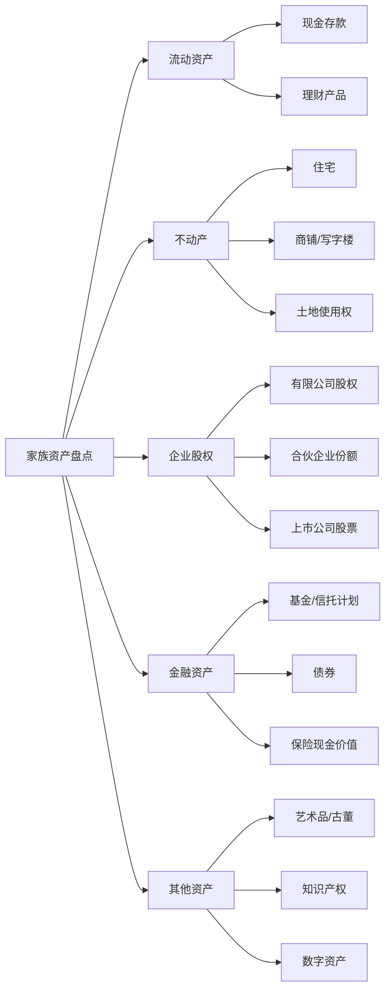
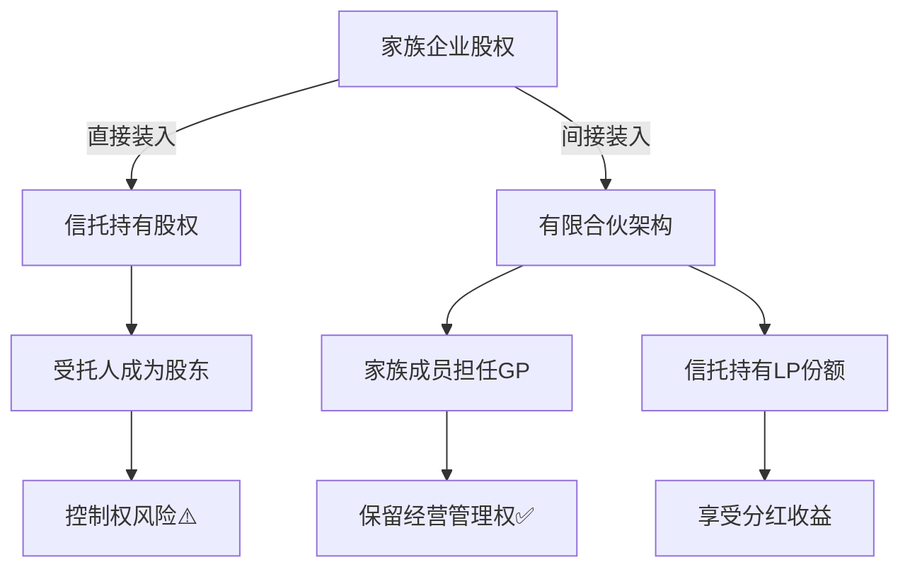

## 二、家族信托搭建实操

> 理论基础已在前文详述，本节聚焦"怎么动手"——从需求诊断到信托落地运营的完整路径，附带真实费用、条款模板和避坑指南。

### 2.1 设立前的自我诊断

在联系任何信托公司之前，委托人需要先完成一次系统性的自我诊断。这一步决定了信托的成败——方向错了，再好的架构也白搭。

#### 2.1.1 明确核心目的

家族信托的目的可以分为四个层级，由低到高：

| 目的层级 | 具体目标 | 适用人群 | 典型场景 |
|----------|----------|----------|----------|
| 资产隔离 | 债务隔离、婚姻隔离 | 企业主、高负债人群 | 企业经营风险向家庭资产传导 |
| 定向传承 | 按意愿分配资产 | 多子女/再婚家庭 | 防止子女挥霍、保护未成年子女 |
| 专业管理 | 资产保值增值 | 有大量金融资产的家庭 | 家族缺乏投资能力 |
| 家族治理 | 家族宪章、价值观传承 | 超高净值家族 | 多代传承、家族企业治理 |

很多委托人的目的不是单一的，通常是"隔离+传承"或"隔离+管理+传承"的组合。关键是要把目的排优先级，因为目的之间的冲突需要取舍。比如，追求资产隔离可能要求放弃对资产的控制权，而追求管理灵活性可能削弱隔离效果。

#### 2.1.2 资产盘点清单

设立信托前，需要完整盘点家族资产：



盘点时需要特别关注以下问题：

**权属是否清晰**。房产是否有共有人？股权是否涉及代持？存款是否混同于夫妻共同财产？权属不清晰的资产需要先做确权处理，否则装入信托时会引发纠纷。

**是否有权利负担**。房产是否已抵押？股权是否已质押？有权利负担的资产通常需要先解除负担，否则信托公司不接受。

**估值是否合理**。股权、不动产等非标资产需要第三方评估。估值过低，信托规模缩水；估值过高，税务成本增加。

#### 2.1.3 受益人结构设计

受益人设计是信托的灵魂，需要考虑以下维度：

**受益人范围**。常见组合是"配偶+子女+孙辈"，但也可以包括父母、兄弟姐妹，甚至未来的配偶（如"未来结婚的配偶"这一类别）。范围过窄可能导致信托失效时无人受益，范围过宽则稀释每人的份额。

**受益人权利类型**：
- **固定受益权**：受益人按固定比例分配，委托人控制力弱但受益人权利明确
- **酌情受益权**：受托人根据情况决定分配，灵活性高但受益人权利不确定
- **混合型**：固定基本生活费 + 酌情额外分配，兼顾稳定性和灵活性

**后备受益人**。如果所有受益人都先于信托终止去世，资产归谁？通常设置为"委托人的法定继承人"或某个慈善机构。

### 2.2 选择受托人：决策矩阵

受托人的选择直接决定了信托的执行质量。以下是三种主要受托人模式的深度对比：

| 评估维度 | 持牌信托公司 | 家族办公室 | 私人信托公司（PTC） |
|----------|-------------|-----------|-------------------|
| 专业能力 | 强，有成熟团队 | 视团队而定 | 需自建团队 |
| 费用 | 设立费5-30万 + 年管理费0.3%-1% | 年运营成本200-500万 | 设立成本100-300万 + 年运营50-100万 |
| 灵活性 | 中等，受监管约束 | 高 | 最高 |
| 存续性 | 强，机构长期存在 | 依赖核心人员 | 强，可永续 |
| 最低门槛 | 通常1000万起 | 通常5000万起 | 通常1亿起 |
| 监管保障 | 强，受银保监会监管 | 弱 | 中等 |
| 适用场景 | 中高净值家庭 | 超高净值、需要综合服务 | 顶级家族、需要完全控制 |

**选择持牌信托公司的注意事项**：

考察信托公司的"信托资产管理规模"和"家族信托业务占比"。管理规模太小的公司可能经验不足，家族信托占比太低说明这不是其核心业务。建议选择家族信托存量规模超过50亿元、运营超过5年的信托公司。

重点关注对接的信托经理。信托公司再好，具体执行靠的是人。要考察信托经理的从业年限、管理的家族信托数量、是否有处理复杂条款的经验。

签订合同时注意以下条款：受托人免责条款的范围（不能接受无限制免责）、投资决策的审批流程（哪些需要委托人同意）、信息报告的频率和详细程度。

**私人信托公司（PTC）的设立路径**：

对于资产规模超过1亿的家族，可以考虑设立私人信托公司。PTC通常注册在允许设立信托公司的离岸地（如开曼群岛、泽西岛、库克群岛），由家族成员或家族办公室人员担任董事，自行管理信托资产。

PTC的核心优势是家族对资产配置和分配拥有完全控制权，同时保留了信托的法律隔离效果。但设立和维护成本较高，且需要专业的法律和税务顾问持续支持。

### 2.3 信托资产装入：分类型实操

#### 2.3.1 现金装入

现金是最简单的信托资产，流程如下：

1. 在信托公司开立信托专户
2. 委托人从个人账户转账至信托专户
3. 信托公司出具收款确认函
4. 完成信托合同签署和备案

**注意事项**：
- 大额转账（单笔超过50万）需要提前与银行沟通，可能需要提供资金来源说明
- 如果资金来自企业分红，需要确保已经完税
- 外币资金需要考虑外汇管制问题，境内个人每年购汇额度为5万美元

#### 2.3.2 不动产装入

不动产装入信托是实务中最复杂的操作之一：

**第一步：权属确认**
确认房产证上的权利人、共有人情况，是否有抵押、查封、异议登记等权利限制。

**第二步：税费评估**
不动产过户至信托名下，视同交易，可能产生以下税费：

| 税费项目 | 税率/标准 | 承担方 | 备注 |
|----------|----------|--------|------|
| 增值税 | 满2年免征，不满2年5% | 委托人 | 住宅，非住宅另算 |
| 个人所得税 | 差额的20%或全额的1% | 委托人 | 视具体情况选择 |
| 契税 | 3%-5% | 信托（受托人） | 各地标准不同 |
| 印花税 | 0.05% | 双方 | |
| 土地增值税 | 30%-60%超率累进 | 委托人 | 非住宅适用 |

**第三步：选择过户方式**
直接过户税费高，实务中常用的替代方案包括：
- **先设立后出资**：委托人以房产出资设立SPV（特殊目的公司），再将SPV股权装入信托
- **售后回租**：将房产卖给信托，再以租赁方式继续使用，但需注意转让定价问题
- **部分地区试点**：部分城市（如北京、上海）已有不动产信托登记的试点政策，可以直接以信托方式登记，不视同交易

**第四步：办理过户**
携带信托合同、身份证明、房产证等材料至不动产登记中心办理。注意，部分地区的登记中心对"信托过户"流程不熟悉，可能需要信托公司法务陪同。

#### 2.3.3 股权装入

股权装入的复杂度仅次于不动产，且需要特别关注公司治理问题：

**有限公司股权装入流程**：

1. **股东会决议**：其他股东需要同意（或放弃优先购买权），这是《公司法》的硬性要求
2. **公司章程修订**：修改股东名册，将受托人登记为股东
3. **工商变更登记**：至市场监督管理局办理股东变更
4. **税务申报**：视同股权转让，需要缴纳个人所得税（差额的20%）

**关键问题：控制权安排**

股权装入信托后，受托人成为公司的登记股东。这意味着受托人在法律上有权参与公司经营决策——这是很多企业主最担心的问题。

解决方案通常有三种：

- **投票权委托协议**：受托人将投票权委托给委托人或其指定的人行使，受托人只保留分红权
- **一致行动协议**：受托人与家族成员签订一致行动协议，确保家族对公司的控制
- **有限合伙架构**：将股权装入有限合伙企业，委托人或家族成员担任GP（普通合伙人），信托持有LP（有限合伙人）份额，GP掌握经营管理权



#### 2.3.4 金融资产装入

金融资产（基金、股票、债券等）的装入相对简单：

- **场内证券**：需要在信托名下开立证券账户，然后通过非交易过户（继承、赠与、司法划转等方式）将证券转入信托账户
- **基金/理财产品**：需要先赎回，再以信托名义重新申购，可能产生赎回费和申购费
- **保险**：将保单的投保人变更为信托，需要保险公司同意。2023年后部分保险公司已支持"保险金信托"模式，即保单的受益人直接设定为信托

### 2.4 信托文件起草：核心条款详解

信托文件是信托的"宪法"，以下是各核心条款的设计要点：

#### 2.4.1 信托目的条款

信托目的条款不只是写一句"为了家族财富传承"，需要具体到可执行的程度。好的信托目的条款应该包含：

- 信托的总体目标（资产保全、代际传承、慈善公益等）
- 信托存续期限（固定年限或永续）
- 信托终止的条件
- 信托终止后剩余资产的归属

#### 2.4.2 分配条款设计

分配条款是家族信托中最关键的条款，直接决定了信托能否实现委托人的目的。以下是四种常见分配模式的详细设计：

**按时间分配**——最基础的模式，适合防止子女挥霍：

```text
示例条款：
受益人张三在以下年龄获得对应比例的信托资产分配：
- 年满25周岁：获得信托净资产的20%
- 年满30周岁：获得信托净资产的30%
- 年满35周岁：获得信托剩余全部资产

附加条件：上述分配的前提条件是受益人无下列情形：
（1）因犯罪被判处有期徒刑以上刑罚；
（2）被宣告破产；
（3）存在吸毒、赌博等不良行为且未戒除。
如受益人存在上述情形，对应分配自动延期至情形消除后一年。
```

**按事件分配**——将人生里程碑与财富分配挂钩：

| 触发事件 | 分配金额/比例 | 附加条件 | 证明材料 |
|----------|-------------|----------|----------|
| 结婚 | 50万元 | 需合法登记 | 结婚证 |
| 生育子女 | 每孩30万元 | 需合法登记 | 出生医学证明 |
| 完成本科教育 | 20万元 | 需获得学位证书 | 毕业证、学位证 |
| 完成研究生教育 | 30万元 | 需获得学位证书 | 毕业证、学位证 |
| 首次创业 | 100万元 | 需提供商业计划书 | 营业执照、商业计划书 |
| 购买首套住房 | 200万元 | 需提供购房合同 | 购房合同、产权证 |

**按条件分配**——保障基本生活需求：

```text
示例条款：
基本生活费分配：
每月向受益人分配基本生活费人民币2万元，于每月10日前支付。

特殊需求分配：
（1）重大疾病：受益人因重大疾病产生的医疗费用，凭医院发票实报实销，
    上限为信托净资产的30%。
（2）教育深造：受益人攻读经受托人认可的学位或专业资格，学费实报实销。
（3）住房保障：受益人首次购房，可申请不超过信托净资产10%的购房补助。

禁止分配事项：
信托收益不得用于以下用途，受托人有权拒绝相关分配申请：
（1）赌博或博彩活动
（2）购买或吸食毒品
（3）偿还因违法行为产生的债务
（4）参与传销、非法集资等违法活动
```

**激励性分配**——引导受益人的正向行为：

```text
示例条款：
教育激励：
- 考入QS世界大学排名前100的大学：奖励50万元
- 获得博士学位：奖励30万元
- 获得注册会计师/律师/医师等职业资格：奖励20万元

职业激励：
- 年收入超过100万元（需提供完税证明）：额外奖励10万元
- 创办企业年营收超过1000万元：额外奖励50万元

社会贡献激励：
- 每年参与公益志愿服务超过200小时：奖励5万元
- 以个人名义向慈善机构捐赠超过10万元：信托等额配套捐赠
```

#### 2.4.3 受托人权限条款

明确规定受托人可以做什么、不能做什么：

**受托人的核心义务**：
- 忠实义务：不得将信托财产与自有财产混同，不得利用信托财产为自己谋利
- 谨慎义务：按照"审慎投资人"标准管理信托资产
- 分配义务：严格按照信托文件的规定进行分配
- 报告义务：定期向受益人报告信托管理情况

**投资限制条款**：
```text
示例条款：
受托人投资信托资产应遵守以下限制：
（1）单一标的的投资比例不得超过信托净资产的20%
（2）不得投资于衍生品（期货、期权等高风险产品）
（3）不得向受益人或其关联方提供贷款或担保
（4）投资于非标准化资产（私募基金、不动产等）的比例不得超过60%
（5）现金及类现金资产应保持不低于信托净资产10%的比例
```

#### 2.4.4 信托保护人条款

信托保护人（Protector）是委托人设置的"代理人"，代表委托人监督受托人：

**保护人的典型权力**：
- 更换受托人的权力
- 否决特定投资决策的权力
- 修改分配条款的权力（在委托人去世后）
- 审批信托资产的出售或处置
- 解释信托条款争议

**保护人的选择标准**：
保护人通常是委托人信任的家族律师、会计师或亲密朋友。不建议选择受益人担任保护人，因为存在利益冲突。保护人可以是多人，设置为委员会形式，重大决策需多数同意。

### 2.5 信托费用深度解析

家族信托的费用不仅仅是"设立费+管理费"，以下是完整的费用清单：

| 费用项目 | 费用范围 | 收取方式 | 优化建议 |
|----------|----------|----------|----------|
| 信托设立费 | 5-30万元 | 一次性收取 | 多家比价，关注后续服务而非最低价 |
| 年度管理费 | 信托资产的0.3%-1%/年 | 按年收取 | 大额信托可谈判费率，1亿以上可谈到0.2% |
| 投资顾问费 | 信托资产的0.5%-2%/年 | 按年收取 | 可选择自行投资，省去此费用 |
| 法律顾问费 | 每次修改5000-5万元 | 按次收取 | 尽量在设立时一次性完善条款，减少修改 |
| 会计审计费 | 每年3-10万元 | 按年收取 | 可要求信托公司包含在管理费中 |
| 信托登记费 | 1000-5000元 | 一次性收取 | 各地标准不同，金额较小 |
| 资产评估费 | 资产评估值的0.1%-0.5% | 一次性收取 | 选择有资质的评估机构，避免被高估或低估 |

**综合成本估算示例**：

假设设立一个3000万元的家族信托，装入现金和金融资产，存续期20年：

- 设立费：15万元（一次性）
- 年管理费：3000万 × 0.5% = 15万元/年，20年合计300万元
- 年审计费：5万元/年，20年合计100万元
- 法律顾问费：假设修改3次，每次2万元，合计6万元
- **20年总成本：约421万元，占信托资产的14%**

这个成本看起来不低，但对比信托隔离保护的资产规模和避免的潜在损失（如离婚分割、债务追偿），往往是值得的。

**降低成本的实操技巧**：
- 谈判"打包费率"，将管理费、审计费合并为一个费率
- 选择"自管型"信托，由委托人指定投资顾问，受托人只做行政管理，费率可降至0.2%-0.3%
- 如果资产规模较大（1亿以上），可以要求阶梯费率，规模越大费率越低

### 2.6 信托税务处理

目前中国尚未开征遗产税和赠与税，但信托涉及的税务问题并不简单：

#### 2.6.1 信托设立阶段

**现金装入**：不产生税费（赠与行为目前不征税）

**不动产装入**：视同交易，可能产生增值税、个人所得税、契税、印花税等（详见2.3.2节）

**股权装入**：视同转让，需要按"财产转让所得"缴纳20%的个人所得税。如果是以成本价转让给信托（即转让价格等于原始出资额），且能证明具有合理商业目的，可能不需要缴纳个税，但需与税务机关沟通确认

#### 2.6.2 信托存续阶段

**信托投资收益**：
- 信托本身不是纳税主体（中国信托采用"导管原则"），投资收益穿透到受益人层面纳税
- 受益人取得的利息、股息、红利所得，按20%税率缴纳个人所得税
- 受益人取得的资本利得（如股票买卖差价），目前A股暂免征收个人所得税

**信托分配给受益人**：
- 如果分配的是信托本金（委托人交付的原始资产），不产生税费
- 如果分配的是信托收益，按"偶然所得"或"利息、股息、红利所得"缴纳20%的个人所得税
- 实务中，部分信托公司会代扣代缴，部分需要受益人自行申报

#### 2.6.3 遗产税前瞻

虽然中国目前没有开征遗产税，但从全球趋势和政策讨论来看，未来开征的可能性不能排除。如果开征遗产税，信托资产的税务处理将是一个关键问题：

- **可撤销信托**：资产可能仍被视为委托人的遗产，纳入遗产税征税范围
- **不可撤销信托**：资产已不属于委托人，理论上不应纳入遗产税，但具体取决于税法规定
- **离岸信托**：涉及跨境税务问题，需要关注CRS（共同申报准则）信息交换的影响

### 2.7 信托运营与动态管理

设立信托只是开始，后续的运营管理同样重要。

#### 2.7.1 定期检视机制

建议每年至少进行一次信托检视，内容包括：

- **投资绩效评估**：信托资产的投资回报是否达到预期？是否需要调整资产配置？
- **分配条款检视**：现有分配条款是否仍然适用？受益人的生活状况是否发生变化？
- **税务合规检查**：信托的税务处理是否合规？是否有新的税务政策需要应对？
- **受托人评估**：受托人的服务质量是否满意？是否需要更换？

#### 2.7.2 信托条款修改

信托条款不是一成不变的。在以下情况下，可能需要修改：

- 家庭结构变化（新增子女、离婚、再婚）
- 受益人情况变化（成年、结婚、生育）
- 法律法规变化（税法修改、信托法修订）
- 委托人意愿变化（希望调整分配比例或条件）

修改条款的流程：
1. 委托人（或信托保护人）向受托人提出修改建议
2. 受托人评估修改的可行性和法律影响
3. 律师起草修改协议
4. 各方签署修改协议
5. 如涉及税务影响，需咨询税务顾问

**注意**：信托条款的修改可能受到限制。如果信托文件本身规定了"不可撤销"条款，那么委托人通常不能单方面修改核心条款。因此，在设立信托时就应该预留一定的修改空间。

#### 2.7.3 信托终止与清算

信托在以下情况下终止：

- 信托期限届满
- 信托目的已经实现或无法实现
- 委托人和受益人协商同意终止（不可撤销信托需全体受益人同意）
- 法院判决终止

终止后的资产分配顺序：
1. 清偿信托债务（包括受托人报酬、税费等）
2. 按信托文件规定分配给受益人
3. 如无规定，按法定继承规则分配

### 2.8 常见误区与避坑指南

**误区一：设立信托就万事大吉**

很多委托人以为签了信托合同就完成了资产隔离。实际上，如果信托设立的时间点不对（如债务已经产生或即将产生），法院可能认定信托设立的目的是"逃避债务"，从而否定信托的隔离效力。《信托法》第十二条明确规定："委托人设立信托损害其债权人利益的，债权人有权申请人民法院撤销该信托。"

**避坑策略**：在财务状况健康、没有重大债务纠纷时设立信托，而不是等到"风雨欲来"才仓促设立。

**误区二：把所有资产都装入信托**

过度装入资产是常见的错误。将所有资产都装入信托后，委托人自身的生活保障可能受到影响。而且，如果信托条款设计不当，委托人可能连自己的医疗费用都需要向信托申请。

**避坑策略**：保留足够的个人流动资产，建议信托资产占总资产的30%-60%，具体比例取决于资产隔离的需求强度。

**误区三：忽视受托人的选择标准**

有些委托人只看费用不看能力，选择了管理经验不足的小型信托公司。结果信托设立后，受托人对复杂条款的理解不到位，分配执行出现偏差，投资管理能力也跟不上。

**避坑策略**：重点考察信托公司的家族信托业务经验、对接团队的专业能力、历史客户的口碑评价。费用差异放在第二位考虑。

**误区四：分配条款过于复杂或过于简单**

过于复杂的分配条款可能导致执行困难——受托人需要大量行政工作来判断每笔分配是否符合条件，增加了成本和出错概率。过于简单的分配条款则可能无法实现委托人的真实意图。

**避坑策略**：分配条款应该"简单的地方简单，复杂的地方复杂"。基本生活保障用简单的定期分配，大额激励分配用详细的条件和审批流程。

**误区五：不做定期检视**

信托设立后就不管了，直到出了问题才想起来。受益人的生活状况在变化，法律政策在变化，投资环境在变化——信托条款需要定期检视和调整。

**避坑策略**：每年至少一次全面检视，遇到重大事件（如家庭变故、法律修改）时即时检视。可以要求受托人在年度报告中附带"条款适用性评估"。

### 2.9 实操检查清单

以下是设立家族信托的完整检查清单，可作为实操工具使用：

```text
□ 第一阶段：需求诊断（1-2周）
  □ 明确信托核心目的（资产隔离/定向传承/专业管理/家族治理）
  □ 完成家族资产全面盘点
  □ 确定受益人范围和权利类型
  □ 评估可承受的信托成本

□ 第二阶段：方案设计（2-4周）
  □ 选择受托人类型（信托公司/家族办公室/PTC）
  □ 对接2-3家信托公司，比较方案和报价
  □ 确定装入信托的资产类型和金额
  □ 设计分配条款初稿
  □ 咨询税务顾问，评估税务影响

□ 第三阶段：文件起草（2-4周）
  □ 起草信托合同
  □ 制定投资指引
  □ 制定分配方案细则
  □ 确定信托保护人
  □ 法律顾问审核全部文件

□ 第四阶段：设立执行（2-6周）
  □ 签署信托合同及相关文件
  □ 办理资产过户手续
  □ 完成信托登记备案
  □ 支付设立费用
  □ 获取信托成立确认函

□ 第五阶段：持续运营
  □ 建立年度检视机制
  □ 定期审查投资绩效
  □ 跟踪受益人情况变化
  □ 关注法律法规变化
  □ 根据需要调整信托条款
```

***

