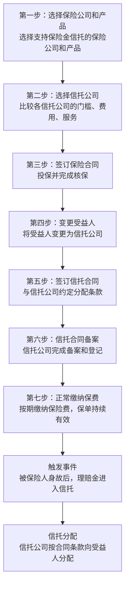
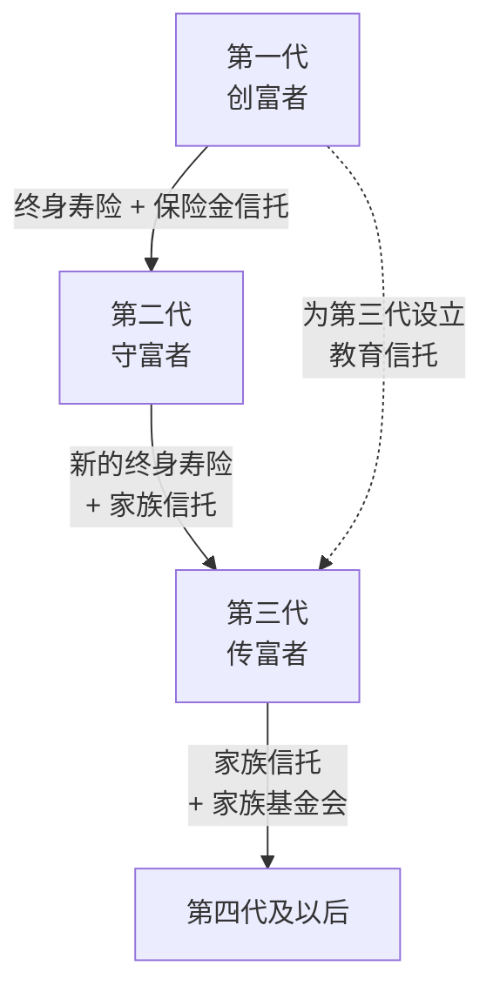

## 三、保险在传承中的应用技巧

在所有财富传承工具中，保险是**唯一兼具杠杆放大、定向传承、快速到账三重优势的金融工具**。一份年缴10万的人寿保险，可以在投保人去世后的30天内，将500万甚至1000万的理赔金直接打到指定受益人的账户——不需要经过遗产分割程序，不需要其他继承人签字同意，不受被继承人生前债务的影响（在合理范围内）。

这种"确定性"和"即时性"，是遗嘱和信托都无法单独实现的。本节将从保险传承的底层逻辑出发，系统讲解如何利用保险工具实现高效、安全、可控的财富传承。

***

### 一、保险为什么适合做传承工具

#### 1.1 保险传承的五大核心优势

**优势一：杠杆效应——小保费撬动大保额**

人寿保险最独特的能力是**以小博大**。一个40岁的男性，年缴保费约8-12万元，即可获得500万的终身寿险保障。如果他在45岁意外离世，家人获得500万理赔金，而实际只缴纳了40-60万保费。这种杠杆效应是银行存款、基金、房产都无法实现的。

| 传承方式 | 投入成本（传承500万） | 到账时间 | 杠杆倍数 |
|----------|----------------------|----------|----------|
| 银行存款 | 500万 | 即时（但需遗产手续） | 1倍 |
| 房产 | 约500万（购入成本） | 3-6个月（过户出售） | 1倍 |
| 终身寿险（40岁男） | 年缴约10万×20年=200万 | 3-30天 | 2.5倍 |
| 终身寿险（意外身故） | 年缴约10万×5年=50万 | 3-30天 | 10倍 |

**优势二：指定受益人——绕过遗产分割**

《保险法》第四十二条规定：被保险人死亡后，有指定受益人的保险金**不属于被保险人的遗产**。这意味着：

- 保险金不需要按照法定继承顺序分配
- 不需要其他继承人签字同意
- 不需要经过遗产公证或法院判决
- 受益人可以直接从保险公司领取理赔金

这一点在传承中的意义极其重大。假设张先生有两段婚姻，前妻有一个儿子，现任妻子有一个女儿。如果他把所有资产都通过遗嘱分配，去世后极可能引发继承纠纷。但如果他提前用大额人寿保险指定儿子为受益人，儿子可以直接获得保险金，不参与遗产分割，从而避免冲突。

**优势三：快速到账——解燃眉之急**

被继承人去世后，遗产的分割往往需要数月甚至数年。在此期间，家庭可能面临现金流断裂的困境——房贷要还、子女要养、企业要运转。保险理赔金通常在材料齐全后5-30个工作日内到账，是家庭在最困难时期的重要"救急金"。

**优势四：税务优势——目前免税**

中国目前没有遗产税，保险理赔金也不征收个人所得税。即便未来开征遗产税，从国际经验看，人寿保险理赔金通常享有税收优惠或减免。例如：

- 美国：人寿保险理赔金计入遗产，但通过不可撤销信托持有可免税
- 日本：指定受益人的保险理赔金不计入遗产总额
- 中国台湾：指定受益人的保险理赔金不计入遗产总额

**优势五：资产隔离——一定程度上抵御债务**

《保险法》第二十三条规定，任何单位和个人不得非法干预保险金的给付。在合理范围内，保险金具有一定的资产隔离功能。但需要注意：如果投保人在明知有债务的情况下恶意投保、转移资产，法院可能认定保险合同无效或撤销（详见第六节风险提示）。

#### 1.2 保险传承的局限性

保险并非万能，它有明确的局限：

| 局限性 | 说明 | 应对方法 |
|--------|------|----------|
| 杠杆随年龄递减 | 年龄越大，保费越高，杠杆效应越弱 | 尽早投保，趁健康时锁定费率 |
| 无法处理复杂分配 | 只能指定受益人和比例，无法设定条件 | 搭配保险金信托实现条件分配 |
| 保额有上限 | 部分产品有免体检保额上限（通常500-1000万） | 多公司投保或体检投保 |
| 退保有损失 | 前期退保现金价值远低于已缴保费 | 选择合适的缴费期和产品 |
| 不适合传承非现金资产 | 保险只能传承现金，无法传承房产、股权等 | 与其他传承工具组合使用 |

***

### 二、传承常用的保险产品类型

#### 2.1 终身寿险——传承的核心工具

终身寿险是财富传承中最常用的保险产品，因为它**一定赔付**（人终有一死），适合确定性的财富传递。

**（1）传统终身寿险（定额终身寿险）**

保额固定不变，保障终身。适合追求确定性的保守型家庭。

- 优点：保额确定，保费相对较低，保障终身
- 缺点：保额不增长，可能被通胀侵蚀
- 适用场景：明确的传承金额需求，如"我要确保留给儿子500万"

**（2）增额终身寿险**

保额按合同约定的比例逐年增长（通常3%-3.5%复利），同时现金价值也在增长。近年来成为中国保险市场的"爆款"产品。

- 优点：保额和现金价值双增长，长期收益确定，可部分退保取现
- 缺点：前期现金价值低于已缴保费，前几年退保有损失
- 适用场景：长期传承规划（10年以上），兼具传承和储蓄功能

增额终身寿险的核心卖点是**锁定利率**。在利率下行的环境中，一份终身3.5%复利增长的保单，相当于锁定了一个长期无风险收益率。对于传承规划来说，这种确定性非常有价值。

**（3）杠杆终身寿险（高保额终身寿险）**

保额远高于已缴保费，杠杆倍数可达5-20倍。通常需要体检和财务核保。

- 优点：杠杆极高，用较少的保费锁定大额传承
- 缺点：核保严格，对健康状况有要求
- 适用场景：高净值家庭的大额传承需求

#### 2.2 年金保险——传承的补充工具

年金保险的核心功能是**定期给付**，适合为继承人提供长期稳定的现金流。

**典型应用场景：**

老王担心儿子不善理财，如果一次性给他1000万，可能几年就挥霍一空。于是老王购买了一份年金保险，指定儿子为受益人和年金领取人。儿子从30岁开始，每年领取30万年金，持续终身。这样既保证了儿子的基本生活，又避免了一次性给付的风险。

**年金保险在传承中的独特价值：**

| 功能 | 说明 |
|------|------|
| 防挥霍 | 将一次性给付改为定期给付，防止继承人败家 |
| 长期保障 | 提供终身现金流，解决"人还在钱没了"的问题 |
| 教育金 | 为孙辈的教育提供确定性资金来源 |
| 养老金 | 为配偶或子女的养老提供保障 |

#### 2.3 保险金信托——传承的"王炸"组合

保险金信托是**人寿保险+家族信托**的结合体，被认为是中产家庭传承的"性价比之王"。

**运作机制：**

**具体流程：**

1. 投保人购买大额人寿保险，并指定信托公司为受益人（或第一受益人）
2. 同时与信托公司签订信托合同，约定信托的分配条款
3. 被保险人身故后，保险公司将理赔金支付给信托公司
4. 信托公司按照信托合同的约定，向受益人分配资金

**保险金信托的四大核心优势：**

**优势一：杠杆+隔离双重效果。** 用保险的杠杆效应撬动大资金，同时通过信托实现资产隔离。年缴10万，撬动500万保额进入信托，信托资产独立于受益人的个人资产，不会因受益人离婚、负债而被分割。

**优势二：灵活的分配条件。** 纯保险只能按比例分配给受益人，保险金信托可以设定复杂的分配条件：

- 子女考上大学，一次性奖励50万
- 子女结婚，给付100万婚嫁金
- 子女每月领取2万生活费，直到35岁
- 子女创业，经信托委员会审批后给付启动资金
- 子女有赌博、吸毒等不良行为，暂停分配

**优势三：防止监护人侵占。** 如果受益人是未成年人，纯保险的理赔金由监护人代管，存在被挪用的风险。保险金信托由信托公司管理，监护人无法侵占。

**优势四：门槛相对较低。** 纯家族信托通常要求300-1000万起步，而保险金信托的门槛是保额100万起（部分信托公司300万起），大大降低了中产家庭使用信托工具的门槛。

**保险金信托 vs 纯保险 vs 纯信托对比：**

| 维度 | 纯保险 | 纯家族信托 | 保险金信托 |
|------|--------|------------|------------|
| 杠杆效应 | 有 | 无 | 有 |
| 资产隔离 | 弱（仅指定受益人） | 强 | 强 |
| 分配灵活性 | 低（仅按比例） | 高 | 高 |
| 起步门槛 | 低（年缴数千元） | 高（300-1000万） | 中（保额100万起） |
| 设立复杂度 | 简单 | 复杂 | 中等 |
| 管理成本 | 无 | 较高（管理费） | 中等 |
| 适用人群 | 所有家庭 | 高净值家庭 | 中产及以上 |

#### 2.4 其他传承相关保险产品

**（1）万能险**

具有保险保障和投资增值双重功能。保底利率通常1.75%-3%，实际结算利率根据保险公司投资表现浮动。万能险可以作为传承工具，但其投资收益的不确定性使其不如终身寿险适合确定性传承。

**（2）投连险**

投资风险完全由投保人承担，不保证收益。不适合作为主要传承工具，但可以作为高风险承受能力人群的补充配置。

**（3）高端医疗险**

虽然不直接用于传承，但高端医疗险可以保护家庭财富不因重大疾病而流失，间接守护传承资产。

***

### 三、受益人指定——传承成败的关键细节

受益人指定是保险传承中**最容易被忽视、却最容易出问题**的环节。一个错误的受益人指定，可能让整个传承计划功亏一篑。

#### 3.1 受益人的类型与法律效力

**法定受益人 vs 指定受益人：**

| 类型 | 说明 | 法律后果 |
|------|------|----------|
| 法定受益人 | 未指定或指定为"法定" | 保险金作为遗产处理，按法定继承顺序分配 |
| 指定受益人 | 明确指定姓名、身份证号、受益顺序和比例 | 保险金直接支付给指定受益人，不属于遗产 |

**关键提醒：** 如果保单上填写的是"法定"或"法定继承人"，保险金将被视为遗产，需要按照《民法典》的法定继承规则分配。这意味着你精心设计的传承方案可能完全失效——你的配偶、子女、父母将按照法定比例分割保险金，而不是按照你的意愿。

#### 3.2 受益人指定的七个实操原则

**原则一：永远指定具体的人，不要写"法定"**

填写受益人的完整姓名、身份证号码、与被保险人的关系。例如：

- ✅ 第一受益人：张小明（儿子，身份证号：xxx），受益比例100%
- ❌ 受益人：法定继承人

**原则二：指定多位受益人并明确比例**

不要只指定一位受益人。如果唯一受益人先于被保险人去世，保险金将变为遗产。建议指定2-3位受益人，并明确各自的受益比例。

示例：
- 第一受益人：配偶李某某，受益比例60%
- 第一受益人：儿子张小明，受益比例40%
- 第二受益人：父亲张某，受益比例100%（仅在所有第一受益人身故时生效）

**原则三：利用受益顺序实现灵活分配**

大多数保险公司允许设置多顺位受益人。当第一顺位受益人全部无法领取时，才由第二顺位受益人领取。这为极端情况提供了兜底方案。

**原则四：再婚家庭的特殊处理**

再婚家庭是保险传承的高发问题区。常见错误：

- 只指定现任配偶为受益人，忽略前婚子女
- 没有区分前婚子女和现婚子女的受益比例
- 没有考虑到现任配偶再婚后可能不善待前婚子女

建议方案：
- 为前婚子女单独购买保险，直接指定他们为受益人
- 或者通过保险金信托，设定条件分配给不同子女

**原则五：未成年受益人的特殊安排**

如果受益人是未成年人，理赔金通常由其法定监护人（通常是配偶）代管。这存在两个风险：

1. 监护人可能挪用资金
2. 如果监护人再婚，资金可能被新配偶侵占

解决方案：设置保险金信托，由信托公司管理资金，按约定条件支付给未成年受益人。

**原则六：定期审视和更新受益人**

以下情况发生时，必须重新审视受益人指定：

- 结婚或离婚
- 子女出生
- 受益人去世
- 家庭关系发生重大变化
- 保单贷款或保单变更

建议每2-3年审视一次所有保单的受益人指定，确保与当前意愿一致。

**原则七：多张保单的统筹规划**

如果持有多张保单，应统筹考虑各张保单的受益人和受益比例，形成完整的传承方案，而不是每张保单独立设置。

示例：张先生有三张保单
- 保单A（终身寿险，保额500万）：受益人为配偶60%、儿子40%
- 保单B（终身寿险，保额300万）：受益人为前婚女儿100%
- 保单C（年金险）：受益人为儿子100%，年领30万

这样三张保单各有侧重，共同构成完整的传承方案。

#### 3.3 受益人指定的常见错误清单

| 错误 | 后果 | 正确做法 |
|------|------|----------|
| 写"法定"或留空 | 保险金变遗产，可能引发继承纠纷 | 指定具体受益人 |
| 只写姓名不写身份证号 | 可能无法确认受益人身份 | 填写完整身份信息 |
| 只指定一位受益人 | 该受益人先去世则变遗产 | 指定多位受益人+顺位 |
| 不设第二顺位 | 第一顺位全部去世则变遗产 | 设置第二顺位兜底 |
| 离婚后不更新受益人 | 前配偶可能领取保险金 | 及时更新受益人 |
| 忘记告知受益人 | 受益人不知道保单存在，可能错过理赔 | 告知受益人并留下保单信息 |

***

### 四、保险传承方案设计——分场景实操

#### 4.1 场景一：普通三口之家（资产100-500万）

**家庭画像：** 王先生，35岁，已婚，有一个5岁的女儿。家庭年收入50万，有房贷200万。

**传承目标：** 如果自己不幸离世，确保妻子和女儿的生活不受影响，房贷能还清，女儿的教育有保障。

**方案设计：**

| 保单 | 产品类型 | 保额 | 年缴保费 | 受益人 |
|------|----------|------|----------|--------|
| 保单1 | 定期寿险（保至60岁） | 300万 | 约3000元 | 配偶60%、女儿40% |
| 保单2 | 终身寿险（增额） | 100万（逐年增长） | 约5万元 | 女儿100% |
| 保单3 | 重疾险 | 50万 | 约8000元 | 被保险人本人 |

**方案逻辑：**
- 定期寿险覆盖房贷和家庭责任期（女儿成年前），保费极低，杠杆极高
- 终身寿险作为长期传承资产，保额逐年增长，女儿成年后可退保取现或继续持有
- 重疾险保护被保险人的健康风险，防止因重大疾病侵蚀传承资产

#### 4.2 场景二：中产家庭（资产500-2000万）

**家庭画像：** 李女士，42岁，企业中层，丈夫经营小型企业。有两个子女（15岁和10岁）。家庭净资产约1200万。

**传承目标：** 资产在两个子女之间公平分配，防止丈夫企业经营风险波及家庭资产，为子女教育和婚嫁提供保障。

**方案设计：**

| 保单 | 产品类型 | 保额 | 年缴保费 | 受益人/安排 |
|------|----------|------|----------|-------------|
| 保单1 | 终身寿险 | 500万 | 约12万 | 保险金信托，受益人为两个子女 |
| 保单2 | 年金险 | — | 年缴20万×5年 | 两个子女各50%，年领15万至终身 |
| 保单3 | 企业主定期寿险 | 300万 | 约2万 | 配偶100% |

**方案逻辑：**
- 保单1通过保险金信托实现灵活分配：子女考上大学给50万、结婚给100万、其余按月领取
- 保单2年金险为子女提供终身现金流，防止一次性给付的风险
- 保单3保障丈夫企业经营期间的家庭安全网

#### 4.3 场景三：高净值家庭（资产5000万以上）

**家庭画像：** 张总，55岁，家族企业主，资产约2亿。有两个子女（均已成年），其中一个在家族企业工作，另一个独立发展。

**传承目标：** 家族企业控制权与收益权分离，确保企业持续经营；为非企业工作的子女提供等值的传承安排；预防未来可能的遗产税。

**方案设计：**

| 工具 | 安排 | 目的 |
|------|------|------|
| 大额终身寿险×2 | 各1000万保额，分别指定两个子女为受益人 | 确保两个子女获得等值传承 |
| 保险金信托 | 保额3000万进入信托 | 为第三代（孙辈）提供教育和生活保障 |
| 企业股权安排 | 家族企业工作的子女获得70%股权 | 确保企业经营权集中 |
| 家族信托 | 非企业资产5000万进入信托 | 专业管理、资产隔离、灵活分配 |

**方案逻辑：**
- 保险金额对应非企业工作子女的"补偿性"传承，实现公平但不平均
- 保险金信托为第三代提供长期保障，减轻第二代的财务压力
- 家族信托管理非企业资产，实现专业管理和资产隔离
- 整体方案预留了应对遗产税的空间（保险理赔金可能享有税收优惠）

#### 4.4 场景四：再婚家庭

**家庭画像：** 陈先生，48岁，再婚。前婚有一个儿子（22岁），现任妻子带来一个继女（16岁），与现任妻子有一个共同的女儿（8岁）。

**传承目标：** 确保三个孩子都得到合理的传承安排，避免前婚子女和现婚家庭之间的利益冲突。

**方案设计：**

| 保单 | 受益人 | 保额 | 目的 |
|------|--------|------|------|
| 保单1 | 前婚儿子100% | 300万 | 确保前婚子女获得确定传承 |
| 保单2 | 共同女儿100%（保险金信托） | 500万 | 信托管理，防止监护人挪用 |
| 保单3 | 继女50%、共同女儿50% | 200万 | 体现对继女的关爱 |

**方案逻辑：**
- 前婚儿子的保单单独设立，不与现婚家庭混同，避免纠纷
- 共同女儿因为年幼，使用保险金信托保护，防止资金被监护人（现任妻子）挪用于非女儿用途
- 继女的保单体现公平，但金额适当控制（因为继女有其亲生父亲的传承安排）

***

### 五、保险金信托搭建实操

#### 5.1 设立条件与门槛

| 条件 | 说明 |
|------|------|
| 保额门槛 | 通常100万起，部分信托公司300万起 |
| 产品类型 | 终身寿险、年金险（具体以信托公司要求为准） |
| 受益人变更 | 需将保险受益人变更为信托公司（或信托公司+自然人共同受益） |
| 信托合同 | 需与信托公司签订信托合同，约定分配条款 |
| 费用 | 保险金进入信托时通常无额外费用，信托管理费0.3%-1%/年 |

#### 5.2 设立流程

#### 5.3 信托条款设计要点

保险金信托的核心价值在于**灵活的分配条款**。以下是常见的条款设计：

**（1）生活保障条款**

> 信托存续期间，每月向受益人支付生活费人民币2万元，直至受益人年满35周岁。

**（2）教育激励条款**

> 受益人考入985/211高校，一次性奖励人民币30万元；考入海外QS前100高校，一次性奖励人民币50万元。

**（3）婚嫁条款**

> 受益人首次结婚，给付婚嫁金人民币50万元。需提供结婚证原件。

**（4）创业支持条款**

> 受益人年满25周岁后，如需创业，可向信托委员会提交商业计划书。经委员会审批通过后，可一次性支取不超过人民币100万元的创业启动资金。

**（5）限制条款（防止挥霍）**

> 受益人如有以下行为之一，信托委员会有权暂停或减少分配：
> - 参与赌博活动
> - 吸食毒品
> - 因犯罪被判处刑罚
> - 负债超过其年收入的3倍

**（6）终止条款**

> 信托在以下情况下终止：
> - 信托财产分配完毕
> - 所有受益人身故且无后续受益人
> - 信托期限届满（如受益人均满50周岁）

#### 5.4 保险金信托的费用结构

| 费用类型 | 金额 | 说明 |
|----------|------|------|
| 信托设立费 | 通常免收 | 多数信托公司对保险金信托免收设立费 |
| 信托管理费 | 0.3%-1%/年 | 按信托资产规模收取，理赔金进入后开始计费 |
| 投资管理费 | 0%-0.5%/年 | 如信托公司进行主动投资管理 |
| 分配执行费 | 通常免收 | 每次分配时不额外收费 |

以保额500万为例，信托管理费0.5%/年，年管理费为2.5万元。相对于500万的资产规模和专业管理服务，这个费用是合理的。

***

### 六、保险传承的风险提示与法律边界

#### 6.1 "恶意投保"的法律风险

如果投保人在明知有巨额债务的情况下，恶意购买大额人寿保险、指定亲属为受益人，意图转移资产逃避债务，法院有权：

- 认定保险合同无效
- 撤销保险合同
- 判令保险金用于偿还债务

**法律依据：** 《民法典》第五百三十八条、第五百三十九条关于债权人撤销权的规定。

**如何避免：** 在财务状况健康时尽早规划保险传承，而不是在负债累累时才突击投保。保险传承的规划应当是长期的、持续的，而非临时的、应急的。

#### 6.2 保险理赔金的债务隔离边界

保险理赔金并非绝对的"避债神器"。以下情况理赔金可能被执行：

| 情形 | 是否可被执行 | 说明 |
|------|-------------|------|
| 被保险人生前债务 | 一般不执行（指定受益人） | 理赔金不属于遗产 |
| 受益人自身债务 | 可以执行 | 理赔金到受益人账上后属于受益人财产 |
| 恶意投保转移资产 | 可以撤销 | 法院可撤销保险合同 |
| 投保人/被保险人为被执行人 | 部分可执行 | 保单现金价值可能被强制执行 |

#### 6.3 保险合同无效的风险

以下情况可能导致保险合同无效：

1. **未如实告知健康状况：** 投保时隐瞒重大疾病，保险公司有权解除合同
2. **投保人对被保险人无保险利益：** 为非亲属投保需要有保险利益关系
3. **被保险人未签字同意：** 以死亡为给付条件的保险，必须经被保险人同意并认可保险金额
4. **代签名：** 非本人签名的保险合同可能被认定无效

#### 6.4 保险公司破产的风险

中国有保险保障基金制度。根据《保险保障基金管理办法》，如果保险公司被依法撤销或破产：

- 人寿保险合同必须转让给其他保险公司
- 个人保单的救助上限为保单利益的90%
- 团体保单的救助上限为保单利益的80%

因此，选择经营稳健的大型保险公司也是保险传承规划的重要一环。建议分散在2-3家保险公司投保，降低单一公司的集中风险。

***

### 七、保险传承与税务规划

#### 7.1 中国现行税法下的保险税务处理

| 税种 | 是否征税 | 说明 |
|------|----------|------|
| 个人所得税 | 免征 | 保险理赔金免征个人所得税（财税〔2005〕14号） |
| 遗产税 | 未开征 | 中国目前无遗产税 |
| 增值税 | 不涉及 | 保险理赔不属于增值税应税行为 |
| 契税 | 不涉及 | 保险金为现金，不涉及不动产过户 |

#### 7.2 未来遗产税开征的应对策略

虽然中国目前没有遗产税，但从国际趋势和财政需求来看，未来开征是大概率事件。提前通过保险进行传承规划，可以：

**策略一：锁定现有资产规模**

在遗产税开征前，通过大额人寿保险将资产"锁定"为保险金。即使未来开征遗产税，已生效的保险合同通常享有过渡期政策或税收优惠。

**策略二：利用保险的税收优惠**

从国际经验看，指定受益人的保险理赔金通常不计入遗产总额或享有税收减免。提前规划可以在税法变化时占据有利位置。

**策略三：分散传承时间**

通过年金保险将传承"分散"到多年，而非一次性给付。每年的给付金额较低，可能适用较低的税率。

#### 7.3 CRS（共同申报准则）与保险

中国已加入CRS，海外保单信息会被自动交换给中国税务机关。如果持有海外保单，需要注意：

- 海外保单的现金价值和理赔金可能被要求申报
- 中国税务居民的全球收入需要在中国纳税
- 不申报海外资产可能面临税务处罚

***

### 八、保险传承方案的执行清单

#### 8.1 保险传承规划的十个步骤

| 步骤 | 行动 | 关键要点 |
|------|------|----------|
| 1 | 盘点现有保障 | 梳理所有已购保单，确认保障范围和受益人 |
| 2 | 评估保障缺口 | 计算家庭责任（房贷、子女教育、配偶养老）与现有保障的差额 |
| 3 | 确定传承目标 | 明确要传承多少、给谁、什么条件下给 |
| 4 | 选择产品类型 | 根据目标选择终身寿险、年金险或组合方案 |
| 5 | 确定保额 | 建议保额为年收入的10-20倍，或覆盖所有家庭负债+5年生活费 |
| 6 | 设计受益人 | 指定具体受益人、受益比例和顺位 |
| 7 | 选择保险公司 | 比较2-3家大型保险公司的产品和费率 |
| 8 | 考虑保险金信托 | 保额超过100万时，认真考虑是否需要信托结构 |
| 9 | 完成投保和信托设立 | 提交申请、完成体检核保、签订合同 |
| 10 | 定期审视和更新 | 每2-3年审视一次，家庭变化时及时更新 |

#### 8.2 保单管理的注意事项

1. **建立保单清单：** 列出所有保单的保险公司、保单号、产品类型、保额、受益人、缴费日期
2. **告知受益人：** 确保至少一位信任的家人知道保单的存在和存放位置
3. **设置自动缴费：** 避免因忘记缴费导致保单失效
4. **保留电子和纸质副本：** 保单合同的电子版存储在云端，纸质版放在保险柜或信托律师处
5. **定期检查缴费状态：** 每年确认一次所有保单的缴费状态和有效性

***

### 九、常见误区与纠正

#### 误区一："我有社保，不需要商业保险做传承"

**现实：** 社保的抚恤金和丧葬补助金通常只有几万元，完全无法满足传承需求。社保是保基本生活的"兜底"，不是传承工具。

**纠正：** 社保解决的是"活着的时候"的保障，商业保险解决的是"离开之后"的传承。两者功能完全不同。

#### 误区二："买保险就是做传承"

**现实：** 买了保险但受益人写"法定"、没有统筹规划、没有定期更新——这样的保险传承效果大打折扣，甚至可能引发纠纷。

**纠正：** 保险传承是一个系统工程，需要精心设计受益人、选择合适的产品、必要时搭配信托，而非简单地"买一份保险"。

#### 误区三："保险可以完全避债"

**现实：** 保险具有一定的资产隔离功能，但不是"避债神器"。恶意投保、大额突击投保可能被法院撤销。

**纠正：** 在财务健康时做好长期规划，而不是在负债时才想到保险。

#### 误区四："终身寿险不划算，不如买定期寿险"

**现实：** 对于传承目的来说，终身寿险的"一定赔付"特性是不可替代的。定期寿险到期后如果没有出险，保费就"消费"掉了。终身寿险则确保一定会留下一笔钱给家人。

**纠正：** 定期寿险适合覆盖家庭责任期（如房贷、子女未成年期），终身寿险适合长期传承。两者搭配使用效果最佳。

#### 误区五："增额终身寿险的收益比银行高，买来理财"

**现实：** 增额终身寿险的核心功能是保障和传承，不是投资理财。其前期现金价值低、流动性差，如果短期退保会有损失。将它当作理财产品是对产品的误用。

**纠正：** 增额终身寿险适合长期持有（10年以上），作为传承资产配置的一部分。短期资金需求应选择其他流动性更好的工具。

#### 误区六："受益人可以随时改，不用着急"

**现实：** 如果被保险人在没有更新受益人的情况下突然离世，保单将按照旧的受益人指定执行。如果旧指定是"法定"，保险金将按遗产分割。

**纠正：** 受益人指定应在投保时就仔细设计，并在家庭情况变化时及时更新。

***

### 十、进阶内容：保险传承的高级策略

#### 10.1 大额保单的财务核保

保额超过一定金额（通常500万以上），保险公司会进行财务核保，要求投保人提供：

- 收入证明（工资流水、企业财报）
- 资产证明（房产证、存款证明）
- 负债情况（贷款合同）
- 投保目的说明

财务核保的核心是确保保额与投保人的经济状况相匹配，防止道德风险（即投保人为了获取保险金而故意伤害被保险人）。建议在投保前准备好完整的财务资料，可以加快核保流程。

#### 10.2 保单贷款与传承的平衡

终身寿险的现金价值可以用来申请保单贷款（通常为现金价值的80%）。这在传承规划中需要注意：

- 保单贷款会减少身故理赔金（贷款本息会从理赔金中扣除）
- 如果贷款本息超过现金价值，保单可能失效
- 建议将保单贷款作为应急手段，而非常规融资渠道

#### 10.3 境内外保险的配置策略

对于有海外资产或海外身份的家庭，可以考虑境内外保险的组合配置：

| 维度 | 境内保单 | 境外保单（如香港） |
|------|----------|-------------------|
| 币种 | 人民币 | 美元/港币 |
| 保额上限 | 较高（部分公司无上限） | 较高（可达数千万美元） |
| 投资收益 | 保底+浮动 | 通常有非保证红利 |
| CRS申报 | 不涉及 | 需申报 |
| 理赔便利性 | 高 | 需要跨境办理 |
| 法律保护 | 中国保险法 | 香港保险条例等 |

建议以境内保单为主、境外保单为辅，根据家庭资产的币种分布和传承需求进行配置。

#### 10.4 保险传承的代际规划

保险传承不是"一代人"的事，而是需要代际视角的长期规划：

**第一代（创富者）：** 以终身寿险为主，确保大额资产通过保险金高效传递给第二代。同时设立保险金信托，为第三代提供教育和生活保障。

**第二代（守富者）：** 继承保险金后，应重新规划自己的保险传承方案。用部分资金购买新的终身寿险，指定第三代为受益人，形成代际传承链。

**第三代（传富者）：** 继续更新和优化传承方案。如果家族资产规模足够大，可以考虑设立家族基金会或慈善信托，实现永续传承。

***

### 本节核心要点回顾

1. **保险是传承工具中唯一兼具杠杆、定向传承、快速到账三大优势的工具。** 越早规划，杠杆效应越大。
2. **受益人指定是保险传承成败的关键。** 永远指定具体受益人，设置多位受益人和顺位，定期更新。
3. **保险金信托是中产家庭传承的"性价比之王"。** 结合保险的杠杆效应和信托的隔离与灵活分配功能。
4. **保险传承不是"避债神器"。** 恶意投保可能被撤销，在财务健康时做好长期规划才是正道。
5. **保险传承是一个系统工程。** 需要产品选择、受益人设计、信托搭配、定期维护的整体规划。
6. **分场景设计方案。** 不同资产规模、不同家庭结构，方案完全不同。没有"放之四海而皆准"的保险传承方案。
