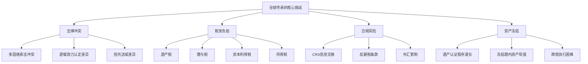
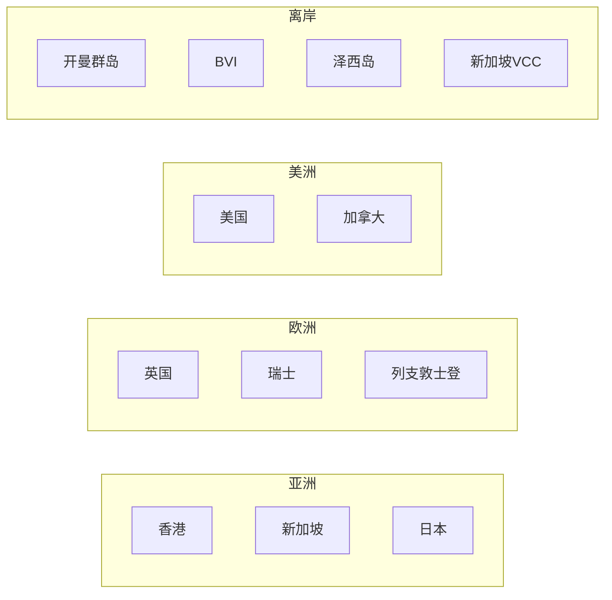
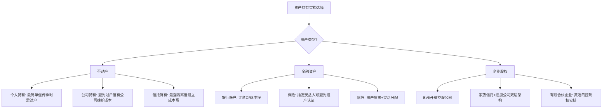
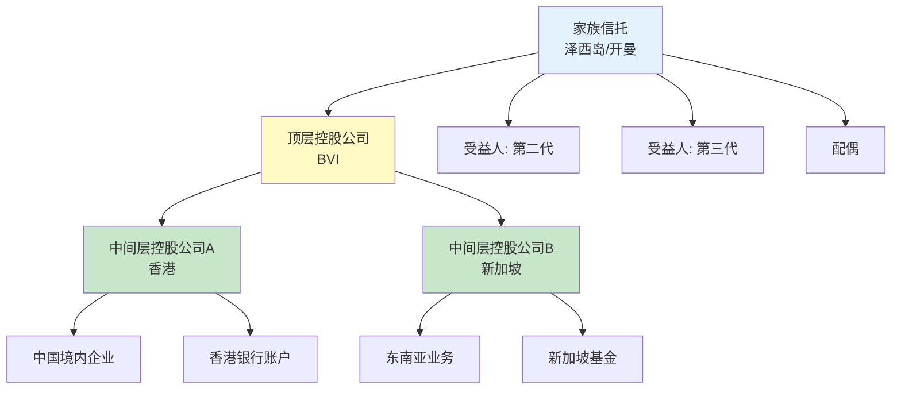
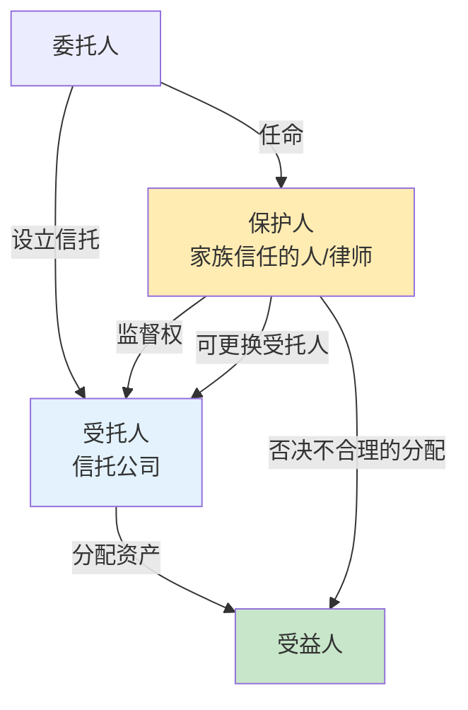
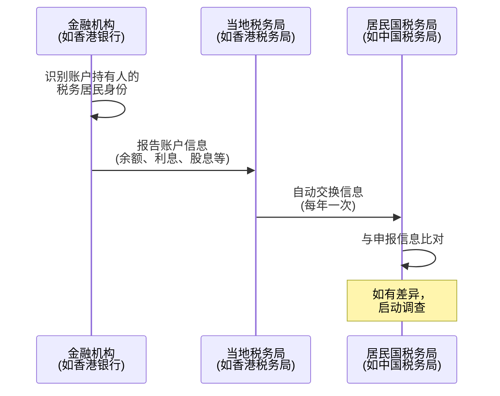
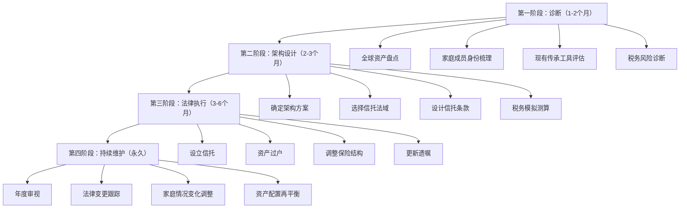
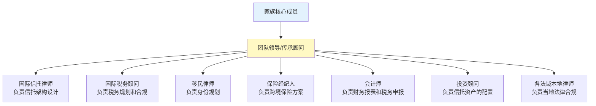
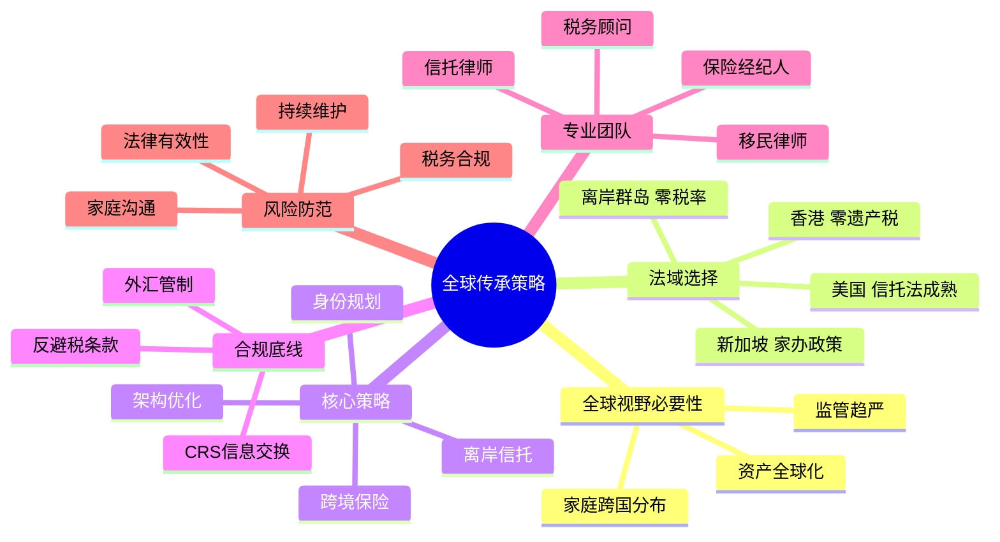

## 四、全球视野下的传承策略

### 4.1 为什么传承规划必须有全球视野

#### 4.1.1 全球化时代的新现实

过去，财富传承主要是"家务事"——资产在国内、继承人在国内、法律适用中国法律。但在全球化深度推进的今天，这个前提已经被彻底打破。

**三个不可逆的趋势正在改变传承的游戏规则：**

**趋势一：资产全球化配置成为常态。** 中国高净值人群中，超过60%拥有海外资产，包括海外房产、境外银行账户、离岸公司股权、海外基金和保险。即使中产家庭，也可能持有港股、美股、QDII基金等跨境资产。当资产分布在多个国家和地区时，传承规划就必须同时满足多个法律体系的要求。

**趋势二：家庭成员跨国分布。** 子女留学后定居海外、配偶持有外国永居权、家族成员分散在不同国家——这些情况在富裕家庭中极为普遍。当继承人与被继承人分属不同税务居民身份时，遗产的分配、税务的计算、法律的适用都会变得极其复杂。

**趋势三：各国税法和合规要求日趋严格。** CRS（共同申报准则）在全球100多个国家实施，海外资产几乎无处藏身；各国遗产税、赠与税的执法力度不断加强；跨境资金流动的监管越来越严——不提前规划，传承时可能面临巨额税负和法律风险。

#### 4.1.2 全球传承面临的核心挑战



**挑战一：法律冲突。** 不同国家的继承法差异巨大。大陆法系国家（中国、日本、德国）有"特留份"制度，法定继承人有权获得遗产的固定比例；普通法系国家（英国、美国、新加坡）则尊重遗嘱自由。在A国合法的遗嘱，在B国可能被认定无效。

**挑战二：多重征税。** 同一份遗产可能在多个环节被征税——被继承人所在国征收遗产税、继承人所在国征收继承税、资产所在国征收资本利得税——如果没有合理的税务规划，传承的财富可能被税收吞噬30%-60%。

**挑战三：合规风险。** CRS实施后，中国税务居民的海外金融账户信息会自动交换给中国税务机关。过去"藏在海外"的资产现在完全透明。未申报海外资产可能面临补税、罚款甚至刑事责任。

**挑战四：资产冻结。** 在许多国家，遗产需要经过法院认证（Probate）程序才能分配给继承人。这个过程在不同国家可能耗时数月到数年。在此期间，资产被冻结，银行账户无法操作，企业股权无法转让——对于需要持续运营的家族企业，这可能是灾难性的。

#### 4.1.3 一个真实案例的警示

张先生，中国籍，在中国拥有价值5000万的企业股权和房产，在美国拥有一处价值200万美元的房产（以个人名义持有），在香港银行有3000万港币存款。妻子和一个儿子均持美国绿卡。

张先生突发疾病去世，未做任何跨境传承规划。其家人面临的问题：

| 问题 | 具体情况 | 后果 |
|------|----------|------|
| 美国遗产税 | 美国对非居民外国人（NRA）的遗产税免税额仅为6万美元，税率最高40% | 美国房产需缴纳约75万美元遗产税 |
| 遗产认证 | 美国房产需经过加州法院Probate程序 | 耗时18个月，律师费约5万美元 |
| 香港银行冻结 | 香港银行收到死亡证明后冻结账户 | 家庭现金流断裂 |
| 中国股权过户 | 企业股权过户需要全体继承人公证同意 | 张先生父母与妻子就股权分配产生纠纷 |
| CRS申报 | 香港银行信息交换给中国税务机关 | 可能面临未申报海外收入的补税问题 |

**如果提前做了跨境传承规划，** 这些问题中的大多数都可以通过设立离岸信托、购买美国人寿保险、调整资产持有结构等方式有效规避或大幅降低损失。

***

### 4.2 全球主要法域的传承法律与税务框架

#### 4.2.1 法域选择的核心考量

进行跨境传承规划时，选择在哪个法域（Jurisdiction）设立传承工具至关重要。核心考量因素包括：

| 考量因素 | 说明 | 权重 |
|----------|------|------|
| 法律稳定性 | 该法域的法律体系是否成熟、可预期 | ★★★★★ |
| 税务效率 | 遗产税、所得税、资本利得税的税率和优惠政策 | ★★★★★ |
| 隐私保护 | 信托和公司信息的公开程度 | ★★★★ |
| 执行效率 | 资产过户、信托分配的执行速度 | ★★★★ |
| 专业服务 | 是否有成熟的信托、法律、税务服务生态 | ★★★ |
| 成本 | 设立和维护费用 | ★★★ |
| 双边协定 | 与中国是否有避免双重征税协定 | ★★★ |

#### 4.2.2 主要法域对比



**（一）香港**

香港是中国高净值人群最常用的跨境传承法域，核心优势在于：

- **零遗产税**：2006年2月11日起正式废除遗产税
- **零资本利得税**：处置资产产生的增值无需缴税
- **信托法成熟**：《受托人条例》和普通法体系为信托提供完善的法律保障
- **与中国大陆联系紧密**：语言、文化相通，专业服务丰富
- **信息保密**：不要求公开披露信托的受益人信息

香港信托的主要特点：
- 可设为可撤销或不可撤销信托
- 信托存续期限无限制（2013年取消了原有的100年上限）
- 可以持有全球各类资产
- 设立成本相对较低（10-50万港币起）

**适用场景：** 中国内地家庭的海外资产传承、家族企业的国际化架构搭建、跨境投资的持股平台。

**（二）新加坡**

新加坡是亚洲最重要的财富管理中心，其传承优势包括：

- **零遗产税**：2008年废除
- **零资本利得税**（大部分情况）
- **政治稳定、法律健全**：普通法体系，司法独立
- **全球声誉良好**：OECD白名单法域，不是"避税天堂"
- **家族办公室政策**：13O/13U税收豁免计划

新加坡家族办公室（Family Office）架构：
- 可获得所得税豁免（满足条件的基金收入）
- 可申请就业准证（EP），实现税务居民身份规划
- 最低资产管理规模：1000万新币（2年内需增至2000万新币）

**适用场景：** 超高净值家族的全球资产管理和传承、希望获得新加坡税务居民身份的家庭。

**（三）开曼群岛/BVI**

离岸法域的核心优势：

- **零税率**：无遗产税、所得税、资本利得税、预提税
- **高度保密**：公司和信托信息不公开
- **设立快速**：通常1-2周完成
- **灵活的公司法**：允许一人公司、无面值股票等

主要工具：
- **开曼豁免公司（Exempt Company）**：常用于基金和控股架构
- **BVI商业公司（BC）**：常用于中间持股层
- **开曼STAR信托**：无固定受益人的目的信托，特别适合家族企业传承
- **VISTA信托（BVI）**：允许委托人对信托资产的管理保留更多控制权

**注意：** 离岸架构在中国面临越来越严格的监管。CRS实施后，离岸公司的实际控制人信息会被交换。单纯以避税为目的的离岸架构可能面临中国反避税调查。

**（四）美国（特拉华州/内华达州/南达科他州）**

美国部分州的信托法具有独特优势：

- **特拉华州**：允许设立"永久信托"（Dynasty Trust），信托存续无期限限制
- **南达科他州**：资产保护信托（DAPT）法规全国最友好，信托资产可免于受益人的债权人追索
- **内华达州**：无州所得税，资产保护法规完善

美国信托的特殊考量：
- 美国对非居民外国人（NRA）的遗产税：仅对美国境内的资产征税，免税额仅6万美元
- 美国公民和居民的遗产税免税额：2024年为1361万美元/人（2025年可能回落至约700万美元）
- FATCA（外国账户税收合规法案）：全球金融机构必须向美国IRS报告美国人的海外资产

**适用场景：** 家族成员有美国公民或绿卡持有者、需要美国资产保护信托、有在美国长期投资需求的家庭。

**（五）英国**

- **遗产税**：税率40%，超过免税额（32.5万英镑）的部分征收
- **信托法**：历史悠久，普通法体系成熟
- **非定居居民（Non-Dom）制度**：2025年4月起重大改革，取消了原有的汇入制（Remittance Basis），改为4年过渡期制度
- **英国信托注册**：2022年起，大部分英国信托需要在HMRC信托注册系统登记

**适用场景：** 有在英国长期居住计划的家庭、需要利用英国信托法进行全球资产规划的家族。

**（六）日本**

- **遗产税**：全球最高的遗产税税率之一，最高55%
- **免税额**：3000万日元 + 600万日元×法定继承人人数
- **税率结构**：

| 应纳税遗产（万日元） | 税率 | 速算扣除额（万日元） |
|----------------------|------|----------------------|
| 1,000以下 | 10% | 0 |
| 3,000以下 | 15% | 50 |
| 5,000以下 | 20% | 200 |
| 10,000以下 | 30% | 700 |
| 20,000以下 | 40% | 1,700 |
| 30,000以下 | 45% | 2,700 |
| 60,000以下 | 50% | 4,200 |
| 60,000以上 | 55% | 7,200 |

- 日本采用"全球征税"原则：日本税务居民的全球资产都要缴纳遗产税
- 日本的"配偶居住权"制度：配偶可继承至少50%的遗产

**适用场景：** 有日本资产或日本税务居民身份的家庭，需要特别注意遗产税规划。

#### 4.2.3 主要法域传承税务对比总表

| 法域 | 遗产税 | 最高税率 | 资本利得税 | 信托法成熟度 | CRS参与 | 与中国双重征税协定 |
|------|--------|----------|------------|--------------|---------|-------------------|
| 中国大陆 | 未开征（预期中） | — | 20% | ★★ | 参与 | — |
| 香港 | 已废除 | 0% | 0% | ★★★★ | 参与 | 有安排 |
| 新加坡 | 已废除 | 0% | 0%（大部分） | ★★★★★ | 参与 | 有 |
| 开曼群岛 | 无 | 0% | 0% | ★★★★ | 参与 | 无 |
| BVI | 无 | 0% | 0% | ★★★★ | 参与 | 无 |
| 美国 | 有 | 40% | 20%（长期） | ★★★★★ | FATCA | 有（有限） |
| 英国 | 有 | 40% | 20% | ★★★★★ | 参与 | 有 |
| 日本 | 有 | 55% | 20% | ★★★ | 参与 | 有 |
| 加拿大 | 视同处置 | ~50% | ~25% | ★★★★ | 参与 | 有 |
| 澳大利亚 | 无（直接） | 0% | 有 | ★★★ | 参与 | 有 |

***

### 4.3 跨境传承的核心策略

#### 4.3.1 策略一：资产持有架构优化

跨境传承的第一步是优化资产的持有架构。不同的持有方式，在传承时的税务和法律后果差异巨大。

**（一）个人直接持有 vs 公司持有 vs 信托持有**



**案例：海外房产的持有架构**

以美国房产为例，三种持有方式的对比：

| 持有方式 | 传承时的遗产税 | Probate程序 | 资产保护 | 维护成本 | 适合场景 |
|----------|---------------|-------------|----------|----------|----------|
| 个人直接持有 | 适用（NRA免税额仅6万美元） | 需要 | 无 | 最低 | 临时持有、准备出售 |
| 美国公司（LLC）持有 | 不直接适用 | 不需要 | 有 | 中等 | 投资性房产 |
| 离岸公司持有 | 不直接适用 | 不需要 | 有 | 较高 | 多处海外房产 |
| 信托持有 | 取决于信托类型 | 不需要 | 最强 | 较高 | 长期传承规划 |

**（二）多层控股架构的搭建**

对于资产规模较大、分布广泛的家庭，通常需要搭建多层控股架构：



**各层的功能：**

- **家族信托层**：实现资产隔离、控制权传承、税务规划。信托持有顶层公司的股权，而不是直接持有资产。
- **顶层控股公司（BVI/开曼）**：作为股权持有的中间层，便于股权的转让和传承。股权转让只需在BVI/开曼完成变更登记，无需在每个资产所在国办理过户。
- **中间层控股公司（香港/新加坡）**：利用当地的税收协定网络，降低股息、利息、特许权使用费的预提税。
- **底层运营公司/资产**：直接持有和运营业务或资产。

**为什么不能直接用信托持有中国境内资产？**

中国《信托法》对信托登记制度的规定尚不完善。不动产等需要登记的资产装入境外信托，在中国法律框架下可能存在效力争议。因此，实践中通常的做法是：境外信托持有境外控股公司的股权，控股公司再通过WFOE（外商独资企业）或VIE架构间接控制境内资产。

#### 4.3.2 策略二：税务居民身份规划

税务居民身份直接决定了传承时适用哪个国家的税法。对于跨境家庭，合理规划家庭成员的税务居民身份，是降低传承税负的关键。

**（一）税务居民身份的判定标准**

| 国家/地区 | 判定标准 | 关键规则 |
|-----------|----------|----------|
| 中国 | 住所或居住满183天 | 在中国有住所的个人，无论居住天数，均为中国税务居民 |
| 美国 | 公民/绿卡/实质居住测试 | 绿卡持有者自动为税务居民；实质居住测试：当年183天+前两年加权天数 |
| 英国 | 法定居民测试+住所测试 | Statutory Residence Test（SRT）综合判定 |
| 新加坡 | 居住满183天 | 实际管理和控制中心在新加坡 |
| 香港 | 通常居住于香港/居住满180天（或连续两年中满300天） | 以"定居意向"为核心判断 |

**（二）身份规划的实操路径**

**路径一：子女已移民海外**

如果子女已获得外国永居权或公民身份，需要同时考虑：
- 该国对公民/居民的全球征税义务
- 中国对非居民的遗产处理规则
- 两国之间是否有避免双重征税协定

**路径二：家庭成员身份分离**

常见安排：父母保留中国税务居民身份，子女成为新加坡/香港税务居民。传承时：
- 父母的中国境内资产按中国法律处理
- 子女作为非中国税务居民，继承海外资产时可能享受更优惠的税务安排
- 通过信托架构实现跨境资产的统一管理和分配

**路径三：家族办公室+就业准证**

在新加坡设立家族办公室，家族成员通过就业准证（EP）获得新加坡税务居民身份：
- 家族办公室可享受13O/13U税收豁免
- 家族成员的新加坡收入按新加坡税率纳税（最高22%，远低于中国45%）
- 满足居住要求后可申请永久居民

**身份规划的风险提示：**

- 不要为了避税而放弃中国国籍。中国不承认双重国籍，一旦放弃，恢复极其困难
- 税务居民身份的变更必须有实质性依据（真实居住、工作、生活），不能仅靠"纸面搬家"
- CRS和FATCA下，"税务套利"的空间越来越小，合规是底线

#### 4.3.3 策略三：利用跨境保险实现传承

跨境保险是全球传承规划中极具性价比的工具，核心优势在于：

**（一）人寿保险的跨境传承优势**

| 优势 | 说明 |
|------|------|
| 避免遗产认证 | 指定受益人的保险理赔金不经过遗产认证程序，直接支付给受益人 |
| 杠杆效应 | 用较少的保费撬动较大的保额，放大传承金额 |
| 流动性保障 | 理赔通常在30天内完成，为家庭提供即时现金流 |
| 税务优化 | 在多数法域，人寿保险理赔金免征所得税 |
| 隐私保护 | 保险理赔是受益人与保险公司之间的合同关系，不公开 |

**（二）主要法域的保险税务处理**

| 法域 | 理赔金是否征税 | 是否纳入遗产 | 注意事项 |
|------|---------------|-------------|----------|
| 中国大陆 | 免征所得税 | 不纳入遗产 | 保单需指定受益人，否则作为遗产处理 |
| 香港 | 免征 | 不纳入 | 无遗产税，完美工具 |
| 新加坡 | 免征 | 不纳入 | 无遗产税 |
| 美国 | 免征所得税 | 纳入遗产（若被保险人为保单所有人） | NRA的美国保单可能不纳入遗产 |
| 英国 | 免征所得税 | 可能纳入（取决于信托持有方式） | 建议通过信托持有保单 |
| 日本 | 免征所得税 | 纳入遗产 | "500万×法定继承人人数"的非课税额度 |

**（三）跨境保险的实操方案**

**方案一：香港万用寿险（Universal Life）**

适合资产规模500万以上的家庭：
- 保额灵活，可自定义
- 保费可一次性缴清或分期缴纳
- 保单可质押贷款，保持流动性
- 理赔金直接支付给指定受益人，不经过香港遗产认证

**方案二：百慕大/开曼大额保单**

适合超高净值家族（保额500万美元以上）：
- 离岸法域，零税率
- 可与家族信托配合使用
- 保单持有人设为信托，确保不属于任何个人的遗产
- 全球主要再保险公司承保，安全性高

**方案三：新加坡指数型万用寿险（IUL）**

适合追求保单增值的家庭：
- 保单现金价值与股指挂钩（如标普500），有机会获得较高收益
- 有保底收益（通常0%-1%），不会亏损
- 新加坡零遗产税+零资本利得税
- 可通过保单贷款实现"生前传承"

#### 4.3.4 策略四：跨境信托的深度运用

跨境信托是全球传承规划的核心工具，但其结构设计远比单一法域的信托复杂。

**（一）离岸信托的主要类型及其传承功能**

| 信托类型 | 法域 | 核心特点 | 传承功能 |
|----------|------|----------|----------|
| 全权信托（Discretionary Trust） | 开曼/泽西/新加坡 | 受托人有完全的分配裁量权 | 灵活分配，适应家庭变化 |
| 固定信托（Fixed Trust） | 英国/香港 | 受益人的权益固定 | 确定性强，避免争议 |
| 保护性信托（Protective Trust） | 泽西/根西 | 受益人权益在特定条件下终止转为全权信托 | 防止受益人挥霍 |
| 目的信托（Purpose Trust） | 开曼STAR/BVI | 无固定受益人，为特定目的设立 | 适合家族企业股权传承 |
| VISTA信托 | BVI | 委托人可指定信托持有公司股权的管理规则 | 保持家族对企业的控制 |
| 永续信托（Dynasty Trust） | 特拉华/南达科他 | 无存续期限限制 | 跨越多代的财富传承 |

**（二）信托保护人（Protector）制度**

在跨境信托中，保护人的角色至关重要：



**保护人的权力通常包括：**
- 增加或移除受益人
- 更换受托人
- 否决受托人的投资或分配决定
- 修改信托的适用法律和管辖法域

**保护人的最佳人选：**
- 委托人信任的家庭成员（但需避免利益冲突）
- 家族律师或长期顾问
- 专业的信托保护人公司

**（三）信托的"保留权力"问题**

委托人在设立不可撤销信托后，理论上应完全放弃对信托资产的控制权。但在实践中，许多委托人希望保留一定的影响力。不同法域对此的规定不同：

| 法域 | 委托人可保留的权力 | 风险 |
|------|-------------------|------|
| 开曼 | 较宽松，可通过Letter of Wishes表达意愿 | 保留过多权力可能导致信托被"击穿" |
| BVI（VISTA） | 可保留任命和罢免董事的权力 | VISTA信托有专门的法律保护 |
| 新加坡 | 可保留投资建议权 | 需在信托契约中明确规定 |
| 泽西 | 可保留投资同意权和分配否决权 | 2018年修订后更灵活 |
| 香港 | 可保留部分权力，但无明确立法 | 判例法为主，存在一定不确定性 |

**风险提示：** 如果委托人保留过多控制权，在某些法域（如美国IRS、英国HMRC）可能被认定信托是"虚壳"（Sham Trust），导致信托资产仍被视为委托人的遗产，失去资产隔离和税务优化的功能。

***

### 4.4 CRS与全球合规：不可忽视的监管框架

#### 4.4.1 CRS（共同申报准则）的运作机制

CRS是OECD主导的全球税务信息自动交换框架，已有超过100个国家和地区参与。其核心运作机制：



**CRS报告的信息范围：**
- 账户持有人的姓名、地址、税务居民国、纳税人识别号（TIN）
- 账户号码
- 年末账户余额或价值
- 年度内的利息、股息、出售金融资产的收入总额
- 其他收入

**哪些机构需要报告？**
- 商业银行、投资银行
- 保险公司（具有现金价值的保单）
- 证券公司、基金公司
- 信托公司（信托本身是报告主体）
- 某些实体（如投资机构、被动非金融实体）

#### 4.4.2 CRS对中国高净值人群的影响

**影响一：海外金融资产完全透明**

过去，中国税务居民在海外银行的存款、投资账户等信息对中国税务机关是不透明的。CRS实施后，这些信息每年都会自动交换。截至2024年，中国已与100多个国家和地区建立了信息交换关系。

**影响二：离岸架构被穿透**

CRS不仅报告个人账户，还报告"控制人"信息。如果一个BVI公司在中国税务居民的控制下，该公司的账户信息也会被报告给中国。

**影响三：历史税务风险暴露**

如果之前未申报海外收入或资产，CRS可能导致历史问题被追溯。中国个人所得税法规定，税务居民的全球收入都需要纳税。

#### 4.4.3 合规框架下的传承规划

**原则：合规是底线，规划是手段。** 跨境传承规划必须在完全合规的前提下进行，不能依赖信息不透明来规避税务义务。

**合规框架下的优化策略：**

| 策略 | 说明 | 合规性 |
|------|------|--------|
| 利用免税额 | 不同国家的遗产税/赠与税都有免税额 | 完全合法 |
| 赠与税年度免税额 | 如美国每人每年可赠与1.8万美元（2024年）不征税 | 完全合法 |
| 配偶间免税赠与 | 多数国家对配偶间的赠与和继承免税或减税 | 完全合法 |
| 慈善捐赠抵扣 | 慈善捐赠可从遗产中扣除 | 完全合法 |
| 保险理赔金免税 | 多数国家的人寿保险理赔金免征所得税 | 完全合法 |
| 信托的合理运用 | 利用信托实现资产隔离和分配灵活化 | 完全合法（需正确设立） |

**红线：以下行为属于违法，绝对不能做：**
- 隐瞒海外资产不申报
- 伪造信托文件转移资产
- 利用虚假交易逃避遗产税
- 通过地下钱庄转移资金出境
- 在CRS信息交换中提供虚假税务居民身份

***

### 4.5 不同资产类型的跨境传承实操

#### 4.5.1 海外不动产

**核心问题：** 不动产适用不动产所在地法律（物之所在地法），无法通过信托完全规避当地的继承法和税务。

**各国不动产传承的关键规定：**

| 国家 | 遗产税/继承税 | 继承法特点 | 实操建议 |
|------|-------------|-----------|----------|
| 美国 | NRA遗产税40%，免税额仅6万美元 | 各州法律不同 | 通过LLC或信托持有，配合人寿保险覆盖税负 |
| 英国 | 40%，免税额32.5万英镑 | 可通过遗嘱指定继承人 | 主要住宅有额外17.5万英镑免税额 |
| 日本 | 最高55% | 法定继承份额（特留份） | 提前赠与或通过法人持有 |
| 加拿大 | 视同处置征税 | 各省法律不同 | 主要居所豁免可能适用 |
| 澳大利亚 | 无直接遗产税 | 各州法律不同 | 但资产增值可能触发CGT |

**实操方案：**

**方案一：LLC持有+信托控制**

```text
家族信托（开曼）
    └── BVI公司
         └── 美国LLC
              └── 美国房产
```

- 房产过户只需转让LLC的股权，不需要在房产所在地办理过户
- 信托持有BVI公司的股权，实现资产隔离
- LLC层面可选择税务穿透（Pass-through），避免双重征税

**方案二：合伙企业持有**

```text
家族信托 → LP（有限合伙）
    ├── GP（普通合伙）：家族控制的管理公司
    └── LP份额：按比例分配给受益人
```

- GP保留管理控制权
- LP份额可以灵活分配和转让
- 合伙企业层面不征税，收入直接穿透到合伙人

#### 4.5.2 境外金融资产

**银行存款：** 最简单的传承方式是指定联名账户持有人或设立"死亡时转移"（TOD, Transfer on Death）指令。

**证券账户：** 多数券商允许指定受益人。建议：
- 在开户时就填写受益人表格
- 定期更新受益人信息
- 考虑将证券账户装入信托

**基金和理财产品：** 需要注意：
- 不同基金公司的受益人指定规则不同
- 某些基金在持有人死亡时自动赎回，触发资本利得税
- 通过公司或信托持有可避免自动赎回

#### 4.5.3 境外企业股权

跨境持有的企业股权传承是最复杂的情况，需要考虑：

| 考量因素 | 说明 |
|----------|------|
| 控制权延续 | 股权传承后，谁来管理企业？ |
| 税务影响 | 股权过户是否触发资本利得税？ |
| 法律合规 | 目标国家对外国人持股是否有限制？ |
| 股东协议 | 现有股东协议中是否有限制转让条款？ |
| 估值争议 | 股权价值如何评估？ |

**常见的跨境股权传承架构：**

```text
创始人（中国籍）
    └── 家族信托（新加坡/泽西）
         └── BVI控股公司
              ├── 香港公司 → 中国境内运营实体
              ├── 新加坡公司 → 东南亚业务
              └── 美国LLC → 美国业务
```

**关键操作步骤：**
1. 在信托设立前完成股权估值（独立评估师出具报告）
2. 将BVI公司股权转入信托（这一步在BVI法律下只需变更股东名册）
3. 在信托契约中明确企业经营的决策机制
4. 设立保护人制度，确保家族对重大事项有否决权
5. 制定家族宪法，规定企业经营的价值观和原则

#### 4.5.4 数字资产与加密货币

加密货币的跨境传承面临独特挑战：

- **私钥管理：** 如果继承人不知道私钥或助记词，资产将永久丢失
- **法律地位不确定：** 不同国家对加密货币的法律定性不同（财产、货币、证券、商品）
- **估值困难：** 加密货币价格波动剧烈，遗产估值难以确定
- **合规要求：** 越来越多国家要求交易所进行KYC/AML，加密资产日趋透明

**实操建议：**

1. **建立数字资产清单：** 记录所有钱包地址、交易所账户、DeFi协议头寸
2. **安全的私钥传承方案：**
   - 使用多签钱包（Multisig），至少2-of-3，其中一把密钥交给信任的律师
   - 使用Shamir秘密分享（SSSS），将助记词拆分为多份，分别交给不同的人
   - 使用遗产规划专用服务（如Casa Covenant、Unchained Capital Inheritance）
3. **在遗嘱中明确数字资产的处置：** 但不要在遗嘱中写入私钥（遗嘱是公开文件）
4. **考虑将交易所账户纳入信托：** 通过信托持有交易所账户的法律权益

***

### 4.6 跨境传承的实操流程与时间表

#### 4.6.1 完整的跨境传承规划流程



#### 4.6.2 各阶段关键任务清单

**第一阶段：诊断（1-2个月）**

| 任务 | 具体内容 | 负责人 |
|------|----------|--------|
| 全球资产盘点 | 列出所有境内外资产，包括房产、金融资产、企业股权、保险、数字资产 | 家族+CFO/财务顾问 |
| 家庭成员身份梳理 | 每位家庭成员的国籍、税务居民身份、居住地 | 移民律师 |
| 现有传承工具评估 | 审查现有遗嘱、信托、保险的有效性和覆盖范围 | 传承律师 |
| 税务风险诊断 | 评估各法域的潜在税负，识别CRS合规风险 | 国际税务顾问 |

**第二阶段：架构设计（2-3个月）**

| 任务 | 具体内容 | 负责人 |
|------|----------|--------|
| 确定总体架构 | 选择信托+控股公司的多层架构方案 | 家族+传承顾问 |
| 选择信托法域 | 综合法律稳定性、税务效率、服务质量等因素 | 信托律师 |
| 设计信托条款 | 资产范围、受益人、分配条件、保护人机制 | 信托律师+家族 |
| 税务模拟测算 | 模拟不同场景下的税务成本 | 国际税务顾问 |
| 成本效益分析 | 设立成本、维护成本 vs 节省的税负 | 财务顾问 |

**第三阶段：法律执行（3-6个月）**

| 任务 | 具体内容 | 负责人 |
|------|----------|--------|
| 设立信托 | 签署信托契约，向信托公司支付设立费 | 信托律师+信托公司 |
| 资产过户 | 将目标资产转入信托或信托持有的公司名下 | 各地律师+会计师 |
| 调整保险结构 | 设立新的跨境保险方案，调整受益人 | 保险经纪人 |
| 更新遗嘱 | 确保境内外遗嘱协调一致 | 各地律师 |

**第四阶段：持续维护（永久）**

| 任务 | 频率 | 具体内容 |
|------|------|----------|
| 年度审视 | 每年 | 审查资产清单、受益人信息、分配条款是否需要调整 |
| 法律变更跟踪 | 持续 | 关注各法域税法、信托法、继承法的最新变化 |
| 家庭情况变化调整 | 即时 | 婚姻状况变化、新生儿、成员身份变化等 |
| 资产配置再平衡 | 每1-3年 | 根据市场情况和家庭需求调整信托的投资策略 |
| CRS合规申报 | 每年 | 确保所有海外资产的申报义务已履行 |

***

### 4.7 跨境传承的专业团队搭建

跨境传承不是一个人或一个律师能完成的工作，需要一个专业的多学科团队：



**选择专业团队的标准：**

| 标准 | 具体要求 |
|------|----------|
| 专业资质 | 持有当地执业许可，有跨境传承的实际经验 |
| 跨法域能力 | 至少熟悉2-3个主要法域的法律和税务 |
| 行业口碑 | 有服务类似资产规模家庭的案例和口碑 |
| 沟通能力 | 能用家族成员理解的语言解释复杂法律概念 |
| 保密意识 | 严格的客户信息保密制度 |
| 团队协作 | 各专业人士之间能有效协作，而非各自为政 |

**团队搭建的成本参考：**

| 服务 | 费用范围 | 说明 |
|------|----------|------|
| 信托架构设计 | 10-50万美元 | 取决于复杂程度 |
| 信托设立费 | 5-20万美元 | 包括信托契约起草 |
| 年度信托管理费 | 1-5万美元/年 | 信托公司的持续服务费 |
| 国际税务咨询 | 500-1500美元/小时 | 按实际工作量计费 |
| 各法域本地律师 | 因地而异 | 通常200-800美元/小时 |

**成本节约建议：**
- 选择在多个法域都有办公室的综合性律所，避免重复沟通
- 先做好充分的诊断和规划，再进入执行阶段，减少返工
- 利用模板化的标准信托条款降低定制化成本

***

### 4.8 全球传承的常见错误与风险防范

#### 4.8.1 六大常见错误

**错误一：用国内思维做跨境规划**

许多家庭习惯了中国的法律框架，认为海外资产的传承可以照搬国内的做法。例如，用中国的遗嘱格式处理海外资产，结果在海外法院不被认可。

**纠正：** 境内和境外资产应分别制定传承方案，由各法域的专业律师负责。

**错误二：忽视"物之所在地法"原则**

不动产的继承适用不动产所在地法律，这是国际私法的基本原则。如果在中国遗嘱中指定了美国房产的继承方案，该方案必须同时符合美国法律，否则无效。

**纠正：** 针对每个国家的不动产，在当地律师指导下制定专项遗嘱或传承安排。

**错误三：过度依赖离岸架构**

有些家庭设立了复杂的多层离岸架构，但没有实际的商业实质，纯粹为了避税。在CRS和反避税法规日趋严格的今天，这种架构面临被税务机关"击穿"的风险。

**纠正：** 离岸架构必须有合理的商业目的和实际的经济实质。2019年以来，开曼、BVI等离岸法域都实施了《经济实质法》，要求在当地注册的实体必须有实质性的经营活动。

**错误四：信托设立后束之高阁**

信托不是"设立即完成"的工具。如果家庭情况、法律环境、资产状况发生变化而信托条款未相应调整，可能导致传承目标无法实现。

**纠正：** 每年至少审视一次信托安排，重大变化时及时与信托律师沟通调整方案。

**错误五：只考虑税务不考虑法律**

有些家庭只关注如何降低税负，忽视了继承法、婚姻法、公司法等法律因素。例如，为了避税将资产赠与子女，但未考虑子女离婚时配偶可能分走一半的风险。

**纠正：** 税务规划和法律规划必须同步进行，不能顾此失彼。

**错误六：家庭成员信息不透明**

家族成员之间对传承安排缺乏沟通，导致执行时产生纠纷。更严重的是，如果继承人不知道海外资产的存在，可能导致资产"沉睡"——无人认领的银行账户、保单、投资最终可能被所在国政府收归国有。

**纠正：** 建立"传承信息清单"，记录所有资产的位置、账户信息、联系人。在适当的时候与核心家庭成员分享。

#### 4.8.2 风险防范清单

| 风险类型 | 具体风险 | 防范措施 |
|----------|----------|----------|
| 法律风险 | 信托被认定无效 | 由各法域专业律师审查信托文件 |
| 税务风险 | 遭遇反避税调查 | 确保架构有合理商业实质 |
| 合规风险 | CRS申报遗漏 | 委托专业机构进行年度申报 |
| 操作风险 | 资产过户不及时 | 制定详细的执行时间表并跟踪进度 |
| 家庭风险 | 家庭成员对方案不理解 | 建立定期沟通机制，设立家族宪法 |
| 汇率风险 | 跨境资产价值波动 | 分散币种配置，使用外汇对冲工具 |
| 政治风险 | 某法域法律环境恶化 | 选择多个法域分散风险，保留信托迁移权 |

***

### 4.9 本节核心要点回顾



**行动建议：**

1. **立即行动：** 盘点你的全球资产清单，包括所有海外银行账户、房产、投资、保险
2. **1个月内：** 咨询国际税务顾问，评估当前的CRS合规状况和潜在税务风险
3. **3个月内：** 与信托律师讨论适合你家庭情况的跨境传承架构
4. **6个月内：** 完成核心传承工具的设立（遗嘱、信托、保险）
5. **持续：** 每年审视一次传承方案，跟踪法律变化，保持家庭沟通

全球视野下的传承规划是一项复杂的系统工程，但越早开始，成本越低、效果越好。不要等到问题发生才去应对——在传承这件事上，预防的成本永远低于治疗。
