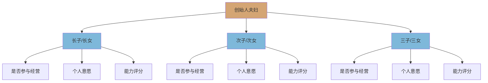
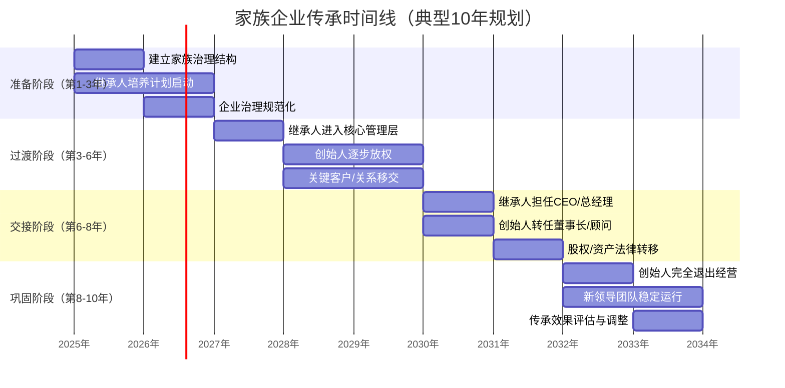
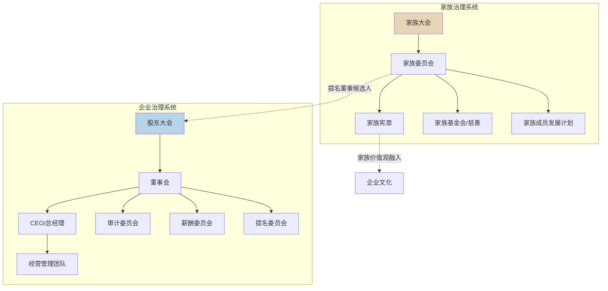
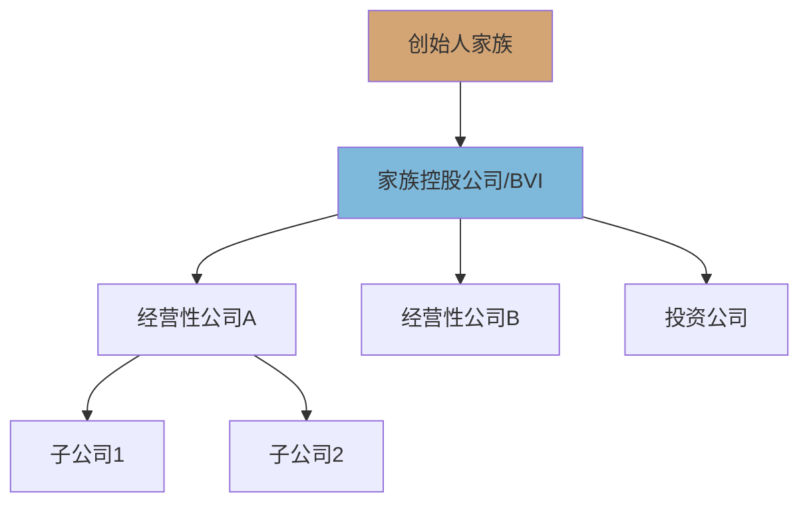

## 五、家族企业传承的实操方法

家族企业是全球最古老、最普遍的商业组织形式。据家族企业研究所（Family Business Institute）统计，全球约70%~90%的企业由家族所有或控制。然而，家族企业的代际传承失败率极高——麦肯锡的研究显示，**只有约30%的家族企业能成功传到第二代，传到第三代的不足13%，传到第四代的仅约5%**。这就是所谓的"富不过三代"现象的全球性印证。

家族企业传承之所以困难，是因为它同时涉及三个维度的复杂问题：**资产传承**（企业股权、不动产、知识产权等如何转移）、**治理传承**（决策权、管理权如何过渡）和**文化传承**（家族价值观、经营哲学如何延续）。任何一个维度的失败，都可能导致整个传承计划崩溃。

本节将从实操角度，系统讲解家族企业传承的完整方法论。

### 5.1 传承前的全面评估

#### 5.1.1 企业现状诊断

在制定传承计划之前，必须对企业的基本面进行全面体检。这不是简单的财务审计，而是一个多维度的系统性评估。

**财务健康度评估：**

| 评估维度 | 关键指标 | 健康标准 | 诊断方法 |
|----------|----------|----------|----------|
| 盈利能力 | 净利润率、ROE、ROA | 连续3年ROE>15% | 对标行业均值 |
| 偿债能力 | 资产负债率、流动比率 | 负债率<60%，流动比>1.5 | 压力测试 |
| 现金流 | 经营性现金流/净利润 | 比值>0.8 | 3年趋势分析 |
| 资产质量 | 应收账款周转、存货周转 | 应收<90天，存货<180天 | 账龄分析 |
| 税务合规 | 纳税申报、税务风险 | 无重大税务争议 | 税务尽调 |

**法律结构审查：**

- 企业组织形式（个人独资/合伙/有限公司/股份公司）的传承约束
- 公司章程中关于股权转让的限制条款
- 现有的对赌协议、优先购买权、竞业禁止等特殊约定
- 知识产权（专利、商标、著作权）的权属是否清晰
- 土地使用权、特许经营权等有期限资产的剩余年限
- 担保、抵押等或有负债的全貌

**经营依赖度分析：**

这是很多家族企业传承中被严重忽视的环节。你需要评估企业对创始人个人的依赖程度：

- **客户关系依赖**：如果创始人离开，多少比例的客户会流失？如果答案是超过30%，则说明客户关系过度个人化，需要在传承前完成客户关系的组织化转移。
- **关键资源依赖**：政商关系、银行授信、供应商资源等是否高度集中在创始人手中？
- **决策依赖**：日常经营中有多少决策需要创始人亲自拍板？如果超过50%的关键决策依赖创始人，则传承风险极高。

#### 5.1.2 家族成员盘点

家族企业传承不是单纯的资产管理问题，更是一个家族内部的人力资源盘点和关系管理问题。

**继承人能力评估矩阵：**

| 评估维度 | 评估内容 | 评分标准（1-5分） |
|----------|----------|-------------------|
| 行业认知 | 对企业所在行业的理解深度 | 1=完全陌生，5=深刻洞察 |
| 管理能力 | 团队管理、决策能力、抗压能力 | 1=无管理经验，5=独立操盘过业务 |
| 财务素养 | 读懂报表、资本运作、风控意识 | 1=不懂财务，5=有CPA/财务实战能力 |
| 领导魅力 | 人格影响力、员工认同度 | 1=无人追随，5=获得核心团队拥护 |
| 创新思维 | 能否推动企业转型升级 | 1=因循守旧，5=有成功创新案例 |
| 家族认同 | 对家族价值观的认同和传承意愿 | 1=完全抗拒，5=高度认同且有使命感 |

**家族成员关系图谱：**

建议绘制一张家族成员关系图，标注以下信息：



这张图的核心目的不是决定"谁来接班"，而是全面了解家族内部的人力资源状况和潜在矛盾点。

#### 5.1.3 利益相关方识别

家族企业传承不仅仅是创始人家族的事，还涉及众多外部利益相关方：

- **核心管理团队**：非家族成员的高管是否愿意配合新掌门人？他们的忠诚度如何维系？
- **核心员工**：关键技术人员、核心销售骨干会不会因为传承而流失？
- **债权人**：银行贷款合同中是否有"控制权变更"条款？传承触发后是否需要提前还款？
- **合作伙伴**：长期供应商、经销商对传承的态度如何？
- **监管部门**：特定行业（金融、医疗、教育等）的资质许可是否受实际控制人变更影响？

### 5.2 传承模式的选择与比较

家族企业传承并非只有一种模式，需要根据家族和企业的实际情况选择最合适的路径。

#### 5.2.1 六种主要传承模式

**模式一：直系血亲内部传承**

这是最常见的模式，由创始人的子女接班。

- **适用条件**：有意愿且有能力的子女，企业规模适中，行业相对稳定
- **优势**：血脉延续，家族控制权不外流，交接成本最低
- **劣势**：可能引发子女间的争夺，"强按牛头不喝水"
- **典型案例**：方太集团茅忠群从父亲茅理翔手中接班，经历了长达10年的"带三年、帮三年、看三年"过渡期

**模式二：家族委员会+职业经理人**

当子女不愿或无力接管时，由家族通过治理结构保持所有权，委托职业经理人经营。

- **适用条件**：家族成员众多但无人有经营能力，企业已发展到较大规模
- **优势**：实现所有权和经营权分离，专业化管理
- **劣势**：代理成本高，存在内部人控制风险
- **典型案例**：美的集团何享健将管理权交给方洪波，家族通过控股保持所有权

**模式三：股权传承+管理层收购（MBO）**

将部分股权出售给现有管理团队，家族保留部分股权但逐步退出日常经营。

- **适用条件**：有成熟的管理团队，子女对经营无兴趣但希望保留部分财务收益
- **优势**：激励管理团队，家族获得流动性
- **劣势**：定价困难，可能低估企业价值
- **适用场景**：中型制造企业、区域性连锁企业

**模式四：家族信托控股**

通过设立家族信托持有企业股权，实现所有权的制度化管理。

- **适用条件**：企业规模较大，家族成员众多，需要长期协调多方利益
- **优势**：资产隔离、税务优化、防止股权稀释、长期锁定控制权
- **劣势**：设立和运营成本高，灵活性受限
- **典型案例**：李嘉诚通过家族信托持有长实、长和等核心资产

**模式五：分拆传承**

将企业的不同业务板块分别传承给不同的子女或家族分支。

- **适用条件**：企业业务多元化，子女各有所长且互补
- **优势**：避免"一山不容二虎"，各展所长
- **劣势**：可能削弱整体协同效应，独立后各自面临更大风险
- **典型案例**：新希望集团刘永好将不同板块分给不同家族成员

**模式六：渐进式退出**

家族逐步出售企业股权，将变现资金用于家族财富管理。

- **适用条件**：子女无意继承，行业处于下行周期，企业估值处于高位
- **优势**：锁定收益，避免"守业"失败的风险
- **劣势**：可能错失企业未来增长，家族失去商业根基
- **适用场景**：传统制造业、政策敏感行业

#### 5.2.2 模式选择决策框架

选择传承模式时，建议使用以下决策矩阵：

| 决策因素 | 权重 | 选项A评分 | 选项B评分 | 选项C评分 |
|----------|------|-----------|-----------|-----------|
| 继承人意愿与能力 | 25% | ? | ? | ? |
| 企业规模与复杂度 | 20% | ? | ? | ? |
| 家族成员数量与关系 | 15% | ? | ? | ? |
| 行业特性与前景 | 15% | ? | ? | ? |
| 税务与法律约束 | 15% | ? | ? | ? |
| 创始人健康与年龄 | 10% | ? | ? | ? |

**评分方法**：每个因素按1-10分评估该选项的适配度，加权求和后取最高分。这个决策矩阵不是用来"算出"正确答案，而是帮助家族系统化地思考每一个因素，避免因情感偏好而忽略关键约束。

### 5.3 传承的时间线与阶段性安排

家族企业传承绝不是一个"宣布交接"的瞬间事件，而是一个持续5~15年的系统工程。

#### 5.3.1 传承四阶段模型



#### 5.3.2 准备阶段（第1~3年）实操清单

这个阶段的核心任务是"打地基"——在创始人仍有绝对权威时建立制度框架。

**第一步：建立家族治理结构**

- 召开家族会议，正式讨论传承议题
- 制定家族宪章（Family Constitution），明确家族对企业的定位和期望
- 设立家族委员会，确定成员构成和议事规则
- 建立家族成员进入企业的任职标准和考核机制

**家族宪章核心内容模板：**

```text
第X条：家族使命与愿景
  - 本家族致力于XXX事业的长期发展
  - 家族企业的核心价值观为XXX

第X条：家族成员任职资格
  - 学历要求：本科及以上（海外留学经历优先）
  - 外部工作经验：至少3年非家族企业工作经验
  - 入职流程：通过标准招聘流程，从基层做起
  - 晋升机制：与非家族员工同一考核标准

第X条：股权管理
  - 股权仅限在直系血亲间流转
  - 股权转让须经家族委员会2/3以上同意
  - 不得将股权用于个人债务担保

第X条：分红政策
  - 每年净利润的XX%用于分红
  - 分红按持股比例分配
  - 企业发展需要时可调整分红比例

第X条：争议解决
  - 家族内部争议首先通过家族委员会调解
  - 调解不成提交指定仲裁机构
```

**第二步：启动继承人培养计划**

继承人培养不是简单地"让他/她在公司待着"，而是一个系统化的成长路径：

| 培养阶段 | 时间 | 具体内容 | 目标 |
|----------|------|----------|------|
| 外部历练 | 1-2年 | 在非家族企业工作，积累独立职场经验 | 建立独立人格和职业素养 |
| 基层轮岗 | 6-12个月 | 在企业的生产、销售、财务等部门轮岗 | 了解企业全貌和一线实况 |
| 项目历练 | 1-2年 | 负责独立项目（新产品线、新区域市场等） | 锻炼独立决策和承担责任 |
| 副手期 | 1-2年 | 担任创始人副手，参与核心决策 | 理解高层决策逻辑，建立人脉 |
| 共管期 | 1-2年 | 与创始人共同管理，各有分工 | 平稳过渡，团队适应新领导 |

**第三步：企业治理规范化**

传承的成败很大程度上取决于企业在传承前是否已建立规范的治理结构：

- **董事会建设**：引入独立董事，建立规范的董事会运作机制
- **财务规范化**：彻底解决"两套账"、关联交易不透明等问题
- **制度建设**：将创始人的"人治"逐步转化为"法治"——建立SOP、决策流程、绩效考核体系
- **信息化建设**：建立ERP、CRM等管理系统，降低对个人记忆和关系的依赖

#### 5.3.3 过渡阶段（第3~6年）关键动作

**权力移交的"七步法"：**

1. **信息权移交**：继承人有权查阅所有财务报表、合同、会议纪要
2. **建议权赋予**：继承人列席所有重要会议，有权发表意见
3. **否决权授予**：对特定金额以上的支出拥有否决权
4. **分管权移交**：负责某一块业务的全权管理
5. **人事权移交**：有权决定分管范围内的人员任免
6. **决策权共享**：重大决策由创始人和继承人共同决定
7. **最终决策权移交**：继承人拥有最终拍板权

每一步都需要设定明确的触发条件和评估标准，而不是"感觉差不多了就交"。

**创始人放权的心理准备：**

创始人放权是传承中最难的部分。很多传承失败，不是继承人不行，而是创始人放不了手。创始人需要认识到：

- 放权不是"失去"，而是"升级"——从操作者变为战略家
- 继承人犯错是成长的必要成本，不能因为一次错误就收回权力
- "我在的时候公司好，不代表我不在公司就不好"——可能恰恰相反
- 创始人应该找到企业之外的人生意义（慈善、教育、写作等）

#### 5.3.4 交接阶段（第6~8年）法律操作

**股权结构设计：**

股权传承的核心挑战是：如何在实现控制权转移的同时，保障其他家族成员的合理权益，并保持企业的稳定运行。

**方案A：直接股权转让**
- 创始人将股权转让给继承人
- 优点：简单直接
- 缺点：可能触发高额个人所得税（股权转让所得的20%）
- 适用：企业净资产较低或有亏损可对冲的情况

**方案B：股权赠与**
- 直系亲属间的股权赠与
- 优点：部分地区免征个人所得税
- 缺点：受赠方未来转让时，成本基数为零，税负后移
- 适用：家族内部传承，不涉及外部交易

**方案C：以股权出资设立新公司**
- 创始人以股权出资设立控股公司，逐步调整控股公司的股东结构
- 优点：可递延纳税，操作空间大
- 缺点：结构复杂，需要专业税务和法律团队
- 适用：中大型企业，有专业顾问团队支持

**方案D：通过有限合伙企业（LP）架构**
- 设立有限合伙企业持有核心股权，家族成员通过入伙/退伙实现权益调整
- 优点：GP保持控制权，LP享受收益权，灵活性强
- 缺点：GP承担无限责任
- 适用：需要在多个家族成员间分配收益权的情况

**表决权安排的关键条款：**

```text
【一致行动协议核心条款】

第X条：一致行动范围
  协议各方在行使以下权利时应保持一致：
  (1) 股东大会的表决权
  (2) 董事候选人的提名权
  (3) 对公司重大事项的决策权

第X条：决策机制
  协议各方在表决前应进行协商，如未能达成一致：
  (1) 日常经营事项：以XXX的意见为准
  (2) 重大投资事项：以2/3以上协议方同意为准
  (3) 股权变动事项：全体一致同意

第X条：协议期限
  本协议有效期为XX年，到期后可续签

第X条：退出机制
  任何一方退出本协议须提前XX个月书面通知其他各方
```

### 5.4 家族治理与企业治理的平衡

#### 5.4.1 双轨治理架构

家族企业传承中最核心的治理难题是：家族逻辑和商业逻辑的冲突。

家族讲亲情、讲辈分、讲公平；企业讲绩效、讲能力、讲效率。如果不能建立清晰的治理边界，这两种逻辑必然产生冲突。

**推荐的双轨治理架构：**



**关键原则：**

- **家族事务在家族会议解决，企业事务在董事会解决**：不能在饭桌上谈人事任命，也不能在董事会上追究家务事
- **家族成员的薪酬和晋升由企业制度决定**：不能因为"是老板的儿子"就自动升职加薪
- **非家族高管应获得同等尊重**：如果家族成员在企业中享有特权，优秀的职业经理人必然流失

#### 5.4.2 家族委员会的运作机制

家族委员会是连接家族和企业的桥梁，其核心职能包括：

| 职能 | 具体内容 | 频率 |
|------|----------|------|
| 家族成员沟通 | 分享企业经营信息，讨论家族关心的议题 | 每季度一次 |
| 继承人培养 | 评估培养计划进展，调整培养方案 | 每半年一次 |
| 股权管理 | 审议股权变动、分红方案等 | 每年一次 |
| 家族宪章修订 | 根据实际情况修订家族宪章 | 需要时 |
| 争议调解 | 调解家族成员间的利益冲突 | 需要时 |
| 慈善规划 | 决定家族慈善方向和投入 | 每年一次 |

#### 5.4.3 "家族办公室"的角色

对于资产规模超过1亿元的家族，建议设立家族办公室（Family Office），作为家族治理的专业支撑机构：

- **财富管理**：家族资产的配置、投资、风控
- **税务规划**：家族整体税务架构的优化
- **法律服务**：合同审查、争议处理、合规管理
- **传承规划**：代际传承方案的设计和执行
- **教育培养**：下一代的财商教育和能力培养
- **家族文化**：家族历史记录、文化活动组织

### 5.5 股权架构的传承设计

#### 5.5.1 控股结构的选择

家族企业传承中，股权架构设计的核心目标是：**用最小的股权比例保持最大的控制权**。

**三层控股架构：**



**AB股（双重股权）结构：**

如果企业计划上市或引入外部投资者，AB股结构是保持家族控制权的重要工具：

- A类股：1股1票，面向外部投资者
- B类股：1股10票（或更高），由家族成员持有
- 通过B类股的超级投票权，家族可以在持股比例下降到30%以下时仍然保持控制权

**有限合伙架构：**

- 设立有限合伙企业作为持股平台
- 家族核心成员担任GP（普通合伙人），掌握决策权
- 其他家族成员作为LP（有限合伙人），享有收益权但不参与决策
- 这种架构的优势是：GP可以用极低的出资比例（如1%）控制整个平台的决策

#### 5.5.2 防止股权稀释的条款设计

在传承过程中，需要通过制度设计防止股权因各种原因被稀释：

- **优先购买权**：任何家族成员转让股权，其他家族成员享有优先购买权
- **共同出售权（Tag-Along）**：如果某个家族成员出售股权给外部人，其他成员有权按同等条件一起出售
- **反稀释条款**：引入外部投资时，家族的持股比例不得低于某个底线
- **股权锁定**：家族成员在特定期限内不得转让股权
- **回购条款**：家族成员退出时，股权由家族控股公司或其他成员按约定价格回购

### 5.6 常见传承陷阱与应对策略

#### 5.6.1 陷阱一：生前不安排，身后一地鸡毛

**现象**：创始人身体健康时不愿面对传承问题，一旦突发意外，企业陷入群龙无首的混乱。

**应对**：传承规划的最佳时间是创始人55~60岁，身体健康、精力充沛时。这不是"准备退休"，而是"为企业的下一个20年做规划"。

**立即行动清单**：
- 即使不打算近期交班，也要立即起草遗嘱，明确企业股权的处理方式
- 指定紧急情况下的临时负责人（"如果我明天住院，谁来管公司"）
- 确保至少有两名高管掌握企业的银行账户、核心合同、客户关系等关键信息

#### 5.6.2 陷阱二：传承方案过于僵化

**现象**：传承方案制定后不根据实际情况调整，导致方案脱离现实。

**应对**：传承方案应该是"活的文档"，至少每两年审查一次，根据以下变化进行调整：
- 企业经营状况的变化（增长/下滑/转型）
- 家族成员情况的变化（新增/离世/意愿改变）
- 法律法规的变化（税法修订、公司法修订等）
- 行业环境的变化（技术革命、政策调整等）

#### 5.6.3 陷阱三：忽略"非继承人"子女的感受

**现象**：把所有关注和资源都给了"接班人"，其他子女感到被忽视甚至被剥夺，导致家族矛盾。

**应对策略**：

| 子女角色 | 推荐安排 | 注意事项 |
|----------|----------|----------|
| 接班人 | 获得控股权 + 经营管理权 | 需承担照顾家族的更多责任 |
| 参与经营的非接班子女 | 获得适当股权 + 管理岗位 | 薪酬和晋升按能力而非血缘 |
| 不参与经营的子女 | 获得现金/不动产/信托受益权 | 确保"拿钱不干预经营"的边界 |
| 有特殊需要的子女 | 设立专项信托基金 | 保障其基本生活需要 |

#### 5.6.4 陷阱四：忽视婚姻风险

**现象**：继承人离婚导致企业股权被分割，甚至落入外人之手。

**应对**：
- 在继承人结婚前，通过婚前协议明确家族股权不属于夫妻共同财产
- 通过家族信托持有股权，即使继承人离婚，信托资产不参与分割
- 在公司章程中规定：股东离婚时，其配偶只能获得股权的经济价值补偿，不能获得股东身份

#### 5.6.5 陷阱五：急于求成的"速交班"

**现象**：创始人突然决定"我不管了，你来"，在短时间内完成权力交接，导致企业经营出现混乱。

**应对**：传承必须是渐进式的。即使继承人已经非常成熟，也建议至少保留2~3年的过渡期。在过渡期中，创始人以"董事长"或"顾问"身份存在，不直接干预经营，但在重大决策时可以提供建议。

### 5.7 税务筹划要点

#### 5.7.1 传承中的主要税种

| 税种 | 纳税义务 | 税率 | 优化方向 |
|------|----------|------|----------|
| 个人所得税 | 股权转让/赠与所得 | 20% | 选择合适的转让方式和时点 |
| 企业所得税 | 企业层面的利润 | 25% | 利用税收优惠、亏损弥补 |
| 印花税 | 股权转让合同 | 0.05% | 合理确定转让价格 |
| 增值税 | 资产重组可能触发 | 视情况 | 符合条件的重组可免征 |
| 契约税 | 不动产过户 | 3%~5% | 符合条件的继承可减免 |

#### 5.7.2 关键税务优化策略

**策略一：利用税收递延政策**

符合条件的股权划转（如100%直接控制的母子公司之间），可以适用特殊性税务处理，暂不确认股权转让所得，实现税负递延。

**策略二：利用亏损弥补**

如果企业有历史亏损，可以在传承前通过合理的业务安排消化部分利润，降低传承时点的企业价值，从而减少税基。

**策略三：分步转让**

将股权分多个年度、多次转让，每次转让的金额控制在较低水平，避免一次性产生大额应税所得。

**策略四：慈善捐赠抵税**

将部分股权捐赠给符合条件的慈善基金会，既可以实现家族的慈善目标，又可以获得税前扣除，减少整体税负。

**重要提醒**：税务筹划必须在合法合规的前提下进行。"合理避税"和"偷逃税"的界限非常清晰——前者利用法律允许的政策空间，后者违反法律规定。近年来中国税务机关对股权转让的反避税力度不断加大，过度激进的税务安排可能面临补税、罚款甚至刑事责任。

### 5.8 传承后的家族财富管理

传承不是终点，而是新的起点。继承人接手企业后，需要建立一套长期的家族财富管理体系。

#### 5.8.1 资产配置多元化

"不要把所有鸡蛋放在一个篮子里"是财富管理的基本原则，对家族企业继承人尤其重要——他们已经将大量人力资本集中在家族企业中，如果金融资本也全部押注在企业上，风险过于集中。

建议的资产配置比例：

| 资产类别 | 建议占比 | 目的 |
|----------|----------|------|
| 家族企业股权 | 40%~60% | 保持控制权和核心收益来源 |
| 流动性资产 | 10%~20% | 应对突发需要和投资机会 |
| 固定收益类 | 10%~20% | 提供稳定现金流 |
| 不动产 | 10%~15% | 抗通胀、长期增值 |
| 另类投资 | 5%~10% | 私募股权、对冲基金等 |
| 海外资产 | 5%~15% | 分散地域风险 |

#### 5.8.2 家族教育基金

设立家族教育基金，用于支持后代的教育和能力培养。这是确保家族长期竞争力的最重要投资。

- 每年从企业利润中提取固定比例（如1%~3%）注入教育基金
- 基金覆盖家族后代的学历教育、职业培训、海外留学等
- 鼓励后代在不同领域发展，避免"全家族都在一个行业"的风险

### 5.9 本节要点回顾

1. **传承前必须全面评估**：企业现状、家族成员能力、利益相关方诉求，三者缺一不可
2. **传承模式没有"最优解"**：只有"最适合"——取决于继承人意愿、企业规模、家族结构等多种因素
3. **传承是一个10年工程**：准备→过渡→交接→巩固，每个阶段都有明确的任务和里程碑
4. **双轨治理是关键**：家族治理管"家事"，企业治理管"商事"，边界要清晰
5. **股权架构设计决定控制权**：通过AB股、有限合伙、一致行动协议等工具，用最小股权比例保持最大控制权
6. **税务筹划要在合法前提下尽早规划**：分步转让、税收递延、慈善捐赠是三大核心策略
7. **传承不是终点**：继承人接手后需要建立资产多元化配置和家族教育体系
