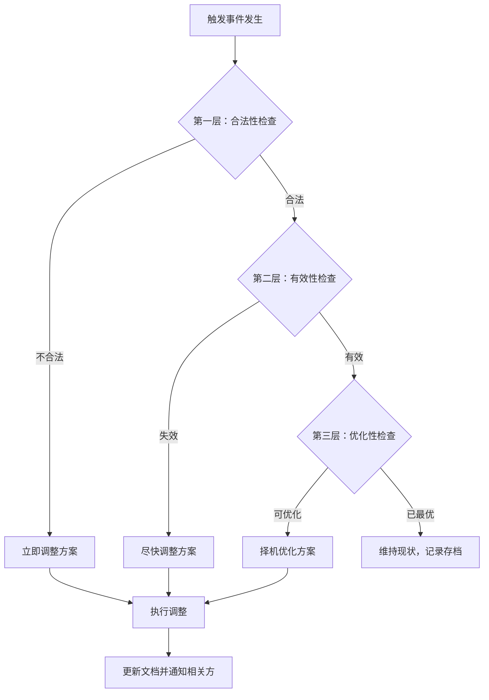

## 六、传承方案的动态调整

财富传承方案不是一份签完就束之高阁的文件。它更像一艘远洋航行的船——需要根据洋流、风向和天气不断调整航向。一个十年前设立的传承方案，可能已经因为家庭结构变化、法律政策更新、资产形态演变而变得不再适用，甚至产生反效果。本章将系统讲解如何构建一套"活的"传承方案，使其能够随着人生阶段和外部环境的变化持续发挥应有的作用。

### 6.1 为什么传承方案必须动态调整

#### 6.1.1 静态方案的三大致命缺陷

**第一，"过时的遗嘱比没有遗嘱更危险"。**

很多人认为立好遗嘱就万事大吉，但一份过时的遗嘱可能导致完全违背当事人意愿的结果。例如，某人在2015年立遗嘱将全部财产留给妻子，但2020年离婚后忘记修改遗嘱，2023年再婚后去世——根据《民法典》第1142条，立遗嘱后实施与遗嘱内容相反的民事法律行为的，视为对遗嘱相关内容的撤回。但具体到个案，法律推定与当事人真实意思之间往往存在巨大落差，引发继承纠纷。

**第二，资产形态的剧烈变化。**

十年前的高净值人士可能主要持有房产和银行存款，而今天的资产版图可能已扩展到数字货币、海外基金、家族企业股权、知识产权等。一份仅针对传统资产设计的传承方案，在面对新型资产时会陷入"管不了"的困境。

**第三，家庭结构的复杂化。**

再婚、非婚生子女的出现、家庭成员的丧失、收养关系的建立——每一次家庭结构的变化都可能使原有方案的分配格局变得不合理甚至违法。

#### 6.1.2 动态调整的理论基础

从系统论的角度看，传承方案是一个**开放系统**——它不断地与外部环境（法律、经济、社会）和内部环境（家庭关系、资产状况、健康状态）进行信息和能量的交换。根据热力学第二定律，一个封闭系统必然走向熵增和无序，只有持续引入"负熵"（即信息更新和方案调整），才能维持系统的有序运行。

从行为经济学的角度看，人存在**现状偏见**（Status Quo Bias）——倾向于维持现状而不愿做出改变。这种偏见在传承规划中表现为：立好遗嘱后就不再回顾，即使生活中已经发生了重大变化。克服这种偏见需要建立制度化的审视机制。

### 6.2 触发动态调整的"四大信号"

传承方案的调整不是随意的，而是由明确的触发事件驱动的。我们将触发信号分为四大类：

#### 6.2.1 信号一：家庭生命周期事件

| 事件类型 | 典型场景 | 对传承方案的影响 | 建议响应时间 |
|----------|----------|------------------|-------------|
| 婚姻变化 | 结婚、离婚、再婚 | 配偶权益重新界定，共同财产/个人财产划分变化 | 30天内 |
| 子女变动 | 出生、收养、丧失继承权 | 继承人范围变化，分配比例需调整 | 60天内 |
| 家庭成员丧失 | 配偶或子女去世 | 继承人减少，代位继承问题出现 | 90天内 |
| 家庭关系恶化 | 父子反目、兄弟决裂 | 可能需要调整受益人或设置条件分配 | 视情况而定 |
| 重大疾病 | 委托人或受益人重病 | 加速传承安排，增加医疗保障条款 | 立即响应 |

**案例：再婚家庭的方案调整**

张先生（60岁）与前妻育有一子张甲（35岁），2018年立遗嘱将全部财产留给张甲。2021年张先生再婚，配偶李女士带来一女李乙（28岁）。张先生在未修改遗嘱的情况下于2024年去世。

问题：张甲依据遗嘱要求继承全部财产，李女士主张自己作为配偶的法定继承权，李乙主张继父女关系形成后的适当分得遗产权。

如果张先生在再婚后及时调整方案，可以：（1）为李女士设立居住权信托，保障其晚年居住；（2）将部分资产通过生前赠与转移给张甲；（3）在遗嘱中明确各继承人的份额和条件。这种主动调整远比事后诉讼更能实现当事人的真实意愿。

#### 6.2.2 信号二：资产结构重大变化

资产结构的变化是传承方案调整的重要触发器。以下情况需要立即审视现有方案：

**资产规模的显著增减**：当资产总额变化超过30%时，原有方案的分配比例可能不再合理。例如，某继承人的份额原本占总资产的10%，但由于家族企业上市，该继承人持有的股权价值已经占到总资产的60%——此时需要重新平衡各继承人之间的分配。

**资产形态的转换**：从实物资产转向金融资产、从境内资产转向海外资产、从有形资产转向无形资产（如数字资产、知识产权），每一种转换都可能影响传承工具的选择。例如，房产可以通过遗嘱直接继承，但家族企业股权可能需要通过信托或有限合伙持股平台来传承。

**新增重要资产**：购置海外房产、投资加密货币、获得大额保单赔付——这些新增资产如果未纳入传承方案，可能在传承时成为"漏网之鱼"，引发继承人之间的争议。

**资产所在地的变化**：当资产从一个司法管辖区转移到另一个时，需要考虑当地继承法、税法和外汇管制的影响。例如，中国大陆居民购置了美国房产，其继承需要同时遵守中美两国的法律，这与纯境内资产的传承完全不同。

#### 6.2.3 信号三：法律政策环境变化

法律政策的变化是个人无法控制但必须响应的外部因素。

**税法变化**：遗产税和赠与税政策的调整直接影响传承工具的选择。虽然中国目前尚未开征遗产税，但相关讨论持续存在，一旦开征，现有的传承方案可能需要全面重构。

**民法典及相关司法解释的更新**：《民法典》继承编对遗嘱形式、代位继承、遗嘱执行人等制度进行了重要修改。例如，新增的打印遗嘱和录像遗嘱形式，为行动不便的老年人提供了更多选择。又如，扩大了代位继承的范围，将被继承人的兄弟姐妹的子女纳入代位继承人范围。

**信托法规的完善**：随着《信托法》的修订和家族信托业务规范的出台，信托在传承中的应用将更加广泛和灵活。例如，信托登记制度的完善将解决不动产装入信托的实操难题。

**跨境监管变化**：CRS（共同申报准则）的推进使得海外资产的隐匿越来越困难，原有的一些"避税型"传承安排可能面临合规风险。需要根据最新的国际税收合作框架调整跨境传承方案。

**行业监管政策**：对于家族企业而言，行业监管政策的变化可能影响企业的估值和传承安排。例如，教培行业的政策调整导致相关企业资产大幅缩水，其传承方案需要相应调整。

#### 6.2.4 信号四：委托人意愿的演变

人的想法是会变的。一个40岁时立下遗嘱的人，到了60岁可能对"什么是公平"有了完全不同的理解。

**价值观的变化**：年轻时可能追求"平均分配"，年长后可能更倾向于"按需分配"或"按贡献分配"。有些人在经历人生重大事件后，可能会将部分财产捐赠给慈善事业。

**对继承人能力的重新评估**：随着时间推移，继承人的能力、品格和管理财富的能力会逐渐显现。一个年轻时被认为不适合管理家族企业的子女，可能在中年后展现出卓越的领导力；反之，一个曾经被寄予厚望的继承人，可能因为挥霍或违法行为而不再适合获得大额遗产。

**对受益人需求的重新判断**：一个原本健康的继承人可能罹患重大疾病需要更多保障；一个原本经济独立的继承人可能遭遇事业失败需要支持。

### 6.3 动态调整的系统方法论

#### 6.3.1 定期审视机制：传承方案的"年度体检"

就像人需要定期体检一样，传承方案也需要制度化的审视。建议建立以下审视机制：

**年度审视清单**：

1. **家庭成员清单核实**：确认所有继承人和受益人的现状是否发生变化
2. **资产清单更新**：核实所有资产的存在性、权属、价值是否发生变化
3. **工具有效性检查**：确认遗嘱、信托、保险等工具是否仍然有效和适用
4. **法律合规检查**：确认方案是否符合最新法律法规
5. **税务效率评估**：评估当前方案的税务效率是否仍然最优
6. **执行人/受托人确认**：确认遗嘱执行人、信托受托人是否仍然愿意和能够履行职责

**审视频率建议**：

| 审视类型 | 频率 | 适用场景 |
|----------|------|----------|
| 全面审视 | 每1-2年 | 所有传承方案 |
| 触发式审视 | 事件发生后30天内 | 家庭/资产/法律重大变化 |
| 专家会诊 | 每3-5年 | 涉及跨境、税务、企业传承的复杂方案 |
| 紧急审视 | 立即 | 委托人健康急剧恶化、法律风险暴露 |

#### 6.3.2 调整决策的"三层过滤"框架

不是所有变化都需要调整方案，也不是所有调整都是紧迫的。建议用三层过滤框架来判断：

**第一层：合法性过滤——方案是否仍然合法？**

如果法律变化导致原方案的某些条款违法或失效，必须立即调整。例如，如果遗产税法开征，原方案中未考虑税务成本的分配条款可能导致继承人实际获得的资产远低于预期。

**第二层：有效性过滤——方案是否仍然有效？**

如果家庭结构变化导致原方案无法实现委托人的核心目的，应当尽快调整。例如，原方案将全部财产留给配偶，但配偶已先于委托人去世，遗嘱中的分配方案自然失效。

**第三层：优化性过滤——方案是否仍然最优？**

即使方案仍然合法且有效，也可能存在更优的实现路径。例如，随着信托法规的完善，原来通过保险+遗嘱实现的传承安排，可能通过家族信托实现更高效的资产保护和分配控制。



#### 6.3.3 调整的优先级矩阵

面对多个需要调整的事项时，如何确定优先级？使用**影响度×紧迫度矩阵**：

| | 低紧迫度 | 高紧迫度 |
|---|----------|----------|
| **高影响度** | 计划性调整（如税务优化） | 立即行动（如法律风险） |
| **低影响度** | 常规更新（如地址变更） | 快速处理（如联系方式更新） |

- **高影响+高紧迫**（红色区域）：立即行动。例如，委托人被诊断出重大疾病，需要加速传承安排。
- **高影响+低紧迫**（黄色区域）：计划性调整。例如，评估是否在遗产税开征前提前进行赠与安排。
- **低影响+高紧迫**（蓝色区域）：快速处理。例如，更新遗嘱执行人的联系方式。
- **低影响+低紧迫**（绿色区域）：纳入年度审视即可。例如，资产价值的常规更新。

### 6.4 各传承工具的调整实操

#### 6.4.1 遗嘱的修改与更新

**自书遗嘱和代书遗嘱的修改**：最简单的方式是重新订立一份新遗嘱，并在新遗嘱中明确声明"此前所立一切遗嘱均予以撤销"。根据《民法典》第1142条，立有数份遗嘱，内容相抵触的，以最后的遗嘱为准。

**公证遗嘱的修改**：《民法典》取消了公证遗嘱效力优先的规定，因此修改公证遗嘱不再必须通过公证方式。但考虑到公证遗嘱的证明力最强，建议仍然通过公证方式修改。

**公证遗嘱修改的实操步骤**：

1. 准备材料：身份证、户口簿、原公证遗嘱、需要修改的内容说明
2. 前往公证处：可以选择原公证处或任何公证处
3. 说明修改原因：公证员会询问修改的原因和具体内容
4. 重新制作遗嘱：公证员根据新的意愿起草新的遗嘱文本
5. 签署确认：在公证员面前签署新遗嘱
6. 领取新公证书：新遗嘱生效后，原公证遗嘱自动失效

**重要提醒**：每次修改遗嘱时，务必在新遗嘱中加入"此前本人所立一切遗嘱、遗赠均予以撤销"的声明，避免多份遗嘱并存引发争议。

**遗嘱附书（Codicil）**：如果只是对遗嘱的个别条款进行微调（如更换遗嘱执行人），不必重写整份遗嘱，可以制作一份"遗嘱附书"，说明对原遗嘱的具体修改内容。附书应当满足与原遗嘱相同的形式要求（如自书遗嘱的附书也应自书）。

#### 6.4.2 家族信托条款的修订

家族信托一旦设立，其条款的修改比遗嘱复杂得多，因为信托涉及委托人、受托人、受益人三方的权利义务关系。

**可以修改的条款**：
- 受益人的范围和分配比例（在信托合同允许的范围内）
- 投资指引和资产配置限制
- 分配条件的触发标准（如教育奖励金额、创业启动资金额度）
- 信托期限的延长或缩短

**修改的限制条件**：
- 不得违反信托的根本目的
- 不得损害受益人的既得利益（部分信托合同有此保护条款）
- 需要经过信托委员会或保护人（Protector）的同意
- 不得违反法律的强制性规定

**实操流程**：

1. **提出修改动议**：委托人或家族委员会向受托人提交书面修改申请
2. **法律审查**：受托人委托律师审查修改内容的合法性和可行性
3. **利益相关方协商**：如果修改涉及受益人利益的重大调整，需要与受影响的受益人协商
4. **签署补充协议**：各方签署信托补充协议，明确修改的具体内容
5. **备案和执行**：受托人根据修改后的条款执行信托管理

**费用参考**：

| 修改类型 | 费用范围 | 时间周期 |
|----------|----------|----------|
| 受益人范围微调 | 1-3万元 | 1-2周 |
| 分配条款重大修改 | 3-10万元 | 1-2月 |
| 信托架构重组 | 10-50万元 | 3-6月 |
| 受托人更换 | 5-20万元 | 2-3月 |

#### 6.4.3 保险受益人的变更

保险受益人的变更是传承调整中最简单、最快捷的操作之一，也是很多人忽略的重要环节。

**变更流程**：

1. **联系保险公司**：通过客服热线、APP或线下网点提出变更申请
2. **填写变更申请表**：提供投保人身份证明、保险合同、新受益人信息
3. **提交审核**：保险公司审核通过后出具批单
4. **保存凭证**：妥善保管变更批单，确保与保险合同一并存放

**注意事项**：
- 投保人可以随时变更受益人，无需经被保险人或原受益人同意
- 变更受益人应当书面通知保险公司，口头变更不产生法律效力
- 如果指定了多个受益人，应明确各受益人的受益份额
- 建议指定"顺位受益人"（即第一受益人无法领取时的替代受益人），避免保险金成为遗产

**需要变更受益人的典型场景**：
- 离婚后需要将前配偶从受益人中移除
- 新增子女后需要将其加入受益人名单
- 原受益人去世后需要重新指定
- 家庭关系恶化需要调整受益份额

**重要提醒**：很多人在购买保险时填写受益人后就再也不关注了。建议每年检查一次所有保单的受益人设置，确保其与当前的家庭结构和传承意愿一致。

#### 6.4.4 家族企业股权传承方案的调整

家族企业股权的传承方案调整是最复杂的领域之一，因为涉及企业治理、税务筹划、家族关系等多重因素。

**常见调整场景**：

**场景一：继承人能力分化**

初始方案中将股权平均分配给三个子女，但经过10年发展，长子展现出卓越的管理能力，次子和三子对企业经营不感兴趣。此时需要调整方案，将控制权集中到长子手中，同时保障次子和三子的经济利益。

调整方案：
- 将企业股权分为A类（管理权股权）和B类（收益权股权）
- 长子持有A类股权，拥有投票权和管理权
- 次子和三子持有B类股权，享受分红但不参与管理
- 或者通过有限合伙持股平台，长子担任GP，次子和三子担任LP

**场景二：企业上市后的方案调整**

非上市公司的股权传承方案通常侧重于控制权的维持，但企业上市后，股权的流动性大大增强，原有方案可能需要调整。

需要考虑的变化：
- 上市后的锁定期限制
- 公众公司治理规范对家族控制的影响
- 股权市值的大幅波动对分配公平性的影响
- 上市公司信息披露要求对家族隐私的影响

**场景三：引入职业经理人后的方案调整**

当家族企业从"家族经营"转向"家族所有+职业经理人经营"时，传承方案需要从"管理权传承"转向"所有权传承"和"监督权传承"。

### 6.5 数字化工具与动态管理

#### 6.5.1 传承方案的数字化管理框架

传统的传承方案管理依赖纸质文件和人工记忆，效率低下且容易遗漏。现代传承管理应当借助数字化工具建立系统化的管理框架。

**核心管理要素**：

| 管理对象 | 需要记录的信息 | 建议工具 |
|----------|----------------|----------|
| 遗嘱 | 存放位置、执行人联系方式、修改历史 | 加密云存储+律师保管 |
| 信托 | 受托人联系方式、分配条款摘要、年度报告 | 家族办公室管理系统 |
| 保险 | 所有保单清单、受益人设置、缴费日历 | 保单管理APP或Excel |
| 房产 | 产权证号、所在地、估值记录 | 资产清单表格 |
| 股权 | 持股比例、公司章程相关条款、估值 | 企业管理系统 |
| 数字资产 | 账号清单、密码（加密存储）、恢复方式 | 密码管理器+数字遗嘱 |

#### 6.5.2 传承方案的版本管理

像管理软件代码一样管理传承方案的版本，可以避免混乱和争议。

**版本管理规范**：

1. **统一编号规则**：建议采用"日期+版本号"的格式，如"2024-V2.1"
2. **修改日志**：每次修改都记录修改日期、修改内容、修改原因、修改人
3. **版本对比**：保留所有历史版本，便于追溯和对比
4. **授权管理**：明确谁有权进行修改，修改需要哪些人的同意

**版本记录模板**：

```text
传承方案版本记录
==================
方案编号：Estate-Plan-2024
当前版本：V3.2
最后更新：2024年6月15日

版本历史：
V1.0 (2020-03-01) - 初始方案
  - 设立人：张先生
  - 主要内容：遗嘱+保险+信托基本框架

V2.0 (2022-01-10) - 全面修订
  - 修改原因：再婚
  - 主要变更：新增配偶权益条款，调整子女分配比例
  - 参与方：张先生、律师王某、信托公司

V2.1 (2022-08-15) - 局部调整
  - 修改原因：女儿出国留学
  - 主要变更：新增海外资产处置条款
  - 参与方：张先生、律师王某

V3.0 (2023-06-01) - 重大调整
  - 修改原因：家族企业引入战略投资者
  - 主要变更：调整股权传承方案，新增AB股结构
  - 参与方：张先生、律师王某、会计师李某、信托公司

V3.1 (2024-01-20) - 保险调整
  - 修改原因：新增大额保单
  - 主要变更：更新保险清单和受益人设置
  - 参与方：张先生、保险顾问

V3.2 (2024-06-15) - 法律合规更新
  - 修改原因：信托法规更新
  - 主要变更：更新信托条款以符合新规
  - 参与方：张先生、律师王某、信托公司
```

#### 6.5.3 家族传承委员会的运作

对于资产规模较大、家庭结构复杂的家族，建议设立家族传承委员会作为传承方案动态调整的常设机构。

**委员会构成**：

| 角色 | 人选建议 | 主要职责 |
|------|----------|----------|
| 主席 | 家族核心成员（通常为委托人） | 召集会议、最终决策 |
| 法律顾问 | 专业律师 | 法律合规审查、文书起草 |
| 财务顾问 | 注册会计师/税务师 | 财务分析、税务优化 |
| 信托顾问 | 信托公司代表 | 信托方案设计与执行 |
| 家族代表 | 各房代表 | 反映各房诉求、协调家族关系 |
| 秘书 | 专业人士或家族办公室人员 | 会议记录、方案跟踪 |

**运作机制**：

1. **定期会议**：每年至少召开一次全体会议，全面审视传承方案
2. **临时会议**：触发事件发生时，由主席召集紧急会议
3. **议题准备**：会前由秘书收集各方面的最新信息和待决事项
4. **决策记录**：所有决策以会议纪要形式记录，并由全体参会人员签字确认
5. **执行跟踪**：秘书负责跟踪各项决策的执行情况，并在下次会议时汇报

### 6.6 典型调整场景的实操指南

#### 6.6.1 场景一：离婚后的传承方案重组

离婚是传承方案调整需求最集中的场景之一。

**需要立即处理的事项清单**：

- [ ] 遗嘱：检查是否需要修改或重新订立
- [ ] 保险受益人：将前配偶从受益人中移除（如需要）
- [ ] 信托受益人：通知受托人受益人变更
- [ ] 财产分割协议：确保与传承方案一致
- [ ] 遗嘱执行人：如果原执行人是前配偶，需要更换
- [ ] 授权委托书：撤销对前配偶的一切授权
- [ ] 企业股权：如果涉及共同持股，需要调整持股结构
- [ ] 房产：完成产权变更登记
- [ ] 银行账户：更新账户信息，取消联名账户

**特别注意**：离婚后应当尽快更新遗嘱。如果离婚后未更新遗嘱就去世，前配偶可能依据旧遗嘱主张继承权。虽然《民法典》规定离婚后前配偶丧失法定继承权，但如果遗嘱中明确写明"将财产留给XXX"而未附加"配偶"的身份条件，前配偶仍可能依据遗嘱继承。

#### 6.6.2 场景二：家族企业引入外部投资者后的方案调整

家族企业从封闭走向开放（如引入PE/VC投资者、上市）会从根本上改变股权传承的条件。

**调整要点**：

1. **重新评估控制权结构**：引入外部投资者后，家族持股比例下降，需要通过AB股、有限合伙、一致行动协议等工具维持控制权
2. **调整估值方法**：引入外部投资者后，企业有了市场化估值，传承方案中的资产定价应以此为参考
3. **锁定条款的考量**：PE/VC通常要求创始人股份锁定，传承方案中涉及股权转让的条款需要考虑锁定限制
4. **回购条款的衔接**：如果投资协议中有回购条款，需要确保传承方案与之一致
5. **信息披露义务**：上市公司创始人的持股变动有信息披露义务，传承安排需要提前与证券律师沟通

#### 6.6.3 场景三：跨境资产的方案调整

当资产分布在多个国家时，传承方案的调整需要同时考虑多国法律。

**实操清单**：

1. **确认各国继承法的适用规则**：
   - 不动产通常适用不动产所在地法律
   - 动产通常适用被继承人最后经常居所地法律
   - 中国公民在海外的不动产，需要同时遵守中国和当地法律

2. **评估双重征税风险**：
   - 查询中国与资产所在国是否有避免双重征税协定
   - 评估继承税、赠与税、所得税的交叉影响
   - 考虑CRS信息交换对资产披露的影响

3. **协调多份遗嘱**：
   - 可以在不同国家分别订立遗嘱，但需要确保各份遗嘱之间不冲突
   - 建议在每份遗嘱中注明"本遗嘱仅涉及位于XX国的资产"
   - 由熟悉多国法律的律师统一协调

4. **外汇管制合规**：
   - 遗产汇出需要遵守外汇管理局的相关规定
   - 提前准备资金来源证明和完税证明
   - 预留充足的办理时间（通常需要3-6个月）

### 6.7 动态调整中的常见误区

#### 6.7.1 误区一："改了就行，不用通知任何人"

很多人修改遗嘱后认为已经万事大吉，却不通知遗嘱执行人和受益人。结果是：执行人不知道有新遗嘱的存在，仍然按照旧遗嘱执行；或者受益人对新方案一无所知，引发家庭矛盾。

**正确做法**：每次修改后，应当：
- 将新遗嘱的副本交给遗嘱执行人
- 告知受益人方案的主要变化（不必透露全部细节）
- 确保旧版本的遗嘱被妥善处理（标记"已作废"或销毁）
- 在律师处留存最新版本

#### 6.7.2 误区二："小变化不值得改"

有些人认为只是小变化（如新增了一笔小额保单、某个受益人的联系方式变了），不值得专门修改传承方案。但积累的小变化可能产生蝴蝶效应——一张没有纳入方案的保单，其保险金可能成为遗产，按照法定继承处理，打乱原有的精心安排。

**正确做法**：即使是"小变化"，也应当在传承管理档案中记录，并在年度审视时统一评估是否需要调整方案。

#### 6.7.3 误区三："找律师改一次就够了"

有些人认为请律师修改一次遗嘱就完成了所有工作。但实际上，律师只是法律文书的起草者，他们不了解你的家庭动态、资产变化和个人意愿的演变。传承方案的动态调整需要的是**持续的管理**，而不是**一次性的法律服务**。

**正确做法**：将律师视为传承管理团队中的一个角色，而不是唯一的角色。自己（或家族办公室）承担主动管理的职责，定期收集信息、评估变化、发起调整。

#### 6.7.4 误区四："方案越复杂越好"

有些人在调整方案时不断增加条款和条件，试图预见所有可能的情况。过于复杂的方案不仅增加了执行成本，还可能导致执行中的混乱和争议。

**正确做法**：遵循"简单有效"原则。方案的复杂程度应当与资产规模和家庭结构的复杂程度相匹配。对于中等资产规模的家庭，一份清晰的遗嘱+一份基础信托+足额的保险可能就是最优方案。

#### 6.7.5 误区五："口头承诺也算数"

有些人认为家庭成员之间的口头承诺就足以约束各方，不需要正式修改法律文件。但口头承诺在法律上几乎不具约束力，当利益冲突出现时，口头承诺往往成为争议的焦点。

**正确做法**：任何重要的传承安排变更都必须落实为书面文件，并符合法定形式要求。

### 6.8 进阶：构建"自适应"传承体系

对于资产规模较大、家庭结构复杂的家族，可以考虑构建一套能够自我调整的"自适应"传承体系。

#### 6.8.1 框架性条款的设计

在信托文件和遗嘱中设计"框架性条款"——即不规定具体内容、而是规定决策机制和调整规则的条款。

**示例一：自动调整条款**

"当受益人的年收入连续两年超过全国城镇居民人均可支配收入的5倍时，自动停止对其的生活补助分配。"

**示例二：授权调整条款**

"授权保护人（Protector）在以下情况下可以调整分配方案：（1）受益人遭遇重大疾病；（2）受益人年收入低于全国平均水平的50%；（3）受益人完成全日制学历教育。"

**示例三：触发式调整条款**

"当受益人发生以下情形之一时，其受益份额自动减少50%并转入其他受益人的份额：（1）因犯罪被判处有期徒刑以上刑罚；（2）因赌博、吸毒等违法行为被行政处罚；（3）经法院判决丧失继承权。"

#### 6.8.2 家族宪法与传承方案的衔接

对于多代同堂的大家族，可以考虑制定"家族宪法"，将传承方案的动态调整规则制度化。

**家族宪法中关于传承调整的典型条款**：

- 审视频率和程序
- 调整的决策机制（如需要多少比例的家族成员同意）
- 争议解决机制（如家族调解委员会）
- 新成员纳入和现有成员退出的规则
- 重大事项的投票权分配

#### 6.8.3 专业顾问团队的动态管理

传承方案的动态调整不是一个人能完成的工作，需要一个专业的顾问团队。这个团队本身也需要动态管理：

| 顾问类型 | 核心职责 | 更换信号 |
|----------|----------|----------|
| 律师 | 法律文书、合规审查 | 连续两次未能及时响应 |
| 会计师 | 税务优化、财务分析 | 未能跟上税法变化 |
| 信托顾问 | 信托方案设计与管理 | 信托公司经营状况恶化 |
| 保险顾问 | 保单管理、理赔协助 | 推荐不适合的产品 |
| 投资顾问 | 资产配置、投资管理 | 长期跑输基准 |

**顾问团队管理原则**：
- 核心顾问至少每3年评估一次是否需要更换
- 重要调整时应当征求至少两位独立顾问的意见
- 避免过度依赖单一顾问，建立信息共享机制
- 确保顾问之间不存在利益冲突

### 6.9 本节要点回顾

| 要点 | 核心内容 |
|------|----------|
| 调整的必要性 | 静态方案有致命缺陷，必须随环境变化而调整 |
| 四大触发信号 | 家庭事件、资产变化、法律政策、意愿演变 |
| 三层过滤框架 | 合法性→有效性→优化性，逐层判断是否需要调整 |
| 各工具调整要点 | 遗嘱重立、信托补充协议、保险受益人变更、股权结构重组 |
| 版本管理 | 像管理代码一样管理传承方案的版本 |
| 常见误区 | 不通知人、嫌变化小、依赖律师一次修改、过度复杂、口头承诺 |
| 进阶体系 | 框架性条款、家族宪法、专业团队动态管理 |

传承方案的动态调整不是负担，而是对家人负责任的持续体现。正如沃伦·巴菲特所说："只有当潮水退去时，你才知道谁在裸泳。"只有当变故来临时，你才知道一份过时的传承方案会给家人带来多大的麻烦。建立制度化的审视和调整机制，让传承方案始终与你的人生保持同步，是你能为家人做的最实在的事情之一。

***

