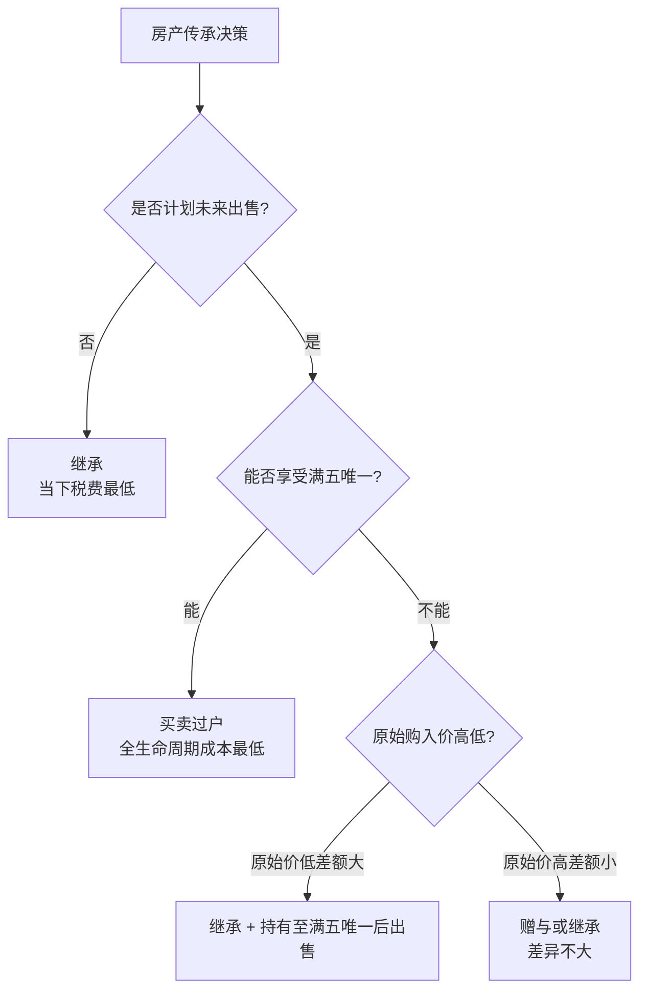
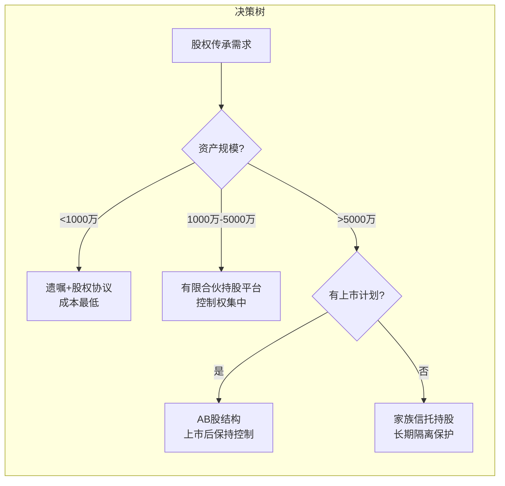

## 七、特殊资产的传承安排

特殊资产是传承规划中最容易被忽视、也最容易引发纠纷的领域。与现金和普通金融产品不同，房产、企业股权、艺术品、海外资产等特殊资产具有**估值复杂、流动性差、税务规则特殊、法律关系交织**等特征。一个房产传承的税务失误，可能让继承人多缴数十万元税款；一个股权传承的结构缺陷，可能导致家族丧失对企业的控制权。

本节按资产类别逐一拆解，覆盖税务计算、法律结构、实操流程和常见陷阱，帮助你在每一种特殊资产上做出最优的传承安排。

### 7.1 房产的传承策略

房产是中国家庭财富的最大组成部分。根据央行调查数据，中国家庭资产中住房占比超过60%，部分城市家庭甚至超过80%。因此，房产传承的税务优化对整体传承成本的影响是决定性的。

#### 7.1.1 三种传承方式的全面对比

房产传承有三种基本路径：赠与、继承、买卖。每种方式在当下税费和未来处置税费上差异巨大。

**税费全景对比表：**

| 对比维度 | 赠与 | 继承 | 买卖（正常交易） |
|----------|------|------|-------------------|
| **契税** | 3%（受赠方缴纳） | 3%（法定继承免征，遗嘱继承3%） | 1%-3%（首套优惠） |
| **增值税** | 直系亲属免征；非直系按差额5.3% | 免征 | 满2年免征；不满2年按全额5.3% |
| **个人所得税** | 直系亲属免征；非直系按差额20% | 免征 | 满五唯一免征；否则按差额20%或全额1% |
| **印花税** | 0.05%（双方） | 0.05%（继承人） | 0.05%（双方） |
| **未来出售时的计税基础** | 按赠与时的原值计算差额 | 按被继承人最初取得时的原值计算差额 | 按本次交易价格作为新计税基础 |
| **关键风险** | 未来出售可能产生巨额个税 | 继承后出售原值很低，差额大 | 当下税费最高，但未来出售税负最轻 |

> **核心认知**：传承方式的选择不能只看当下税费，必须计算"当下税费 + 未来出售税费"的全生命周期总成本。

#### 7.1.2 典型场景的决策模型

**场景一：房产自住，不打算出售**

这种情况下，继承是最优选择。继承环节的税费最低（法定继承甚至免征契税），且不影响自住使用。

操作要点：
- 确保有合法有效的遗嘱（公证遗嘱或律师见证遗嘱）
- 及时办理不动产变更登记，避免产权悬空
- 注意：继承没有时间限制，但建议在被继承人去世后6个月内完成公证

**场景二：房产未来可能出售**

需要精确计算总税负。以下是具体计算示例：

假设条件：一套房产当前市价500万元，原始购入价200万元，面积120㎡（非首套）。

| 传承方式 | 当下税费 | 未来出售税费（假设售价550万） | 总成本 |
|----------|----------|-------------------------------|--------|
| 赠与（直系） | 契税15万 + 印花税0.5万 = 15.5万 | 个税：(550-200)×20% = 70万 | **85.5万** |
| 继承 | 契税0（法定）或15万 + 印花税0.25万 | 个税：(550-200)×20% = 70万 | **70.25万** 或 **85.25万** |
| 买卖（满五唯一） | 契税7.5万 + 印花税0.5万 = 8万 | 满五唯一免征个税 | **8万** |

结论：如果未来要出售且能享受"满五唯一"政策，正常买卖的总成本反而最低。

**场景三：多套房产的差异化安排**

家庭有多套房产时，不应采用统一的传承策略，而应根据每套房产的特征制定差异化方案：

- 核心地段长期持有的房产 → 继承
- 有出售计划的投资性房产 → 买卖过户（利用满五唯一）
- 需要提前过户给子女的房产 → 赠与（但要提前规划未来出售的税负）



#### 7.1.3 "满五唯一"政策的深度利用

"满五唯一"是指个人转让自用5年以上、且是家庭唯一生活用房的所得，免征个人所得税。这是房产传承中最重要的税务优惠之一。

**持有时间的连续计算规则：**
- 赠与取得的房产：受赠人的持有时间从赠与人最初取得该房产时起算
- 继承取得的房产：继承人的持有时间从被继承人最初取得该房产时起算
- 买卖取得的房产：从本次交易过户之日起重新计算

这意味着：如果父母持有房产已超过5年，通过赠与或继承给子女后，子女出售时可以直接享受"满五"条件，只需满足"唯一"即可。

**实操建议：**
- 如果父母的房产已满五唯一，优先考虑继承方式传承
- 如果父母有多套房产，可以在生前通过买卖方式将部分房产过户给子女，帮助子女积累"满五唯一"资格
- 保留完整的购房合同、发票、契税完税证明，这些是计算持有时间的关键凭证

#### 7.1.4 共有产权房产的传承陷阱

夫妻共有房产的传承比想象中复杂：

**问题一：遗嘱只能处分自己的份额**

夫妻共同房产中，被继承人只能通过遗嘱处分属于自己的50%份额。另外50%属于配偶的个人财产，不纳入遗产分配。

**问题二：按份共有vs共同共有**

- 共同共有（默认）：各占50%，处分时需双方同意
- 按份共有：按约定比例，各自处分自己的份额

**问题三：农村宅基地的特殊性**

农村宅基地使用权不能继承，但地上房屋作为个人财产可以继承。继承人继承房屋后，可以继续使用宅基地，但不能翻建、扩建。如果房屋灭失，宅基地由集体收回。

**实操清单：**
- [ ] 确认房产是个人财产还是夫妻共同财产
- [ ] 确认房产是否有贷款未还清（有贷款的房产过户需银行同意）
- [ ] 确认房产是否有抵押、查封等权利限制
- [ ] 准备房产证、土地证（或不动产权证）原件
- [ ] 如为赠与，准备赠与公证书
- [ ] 如为继承，准备继承权公证书或法院判决书

### 7.2 企业股权的传承设计

企业股权传承是特殊资产中最复杂的一类，因为它不仅涉及财产权的转移，更涉及企业控制权、公司治理、股东关系等多重问题。

#### 7.2.1 股权传承的三大核心矛盾

**矛盾一：控制权集中 vs 利益分配公平**

家族企业创始人往往希望将控制权集中交给一个继承人（通常是长子或最有能力的子女），但又需要在经济利益上公平对待所有子女。如果简单地按人头平分股权，每个继承人都有投票权，企业决策将陷入僵局。

**矛盾二：股权流动性差 vs 继承人变现需求**

非上市公司的股权没有公开交易市场，变现困难。有的继承人可能不参与企业经营，希望将股权变现用于个人发展或其他投资，但找不到买家或价格谈不拢。

**矛盾三：企业估值波动 vs 分配方案稳定性**

企业价值会随市场环境波动。如果在企业估值高峰期制定分配方案，低谷期执行时可能引发争议；反之亦然。

#### 7.2.2 四种股权传承架构的深度对比

| 架构类型 | 核心机制 | 适用场景 | 优势 | 劣势 |
|----------|----------|----------|------|------|
| **有限合伙持股平台** | 家族成员成立有限合伙企业持有目标公司股权，核心成员担任GP | 家族成员众多，需要集中控制权 | GP掌握全部决策权，LP只享受分红；税负透明穿透 | GP承担无限责任；LP转让份额需其他合伙人同意 |
| **AB股结构** | 同股不同权，家族持有的B类股每股10票投票权 | 有上市计划的企业，特别是港股和美股 | 控制权与持股比例脱钩；上市后仍能保持家族控制 | A股上市公司不适用；需要公司章程明确约定 |
| **家族信托持股** | 将股权装入家族信托，由受托人持有和管理 | 资产规模较大（通常3000万以上），有长期传承需求 | 股权不被分割；避免继承纠纷；可附加分配条件 | 设立和管理成本高；丧失直接控制权；信托法相关判例较少 |
| **遗嘱+股权协议** | 通过遗嘱安排股权归属，辅以股东协议约束 | 中小企业，资产规模不大，传承关系简单 | 成本低，灵活度高 | 执行依赖继承人配合；容易被挑战；无隔离保护 |



#### 7.2.3 有限合伙持股平台的搭建实操

这是中小企业最常用的股权传承架构，以下是完整的搭建步骤：

**第一步：确定平台结构**

- 设立一家有限合伙企业（如"XX家族投资合伙企业"）
- 创始人或核心继承人担任GP（普通合伙人），出资比例可以很小（如1%）
- 其他家族成员担任LP（有限合伙人），出资比例大（如99%）
- GP持有1%的出资额，但拥有100%的执行事务和决策权

**第二步：制定合伙协议**

合伙协议是这个架构的核心文件，必须约定清楚：

```text
关键条款清单：
1. GP的权利与义务
   - 日常经营管理权
   - 对外投资决策权
   - 利润分配方案的制定权
2. LP的权利与限制
   - 分红权（按出资比例或另行约定）
   - 知情权（查阅财务报表）
   - 限制：不得参与经营管理，不得对外代表合伙企业
3. 利润分配规则
   - 分配频率（年度/季度）
   - 分配比例（是否按出资比例）
   - 留存利润的比例和用途
4. 份额转让限制
   - LP转让份额需GP同意
   - 其他LP的优先购买权
   - 转让价格的确定方式
5. 入伙与退伙机制
   - 新家族成员加入的条件
   - 退出的触发条件和定价
```

**第三步：完成股权转移**

将目标公司的股权从个人名下转让到有限合伙企业名下。注意：
- 如果目标公司是有限公司，需要其他股东同意（其他股东有优先购买权）
- 股权转让可能产生个人所得税（按净资产份额或评估价值计算）
- 建议在企业初创期或估值较低时完成转移，降低税负

**第四步：税务备案**

有限合伙企业本身不缴企业所得税，利润穿透到各合伙人分别缴税：
- 自然人合伙人：按"经营所得"缴纳5%-35%个人所得税
- 法人合伙人：缴纳25%企业所得税（可与其他收入合并计算）

#### 7.2.4 股权传承中的估值问题

股权传承必须解决"值多少钱"的问题，常见的估值方法：

| 估值方法 | 计算逻辑 | 适用场景 | 局限性 |
|----------|----------|----------|--------|
| 净资产法 | 公司净资产 × 持股比例 | 资产密集型企业（房地产、制造业） | 忽略品牌、客户等无形资产价值 |
| 收益法 | 未来现金流折现 | 盈利稳定的服务业、科技企业 | 折现率选择主观性强 |
| 市场法 | 参照同行业上市公司或并购案例 | 有可比交易的行业 | 可比公司难以精确匹配 |
| 交易价格法 | 近期实际交易价格 | 有近期股权交易的企业 | 如果交易不公允，税务机关可能不认可 |

**税务机关的核定规则：**

股权转让收入明显偏低且无正当理由的，税务机关有权按照以下方法核定：
- 净资产核定法
- 类比法
- 其他合理方法

正当理由包括：能出具有效文件证明的合理经营活动（如承担债务、提供担保等）。

### 7.3 艺术品和收藏品的传承

艺术品和收藏品（包括书画、瓷器、珠宝、名表、红酒、古董家具等）是高净值家庭常见的另类资产类别。这类资产传承的独特挑战在于：**价值主观、流动性极差、保管要求高、真伪鉴定复杂**。

#### 7.3.1 价值评估的专业化

艺术品估值不能简单依赖购买价格或主观判断。专业的估值应包含以下要素：

**估值报告必备内容：**
- 作品的完整来源链（provenance）：从创作到现在的每一次流转记录
- 专业鉴定意见：真伪鉴定、品相评级、年代判定
- 市场参照数据：同类型、同作者作品的近期成交记录
- 估值结论：通常给出一个区间（如"市场价值人民币80万-120万"）

**国内主要评估机构：**
- 中国嘉德、北京保利、西泠印社等拍卖行的专家部门
- 国家文物鉴定委员会
- 各省级文物鉴定站
- 具有资产评估资质的第三方机构

**估值争议的应对：**

当继承人对估值有分歧时，可以采用以下机制：
- 聘请两家独立评估机构，取平均值
- 引入"拍卖权"机制：任何继承人有权要求将藏品送拍，拍卖所得按份额分配
- 设立"优先购买权"机制：对某件藏品有特殊感情的继承人，可以按评估价优先购买

#### 7.3.2 藏品传承的四种架构

**架构一：遗嘱直接分配**

最简单但最容易出问题的方式。遗嘱中逐一列明每件藏品的归属。

优点：直接明确，成本低。
缺点：藏品众多时分配困难；继承人之间可能对分配方案有异议；税务处理复杂。

**架构二：设立私人博物馆或艺术基金会**

将收藏品整体纳入一个非营利性机构（如民办博物馆或公益基金会）。

操作流程：
1. 向当地民政部门或文化部门申请设立民办博物馆/基金会
2. 将藏品以捐赠或出资方式转入机构
3. 家族成员担任理事会成员，参与管理决策
4. 机构负责藏品的保管、展览、研究

优势：
- 藏品整体保存，不被分割
- 可能享受税收优惠（公益性捐赠的税前扣除）
- 提升家族文化影响力
- 专业机构管理，保护藏品品质

成本：
- 注册资金要求（基金会通常需要200万以上原始基金）
- 年度管理费用（场地、人员、保险、维护）
- 需要定期接受审计和监管

**架构三：家族信托持有**

将藏品装入家族信托，由受托人持有和管理。

适合场景：藏品价值较高（通常500万以上），希望长期保存并实现增值。

信托条款设计要点：
- 明确藏品的保管标准（温湿度、安保等级）
- 指定专业管理人（拍卖行或策展人）
- 设定展览权和收益分配规则
- 约定紧急处置条件（如某件藏品价值暴跌时的出售权限）

**架构四：保险+信托组合**

高价值藏品必须投保，保险与信托结合是当前最佳实践：
- 为每件重要藏品投保艺术品综合险（覆盖盗窃、火灾、水损、运输损坏等）
- 保险理赔金进入信托账户，由受托人按照约定方式分配给继承人
- 定期更新藏品估值，调整保险金额

#### 7.3.3 艺术品传承的税务特殊规则

| 环节 | 税务处理 | 注意事项 |
|------|----------|----------|
| **赠与** | 按"其他所得"缴纳20%个人所得税（直系亲属间赠与暂免） | 赠与价格需合理，否则税务机关有权核定 |
| **继承** | 继承环节暂不征收个人所得税 | 但未来出售时需按"财产转让所得"缴税 |
| **拍卖出售** | 按转让收入减去原值和合理费用后的余额，缴纳20%个税 | 原值凭证缺失的，按转让收入的3%核定征收 |
| **出口** | 文物出境需经国家文物局审批；珍贵文物禁止出境 | 1949年以前的文物一般限制出境 |

#### 7.3.4 藏品传承的风险管理

**风险一：真伪风险**

传承时发现藏品为赝品的案例并不少见。应对措施：
- 建立藏品档案：每件藏品附有鉴定证书、购买凭证、来源证明
- 定期复鉴：每3-5年请权威机构重新鉴定重要藏品
- 购买保证保险：部分拍卖行和保险公司提供真伪保证

**风险二：保管风险**

不当保管可能导致藏品损坏、贬值。应对措施：
- 恒温恒湿保存：温度18-22℃，湿度45-65%
- 专业装裱和包装
- 定期检查和维护
- 防火防盗系统

**风险三：继承人不识货**

继承人对藏品缺乏了解和感情，可能导致不当处置。应对措施：
- 建立详细的藏品目录和说明
- 培养至少一位家族成员的专业知识
- 在遗嘱或信托中指定专业顾问

### 7.4 海外资产的传承

随着中国家庭海外资产配置的增加（海外房产、境外银行账户、海外保险、离岸公司股权等），海外资产的传承问题日益突出。

#### 7.4.1 海外资产传承的四大难题

**难题一：法律冲突**

不同国家的继承法差异巨大：

| 法系 | 代表国家/地区 | 继承规则特点 |
|------|--------------|-------------|
| 大陆法系 | 中国大陆、日本、德国 | 有法定继承人顺序和必留份制度 |
| 英美法系 | 英国、美国（部分州）、新加坡 | 尊重遗嘱自由，无必留份限制 |
| 伊斯兰法系 | 阿联酋、沙特 | 严格按照宗教法规分配 |
| 混合法系 | 中国香港、中国澳门 | 融合多种法系特点 |

**实际影响举例**：一位中国公民在英国拥有一处房产，去世后该房产的继承适用英国法律（不动产所在地法）。如果该公民的遗嘱按照中国法律制定，可能无法完全适用于英国房产。

**难题二：双重征税**

如果中国和资产所在国都对遗产或赠与征税，继承人可能面临双重课税。目前中国尚未开征遗产税，但未来开征后这个问题将更加突出。

当前主要的税收协定安排：
- 中国与美国：有遗产税税收协定，可以抵免在美缴纳的遗产税
- 中国与英国：有遗产税税收协定
- 中国与日本：有遗产税税收协定
- 中国与新加坡：暂无遗产税协定（但新加坡已废除遗产税）

**难题三：外汇管制**

中国的外汇管制对海外资产传承有直接影响：
- 继承人收到海外遗产后汇入中国，需提供继承权公证书等材料
- 每人每年5万美元的购汇额度限制了大额遗产的汇回
- 资金来源的合法性和完税证明是银行审核的重点

**合规路径：**
- 继承所得汇入：凭继承权公证书、死亡证明、遗嘱等材料，通过银行合规汇入
- 赠与所得汇入：凭赠与合同、亲属关系证明等材料汇入
- 超过5万美元的单笔汇入：需要向银行提供完整的资金来源说明和完税证明

**难题四：CRS信息交换**

自2018年起，中国已与100多个国家和地区实施CRS（共同申报准则）金融账户信息自动交换。这意味着：
- 中国税务居民在海外的金融账户信息会被交换回中国
- 包括存款、托管账户、保险合同、基金份额等
- 传承规划必须考虑信息透明后的税务合规

#### 7.4.2 海外资产传承的三种架构

**架构一：资产所在地设立当地信托**

在资产所在国（如新加坡、香港）设立当地信托，将海外资产装入。

优势：
- 适用当地法律，避免法律冲突
- 受托人熟悉当地法规和市场
- 资产保护和债务隔离效果好

注意事项：
- 信托设立后，资产的所有权转移给受托人
- 需要选择信誉良好、监管完善的司法管辖区
- 设立和管理费用较高（通常每年资产规模的0.5%-1.5%）

**架构二：跨境遗嘱**

针对不同国家的资产分别制定遗嘱，每个遗嘱仅覆盖特定国家的资产。

操作要点：
- 各国遗嘱之间不能冲突
- 每份遗嘱应明确"仅适用于XX国境内资产"
- 建议在资产所在国聘请当地律师起草或审核
- 遗嘱需要按照当地法律要求的形式制定（如见证人数量、公证要求等）

**架构三：离岸公司持有**

通过在BVI、开曼、香港等地注册的离岸公司持有海外资产。

优势：
- 股权传承比资产传承更灵活（转让公司股权而非资产本身）
- 可能享受当地的税收优惠
- 隐私保护程度高

劣势：
- 设立和维护成本
- CRS信息交换后隐秘性降低
- 中国的受控外国企业（CFC）规则可能将离岸公司利润视同分配

#### 7.4.3 各热门资产所在地的传承要点

**美国房产传承：**
- 美国有联邦遗产税，免税额约1292万美元（2023年标准，每年调整）
- 非美国居民的免税额仅6万美元
- 部分州还有州级遗产税（如纽约、马萨诸塞州）
- 建议：非美国居民持有美国房产时，通过外国人持有的美国公司（Foreign-Owned US Corporation）持有，避免直接适用遗产税

**新加坡资产传承：**
- 新加坡已废除遗产税
- 新加坡法律尊重遗嘱自由
- 但需注意：如果遗嘱中指定的受益人在新加坡有税务居民身份，可能影响所得税
- 新加坡是CRS参与国，金融账户信息会被交换

**香港资产传承：**
- 香港无遗产税
- 香港的遗嘱认证由香港高等法院处理
- 内地居民继承香港遗产需要经过"认证遗嘱"或"遗产管理"程序
- 银行账户冻结期间可能长达6-12个月

**日本房产传承：**
- 日本有遗产税，税率10%-55%，累进税率
- 非日本居民的日本境内资产也需要缴纳遗产税
- 日本继承法有"遗留份"制度，法定继承人有权获得最低份额

### 7.5 数字资产与虚拟财产的传承

数字资产是近年来快速出现的新型资产类别，包括加密货币、网络账户、数字版权、游戏装备等。由于法律框架尚不完善，这类资产的传承需要特别的提前规划。

#### 7.5.1 加密货币的传承

**核心挑战：** 加密货币的控制权完全依赖私钥。如果持有人去世且继承人不知道私钥或助记词，资产将永久丢失，无法找回。

**传承方案：**

方案一：助记词分片保管
- 将助记词（通常12或24个英文单词）拆分为多份
- 分别存放在不同地点（银行保险箱、律师处、可信赖的家人处）
- 设定恢复规则（如3份中的任意2份即可恢复）
- 在遗嘱中注明存放地点和恢复规则，但不要直接写明助记词（遗嘱可能被公开）

方案二：使用多签钱包
- 设置2-of-3或3-of-5的多签机制
- 继承人持有一个签名密钥
- 律师或信托机构持有另一个
- 至少需要两个签名才能转移资产

方案三：专业托管服务
- 使用合规的数字资产托管机构
- 在托管协议中明确继承安排
- 托管机构按照预先设定的条件向继承人释放资产

**税务注意：**
- 中国目前对加密货币交易持禁止态度，但持有本身不违法
- 继承人在海外变现时需注意当地的税务申报要求
- 美国IRS将加密货币视为财产，继承时按继承日市值重新计税基础（step-up in basis）

#### 7.5.2 网络账户与数字版权

**需要传承规划的数字账户类型：**

| 账户类型 | 具体示例 | 传承价值 | 处理方式 |
|----------|----------|----------|----------|
| 社交媒体 | 微信、微博、抖音 | 社交关系、内容资产 | 设置遗产联系人或账户继承 |
| 电商平台 | 淘宝店铺、拼多多店铺 | 商业价值、客户资源 | 店铺过户或继承 |
| 内容创作 | 公众号、B站、YouTube | 版权收入、粉丝资产 | 账户转移或收益继承 |
| 游戏资产 | 游戏账号、虚拟道具 | 经济价值 | 平台继承政策 |
| 订阅服务 | 云存储、域名 | 数据价值、使用权 | 账户信息交接 |
| 金融账户 | 支付宝、理财通 | 资金资产 | 按平台规则提取 |

**实操建议：**
- 建立一份"数字资产清单"，包含每个账户的平台、用途、大致价值
- 将账户登录信息和密码安全存储（使用密码管理器，并将主密码纳入遗产规划）
- 了解各平台的遗产政策（微信支持设置遗产联系人，支付宝支持亲属提取）
- 对有价值的数字资产（如域名、网店）考虑提前转移到可继承的主体名下

#### 7.5.3 知识产权的传承

知识产权（专利权、著作权、商标权等）是有传承价值但常被忽视的资产类别。

**各类知识产权的传承特点：**

- **专利权**：保护期限有限（发明20年、实用新型10年、外观设计15年），需在保护期内完成传承。专利权可以通过遗嘱继承或赠与转让。
- **著作权**：财产权保护期为作者终身加死后50年。署名权、修改权、保护作品完整权不可转让，但可以由继承人保护。
- **商标权**：保护期10年，可无限续展。商标权可以作为遗产继承，但需要向国家知识产权局办理变更手续。
- **商业秘密**：没有法定保护期限，但依赖保密措施。传承时需要确保继承人有能力继续维持保密性。

### 7.6 保险金的传承安排

人寿保险在传承中的作用已在前面的章节详细讨论，本节聚焦于保险金作为"特殊资产"在传承中的特殊问题。

#### 7.6.1 保险金的传承优势与限制

**核心优势：**
- 指定受益人的保险金不纳入遗产，不受遗嘱和法定继承的约束
- 理赔速度快（通常15-30天），不受遗产分割程序的影响
- 具有一定的债务隔离功能

**核心限制：**
- 如果未指定受益人或受益人先于被保险人死亡，保险金纳入遗产
- 如果受益人是法定继承人之一，可能引发其他继承人的不满
- 受益人可以是多人，但需要明确比例

#### 7.6.2 保险金信托：保险与信托的结合

保险金信托是将保险的杠杆优势与信托的灵活分配功能结合起来的高级传承工具。

**运作机制：**
1. 投保人购买大额人寿保险，指定信托公司为受益人
2. 被保险人身故后，保险金进入信托账户
3. 信托公司按照信托合同的约定，向指定受益人分配保险金

**优势：**
- 保险金的杠杆效应：以较少的保费撬动较大的传承金额
- 信托的灵活分配：可以设定分配条件（如子女满18岁、考上大学、创业等）
- 专业的资产管理：信托公司对保险金进行投资管理
- 避免保险金被一次性挥霍

**设立门槛和费用：**
- 通常要求保额在300万-500万以上
- 信托设立费：1万-5万元
- 年度管理费：信托资产规模的0.3%-1%
- 保险公司与信托公司的协调对接

### 7.7 特殊资产传承的综合规划框架

各类特殊资产的传承不是孤立的，需要在整体传承方案中统筹考虑。

#### 7.7.1 资产盘点与分类

首先需要对所有特殊资产进行全面盘点：

```text
特殊资产盘点清单模板：

一、不动产类
  □ 国内房产（住宅、商铺、写字楼）
  □ 海外房产
  □ 农村宅基地及地上房屋
  □ 土地使用权

二、企业权益类
  □ 有限公司股权
  □ 合伙企业份额
  □ 个体工商户经营权
  □ 特许经营权

三、实物资产类
  □ 艺术品（书画、雕塑、装置）
  □ 收藏品（瓷器、玉器、钱币、邮票）
  □ 珠宝首饰
  □ 名表、名酒
  □ 贵金属（金条、银条）

四、海外资产类
  □ 海外银行账户
  □ 海外证券账户
  □ 海外保险
  □ 海外信托

五、数字资产类
  □ 加密货币
  □ 网络店铺
  □ 域名
  □ 内容创作账户
  □ 游戏资产

六、知识产产权类
  □ 专利权
  □ 著作权
  □ 商标权
  □ 商业秘密

七、保险类
  □ 人寿保险
  □ 年金保险
  □ 保险金信托
```

#### 7.7.2 传承优先级排序

不同资产的传承紧迫性和复杂性不同，建议按以下优先级安排：

| 优先级 | 资产类型 | 原因 |
|--------|----------|------|
| **紧急** | 加密货币（私钥可能丢失）、独资企业（经营者去世后企业可能瘫痪） | 时间敏感，延误即损失 |
| **高** | 房产、企业股权、海外资产 | 价值大、法律程序复杂 |
| **中** | 保险（需定期更新受益人）、艺术品 | 已有一定安排，需优化 |
| **低** | 数字账户、知识产权（尚有保护期） | 价值不确定或时间充裕 |

#### 7.7.3 常见误区与纠正

**误区一："房产过户给子女越早越好"**

纠正：过早过户可能错失"满五唯一"免税优惠，且过户后父母丧失对房产的控制权。应根据房产特征和家庭情况选择最优时点。

**误区二："公司股权写在遗嘱里就行了"**

纠正：股权传承不仅涉及所有权转移，还涉及工商变更登记、税务申报、其他股东权益等程序。单纯的遗嘱无法完成股权传承的全部法律手续。

**误区三："海外资产不申报也没人知道"**

纠正：CRS信息交换已经覆盖100多个国家和地区，海外金融账户信息对中国税务机关是透明的。隐瞒海外资产不仅面临税务风险，还可能涉及刑事责任。

**误区四："艺术品价值高就一定值得传承"**

纠正：艺术品的价值是主观的、波动的。需要考虑保管成本、保险费用、流动性折价等因素。有些情况下，出售变现后以现金传承可能更高效。

**误区五："数字资产不值钱，不用管"**

纠正：数字资产的价值可能远超想象。一个运营良好的网店、一个拥有大量粉丝的自媒体账号、一笔被遗忘的加密货币，都可能价值不菲。

### 7.8 本节核心要点

1. **房产传承要算总账**：不仅看当下税费，更要计算未来出售时的全生命周期税负。"满五唯一"是最关键的税务优惠。
2. **股权传承要选架构**：根据资产规模和家族需求选择有限合伙、AB股、家族信托或遗嘱+协议的组合。
3. **艺术品传承要专业化**：估值、保管、保险缺一不可，考虑设立私人博物馆或基金会实现整体传承。
4. **海外资产要合规**：CRS信息交换让海外资产透明化，跨境遗嘱和当地信托是解决法律冲突的有效工具。
5. **数字资产要提前规划**：加密货币的私钥管理是生死攸关的问题，建立数字资产清单是当务之急。
6. **综合规划优于单点优化**：所有特殊资产应在统一的传承方案中统筹安排，避免各自为政导致的冲突和低效。
