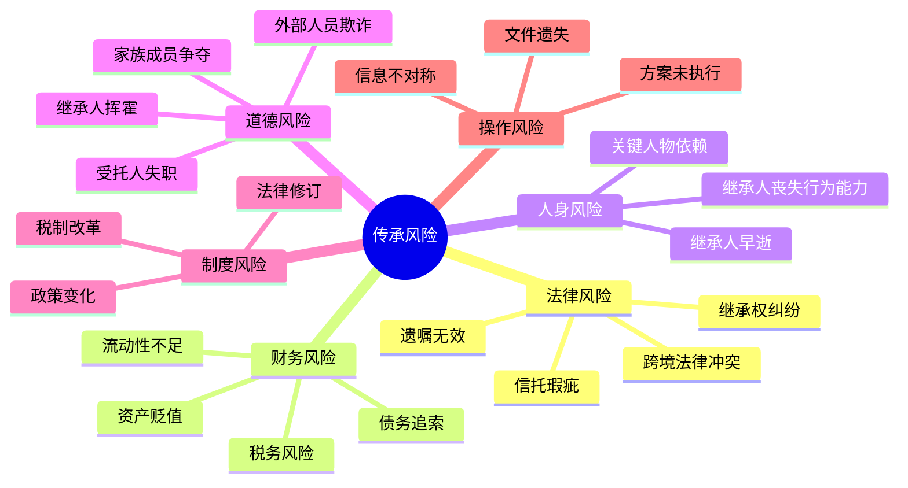
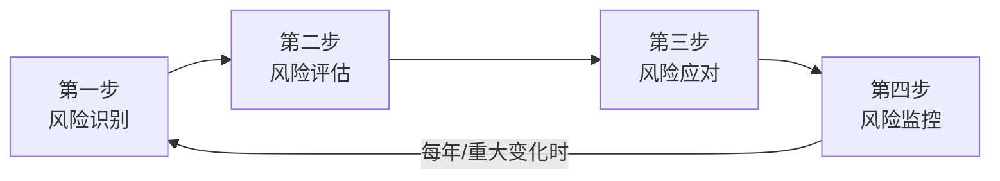

## 八、传承中的风险管理

传承规划的本质是**在不确定性中建立确定性**。但规划本身也面临风险——方案可能失效、工具可能失灵、继承人可能遭遇意外、外部环境可能剧变。如果说传承规划是给财富穿上铠甲，那么风险管理就是检查铠甲上有没有裂缝。

本节的核心命题：**识别传承全流程中的风险点，建立系统化的风险管理框架，确保传承方案在各种极端情况下仍然有效**。

### 8.1 传承风险的全景扫描

#### 8.1.1 什么是传承风险

传承风险是指在财富从一代人转移到下一代人的过程中，可能导致传承目标落空、资产减损或家族关系破裂的各类不确定性因素。

与投资风险不同，传承风险具有三个独特特征：

| 特征 | 说明 | 影响 |
|------|------|------|
| **不可逆性** | 被继承人去世后无法修改方案 | 生前的疏忽可能造成永久性损失 |
| **长周期性** | 传承效果可能跨越数十年 | 短期看似合理的方案长期可能失效 |
| **多利益方博弈** | 涉及继承人、债权人、配偶、政府等多方 | 任何一方的行为都可能影响传承结果 |

#### 8.1.2 传承风险的六大类别



### 8.2 法律风险：最常见也最致命

#### 8.2.1 遗嘱无效风险

遗嘱无效是中国家庭传承失败的**头号杀手**。根据各级法院的公开数据，继承纠纷案件中，遗嘱被认定无效或部分无效的比例高达30%以上。

**遗嘱无效的六大情形**：

1. **形式瑕疵**：不符合《民法典》规定的法定形式要件
   - 自书遗嘱未由遗嘱人亲笔书写全文、签名并注明年月日
   - 代书遗嘱缺少两个以上见证人在场见证
   - 打印遗嘱未在每一页签名并注明年月日
   - 录音录像遗嘱未记录遗嘱人和见证人的姓名或肖像及日期

2. **见证人不适格**：见证人属于法律规定的排除对象
   - 无民事行为能力人、限制民事行为能力人
   - 继承人、受遗赠人
   - 与继承人、受遗赠人有利害关系的人（如继承人的配偶、债权人）

3. **意思表示瑕疵**：遗嘱人立遗嘱时不具备完全民事行为能力
   - 被胁迫、被欺骗所立的遗嘱
   - 患有严重精神疾病或认知障碍时所立的遗嘱
   - 醉酒或受药物影响状态下所立的遗嘱

4. **处分了不属于自己的财产**：将夫妻共同财产中配偶的份额、他人财产或已设立信托的财产写入遗嘱

5. **内容违法或违背公序良俗**：例如将遗产留给"二奶"（虽然司法实践中存在争议，但多数法院会认定此类遗嘱违背公序良俗而无效）

6. **多份遗嘱冲突**：虽然《民法典》规定以最后的遗嘱为准，但如果无法确定时间先后，可能引发争议

**风险防控清单**：

| 风险点 | 防控措施 | 优先级 |
|--------|----------|--------|
| 形式不合法 | 请专业律师起草或审核，至少做一次公证 | ★★★★★ |
| 见证人问题 | 选择无利害关系的见证人，保留见证人身份证明 | ★★★★★ |
| 意思能力争议 | 立遗嘱时做精神状态鉴定，保留录像 | ★★★★☆ |
| 财产范围不清 | 先做完整的资产盘点，再写遗嘱 | ★★★★☆ |
| 多份遗嘱冲突 | 每次修改都注明日期，销毁旧版本 | ★★★☆☆ |

#### 8.2.2 信托法律风险

家族信托虽然具有强大的资产隔离功能，但如果设立不当，可能面临以下法律风险：

**信托被击穿的风险**（即法院认定信托财产不属于信托，而仍属于委托人的个人财产）：

- **设立时点不当**：在已经面临诉讼或债务危机时设立信托，可能被认定为恶意避债，法院有权撤销
- **保留过多控制权**：委托人在信托文件中保留了过大的撤销权、变更权或投资决策权，导致信托"形同虚设"
- **资产未实际转移**：信托合同签了但资产没有办理过户登记，信托未生效
- **受益人条款过于模糊**：受益人的范围、条件、分配方式不明确，导致执行困难

**典型案例**：某企业家在公司面临诉讼期间，将价值3000万元的房产转入家族信托。法院依据《民法典》第五百三十八条关于债权人撤销权的规定，认定该信托设立行为损害了债权人利益，判决撤销信托，房产被强制执行。

**信托风险管理的五项原则**：

1. **尽早设立**：在没有诉讼、债务、税务问题的时候就完成信托设立，而非等到危机来临
2. **真正隔离**：资产完成过户登记，委托人不再直接控制资产
3. **独立受托人**：选择有资质的信托公司或专业受托人，而非自己的亲信代持
4. **合理保留权利**：委托人可以保留部分知情权和建议权，但不应保留实质控制权
5. **定期审查**：每2-3年请律师审查信托文件是否仍然符合法律要求和家族需求

#### 8.2.3 继承权纠纷风险

即使遗嘱和信托都合法有效，继承权纠纷仍然可能发生：

- **法定继承人的特留份主张**：遗嘱未给缺乏劳动能力又没有生活来源的继承人保留必要份额，该部分遗嘱可能被法院调整
- **遗嘱真实性争议**：继承人质疑遗嘱系伪造或被篡改，申请笔迹鉴定
- **继承人身份争议**：非婚生子女、养子女、继子女的继承权认定
- **代位继承和转继承**：被继承人的子女先于被继承人死亡时，由子女的晚辈直系血亲代位继承

**防控策略**：

- 遗嘱中明确说明财产分配的理由，减少继承人的"不公平感"
- 对可能产生争议的分配方案，提前与所有继承人沟通并取得书面确认
- 保留被继承人立遗嘱时的精神状态证据（录音录像、医院证明）
- 考虑设立"调解条款"：在遗嘱或信托中约定争议解决的前置程序（如先调解再诉讼）

### 8.3 财务风险：资产安全的隐形威胁

#### 8.3.1 资产贬值风险

传承方案中规划的资产价值，到实际传承时可能大幅缩水：

**常见贬值场景**：

| 资产类型 | 贬值风险 | 典型案例 |
|----------|----------|----------|
| 房地产 | 市场下行、政策调控 | 2021年后部分城市房价下跌20%-30% |
| 企业股权 | 经营恶化、行业衰退 | 某连锁餐饮企业估值从2亿跌至2000万 |
| 艺术品 | 市场审美变化、赝品风险 | 某画家作品在画家去世后价格腰斩 |
| 股票/基金 | 市场波动 | 2015年股灾期间部分投资者资产缩水70% |
| 加密货币 | 市场剧烈波动、政策风险 | 比特币多次出现单日跌幅超20% |

**应对策略**：

1. **多元化配置**：不将传承资产集中在单一类别中
2. **设置估值调整机制**：在遗嘱或信托中约定，如某项资产在传承时的实际价值与预估偏差超过一定比例，自动触发分配方案调整
3. **定期重估**：每1-2年对传承资产进行重新估值，及时调整方案
4. **保险对冲**：为人寿保险设置足够的保额，即使其他资产贬值，保险金仍能保障基本传承目标

#### 8.3.2 流动性风险

继承人可能面临"有钱但拿不到现金"的困境：

**典型场景**：
- 遗产主要是房产和企业股权，但继承人需要现金支付丧葬费、遗产管理费用或日常生活开支
- 企业股权需要变现，但短期内找不到买家或交易价格远低于公允价值
- 海外资产因外汇管制无法及时调回国内

**流动性风险管理的三个层次**：

1. **应急层**：在传承方案中预留10%-20%的流动资产（现金、货币基金、高流动性债券），确保继承人在短期内有足够现金
2. **缓冲层**：配置大额人寿保险，理赔金通常在30天内到账，可以作为过渡期的资金来源
3. **变现层**：对非流动性资产（房产、股权），提前制定变现计划和时间表，避免被迫低价出售

#### 8.3.3 税务风险

虽然中国目前尚未开征遗产税，但传承过程中的税务风险不容忽视：

**现有税负**：

| 传承环节 | 可能涉及的税种 | 税率 |
|----------|----------------|------|
| 房产继承 | 契税3%、印花税0.05% | 较低 |
| 房产赠与（直系亲属） | 契税3%、免征增值税和个税 | 中等 |
| 股权继承 | 印花税0.05% | 较低 |
| 股权赠与 | 个人所得税20%（如被认定为股权转让） | 较高 |
| 保险理赔金 | 免征个人所得税 | 零 |
| 信托收益分配 | 视具体情况，可能涉及个税 | 不确定 |

**未来风险**：
- 遗产税一旦开征，高净值家庭可能面临巨额税负（参考国际惯例，税率通常在10%-55%之间）
- 房地产税的全面推行可能影响不动产传承策略
- 个税改革可能影响股权传承的税负

**税务风险防控**：

1. **利用保险的免税优势**：人寿保险理赔金目前免征个人所得税，是税务友好的传承工具
2. **合理选择传承方式**：房产继承vs赠与vs买卖，需要根据具体情况计算全生命周期的税负
3. **关注政策动向**：密切跟踪遗产税、房地产税等政策的立法进展，提前做好预案
4. **跨境税务规划**：如有海外资产，需要了解资产所在国的税制，利用双重征税协定降低税负

### 8.4 人身风险：最不可控的变量

#### 8.4.1 继承人风险

传承方案是为"人"设计的，但人本身可能成为最大的风险因素：

**继承人早逝风险**：

如果继承人先于被继承人去世，或在继承后不久去世，传承方案可能完全落空。

应对措施：
- 在遗嘱中设置"替代继承人"条款：如果第一顺位继承人无法继承，由第二顺位继承人继承
- 在信托中设置"后继受益人"：如果当前受益人去世，信托利益转给其子女或其他指定人
- 保险的"第二受益人"：在保单中指定顺位受益人，确保理赔金不会进入法定继承

**继承人丧失行为能力风险**：

因疾病、事故导致继承人丧失民事行为能力，无法管理继承的财产。

应对措施：
- 为特殊需要的继承人设立**特殊需要信托**（Special Needs Trust），由受托人代为管理和分配
- 指定**意定监护人**（《民法典》第三十三条），在自己丧失行为能力前预先指定监护人
- 在信托分配条款中设置"触发条件"：受益人丧失行为能力时，自动增加分配频率和金额

**继承人挥霍风险**：

继承人缺乏理财能力或有不良嗜好（赌博、吸毒、过度消费），导致传承的财富迅速耗尽。

应对措施：
- 设立**附条件的信托分配**：按月/按季发放生活费，而非一次性给付
- 设置**激励条款**：受益人达到特定里程碑（毕业、就业、创业）时获得额外分配
- 设置**保护条款**：受益人涉及诉讼、离婚、破产时暂停分配
- 聘请**独立的信托监察人**：监督受托人的分配是否合理，保护受益人的长期利益

#### 8.4.2 关键人物依赖风险

传承方案过度依赖某个关键人物（如特定的家庭成员、律师、财务顾问），一旦该人物无法继续服务，方案可能陷入混乱。

**风险识别清单**：
- 信托的受托人是个人而非机构，该个人可能先于受益人去世
- 遗嘱执行人是家族中的长辈，可能因年龄或健康原因无法胜任
- 家族企业的接班方案只培养了一个人，没有备选方案
- 家族的财务顾问、律师团队没有交接机制

**防控措施**：
- 优先选择机构受托人（信托公司），而非个人受托人
- 指定遗嘱执行人的替补人选
- 建立"传承知识档案"：将所有传承安排的文件、联系人、操作流程整理成文档，确保任何接手的人都能快速理解
- 接班人培养采用"主+备"模式，至少培养两名候选人

### 8.5 道德风险：人性的考验

#### 8.5.1 家族内部的道德风险

传承往往是一面照妖镜，暴露出家族成员之间隐藏的利益冲突：

**常见道德风险场景**：

| 风险场景 | 表现形式 | 后果 |
|----------|----------|------|
| 子女争夺遗产 | 伪造遗嘱、隐匿财产、胁迫老人 | 家庭关系破裂、诉讼旷日持久 |
| 配偶转移资产 | 一方在婚内将共同财产转移给第三方 | 另一方在继承时发现财产已被掏空 |
| 代持人反悔 | 名义持有人拒绝返还代持资产 | 实际权利人丧失资产控制权 |
| 受托人自利 | 受托人利用管理权限为自己谋利 | 信托资产减损、受益人利益受损 |

**经典案例**：某企业家去世后，其长子发现父亲生前曾将多处房产"赠与"给其秘书。长子起诉主张该赠与行为无效，认为父亲当时已丧失行为能力，且秘书存在不当影响。案件历时三年，虽然最终法院部分支持了长子的主张，但家族企业因长期无人管理而陷入困境。

**道德风险防控的四道防线**：

1. **制度防线**：建立家族治理制度，明确资产管理和分配的规则，减少人为裁量空间
2. **监督防线**：引入独立的信托监察人、审计机构，定期审查资产状况
3. **透明防线**：定期向所有受益人披露资产状况和分配记录，信息透明是最好的防腐剂
4. **法律防线**：在信托和遗嘱中设置"反挥霍条款"、"离婚保护条款"、"破产隔离条款"

#### 8.5.2 外部人员的道德风险

传承过程中涉及的外部人员（律师、财务顾问、信托经理、评估师等）也可能构成风险：

**风险类型**：
- **利益冲突**：律师同时为多个继承人提供法律服务
- **信息泄露**：传承方案的敏感信息被泄露给不当知情人
- **专业失职**：评估机构出具不实的资产评估报告
- **欺诈**：伪造文件、挪用资产

**防控措施**：
- 与所有外部专业人员签署**保密协议**（NDA）
- 对关键决策采用**双人复核机制**（如资产过户需要两名授权人签字）
- 定期**独立审计**信托资产和家族财务
- 建立**举报机制**，鼓励家族成员和工作人员报告可疑行为

### 8.6 制度风险：大环境的变化

#### 8.6.1 税制改革风险

中国目前虽然没有遗产税，但国际趋势和政策讨论表明，未来开征遗产税的可能性较大：

**国际参考**：

| 国家/地区 | 遗产税税率 | 免税额 | 特点 |
|-----------|-----------|--------|------|
| 美国 | 18%-40% | 约1200万美元（2024年） | 联邦+州双重征收 |
| 日本 | 10%-55% | 3600万日元+600万/继承人 | 全球最高税率之一 |
| 英国 | 40% | 32.5万英镑 | 配偶间转移免税 |
| 德国 | 7%-50% | 20万-50万欧元 | 直系亲属免税额较高 |
| 中国香港 | 0% | 已废除 | 2006年取消遗产税 |
| 新加坡 | 0% | 已废除 | 2008年取消遗产税 |

**应对策略**：
- **提前规划**：在遗产税开征前完成资产的合理转移
- **利用保险**：人寿保险理赔金通常不纳入遗产税税基（具体取决于各国法律）
- **信托隔离**：在遗产税开征前设立的信托，其资产通常不计入委托人的遗产总额
- **关注政策窗口**：遗产税立法通常有较长的讨论期和过渡期，抓住窗口期完成调整

#### 8.6.2 法律修订风险

法律的变化可能直接影响传承方案的有效性：

**近期值得关注的法律变化**：
- 《民法典》继承编的司法解释持续完善
- 信托登记制度的推进（不动产信托登记试点）
- 反洗钱法规对大额资金转移的监管趋严
- CRS（共同申报准则）下海外资产信息自动交换的深化
- 数字资产相关立法的推进

**应对策略**：
- 每年至少做一次传承方案的法律合规审查
- 关注全国人大和最高法院的立法和司法解释动态
- 与专业律师团队保持长期合作，及时获取法律变化的信息
- 在传承方案中预留调整的灵活性，避免过度僵化的安排

### 8.7 操作风险：细节决定成败

#### 8.7.1 方案未执行风险

最可惜的传承失败不是方案设计不好，而是设计好了但没有执行：

**常见的"未执行"场景**：
- 遗嘱写好了但没有妥善保管，去世后家人找不到
- 信托合同签了但资产没有过户，信托名存实亡
- 保险受益人没有指定或填写为"法定"，理赔金进入法定继承程序
- 家族企业交接方案讨论了多年但从未启动

**执行保障机制**：

1. **建立"传承执行清单"**：将所有需要执行的事项列成清单，标注完成状态

```text
   传承执行清单示例：
   □ 遗嘱已签署并公证        [完成日期: 2025-03-15]
   □ 遗嘱原件存放于律师处      [存放地点: XX律师事务所保险柜]
   □ 家族信托已设立            [完成日期: 2025-06-20]
   □ 房产已过户至信托名下       [状态: 进行中，预计2025-12完成]
   □ 保险受益人已更新          [完成日期: 2025-04-10]
   □ 传承方案已告知配偶和长子   [完成日期: 2025-07-01]
   □ 年度审查安排              [下次审查: 2026-03-01]
   ```

2. **指定专人负责推进**：可以是家族中的核心成员，也可以是聘请的家族办公室或私人律师

3. **设置时间节点**：为每项执行事项设定截止日期，定期检查进度

#### 8.7.2 信息不对称风险

家族成员之间、委托人与受托人之间的信息不对称，可能导致传承方案执行偏差：

**典型问题**：
- 继承人不知道存在哪些资产和账户
- 受托人不知道委托人的真实传承意愿
- 不同继承人获得的信息不一致，产生猜疑
- 关键的账户密码、保险箱位置等信息无人知晓

**解决方案**：

**建立"传承信息档案"**，包含以下内容：

| 信息类别 | 具体内容 | 存放位置 | 知情人 |
|----------|----------|----------|--------|
| 资产清单 | 所有资产的类型、数量、存放位置 | 加密电子文档+纸质副本 | 配偶、律师 |
| 账户信息 | 银行账号、证券账户、保险单号 | 密码管理器 | 配偶 |
| 专业联系人 | 律师、会计师、信托经理的联系方式 | 通讯录 | 配偶、长子 |
| 传承方案 | 遗嘱、信托文件、分配方案 | 律师处+家庭保险柜 | 配偶、律师 |
| 意愿说明 | 对各项分配决定的理由说明 | 遗嘱附件 | 律师 |

> **重要提示**：传承信息档案需要在安全性和可获取性之间取得平衡。过于保密会导致去世后无人能找到，过于公开则可能在生前引发不必要的争议。建议至少有两名可信赖的人知道档案的存在和存放位置。

### 8.8 传承风险管理的系统框架

#### 8.8.1 风险管理四步法



**第一步：风险识别**

系统梳理传承方案可能面临的所有风险，包括：
- 法律风险：方案的法律合规性和可执行性
- 财务风险：资产价值、流动性、税负
- 人身风险：继承人的健康、能力、品行
- 道德风险：家族内部和外部人员的行为风险
- 制度风险：政策和法律环境的变化
- 操作风险：执行、信息、沟通

**第二步：风险评估**

对每个识别出的风险，从两个维度进行评估：
- **发生概率**：高/中/低
- **影响程度**：致命/严重/中等/轻微

| 风险 | 概率 | 影响 | 优先级 |
|------|------|------|--------|
| 遗嘱形式瑕疵 | 中 | 致命 | ★★★★★ |
| 继承人挥霍 | 中 | 严重 | ★★★★☆ |
| 遗产税开征 | 低 | 严重 | ★★★★☆ |
| 资产贬值 | 中 | 中等 | ★★★☆☆ |
| 信托被击穿 | 低 | 致命 | ★★★★☆ |
| 家族纠纷 | 高 | 严重 | ★★★★★ |

**第三步：风险应对**

针对每种风险选择应对策略：

| 策略 | 说明 | 适用场景 |
|------|------|----------|
| **规避** | 通过改变方案设计消除风险源 | 风险发生概率高且影响致命 |
| **转移** | 通过保险、担保等方式将风险转移给第三方 | 财务风险、人身风险 |
| **降低** | 通过制度、监督、教育等措施降低风险概率或影响 | 道德风险、操作风险 |
| **接受** | 对低概率低影响的风险，预留应急方案即可 | 制度风险中的小概率事件 |

**第四步：风险监控**

风险管理不是一次性工作，需要持续监控：
- 每年至少做一次全面的风险审查
- 家庭发生重大变化（出生、死亡、结婚、离婚、重大疾病）时立即触发审查
- 法律环境重大变化时（如遗产税立法）立即触发审查
- 资产状况重大变化时（如企业上市、房产大幅增值）立即触发审查

#### 8.8.2 不同资产规模的风险管理重点

**资产100万-500万（普通中产家庭）**：

| 重点 | 具体措施 | 预算建议 |
|------|----------|----------|
| 遗嘱有效性 | 请律师起草或审核，做公证 | 2000-5000元 |
| 保险保障 | 足额的人寿保险，指定受益人 | 年缴保费5000-20000元 |
| 信息透明 | 建立家庭资产清单，告知配偶 | 零成本 |
| 基本隔离 | 避免夫妻共同财产与个人经营资产混同 | 零成本 |

**资产500万-3000万（高净值家庭）**：

| 重点 | 具体措施 | 预算建议 |
|------|----------|----------|
| 信托隔离 | 设立保险金信托或小型家族信托 | 设立费5-20万元 |
| 继承人保护 | 设置信托分配条款，防止挥霍 | 包含在信托设立费中 |
| 税务规划 | 评估不同传承方式的税负差异 | 咨询费1-5万元 |
| 家族沟通 | 定期召开家庭会议，讨论传承安排 | 零成本 |
| 专业团队 | 建立律师+会计师+理财师的顾问团队 | 年费5-15万元 |

**资产3000万以上（超高净值家庭）**：

| 重点 | 具体措施 | 预算建议 |
|------|----------|----------|
| 家族信托 | 设立完善的家族信托，覆盖全部核心资产 | 设立费50-200万元 |
| 家族治理 | 制定家族宪法，建立家族委员会 | 视具体情况 |
| 跨境规划 | 海外资产的税务和法律安排 | 视具体情况 |
| 慈善安排 | 设立慈善信托或家族基金会 | 视具体情况 |
| 家族办公室 | 聘请专业家族办公室进行综合管理 | 年费100万元起 |
| 接班人培养 | 系统性的下一代培养计划 | 视具体情况 |

### 8.9 传承风险管理的常见错误

#### 错误一：认为"有钱才需要风险管理"

事实是，资产越少的家庭，传承失败的后果越严重——因为没有足够的缓冲空间。一个价值200万的房产，对于普通家庭可能是一辈子最大的资产，一旦因继承纠纷被低价处置或被法院冻结，对家庭的打击是毁灭性的。

#### 错误二：把风险管理等同于买保险

保险是风险管理的重要工具，但不是唯一工具。保险能解决的是"人没了，钱从哪来"的问题，但解决不了"钱给了谁"、"怎么给"、"给了之后怎么保护"的问题。完整的风险管理需要遗嘱+保险+信托+制度的组合。

#### 错误三：方案设计后就束之高阁

传承方案不是一次性消费品。家庭情况在变、法律环境在变、资产状况在变，五年前合理的方案今天可能已经过时。建议每年做一次方案审查，重大变化时立即调整。

#### 错误四：只关注资产传承，忽略风险传承

传承的不仅是资产，还有风险——包括债务、诉讼、担保责任。如果被继承人生前有未了结的债务或担保，继承人可能在继承资产的同时也继承了这些风险。《民法典》规定继承人以所得遗产实际价值为限清偿被继承人的债务，但如果继承人没有做好资产盘点，可能在不知情的情况下承担了超出预期的债务。

#### 错误五：过度依赖单一工具

有人认为"我买了保险就够了"，有人认为"我立了遗嘱就万事大吉"。每种工具都有其局限性：
- 遗嘱不能隔离债务风险
- 保险不能实现灵活的分配条件
- 信托不能覆盖所有类型的资产
- 持股平台不能防止企业经营风险

**最有效的传承方案是工具组合**——遗嘱确定基本分配框架，保险提供流动性保障，信托实现资产隔离和灵活分配，家族宪法规范治理规则。

### 8.10 传承风险管理的年度审查模板

建议每年进行一次传承风险管理审查，以下为审查模板：

**一、家庭情况变化审查**

| 审查项目 | 状态 | 是否需要调整方案 |
|----------|------|------------------|
| 家庭成员是否有新增（出生、结婚） | | |
| 家庭成员是否有减少（去世、离婚） | | |
| 继承人的健康状况是否有变化 | | |
| 继承人的行为能力是否有变化 | | |
| 家庭关系是否有重大变化 | | |

**二、资产状况审查**

| 审查项目 | 状态 | 是否需要调整方案 |
|----------|------|------------------|
| 资产总值是否有重大变化（±20%以上） | | |
| 资产结构是否有重大变化 | | |
| 是否有新增重大资产 | | |
| 是否有资产已处置或灭失 | | |
| 负债情况是否有变化 | | |

**三、法律环境审查**

| 审查项目 | 状态 | 是否需要调整方案 |
|----------|------|------------------|
| 继承相关法律是否有修订 | | |
| 税法是否有影响传承的重大变化 | | |
| 信托法规是否有变化 | | |
| 跨境相关法规是否有变化 | | |

**四、方案执行审查**

| 审查项目 | 状态 | 是否需要调整方案 |
|----------|------|------------------|
| 遗嘱是否仍然有效且反映当前意愿 | | |
| 信托资产是否完成过户 | | |
| 保险受益人是否需要更新 | | |
| 传承信息档案是否需要更新 | | |
| 专业顾问团队是否需要调整 | | |

### 8.11 进阶：特殊场景下的风险管理

#### 8.11.1 再婚家庭的风险管理

再婚家庭的传承风险比普通家庭复杂得多：

**核心矛盾**：现任配偶 vs 前婚子女的利益冲突

**风险管理要点**：
- 在遗嘱中**明确区分**前婚财产和婚后共同财产
- 为前婚子女设立**独立的信托**，确保其继承权不因再婚而受影响
- 在保险受益人中**同时指定**现任配偶和前婚子女，按比例分配
- 考虑设立**居住权**：为现任配偶设定房产的居住权，但产权归前婚子女所有

#### 8.11.2 跨境家庭的风险管理

**核心矛盾**：不同法域的法律冲突

**风险管理要点**：
- 在**每个有资产的法域**分别设立遗嘱，但要确保各份遗嘱之间不冲突
- 了解各国的**强制继承制度**（如法国、德国的特留份制度，可能限制遗嘱自由）
- 考虑在资产所在国设立**当地信托**，利用当地的资产保护法律
- 关注**CRS信息交换**对海外资产透明度的影响

#### 8.11.3 企业主的风险管理

**核心矛盾**：企业经营风险 vs 家族财富安全

**风险管理要点**：
- **资产隔离**：将家族财富与企业经营风险隔离，避免企业债务波及家族资产
- **关键人保险**：为企业核心人物投保关键人保险，降低因关键人物变故导致的企业经营风险
- **股权传承预案**：制定详细的股权传承方案，包括定价机制、购买优先权、退出条款
- **接班人培养**：不要把所有希望放在一个人身上，至少培养两名候选人

### 8.12 本节小结

传承中的风险管理，核心是**在不确定性中建立确定性**。记住以下要点：

1. **全面识别**：法律、财务、人身、道德、制度、操作六大类风险，缺一不可
2. **优先排序**：先解决致命风险（遗嘱无效、信托被击穿），再处理中等风险
3. **工具组合**：遗嘱+保险+信托+制度，不依赖单一工具
4. **持续监控**：每年至少一次全面审查，重大变化时立即调整
5. **专业支持**：引入律师、会计师、理财师等专业团队，不要自己闭门造车
6. **提前行动**：在没有危机的时候做风险管理，而非等到危机来临

> **最后一句话**：传承风险管理的最高境界，不是消灭所有风险（那不可能），而是**确保在最坏的情况下，你的传承意愿仍然能够被最大程度地执行**。这才是风险管理的真正价值。

***
