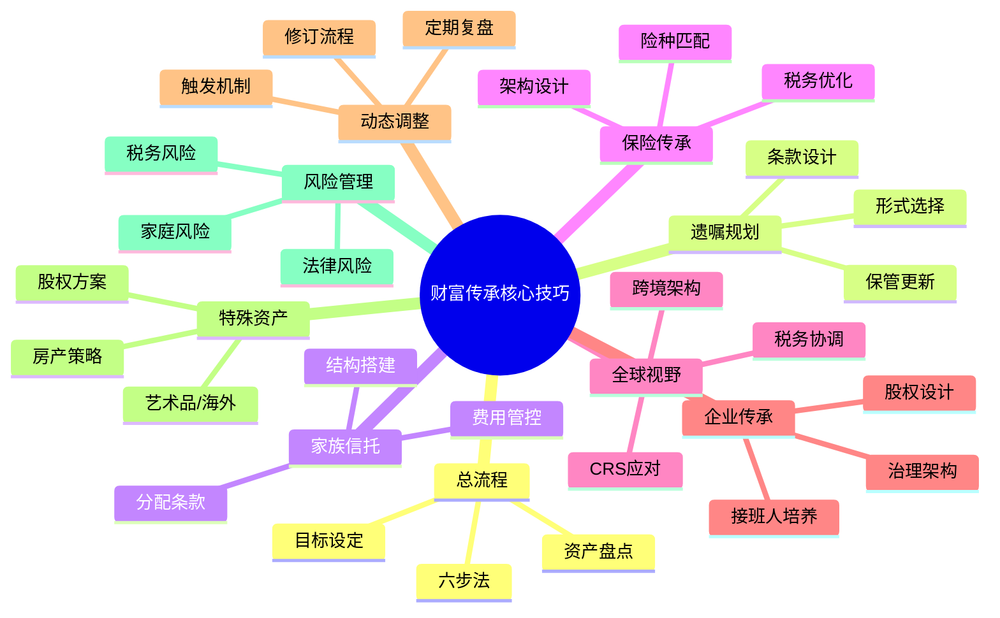
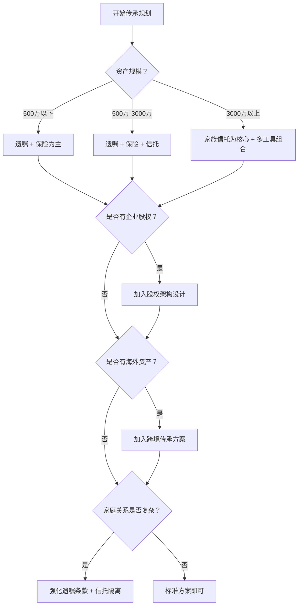
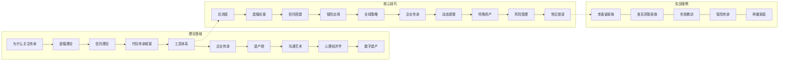

## 核心技巧总览：从理论到落地的完整工具箱

本节围绕财富传承的九大实操领域展开，从总流程设计到具体工具运用，从国内方案到全球视野，从常规资产到特殊标的，构建了一套系统化的传承实操方法论。本小结将提炼各章核心要点，梳理工具选择逻辑，帮助读者建立全局视角，确保在实际操作中能够"对症下药"。

---

### 一、九章核心要点速览

#### 1.1 财富传承实操总流程

财富传承不是一次性事件，而是一个持续数年甚至数十年的系统工程。核心流程分为六个阶段：

| 阶段 | 核心任务 | 关键产出 |
|------|---------|---------|
| 资产盘点 | 全面梳理资产与负债，识别隐性资产和或有负债 | 资产负债全景表 |
| 目标设定 | 明确传承对象、时间表、附加条件 | 传承意愿书 |
| 方案设计 | 选择工具组合，设计法律架构 | 传承方案草案 |
| 专业评审 | 律师、税务师、信托经理联合审查 | 评审意见及修订版方案 |
| 落地执行 | 签署文件、资产过户、账户开设 | 已执行的法律文件 |
| 持续管理 | 定期复盘、动态调整、危机应对 | 年度管理报告 |

**关键原则**：先梳理、再规划、后执行。跳过资产盘点直接设计方案，是最常见的错误——你无法有效分配自己都不清楚的东西。

#### 1.2 遗嘱规划实操指南

遗嘱是传承的法律基础，但大多数人对遗嘱的理解停留在"写一份文件"的层面。实操中需要关注三个维度：

**形式选择**：

| 遗嘱形式 | 法律效力 | 适用场景 | 注意事项 |
|----------|---------|---------|---------|
| 自书遗嘱 | 有效 | 资产简单、家庭关系清晰 | 必须亲笔书写、签名、注明年月日 |
| 代书遗嘱 | 有效 | 立遗嘱人书写困难 | 需两个以上见证人在场 |
| 公证遗嘱 | 效力最高 | 资产复杂、可能有争议 | 费用较高，修改需重新公证 |
| 打印遗嘱 | 有效（民法典新增） | 内容较多 | 每页需签名，两个见证人 |
| 录音录像遗嘱 | 有效 | 紧急情况或特殊需求 | 两个见证人，需记录姓名和日期 |

**条款设计要点**：
- **兜底条款**：覆盖未预见的资产类型，避免遗漏
- **替代方案**：指定继承人先于被继承人去世时的替代安排
- **附条件分配**：如"子女完成大学教育后方可获得全部遗产"
- **执行人指定**：选择可信赖的遗嘱执行人，明确其权限范围
- **债务清偿顺序**：明确遗产先偿还债务再分配

**常见误区**：认为有了遗嘱就万事大吉。遗嘱只能解决"谁继承什么"的问题，无法解决资产隔离、税务优化、防止挥霍等问题——这些需要信托、保险等工具配合。

#### 1.3 家族信托搭建实操

家族信托是高净值家庭传承的核心工具，其价值在于实现资产的法律隔离、专业管理和定向分配。

**搭建五步法**：

1. **明确信托目的**——资产隔离、专业管理、防止挥霍、税务规划，目的不同，结构不同
2. **选择受托人**——信托公司（专业但费用高）、私人信托公司（超高净值家族）、混合模式
3. **确定信托资产**——现金、股权、不动产、金融资产各有不同的过户成本和管理难度
4. **制定信托文件**——信托合同、投资指引、分配方案、继任方案，四份文件缺一不可
5. **资产过户与登记**——正式转移至信托名下，完成法律手续

**分配条款设计是灵魂**：

| 分配类型 | 机制 | 适用场景 |
|----------|------|---------|
| 按时间分配 | 25岁获20%，30岁获30%，35岁获50% | 防止年轻继承人挥霍 |
| 按事件分配 | 结婚、毕业、创业时获得相应资金 | 激励正向人生里程碑 |
| 按条件分配 | 年收入低于标准可申请补助，遭遇大病可申请医疗费 | 保障基本生活需求 |
| 激励性分配 | 考上名校奖励、取得职业资格奖励 | 引导继承人自我提升 |

**费用构成**需提前了解：设立费5-30万元，管理费年资产0.3%-1%，投资顾问费0.5%-2%，加上法律顾问和会计审计费。资产规模低于1000万元时，信托的性价比需要仔细评估。

#### 1.4 保险在传承中的应用技巧

保险在传承中的独特价值在于：杠杆效应（小额保费撬动大额赔付）、指定受益人（绕过继承程序）、一定的税务优势。

**险种选择逻辑**：
- **终身寿险**：确定性强，适合资产传承和债务隔离
- **年金险**：提供持续现金流，适合保障继承人基本生活
- **大额万能险/投连险**：兼具保障和投资功能，但收益不确定

**架构设计核心**：投保人、被保险人、受益人的安排直接决定传承效果。例如父母作为投保人为子女投保，子女作为被保险人和受益人，可以实现资产的定向转移且不受子女婚姻变动影响。

#### 1.5 全球视野下的传承策略

跨境传承面临的核心挑战是不同法律体系的冲突和税务协调。

**关键问题清单**：
- 各国继承法差异（大陆法系 vs 普通法系对遗产分配的规定截然不同）
- 双重征税问题（同一笔遗产可能被两国同时征税）
- 外汇管制（中国每年5万美元的购汇限额影响跨境资产调配）
- CRS信息交换（全球税务透明化时代，海外资产无处藏身）

**应对策略**：在资产所在国设立当地信托、利用双重征税协定、提前做好外汇合规安排、在遗嘱中明确海外资产处置方式。

#### 1.6 家族企业传承的实操方法

家族企业传承是所有传承场景中最复杂的，因为它同时涉及资产传承、控制权安排、企业治理和接班人培养。

**控制权与收益权分离的三种工具**：

| 工具 | 机制 | 适用规模 |
|------|------|---------|
| 有限合伙持股平台 | 核心成员做GP掌握决策权，其他成员做LP享分红权 | 中大型企业 |
| AB股结构 | 同股不同权，家族股份有更多投票权 | 有上市计划的企业 |
| 家族信托持股 | 股权装入信托，受托人统一管理 | 资产规模较大的家族 |

#### 1.7 传承方案的动态调整

传承方案不是一劳永逸的。法律变化、家庭结构变动、资产规模波动都要求方案定期复盘和调整。

**触发调整的信号**：
- 法律法规变化（如遗产税立法进展、信托法修订）
- 家庭事件（婚姻变动、新增子女、继承人丧失行为能力）
- 资产重大变化（企业上市、重大投资、资产减值）
- 外部环境变化（CRS实施、跨境政策调整）

**建议复盘频率**：每年至少一次全面复盘，重大事件发生后30天内启动临时评审。

#### 1.8 特殊资产的传承安排

不同资产类型需要差异化的传承策略：

**房产传承三种方式对比**：

| 传承方式 | 契税 | 增值税 | 个税 | 未来出售税务影响 |
|----------|------|--------|------|-----------------|
| 赠与 | 3% | 免征（直系亲属） | 免征（直系亲属） | 按赠与时价格计算差额 |
| 继承 | 3% | 免征 | 免征 | 按被继承人取得时价格计算差额 |
| 买卖 | 1%-3% | 满2年免征 | 满五唯一免征 | 按购买价格计算差额 |

**核心策略**：短期不卖选继承或赠与，未来可能出售需综合计算全生命周期税负。"满五唯一"政策的连续计算规则必须吃透。

**艺术品与收藏品**：建议设立私人博物馆或艺术基金会，配合保险和信托进行管理。估值争议是最大风险点，需提前聘请专业评估机构。

**海外资产**：不同国家继承法差异、双重征税、外汇管制、CRS信息交换，四个问题必须逐一解决。

#### 1.9 传承中的风险管理

传承过程中面临的风险远不止法律层面：

- **法律风险**：遗嘱无效、信托条款瑕疵、合同漏洞
- **税务风险**：政策变化导致税负增加、跨境双重征税、估值争议
- **家庭风险**：继承人之间纠纷、婚姻变动导致财产外流、继承人挥霍
- **操作风险**：方案执行不到位、关键文件遗失、受托人变更未及时处理

---

### 二、工具选择决策框架

不同资产规模和家庭结构，适用的传承工具组合截然不同。以下是决策参考框架：

**工具组合速查表**：

| 传承目标 | 首选工具 | 辅助工具 | 说明 |
|----------|---------|---------|------|
| 指定继承人 | 遗嘱 | 公证 | 最基础的传承安排 |
| 防止子女挥霍 | 家族信托 | 保险 | 通过分配条款控制节奏 |
| 资产隔离保护 | 家族信托 | 保险 | 信托资产独立于委托人和受益人 |
| 税务优化 | 保险 + 信托 | 遗嘱 | 利用保险的税务优势和信托的灵活性 |
| 家族企业传承 | 有限合伙 + 信托 | 遗嘱 | 控制权与收益权分离 |
| 跨境资产传承 | 当地信托 + 遗嘱 | 保险 | 需要资产所在国的法律工具 |
| 保障特定家庭成员 | 保险 + 信托 | 遗嘱 | 如保障未成年子女、残障家庭成员 |

---

### 三、核心原则提炼

通过对九章内容的梳理，以下原则贯穿传承规划的始终：

**原则一：早规划，晚执行**
传承规划的最佳时间是"现在"，但执行不急于一时。充分的前期调研和方案论证，远比仓促行动更重要。洛克菲勒家族的传承之所以成功，核心在于制度先行、代代完善。

**原则二：工具组合，而非单一依赖**
没有一种工具能解决所有问题。遗嘱解决法律效力，信托解决隔离和管理，保险解决杠杆和现金流，税务规划解决成本——四者缺一不可。

**原则三：动态管理，定期复盘**
法律在变、家庭在变、资产在变、政策在变。一份三年前制定的方案，今天可能已经不适用。建议每年全面复盘一次，重大事件后立即启动临时评审。

**原则四：专业团队不可或缺**
传承规划涉及法律、税务、金融、保险多个专业领域，单凭个人知识很难做到面面俱到。组建包含律师、税务师、信托经理、保险顾问的专业团队，是高质量传承规划的基础保障。

**原则五：沟通比方案更重要**
再完美的方案，如果家庭成员不理解、不认同，执行时也会遇到巨大阻力。传承规划中的沟通不是"通知"，而是"共识建设"——让继承人理解方案背后的逻辑，比方案本身更重要。

**原则六：防患于未然**
传承中最大的成本不是律师费和信托管理费，而是争议和纠纷带来的家族内耗。在方案设计时多花精力考虑争议预防机制，远比事后打官司划算。

---

### 四、自检清单：你的传承规划是否到位？

在进入实战案例章节之前，用以下清单对自己的传承规划进行初步评估：

| 检查项 | 已完成 | 待完善 | 未开始 |
|--------|--------|--------|--------|
| 资产与负债的全面盘点 | ☐ | ☐ | ☐ |
| 传承目标的明确设定 | ☐ | ☐ | ☐ |
| 遗嘱的起草与公证 | ☐ | ☐ | ☐ |
| 家族信托的搭建（如需要） | ☐ | ☐ | ☐ |
| 保险架构的优化 | ☐ | ☐ | ☐ |
| 企业股权架构的设计（如适用） | ☐ | ☐ | ☐ |
| 海外资产的传承安排（如适用） | ☐ | ☐ | ☐ |
| 税务规划的专项评估 | ☐ | ☐ | ☐ |
| 家庭成员的沟通与共识 | ☐ | ☐ | ☐ |
| 专业团队的组建 | ☐ | ☐ | ☐ |
| 定期复盘机制的建立 | ☐ | ☐ | ☐ |
| 紧急情况预案的制定 | ☐ | ☐ | ☐ |

如果"未开始"超过4项，说明传承规划还处于起步阶段，建议从资产盘点开始，逐步推进。如果大部分已完成，可以重点关注动态调整和风险管控，确保方案持续有效。

---

### 五、本节与全章的知识地图

理论基础提供了"为什么要这样做"的底层逻辑，核心技巧给出了"具体怎么做"的操作方法，实战案例展示了"别人怎么做的"的经验教训。三者层层递进，缺一不可。

---

### 六、进入实战前的最后提醒

在阅读下一节的实战案例之前，请记住以下三点：

1. **案例不能照搬**。每个家族的情况不同，资产结构、家庭关系、法律环境都有差异。案例的价值在于提供思路和启发，而不是可以直接套用的模板。

2. **失败案例比成功案例更有价值**。成功的传承往往是多种因素共同作用的结果，难以复制。而失败的原因往往是共性的——拖延、遗漏、沟通不足、工具误用——这些才是真正值得警惕的。

3. **从自己的实际情况出发**。不要被案例中的巨额资产和复杂架构吓退。传承规划的核心逻辑对任何资产规模都适用，区别只在于工具的复杂程度。一个普通家庭的一份周全遗嘱，其价值不亚于亿万富豪的家族信托。
