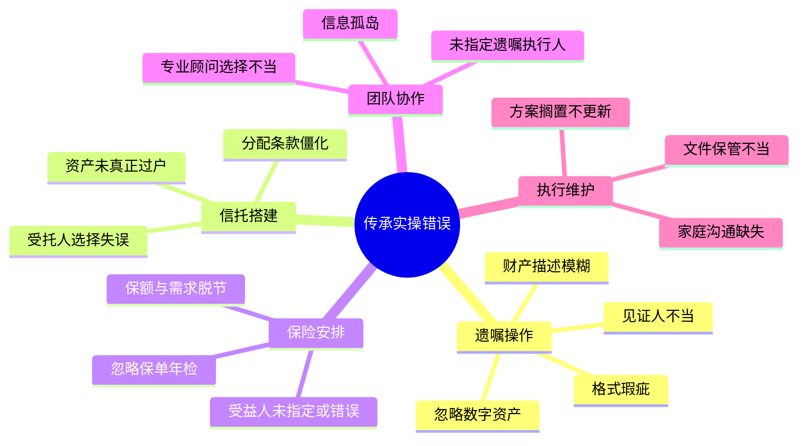
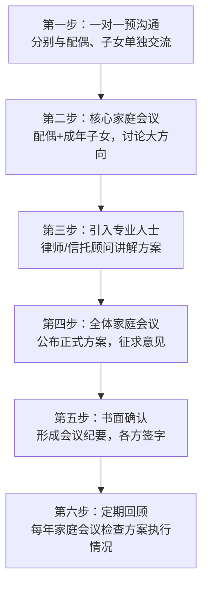

## 九、传承规划的常见错误与规避

前面的理论篇梳理了认知层面的误区（"我还年轻不需要""立遗嘱就万事大吉"等），本节聚焦**实操层面**——当你真正动手执行传承方案时，最容易踩到的操作性错误。这些错误不涉及观念问题，而是发生在签字、填写、选人、存档、更新等具体环节，每一个都可能让你精心设计的方案功亏一篑。



---

### 一、遗嘱操作中的九大典型错误

遗嘱是传承方案的基石，但实操中大量遗嘱因细节错误而被认定无效或引发纠纷。根据全国法院公开的继承纠纷判决书，遗嘱效力争议占继承诉讼的40%以上，其中绝大多数源于可避免的操作失误。

#### 错误1：财产描述模糊不清

**典型表现**："我名下的房子留给儿子""我的存款给女儿"。

**问题分析**：

- "我名下的房子"——如果有两套以上房产，哪一套？
- "我的存款"——哪个银行、哪个账户、大概多少金额？
- 财产会随时间变化：今天有3套房，卖掉1套又买了1套，遗嘱中的"我名下的房子"指哪些？

**正确做法**：

| 遗产类型 | 错误描述 | 正确描述 |
|----------|----------|----------|
| 房产 | "我的房子给儿子" | "位于XX市XX区XX路XX号XX室（不动产权证号：XXXX）的房产由儿子张三（身份证号：XXXX）继承" |
| 存款 | "存款给女儿" | "本人在中国工商银行XX支行（账号尾号XXXX）的全部存款及利息由女儿张四继承；其余银行账户的存款由配偶李五继承" |
| 股权 | "公司股份给老婆" | "本人持有的XX有限公司XX%的股权（统一社会信用代码：XXXX）由配偶李五继承" |
| 车辆 | "车给儿子" | "本人名下XX品牌XX型号车辆（车牌号：XXXX，车架号：XXXX）由儿子张三继承" |

**兜底条款必不可少**。财产会随时间变化，遗嘱中必须包含类似以下的兜底条款："除上述明确列示的财产外，本人去世时名下的其他一切合法财产，均由配偶李五继承。"

#### 错误2：处分了不属于自己的财产

**典型表现**：遗嘱中处分了夫妻共同财产中配偶的份额，或处分了已赠与他人的财产。

**法律后果**：根据《民法典》第1153条，夫妻共同财产中除有约定外，遗产分割时应先将共同财产的一半分出为配偶所有，其余为被继承人的遗产。如果遗嘱中直接处分了全部夫妻共同财产，超出被继承人个人份额的部分无效。

**真实案例**：王某（男）在自书遗嘱中写明"将夫妻共有的XX房产留给儿子"。王某去世后，妻子刘某提出异议，法院最终认定：该房产50%份额本就属于刘某，王某只能处分自己享有的50%份额。儿子最终只得到房产的一半权益，另一半仍属刘某。

**正确做法**：

- 遗嘱中明确区分"本人个人财产"和"本人在夫妻共同财产中的份额"
- 对于夫妻共同财产，写明"本人在XX房产中享有的50%份额（或XX%份额）由XX继承"
- 如有婚前财产、个人特有财产，应单独列明并附证明

#### 错误3：遗漏关键受益人

**典型表现**：遗嘱中只写了部分继承人，遗漏了法定继承人中的某一位。

**法律后果**：根据《民法典》第1141条，遗嘱应当为缺乏劳动能力又没有生活来源的继承人保留必要的遗产份额（"必留份"制度）。如果遗漏了未成年子女或丧失劳动能力的父母，该遗嘱可能部分无效。

更常见的问题是**无意遗漏**：遗嘱写于某一年，之后又有了新的子女（包括非婚生子女、养子女），但遗嘱未更新。新出生的子女虽然享有法定继承权，但可能导致分配方案偏离被继承人的真实意愿。

**正确做法**：

- 遗嘱中明确列出所有已知的法定继承人（配偶、子女、父母）
- 加入"如本人去世时有其他法定继承人的，该等继承人继承XX份额"的兜底条款
- 每次家庭结构变化时更新遗嘱

#### 错误4：见证人选择不当

这是代书遗嘱、打印遗嘱、录音录像遗嘱被认定无效的头号原因。

**法定排除名单**（《民法典》第1140条）：

- 无民事行为能力人、限制民事行为能力人
- 继承人、受遗赠人
- 与继承人、受遗赠人有利害关系的人

**实践中最常见的翻车场景**：

| 场景 | 问题 | 后果 |
|------|------|------|
| 请邻居做见证人，但邻居是某继承人的好友 | "有利害关系"的认定有争议 | 遗嘱效力存疑 |
| 请自家公司的员工做见证人 | 员工与企业主（继承人之父/母）存在劳动关系 | 可能被认定有利害关系 |
| 两个见证人是夫妻 | 实质上只有一个独立见证人 | 可能被认定见证人不足 |
| 见证人只在最后一页签名 | 打印遗嘱要求每页签名 | 未签名页面内容效力存疑 |
| 见证人事后补签 | 不符合"在场见证"要求 | 遗嘱可能被认定无效 |

**正确做法**：

- 选择与继承人无任何利益关系的第三方（律师最佳，其次为公证员、基层法律工作者）
- 见证人应当全程在场，不能中途加入或事后补签
- 见证人应当在遗嘱的每一页签名并注明日期
- 最好邀请见证人录制一段视频，说明其身份、与遗嘱人的关系、见证过程

#### 错误5：忽略数字资产和新型财产

**典型表现**：遗嘱中只涉及房产、存款、车辆等传统资产，完全忽略了数字资产。

**可能遗漏的数字资产类型**：

- **金融类**：支付宝余额、微信零钱、数字货币（比特币等）、网络理财账户
- **账号类**：社交媒体账号（微信号、微博号等具有商业价值的账号）、域名
- **内容类**：自媒体账号的收益权、网店（淘宝、拼多多店铺）、在线课程的版税
- **虚拟财产类**：游戏装备、NFT、数字藏品
- **数据类**：云端存储的照片、文档、通讯录——这些对家人有巨大情感价值

**实操难点**：数字资产的最大问题是**家人可能根本不知道它的存在**。你有一个比特币冷钱包，里面有价值50万的比特币，但你的家人完全不知道这件事——这笔财富就永远消失了。

**正确做法**：

- 建立一份《数字资产清单》，记录所有数字资产的平台、账号、大致金额或价值
- 密码和私钥使用密码管理器统一管理，将主密码的获取方式告知遗嘱执行人或信任的家人
- 遗嘱中加入数字资产条款："本人名下的一切数字资产（包括但不限于数字货币、网络账号、虚拟财产、在线账户中的资金）由XX继承"
- 对于加密货币等去中心化资产，必须在遗嘱或单独文件中记录私钥的保管位置和恢复方法

#### 错误6：自书遗嘱日期不完整

**典型表现**：只写"二〇二四年三月"而不写具体日期，或只写"三月十五日"而不写年份。

**法律后果**：日期是判断遗嘱人行为能力、确定多份遗嘱先后顺序的关键依据。日期不完整的遗嘱，法院可能认定为有瑕疵，在存在多份遗嘱时无法确定以哪份为准。

**正确做法**：日期必须精确到日，格式为"二〇二四年三月十五日"或"2024年3月15日"。同时建议注明时间和地点，例如"2024年3月15日上午10时，于XX市XX区XX路XX号住所"。

#### 错误7：涂改不规范

**典型表现**：自书遗嘱中有多处涂改、增删，但未在涂改处签名注明。

**正确做法**：

- 尽量避免涂改——如有修改，建议重新书写整份遗嘱
- 如确需涂改，在每处涂改旁签名并注明日期
- 涂改较多时，建议在遗嘱末尾加注"本遗嘱共涂改X处，均系本人亲笔修改"并签名

#### 错误8：将遗嘱锁在抽屉里无人知晓

**典型表现**：精心撰写遗嘱后，锁在自家保险柜或抽屉中，未告知任何人遗嘱的存在和位置。

**后果**：如果家人不知道有遗嘱，可能按法定继承处理。即使后来发现遗嘱，遗产可能已经被错误分配，追回的法律程序漫长且成本高昂。更糟糕的情况是——遗嘱可能永远不会被发现。

**正确做法**：

- 告知遗嘱执行人遗嘱的存在和保管位置
- 公证遗嘱的正本由公证处保管，安全且可查询
- 律师见证遗嘱可将正本交由律师事务所保管
- 至少让两个可信赖的人知道遗嘱的存放位置（不必告知内容）

#### 错误9：遗嘱指定的遗嘱执行人不具备执行能力

**典型表现**：指定年迈的父母或年轻的子女为遗嘱执行人，他们可能缺乏法律知识、时间精力或客观条件来执行遗嘱。

**正确做法**：

- 优先选择律师或专业机构作为遗嘱执行人
- 如选择自然人，应选择有法律意识、公正客观、有时间精力的人
- 在遗嘱中明确遗嘱执行人的权限：是否有权变卖资产、是否有权诉讼维权、是否有权聘请专业人员协助
- 指定替补执行人："如张三无法或不愿担任遗嘱执行人，则由李四担任"

---

### 二、信托搭建中的六大操作陷阱

#### 陷阱1：受托人选择失误

**家族信托的受托人**通常有两种选择：信托公司（机构受托人）或个人（自然人受托人）。

| 对比维度 | 信托公司 | 个人受托人 |
|----------|----------|------------|
| 专业性 | 高，有专业团队 | 取决于个人能力 |
| 持续性 | 公司存续，不受个人影响 | 个人去世或丧失能力即中断 |
| 费用 | 年管理费通常为信托资产的0.5%-2% | 无偿或象征性报酬 |
| 信任度 | 中立第三方，利益冲突少 | 通常是信任的亲友，但可能产生利益冲突 |
| 灵活性 | 受公司制度约束，变更较慢 | 灵活度高 |
| 监管 | 受银保监会监管，合规性有保障 | 缺乏外部监管 |

**常见错误**：

- 选择不具资质的机构（如"XX财富管理公司"而非持牌信托公司）
- 选择个人受托人时未考虑其健康状况、年龄、与受益人的关系变化
- 未指定继任受托人——如果唯一受托人无法履职，信托可能陷入瘫痪

**正确做法**：选择持牌信托公司作为主受托人，同时在信托合同中指定个人作为"信托保护人"或"信托监察人"，代表受益人监督信托公司的工作。

#### 陷阱2：信托分配条款过于僵化或过于灵活

**过于僵化的典型**："每年1月1日向受益人分配10万元。"

问题：如果信托资产因市场波动缩水，固定金额分配可能耗尽信托本金；如果受益人遇到重大支出需求（如重病），固定金额无法满足。

**过于灵活的典型**："受托人根据受益人的需要自行决定分配金额。"

问题：给了受托人过大的自由裁量权，可能产生利益冲突；受益人对分配没有可预期性。

**正确做法**：设计"弹性分配框架"——

```text
信托分配条款示例：

第X条 常规分配
  每季度向受益人分配信托净收益的60%，余额留存于信托账户继续投资。

第X条 教育激励分配
  受益人获得学士学位：一次性奖励20万元
  受益人获得硕士学位：一次性奖励30万元
  受益人获得博士学位：一次性奖励50万元

第X条 特殊支出分配
  受益人因重大疾病、意外伤害需要医疗费用的，受托人应在10个工作日内
  审批并拨付合理医疗费用，每年上限100万元。

第X条 应急分配
  受益人因不可抗力（自然灾害、疫情等）导致基本生活困难的，受托人可
  临时增加分配，每次不超过20万元，每年不超过2次。

第X条 暂停分配
  受益人存在以下情形之一的，受托人有权暂停分配：
  (1) 涉及刑事犯罪被羁押或服刑期间
  (2) 经专业机构鉴定为吸毒成瘾期间
  (3) 因赌博导致大额债务未清偿期间
  暂停分配期间的应分配金额留存于信托账户，待暂停事由消除后一并分配。
```

#### 陷阱3：资产未真正转入信托

**典型表现**：签订了信托合同，但未将资产的法律权属转移到信托名下。例如，房产仍登记在委托人名下，银行账户仍是委托人的个人账户。

**后果**：资产未转入信托 = 信托是空壳。委托人去世后，这些资产仍然属于遗产，需要经过继承程序，不享有信托的资产隔离保护。离婚时，未转入信托的资产仍可能被分割。

**正确操作清单**：

| 资产类型 | 过户操作 | 注意事项 |
|----------|----------|----------|
| 现金/存款 | 转入信托专户 | 需信托公司开设信托账户 |
| 房产 | 办理不动产变更登记至信托名下 | 涉及契税、增值税等税费，需提前测算成本 |
| 股权 | 办理工商变更登记 | 需其他股东同意（有限公司），涉及所得税 |
| 保险 | 变更保险金受益人为信托公司 | 需保险公司与信托公司签署合作协议 |
| 股票/基金 | 过户至信托证券账户 | 注意交易时间窗口，避免操作期间市场波动 |

**关键提醒**：资产过户可能触发税费。房产过户给信托可能需要缴纳契税（3%-5%）、增值税、个人所得税等。在设立信托前，务必请税务师测算过户成本，权衡收益与成本。

#### 陷阱4：信托合同中的"败笔条款"

**典型错误条款及修正**：

**错误**："受益人离婚时，其信托受益权归其配偶一半。"

修正：信托受益权是基于信托合同产生的权利，不属于夫妻共同财产。此条款不仅多余，而且可能被认定为委托人对信托制度的误解，引发合同解释争议。正确的做法是——信托合同中应明确约定"受益人的信托受益权为其个人财产，不因婚姻关系的变化而受影响"。

**错误**："受托人投资亏损由委托人承担。"

修正：应约定受托人的投资管理标准（如"审慎投资原则"），明确受托人在履行了合理的投资管理义务后，市场波动导致的正常亏损不由受托人承担；但因受托人违反信托合同约定的投资范围或投资策略导致的损失，由受托人赔偿。

**错误**："本信托为不可撤销信托。"但后面又写了"委托人有权随时修改信托条款。"

修正：不可撤销信托意味着委托人放弃对信托资产的一切权利。如果同时保留修改权，法律性质上仍是可撤销信托，但表述矛盾可能引发争议。要么选择不可撤销（放弃修改权），要么选择可撤销（保留修改权），不要自相矛盾。

#### 陷阱5：忽略信托的税务合规

信托并非"避税天堂"。信托设立、存续、分配各阶段都可能涉及税务问题：

| 阶段 | 可能涉及的税费 | 说明 |
|------|---------------|------|
| 设立（资产转入） | 契税、增值税、个税、印花税 | 视资产类型和转移方式而定 |
| 存续（投资收益） | 增值税、所得税 | 信托产品投资产生的收益需纳税 |
| 分配（给受益人） | 个人所得税 | 目前法规尚不明确，但存在被征税的可能 |
| 终止（资产返还） | 同设立阶段 | 资产从信托转出可能再次触发税费 |

**正确做法**：设立信托前，聘请税务顾问出具税务方案，评估全流程的税负成本，并在信托架构设计中优化税务安排（如选择税费较低的资产转移方式、利用税收优惠政策等）。

#### 陷阱6：境外信托的法律适用风险

部分高净值家庭会考虑设立境外信托（如中国香港、新加坡、开曼群岛等），但忽略了以下风险：

- **法律冲突**：中国法院可能不完全承认境外信托的效力，特别是涉及中国境内不动产时
- **外汇管制**：大额资金跨境转移至信托需要符合外汇管理规定，违规操作可能面临行政处罚
- **CRS信息交换**：境外信托的资产信息会通过CRS（共同申报准则）自动交换回中国税务机关
- **实际控制人风险**：如果委托人仍实际控制信托资产（"虚假信托"），中国法院可能否认信托的独立性

**正确做法**：境外信托的设立必须由同时熟悉中国法和信托设立地法律的专业律师团队操刀，不能仅依赖境外律师。

---

### 三、保险传承中的七个关键失误

#### 失误1：未指定受益人或受益人填写为"法定"

**后果**：未指定受益人或受益人填写为"法定继承人"的，保险金将作为被保险人的遗产处理，进入继承程序。这意味着：

- 保险金可能被用于偿还被保险人的债务
- 需要经过继承权公证或法院判决才能领取
- 所有法定继承人均有权主张分配，而非你希望保护的人
- 可能因继承纠纷导致保险金长期无法领取

**正确做法**：明确指定受益人及其分配比例。

```text
正确填写示例：
  受益人一：张小明（被保险人之子），受益比例60%
  受益人二：李芳（被保险人之妻），受益比例40%

错误填写示例：
  受益人：法定          ← 进入遗产程序，丧失定向传承功能
  受益人：家人          ← 无法确定具体是谁，保险公司无法理赔
```

#### 失误2：只指定一个受益人，未指定替补受益人

**后果**：如果唯一指定的受益人先于或同时于被保险人死亡，保险金将作为遗产处理。

**正确做法**：至少指定两个顺位的受益人。

```text
示例：
  第一顺位受益人：配偶李芳，受益比例100%
  第二顺位受益人：儿子张小明，受益比例100%
  （如配偶先于本人去世或同时身故，保险金全部给儿子）
```

#### 失误3：保额与实际需求严重脱节

**常见两种极端**：

- **保额过低**：年收入50万的家庭，只买了10万保额的寿险。万一出事，10万块能解决什么问题？
- **保额过高**：为了追求高保额，年缴保费占家庭收入的30%以上，影响当前生活质量，甚至因交不起保费导致保单失效。

**合理保额测算公式**：

```text
建议寿险保额 = 家庭负债总额
             + 子女教育至大学毕业的预估费用
             + 配偶未来10年基本生活费
             + 父母赡养费用
             - 已有流动资产

示例（35岁IT工程师，年收入50万）：
  房贷余额：200万
  子女教育费（1个孩子，至大学毕业）：100万
  配偶10年生活费：150万
  父母赡养费：50万
  已有流动资产：-80万
  ─────────────────
  建议保额：420万 → 取整为400-450万
```

#### 失误4：忽略保单的定期年检

保单不是签完就万事大吉。以下情况需要调整保单：

| 触发事件 | 需要调整的内容 | 调整方式 |
|----------|---------------|----------|
| 新生儿出生 | 增加受益人 | 向保险公司申请受益人变更 |
| 离婚 | 变更受益人（前配偶不再是受益人） | 受益人变更申请 |
| 再婚 | 增加新配偶为受益人 | 受益人变更申请 |
| 收入大幅变化 | 调整保额 | 加保或减保 |
| 房贷还清 | 减少保额需求 | 评估是否需要调整 |
| 受益人去世 | 更换受益人或调整比例 | 受益人变更申请 |

**建议频率**：每年检查一次保单，对照家庭现状确认受益人、保额、缴费状态是否仍然合理。

#### 失误5：保单贷款未考虑传承影响

很多人在急需资金时会选择保单贷款（以保单现金价值为质押）。但如果保单贷款未偿还就去世了，保险公司会从理赔金中扣除贷款本息。

**案例**：王某有一份保额300万的终身寿险，后来因资金周转困难办理了100万的保单贷款。王某去世后，保险公司理赔时扣除了100万贷款本息（含利息约105万），实际赔付给受益人的只有195万。受益人原以为能拿到300万，实际少了100多万。

**正确做法**：

- 保单贷款前评估对传承金额的影响
- 尽量在退休前还清保单贷款
- 如贷款金额较大，考虑额外加保以弥补差额

#### 失误6：购买保险时未如实告知健康状况

投保时未如实告知既往病史，出险后保险公司有权拒赔。这在传承场景下尤其致命——被保险人已经去世，受益人需要保险金来维持生活，却因投保时的隐瞒而无法获赔。

**正确做法**：投保时务必如实告知健康状况。即使需要加费或除外承保，也比未来拒赔强。如果不确定某些健康问题是否需要告知，宁可多告知，不可遗漏。

#### 失误7：年金保险的受益人安排不当

年金保险与寿险不同——年金是在被保险人生存期间定期领取的。如果被保险人在年金领取期内去世，剩余未领取的年金如何处理，取决于保单条款和受益人安排。

**正确做法**：购买年金保险时，确认保单是否包含"保证领取"条款（如"保证领取20年"），并指定身故受益人领取剩余年金。

---

### 四、团队协作与信息管理的四大失误

#### 失误1：律师、税务师、信托顾问各自为政

传承规划涉及法律、税务、金融多个领域，但很多人分别聘请了律师、税务师、理财顾问，却没有一个人统筹全局。

**典型后果**：

- 律师设计的遗嘱方案在税务上不划算
- 信托架构设计好了但忽略了资产过户的税费成本
- 保险受益人写法与遗嘱中的分配方案矛盾
- 各专业人员给出互相冲突的建议

**正确做法**：

- 指定一位"传承规划牵头人"（通常是最具综合视野的律师或信托顾问）
- 所有专业人员向牵头人汇报，由牵头人统筹方案
- 关键决策前召开多方联席会议，确保法律、税务、金融方案的一致性
- 形成书面的《传承规划总方案》，各方签字确认

#### 失误2：未建立完整的资产信息档案

传承规划的基础是完整的资产信息。但很多人的资产信息分散在各处，甚至连自己都说不清楚。

**必要信息清单**：

```text
一、不动产
  房产1：XX市XX区XX路XX号，产权证号XXXX，当前市值约XX万，贷款余额XX万
  房产2：……

二、金融资产
  银行账户1：XX银行XX支行，账号尾号XXXX，余额约XX万
  证券账户：XX证券XX营业部，账号尾号XXXX，持仓市值约XX万
  基金账户：……
  保险：XX保险公司，保单号XXXX，保额XX万，受益人XX

三、企业资产
  公司1：XX有限公司，持股比例XX%，注册资本XX万，当前估值约XX万
  ……

四、负债
  房贷：XX银行，余额XX万，月供XX元，到期日XXXX
  信用贷：……
  担保：为XX公司担保XX万

五、数字资产
  支付宝余额约XX万，微信零钱约XX万
  数字货币：XX枚比特币，存放于XX钱包
  域名：XX.com，年续费XX元

六、保险箱/贵重物品
  XX银行保险箱，存放物品清单：……

七、重要文件存放位置
  房产证：XX保险柜
  遗嘱：XX律师事务所
  公司章程：XX
```

**保管要求**：

- 纸质版存放于保险柜或律师事务所
- 电子版加密存储，告知遗嘱执行人密码
- 每年至少更新一次
- 不要在档案中记录银行密码——密码应使用密码管理器单独管理

#### 失误3：遗嘱执行人与继承人利益冲突

**典型错误**：指定遗产的主要继承人同时担任遗嘱执行人。

**问题**：继承人作为执行人，既是"裁判员"又是"运动员"，在遗产清点、分配方案执行中可能偏向自己，引发其他继承人的不信任和质疑。

**正确做法**：

- 优先选择与遗产无利害关系的第三方（律师、公证员、信托公司）
- 如果选择家庭成员，选择不参与遗产分配的人（如已独立的侄子/侄女）
- 在遗嘱中明确执行人的权限和报告义务

#### 失误4：未与家人提前沟通传承方案

这不单是观念问题（"跟家人谈不吉利"），更是操作层面的问题——即使你想沟通，方法不当也会适得其反。

**常见沟通失误**：

- 在家庭聚餐时突然宣布遗嘱内容——场合不对，容易引发情绪化反应
- 只通知了部分家庭成员——被排除在外的人感到被排斥
- 沟通时使用命令式语气——"我已经决定了，你们照做就行"
- 一次性公布全部细节——信息量太大，家人来不及消化

**正确的沟通流程**：



---

### 五、执行维护中的五个致命错误

#### 错误1：传承方案制定后束之高阁

这是最普遍的执行错误。很多人花了几万甚至几十万请专业人士设计了传承方案，之后就再也不管了。

**数据佐证**：根据某信托公司的内部统计，其客户中约35%在设立信托后5年内从未进行过条款审视或调整。其中约15%的信托条款因家庭情况变化已不再符合委托人的真实意愿。

**正确做法**：

| 审视类型 | 频率 | 内容 | 费时 |
|----------|------|------|------|
| 轻度审视 | 每年1次 | 遗嘱中资产清单是否需更新、保险受益人是否正确 | 1-2小时 |
| 中度审视 | 每3年1次 | 信托条款是否需调整、整体方案是否仍合理 | 半天+专业顾问1次 |
| 重度审视 | 每5年或重大事件后 | 全面复审、引入新工具、调整架构 | 1-2天+多次专业会议 |
| 即时审视 | 重大事件发生时 | 离婚、再婚、新生儿、大额资产变动等 | 视情况而定 |

#### 错误2：遗嘱原件保管不当

**风险场景**：

- 遗嘱存放在家中，火灾/水灾/被盗后原件丢失
- 遗嘱存放在家中，被不满意的继承人偷走或销毁
- 自书遗嘱的墨水褪色或纸张损坏

**正确做法**：

- 公证遗嘱：正本由公证处保管，本人持副本
- 律师见证遗嘱：正本交律师事务所保管（放入防火保险柜），本人持副本
- 自书遗嘱：正本交信任的第三方（如遗嘱执行人或公证处），本人留副本
- 所有遗嘱均应拍照/扫描留存电子版，加密保存

#### 错误3：多份遗嘱未做好版本管理

**典型场景**：王某2018年在A公证处立了公证遗嘱，2021年在B律师事务所立了律师见证遗嘱，2023年又写了一份自书遗嘱。三份遗嘱的内容不完全一致。王某去世后，三份遗嘱同时出现，家人对以哪份为准争执不下。

**法律规则**：根据《民法典》第1142条，立有数份遗嘱，内容相抵触的，以最后的遗嘱为准。但"最后"需要通过日期来判断——如果日期不清晰（回到错误6），就可能无法确定哪份是最后的。

**正确做法**：

- 每次立新遗嘱时，在新遗嘱中明确写明"本遗嘱取代本人此前立定的一切遗嘱"
- 旧遗嘱应当收回销毁，或在旧遗嘱上注明"本遗嘱已被XXXX年X月X日的新遗嘱取代"
- 建立遗嘱登记表，记录每份遗嘱的编号、日期、内容摘要、保管位置

```text
遗嘱登记表模板：

| 编号 | 日期       | 类型     | 主要内容摘要                     | 保管位置       | 状态   |
|------|------------|----------|----------------------------------|----------------|--------|
| W001 | 2018-05-10 | 公证遗嘱 | 房产给儿子，存款给配偶           | XX公证处       | 已作废 |
| W002 | 2021-08-20 | 律师见证 | 房产给儿子，存款给配偶，股权给女儿 | XX律师事务所   | 已作废 |
| W003 | 2023-12-01 | 自书遗嘱 | 全部财产按XX比例分配             | 遗嘱执行人处   | 生效中 |
```

#### 错误4：忽略跨境资产的传承特殊性

**常见问题**：

- 在海外有房产但未做当地法律下的传承安排——中国的遗嘱可能无法直接处分海外不动产
- 海外银行账户的继承需要按照开户地法律办理
- 不同国家的继承法律差异巨大：有些国家有"特留份"制度（强制给特定继承人一定比例），可能与中国遗嘱的安排冲突

**正确做法**：

- 对于每个有资产的国家/地区，分别咨询当地律师，了解当地的继承规则
- 考虑在资产所在地分别立遗嘱，但需要确保各份遗嘱之间不冲突
- 中国的遗嘱中对海外资产的描述应注明所在国家/地区和法律适用

#### 错误5：传承方案缺乏应急预案

**典型场景**：

- 遗嘱执行人先于遗嘱人去世，没有替补执行人
- 信托公司的唯一受托人被吊销牌照，没有备选受托人
- 家人不知道紧急情况下应该联系谁

**正确做法**：为每一个关键角色配备"备份"：

| 关键角色 | 主要人选 | 备选人选 | 紧急联系方式 |
|----------|----------|----------|-------------|
| 遗嘱执行人 | XX律师 | XX信托公司 | 电话/地址 |
| 信托受托人 | XX信托公司 | XX信托公司（备选） | 电话/地址 |
| 保险顾问 | XX保险经纪人 | XX保险公司客服 | 电话 |
| 家庭财务顾问 | XX理财师 | XX | 电话 |

**紧急联络卡**：制作一张卡片，写明紧急情况下应联系的人员及其联系方式，分别交给配偶、成年子女、遗嘱执行人。这张卡片不必透露遗产具体内容，只需告诉家人"万一有什么事，先联系这个人"。

---

### 六、自检清单：传承方案的30个检查点

完成传承规划后，逐项检查以下内容：

**遗嘱检查（1-10）**：

1. [ ] 遗嘱形式是否符合法定要求（六种形式之一）
2. [ ] 遗嘱人签名是否亲笔（自书遗嘱需全部手写）
3. [ ] 日期是否精确到年月日
4. [ ] 财产描述是否具体（含产权证号、账号等标识信息）
5. [ ] 是否包含兜底条款（处理未列明的其他财产）
6. [ ] 见证人是否符合资格要求（打印/代书/录音录像遗嘱）
7. [ ] 见证人是否在每一页签名（打印遗嘱）
8. [ ] 是否为缺乏劳动能力的继承人保留了必要份额
9. [ ] 是否指定了遗嘱执行人及替补执行人
10. [ ] 遗嘱原件是否安全保管且有人知晓位置

**信托检查（11-18）**：

11. [ ] 信托资产是否已完成法律权属转移
12. [ ] 受托人是否具备资质且已指定继任受托人
13. [ ] 分配条款是否既有弹性又有约束
14. [ ] 是否包含暂停分配的条件条款
15. [ ] 税务方案是否已经专业评估
16. [ ] 信托合同是否存在自相矛盾的条款
17. [ ] 信托保护人/监察人是否已指定
18. [ ] 跨境信托是否已评估中国法律承认风险

**保险检查（19-25）**：

19. [ ] 所有保单是否已明确指定受益人（非"法定"）
20. [ ] 是否指定了替补受益人
21. [ ] 保额是否与家庭需求匹配
22. [ ] 受益人信息是否最新（婚姻变化后是否更新）
23. [ ] 保单贷款余额是否影响传承金额
24. [ ] 是否存在保障缺口需要加保
25. [ ] 保险金信托是否已对接

**团队与执行检查（26-30）**：

26. [ ] 各专业顾问之间是否已协调一致
27. [ ] 完整资产档案是否已建立并加密保存
28. [ ] 紧急联络卡是否已发放给关键家庭成员
29. [ ] 家庭成员是否了解传承方案的大致安排
30. [ ] 是否已设定下次审视的时间（建议不超过1年）

---

### 七、错误成本速查表

下表汇总了各类错误可能带来的直接经济损失，帮助读者直观理解"认真做"和"随便做"的差距：

| 错误类型 | 直接经济损失 | 间接损失 | 修复成本 |
|----------|-------------|----------|----------|
| 遗嘱形式无效 | 全部遗产按法定继承分配，可能偏离意愿50%以上 | 家庭关系破裂、诉讼费用 | 诉讼费（遗产价值的2%-5%）、律师费（5万-30万） |
| 保险受益人未指定 | 保险金进入遗产程序，丧失定向传承功能 | 被保险人的债务可能消耗保险金 | 可能无法修复（人已去世） |
| 信托资产未过户 | 信托形同虚设，资产仍属遗产 | 失去资产隔离保护 | 重新办理过户，可能产生额外税费 |
| 见证人资格不当 | 遗嘱被认定无效 | 同"遗嘱形式无效" | 重新立遗嘱 |
| 遗嘱原件丢失 | 可能需要按法定继承处理 | 继承人之间产生猜疑 | 诉讼确认（如能找到复印件或有其他证据） |
| 方案未更新 | 旧方案不再反映真实意愿 | 可能导致不公平分配 | 需要全面重做方案 |

> **总结**：传承规划中每一个看似微小的操作错误，背后都可能隐藏着数十万甚至数百万的经济损失，以及无法用金钱衡量的家庭关系损害。认真对待每一个细节，就是对家人最大的负责。
