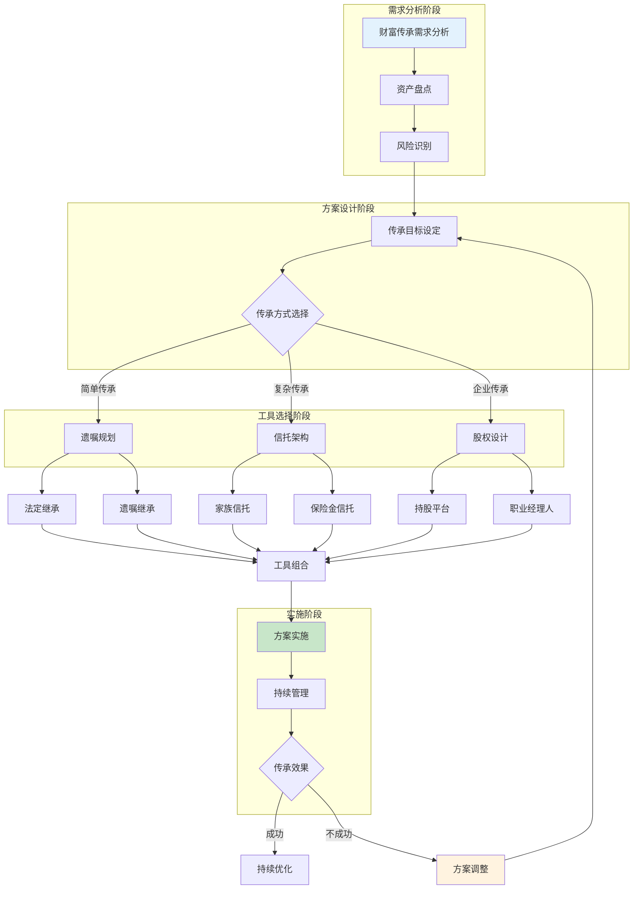
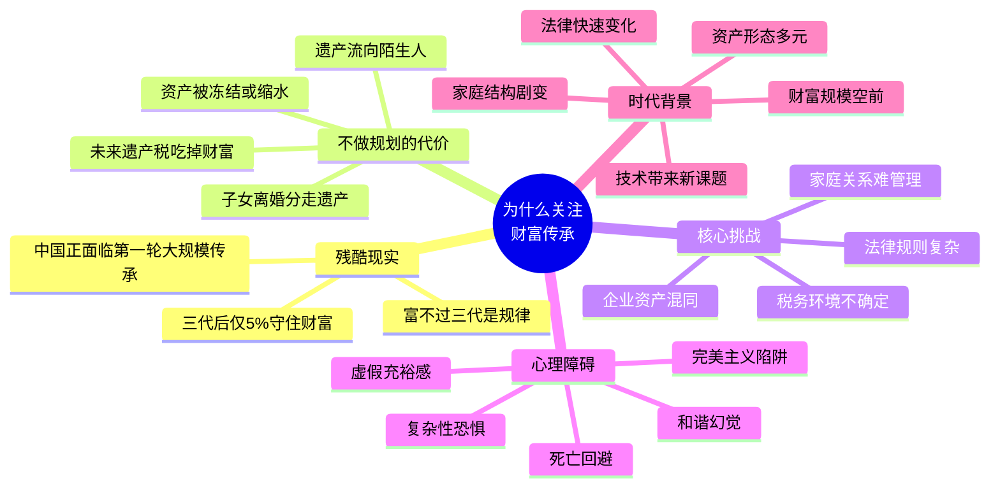

## 一、为什么要关注财富传承

### 1.0 财富传承规划总体框架

财富传承是一项系统工程，需要从多个维度进行规划和安排。在深入讨论"为什么"之前，先建立全局视野——理解传承规划涉及哪些环节、如何层层递进：

**规划要点**：
- **全面性**：考虑有形财富（房产、现金、股权）和无形资产（品牌价值、社会关系、家族文化、数字资产）
- **系统性**：法律工具（遗嘱、信托）、金融工具（保险、年金）、税务工具（赠与规划、股权架构）综合运用，而非依赖单一手段
- **前瞻性**：提前5-10年规划，避免临时安排导致的仓促和疏漏
- **持续性**：传承是动态过程，家庭结构、法律环境、资产规模都在变化，方案需要每3-5年审视一次

***

### 1.1 "富不过三代"的残酷现实

#### 全球数据：代际流失是普遍规律

全球范围内，家族财富的代际流失是一个被反复验证的普遍现象。多项权威研究给出了一致的结论：

| 传承阶段 | 成功率 | 数据来源 |
|----------|--------|----------|
| 第一代 → 第二代 | 约30% | 中国民营经济研究会、麦肯锡 |
| 第二代 → 第三代 | 约12% | 全球家族企业研究（FFI） |
| 三代后财富仍保持 | 不到5% | 麦肯锡家族企业研究 |
| 四代及以后 | 约1-2% | 欧洲百年家族追踪研究 |

这意味着，100个辛苦打拼创富的家庭，到第三代只剩下不到5个能守住财富。换句话说，**不做规划的传承，本质上是一场必输的赌局**。

#### 为什么财富守不住？代际流失的五大机制

"富不过三代"不是玄学诅咒，而是有清晰的因果链条。理解这些机制，是做好传承规划的前提：

**机制一：创造者效应消退**

第一代财富创造者通常具备超常的能力、毅力和判断力。这些品质很难通过基因或教育完美传递给下一代。第二代在优渥环境中长大，缺少创业时的磨砺，决策能力和抗风险能力往往弱于第一代。到了第三代，这种能力差距进一步扩大。

心理学家将这种现象称为"逆境商递减"——顺境中成长的人更难应对突发危机。这解释了为什么许多家族企业在创始人离世后迅速衰落：不是市场变了，而是掌舵人的能力变了。

**机制二：分散效应**

中国传统的"诸子均分"制度——每个子女平均继承遗产——在几代之后造成惊人的财富稀释。假设第一代有2个子女，每个子女又有2个子女，三代之后财富被分成8份。如果每代的子女更多，稀释速度更快。

数学上的计算很简单：假设每代2个子女，均分继承，三代后每份只有原始财富的12.5%。如果每代有3个子女，三代后每份仅剩3.7%。这就是为什么欧洲贵族实行长子继承制——不是偏心，而是保全。

**机制三：外部侵蚀**

财富在代际传递过程中面临多重外部压力：通货膨胀每年侵蚀购买力（中国过去20年年均通胀约2-3%，实际购买力损失约40-50%）；税务负担（遗产税在发达国家税率可达40-55%）；法律风险（继承纠纷、债务追偿、婚姻变动）。

**机制四：接班断层**

家族企业传承中最大的风险不是资产流失，而是接班断层。当创始人突然离世或丧失行为能力，如果接班人尚未准备好，企业会在短时间内陷入管理真空。银行收紧贷款、供应商要求提前付款、核心员工跳槽——这些连锁反应可能在几个月内摧毁一个经营数十年的企业。

**机制五：家庭内耗**

遗产分配不均导致的兄弟反目、再婚家庭中前婚子女与现婚配偶的利益冲突、婆媳矛盾引发的企业控制权争夺——这些家庭内耗是传承失败最常见的直接原因。最高人民法院的数据显示，继承纠纷案件中超过60%涉及家庭成员之间的对抗。

#### 中国的特殊紧迫性

中国正面临一个前所未有的传承窗口期。改革开放后（1978年起）第一批创业者，经过40多年的积累，创造了中国历史上最大规模的民间财富。根据招商银行与贝恩公司的《中国私人财富报告》，中国可投资资产超过1000万人民币的高净值人群已超过300万人，可投资资产总规模超过100万亿元。

这些创业者大多已进入50-70岁的年龄段，正面临第一轮大规模代际传承。与欧美家族已经历三到五代传承不同，**中国的高净值人群几乎没有任何可借鉴的本土传承经验**。这意味着所有问题都要第一次面对、第一次解决——而时间窗口正在关闭。

更严峻的是，中国的法律体系在传承领域还有明显的不完善之处：遗产税虽未开征但立法准备一直在推进、信托法的实操细则仍有模糊地带、跨境资产的传承面临多国法律冲突。这些法律不确定性加剧了传承规划的复杂性。

***

### 1.2 不做传承规划的代价：四个真实场景

很多人认为"我还年轻"或"我的资产不多，不需要传承规划"。但不做规划的代价远比想象的严重。以下四个场景，每一个都可能发生在你身边：

#### 场景一：一场意外，资产被冻结

张先生经营一家建材公司，资产约2000万元。他没有立遗嘱。2023年突发心梗去世后，按照《民法典》法定继承规则，其配偶、父母、两个子女都是第一顺序继承人。问题在于：

- 公司股权作为遗产，需要所有继承人一致同意才能办理变更登记。张先生的父母年迈且与儿媳关系一般，拒绝配合。
- 银行发现法人去世后冻结了公司账户，供应商货款无法支付，员工工资无法发放。
- 三个继承人之间对遗产分配产生分歧，进入诉讼程序。

**结果**：公司因资金链断裂被迫清算，2000万元的资产在两年的诉讼和清算过程中缩水至不足800万元。家人不仅失去了亲人，还失去了大部分财富。

如果张先生提前立了一份合法有效的遗嘱，并为公司股权设计了传承架构，这些问题都可以避免。

#### 场景二：子女离婚，一半遗产归了外人

李女士将一套价值600万元的房产在生前过户给独子。两年后儿子离婚，前妻主张该房产属于夫妻共同财产，要求分割50%。

根据《民法典》第1062条，婚姻关系存续期间继承或受赠的财产属于夫妻共同财产——除非遗嘱或赠与合同中明确指定只归一方所有。李女士的过户行为没有注明"仅赠与儿子个人"，因此该房产被认定为夫妻共同财产。

**结果**：儿子离婚后，前妻分走300万元。如果李女士在赠与时附加"仅归某某个人所有，不作为夫妻共同财产"的条款，或者通过遗嘱指定、信托安排等方式，这笔财富完全可以保全。

#### 场景三：白发人送黑发人，遗产流向陌生人

王先生是独生子，35岁，已婚，有一个3岁的孩子。王先生意外去世，留下一套价值400万元的房产和200万元存款。

按照法定继承：配偶、子女、父母都是第一顺序继承人，原则上均分。王先生的父母本应继承约150万元。但如果这套房产是王先生婚前购买且登记在个人名下，属于个人财产；如果婚后购买，则属于夫妻共同财产，配偶先分走一半（200万），剩余部分再由配偶、子女、父母均分。

更复杂的情况是：如果王先生没有遗嘱，其配偶作为法定监护人代管孩子的遗产份额。如果配偶再婚，这些资产的实际控制权就完全转移到了新家庭。王先生的父母可能一分钱都拿不到。

#### 场景四：遗产税一夜之间吃掉一半

这个场景目前在中国尚未发生，但在发达国家是真实存在的。以日本为例：日本的遗产税最高边际税率为55%，且在继承发生后10个月内以现金缴纳。如果一个家族的财富大部分锁定在不动产和企业股权上，继承人往往不得不折价变卖资产来凑齐税款。

日本前首相桥本龙太郎去世后，其继承人因无力缴纳遗产税，被迫出售其收藏的大量艺术品。三得利创始人家族、松下幸之助家族等都曾因遗产税问题被迫稀释家族对企业的控制权。

中国目前尚未开征遗产税，但全国人大和财政部已多次释放信号，遗产税的立法准备工作一直在推进。参照国际经验，一旦开征，很可能采用超额累进税率，最高税率可能在30%-50%之间。提前规划——通过赠与、信托、保险等工具在合法框架内降低应税遗产规模——是唯一理性的选择。

***

### 1.3 财富传承的核心挑战

理解了不做规划的代价之后，再来看传承面临的具体挑战。这些挑战不是孤立的，而是相互交织、相互放大的：

#### 法律挑战：规则复杂，认知不足

中国继承法律体系以《民法典》继承编为核心（第1119-1163条），配合最高人民法院的相关司法解释。核心规则包括：

| 规则类别 | 要点 | 常见误区 |
|----------|------|----------|
| 法定继承顺序 | 第一顺序：配偶、子女、父母；第二顺序：兄弟姐妹、祖父母、外祖父母 | 以为父母没有继承权，或兄弟姐妹是第一顺序 |
| 遗嘱形式 | 自书、代书、打印、录音录像、口头、公证六种形式 | 以为只有公证遗嘱才有效（民法典已取消公证遗嘱优先效力） |
| 遗嘱效力 | 以最后设立的遗嘱为准 | 以为先立的遗嘱效力更高 |
| 特留份制度 | 缺乏劳动能力又没有生活来源的继承人必须保留必要份额 | 以为可以完全剥夺某个继承人的继承权 |
| 夫妻共同财产 | 婚后继承的财产原则上属于共同财产 | 以为继承的财产只归继承人个人 |

大多数人在没有专业指导的情况下，对上述规则存在不同程度的误解。而这些误解一旦转化为错误的传承安排，后果往往是不可逆的。

#### 税务挑战：现在没有，不代表将来没有

中国目前的税制在传承领域的直接影响有限——没有遗产税、没有赠与税、继承房产免征个人所得税。但间接税负不可忽视：

- **房产过户税费**：继承房产虽免个税，但需缴纳契税（3%-5%）、印花税（0.05%）等。赠与房产还需缴纳3%-5%的契税和20%的个人所得税（非直系亲属）。
- **股权转让税费**：企业股权传承涉及的企业所得税、个人所得税可能产生巨额税负。
- **未来遗产税**：参照国际惯例，遗产税开征后可能对存量资产产生追溯效力，或者设置较短的过渡期。

提前利用当前的政策窗口期进行规划，是成本最低的选择。

#### 家庭挑战：人心是最难管理的变量

法律和税务问题有明确的规则可以遵循，但家庭关系是动态的、情绪化的、不可预测的。传承中的家庭挑战包括：

- **多子女家庭的利益分配**：如何在公平与效率之间取得平衡？均分可能导致企业控制权分散，偏向某个子女可能导致其他子女不满。
- **再婚家庭的财产归属**：前婚子女担心遗产被继父/继母分走，现婚配偶担心自己和孩子没有保障。
- **子女婚姻变动的影响**：离婚率上升意味着传承资产面临被分割的风险。
- **代际观念冲突**：老一辈希望子女接班，年轻一代有自己的职业规划。
- **隐瞒与欺骗**：家庭成员隐藏资产、伪造债务、胁迫老人修改遗嘱。

#### 企业挑战：企业资产与个人资产的纠缠

企业主面临的传承挑战最为复杂：

- **资产混同**：企业账户与个人账户混用、企业资产登记在个人名下、个人消费从企业报销——这些做法在经营期间可能没有问题，但在传承时会造成资产性质认定的困难。
- **接班人困境**：子女不愿意接班、多个子女争夺控制权、职业经理人忠诚度不足。
- **债务风险传导**：企业债务可能因担保、人格混同等原因传导至个人和家庭。
- **估值争议**：非上市企业的股权价值难以确定，继承人之间容易产生分歧。

***

### 1.4 阻碍行动的心理障碍

认识到传承的重要性是一回事，真正采取行动是另一回事。研究表明，阻碍人们进行传承规划的主要不是知识不足，而是心理障碍：

#### 障碍一：死亡回避

传承规划的核心假设是"如果我不在了"。对死亡的恐惧和回避是人类最深层的心理防御机制之一。一项由美国律师协会（ABA）发起的调查显示，超过50%的受访者表示"想到要立遗嘱就感到不舒服"，这种不适感直接导致了行动的拖延。

**突破方法**：将传承规划重新定义为"家庭安全网建设"——就像买房要买保险、开车要系安全带一样。你不是在安排后事，而是在保护家人。

#### 障碍二：虚假的充裕感

"我还年轻，不着急""我的资产不多，没什么好传的""以后再说吧"——这些想法的共同点是对风险的低估和对时间的高估。意外和疾病不会等你准备好才来。根据国家统计局数据，中国每年非正常死亡人数超过300万，其中相当比例是中青年群体。

**突破方法**：做一个简单的思想实验——如果你明天突然不在了，你的家人知道你有哪些资产？放在哪里？密码是什么？有没有债务？如果答案是"不知道"，你就需要立刻开始规划。

#### 障碍三：和谐幻觉

"我的家庭关系很好，不会出现争遗产的情况。"这是最常见的幻觉。最高人民法院的数据显示，继承纠纷案件数量在过去十年持续增长。现实是：遗产面前，亲情往往不堪一击。不是因为家人本性恶毒，而是因为巨额利益会放大每一个微小的不公平感。

**突破方法**：承认一个事实——最好的家庭关系保护方式，不是回避问题，而是在生前就把规则讲清楚、把安排写明白。一份清晰的遗嘱，是留给家人最好的礼物。

#### 障碍四：复杂性恐惧

信托、保险、遗嘱、税务……传承规划涉及的法律和金融知识确实令人生畏。很多人在初步了解后就觉得"太复杂了，搞不懂"，然后选择放弃。

**突破方法**：你不需要成为专家。你需要的是理解基本原理，然后找到值得信赖的专业人士（律师、理财师、税务顾问）来帮助你制定和执行方案。本书的目的就是帮你建立这个基本认知框架。

#### 障碍五：完美主义陷阱

有些人不是不行动，而是想要"找到最完美的方案"后才开始。他们不断学习、比较、咨询，但始终不做出决定。结果是：永远在准备，永远不开始。

**突破方法**：记住一个原则——**一个不完美的方案，好过没有方案**。一份基本的遗嘱 + 一份保险，可能不是最优解，但已经比什么都不做强一百倍。先行动，再优化。

***

### 1.5 传承规划的时代背景：为什么是现在

如果说传承规划在任何时代都重要，那么在当前时代背景下，它的重要性被进一步放大了几个数量级：

#### 财富规模空前

中国用了40年走完了西方200年的工业化和财富积累之路。改革开放后第一代创业者积累的财富规模，在中国历史上前所未有。这些财富的代际传递，也是第一次大规模发生。

#### 家庭结构剧变

从传统的大家庭到核心小家庭，从多子女到独生子女再到放开生育，家庭结构的变化直接影响传承方案的设计。独生子女家庭面临的是"一人继承全部"的风险集中问题；二孩三孩家庭面临的是"如何公平分配"的平衡问题；再婚家庭面临的是"前婚子女与现婚家庭"的利益冲突问题。

#### 资产形态多元化

过去，中国家庭的财富主要集中在房产和银行存款上。现在，资产形态已经高度多元化：股票、基金、信托、保险、私募股权、加密货币、数字内容、知识产权、海外资产……不同类型的资产有不同的传承规则和税务处理方式，大大增加了规划的复杂性。

#### 法律环境快速变化

《民法典》2021年实施后，继承规则发生了重大变化（如取消公证遗嘱优先效力、增设打印遗嘱和录像遗嘱形式、扩大代位继承范围等）。同时，反洗钱、反避税的监管力度持续加强，跨境资产的信息交换（CRS）使得海外资产的隐匿越来越困难。

#### 技术变革带来新课题

数字遗产（加密货币、NFT、网络账号、数字内容）、人工智能相关的知识产权、生物技术带来的新型资产——这些都是传统传承法律从未涉及的新领域。提前思考和安排这些新型资产的传承，是前瞻性的体现。

***

### 1.6 本节核心结论

**一句话总结**：财富传承不是"有钱人的专利"，也不是"以后再说的事"。它是每一个有家庭、有资产、有牵挂的人，**现在就应该开始做的事**。

规划传承不是在安排后事，而是在保护你最爱的人。你花10年赚来的财富，值得你花10个小时来规划如何传递。

***

### 1.7 读者自查：你是否需要立刻行动

以下自查清单，如果有3项及以上回答"是"，建议你立即开始传承规划：

| 序号 | 自查项目 | 是/否 |
|------|----------|-------|
| 1 | 你名下有房产、存款或其他资产，但没有合法有效的遗嘱 | |
| 2 | 你不清楚自己名下的全部资产清单（包括银行账户、投资账户、保险、房产等） | |
| 3 | 你的家人不知道你的资产状况、银行密码、保险信息 | |
| 4 | 你是企业主或股东，企业资产与个人资产没有清晰隔离 | |
| 5 | 你是再婚家庭，前婚子女与现婚家庭的财产归属没有明确安排 | |
| 6 | 你有未成年子女，但没有为其指定监护人或设立资产保护机制 | |
| 7 | 你持有海外资产或数字资产（加密货币、网络账号等），没有传承安排 | |
| 8 | 你的遗嘱是5年前立的，期间家庭或资产情况发生了重大变化 | |
| 9 | 你的企业没有"关键人突然离场"的应急预案 | |
| 10 | 你从未与配偶或子女讨论过传承问题 | |

**分数解读**：
- **0-2项**：你的传承基础较好，继续完善即可
- **3-5项**：存在明显的传承风险，建议在3个月内启动规划
- **6-8项**：传承风险严重，建议立即咨询专业律师
- **9-10项**：你的财富处于高度危险状态，每一天的延迟都可能带来不可逆的损失

下一节将进入遗嘱规划的理论框架——传承体系的第一块基石。
