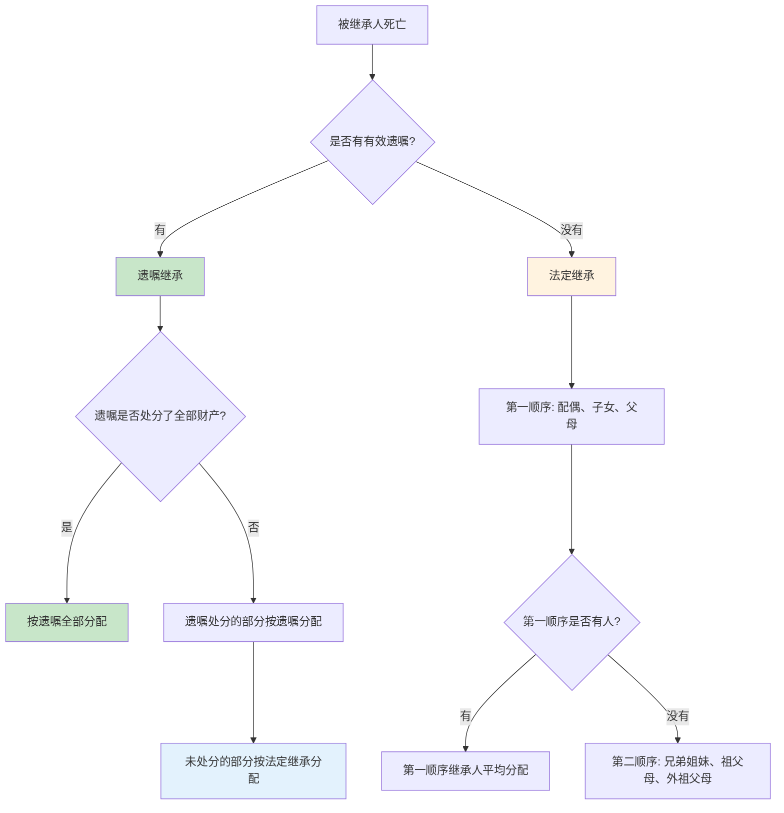
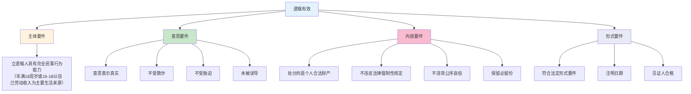
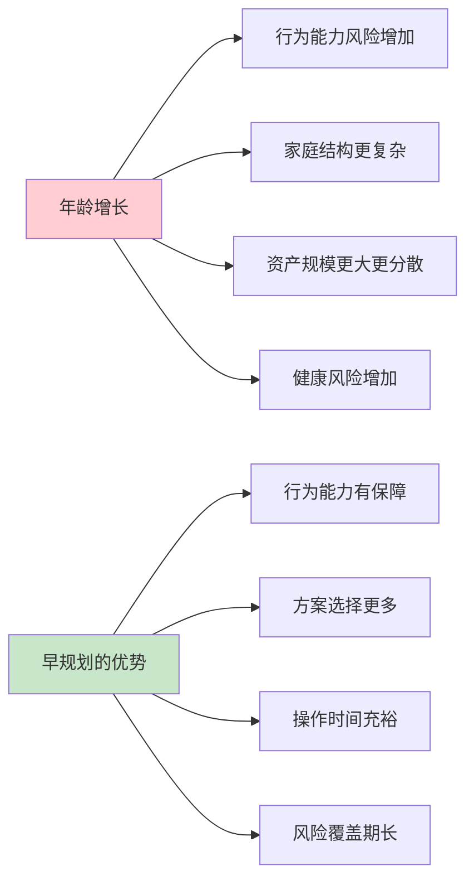
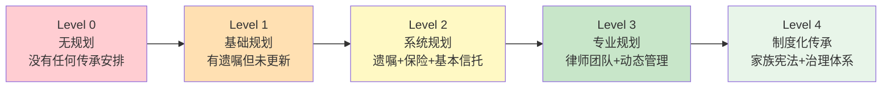

## 二、遗嘱规划的理论框架

遗嘱是所有传承工具中最基础、门槛最低、也最容易被忽视的一个。一份合法有效的遗嘱，可以让财产按照你的意愿分配；一份有瑕疵的遗嘱，可能让家人对簿公堂、反目成仇。理解遗嘱规划的理论框架，是整个传承体系的地基。

### 2.1 遗嘱的法律本质

#### 2.1.1 什么是遗嘱

遗嘱是自然人在生前按照法律规定的方式，对其个人财产或其他事务作出处分，并于死亡时发生效力的**单方民事法律行为**。

理解这个定义的每一个关键词：

| 关键词 | 含义 | 实际影响 |
|--------|------|----------|
| 自然人 | 只有自然人能立遗嘱，法人不行 | 公司不能"立遗嘱"安排股权继承 |
| 生前 | 在世时设立，死亡时生效 | 活着时遗嘱不产生财产转移效力 |
| 法律规定的方式 | 必须符合法定形式要件 | 形式不合法=遗嘱无效 |
| 个人财产 | 只能处分自己的财产 | 处分配偶共同财产的份额无效 |
| 单方行为 | 无需他人同意即可设立 | 不需要继承人签字认可 |
| 死亡时生效 | 生前可以随时撤回、修改 | 最后一份有效遗嘱为准 |

#### 2.1.2 遗嘱继承与法定继承的关系

中国继承制度的核心逻辑是**"法定继承为基础，遗嘱继承为优先"**。两者的关系如下：

**关键要点**：遗嘱继承优先于法定继承。这意味着，如果你立了合法有效的遗嘱，即使法定继承人中有你不希望分配的人（在保留必要份额的前提下），也可以按照你的意愿分配。

但遗嘱的优先效力有**两个例外**：

**例外一：必留份制度（特留份/必继份）**

《民法典》第1141条规定："遗嘱应当为缺乏劳动能力又没有生活来源的继承人保留必要的遗产份额。"这就是"双缺人员"的必留份制度。

具体含义：如果法定继承人中有既缺乏劳动能力又没有生活来源的人，遗嘱必须为其保留必要份额，否则该部分遗嘱处分无效。

举例：老王有两个儿子，大儿子是企业高管收入丰厚，小儿子因车祸残疾丧失劳动能力且无收入来源。老王立遗嘱将全部财产给大儿子——这份遗嘱关于小儿子的份额部分无效，小儿子仍然可以获得必要的遗产份额。

**例外二：遗嘱不得规避法定义务**

遗嘱不能用来逃避应当履行的法定义务，比如被继承人的债务、未成年子女的抚养费等。如果遗嘱内容损害了债权人的合法利益，债权人可以申请撤销相关处分。

#### 2.1.3 遗嘱自由的边界

遗嘱自由是现代继承法的基石，但这种自由不是绝对的。中国的遗嘱自由受到以下限制：

| 限制类型 | 法律依据 | 具体内容 |
|----------|----------|----------|
| 必留份限制 | 民法典第1141条 | 必须为"双缺"继承人保留必要份额 |
| 债务清偿义务 | 民法典第1161条 | 继承人需在继承遗产范围内清偿被继承人债务 |
| 共同财产限制 | 民法典第1153条 | 只能处分个人财产份额，夫妻共同财产需先析产 |
| 公序良俗限制 | 民法典第8条 | 遗嘱内容不得违反公序良俗 |
| 胎儿保留份 | 民法典第16条、第1155条 | 遗产分割时应为胎儿保留继承份额 |

与部分大陆法系国家的"特留份"制度不同，中国的必留份范围较窄（仅限"双缺人员"），遗嘱自由的空间实际上比较大。这既是优势（你可以更灵活地安排），也是风险（容易因考虑不周而引发家庭矛盾）。

### 2.2 遗嘱的形式体系

《民法典》规定了六种遗嘱形式，每一种都有严格的形式要件。形式要件不满足，即使内容完全反映被继承人的真实意愿，也可能被认定无效。

#### 2.2.1 六种法定遗嘱形式对比

| 遗嘱形式 | 形式要件 | 优点 | 缺点 | 适用场景 |
|----------|----------|------|------|----------|
| **自书遗嘱** | 亲笔书写全文、签名、注明年月日 | 成本最低、保密性强、不易伪造 | 字迹认定可能有争议、缺乏专业指导 | 简单财产分配、紧急情况 |
| **代书遗嘱** | 两个以上见证人、其中一人代书、注明年月日、代书人和见证人签名 | 解决书写困难问题 | 见证人资格要求严格、容易产生代书人引导嫌疑 | 被继承人书写困难 |
| **打印遗嘱** | 两个以上见证人、遗嘱人和见证人在每一页签名并注明年月日 | 清晰规范、易于保存 | 民法典新增形式、实践判例较少 | 遗嘱内容较多或复杂 |
| **录音录像遗嘱** | 两个以上见证人、遗嘱人和见证人记录姓名或肖像及年月日 | 直观真实、能反映精神状态 | 技术要求高、易损坏、保存困难 | 遗嘱人不便书写 |
| **口头遗嘱** | 两个以上见证人、仅在危急情况下可用、危急情况消除后能以其他形式立遗嘱的口头遗嘱无效 | 唯一的紧急遗嘱方式 | 效力最不稳定、仅限危急情况 | 生命垂危、突发事故等紧急情况 |
| **公证遗嘱** | 到公证机构办理公证 | 证明力最强、不易被推翻 | 成本较高、程序繁琐、修改不便 | 高净值人群、复杂财产安排 |

#### 2.2.2 民法典的重大变化：取消公证遗嘱优先效力

**这是理解中国遗嘱制度的关键变化。**

原《继承法》第20条规定："自书、代书、录音、口头遗嘱，不得撤销、变更公证遗嘱。"这意味着公证遗嘱的效力高于其他所有形式——即使你后来写了一份自书遗嘱改变分配方案，只要没有重新公证，就还是以公证遗嘱为准。

这个规定导致了大量实践困境：有的老人行动不便无法去公证处，有的公证处撤了或改了，有的老人弥留之际想改遗嘱但来不及公证——公证遗嘱的"优先效力"反而成了枷锁。

**《民法典》第1142条彻底改变了这个规则**：

> "立有数份遗嘱，内容相抵触的，以最后的遗嘱为准。"

这意味着所有遗嘱形式的效力平等，**只看时间先后，不看形式高低**。最后一份合法有效的遗嘱，可以推翻之前所有的遗嘱，包括公证遗嘱。

**实际影响**：
- 以前：改公证遗嘱必须再去公证——现在：写一份新的自书遗嘱就行
- 以前：公证遗嘱是"保险箱"——现在：所有遗嘱都平等，关键看"最后"
- 以前：公证遗嘱可以"一劳永逸"——现在：任何遗嘱都可能被后来的遗嘱推翻

这对遗嘱规划提出了新要求：**不仅要立遗嘱，还要建立遗嘱管理和更新机制**。

#### 2.2.3 见证人的资格要求

见证人的选择是遗嘱有效性的关键环节。以下人员**不能**作为遗嘱见证人：

1. **无民事行为能力人、限制民事行为能力人以及其他不具有见证能力的人**
   - 精神病人、智力障碍者
   - 不能辨识或控制自己行为的人
   - 盲人（不能见证自书、代书遗嘱的内容）
   - 聋人（不能见证录音录像遗嘱）

2. **继承人、受遗赠人**
   - 直接利害关系人不能作证

3. **与继承人、受遗赠人有利害关系的人**
   - 继承人、受遗赠人的债权人、债务人
   - 继承人、受遗赠人的合伙人、共同经营人
   - 继承人的配偶、直系血亲

**常见错误**：请自己的好友或家族成员作见证人，结果这些人与继承人有利害关系，导致见证无效。正确的做法是请无利害关系的第三方，如律师、邻居、社区工作人员等。

### 2.3 遗嘱效力的认定理论

#### 2.3.1 遗嘱有效的实质要件

一份有效的遗嘱必须同时满足以下实质要件：

#### 2.3.2 遗嘱效力的常见争议类型

根据各级法院的司法实践，遗嘱效力争议主要集中在以下几类：

**第一类：行为能力争议（约占争议案件的25%）**

争议焦点：立遗嘱时是否具有完全民事行为能力。

典型情形：老年人立遗嘱后，继承人中的一方主张立遗嘱时老人已患有老年痴呆、阿尔茨海默症或其他精神疾病，不具备完全民事行为能力。

应对策略：在立遗嘱时进行精神状态评估，取得医疗机构出具的行为能力证明，或由公证处/律师进行面谈记录。

**第二类：意思表示真实性争议（约占争议案件的30%）**

争议焦点：遗嘱是否反映了立遗嘱人的真实意愿。

典型情形：某继承人与被继承人共同生活，其他继承人主张该继承人施加了不当影响（undue influence）；或被继承人晚年受保姆、护工影响改变遗嘱。

应对策略：立遗嘱时录制视频、邀请律师全程参与、避免在特定继承人的陪同下立遗嘱。

**第三类：形式要件瑕疵（约占争议案件的25%）**

争议焦点：遗嘱是否满足法定形式要求。

典型情形：自书遗嘱未注明日期、代书遗嘱见证人人数不足、打印遗嘱未逐页签名、见证人与继承人有利害关系。

应对策略：严格按照法定要件操作，不确定时请律师把关。

**第四类：遗嘱真实性争议（约占争议案件的20%）**

争议焦点：遗嘱是否为被继承人本人所立。

典型情形：遗嘱笔迹真伪争议、遗嘱被篡改、遗嘱系伪造。

应对策略：保留遗嘱人的笔迹样本、进行笔迹鉴定准备、使用不易篡改的保存方式。

#### 2.3.3 遗嘱解释的基本原则

当遗嘱内容存在歧义时，法院会按照以下原则进行解释：

1. **文义解释优先**：按照遗嘱文字的通常含义理解
2. **整体解释**：将遗嘱作为一个整体来理解，不割裂单个条款
3. **目的解释**：结合立遗嘱人的目的和背景来理解
4. **习惯解释**：结合当地语言习惯和社会习俗
5. **不利于遗嘱起草人解释**：在代书遗嘱等由他人起草的情况下，如有歧义，作出不利于起草人的解释

### 2.4 遗嘱规划的核心理论

#### 2.4.1 遗嘱规划的定义与范围

遗嘱规划（Will Planning / Estate Planning）不仅仅是"写一份遗嘱"这么简单。它是以遗嘱为核心，结合其他法律工具，对个人和家庭财富进行系统性安排的全过程。

遗嘱规划包括但不限于：

| 规划维度 | 具体内容 | 涉及工具 |
|----------|----------|----------|
| 财产分配 | 谁得什么、得多少、何时得 | 遗嘱、赠与协议 |
| 税务筹划 | 如何降低继承环节的税负 | 遗嘱+信托+保险组合 |
| 企业传承 | 股权如何交接、经营权如何过渡 | 遗嘱+持股平台+章程 |
| 监护安排 | 未成年子女由谁监护 | 遗嘱指定监护人 |
| 债务安排 | 遗产如何处理债务 | 遗嘱+保险（隔离债务） |
| 慈善安排 | 遗产捐赠公益事业 | 遗嘱+慈善信托 |
| 数字遗产 | 网络资产如何处理 | 遗嘱+数字遗产清单 |

#### 2.4.2 遗嘱规划的三大理论基础

**理论一：意思自治原则**

意思自治是民法的基本原则，体现在继承领域就是遗嘱自由——自然人有权按照自己的意愿处分个人财产，决定身后事的安排。

这一原则的理论基础来源于两个方面：

- **自然权利理论**：个人对其合法财产享有处分权，这种权利不应因死亡而被剥夺
- **功利主义理论**：允许财产所有人自主决定遗产分配，有利于激励财富创造、促进社会效率

在中国法律体系中，意思自治原则体现为《民法典》第1133条："自然人可以依照本法规定立遗嘱处分个人财产，并可以指定遗嘱执行人。"

**理论二：遗产的家庭保障功能**

遗嘱自由不是绝对的。现代继承法认为，遗产不仅是个人财产，还承载着家庭保障功能。被继承人对家庭成员（尤其是配偶、未成年子女、丧失劳动能力的子女）负有法定的扶养义务，这种义务不因死亡而消灭。

这一理论的制度体现包括：
- 必留份制度：保护"双缺"继承人的基本生存权
- 遗产管理人制度：确保遗产得到妥善管理和分配
- 遗产债务清偿顺序：先满足家庭成员的生活需要，再偿还其他债务

**理论三：财富代际转移效率理论**

从经济学角度看，遗嘱规划的核心目标是提高财富代际转移的效率——减少转移过程中的损耗（税费、诉讼成本、管理费用），确保财富按照最优方式配置给下一代。

效率损失的三个来源：

| 损耗来源 | 表现形式 | 降低手段 |
|----------|----------|----------|
| 法律损耗 | 遗嘱无效导致的诉讼成本、时间成本 | 专业法律服务、严格遵循形式要件 |
| 税务损耗 | 遗产税、赠与税、过户税费 | 提前规划、利用税收优惠工具 |
| 管理损耗 | 遗产管理不善导致的资产贬值 | 指定专业遗产管理人、设立信托 |

#### 2.4.3 遗嘱规划的时间价值理论

遗嘱规划具有显著的时间价值——越早规划，效果越好。这个理论可以从三个维度理解：

**维度一：法律确定性**

早立遗嘱可以在立遗嘱人意识清醒、行为能力完整时完成，减少日后被质疑的风险。随着年龄增长，行为能力争议的可能性会显著增加。

**维度二：方案灵活性**

早规划意味着更多的可选工具和更大的操作空间。比如将资产装入信托需要时间完成资产过户和税务处理；大额保险需要较长时间的核保流程；企业股权的安排需要与公司章程、合伙协议等协调一致。

**维度三：风险覆盖期**

遗嘱规划的价值在于应对不确定性——而不确定性随时可能发生。早一天规划，就多一天的风险覆盖。

### 2.5 遗嘱执行的理论框架

#### 2.5.1 遗嘱执行人制度

遗嘱执行人是遗嘱规划中经常被忽略但极其重要的角色。《民法典》第1145-1149条规定了遗产管理人制度，其中遗嘱执行人是遗产管理人的首要人选。

遗嘱执行人的职责：

| 职责 | 具体内容 |
|------|----------|
| 清理遗产 | 查明被继承人的全部财产、债权、债务 |
| 制作遗产清单 | 编制详细的遗产目录并通知继承人 |
| 管理遗产 | 在分配前妥善保管和管理遗产 |
| 处理债权债务 | 收取债权、清偿债务 |
| 按遗嘱分配 | 按照遗嘱的内容将遗产分配给各继承人 |
| 诉讼代理 | 代表遗产参与相关诉讼 |

**谁适合做遗嘱执行人？**

| 人选类型 | 优点 | 缺点 |
|----------|------|------|
| 信任的家庭成员 | 了解家族情况、沟通成本低 | 可能有利益冲突、可能缺乏专业能力 |
| 律师 | 专业能力强、立场中立 | 费用较高、不完全了解家族情况 |
| 信托公司 | 专业管理、持续服务 | 门槛高、费用高 |
| 遗嘱保管机构 | 中立、安全 | 执行能力有限 |

最佳实践：对于简单家庭结构，可以指定一位可信赖的家庭成员和一位律师共同执行；对于复杂情况（再婚家庭、多子女家庭、企业主），建议委托专业机构执行。

#### 2.5.2 遗产管理人制度

《民法典》新增了遗产管理人制度（第1145-1149条），这是中国继承法的重大进步。

**遗产管理人的产生顺序**：

1. 遗嘱指定了执行人的，该执行人为遗产管理人
2. 继承人应当及时推选遗产管理人
3. 继承人未推选的，由继承人共同担任遗产管理人
4. 无继承人或继承人均放弃继承的，由被继承人生前住所地的民政部门或村民委员会担任遗产管理人

**遗产管理人的法定义务**：

- 清理遗产并制作遗产清单
- 向继承人报告遗产情况
- 采取必要措施防止遗产毁损、灭失
- 处理被继承人的债权债务
- 按照遗嘱或法律规定分割遗产
- 实施与管理遗产有关的其他必要行为

**遗产管理人的民事责任**：

遗产管理人因故意或重大过失造成继承人、受遗赠人、债权人损害的，应当承担民事责任。这意味着遗产管理人不是"免费义务"，而是有法律约束的职业角色。

### 2.6 遗嘱规划的国际比较

#### 2.6.1 主要法系的遗嘱制度对比

不同法系对遗嘱自由的态度差异很大，理解这种差异有助于跨国资产的传承规划。

| 对比维度 | 中国大陆 | 英美法系 | 法国/德国 | 日本 |
|----------|----------|----------|-----------|------|
| 遗嘱自由度 | 较高（必留份范围窄） | 最高（几乎完全自由） | 较低（特留份严格） | 中等（留份制度） |
| 特留份范围 | "双缺"继承人 | 基本无特留份 | 配偶+直系血亲（占遗产1/2至3/4） | 配偶+直系血亲（占遗产1/2至2/3） |
| 遗嘱形式 | 六种法定形式 | 多种灵活形式 | 严格形式要求 | 严格形式要求 |
| 遗嘱执行 | 遗产管理人制度 | 个人代表/遗嘱执行人 | 遗嘱执行人 | 遗嘱执行人 |
| 信托整合 | 可结合但不普遍 | 高度整合 | 有限整合 | 可结合 |

#### 2.6.2 跨境遗嘱规划的特殊考量

随着全球化深入，越来越多的家庭拥有境外资产。跨境遗嘱规划需要特别注意：

**第一，遗嘱的法律适用**

中国《涉外民事关系法律适用法》第31-35条规定：
- 法定继承：不动产适用不动产所在地法律，动产适用被继承人死亡时经常居所地法律
- 遗嘱方式：符合遗嘱人立遗嘱时或死亡时的经常居所地法律、国籍国法律或遗嘱行为地法律之一的，遗嘱即为成立
- 遗嘱效力：适用遗嘱人立遗嘱时或死亡时的经常居所地法律或国籍国法律

**第二，多份遗嘱的协调**

如果在不同国家持有资产，可能需要分别设立遗嘱。关键原则：
- 每份遗嘱明确限定适用的资产范围
- 避免不同遗嘱之间的内容冲突
- 聘请各相关法域的律师分别审核

**第三，遗产税的跨境影响**

不同国家的遗产税制度差异巨大：

| 国家/地区 | 遗产税/继承税 | 最高税率 | 免税额度 |
|-----------|--------------|----------|----------|
| 美国 | 遗产税 | 40% | 约1292万美元（2023年） |
| 英国 | 遗产税 | 40% | 32.5万英镑 |
| 日本 | 继承税 | 55% | 3000万日元+600万×法定继承人数 |
| 德国 | 继承税 | 50% | 20万-50万欧元（视关系而定） |
| 中国香港 | 无 | 0% | — |
| 新加坡 | 无（2008年取消） | 0% | — |
| 中国大陆 | 无（尚未开征） | — | — |

### 2.7 遗嘱规划的风险评估框架

#### 2.7.1 家庭风险矩阵

遗嘱规划前，需要系统评估家庭面临的风险。以下是核心风险矩阵：

| 风险类型 | 风险因素 | 风险等级 | 应对工具 |
|----------|----------|----------|----------|
| 婚姻风险 | 子女离婚导致财产外流 | 高 | 遗嘱+赠与协议+婚前协议 |
| 债务风险 | 继承人以遗产偿还被继承人债务 | 中高 | 保险（受益人非遗产）+信托 |
| 争产风险 | 多个继承人争夺遗产 | 高 | 明确遗嘱+分配理由说明 |
| 代持风险 | 代持人不配合或反悔 | 高 | 尽快过户到自己名下或设立信托 |
| 能力风险 | 继承人挥霍或经营不善 | 中 | 信托+附条件分配 |
| 税务风险 | 未来开征遗产税 | 中 | 提前赠与+保险+信托 |
| 意外风险 | 突发意外导致无遗嘱 | 高 | 立即设立遗嘱 |

#### 2.7.2 遗嘱规划的成熟度模型

一个家庭的遗嘱规划成熟度可以分为五个等级：

**Level 0——无规划（约70%的中国家庭）**：完全没有考虑过传承问题，或者认为"等以后再说"。这是最危险的状态。

**Level 1——基础规划（约20%的中国家庭）**：立过遗嘱，但可能形式不规范、内容不完整、从未更新。

**Level 2——系统规划（约8%的中国家庭）**：有遗嘱+保险+基本信托的组合方案，能够覆盖主要风险。

**Level 3——专业规划（约1.5%的中国家庭）**：有专业律师团队持续服务，定期审查和更新方案，覆盖境内境外资产。

**Level 4——制度化传承（约0.5%的中国家庭）**：建立了家族宪法、家族委员会、家族办公室等制度化治理体系，传承不依赖个人意志。

### 2.8 中国遗嘱实践的现状与趋势

#### 2.8.1 当前遗嘱实践的关键数据

| 指标 | 数据 | 说明 |
|------|------|------|
| 高净值人群立遗嘱比例 | 不足10% | 招商银行私人财富报告 |
| 中华遗嘱库登记遗嘱数 | 超过30万份（截至2024年） | 中国老龄事业基金会 |
| 遗嘱纠纷案件数 | 持续增长 | 各级人民法院 |
| 最常见遗嘱形式 | 自书遗嘱（约占60%） | 司法实践统计 |
| 遗嘱被认定无效的比例 | 约30-40% | 法院公开数据 |
| 平均遗嘱订立年龄 | 约70岁 | 中华遗嘱库 |

#### 2.8.2 遗嘱无效的主要原因

根据法院判例统计，遗嘱被认定无效的主要原因及占比：

| 无效原因 | 占比 | 典型案例 |
|----------|------|----------|
| 形式要件不满足 | 约35% | 自书遗嘱未注明年月日、代书遗嘱见证人不足 |
| 意思表示不真实 | 约25% | 被认定受胁迫或欺骗 |
| 无行为能力 | 约20% | 立遗嘱时已患精神疾病 |
| 处分他人财产 | 约15% | 将夫妻共同财产全部处分 |
| 违反必留份 | 约5% | 未为"双缺"继承人保留必要份额 |

#### 2.8.3 遗嘱规划的发展趋势

**趋势一：遗嘱意识加速觉醒**

中华遗嘱库的登记量从2013年创立初期的几百份增长到近年来的每年数万份，说明中国人的遗嘱意识正在快速提升。但相对于总人口，立遗嘱的比例仍然极低。

**趋势二：遗嘱形式日趋多样**

民法典新增打印遗嘱和录音录像遗嘱形式后，这两种遗嘱形式的使用率快速上升。数字化遗嘱（如通过专业平台设立的电子遗嘱）也在探索中。

**趋势三：遗嘱与其他工具的组合使用**

单纯的遗嘱正在被"遗嘱+保险+信托"的组合方案所替代。越来越多的人认识到，遗嘱只是传承工具箱中的一件工具，需要与其他工具配合使用才能发挥最大效果。

**趋势四：专业化程度提升**

从自己手写遗嘱到委托律师起草、从简单分配到系统性规划，遗嘱规划正在从"DIY时代"走向"专业化时代"。

### 2.9 本节小结

遗嘱规划的理论框架可以浓缩为以下核心认知：

**认知一：遗嘱是传承的基础，但不是全部。** 遗嘱解决的是"谁得什么"的问题，但无法解决资产隔离、专业管理、税务筹划等更高层次的需求。它是基础层工具，需要与保险、信托等工具组合使用。

**认知二：形式合法是第一要务。** 中国法院约30-40%的遗嘱被认定无效，其中形式要件不满足是最大的原因。一份形式完美的简单遗嘱，胜过一份内容丰富但形式有瑕疵的复杂遗嘱。

**认知三：民法典带来了重要变化。** 取消公证遗嘱优先效力、新增打印遗嘱形式、建立遗产管理人制度——这些变化直接影响遗嘱规划的策略。

**认知四：遗嘱规划要尽早开始。** 遗嘱规划的时间价值理论告诉我们，越早规划，法律确定性越高、方案灵活性越大、风险覆盖期越长。

**认知五：跨境资产需要特别安排。** 随着全球化深入，拥有境外资产的家庭需要特别注意法律适用、多遗嘱协调和遗产税影响。

**下一节预告**：理解了遗嘱规划的理论框架后，我们将进入家族信托的理论基础——当遗嘱无法满足你的传承需求时，信托如何提供更强大的解决方案。

***
