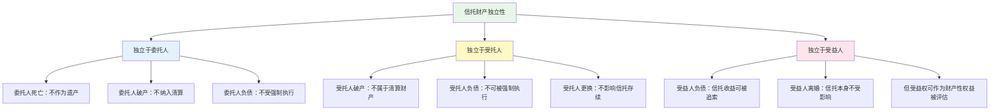
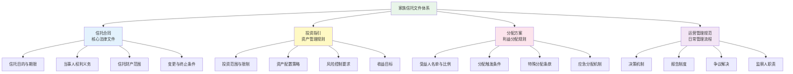
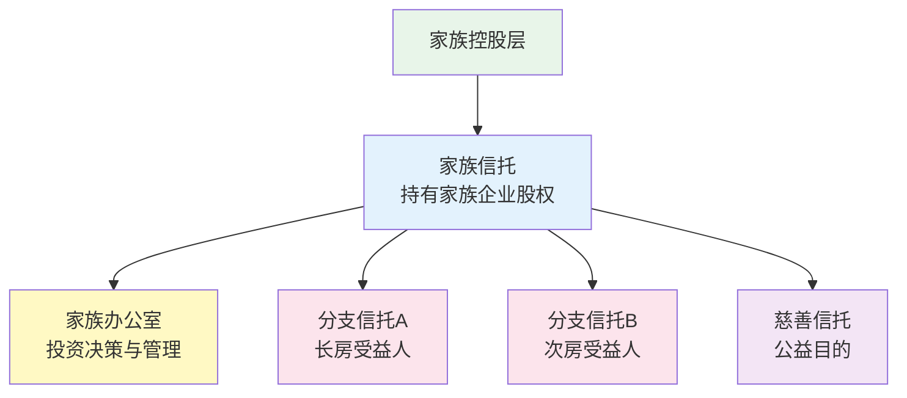

## 三、家族信托的理论基础

家族信托是当代财富传承体系中最具法律深度和制度优势的工具。要真正理解并善用家族信托，不能停留在"把钱交给信托公司"这个表面认知上，而需要从信托的法律本质、制度设计原理、中国本土化实践三个维度建立完整的知识框架。

### 3.1 信托制度的起源与演进

#### 3.1.1 中世纪英国的"用益制度"

信托的雏形诞生于13世纪的英国。当时英国法律规定土地只能由长子继承，且不得随意转让。为了规避这些限制，土地所有人开始采用"用益"（Use）安排：将土地转让给一个受信任的人（Feoffee to Uses），由其为指定受益人的利益持有和管理土地。

这种安排的核心创新在于**所有权的双重分离**——法律上的所有权（Legal Title）归受托人，实质上的受益权（Beneficial Interest）归受益人。这一制度设计突破了封建土地法的僵化限制，使得财产的管理和收益可以按照所有人的意愿灵活配置。

1535年，英国议会颁布《用益法》（Statute of Uses），试图将用益制度纳入法律框架。但法院随后通过"信托"（Trust）概念绕开了该法案的限制，现代信托制度由此正式成形。

#### 3.1.2 从英美法系到全球扩展

信托制度在英美法系国家发展最为成熟，形成了完整的法律体系：

| 国家/地区 | 信托法特点 | 家族信托发展程度 |
|-----------|-----------|----------------|
| 英国 | 信托法的发源地，判例法体系完善 | 历史最悠久，经验丰富 |
| 美国 | 各州信托法不同，特拉华州最为灵活 | 全球最发达，品种最多 |
| 新加坡 | 《受托人法》+灵活的信托架构 | 亚洲家族信托中心 |
| 中国香港 | 继承英国信托法，本地化完善 | 高净值人群首选地之一 |
| 开曼群岛 | 离岸信托法规完善，税收中性 | 国际家族信托热门地 |
| 日本 | 2006年修订信托法，引入目的信托 | 亚洲领先，但文化接受度有限 |

#### 3.1.3 中国信托制度的发展历程

中国信托制度的建立经历了曲折的过程：

- **1979年**：中国国际信托投资公司（中信）成立，标志着中国信托业的起步，但当时主要是融资工具而非财富管理工具
- **2001年**：《中华人民共和国信托法》正式颁布实施，确立了信托的基本法律框架
- **2014年**：银监会发布《关于信托公司风险监管的指导意见》，明确鼓励信托公司发展家族信托业务
- **2018年**：《关于规范金融机构资产管理业务的指导意见》（资管新规）出台，推动信托业回归本源
- **2023年**：《关于规范信托公司信托业务分类的通知》正式实施，将信托业务重新分为三大类，家族信托归入"资产服务信托"类别，获得明确的政策支持

中国信托法虽然借鉴了英美法系的基本框架，但受限于大陆法系的法律传统，在信托财产登记、税收制度衔接等方面仍有待完善。

### 3.2 信托的法律本质与核心原理

#### 3.2.1 信托财产的独立性原理

这是信托制度最核心的法律原理，也是家族信托具有资产隔离功能的理论基础。

**《信托法》第十五条**规定：信托财产与委托人未设立信托的其他财产相区别。设立信托后，委托人死亡或者依法解散、被依法撤销、被宣告破产时，委托人是唯一受益人的，信托终止，信托财产作为其遗产或者清算财产；委托人不是唯一受益人的，信托存续，信托财产不作为其遗产或者清算财产。

**《信托法》第十六条**规定：信托财产与属于受托人所有的财产（以下简称固有财产）相区别，不得归入受托人的固有财产或者成为固有财产的一部分。受托人死亡或者依法解散、被依法撤销、被宣告破产而终止，信托财产不属于其遗产或者清算财产。

**《信托法》第十七条**规定：除因下列情形之一外，对信托财产不得强制执行：（一）设立信托前债权人已对该信托财产享有优先受偿的权利，并依法行使该权利的；（二）受托人处理信托事务所产生债务，债权人要求清偿该债务的；（三）信托财产本身应担负的税款；（四）法律规定的其他情形。

这三条法律规定共同构建了信托财产独立性的完整框架：



**关键区分**：信托财产独立于三方当事人，但受益人获得的信托分配（即已分配到受益人个人账户的收益）仍属于受益人的固有财产。这意味着信托保护的是"未分配"的资产，而非"已分配"的收益。这一区分在实务中至关重要。

#### 3.2.2 信托的信义义务原理

信义义务（Fiduciary Duty）是信托法律关系的核心约束机制。受托人对受益人负有最高标准的法律义务，具体包括：

**忠实义务（Duty of Loyalty）**：受托人必须将受益人的利益置于自身利益之上，不得利用信托财产为自己或第三方谋取不当利益。在中国法律框架下，信托公司不得将信托财产与其固有财产混同管理，不得利用受托地位进行利益输送。

**审慎义务（Duty of Prudence）**：受托人在管理信托财产时，应当像一个谨慎的人管理自己的事务一样尽职尽责。具体包括：合理的投资分散化、适当的尽职调查、专业的决策过程、定期的绩效评估。

**公平义务（Duty of Impartiality）**：当信托有多个受益人时，受托人必须公平对待所有受益人，不能偏袒某一方。例如，不能为了增加当期收益人的分配而过度侵蚀本金，损害未来受益人的利益。

**信息披露义务（Duty to Inform）**：受托人有义务向受益人定期报告信托的管理情况、财务状况和分配情况。受益人有权了解信托资产的投资组合、收益表现、费用支出等信息。

#### 3.2.3 委托人意愿的尊重与约束

信托的本质是委托人意志的延伸。在法律允许的范围内，委托人可以通过信托文件设定几乎任何合理的分配条件和管理规则。但这种意愿自由并非没有边界：

**合法边界**：信托目的不得违反法律强制性规定或公序良俗。例如，设定"受益人必须违法才能获得分配"的条件是无效的。

**可执行性约束**：分配条件必须具有可操作性。过于模糊或无法验证的条件（如"受益人成为一个好人"）可能导致信托执行困难。

**受益人保护**：即使委托人有极大的意愿自由，法律也对受益人的基本权益提供保护。信托条款不能完全剥夺受益人的生存保障。

#### 3.2.4 衡平法与普通法的双重所有权

信托制度的理论根基在于英美法系中衡平法（Equity）与普通法（Common Law）的并行体系。在信托安排下：

- **普通法上的所有权**：受托人对信托财产拥有法律上的所有权（Legal Ownership），可以以自己的名义持有、管理、处分信托财产
- **衡平法上的所有权**：受益人对信托财产拥有衡平法上的权益（Equitable Interest），有权要求受托人按照信托文件管理和分配财产

这种双重所有权结构是信托区别于委托代理、行纪等其他财产管理制度的根本特征。在大陆法系国家（包括中国），由于不存在衡平法传统，法律通过特别立法的方式确立了信托财产的独立地位，但理论基础上仍与英美法系存在差异。

### 3.3 家族信托的基本结构详解

#### 3.3.1 三方当事人

**委托人（Settlor/Grantor）**

委托人是信托的设立者和资产来源方。在家族信托中，委托人通常是家族财富的主要创造者。委托人的核心权利包括：

- 设定信托目的、分配条件和管理规则
- 在可撤销信托中保留修改和撤销信托的权利
- 在部分信托架构中保留投资决策权或否决权
- 监督受托人的管理行为

在中国大陆的家族信托实务中，委托人通常保留较大的控制权，包括投资建议权、受益人变更权、信托条款修改权等。这与英美法系中"委托人完全退出"的传统模式有所不同，反映了中国高净值人群对控制权的高度关注。

**受托人（Trustee）**

受托人是信托法律关系中的核心执行者。在中国大陆，家族信托的受托人主要是持牌信托公司。受托人的核心职责包括：

| 职责类别 | 具体内容 | 服务标准 |
|---------|---------|---------|
| 资产管理 | 信托资产的投资配置、风险管理 | 实现委托人约定的投资目标 |
| 分配执行 | 按照信托文件的条件向受益人分配收益 | 准确、及时、合规 |
| 合规管理 | 遵守法律法规和信托文件的规定 | 零违规 |
| 信息报告 | 定期向委托人和受益人报告信托状况 | 至少每年一次 |
| 会计核算 | 信托财产的独立记账和核算 | 账目清晰、可审计 |
| 风险控制 | 识别和管理信托运营中的各类风险 | 建立完善的风控体系 |

**受益人（Beneficiary）**

受益人是信托利益的最终享有者。家族信托的受益人设置具有高度灵活性：

- **范围灵活**：可以包括委托人本人、配偶、子女、孙辈、父母、兄弟姐妹，甚至未来的家庭成员
- **层级灵活**：可以设定不同受益人的优先级和分配比例
- **条件灵活**：可以根据受益人的年龄、行为、成就等设定不同的分配条件
- **可变更**：在委托人保留变更权的情况下，受益人可以增减

#### 3.3.2 信托文件体系

一份完整的家族信托文件通常包括以下组成部分：



#### 3.3.3 信托监察人制度

信托监察人（Trust Protector）是家族信托治理中的重要角色。在中国的家族信托实务中，监察人的设置越来越普遍。监察人的主要职能包括：

- **监督受托人**：审查受托人的管理行为是否符合信托文件的要求
- **否决权**：对重大投资决策、分配决策拥有否决权
- **更换受托人**：在受托人不称职或发生利益冲突时，有权提议更换受托人
- **解释条款**：在信托条款存在歧义时，参与解释和裁决
- **协调沟通**：在委托人、受托人、受益人之间发挥桥梁作用

监察人通常由家族信任的专业人士（如家族律师、会计师）或家族中德高望重的成员担任。

### 3.4 家族信托的核心功能深度解析

#### 3.4.1 资产隔离：家族信托最核心的价值

资产隔离是家族信托区别于其他财富管理工具的最根本特征。其法律原理在于信托财产的独立性（详见3.2.1节），在实务中表现为以下三个维度的保护：

**隔离委托人的风险**

当委托人面临债务纠纷、诉讼、破产时，已合法转入信托的资产原则上不受影响。但需要注意以下例外情形：

- 设立信托前已存在的债务，债权人可以在知道或应当知道信托设立之日起一年内行使撤销权
- 委托人设立信托的目的是为了逃避已知债务，法院可能认定信托无效或可撤销
- 委托人保留了过度的控制权（如随时可取回全部资产），可能导致"虚假信托"的认定

**隔离受益人的风险**

受益人个人的债务、离婚等问题不会直接波及信托资产本身。但受益人的"受益权"（即期待获得信托分配的权利）在法律性质上属于财产性权益，在某些情况下可能被其债权人追索。具体而言：

- 已分配到受益人账户的收益，属于受益人的固有财产，可以被债权人追索
- 受益人未来可能获得的信托分配，在司法实践中存在争议，部分法院认为可以被冻结或执行
- 受益人离婚时，信托本身不作为夫妻共同财产分割，但已获得的分配属于个人财产（或共同财产，取决于分配时间和条件）

**隔离受托人的风险**

信托资产不因受托人自身的债务、破产、死亡而受到影响。即使信托公司被接管或清算，信托资产应被移交给新的受托人，而非被纳入受托人的清算财产。

**资产隔离的实务边界**

资产隔离并非绝对的"防火墙"。以下情况会削弱或丧失隔离效果：

| 风险情形 | 隔离效果 | 应对策略 |
|---------|---------|---------|
| 设立信托时已存在已知债务 | 可能被撤销 | 在无未决债务时尽早设立 |
| 信托设立后短期内破产 | 可能被认定为恶意避债 | 设立与破产之间保持足够时间间隔 |
| 委托人保留过度控制权 | 可能被认定为"虚假信托" | 合理设计权利分配，避免一人独控 |
| 信托目的违反法律或公序良俗 | 信托可能被认定无效 | 确保信托目的合法合规 |
| 信托资产与委托人个人资产混同 | 隔离效果丧失 | 严格区分信托账户与个人账户 |

#### 3.4.2 专业管理：超越个人能力的资产运营

家族信托的专业管理功能体现在多个层面：

**投资管理**

信托公司拥有专业的投资研究团队和丰富的投资渠道，能够实现：

- 大类资产配置：股票、债券、另类投资、海外资产等多元化配置
- 专业投资决策：基于宏观研究、行业分析、公司调研的投资判断
- 风险管理：严格的投资限制、止损机制、流动性管理
- 持续再平衡：根据市场变化和信托目标动态调整资产组合

**受托服务**

信托公司提供的受托服务包括：

- 信托账户管理和会计核算
- 受益人分配的执行和记录
- 税务申报和合规管理
- 信托变更的法律事务处理
- 定期报告和信息披露

**专业顾问整合**

优秀的家族信托会整合多方面的专业顾问资源：

- 法律顾问：信托法律架构设计、合同审查、争议解决
- 税务顾问：税务筹划、申报协助、跨境税务安排
- 投资顾问：定制化投资方案、绩效评估
- 家族治理顾问：家族宪章制定、家族会议组织、接班人培养

#### 3.4.3 灵活分配：实现委托人的个性化意愿

家族信托的分配条款是委托人意志最集中的体现。通过精心设计的分配方案，可以实现远超简单"分钱"的复杂目标：

**教育激励型分配**

```text
分配条款示例：
- 子女就读本科期间：每年分配学费+生活费20万元
- 子女攻读硕士/博士：每年分配学费+生活费25万元
- 子女获得学位证书：一次性奖励50万元
- 子女获得海外名校录取：额外一次性奖励100万元
```

**创业支持型分配**

```text
分配条款示例：
- 子女年满25岁：可申请创业启动金，上限200万元
- 需提交商业计划书并经投资委员会评估
- 首次拨付50%，运营满一年且达到约定指标后拨付剩余50%
- 创业失败不影响未来其他分配权利
```

**生活保障型分配**

```text
分配条款示例：
- 配偶：每月分配生活费5万元，直至终身
- 子女：每月分配生活费2万元，直至年满30岁
- 子女年满30岁后：根据就业和收入情况调整
- 子女失业或收入低于一定标准：恢复基本生活保障
```

**行为约束型分配**

```text
分配条款示例：
- 子女被发现有吸毒、赌博等行为：暂停分配，直至提供戒断证明
- 子女因刑事犯罪被判处有期徒刑：服刑期间暂停分配
- 子女涉及重大诉讼：可申请应急法律费用，上限50万元
```

#### 3.4.4 税务筹划：面向未来的制度性安排

虽然中国目前尚未开征遗产税和赠与税，但家族信托在税务筹划方面的价值不容忽视：

**当前税务优势**

- 信托财产的转移在信托设立环节通常不产生额外的税负（具体取决于资产类型和转移方式）
- 信托收益的税务处理取决于信托类型和受益人身份
- 通过合理的信托架构，可以在一定程度上优化所得税负担

**面向遗产税的前瞻安排**

一旦中国开征遗产税，已合法设立的家族信托可能具有以下税务优势：

- 信托资产在委托人死亡时可能不纳入遗产税的征税范围（取决于法律的具体规定）
- 通过生前逐步将资产装入信托，可以分散资产转移的税务影响
- 信托的持续存续可以避免每一代传承时的遗产税

**国际税务比较**

| 国家/地区 | 遗产税最高税率 | 信托的税务优势 |
|-----------|-------------|-------------|
| 美国 | 40% | 不可撤销信托可有效规避遗产税 |
| 日本 | 55% | 信托可将资产从应税遗产中转移 |
| 英国 | 40% | 信托有专门的税务制度（如周年税） |
| 新加坡 | 0%（已取消） | 无遗产税，信托主要用于资产保护 |
| 中国香港 | 0%（已取消） | 无遗产税，信托用于隔离和管理 |
| 中国 | 未开征 | 提前布局，未来可能享有税务优势 |

#### 3.4.5 隐私保护：信托的隐性价值

相比遗嘱（需要经过继承公证或法院诉讼程序，信息公开度较高），家族信托具有天然的隐私保护优势：

- 信托文件不公开，不需要向公众或政府机构备案（除特定监管要求外）
- 信托分配是受托人的内部操作，不需要公开进行
- 信托资产的具体构成和价值对外界不透明
- 受益人的身份和分配条件受到保密义务的保护

### 3.5 家族信托的主要类型

#### 3.5.1 按可撤销性分类

| 类型 | 特点 | 适用场景 | 隔离效果 |
|------|------|---------|---------|
| **可撤销信托** | 委托人保留修改和撤销的权利 | 希望保留控制权的委托人 | 较弱（因资产仍可被取回） |
| **不可撤销信托** | 设立后委托人原则上不能撤销或修改 | 追求最大资产隔离效果 | 最强 |

在中国大陆的家族信托实务中，绝大多数采用"可撤销信托"的形式，但通过条款设计（如对撤销权的限制条件）来增强隔离效果。

#### 3.5.2 按信托目的分类

**财富保全型信托**

以资产保护和风险隔离为主要目的。适用于面临较高经营风险的企业主、职业风险较高的专业人士等。核心特征是分配条件较为严格，投资策略偏保守。

**财富传承型信托**

以跨代财富传递为主要目的。核心特征是存续期长（通常20年以上甚至永续），分配条件与受益人的生命阶段挂钩，注重长期资产增值。

**慈善信托**

以公益慈善为主要目的。在中国，《慈善法》和《信托法》共同规范慈善信托。慈善信托可以享受税收优惠，且不受信托存续期限的一般限制。

**保险金信托**

将人寿保险的理赔金装入信托。这是近年来在中国快速增长的信托类型，结合了保险的杠杆效应（低保费撬动高保额）和信托的灵活管理功能。最低门槛通常在100万元保额左右，远低于传统家族信托的1000万元门槛。

**股权信托**

将家族企业的股权装入信托。这是家族企业传承的重要工具，可以实现企业控制权与收益权的分离，避免因继承导致的股权分散。

#### 3.5.3 按设立地点分类

| 设立地 | 优势 | 劣势 | 适用人群 |
|--------|------|------|---------|
| 中国大陆 | 法律管辖明确，执行成本低 | 法律体系尚不完善，产品选择有限 | 资产主要在中国大陆的家庭 |
| 中国香港 | 法律体系成熟，国际认可度高 | 设立和维护成本较高 | 有海外资产或国际身份的家庭 |
| 新加坡 | 税收中性，法律体系完善 | 需要满足当地监管要求 | 东南亚关联的高净值家庭 |
| 开曼群岛 | 隐私保护极强，税收中性 | 距离远，沟通成本高 | 大型跨境家族信托 |
| BVI（英属维京群岛） | 设立简便，成本较低 | 法律体系不如开曼成熟 | 中小型离岸信托 |

### 3.6 家族信托的设立条件与门槛

#### 3.6.1 资产门槛

不同信托公司和不同信托类型的最低设立金额差异较大：

| 信托类型 | 最低门槛 | 常见门槛 | 备注 |
|---------|---------|---------|------|
| 家族信托（现金类） | 300万元 | 1000万元 | 部分信托公司已降低门槛 |
| 保险金信托 | 保额100万元 | 保额300万-500万元 | 保费远低于保额 |
| 股权信托 | 视股权价值而定 | 通常1000万元以上 | 估值和过户较为复杂 |
| 慈善信托 | 无统一最低要求 | 通常100万元以上 | 《慈善法》另有规定 |

#### 3.6.2 信托期限

家族信托的期限设置灵活：

- **固定期限型**：设定明确的终止日期，如20年、30年
- **事件触发型**：以特定事件的发生为终止条件，如"最后一个受益人去世"
- **永续型**：不设定终止条件，理论上可以永远存续（需关注法律对信托存续期限的规定）

中国大陆的《信托法》未对信托的最长期限作出明确规定，但实务中信托公司通常将家族信托期限设定为10-50年，部分信托公司支持更长期限。

#### 3.6.3 可装入信托的资产类型

| 资产类型 | 可行性 | 注意事项 |
|---------|--------|---------|
| 现金/银行存款 | ★★★★★ | 最常见、最简便，无过户障碍 |
| 股票/基金/债券 | ★★★★☆ | 需要办理非交易过户，部分品种有限制 |
| 非上市公司股权 | ★★★☆☆ | 需要估值、工商变更，流程较复杂 |
| 不动产 | ★★☆☆☆ | 需要过户登记，可能产生税费，部分城市限购 |
| 艺术品/收藏品 | ★★☆☆☆ | 估值困难，保管条件要求高 |
| 保险权益 | ★★★★☆ | 通过保险金信托模式实现 |
| 知识产权 | ★★☆☆☆ | 估值和管理较为特殊 |
| 海外资产 | ★☆☆☆☆ | 涉及外汇管制和跨境法律问题 |

### 3.7 家族信托与其他传承工具的对比

#### 3.7.1 家族信托 vs 遗嘱

| 对比维度 | 家族信托 | 遗嘱 |
|---------|---------|------|
| 生效时间 | 设立即生效 | 被继承人死亡时生效 |
| 资产隔离 | 强（财产独立性） | 无（遗产属于继承人） |
| 分配灵活性 | 极高（可设定复杂条件） | 低（一次性转移） |
| 隐私保护 | 强（不公开） | 弱（需公证或诉讼，信息公开度高） |
| 执行效率 | 高（受托人直接执行） | 低（可能需要继承公证或诉讼） |
| 设立成本 | 高（设立费+管理费） | 低（几乎零成本） |
| 门槛 | 高（数百万起） | 无门槛 |
| 可撤销性 | 可撤销或不可撤销 | 可随时修改或撤销 |
| 债务隔离 | 强（信托资产独立） | 无（遗产先清偿债务后分配） |

#### 3.7.2 家族信托 vs 大额人寿保险

| 对比维度 | 家族信托 | 大额人寿保险 |
|---------|---------|------------|
| 功能定位 | 综合性财富管理与传承 | 定额传承保障 |
| 杠杆效应 | 无（按资产实际价值管理） | 有（低保费撬动高保额） |
| 分配灵活性 | 极高 | 低（一次性或分期给付保险金） |
| 资产范围 | 可装入多种资产 | 仅限保险理赔金 |
| 最低门槛 | 300万-1000万元 | 年缴数千元起 |
| 理赔确定性 | 取决于投资表现 | 确定（保额固定） |
| 税务处理 | 复杂 | 保险理赔金通常免税 |
| 设立周期 | 较长（1-3个月） | 较短（核保通过即可） |

#### 3.7.3 家族信托 vs 代持

在实践中，许多中国高净值人群使用"代持"（将资产登记在信任的人名下）来实现资产保护和隐私目的。但代持存在重大法律风险：

| 对比维度 | 家族信托 | 代持 |
|---------|---------|------|
| 法律保障 | 受《信托法》保护 | 主要靠代持协议，法律保障较弱 |
| 代持人风险 | 受托人受信义义务约束 | 代持人可能反悔、死亡、离婚、负债 |
| 第三人对抗 | 信托财产独立性有明确法律依据 | 代持人名下的资产可能被其债权人追索 |
| 税务风险 | 相对明确 | 代持人处置资产可能产生税务争议 |
| 成本 | 较高 | 较低（无管理费） |
| 专业性 | 由专业机构管理 | 依赖个人信任关系 |

**结论**：代持是一种"穷人版信托"，在法律保障、风险控制方面远不如正式的家族信托。对于资产规模达到一定水平的家庭，应优先选择家族信托而非代持。

### 3.8 家族信托在中国的法律环境

#### 3.8.1 核心法律依据

| 法律法规 | 相关内容 | 关键条文 |
|---------|---------|---------|
| 《信托法》（2001年） | 信托的基本法律框架 | 第15-17条（信托财产独立性） |
| 《民法典》（2021年） | 婚姻家庭编、继承编 | 第1062-1063条（夫妻财产） |
| 《信托公司管理办法》 | 信托公司的设立和运营 | 受托人资质和义务 |
| 《关于规范信托公司信托业务分类的通知》 | 信托业务三分类 | 家族信托归入资产服务信托 |
| 《慈善法》（2016年） | 慈善信托的设立和管理 | 第44-50条 |

#### 3.8.2 监管环境的变化趋势

中国家族信托的监管环境正在朝着更加规范和支持的方向发展：

- **业务分类明确**：2023年的信托业务三分类政策，将家族信托明确归入"资产服务信托"，为其发展提供了清晰的政策定位
- **门槛逐步降低**：部分信托公司已将家族信托的最低门槛从1000万元降至300万元，甚至更低
- **配套制度完善**：信托登记制度、税收制度等配套制度正在逐步建立
- **司法实践丰富**：越来越多的信托纠纷案件进入司法程序，为信托制度的完善提供了实践基础

#### 3.8.3 信托登记制度的现状与展望

信托登记是确保信托财产独立性的重要制度安排。理想状态下，信托财产应进行登记公示，以对抗第三人。但中国的信托登记制度尚不完善：

- **不动产**：目前尚无专门的信托不动产登记制度，实务中通过过户登记实现，但可能产生税费
- **股权**：工商变更登记可以实现股权信托的公示效果
- **金融资产**：通过在中国信托登记有限责任公司（中信登）进行登记
- **动产**：缺乏统一的信托登记制度

未来随着信托登记制度的完善，家族信托的资产隔离效果将更加确定和可预期。

### 3.9 常见认知误区与澄清

#### 误区一："家族信托就是把钱交给别人管"

**澄清**：家族信托是一种法律架构，而不仅仅是一种投资管理服务。信托的核心价值在于资产隔离和意愿实现，投资管理只是其中一个功能。委托人可以通过信托文件保留重大决策的参与权，并非完全放弃控制。

#### 误区二："设立信托就能完全避债"

**澄清**：信托的资产隔离效果有严格的法律前提。如果设立信托的目的是逃避已知债务，或者设立时间与债务产生时间过于接近，法院有权撤销信托。信托是合法的资产保护工具，而非逃债工具。

#### 误区三："家族信托太贵，只有超级富豪才用得起"

**澄清**：随着保险金信托等创新产品的出现，家族信托的门槛已大幅降低。保险金信托的保额门槛可低至100万元，对应的实际保费可能只有几万元。对于年收入30万以上的家庭，保险金信托已是一种可负担的传承工具。

#### 误区四："信托一旦设立就完全无法改变"

**澄清**：这取决于信托的类型。可撤销信托允许委托人在生前修改甚至撤销信托。即使是不可撤销信托，也可以通过信托保护人（Trust Protector）的权力来适应变化的情况。此外，许多信托文件中都包含"变更条款"，允许在特定条件下对信托进行调整。

#### 误区五："中国法律不保护信托，设立信托没有用"

**澄清**：中国《信托法》已实施二十余年，信托财产独立性的法律原则在司法实践中得到了越来越多的认可。虽然中国的信托法律环境不如英美法系国家成熟，但合法设立的家族信托确实具有法律效力和保护功能。

### 3.10 进阶专题：信托架构的高级设计

#### 3.10.1 多层信托架构

对于资产规模较大、家庭结构复杂的家族，可以采用多层信托架构：



这种架构的优势在于：既保持了家族资产的整体性（通过顶层信托持有股权），又实现了各房利益的独立管理（通过分支信托分别运营），同时还能兼顾社会公益（通过慈善信托）。

#### 3.10.2 条件分配的精细化设计

高级信托的分配条款通常采用"基础保障+激励引导"的双层设计：

**基础保障层**：确保每位受益人的基本生活需求得到满足，不受其个人经济状况影响。这部分分配通常是无条件的或条件极低的。

**激励引导层**：通过设定与受益人行为、成就挂钩的分配条件，引导受益人积极向上。例如：

- 学业成就奖励：获得学位、通过职业资格考试等
- 事业发展支持：就业满一定年限、创业达到一定规模等
- 家庭责任鼓励：结婚、生育等家庭责任的承担
- 公益参与奖励：参与慈善活动、社区服务等

#### 3.10.3 信托与公司治理的结合

对于持有家族企业股权的信托，需要将信托治理与公司治理有机结合：

- 在信托文件中明确受托人作为股东在公司治理中的角色和权限
- 设定重大事项（如股权转让、对外担保、高管任命）的决策机制
- 建立受托人与家族成员之间的信息沟通机制
- 设定利润分配政策，确保信托能够持续获得收益分配

### 3.11 本节小结

家族信托的理论基础建立在财产独立性、信义义务、衡平法传统三大支柱之上。理解这些理论，不是为了学术研究，而是为了在设立信托时做出正确的决策——选择合适的信托类型、设计合理的信托架构、设定有效的分配条款、预见并规避潜在的法律风险。

**核心要点回顾**：

1. **信托的本质**是所有权与受益权的分离，这一制度设计赋予了信托独特的资产隔离功能
2. **信托财产独立性**是家族信托最核心的法律特征，但其效果有边界和前提条件
3. **信义义务**是约束受托人行为的核心法律机制，确保受托人忠实、审慎地为受益人服务
4. **家族信托不是万能的**，需要与遗嘱、保险等工具组合使用，形成完整的传承体系
5. **中国家族信托市场**正处于快速发展期，法律环境不断完善，门槛逐步降低，适用范围越来越广
6. **越早设立越好**——信托的隔离效果需要时间积累，临时设立的信托可能面临被撤销的风险

理解了理论基础之后，下一节将进入实操层面，讲解如何搭建一个具体的家族信托。
