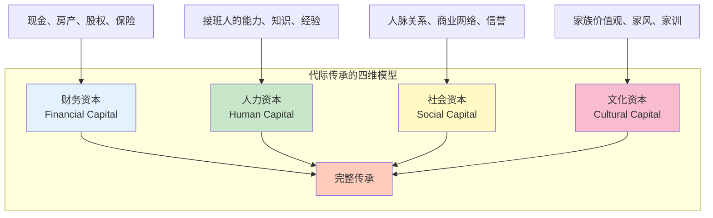
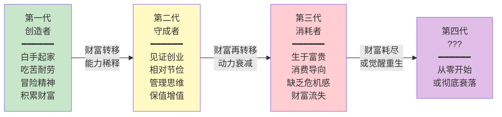
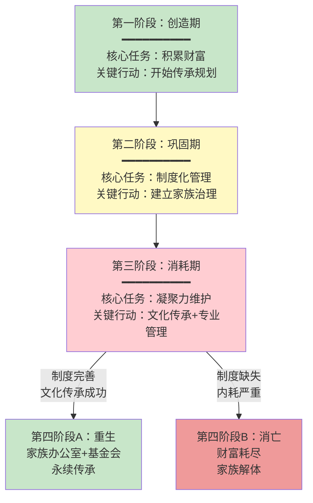
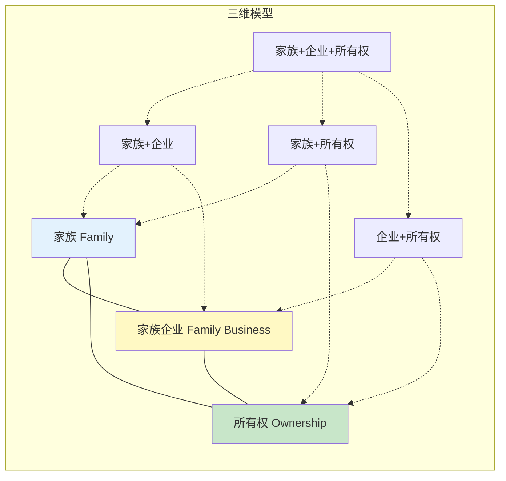
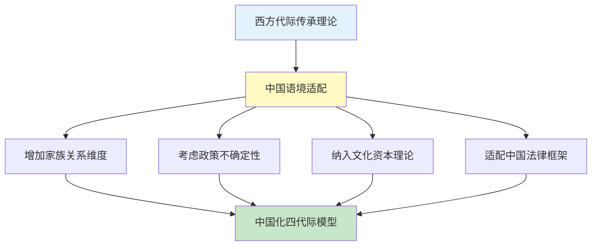
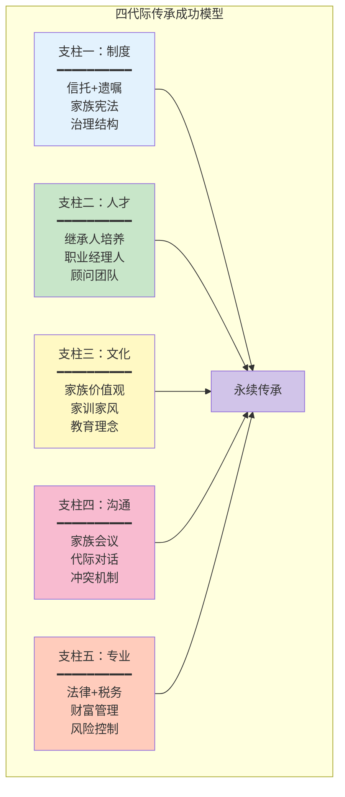

## 四、代际传承的理论框架

"富不过三代"是一句流传千年的俗语，但它背后有坚实的理论支撑。要打破这个魔咒，首先需要理解财富为什么会流失、在哪个环节流失、以及哪些理论模型能帮助我们系统性地规划跨代传承。本节将建立一个完整的代际传承理论框架，为后续的工具选择和实操方案奠定理论基础。

### 4.1 代际传承的本质：不只是"给钱"

#### 4.1.1 传承的四个维度

很多人把传承简单理解为"把钱留给下一代"，这是一个根本性的认知错误。代际传承（Intergenerational Wealth Transfer）是一个多维度的系统工程，至少包含以下四个层面：

**财务资本**（Financial Capital）：现金、不动产、股权、有价证券、保险权益、数字资产等可以直接货币化的资产。这是大多数人眼中"传承"的全部，但实际上只是冰山一角。

**人力资本**（Human Capital）：继承人自身的知识、能力、判断力和领导力。一个有能力的继承人可以从零开始创造财富；一个无能的继承人可以迅速败光亿万家产。洛克菲勒家族的约翰·D·洛克菲勒二世曾说："我给孩子们留下足够的钱让他们做任何事，但不够让他们什么都不做。"这句话精准地指出了人力资本比财务资本更重要。

**社会资本**（Social Capital）：家族积累的人脉网络、商业关系、行业信誉和社会影响力。这些"关系"虽然无法精确估值，但往往是家族企业持续经营的核心资源。一个企业主去世后，他积累了几十年的政商关系可能在一夜之间断裂——这不是金钱能解决的问题。

**文化资本**（Cultural Capital）：家族的价值观、行为准则、教育理念、家族传统和精神遗产。这是最无形却最持久的传承要素。日本有句谚语："三代才能培养一个贵族"，说的就是文化资本的积累需要时间。

#### 4.1.2 四个维度的代际衰减规律

不同维度的资本在代际传递中的衰减速度截然不同：

| 传承维度 | 第一代→第二代 | 第二代→第三代 | 第三代→第四代 | 关键影响因素 |
|----------|--------------|--------------|--------------|------------|
| 财务资本 | 保留约70% | 保留约40% | 保留约15% | 资产管理能力、市场环境 |
| 人力资本 | 保留约50% | 保留约30% | 保留约20% | 教育培养、实践锻炼 |
| 社会资本 | 保留约60% | 保留约35% | 保留约15% | 关系维护、行业变迁 |
| 文化资本 | 保留约80% | 保留约60% | 保留约45% | 家族治理、家训传承 |

文化资本的衰减最慢，因为价值观和行为准则一旦内化，会通过家庭教育自然传递。财务资本的衰减最快，因为它最容易被稀释（多子女分割）、消耗（高消费生活）和损失（投资失败）。这解释了为什么有些家族虽然失去了财富，但几代后仍能东山再起——他们传承下来的是文化资本和人力资本。

### 4.2 "富不过三代"的理论解释

#### 4.2.1 三代消亡的经典模型

"富不过三代"并非中国独有的现象。全球各文化都有类似的说法：

- **中国**："富不过三代"
- **英国**："Shirtsleeves to shirtsleeves in three generations"（从卷袖子干活到卷袖子干活）
- **意大利**："Dalle stalle alle stalle"（从马厩到马厩）
- **日本**："三つで𝘐𝘧衰える"（三代而衰）
- **西班牙**："Quien no lo tiene, lo ha; quien lo tiene, lo pierde"（没有的人得到它，有的人失去它）

这种跨文化的共识说明，三代消亡有其内在的规律性，而非某个文化特有的现象。学术界对此提出了多种解释模型：

#### 4.2.2 五种主流理论解释

**理论一：能力-财富错配理论（Ability-Wealth Mismatch）**

这是最直觉的解释。第一代创造财富靠的是超出常人的能力、意志力和判断力。但这些能力并非遗传的——第二代可能有60%的基因相似性，但面对的挑战环境完全不同。到第三代，财富规模可能已经远超继承人的管理能力。

核心公式：**传承成功率 = 继承人能力 ÷ 财富管理复杂度**

当这个比值小于1时，财富流失就成为必然。因此，提升传承成功率有两条路：提升继承人能力（教育培训），或降低财富管理复杂度（制度化、专业化管理）。

**理论二：激励衰减理论（Motivation Decay）**

哈佛商学院教授约翰·戴维斯（John Davis）的研究表明，家族企业的代际传承面临一个"激励悖论"：创造财富的动力来自于对贫困的恐惧和对成功的渴望，而继承者从小生活在富足环境中，缺乏这种原动力。

心理学中的"享乐适应"（Hedonic Adaptation）理论也支持这一观点：当一个人从小习惯了高水平的生活，他就不会把这种生活视为"成功"的奖赏，而视为"理所当然"的基线。这种心态差异是代际衰减的深层心理机制。

**理论三：代理问题理论（Agency Problem）**

在企业治理理论中，当所有权和经营权分离时，就会产生代理人（经营者）与委托人（所有者）之间的利益冲突。在家族传承中，这个问题以一种变体形式出现：

- **第一代**：所有权与经营权合一，不存在代理问题
- **第二代**：可能仍由创始人垂帘听政，代理问题较小
- **第三代及以后**：所有者（继承人）可能不了解企业经营，依赖职业经理人，代理成本急剧上升

同时，家族成员之间的利益分歧也在扩大：有人想继续经营，有人想套现退出；有人想保守策略，有人想激进扩张。这种内部博弈消耗了大量资源和精力。

**理论四：均值回归理论（Regression to the Mean）**

统计学中的均值回归理论指出，极端值在下一代会趋向于平均水平。第一代的成功往往包含大量运气成分——对的时机、对的行业、对的政策。这些运气因素不会代代相传。即使能力可以部分遗传，运气是随机的。因此，第二代的表现趋向"能力"的均值，第三代进一步趋向"社会平均水平"。

英国的一项长期研究追踪了800个家族从1858年到2012年的财富状况，发现家族财富的衰减曲线高度吻合均值回归的数学模型——不是随机的骤降，而是持续的、可预测的衰减。

**理论五：系统复杂性理论（System Complexity）**

随着家族规模扩大，系统复杂性呈指数增长。假设每代有2个子女：

| 代际 | 人数（假设每代2个子女） | 潜在利益冲突点 |
|------|----------------------|--------------|
| 第一代 | 1人（创一代） | 无 |
| 第二代 | 2人 | 1个冲突对 |
| 第三代 | 4人 | 6个冲突对 |
| 第四代 | 8人 | 28个冲突对 |
| 第五代 | 16人 | 120个冲突对 |

冲突对数量的计算公式为 n(n-1)/2，其中n为家族成员数。到第五代，即使只有部分成员参与家族事务，潜在的利益冲突点也已超过百个。没有完善的治理制度，家族将在无休止的内耗中走向瓦解。

### 4.3 四代际传承的阶段模型

基于上述理论分析，我们可以建立一个完整的四代际传承阶段模型，每一阶段有其独特的特征、风险和应对策略。

#### 4.3.1 第一阶段：创造期（Generation 1 — The Creator）

**核心特征**：
- 白手起家或从较低起点开始创业
- 具有强烈的财富创造动机和风险承受能力
- 亲力亲为，高度依赖个人能力和判断
- 工作与生活高度融合，企业即家庭

**财富特征**：
- 资产从零增长到较高水平
- 资产结构以经营性资产为主（企业股权、不动产等）
- 流动性可能不高，但增值潜力大
- 个人资产与企业资产往往混同

**主要风险**：
- 过度自信，忽视传承规划（"我还年轻"心态）
- 将全部精力投入经营，没有培养继承人
- 企业与个人资产混同，为企业传承埋下隐患
- 缺乏法律文件（遗嘱、保险等基本保障）

**理论启示**：第一阶段是传承规划的黄金窗口。研究表明，在企业成立5年内就开始考虑传承问题的创始人，其家族传承成功率比等到退休才开始规划的高出3.2倍（数据来源：Cambridge Family Enterprise Group）。

#### 4.3.2 第二阶段：巩固期（Generation 2 — The Consolidator）

**核心特征**：
- 见证了父辈的创业过程，通常经历过"苦日子"
- 具有较强的管理能力，但可能缺乏创业精神
- 倾向于稳健经营，追求"守业"而非"创业"
- 开始思考企业制度化和家族治理

**财富特征**：
- 资产规模继续增长，但增速放缓
- 资产配置开始多元化（金融资产占比上升）
- 开始为第三代的教育和培养投入资源
- 可能面临遗产税和代际转移的税务问题

**主要风险**：
- "守成"思维可能导致企业错失发展机遇
- 与创始人之间的管理理念冲突
- 对第三代的教育可能走向两个极端：过度保护或放任自流
- 忽视家族治理制度的建立

**理论启示**：第二代是传承成败的关键转折点。如果第二代能够完成从"人治"到"法治"的转变——建立家族信托、制定家族宪法、引入职业经理人——那么第三代的传承压力会大幅降低。洛克菲勒家族的成功正是因为在第二代就开始建立了系统性的家族治理结构。

#### 4.3.3 第三阶段：消耗期（Generation 3 — The Consumer）

**核心特征**：
- 从小在富裕环境中长大，缺乏对财富创造的直接体验
- 教育水平通常较高，但可能脱离商业实践
- 生活方式消费导向，对家族企业的感情和理解较弱
- 家族成员数量增加，利益诉求多元化

**财富特征**：
- 如果前两代未做规划，财富开始显著缩水
- 家族成员的分散化导致股权稀释
- 继承所得的财富被视为"应得的权利"而非"需要管理的资源"
- 可能出现"卖股套现"的冲动

**主要风险**：
- 家族凝聚力急剧下降，"家族"变成"股东群体"
- 缺乏统一的价值观和目标
- 内部纷争消耗家族资源
- 对专业管理者的控制力减弱

**理论启示**：第三代是"富不过三代"的高危期。能否度过这个阶段，取决于前两代是否建立了足够的制度基础设施——包括家族信托的资产隔离、家族宪法的行为规范、家族委员会的决策机制、以及家族教育体系的价值传递。

#### 4.3.4 第四阶段：重生或消亡（Generation 4+ — Rebirth or Decline）

**重生路径**：
- 家族完成治理转型，建立了完善的制度体系
- 通过家族基金会、家族办公室等机构实现专业化管理
- 家族文化成为凝聚成员的核心纽带
- 家族成员在各自领域独立发展，同时共享家族资源

**消亡路径**：
- 家族资产在内耗和外流中消耗殆尽
- 家族成员之间的联系断裂，"家族"名存实亡
- 企业被出售或破产
- 家族从社会记忆中消失

### 4.4 跨越三代的关键杠杆点

理论分析的最终目的是指导实践。基于上述框架，以下是每一代需要抓住的关键杠杆点：

#### 4.4.1 第一代：建立传承意识和基础架构

**核心原则**：在创造财富的同时，为传承做好准备。

具体行动框架：

| 行动领域 | 具体措施 | 理论依据 |
|----------|---------|---------|
| 资产隔离 | 将个人资产与企业资产分离 | 系统复杂性理论：降低风险传导 |
| 基础保障 | 立遗嘱、买保险 | 能力-财富错配：为意外做准备 |
| 继承人培养 | 让子女从小参与家庭财务讨论 | 激励衰减理论：培养财务意识 |
| 专业团队 | 建立律师、会计师、理财师顾问团 | 代理理论：专业人做专业事 |
| 家风建设 | 明确家族价值观和行为准则 | 文化资本：最持久的传承要素 |

#### 4.4.2 第二代：完成制度化转型

**核心原则**：从"人治"到"法治"，建立不依赖个人的管理体系。

具体行动框架：

| 行动领域 | 具体措施 | 理论依据 |
|----------|---------|---------|
| 家族信托 | 设立家族信托，将核心资产装入 | 资产隔离+代际管理 |
| 家族宪法 | 制定家族治理的最高文件 | 系统复杂性理论：制度化解冲突 |
| 职业化管理 | 引入职业经理人，家族退居股东角色 | 代理理论：专业化管理 |
| 接班人计划 | 系统培养第三代的能力 | 能力-财富错配：提升能力 |
| 家族会议 | 建立定期家族沟通机制 | 社会资本：维护家族凝聚力 |

#### 4.4.3 第三代：守住底线、实现突破

**核心原则**：如果前两代做好了铺垫，第三代的任务是维护制度、增强凝聚力；如果没有做好铺垫，则需要危机意识和主动变革。

具体行动框架：

| 行动领域 | 具体措施 | 理论依据 |
|----------|---------|---------|
| 制度坚守 | 维护家族宪法和信托架构 | 避免系统性崩溃 |
| 家族认同 | 通过家族活动、教育项目增强归属感 | 文化资本传承 |
| 独立发展 | 鼓励家族成员在外部建立自己的事业 | 激励衰减理论：重建动机 |
| 机构化 | 设立家族办公室、家族基金会 | 专业化永续管理 |
| 代际对话 | 建立第四代的培养机制 | 循环启动新一轮传承 |

### 4.5 国际传承理论的学术流派

代际传承领域有几个重要的学术流派，了解这些流派有助于建立更系统的认知。

#### 4.5.1 家族企业生命周期理论

伊恩·麦克米伦（Ian MacMillan）和拉胡尔·乔杜里（Rahul Choudhury）提出的家族企业发展阶段模型，将家族企业的发展分为八个阶段：

| 阶段 | 企业状态 | 家族角色 | 关键挑战 |
|------|---------|---------|---------|
| 启动期 | 创业阶段 | 创始人一人全包 | 生存问题 |
| 扩张期 | 快速增长 | 家族成员加入 | 管理能力不足 |
| 专业化期 | 引入外部管理 | 家族退居所有权 | 控制权让渡 |
| 巩固期 | 稳定经营 | 第二代接班 | 传承过渡 |
| 多元化期 | 跨领域发展 | 家族成员分散管理 | 利益分配 |
| 衰退期或整合期 | 面临转型 | 家族共识危机 | 是否继续经营 |
| 转型/重生 | 重大变革 | 全家族决策 | 生存与发展的平衡 |
| 永续经营 | 基金会/办公室模式 | 家族治理制度化 | 代际活力维持 |

#### 4.5.2 三维传承模型（Three-Circle Model）

家族企业研究的经典模型——三维模型，将家族企业中的参与者分为三个交叉的系统：

在三维模型中，一个人可能同时扮演多个角色（例如既是家族成员又是企业经理又是股东）。代际传承的复杂性在于，每一代人在这个三维空间中的位置都在变化：

- **第一代**：通常处于三圆重叠的核心区域（家族成员+企业经营者+大股东）
- **第二代**：部分成员仍处于核心，部分开始退出经营但仍保留所有权
- **第三代**：大量成员可能只保留所有权，不再参与经营或家族事务
- **第四代以后**：三个圆的重叠区域进一步缩小，家族、企业、所有权的分离加剧

理解这个模型的实践意义在于：传承规划需要分别处理"家族治理"、"企业治理"和"所有权治理"三个独立但相互关联的系统。很多传承失败的案例，正是因为只处理了其中一个或两个系统。

#### 4.5.3 社会情感财富理论（Socioemotional Wealth Theory）

2007年，戈麦斯-梅西亚（Gomez-Mejia）等人提出了"社会情感财富"（SEW）理论，认为家族企业不仅仅追求经济利益，还追求非经济层面的满足感，包括：

- **家族控制与影响力**：对企业决策的掌控感
- **家族成员对企业的认同**：身份感和归属感
- **社会关系绑定**：通过企业维系的家族关系
- **情感依附**：对企业的情感投入
- **传承意愿**：将企业传递给后代的使命感

SEW理论解释了为什么有些家族企业在经济上并不理性（例如拒绝高溢价收购、坚持不擅长的业务领域），但对家族来说是理性的——因为他们保护的是社会情感财富，而不仅仅是财务财富。

在传承规划中，SEW理论提醒我们：**传承方案必须同时满足经济理性和情感理性**。一个纯财务优化但让家族成员感到"被剥夺控制权"的方案，注定会失败。

### 4.6 中国语境下的理论适配

上述理论大多基于西方家族企业的研究。在中国语境下，需要考虑几个特殊的制度和文化因素。

#### 4.6.1 制度差异

| 维度 | 西方（以美国为例） | 中国 | 对传承的影响 |
|------|------------------|------|------------|
| 遗产税 | 已实施，税率最高40% | 尚未开征 | 中国目前传承的税务成本较低，但未来开征风险需要纳入规划 |
| 信托法 | 成熟体系，有数百年历史 | 2001年《信托法》，家族信托刚起步 | 中国家族信托的法律确定性还在完善中 |
| 公司法 | 股权结构灵活，AB股等 | 同股同权原则 | 中国家族企业的控制权安排受限 |
| 文化传统 | 个人主义，子女18岁独立 | 家族主义，代际关系紧密 | 中国的传承规划需要更多考虑家庭关系因素 |

#### 4.6.2 文化特殊性

中国家族传承有几个独特的文化维度需要纳入理论框架：

**儒家文化的影响**：长子继承制的传统、孝道文化下的代际责任、"家和万事兴"的和谐追求。这些文化因素在现代传承中以新的形式体现——例如，虽然法律上子女有平等继承权，但很多家庭仍默认长子承担更多责任。

**"面子"文化的双刃剑**：一方面，"面子"促使家族成员维护家族声誉，是一种隐性的治理机制；另一方面，"家丑不可外扬"的心态导致很多家族问题被掩盖，直到爆发时已无法挽回。

**关系社会的传承挑战**：中国的商业环境高度依赖个人关系（"关系"）。企业主的社会资本在代际传递中的衰减比西方更快，因为这些关系往往与个人深度绑定，缺乏制度化的维系机制。

#### 4.6.3 中国家族传承的理论修正

将西方理论应用于中国实际时，需要做以下修正：

**修正一：关系资本的显性化**。在西方模型中，社会资本通常是隐性的；在中国，"关系"需要被显性管理——建立关系清单、指定关系维护责任人、制定关系传递计划。

**修正二：政策风险的权重放大**。中国的政策环境变化快，传承规划需要更大的弹性空间。例如，遗产税的开征可能在5年内也可能在20年内，方案需要具备在不同政策环境下的适应能力。

**修正三：代际关系的特殊处理**。中国家庭中"父母为子女牺牲一切"的传统，使得代际关系比西方更加紧密和复杂。传承规划不仅要考虑"怎么给"，还要考虑"给了之后父母的生活保障"以及"子女是否会因此失去独立性"。

### 4.7 理论到实践：构建你的四代际传承规划

#### 4.7.1 自我诊断工具

在制定传承规划之前，首先用以下框架诊断你的家族目前处于哪个阶段：

**诊断清单**：

| 诊断维度 | 创造期特征 | 巩固期特征 | 消耗期特征 |
|----------|-----------|-----------|-----------|
| 财富来源 | 主要靠创始人经营收入 | 经营收入+投资收益 | 主要靠投资收益和遗产 |
| 家族成员参与度 | 创始人主导一切 | 部分家族成员参与管理 | 家族成员基本不参与经营 |
| 治理结构 | 无正式治理 | 开始建立制度 | 制度成熟或名存实亡 |
| 传承准备 | 未开始或刚开始 | 正在进行 | 已完成或已失败 |
| 家族凝聚力 | 高（围绕创始人） | 中等 | 低（各自为政） |

#### 4.7.2 四代际传承规划框架

根据你的诊断结果，选择对应阶段的规划重点：

**如果你处于创造期（第一代）**：
1. 立即开始资产盘点和风险评估
2. 购买足额人寿保险，确保家庭基本保障
3. 起草遗嘱，至少覆盖基本的财产分配
4. 开始培养继承人的财务意识和管理能力
5. 将个人资产与企业资产逐步分离

**如果你处于巩固期（第二代）**：
1. 设立家族信托，将核心资产装入
2. 起草家族宪法，明确家族治理规则
3. 建立定期家族会议制度
4. 制定第三代的教育和培养计划
5. 引入专业管理团队，逐步实现代际过渡

**如果你处于消耗期（第三代）**：
1. 审视现有制度的执行情况，修复制度漏洞
2. 通过家族活动增强家族认同感和凝聚力
3. 设立家族办公室或引入专业财富管理机构
4. 鼓励家族成员发展个人事业，重建个人动力
5. 开始第四代的培养机制设计

#### 4.7.3 代际传承的关键成功要素

综合上述理论分析，四代际传承成功的关键要素可以归纳为"五个支柱"模型：

**支柱一：制度（Institution）**。信托、遗嘱、家族宪法等法律和制度工具，确保传承不依赖个人意志。

**支柱二：人才（Talent）**。继承人的培养是传承的核心。不仅要培养商业能力，更要培养责任感和使命感。

**支柱三：文化（Culture）**。家族价值观是最持久的传承要素。洛克菲勒家族传承七代，核心靠的是"勤劳、节俭、慈善"的家族文化。

**支柱四：沟通（Communication）**。代际之间的有效沟通是避免误解和冲突的关键。很多传承失败不是因为方案不好，而是因为沟通不充分。

**支柱五：专业（Profession）**。法律、税务、财富管理等专业支持，确保方案的合法性和有效性。

### 4.8 理论局限与前沿发展

#### 4.8.1 现有理论的局限性

需要坦诚地指出，上述理论框架存在以下局限：

**样本偏差**：大多数研究基于西方发达国家的家族企业数据，对中国、东南亚等新兴市场的适用性有待验证。

**幸存者偏差**：很多研究聚焦于成功传承数代的家族（如洛克菲勒、罗斯柴尔德），忽略了大量同样努力但失败的家族，导致对成功因素的总结可能高估了某些策略的效果。

**时代局限**：数字经济时代，财富的形态（加密货币、数字资产、知识产权）和传承方式（DAO治理、智能合约）正在发生根本性变化，传统理论框架可能需要重大更新。

#### 4.8.2 前沿发展方向

**智能合约传承**：利用区块链智能合约实现自动化的、条件触发的财富分配。例如，设定"当子女年满25岁且完成本科学业时，自动释放10%的信托资产"。

**数字资产传承**：加密货币、NFT、域名、社交媒体账号等数字资产的传承，是一个全新的领域，目前缺乏成熟的法律框架和操作规范。

**全球家族治理**：随着家族成员分布在不同国家，跨法域的传承规划和税务筹划变得更加复杂，需要全球性的治理框架。

**ESG与传承融合**：越来越多的家族将ESG（环境、社会、治理）理念融入家族治理和投资策略，既实现社会价值，又增强家族凝聚力。

***

**本节核心要点回顾**：

1. 代际传承包含财务资本、人力资本、社会资本、文化资本四个维度，文化资本衰减最慢
2. "富不过三代"有五种主流理论解释：能力-财富错配、激励衰减、代理问题、均值回归、系统复杂性
3. 四代际传承分为创造期、巩固期、消耗期、重生或消亡四个阶段，每阶段有不同任务
4. 传承成功需要五个支柱：制度、人才、文化、沟通、专业
5. 中国语境需要在西方理论基础上增加关系资本、政策风险、文化特殊性三个修正维度
