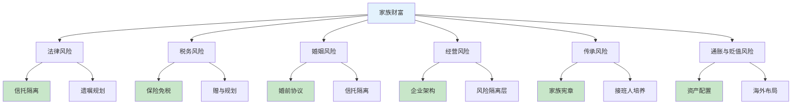
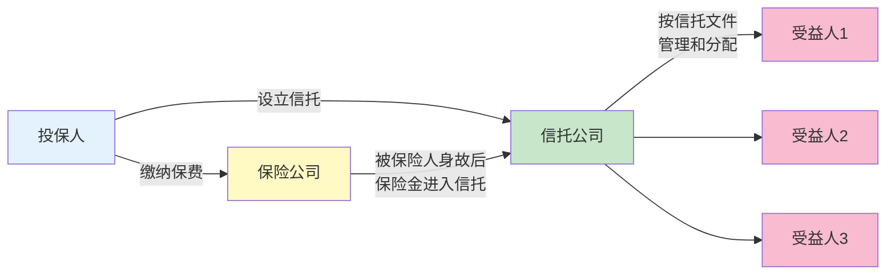
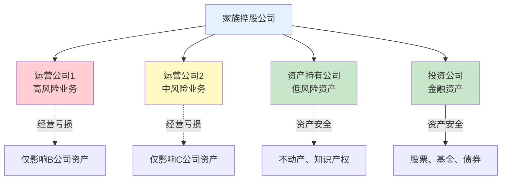
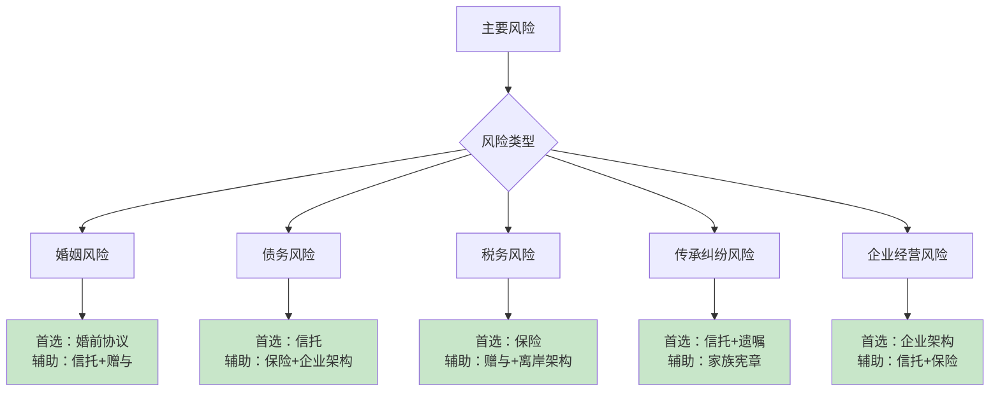
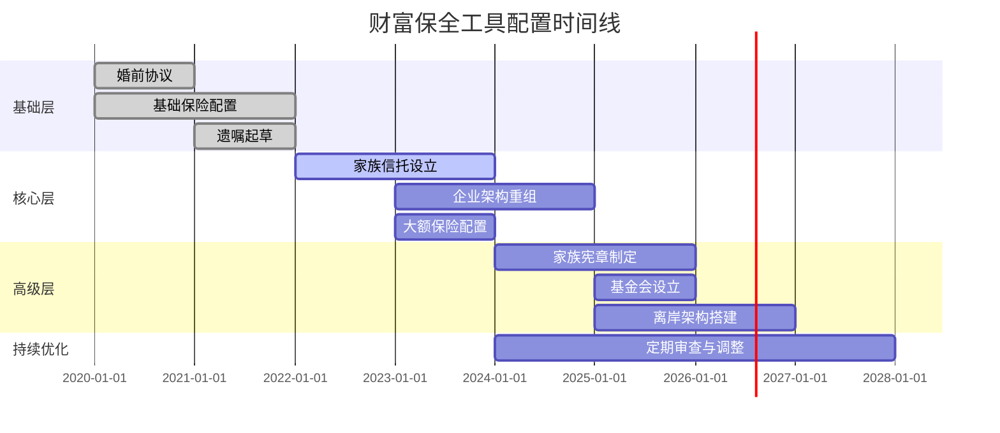

## 五、财富保全工具体系

### 5.1 为什么需要"工具体系"而非单一工具

财富保全从来不是靠一个遗嘱、一份保险或一个信托就能完成的。现实中，家族财富面临的风险是多维度的——债务追索、婚姻变故、税务侵蚀、继承纠纷、政策变化、通货膨胀——任何单一工具都无法同时抵御所有风险。

财富保全工具体系的核心逻辑是：**用不同工具覆盖不同风险维度，通过组合配置形成"风险对冲矩阵"**。就像投资需要资产配置一样，财富保全也需要"工具配置"。

### 5.2 核心工具详解

#### 5.2.1 家族信托——财富保全的"压舱石"

家族信托是财富保全体系中最核心的工具，其核心价值在于**资产隔离**。信托一旦有效设立，信托资产即独立于委托人的固有资产，不因委托人离婚、破产、负债而被追索。

> 关于家族信托的结构、设立条件和法律基础，详见本章第三节"家族信托的理论基础"。

从财富保全的角度，家族信托的独特优势包括：

**（一）债务隔离功能**

根据《信托法》第十五条，信托财产与委托人未设立信托的其他财产相区别。委托人不是唯一受益人的，信托存续期间，信托财产不得作为委托人的遗产或清算财产。这意味着，即使委托人日后负债累累，已装入信托的资产原则上不受债权人追索。

但需要注意：如果委托人设立信托的目的是恶意逃避已有债务，债权人可依据《信托法》第十二条申请撤销该信托。因此，**信托必须在财务状况健康时提前设立**，而非债务临头时的应急手段。

**（二）婚姻财产保护**

信托资产不属于委托人的个人财产，因此在委托人离婚时，配偶原则上无权分割信托资产。同理，受益人获得的信托分配属于其个人财产还是夫妻共同财产，取决于信托文件的具体约定。

实操建议：在信托文件中明确约定"受益人获得的分配为其个人财产，不属于夫妻共同财产"，并配合婚前/婚内协议使用。

**（三）灵活的分配控制**

委托人可以通过信托文件设置精细的分配条件：

| 分配类型 | 示例条件 | 典型场景 |
|---------|---------|---------|
| 教育金 | 子女被录取时一次性发放 | 鼓励子女接受高等教育 |
| 生活金 | 每月定额发放基本生活费 | 保障基本生活 |
| 创业金 | 子女满25岁时发放一笔启动资金 | 支持创业 |
| 婚嫁金 | 结婚时发放一笔奖金 | 鼓励成家 |
| 成就奖励 | 取得特定成就时额外发放 | 激励上进 |
| 限制分配 | 受益人涉赌、涉毒时暂停分配 | 约束行为 |

**（四）信托设立的关键参数**

| 参数 | 具体说明 |
|------|---------|
| 最低门槛 | 中国境内家族信托通常1000万元起，部分信托公司300-600万元 |
| 信托期限 | 5年至永续，传承型建议20年以上 |
| 可装入资产 | 现金、股权、不动产、保单受益权、艺术品、知识产权 |
| 受托人选择 | 信托公司（法定）、自然人（需谨慎）、私人信托公司（PTC） |
| 年费成本 | 通常为信托资产规模的0.3%-1%/年 |

#### 5.2.2 保险——财富保全的"隐形盾牌"

保险在财富保全中扮演着独特且不可替代的角色。它既是风险转移工具，也是财富定向传承工具，更是税务筹划工具。

**（一）人寿保险的核心保全功能**

人寿保险在财富保全中有三大核心价值：

**1. 指定受益人，绕过继承程序**

人寿保险金由指定受益人直接领取，不经过遗产继承程序，不纳入遗产分配。这意味着：
- 不受遗嘱执行的拖延影响（通常遗产分割需要数月甚至数年）
- 不受法定继承份额的限制（遗嘱继承中需保留法定继承人的必要份额）
- 不受被保险人生前债务的影响（保险金不属于遗产）

**2. 杠杆效应，放大传承资产**

以终身寿险为例，年缴保费可能仅为保额的3%-5%，相当于用较少的资金锁定了数倍的传承金额。对于流动性不足的家族（如主要资产为房产或企业股权），保险是创造传承流动性的最有效工具。

**3. 部分保险金的税务优势**

在中国现行税制下，人寿保险金免征个人所得税。若未来开征遗产税，保险金是否纳入征税范围存在不确定性，但参考国际惯例，指定受益人的保险金通常不纳入遗产税税基。

**（二）适合传承的保险产品对比**

| 产品类型 | 核心特征 | 适合场景 | 资金门槛 |
|---------|---------|---------|---------|
| 终身寿险（传统型） | 固定保额，确定性强 | 确定性传承，风险厌恶型 | 年缴3-10万起 |
| 终身寿险（增额型） | 保额逐年递增，现金价值高 | 长期资产增值+传承 | 年缴5-20万起 |
| 年金险 | 定期领取，活多久领多久 | 退休规划，防止长寿风险 | 年缴10万起 |
| 大额万能险 | 灵活存取，结算利率浮动 | 灵活配置，中期规划 | 趸交100万起 |
| 家族保险信托 | 保险金直接进入信托 | 保险+信托双重保全 | 保额1000万+信托1000万 |

**（三）保险金信托：保险+信托的组合拳**

保险金信托是将保险的杠杆优势与信托的控制优势相结合的创新工具。基本模式为：投保人购买大额人寿保险，同时将保险金受益权装入信托。被保险人身故后，保险金不直接支付给受益人，而是进入信托，由受托人按照信托文件的约定管理和分配。

保险金信托的典型门槛：保额1000万元以上，信托规模1000万元以上。部分信托公司已降低门槛至保额300万元。

#### 5.2.3 遗嘱——财富保全的"基础文件"

遗嘱是最基础的财富传承工具，但其保全功能常被高估。遗嘱的核心作用是**表达意愿**，而非隔离风险。

> 关于遗嘱的详细法律框架和规划方法，详见本章第二节"遗嘱规划的理论框架"。

从保全角度看，遗嘱的局限性包括：

| 维度 | 遗嘱的能力 | 遗嘱的局限 |
|------|-----------|-----------|
| 资产分配 | 可以指定各继承人的份额 | 无法防止继承人挥霍 |
| 债务隔离 | 无法隔离——遗产先清偿债务 | 遗产可能被债权人追索 |
| 婚姻风险 | 无法保护——继承所得可能成为共同财产 | 除非遗嘱明确指定为个人财产 |
| 执行控制 | 有限——遗嘱执行人权力受限 | 难以设置复杂的分配条件 |
| 隐私保护 | 差——遗嘱需经过公证或法院确认 | 可能被公开 |

**遗嘱的正确定位**：作为财富保全体系的"兜底文件"，处理信托和保险未能覆盖的资产，以及表达对特定财产的处置意愿。遗嘱不应是唯一的保全工具。

#### 5.2.4 赠与——生前转移的利器

赠与是财富持有人在生前将财产无偿转让给受赠人的法律行为。在财富保全中，赠与的核心价值在于**提前转移资产，减少遗产规模**。

**（一）赠与的法律要点**

根据《民法典》第六百五十七条至第六百六十五条：

- 赠与合同是赠与人将自己的财产无偿给予受赠人，受赠人表示接受赠与的合同
- 赠与的财产依法需要办理登记等手续的，应当办理有关手续
- 赠与人在赠与财产的权利转移之前可以撤销赠与（任意撤销权）
- 经过公证的赠与合同或者依法不得撤销的具有救灾、扶贫、助残等公益、道德义务性质的赠与合同，不适用任意撤销权

**（二）赠与的保全策略**

| 策略 | 操作方式 | 保全效果 | 注意事项 |
|------|---------|---------|---------|
| 生前房产赠与 | 将房产过户给子女 | 减少遗产规模，避免继承纠纷 | 需缴契税（3%）、可能涉及个税 |
| 股权赠与 | 将企业股权部分转让给下一代 | 提前完成企业传承 | 需评估股权价值，可能涉及税务 |
| 现金赠与 | 分批赠与现金 | 灵活、无登记要求 | 赠与后即失去控制权 |
| 附条件赠与 | 在赠与合同中附加条件 | 保留一定控制权 | 条件的法律效力需专业设计 |

**（三）赠与的税务考量**

中国目前没有赠与税，但赠与可能涉及以下税费：

- **房产赠与**：受赠方缴纳契税（3%），赠与方通常免征增值税和个人所得税（直系亲属间赠与）
- **股权赠与**：直系亲属间赠与股权，按成本价转让，不征收个人所得税
- **现金赠与**：无直接税费

**关键提示**：赠与一旦完成，资产即脱离赠与人的控制。如果受赠人挥霍、离婚或负债，赠与人无法追回。因此，赠与通常作为辅助工具，与信托、保险等配合使用。

#### 5.2.5 婚前/婚内协议——婚姻风险的"防火墙"

婚前协议和婚内协议是防范婚姻风险对家族财富侵蚀的核心工具。

**（一）法律依据**

《民法典》第一千零六十五条规定：男女双方可以约定婚姻关系存续期间所得的财产以及婚前财产归各自所有、共同所有或者部分各自所有、部分共同所有。约定应当采用书面形式。

**（二）协议的核心内容**

一份完善的婚前/婚内财产协议应包含：

1. **婚前财产清单**：详细列明各方婚前的房产、存款、投资、股权等
2. **婚后收入归属**：约定婚后收入归各自所有、共同所有或部分各自所有
3. **家族企业股权**：明确股权及其增值部分的归属
4. **继承和赠与所得**：约定继承或受赠财产的归属
5. **债务承担**：约定各自婚前债务和婚后新增债务的承担方式
6. **离婚财产分割**：约定离婚时的财产分割方案

**（三）婚前协议的保全价值**

| 场景 | 无婚前协议 | 有婚前协议 |
|------|-----------|-----------|
| 企业家离婚 | 企业股权可能被分割，影响经营 | 股权明确为个人财产，不被分割 |
| 高净值家庭 | 婚后增值部分可能被认定为共同财产 | 增值部分归属明确 |
| 再婚家庭 | 前婚子女的继承份额可能被稀释 | 各方财产边界清晰 |
| 家族企业传承 | 婚变可能导致股权外流 | 股权在家族内部流转 |

**（四）实操注意事项**

- **签署时机**：婚前协议应在结婚登记前签署，婚内协议可在任何时候签署
- **公证建议**：虽然法律不要求公证，但经过公证的协议证明力更强
- **内容合法**：不能约定"净身出户"等违反公序良俗的条款
- **信息披露**：双方应如实披露财产状况，隐瞒资产可能导致协议被撤销
- **定期更新**：财产状况发生重大变化时应更新协议

#### 5.2.6 家族企业架构设计——经营风险的"隔离层"

对于拥有企业的家族，企业经营风险向家族财富传导是最大的威胁之一。通过合理的架构设计，可以实现企业经营风险与家族财富的隔离。

**（一）风险隔离架构**

**（二）核心原则**

1. **经营与持有分离**：将高风险的经营性业务与低风险的资产持有分开在不同法人实体中
2. **业务板块隔离**：不同业务板块设立独立法人，避免风险传染
3. **家族资产上移**：将核心资产（房产、土地、知识产权）移至控股公司层面
4. **关联交易规范**：避免法人混同，保持各实体的独立性

**（三）常见的隔离架构**

| 架构类型 | 结构说明 | 适用场景 | 风险隔离效果 |
|---------|---------|---------|-------------|
| 母子公司 | 家族控股公司+多个运营子公司 | 中大型企业集团 | 强 |
| 兄弟公司 | 多个独立法人，家族成员分别持股 | 多元化经营 | 中 |
| 股权信托 | 家族信托持有企业股权 | 高净值家族 | 最强 |
| LP架构 | 家族作为LP，GP为专业管理人 | 投资型家族 | 强 |

#### 5.2.7 家族基金会与慈善信托——社会责任与保全兼顾

家族基金会和慈善信托是将财富保全与社会责任相结合的高级工具。

**（一）家族基金会**

家族基金会是以家族捐赠财产设立的非营利法人，具有以下保全功能：

- **税收优惠**：捐赠支出在年度利润12%以内的部分可税前扣除
- **家族凝聚力**：基金会作为家族共同事业，增强家族成员的认同感和凝聚力
- **价值观传承**：通过慈善项目传递家族价值观
- **社会影响力**：提升家族社会声望，间接保护商业利益

**（二）慈善信托**

慈善信托是委托人基于慈善目的，将财产委托给受托人进行管理和处分的信托。相比家族基金会，慈善信托的设立门槛更低、管理更灵活。

根据《慈善法》和《慈善信托管理办法》：
- 慈善信托的备案门槛无最低金额限制
- 信托公司和慈善组织均可担任受托人
- 慈善信托财产独立于受托人的固有财产
- 信托监察人制度保障慈善目的的实现

**（三）家族基金会与慈善信托的对比**

| 维度 | 家族基金会 | 慈善信托 |
|------|-----------|---------|
| 法律形式 | 非营利法人 | 信托关系 |
| 设立门槛 | 原始基金不低于200万元（地方性）或800万元（全国性） | 无最低金额限制 |
| 管理成本 | 较高，需独立运营 | 较低，委托专业机构 |
| 灵活性 | 较低，需遵守法人治理规范 | 较高，信托文件可灵活约定 |
| 税收优惠 | 捐赠可税前扣除 | 捐赠可税前扣除（需备案） |
| 适合规模 | 5000万以上 | 无限制 |

#### 5.2.8 离岸架构——全球化时代的保全工具

对于拥有海外资产或有全球化布局需求的家族，离岸架构是重要的保全工具。

**（一）常见的离岸架构**

| 架构类型 | 典型司法管辖区 | 核心功能 |
|---------|---------------|---------|
| 离岸信托 | 新加坡、泽西岛、开曼群岛 | 资产隔离、隐私保护、税务筹划 |
| 离岸公司 | BVI、开曼、香港 | 资产持有、投资通道、风险隔离 |
| 私人信托公司（PTC） | 泽西岛、根西岛 | 家族自主管理信托资产 |
| 家族办公室 | 新加坡、香港 | 综合财富管理 |

**（二）离岸信托的核心优势**

- **更强的资产保护**：部分离岸地（如库克群岛）的信托法对债权人追索设置了极高的门槛
- **更灵活的信托条款**：可以设置更复杂的分配条件和控制机制
- **更完善的保密制度**：离岸地通常有严格的信托信息保密法律
- **跨司法管辖区的资产整合**：将分散在不同国家的资产纳入统一管理

**（三）中国居民设立离岸架构的合规要求**

中国税务居民设立离岸架构需遵守以下规定：

- **外汇登记**：通过ODI（对外直接投资）或37号文登记完成外汇合规
- **税务申报**：离岸架构的收益需向中国税务机关申报（CRS信息自动交换机制下，隐瞒海外资产的风险极高）
- **反避税条款**：受控外国企业（CFC）规则可能将离岸公司的未分配利润视同分配
- **实质性经营要求**：离岸架构不能仅有壳公司，需有实质性经营活动

**关键提示**：CRS（共同申报准则）已覆盖100多个国家和地区，中国税务居民的海外金融账户信息将被自动交换回中国。离岸架构不再是"藏富"工具，而是合规的财富管理工具。

#### 5.2.9 家族办公室——工具体系的"总指挥"

家族办公室（Family Office）是为超高净值家族提供综合财富管理服务的专业机构，它不是某一个具体的保全工具，而是**整合和管理所有保全工具的平台**。

**（一）家族办公室的核心职能**

| 职能 | 具体内容 |
|------|---------|
| 投资管理 | 资产配置、投资组合管理、另类投资 |
| 财富传承 | 信托设立、遗嘱规划、接班人培养 |
| 税务筹划 | 跨境税务、遗产税规划、转让定价 |
| 风险管理 | 保险规划、法律风险防范、合规管理 |
| 家族治理 | 家族宪章制定、家族会议组织、家族成员教育 |
| 生活管理 | 不动产管理、艺术品收藏、旅行安排、教育规划 |
| 慈善事业 | 基金会管理、慈善信托、影响力投资 |

**（二）单一家族办公室与联合家族办公室**

| 维度 | 单一家族办公室（SFO） | 联合家族办公室（MFO） |
|------|---------------------|---------------------|
| 服务对象 | 单一家族 | 多个家族共享 |
| 资产规模要求 | 通常1亿美元以上 | 1000万美元以上 |
| 定制化程度 | 完全定制 | 部分标准化 |
| 运营成本 | 高（年运营费200-500万美元） | 较低（按资产比例收费） |
| 隐私性 | 最高 | 较高 |
| 适合阶段 | 家族财富成熟期 | 家族财富增长期 |

对于大多数中国高净值家族，联合家族办公室是更务实的选择，可以在控制成本的同时获得专业化的综合服务。

### 5.3 工具选择的决策框架

#### 5.3.1 按财富规模选择

不同财富规模的家族，适用的保全工具组合差异显著：

| 财富规模 | 核心工具 | 辅助工具 | 参考配置 |
|---------|---------|---------|---------|
| 500万-3000万 | 保险+遗嘱+婚前协议 | 赠与 | 保险60%，遗嘱25%，其他15% |
| 3000万-1亿 | 家族信托+保险+遗嘱 | 企业架构+婚前协议 | 信托40%，保险30%，其他30% |
| 1亿-10亿 | 家族信托+企业架构+保险 | 基金会+离岸架构 | 信托35%，企业架构25%，保险20%，其他20% |
| 10亿以上 | 家族办公室+家族信托+离岸架构 | 基金会+保险+PTC | 家族办公室统筹 |

#### 5.3.2 按风险类型选择

#### 5.3.3 按人生阶段选择

| 人生阶段 | 年龄参考 | 核心任务 | 优先工具 |
|---------|---------|---------|---------|
| 创富期 | 25-40岁 | 积累财富，防范基础风险 | 保险+婚前协议+企业架构 |
| 守富期 | 40-55岁 | 保护财富，开始传承规划 | 信托+保险+遗嘱+企业架构 |
| 传富期 | 55-70岁 | 系统性传承，代际交接 | 信托+赠与+家族宪章+基金会 |
| 护富期 | 70岁以上 | 财富保全，监督执行 | 信托+保险+监察人机制 |

### 5.4 工具组合的最佳实践

#### 5.4.1 "铁三角"组合：信托+保险+遗嘱

这是最基础也最稳健的保全组合：

- **信托**：核心资产装入信托，实现资产隔离和控制传承
- **保险**：大额人寿保险提供流动性，保险金进入信托
- **遗嘱**：处理信托和保险未能覆盖的资产，作为兜底

#### 5.4.2 "五位一体"组合

对于超高净值家族，建议采用更完善的组合：

1. **家族信托**：核心资产隔离和代际传承
2. **家族控股公司**：企业股权的集中持有和管理
3. **大额保险**：提供传承流动性和税务筹划
4. **家族宪章**：规范家族治理和成员行为
5. **家族基金会/慈善信托**：社会责任和价值观传承

#### 5.4.3 组合配置的时间线

### 5.5 常见误区与风险警示

#### 误区一：认为买了保险就万事大吉

**现实**：保险只是保全体系的一个组成部分。保险金虽然指定受益人，但在某些情况下仍可能面临风险：
- 投保人恶意投保（如已知重病仍投保），保险公司可拒赔
- 保险金可能被认定为遗产（如未指定受益人或受益人先于被保险人死亡）
- 大额保单的现金价值在投保人离婚时可能被分割

**正确做法**：保险应与信托、遗嘱等工具配合使用，形成完整的保全体系。

#### 误区二：设立信托后就高枕无忧

**现实**：信托的资产隔离功能有严格的前提条件：
- 信托必须在财务状况健康时设立，不能恶意逃债
- 委托人保留过多控制权可能被法院"击穿"信托
- 信托资产的投资管理不善仍可能导致资产贬值

**正确做法**：选择专业受托人，在信托文件中平衡控制权与隔离效果，定期审查信托运作情况。

#### 误区三：遗嘱可以解决所有传承问题

**现实**：遗嘱的保全功能非常有限：
- 遗嘱不能隔离债务——遗产先清偿债务，剩余部分才由继承人分配
- 遗嘱不能防止继承人挥霍——遗产一旦分配即归继承人自由处分
- 遗嘱容易被挑战——法定继承人可以对遗嘱效力提出异议

**正确做法**：遗嘱应作为"兜底"工具，核心保全功能应交给信托和保险。

#### 误区四：忽略税务合规

**现实**：很多家族在搭建保全架构时忽略了税务合规要求：
- 股权转让未申报纳税
- 海外资产未按CRS要求申报
- 离岸架构未遵守受控外国企业规则
- 赠与行为未考虑相关税费

**正确做法**：在搭建任何保全架构前，必须咨询税务专业人士，确保架构合法合规。

#### 误区五：一步到位的思维

**现实**：财富保全不是一次性工程，而是持续优化的过程：
- 法律法规不断变化（如遗产税的可能开征）
- 家族状况不断变化（如新增家庭成员、婚姻变化）
- 资产状况不断变化（如资产增值、新的投资）
- 税收政策不断变化（如CRS的实施、反避税条款的加强）

**正确做法**：每2-3年对保全架构进行全面审查，根据变化及时调整。

### 5.6 工具体系的效果评估

建立财富保全工具体系后，应定期评估其有效性。以下是关键评估指标：

| 评估维度 | 评估指标 | 达标标准 |
|---------|---------|---------|
| 资产隔离度 | 核心资产是否已纳入隔离架构 | 80%以上核心资产受到保护 |
| 传承确定性 | 传承方案是否有法律文件支撑 | 所有关键资产均有传承安排 |
| 流动性保障 | 是否有足够的流动性应对突发需求 | 流动性资产可覆盖3-5年家庭开支 |
| 税务合规性 | 所有架构是否合法合规 | 无税务风险敞口 |
| 架构灵活性 | 架构是否可根据变化调整 | 每2-3年可优化一次 |
| 成本效益比 | 保全成本是否在合理范围内 | 年度保全成本不超过资产规模的1% |

### 5.7 本节小结

财富保全工具体系的核心思想是**"没有万能工具，只有万能组合"**。单一工具无法应对所有风险，必须根据不同风险维度、不同财富规模、不同人生阶段，选择合适的工具组合。

**核心工具清单**：

| 工具 | 核心功能 | 适用门槛 | 优先级 |
|------|---------|---------|-------|
| 家族信托 | 资产隔离、灵活分配、代际传承 | 1000万元起 | ★★★★★ |
| 人寿保险 | 杠杆传承、税务筹划、流动性 | 年缴3万元起 | ★★★★★ |
| 遗嘱 | 意愿表达、兜底安排 | 无门槛 | ★★★★ |
| 婚前/婚内协议 | 婚姻风险隔离 | 无门槛 | ★★★★ |
| 企业架构 | 经营风险隔离 | 有企业者必做 | ★★★★ |
| 赠与 | 生前转移、减少遗产 | 无门槛 | ★★★ |
| 家族基金会 | 慈善传承、税收优惠 | 200万元起 | ★★★ |
| 离岸架构 | 全球资产整合、隐私保护 | 3000万元以上 | ★★★ |
| 家族办公室 | 综合管理、统筹协调 | 1亿元以上 | ★★ |

记住：**最好的保全架构是提前搭建的架构**。等到风险来临才行动，往往为时已晚。趁财务状况健康、家族关系和谐时，尽早开始系统性地搭建财富保全工具体系。

***
