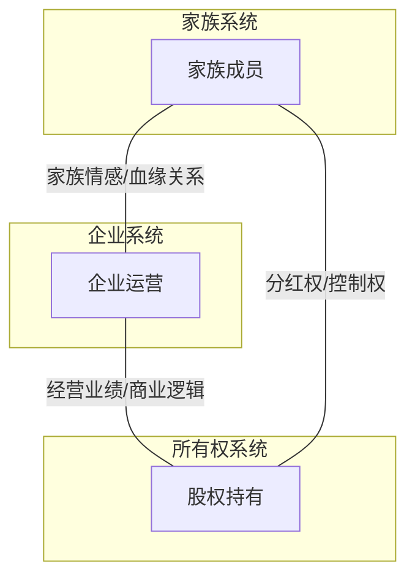
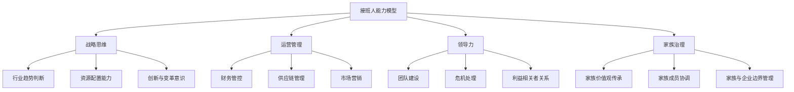
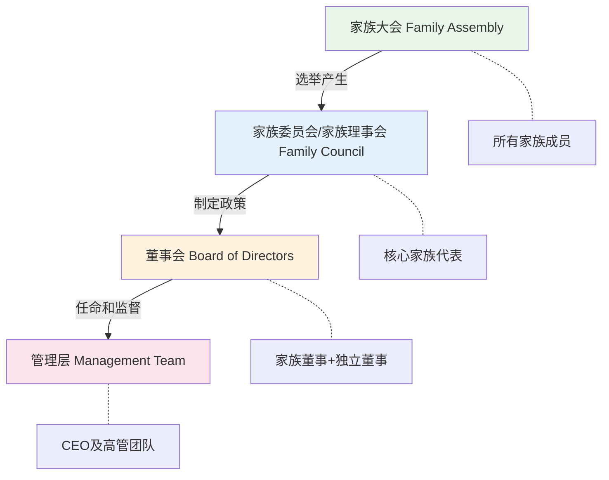
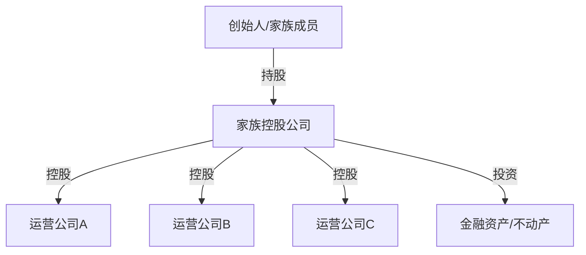
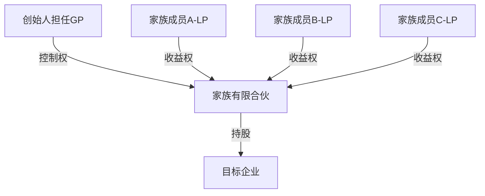

## 六、家族企业传承的特殊考量

家族企业是全球最普遍的商业组织形式之一。据家族企业研究所（Family Business Institute）统计，全球约 70%-90% 的企业由家族拥有或控制；在中国，民营企业中家族企业的比例超过 80%，贡献了全国 60% 以上的 GDP 和 80% 以上的城镇就业。然而，"富不过三代"的魔咒并非空穴来风——全球范围内，家族企业能成功传承到第二代的仅约 30%，传承到第三代的不足 13%，到第四代及以后的仅约 3%。

家族企业传承之所以比一般财富传承更加复杂，根本原因在于它同时涉及三个维度的交接：**所有权（Ownership）、管理权（Management）和家族治理（Family Governance）**。这三个维度既相互交织又各有逻辑，任何一环处理失当，都可能导致企业衰败、家族分裂或两者兼有。

---

### 1. 家族企业传承的独特性

#### 1.1 三环模型：理解家族企业的结构基础

Tagiuri 和 Davis（1982）提出的"三环模型"（Three-Circle Model）是理解家族企业复杂性的经典框架：

| 区域 | 角色 | 核心关切 | 传承中的潜在冲突 |
|------|------|----------|------------------|
| 仅家族 | 家族成员但不持股、不任职 | 家族荣誉、情感纽带 | 被边缘化，产生怨恨 |
| 仅企业 | 非家族的职业经理人 | 薪酬、职业发展 | 对接班人能力不信任 |
| 仅所有者 | 外部投资者/小股东 | 投资回报 | 反对家族内部人接班 |
| 家族+企业 | 在企业任职的家族成员 | 薪酬与家族贡献的平衡 | 薪酬公平性争议 |
| 家族+所有者 | 持股但不在企业任职 | 分红与企业再投资的矛盾 | 急于套现 vs 长期发展 |
| 企业+所有者 | 持股的职业经理人 | 控制权与利益分配 | 与家族继承人争夺控制权 |
| 三者重叠 | 创始人/核心家族领导 | 全部 | 多重角色的利益冲突 |

这个模型揭示了一个核心事实：传承不是简单的"把公司交给下一代"，而是要在多个利益相关者之间重新配置权力、利益和情感联结。

#### 1.2 家族企业传承 vs 普通财富传承

| 维度 | 普通财富传承 | 家族企业传承 |
|------|------------|------------|
| 核心资产 | 金融资产、不动产 | 企业股权 + 运营体系 + 品牌声誉 |
| 可分割性 | 较高（可按比例分配） | 低（企业需要统一控制权） |
| 时间压力 | 相对宽松 | 高度紧迫（市场窗口、管理层稳定） |
| 专业要求 | 财务/法律知识 | 财务 + 法律 + 管理 + 行业知识 |
| 情感复杂度 | 中等 | 极高（身份认同、家族荣誉） |
| 第三方参与 | 受托人、律师 | 董事会、管理层、客户、供应商、监管机构 |
| 失败成本 | 资产缩水 | 企业破产 + 家族分裂 + 就业损失 |

#### 1.3 中国家族企业的特殊背景

中国当代家族企业普遍成立于改革开放之后（1978年至今），面临独特的传承挑战：

- **创始一代的经验局限**：大多白手起家，缺乏现代治理经验，高度依赖个人关系网络
- **独生子女政策的影响**：继承人选池狭窄，部分创始人只有一名子女，且该子女可能无意接班
- **快速变化的市场环境**：数字化转型、产业升级让创始人的经验优势快速贬值
- **法律环境的不完善**：家族信托、家族办公室等工具在中国的实践时间较短
- **"面子"文化**：不愿公开讨论传承问题，回避生前安排，认为"不吉利"
- **代际价值观差异**：创始一代重视勤奋拼搏，二代更追求个人价值和生活品质

---

### 2. 接班人选择与培养体系

#### 2.1 接班人来源的四种路径

| 路径 | 代表案例 | 优势 | 风险 |
|------|----------|------|------|
| 家族内部继承 | 方太集团茅忠群接班茅理翔 | 忠诚度高、文化认同、股权集中 | 能力不足、缺乏竞争意识 |
| 职业经理人 | 美的集团方洪波接班何享健 | 专业能力强、市场化思维 | 忠诚度风险、文化冲突 |
| 家族+职业经理人共治 | 新希望集团刘畅+陈春花 | 兼顾家族控制与专业管理 | 权责边界模糊、决策效率低 |
| 内部赛马/竞争选拔 | 部分港资家族企业 | 选优择强、激励机制 | 兄弟阋墙、内部消耗 |

#### 2.2 接班人能力模型

一个合格的家族企业接班人，需要在四个维度上达到基本要求：

#### 2.3 接班人培养的"三阶段"模型

**阶段一：外部历练期（建议 3-5 年）**

在家族企业之外建立独立的职业履历和自我认知。关键行动包括：
- 在知名企业或跨国公司工作，积累规范化管理经验
- 在不同部门轮岗（至少经历销售、财务、运营三个核心岗位）
- 取得相关专业资格或学历（MBA/EMBA、行业认证等）
- 建立独立的人脉网络和职业口碑

**阶段二：企业融入期（建议 2-4 年）**

回到家族企业，从基层或中层开始，逐步了解企业运营全貌：
- 第一年：轮岗各部门，了解业务流程和痛点
- 第二年：负责具体项目或业务线，建立业绩记录
- 第三年：进入核心管理层，参与重大决策
- 第四年：逐步接管关键职能，与创始人形成搭档关系

**阶段三：权力过渡期（建议 2-3 年）**

完成从"辅佐者"到"决策者"的角色转换：
- 明确的职责划分：创始人退居幕后（如担任董事长），接班人担任CEO
- 重大决策的渐进式授权：先小后大，先局部后全面
- 建立接班人自己的核心团队
- 外部董事或顾问在过渡期提供支持和监督

> **关键提示**：整个培养周期通常需要 7-12 年。很多传承失败的根本原因是时间不够——创始人迟迟不启动培养计划，等到健康或年龄问题迫使仓促交接，往往为时已晚。

#### 2.4 多个继承人的情况

当家族有多个潜在继承人（兄弟姐妹、堂表亲等）时，需要额外考虑：

**"口袋论"模式（分家不分业）**
- 将家族企业股权按比例分配给所有继承人
- 只有一位继承人实际经营管理
- 其他继承人作为"安静的股东"享受分红
- 适用于：继承人能力差异明显，但家族关系和谐的情况

**"赛马制"模式**
- 让多位继承人分别负责不同业务板块
- 通过业绩竞争确定最终接班人
- 适用于：继承人能力相当，企业规模足够大的情况
- 风险：竞争可能演变为家族内斗

**"分工制"模式**
- 根据每位继承人的特长分配不同业务领域
- 设立家族委员会协调各板块
- 适用于：继承人能力互补，且彼此信任的情况

**"退出+补偿"模式**
- 选择一位继承人接管企业
- 对其他继承人以现金、不动产或其他资产进行补偿
- 适用于：其他继承人无意参与企业经营的情况
- 关键难点：如何公允估值，以及补偿资金的来源

---

### 3. 家族治理架构设计

#### 3.1 三层治理架构

成熟的家族企业通常建立三层治理架构，将家族事务、所有权事务和企业经营事务分离：

**各层职能详解：**

| 层级 | 组成 | 核心职能 | 会议频率 |
|------|------|----------|----------|
| 家族大会 | 全体家族成员（含配偶） | 通报企业经营状况、讨论家族重大事务、选举家族委员会 | 每年1-2次 |
| 家族委员会 | 3-7名家族代表（选举或轮值） | 制定家族宪章、协调家族与企业关系、管理家族共同资产、处理家族内部冲突 | 每季度1次 |
| 董事会 | 家族董事+独立董事+外部专家 | 战略决策、CEO任免、重大投资审批、风险管控 | 每月或每季度 |
| 管理层 | 职业化管理团队 | 日常经营、执行董事会决议、业绩报告 | 每周 |

#### 3.2 家族宪章（Family Constitution）

家族宪章是家族治理的"宪法"，是家族价值观、规则和程序的正式文件。一份完整的家族宪章应包含以下章节：

**第一章：家族使命与愿景**
- 家族的核心价值观（如诚信、创新、社会责任）
- 家族企业的长期愿景
- 家族成员共同认同的行为准则

**第二章：家族成员的权利与义务**
- 家族成员的定义和范围（含姻亲、收养等）
- 家族成员在企业中的权利（知情权、分红权、投票权）
- 家族成员的义务（保密义务、竞业禁止义务、行为规范）

**第三章：家族成员进入企业的规则**
- 学历和工作经验要求（如：大学本科以上学历，3年以上外部工作经验）
- 申请和考核程序
- 入职后的薪酬标准（建议：与同级别非家族员工一致）
- 晋升机制（应与非家族员工使用同一标准）

**第四章：所有权规则**
- 股权转让限制（如：优先购买权、限制向外部人出售）
- 股权定价机制（如：净资产法、收益法、第三方评估）
- 分红政策（如：净利润的30%-50%用于分红）
- 增资扩股规则

**第五章：冲突解决机制**
- 协商→调解→仲裁的逐级升级机制
- 家族委员会调解程序
- 外部调解人/仲裁人的选择标准
- 严重冲突时的"退出机制"

**第六章：宪章的修订**
- 修订提案权
- 表决通过的比例要求（通常为2/3或3/4多数）
- 修订周期（建议每3-5年全面审视一次）

#### 3.3 家族办公室的功能

对于资产规模较大（通常超过1亿元人民币）的家族，设立家族办公室（Family Office）是提升治理效率的重要工具：

| 功能模块 | 具体内容 |
|----------|----------|
| 财富管理 | 资产配置、投资管理、风险控制、收益评估 |
| 税务筹划 | 企业税务优化、个人所得税规划、跨境税务安排 |
| 法律服务 | 合同审查、知识产权保护、争议解决 |
| 教育培训 | 下一代培养计划、家族价值观教育、财商培训 |
| 慈善管理 | 家族基金会运营、公益项目策划、社会责任报告 |
| 行政支持 | 家族会议组织、档案管理、旅行安排 |

---

### 4. 股权结构设计与控制权安排

#### 4.1 常见股权架构模式

**模式一：自然人直接持股**

创始人直接持有公司股权，传承时通过赠与或继承转移。

- 优点：结构简单、税负透明
- 缺点：传承时面临高额税负（遗产税一旦开征）、控制权分散风险、缺乏灵活性

**模式二：控股公司架构**

通过设立家族控股公司（通常是有限合伙企业或有限公司）持有运营公司股权。

- 优点：控制权集中、便于股权管理和转让、隔离经营风险
- 缺点：双重征税（公司层面+股东层面）、设立和维护成本

**模式三：有限合伙架构（中国实践中最常见）**

创始人作为普通合伙人（GP）控制企业，家族成员作为有限合伙人（LP）享有收益权。

- 优点：控制权与收益权分离（以少量出资掌握控制权）、税务穿透（合伙企业不缴纳企业所得税）、灵活性高
- 缺点：GP承担无限连班责任（可再设一层有限公司作为GP来规避）

**模式四：VIE架构（适用于特定行业）**

通过协议控制实现对受限行业企业的控制，常见于互联网、教育、媒体等行业。

- 优点：规避外资限制
- 缺点：法律风险高、政策不确定性大

#### 4.2 控制权保护机制

无论采用哪种股权架构，传承过程中都需要设计控制权保护机制：

**投票权委托/代理**
- 家族成员将投票权委托给指定人（通常是家族委员会主席或接班人）
- 适用于：家族成员分散、决策效率要求高的情况

**AB股结构（同股不同权）**
- 创始人/接班人持有高投票权股份（如1股=10票）
- 其他家族成员持有普通股份（1股=1票）
- 适用于：引入外部投资者时保持家族控制（如京东、小米的架构）
- 注意：中国A股市场已在科创板和创业板允许同股不同权

**一致行动协议**
- 家族成员签署协议，在重大决策上采取一致立场
- 有效期通常为3-5年，到期可续签
- 适用于：家族成员持股比例分散，需要联合保持控制力

**股权锁定/限售安排**
- 在家族宪章中规定股权锁定期（如接班后5年内不得出售）
- 限制股权对外转让（家族成员有优先购买权）
- 设置股权转让的价格计算公式，避免内部争议

---

### 5. 税务筹划与法律合规

#### 5.1 传承中的主要税负

| 传承方式 | 涉及税种 | 税率 | 优化空间 |
|----------|----------|------|----------|
| 股权赠与 | 个人所得税（非亲属间） | 20% | 直系亲属赠与目前暂免个税 |
| 股权继承 | 遗产税（尚未开征） | - | 立法趋势不明，需提前规划 |
| 股权转让 | 个人所得税 | 20%（溢价部分） | 合理确定转让价格 |
| 分红 | 个人所得税 | 20% | 通过持股平台优化 |

> **特别说明**：截至2025年，中国尚未正式开征遗产税。但从政策讨论趋势来看，遗产税的开征只是时间问题。提前做好税务筹划，是家族企业传承规划的重要一环。

#### 5.2 常见税务筹划策略

**策略一：利用直系亲属股权赠与的税收优惠**
- 目前中国税法下，直系亲属之间的股权赠与暂不征收个人所得税
- 适用条件：赠与人和受赠人为配偶、父母、子女、祖父母、外祖父母、孙子女、外孙子女、兄弟姐妹
- 操作步骤：签订赠与协议→办理工商变更→完税申报

**策略二：通过有限合伙企业实现税务穿透**
- 在税收洼地设立有限合伙企业（如海南自贸港、新疆霍尔果斯等）
- 合伙企业不缴纳企业所得税，利润直接穿透到合伙人
- 适用场景：家族投资平台、持股平台

**策略三：分期/分批转让**
- 将大额股权拆分为多次小额转让
- 每次转让利用免税额度或降低税率
- 需注意：税务机关可能对关联交易进行调整

**策略四：慈善捐赠抵税**
- 通过家族基金会进行慈善捐赠
- 企业捐赠：年度利润总额12%以内的部分可税前扣除
- 个人捐赠：应纳税所得额30%以内的部分可税前扣除
- 一举两得：既降低税负，又树立家族公益形象

#### 5.3 法律风险防范

**公司法层面**
- 确保公司章程与家族宪章的一致性
- 注意有限责任公司的股东人数限制（50人以下）
- 股权代持的法律风险（代持协议不具有对抗第三人的效力）

**婚姻法层面**
- 区分婚前股权与婚后股权增值部分的归属
- 在婚前/婚内协议中明确股权的归属和分割规则
- 防范因婚姻变动导致的股权外流

**继承法层面**
- 遗嘱中明确股权的继承安排
- 注意法定继承与遗嘱继承的优先顺序
- 遗嘱执行人/遗产管理人的选任

---

### 6. 传承失败的典型模式与防范

#### 6.1 五种典型失败模式

**模式一：创始人恋栈不退**

创始人迟迟不愿放权，导致接班人无法获得实权和实战机会。

- 典型表现：创始人虽然名义上退居二线，但仍然干预日常经营决策；接班人凡事需要请示，缺乏自主空间
- 根本原因：创始人的身份认同过度依附于企业，退休意味着"失去价值"
- 防范措施：创始人需要找到企业之外的人生意义（如公益、教育、顾问工作）；制定明确的权力过渡时间表并严格执行

**模式二：接班人准备不足**

- 典型表现：接班人缺乏必要的管理经验和行业知识，仓促上任后决策失误频发
- 根本原因：培养周期过短或培养路径设计不合理
- 防范措施：提前7-12年启动培养计划；安排系统化的轮岗和导师制度

**模式三：家族内斗**

- 典型表现：多个继承人争夺控制权，导致企业决策瘫痪、核心团队流失
- 根本原因：缺乏清晰的接班规则和公平的利益分配机制
- 防范措施：提前在家族宪章中明确接班规则；建立公平的利益分配和退出机制

**模式四：元老抵制**

- 典型表现：跟随创始人多年的老臣不服从新领导，甚至联合抵制
- 根本原因：新老权力交替缺乏妥善安排
- 防范措施：提前与元老沟通，给予尊重和合理安排（如顾问角色、股权激励、退休方案）

**模式五：文化断裂**

- 典型表现：接班人引入全新的管理理念和企业文化，与原有体系产生剧烈冲突
- 根本原因：传承者忽视了企业文化的连续性
- 防范措施：在变革中保留核心文化基因；渐进式改革而非激进式推倒重来

#### 6.2 成功传承的检查清单

| 检查项 | 完成标志 | 优先级 |
|--------|----------|--------|
| 接班人培养计划已制定并执行中 | 接班人在企业内有明确角色和业绩记录 | 最高 |
| 家族宪章已签署 | 全体核心家族成员签字确认 | 最高 |
| 股权架构已优化 | 控制权安排明确，税务方案已落地 | 高 |
| 董事会已改组 | 包含独立董事，治理结构合规 | 高 |
| 关键人才已稳定 | 核心管理层有股权激励或长期合约 | 高 |
| 遗嘱/信托已设立 | 法律文件完备，执行人已指定 | 中 |
| 元老已妥善安排 | 退出机制明确，无遗留怨恨 | 中 |
| 家族冲突解决机制已建立 | 调解/仲裁流程已定义并试运行 | 中 |

---

### 7. 国内外经典案例分析

#### 7.1 成功案例

**案例一：方太集团——父子共治的典范**

茅理翔在1996年启动"带三年、帮三年、看三年"的传承计划，用近10年时间将方太集团交给儿子茅忠群。传承过程中：
- 第一个三年（1996-1999）：父子共同决策，父亲主外、儿子主内
- 第二个三年（1999-2002）：儿子主导经营，父亲退居幕后
- 第三个三年（2002-2005）：儿子全面掌舵，父亲彻底退出

成功因素：充裕的过渡时间、清晰的权力边界、对新领导变革的支持（茅忠群砍掉微波炉业务聚焦厨电的战略得到了父亲的支持）

**案例二：美的集团——"去家族化"的标杆**

何享健选择职业经理人方洪波接班，而非自己的子女。关键设计包括：
- 建立了完善的现代企业治理结构（董事会+职业经理人团队）
- 通过股权激励让管理层与企业利益绑定
- 何氏家族通过控股公司持有股权，享受分红但不干预经营
- 独立董事占比超过1/3，确保决策的独立性

成功因素：创始人的格局与远见、完善的制度设计、接班人的卓越能力

**案例三：李锦记——家族委员会制度的先驱**

香港李锦记建立了完善的家族治理架构，是华人家族企业治理的典范：
- 设立家族委员会，每3个月召开一次家族会议
- 制定了详细的家族宪章，包括家族成员进入企业的条件和退出机制
- "家族至上"的理念：家族利益优先于企业利益，确保家族和谐
- 设立家族学习与发展委员会，系统培养下一代

成功因素：制度化的家族治理、对家族价值观的坚守、前瞻性的规划

#### 7.2 失败案例

**案例一：某知名乳业企业——创始人入狱后的权力真空**

创始人因经济问题入狱后，企业面临群龙无首的局面。核心教训：
- 过度依赖创始人个人能力，缺乏制度化管理
- 没有提前指定接班人或建立应急继任机制
- 股权结构复杂，外部资本介入后控制权旁落

**案例二：某地产家族——兄弟争产导致企业分裂**

创始人去世后，两个儿子因股权分割和经营权争夺对簿公堂，最终企业被拆分为两个独立公司。核心教训：
- 遗嘱不清晰，存在多种解释的空间
- 生前未建立家族治理机制
- 兄弟二人能力相当但理念分歧严重，缺乏协调机制

---

### 8. 实操工具与模板

#### 8.1 传承规划时间线模板

| 时间节点 | 里程碑 | 关键行动 |
|----------|--------|----------|
| 传承前10年 | 启动期 | 潜在接班人识别、外部培养计划制定 |
| 传承前7年 | 培养期 | 接班人外部历练、家族宪章起草 |
| 传承前5年 | 融入期 | 接班人进入企业、股权架构调整 |
| 传承前3年 | 过渡期 | 权力渐进交接、董事会改组 |
| 传承前1年 | 决策期 | 最终方案确认、法律文件签署 |
| 传承当年 | 执行期 | 正式交接、公告发布 |
| 传承后2年 | 巩固期 | 新领导团队稳定、业绩验证 |
| 传承后5年 | 成熟期 | 传承效果评估、制度优化 |

#### 8.2 接班人评估矩阵

从能力（Ability）和意愿（Willingness）两个维度对潜在接班人进行评估：

|  | 高意愿 | 低意愿 |
|--|--------|--------|
| **高能力** | 理想接班人（全力培养） | 需激发动力（明确激励机制） |
| **低能力** | 有潜力（需长期培养） | 不适合接班（安排其他角色） |

#### 8.3 家族宪章核心条款起草模板

以下条款仅供参考，实际使用需根据家族具体情况调整，并由专业律师审核：

**股权持有条款示例：**
> 第X条 家族成员持股资格
>
> 1. 凡年满18周岁的家族成员均有资格持有家族企业股权。
> 2. 家族成员首次获得股权的方式为创始人赠与或继承，不得通过市场购买获得。
> 3. 家族成员持有的股权在获得之日起5年内不得转让（"锁定期"）。
> 4. 锁定期满后，家族成员如欲转让股权，须优先转让给其他家族成员（"优先购买权"），转让价格由独立第三方评估机构确定。

**进入企业条款示例：**
> 第X条 家族成员入职条件
>
> 1. 申请入职家族企业的家族成员须满足以下基本条件：
>    a) 拥有国家认可的大学本科及以上学历；
>    b) 拥有3年以上家族企业以外的工作经验；
>    c) 通过家族企业统一招聘流程和能力评估。
> 2. 家族成员入职后的薪酬标准参照同级别非家族员工执行，不得享受特殊待遇。
> 3. 家族成员的晋升须经家族委员会和管理层双重审批。

---

### 9. 常见误区与纠正

| 误区 | 后果 | 纠正方法 |
|------|------|----------|
| "还早，不需要现在规划" | 传承准备不足，仓促交接导致失败 | 传承规划应提前10年启动 |
| "把公司交给儿子/女儿就行了" | 忽视能力和意愿评估，接班人不合适 | 建立系统的接班人评估和培养体系 |
| "我还能干20年" | 创始人恋栈，错过最佳传承窗口 | 设定明确的退休年龄和过渡计划 |
| "股权平分最公平" | 股权分散导致无人有足够控制权 | 控制权集中+收益权公平分配 |
| "签个遗嘱就够了" | 遗嘱无法解决经营权和治理问题 | 遗嘱+家族宪章+股权架构综合设计 |
| "家族内部的事不需要外人参与" | 缺乏客观评估和专业意见 | 引入独立董事、顾问、专业机构 |
| "传承就是分钱" | 忽视企业经营的连续性和文化传承 | 财富传承+能力传承+价值观传承三位一体 |

---

### 10. 本节小结

家族企业传承是一项系统工程，其复杂程度远超单纯的财富传承。成功的家族企业传承需要做到"三个提前"：

1. **提前规划**：至少在计划交接前10年开始准备，包括接班人培养、治理架构设计、股权架构优化
2. **提前沟通**：在家族内部充分讨论传承方案，争取所有核心成员的理解和认同
3. **提前制度化**：通过家族宪章、股权协议、董事会制度等将传承安排固化为可执行的规则

记住：传承的目标不仅仅是让企业活下去，更是让家族企业在新的领导者手中持续繁荣，让家族的凝聚力和价值观代代相传。如李锦记家族所言——"家族永续"比"企业永续"更为根本。
