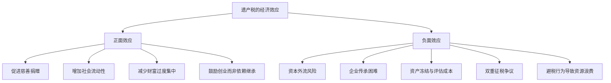
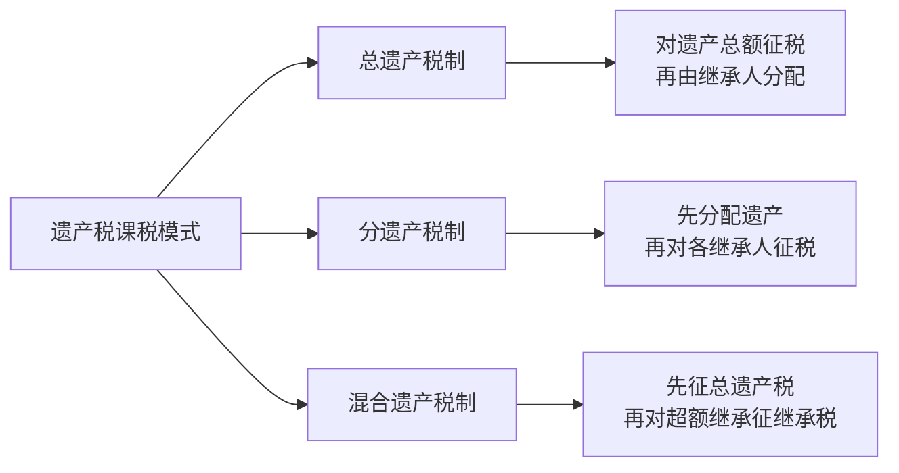
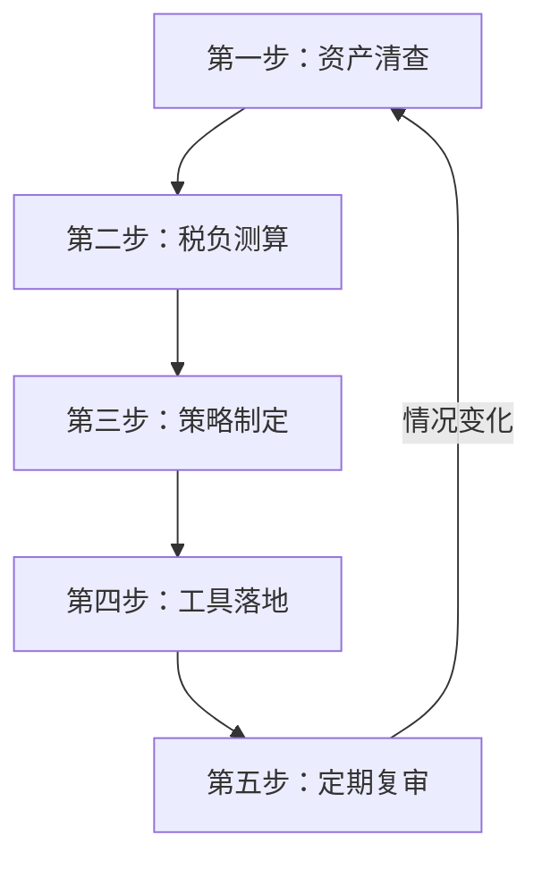

## 七、遗产税的理论与实践

### 1. 什么是遗产税：概念与本质

#### 1.1 基本定义

遗产税（Estate Tax）是对自然人死亡后遗留的财产总额征收的一种税。其征税对象是被继承人（死者）的全部遗产，包括不动产、动产、金融资产、知识产权、企业股权等一切具有经济价值的财产权利。

与遗产税容易混淆的概念需要厘清：

| 税种 | 纳税人 | 课税对象 | 征税环节 | 典型代表国家 |
|------|--------|----------|----------|-------------|
| 遗产税 | 遗产继承人或遗产本身 | 被继承人遗产总额 | 继承发生时 | 美国、英国、韩国 |
| 继承税 | 各继承人 | 各继承人分得的份额 | 继承发生后 | 日本、德国、法国 |
| 赠与税 | 受赠人 | 生前赠与的财产 | 赠与发生时 | 几乎所有遗产税国家 |
| 死亡税 | — | 统称，包含遗产税和继承税 | — | 学术用语 |

遗产税的本质区别在于：它是对**财富转移行为**征税，而非对财富持有或财富增值征税。这使得遗产税在税收体系中占据独特位置——它既不是所得税，也不是财产税，而是一种**转移税**（Transfer Tax）。

#### 1.2 为什么需要遗产税：理论基础

遗产税的正当性建立在多重理论基础之上，这些理论从不同角度回答了"国家为什么有权对死亡后的财富转移征税"这一根本问题。

**能力负担原则（Ability-to-Pay Principle）**

继承人获得遗产是一种"意外之财"（Windfall），其获得财富并未付出相应的劳动或承担风险。既然获得了经济利益，就具备了纳税能力，国家据此征税符合税收公平原则。亚当·斯密在《国富论》中提出的税收四原则——公平、确定、便利、最小征收费用——遗产税在"公平"维度上有独特优势。

**社会契约论与国家保护说**

遗产的保全和传承依赖国家提供的法律制度保障：产权登记制度确认所有权、司法系统解决继承纠纷、警察和军队保护财产安全、合同法保障交易有效。国家为遗产的存续提供了制度性公共产品，从遗产中收取一定比例的费用具有合理性。正如Oliver Wendell Holmes所言："税收是我们为文明社会支付的代价。"

**社会公平与机会均等**

极端的财富代际累积会固化社会阶层，削弱社会流动性。法国经济学家托马斯·皮凯蒂在《21世纪资本论》中用大量历史数据证明：当资本收益率持续高于经济增长率（r > g）时，财富将不可避免地向少数人集中。遗产税是打破这一趋势的关键政策工具——它不是要消灭财富差距，而是防止差距变成不可逾越的鸿沟。

**抑制世袭特权**

亚当·斯密、约翰·斯图亚特·密尔等古典经济学家均支持对继承财富施加限制。密尔在《政治经济学原理》中明确提出：每个人有权通过自身努力积累财富，但无权不劳而获地继承巨额财产。他建议设定继承额度上限，超出部分收归公共用途。

**财政收入功能**

在现代福利国家，遗产税还承担着重要的财政功能。虽然遗产税在全球税收收入中占比较低（通常在0.5%-2%之间），但它具有不可替代的象征意义和政策信号作用——它表明一个社会对极端财富集中的态度。

#### 1.3 遗产税的经济学效应

遗产税并非只有"收钱"这一面，它对经济行为有着深远的影响，这些影响既有正面的也有负面的：

### 2. 全球遗产税的历史演变

#### 2.1 起源：从古埃及到近代欧洲

遗产税的历史远比大多数人想象的要悠久。古埃及在公元前约700年就已对财产继承征税，古罗马时期凯撒大帝引入了5%的遗产税（Vicesima Hereditatium），用于支付退伍军人的抚恤金。这一税种持续了数百年，成为罗马财政的重要支柱。

现代遗产税的直接起源是1694年英国引入的"遗嘱检验税"（Probate Duty），最初只是对遗嘱认证程序收取的手续费，后逐渐演变为按遗产价值比例征收的正式税种。1796年，英国在与法国的战争中需要筹集军费，将遗产税改革为真正意义上的累进税率遗产税，这是现代遗产税制度的开端。

#### 2.2 20世纪的遗产税扩张与收缩

20世纪上半叶是遗产税的黄金扩张期。两次世界大战的巨额开支迫使各国政府寻找税源，遗产税因其税基集中（只影响少数富裕家庭）而政治阻力较小，被广泛采纳。美国于1916年正式建立联邦遗产税制度，最高边际税率一度达到77%（1941-1976年）。同期，日本、德国、法国等主要经济体也相继建立了遗产税体系。

20世纪80年代开始，随着新自由主义经济学的兴起，"降低遗产税"甚至"废除遗产税"成为一股全球潮流：

- **澳大利亚**：1979年废除联邦遗产税，各州在1978-1979年间相继废除
- **加拿大**：1972年废除联邦遗产税
- **瑞典**：2005年废除遗产税
- **俄罗斯**：2006年废除遗产税
- **奥地利、挪威、葡萄牙**：21世纪初相继废除或实质性免除
- **新加坡**：2008年废除遗产税

废除遗产税的主要论据包括：吸引和留住高净值人群、避免资本外流、简化税制、避免对家族企业的毁灭性打击。

#### 2.3 21世纪的遗产税现状

截至2024年，全球大约有30多个国家和地区保留了某种形式的遗产税或继承税。以下为主要经济体的遗产税概况：

| 国家/地区 | 税种类型 | 最高税率 | 免税额（约折合人民币） | 特点 |
|-----------|---------|---------|----------------------|------|
| 美国 | 遗产税+赠与税 | 40% | 约9000万（2024年个人） | 联邦+州双重课税 |
| 日本 | 继承税 | 55% | 约210万（法定继承） | 全球最高税率之一 |
| 韩国 | 继承税 | 50% | 约60万 | 最大股东附加20% |
| 英国 | 遗产税 | 40% | 约260万 | 配偶间转移免税 |
| 德国 | 继承税 | 50% | 约370万（配偶） | 直系亲属免税额较高 |
| 法国 | 继承税 | 45% | 约65万（子女） | 20年以上赠与有减免 |
| 中国 | 无 | — | — | 长期讨论未立法 |

**一个关键数据**：2024年美国联邦遗产税的个人免税额为1361万美元（约合人民币9800万元），这意味着只有遗产超过此金额的家庭才需要缴纳联邦遗产税。据统计，美国每年仅有约0.1%-0.2%的死亡者遗产需要缴纳联邦遗产税。这个数据常常被公众误解——遗产税从来不是"对所有死者征税"，而是对极少数超富裕阶层的财富转移征税。

### 3. 遗产税的制度设计要素

一套完整的遗产税制度包含多个相互关联的设计要素，每个要素的选择都会直接影响税制的公平性、效率和可行性。

#### 3.1 课税模式选择

**总遗产税制（Estate Tax）**：以被继承人为纳税人，对其死亡时遗留的全部财产净值征税。优点是税源集中、征管简便、不易通过分拆避税；缺点是不考虑继承人的实际负担能力，对赡养多名家庭成员的继承人可能不公平。代表国家：美国、英国。

**分遗产税制（Inheritance Tax）**：以继承人为纳税人，对各继承人实际分得的遗产分别征税，通常根据亲疏关系设定不同税率。优点是更加公平，考虑了继承人的实际情况；缺点是征管复杂，可能通过分拆给多个继承人来降低税率。代表国家：日本、德国。

**混合遗产税制**：先对遗产总额征收一道总遗产税，再对各继承人分得的超过一定额度的部分征收继承税。意大利曾采用此模式。理论上最为完善，但实操中双重征管成本高，已很少有国家采用。

#### 3.2 税率结构设计

遗产税的税率设计直接决定了其再分配效果和避税动机强度。各国在税率结构上的选择差异巨大：

**累进税率 vs 比例税率**

大多数国家采用累进税率，以体现"遗产越多、税率越高"的公平理念。但也有一些国家（如英国）采用单一比例税率（40%），只是通过免税额来体现累进效果。

以日本继承税为例，其2024年税率表如下：

| 应税继承额（万日元） | 税率 | 速算扣除额（万日元） |
|---------------------|------|---------------------|
| 1,000以下 | 10% | 0 |
| 1,000-3,000 | 15% | 50 |
| 3,000-5,000 | 20% | 200 |
| 5,000-10,000 | 30% | 700 |
| 10,000-20,000 | 40% | 1,700 |
| 20,000-30,000 | 45% | 2,700 |
| 30,000-60,000 | 50% | 4,200 |
| 60,000以上 | 55% | 7,200 |

日本最高55%的税率，加上地方住民税的10%附加，实际最高边际税率达到**70%**——这是全球遗产税中最极端的案例之一。

#### 3.3 免税额与扣除项目

免税额（Exemption）和扣除项目（Deductions）是遗产税制度中最关键的参数，它们直接决定了哪些家庭需要缴税、缴多少税。

**常见的扣除项目包括**：

- **配偶扣除**：大多数国家对配偶间的遗产转移给予100%免税或大额免税。英国允许配偶间无限额免税转移；美国2024年配偶间免税额为2722万美元。
- **子女扣除**：直系卑亲属通常享有较高的免税额。日本法定继承人基础扣除为3000万日元+600万日元×法定继承人数。
- **慈善捐赠扣除**：对捐赠给慈善机构的遗产给予全额或部分免税，是鼓励慈善事业的重要政策工具。
- **丧葬费用和债务扣除**：被继承人生前的合法债务、丧葬费用等可从遗产总额中扣除。
- **经营性资产扣除**：部分国家对家族企业传承中的经营性资产给予特殊减免。美国对合格家族企业（Qualified Family-Owned Business）提供最高约1400万美元的额外扣除。

#### 3.4 赠与税的配合设计

如果只征收遗产税而不征收赠与税，所有人会在生前将财产赠与子女来规避遗产税。因此，赠与税是遗产税制度不可或缺的配套税种。

各国对赠与税的设计有三种模式：

**（1）赠与税与遗产税分设，独立征收**

美国采用此模式，赠与税与遗产税共用一个税率表和一个终身免税额（2024年为1361万美元）。每年每人可赠与任何人1.8万美元（2024年年免税额）而不占用终身免税额。

**（2）赠与税并入遗产税，生前赠与视为遗产的一部分**

法国和部分欧洲国家采用此模式。生前一定年限内的赠与被视为遗产的一部分，合并计算遗产税。法国的规定是：15年以上的赠与不再计入遗产。

**（3）赠与税与继承税合并计算**

日本采用此模式，被继承人生前3年内的赠与（2024年起延长为7年，逐步过渡）会被追加计入继承税的课税对象。

### 4. 主要国家遗产税制度深度解析

#### 4.1 美国：联邦与州的双重遗产税

美国的遗产税制度在全球最具影响力，也是最复杂的之一。

**联邦遗产税核心参数（2024年）**：
- 免税额：1361万美元/人（2722万美元/已婚夫妇，通过"可转让免税额"机制实现）
- 税率：18%-40%（累进12级）
- 赠与税年免税额：1.8万美元/人/年
- 终身赠与税免税额：与遗产税共享1361万美元

**2025年的重大变化**：2017年《减税与就业法案》（TCJA）设定的高免税额将于2025年底到期，届时免税额将回落至约600-700万美元（经通胀调整）。这意味着大量此前不需要缴纳遗产税的家庭将在2026年后面临遗产税。这一"日落条款"（Sunset Clause）是当前美国高净值家庭最关注的税务议题之一。

**州级遗产税**：美国有12个州和华盛顿特区征收州级遗产税，免税额通常远低于联邦标准（如马萨诸塞州免税额仅为100万美元）。这意味着即使不需要缴纳联邦遗产税，住在特定州的家庭仍可能需要缴纳州级遗产税。

**QTIP信托与AB信托**：美国的遗产税制度催生了高度发达的信托规划行业。已婚夫妇最常用的策略是建立"AB信托"（Credit Shelter Trust），利用双方的免税额；以及"QTIP信托"（Qualified Terminable Interest Property Trust），在配偶去世后保留对财产的控制权，同时利用双方的免税额。

#### 4.2 日本：全球最高遗产税负

日本的遗产税制度因其极高的税率和相对较低的免税额，使其成为全球遗产税负最重的国家之一。

**日本继承税的核心特征**：

- **最高边际税率55%**：加上10%住民税附加，实际最高可达70%
- **法定继承人模式计算**：即使实际只有一个继承人，也按法定继承人数计算基础扣除额。假设被继承人有配偶和两个孩子，基础扣除额为3000万+600万×3=4800万日元（约合人民币230万元）
- **实物缴纳制度**：当继承人无力以现金缴纳继承税时，可以申请以不动产等实物抵缴
- **延纳制度**：继承税可以在一定条件下分多年缴纳（最长20年），但需支付利息

**日本遗产税对社会的影响**：

日本有一个独特的现象——"空き家問題"（空置房屋问题）。部分原因是继承人无力缴纳继承税而不得不放弃继承，导致房屋空置。据统计，日本全国有约849万套空置房屋（2023年数据），遗产税负担是重要原因之一。

另一个案例是2018年日本前首相田中角荣家族的遗产纠纷。田中角荣于1993年去世后，其遗产评估价值约17亿日元，继承税约5亿日元。但由于遗产中大量为不动产，流动性不足，家族花费了20多年才最终完成继承税的缴纳。这一案例深刻反映了高额遗产税对家族财富传承的冲击。

#### 4.3 英国：简洁高效的遗产税

英国的遗产税制度以其简洁性著称：

- **单一税率40%**：遗产超过免税额的部分统一适用40%税率
- **免税额32.5万英镑**（2024/25税年），含住宅额外免税额可提升至50万英镑
- **配偶间转移100%免税**：这是英国遗产税制度中最重要的豁免
- **7年规则**：生前赠与如果发生在死亡前7年以上，完全免税；3-7年之间按递减比例征税（Taper Relief）
- **商业资产减免（Business Relief）**：合格的商业资产可享受50%或100%的遗产税减免
- **农业资产减免（Agricultural Relief）**：合格的农业用地可享受100%减免

英国的7年规则是一个精妙的设计——它给予赠与人一个"倒计时"（Countdown Period），鼓励尽早进行财富转移。如果赠与人在赠与后活过7年，该赠与完全脱离遗产税的征收范围。这一规则使得"活着的时候就开始传承"成为英国高净值家庭的普遍做法。

#### 4.4 韩国：遗产税与财阀传承

韩国的遗产税制度是理解韩国财阀（Chaebol）运作逻辑的关键。

- **最高税率50%**：普通继承
- **最大股东附加税20%**：对企业最大股东的继承，额外加征20%，使得实际控制人的遗产税实际税率高达**60%**
- **经营权继承的特殊考量**：财阀家族在代际传承中面临的核心挑战是如何在缴纳巨额遗产税的同时保持对企业的控制权

**三星集团的传承案例**：李健熙于2020年去世，其持有的三星集团相关股份市值约18万亿韩元（约合人民币960亿元），预估遗产税约12万亿韩元（约合人民币640亿元）。这是全球历史上单笔最大的遗产税之一。李氏家族通过分期缴纳（5年）和部分出售资产等方式应对。

### 5. 中国的遗产税讨论与展望

#### 5.1 历史回顾

中国并非从未有过遗产税。1938年10月，国民政府公布了《遗产税暂行条例》，1940年7月1日正式开征。1946年制定了《遗产税法》。但由于战乱和通货膨胀，遗产税的实际征收效果有限。

中华人民共和国成立后，1950年发布的《全国税政实施要则》中列有遗产税，但因当时个人财产极少，实际上从未开征。此后的数十年间，遗产税多次出现在政策讨论中，但始终未正式立法。

#### 5.2 支持开征遗产税的论据

- **缩小贫富差距**：中国基尼系数长期处于0.46-0.47的高位，遗产税可作为调节工具
- **完善税制结构**：中国现行税制以流转税为主，直接税占比偏低，遗产税可填补财富转移环节的税制空白
- **鼓励慈善事业**：遗产税中的慈善扣除可有效激励高净值人群的慈善捐赠
- **国际接轨**：作为全球第二大经济体，中国是少数不征收遗产税的主要经济体之一

#### 5.3 反对开征遗产税的论据

- **征管难度大**：中国尚未建立完善的财产登记和评估体系，对不动产、金融资产、海外资产的全面清查困难重重
- **资本外流风险**：在全球化背景下，高净值人群可能通过移民或资产转移规避遗产税
- **影响民营经济**：民营企业家担心遗产税会影响企业的代际传承，打击创业积极性
- **评估成本高**：非上市企业股权、艺术品、收藏品等非标准化资产的评估缺乏公允标准
- **征税成本可能超过税收收入**：遗产税的征管成本在所有税种中属于最高的

#### 5.4 如果中国开征遗产税，可能的制度框架

基于学术界的讨论和国际经验，如果中国未来开征遗产税，可能的制度框架如下：

| 要素 | 可能方案 | 理由 |
|------|---------|------|
| 税种类型 | 遗产税制（总遗产税） | 征管简便，适合中国国情 |
| 免税额 | 800万-1000万元 | 覆盖99%以上家庭，只影响顶层 |
| 税率 | 20%-50%累进 | 参考国际水平，不过度 |
| 配偶扣除 | 100%免税 | 保护家庭基本生活 |
| 慈善扣除 | 全额扣除 | 鼓励慈善事业 |
| 经营性资产 | 递延纳税或减征 | 保护民营企业传承 |
| 赠与税 | 与遗产税联动 | 防止生前转移规避 |

**需要强调的是**：以上仅为学术讨论框架，不代表任何官方政策方向。中国目前没有遗产税立法的明确时间表。

### 6. 遗产税规划的合法策略

遗产税规划（Estate Tax Planning）是指在法律允许的范围内，通过合理的安排降低遗产税负担的行为。与逃税（非法）不同，税务规划是纳税人的合法权利。

#### 6.1 生前赠与策略

生前赠与是最直接、最常用的遗产税规划工具。核心逻辑是：趁财产价值较低或免税额尚在时，将财产转移给下一代。

**美国的年赠与免税额应用**：2024年每人每年可向任何人赠与1.8万美元而不占用终身免税额。一对夫妇有3个孩子，每个孩子已婚且有2个孩子（即孙辈），则每年可免税赠与的总额为：
- 配偶双方 × 6个受赠人 × 1.8万美元 = 21.6万美元/年
- 如果连续赠与10年，累计免税转移216万美元

**日本的生前赠与策略**：日本每年有110万日元的基础免税赠与额。此外，2015年起引入了"相続時精算課税制度"（继承时精算课税制度），允许60岁以上的父母向成年子女赠与最高2500万日元的财产，赠与时不征税，但在父母去世时合并计入继承税。

#### 6.2 信托架构策略

信托是遗产税规划中最重要的法律工具之一。通过将财产装入信托，可以实现：

- **所有权转移**：财产法律上不再属于委托人，从而不纳入遗产税税基
- **控制权保留**：通过设定信托条款，委托人仍可对财产的管理和分配施加影响
- **跨代传承**：信托可以跨越多代（如美国的"世代跳过信托"GST Trust），避免每一代都缴纳遗产税

常见的信托类型及其税务效果：

| 信托类型 | 主要功能 | 税务效果 |
|---------|---------|---------|
| 不可撤销人寿保险信托（ILIT） | 持有人寿保险保单 | 死亡赔付不纳入遗产 |
| 合格个人住宅信托（QPRT） | 转移住宅给子女 | 以折后价值计算赠与税 |
| 世代跳过信托（GST） | 跨代传承 | 避免每代遗产税 |
| 慈善余额信托（CRT） | 慈善+传承兼顾 | 延迟纳税+慈善扣除 |
| 家族有限合伙（FLP） | 家族资产管理 | 资产估值折扣 |

#### 6.3 人寿保险策略

人寿保险在遗产税规划中扮演着独特角色：

- **流动性提供**：保险赔付可以为继承人提供缴纳遗产税所需的现金，避免被迫出售家族资产
- **税基提升**：在美国，人寿保险赔付通常不计入遗产（如通过ILIT持有），相当于"免税"增加了继承人的财富
- **杠杆效应**：用相对较低的保费撬动较高的保额，本质上是用"小钱"解决"大税"

**但要注意**：如果被保险人同时也是保单所有人，死亡赔付通常会纳入遗产。因此，必须通过不可撤销信托（ILIT）持有保单，才能实现遗产税的规避。这是一个容易犯错的技术细节。

#### 6.4 慈善策略

慈善捐赠是唯一一个"既减税又做好事"的遗产税规划工具：

- **直接捐赠扣除**：捐赠给合格慈善机构的财产可从遗产总额中全额扣除
- **慈善信托**：通过慈善余额信托（CRT）或慈善导向基金（DAF），可以在保留一定收入流的同时获得慈善扣除
- **慈善遗产**：将遗产的一部分定向捐赠给慈善机构，按比例减少应税遗产

**比尔·盖茨的案例**：盖茨夫妇设立了盖茨基金会，并承诺将绝大部分财富捐给慈善事业。从遗产税角度，这意味着其遗产中的慈善部分将获得100%免税。2022年盖茨公开表示将把几乎所有财富捐给基金会，这一决定既出于慈善理念，也客观上实现了遗产税的合法规避。

### 7. 遗产税的常见误区与争议

#### 7.1 "遗产税是双重征税"

**误区**：被继承人生前已经就收入缴纳了所得税，死后遗产再被征税属于双重征税。

**辨析**：遗产税的课税对象是**财富转移行为**，而非财富本身。继承人获得遗产时，对其而言这是一笔新的经济流入，就像工资收入一样需要纳税。类比：雇主用税后利润支付员工工资，员工仍需缴纳个人所得税——这不是双重征税，而是两个不同的纳税主体在两个不同的环节各自纳税。

#### 7.2 "遗产税会让家族企业倒闭"

**误区**：高额遗产税迫使继承人出售企业股份来缴税，导致企业易手或倒闭。

**辨析**：大多数国家都为家族企业传承提供了缓解措施：
- 美国：合格家族企业可获得额外约1400万美元的扣除
- 英国：商业资产减免（Business Relief）可减免50%-100%
- 德国：对企业资产继承给予大额减免，条件是5年内不裁员不减资
- 日本：实物缴纳和延纳制度

真正导致企业倒闭的不是遗产税本身，而是缺乏提前规划。家族企业主如果在生前就开始进行财富转移和税务规划，遗产税的实际负担可以大幅降低。

#### 7.3 "遗产税只影响超级富豪"

**误区**：遗产税是"富人税"，与普通人无关。

**辨析**：在免税额较高的国家（如美国），遗产税确实只影响顶层0.1%-0.2%的家庭。但遗产税制度的设计——包括赠与税、信托法规、财产评估规则——深刻影响着整个财富管理和法律服务行业。此外，遗产税的政策走向（如美国2025年免税额下调）可能将更多中上层家庭纳入征税范围。

#### 7.4 "遗产税会导致资本外流"

**误区**：高遗产税国家的富人都在逃离，带走了资本和人才。

**辨析**：这一论点有一定现实基础，但被夸大了。实际上，富人选择居住地的因素远不止遗产税一项——生活质量、教育资源、医疗水平、社会安全、商业环境、社交网络等都是重要考量。美国拥有全球最高的遗产税率之一，但仍是全球高净值人群最集中的国家之一。法国作家巴尔扎克曾说"遗产税不会让富人变穷，只会让税务律师变富"——虽然夸张，但反映了避税行为本身会消耗社会资源。

### 8. 实操指南：如何进行遗产税规划

#### 8.1 遗产税规划的五步流程

**第一步：资产清查**
- 列出所有资产（房产、金融资产、企业股权、海外资产、数字资产、收藏品等）
- 确定各类资产的当前公允价值
- 区分个人资产与共有资产、已设担保资产与无负担资产

**第二步：税负测算**
- 根据现行法律计算假设"今天去世"需要缴纳的遗产税
- 评估2025年后免税额下调的影响（美国案例）
- 测算不同方案下的税负变化

**第三步：策略制定**
- 确定生前赠与的规模和节奏
- 选择合适的信托架构
- 评估人寿保险的需求
- 考虑慈善规划的可能性

**第四步：工具落地**
- 起草或修改遗嘱
- 设立信托并完成财产转移
- 购买人寿保险（通过ILIT持有）
- 完成赠与申报和记录

**第五步：定期复审**
- 每2-3年复审一次整体规划
- 法律变化时（如免税额调整）及时调整
- 家庭情况变化时（如离婚、再婚、子女出生）及时更新

#### 8.2 不同财富水平的规划重点

| 财富水平 | 核心关注点 | 推荐策略 |
|---------|-----------|---------|
| 500万以下 | 基本遗嘱规划 | 遗嘱+受益人指定+保险 |
| 500万-2000万 | 开始关注赠与规划 | 年度赠与+基本信托+保险 |
| 2000万-1亿 | 系统性税务规划 | AB信托+FLP+ILIT+慈善规划 |
| 1亿以上 | 综合家族办公室 | GST信托+CRT+家族基金会+海外架构 |

### 9. 本节小结

遗产税是一个涉及税法、民法、经济学、社会学等多个学科的复杂领域。理解遗产税的理论基础和国际实践，对于每一个关注财富传承的人都具有重要意义——即使在中国目前没有遗产税的情况下，提前了解和规划也是未雨绸缪的明智之举。

核心要点回顾：
- 遗产税的本质是对**财富转移行为**征税，有其独立的理论正当性
- 全球遗产税呈现"两极化"趋势——部分国家废除，保留的国家税率仍然很高
- 遗产税制度设计的核心参数是免税额、税率和扣除项目
- 赠与税是遗产税不可或缺的配套税种
- 合法的遗产税规划是纳税人的权利，关键是提前规划、选择合适的工具
- 中国目前没有遗产税，但相关讨论持续存在，未来不排除开征的可能

> **一句话总结**：遗产税不是"抢死人的钱"，而是社会对极端财富代际累积的一种制度性制衡。理解它、尊重它、合理规划它——这才是面对遗产税的正确态度。
