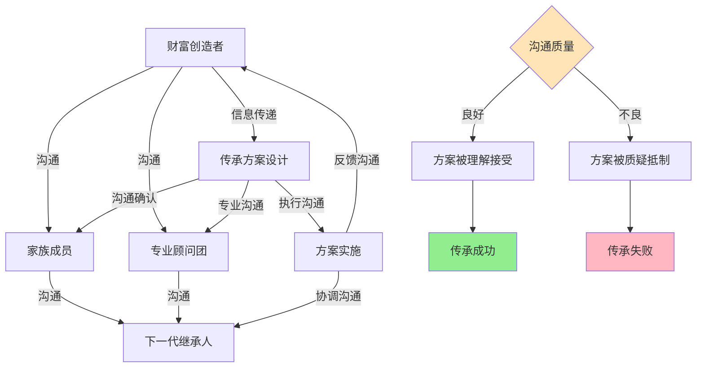
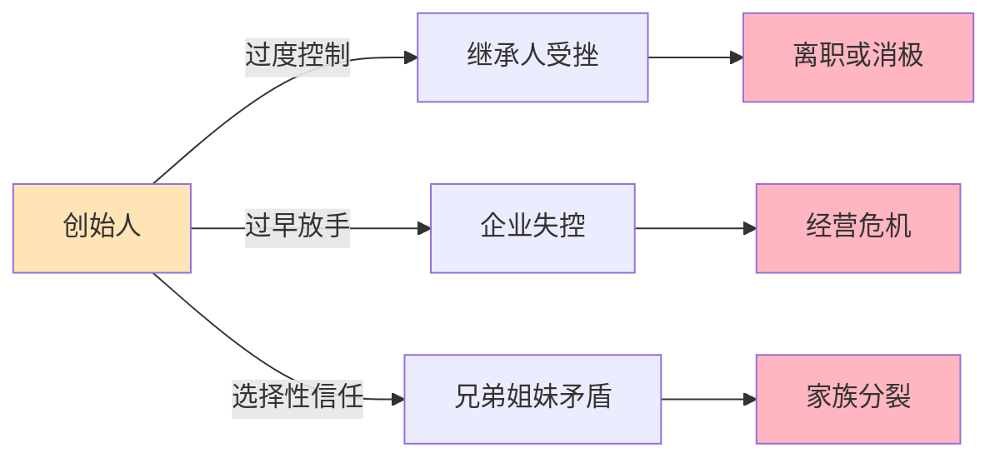
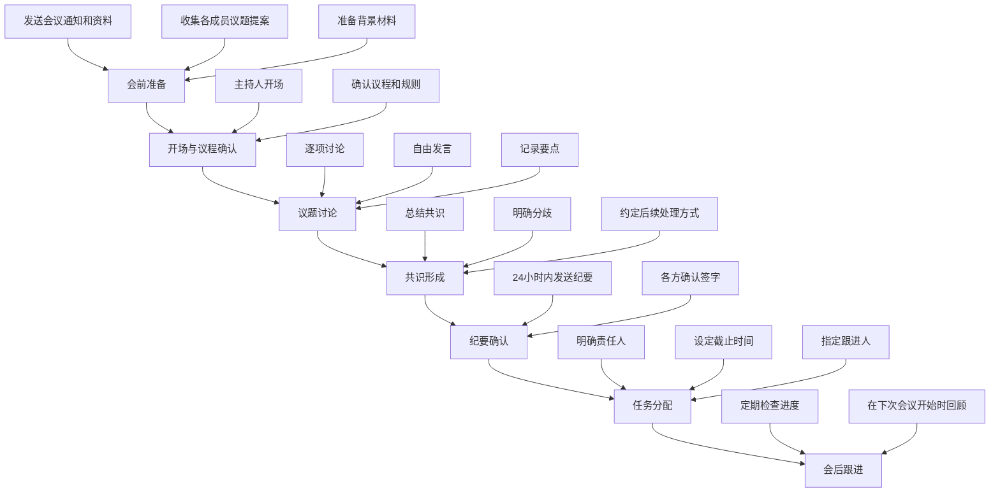
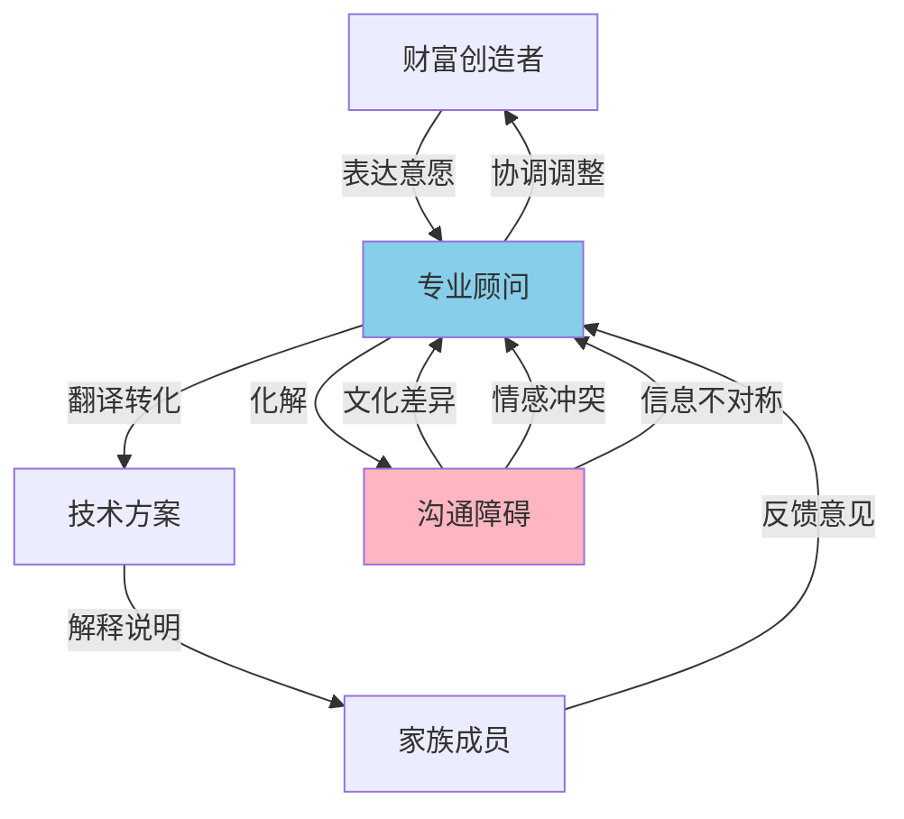

## 八、传承中的沟通艺术

财富传承不仅仅是法律文件和金融工具的组合，其成败往往取决于一个被严重低估的维度——**沟通**。研究显示，超过 70% 的财富传承失败并非源于税务问题或工具选择失误，而是源于家族内部沟通不畅导致的信任崩塌、决策冲突和执行阻力。洛克菲勒家族能够延续七代繁荣，其核心秘诀之一就是建立了完善的家族沟通机制；而许多中国富一代的传承困境，根源恰恰在于"难以启齿"的文化惯性。

### 8.1 为什么沟通是传承成败的关键变量

#### 8.1.1 传承失败的沟通归因

哈佛商学院的调查研究揭示了一个令人震惊的事实：在财富从第一代向第二代转移的过程中，约 65% 的失败案例可以追溯到家族沟通问题，而非技术性错误。

| 失败归因 | 占比 | 典型表现 |
|---------|------|---------|
| 沟通不畅导致的冲突 | 35% | 子女对分配方案不满、兄弟姐妹反目 |
| 缺乏信任和准备 | 25% | 继承人能力不足、未被充分培养 |
| 遗嘱/法律文件争议 | 15% | 遗嘱真实性争议、受益人理解偏差 |
| 税务和财务规划失误 | 12% | 税负过重导致资产被迫变卖 |
| 专业顾问协调失败 | 8% | 律师、会计师、理财师信息不对称 |
| 其他不可控因素 | 5% | 政策变动、市场崩盘等 |

沟通问题占比高达 60%（沟通不畅 35% + 缺乏信任 25%），这一数据说明：**传承规划的核心战场不在律师事务所的会议室，而在家庭的餐桌旁。**

#### 8.1.2 沟通在传承链条中的位置



传承沟通贯穿四个核心阶段：

1. **信息传递阶段**：财富创造者向家族成员和顾问传递传承意愿
2. **方案协商阶段**：各方就传承方案达成共识
3. **执行协调阶段**：确保方案在执行中不走样
4. **反馈调整阶段**：根据实际情况动态修正方案

每个阶段都需要不同类型的沟通技能和策略，任何一个环节的沟通断裂都可能导致整个传承链条的崩溃。

### 8.2 传承沟通的理论基础

#### 8.2.1 家庭系统理论（Family Systems Theory）

Murray Bowen 提出的家庭系统理论为理解传承沟通提供了重要的理论框架。该理论认为，家庭是一个情绪系统，成员之间的情绪联系远比表面上的理性互动更为深刻。

**核心概念在传承沟通中的应用：**

**三角化（Triangulation）**：当两个人之间存在紧张关系时，往往会拉入第三个人来缓解压力。在传承场景中，父亲与长子在经营理念上产生分歧时，可能会通过母亲来传递信息，形成"父亲→母亲→长子"的三角沟通路径。这种模式虽然短期内缓解了直接冲突，但长期来看会扭曲信息、加剧误解。

**差异化水平（Differentiation of Self）**：家庭成员在多大程度上能够在保持与家庭的情感联系的同时，维持独立的思考和判断。差异化水平低的家族成员更容易在传承讨论中被情绪左右，做出非理性决策。

**代际传递（Multigenerational Transmission Process）**：家庭模式会代际传递。如果第一代采取独裁式的沟通方式，第二代很可能会延续这种模式。打破不良的沟通模式循环，是成功传承的关键前提。

#### 8.2.2 非暴力沟通理论（Nonviolent Communication）

Marshall Rosenberg 的非暴力沟通（NVC）模型为传承中的困难对话提供了实用框架：

```text
观察（Observation）→ 感受（Feeling）→ 需要（Need）→ 请求（Request）
```

**传统沟通 vs 非暴力沟通对比：**

| 场景 | 传统沟通方式 | 非暴力沟通方式 |
|------|------------|--------------|
| 讨论分配方案 | "你总是偏心弟弟，什么都不给我" | "当我看到分配方案中弟弟的份额更多时（观察），我感到委屈和不被重视（感受），因为我需要被公平对待（需要），能否请你解释一下分配的依据？（请求）" |
| 表达传承意愿 | "你们都不懂事，我走了你们怎么办" | "当我想起未来可能无法亲自指导你们时（观察），我感到焦虑（感受），因为我希望家族事业能够延续（需要），我们一起制定一个详细的交接计划好吗？（请求）" |
| 讨论经营分歧 | "你的想法太天真了，根本不现实" | "当你提出这个扩张计划时（观察），我有些担忧（感受），因为我经历过类似的风险（需要），你能和我详细讨论一下风险控制措施吗？（请求）" |

#### 8.2.3 跨文化沟通理论

Edward Hall 的高语境/低语境文化理论对理解中国家庭的传承沟通至关重要。

**中国家庭的高语境沟通特征：**

- **含蓄表达**：不直接说"我要把企业传给你"，而是通过暗示、举例、讲故事来传递意图
- **关系导向**：沟通的目的不仅是传递信息，更是维护和加强关系
- **面子机制**：在多人场合讨论敏感话题（如遗产分配）可能损害相关方的面子
- **长幼秩序**：沟通权力结构不对等，晚辈的表达空间受限

这些特征在传承沟通中既是障碍，也可以成为优势。理解这些文化特征，有助于设计符合中国家庭实际的沟通策略。

### 8.3 传承沟通的核心场景与策略

#### 8.3.1 场景一：首次开启传承话题

这是最具挑战性的沟通场景。在中国文化背景下，"谈死"是忌讳，"谈钱"也常被视为不体面。然而，回避这个话题是传承失败的第一步。

**开启话题的三种策略：**

**策略一：借事说理法**

利用外部事件自然引出话题，降低直接开口的尴尬感。

> **示例话术**："最近看新闻，某某企业家突然去世，公司和家庭都乱了套。我在想，咱们家是不是也应该提前做一些安排，免得万一有什么情况，大家都手忙脚乱。"

**策略二：专业引导法**

借助专业人士（如理财规划师、律师）的帮助，在专业咨询的框架下自然引入话题。

> **实施步骤**：
> 1. 以"做个全面的财务规划"为由，邀请家人一起参与咨询
> 2. 让顾问在咨询过程中自然引入传承规划的话题
> 3. 在专业框架下讨论，避免话题过于私人化
> 4. 利用顾问的专业权威，增强话题的严肃性和必要性

**策略三：渐进渗透法**

通过分阶段、分层次的沟通，逐步将传承话题融入日常交流。

| 阶段 | 时间跨度 | 沟通内容 | 目标 |
|------|---------|---------|------|
| 播种期 | 1-3个月 | 偶尔提及身边人的传承故事，分享相关书籍或文章 | 让家人对"传承"有基本认知 |
| 萌芽期 | 3-6个月 | 开始讨论家族历史、价值观、创业故事 | 建立情感连接，铺垫传承意识 |
| 生长期 | 6-12个月 | 正式提出"我们应该做个规划" | 达成"需要规划"的共识 |
| 成熟期 | 12个月以上 | 进入具体方案讨论和制定 | 形成可执行的传承方案 |

#### 8.3.2 场景二：讨论遗产分配方案

这是传承沟通中冲突最高发的场景。"公平"是最大的难题——父母心中的"公平"和子女心中的"公平"往往不是同一个概念。

**分配沟通的四步框架：**

**第一步：确立分配原则**

在讨论具体数字之前，先就分配原则达成共识。常见的分配原则包括：

| 原则 | 含义 | 适用场景 |
|------|------|---------|
| 均等分配 | 所有子女获得相等份额 | 子女情况相近，追求形式公平 |
| 按需分配 | 根据各子女的实际需求分配 | 子女经济状况差异较大 |
| 按贡献分配 | 参与家族事业的子女获得更多 | 家族企业传承场景 |
| 按能力分配 | 能力强的获得更多管理权 | 企业经营权和所有权分离的场景 |
| 混合分配 | 基本均等 + 综合调整 | 大多数家庭的实际选择 |

**原则确定的沟通话术**：

> "我希望我们的传承安排既公平又合理。但'公平'对每个人可能意味着不同的东西。我们先不讨论具体怎么分，而是先聊聊，大家觉得'公平'应该是什么样的？"

**第二步：信息公开透明**

信息不对称是猜忌和冲突的温床。财富创造者应当在适当范围内公开家族资产的基本情况。

> **注意**：公开不等于无保留。以下信息建议公开，以下信息建议保留：
>
> **建议公开**：
> - 家族资产的大致规模和主要构成
> - 传承规划的基本思路和时间表
> - 已设立的法律架构（如信托、遗嘱等）
> - 家族企业的经营状况
>
> **建议审慎**：
> - 具体的资产明细和账户信息（防止信息外泄）
> - 其他家庭成员的具体分配金额（避免比较心理）
> - 敏感的商业秘密和负债情况（防止影响企业经营）

**第三步：逐项讨论协商**

将分配方案拆解为若干个独立的议题，逐一讨论，避免"一锅端"式的强加方案。

> **讨论顺序建议**：
> 1. 先讨论争议最小的事项（如家族房产的使用安排）
> 2. 再讨论中等争议的事项（如投资收益的分配比例）
> 3. 最后讨论争议最大的事项（如家族企业的股权分配）
> 4. 每个事项达成共识后再进入下一个

**第四步：书面确认共识**

口头共识容易被遗忘或扭曲。每次重要讨论结束后，应当形成书面纪要，并由各方签字确认。

```markdown
## 家族传承会议纪要（模板）

**会议日期**：____年____月____日
**参会人员**：________________________
**讨论议题**：________________________

### 达成共识
1. ________________________________
2. ________________________________
3. ________________________________

### 待议事项
1. ________________________________
2. ________________________________

### 下次会议
**时间**：____年____月____日
**议题**：________________________

**签字确认**：
父/母：________  日期：________
子女1：________  日期：________
子女2：________  日期：________
```

#### 8.3.3 场景三：家族企业经营权交接沟通

家族企业传承中的沟通难度远高于单纯的财产分配。它涉及权力、身份、价值观等多重维度，冲突烈度也更高。

**权力交接中的沟通陷阱：**



**渐进式授权的沟通路径：**

| 阶段 | 创始人角色 | 继承人角色 | 关键沟通内容 |
|------|----------|----------|------------|
| 观察期（1-2年） | 决策者 | 观察学习者 | 创始人定期讲解决策逻辑，继承人提出疑问 |
| 参与期（2-3年） | 最终决策者 | 参与决策者 | 继承人参与重大决策讨论，提出建议方案 |
| 共管期（2-3年） | 顾问角色 | 主要决策者 | 继承人主导日常经营，创始人仅参与战略决策 |
| 交接期（1-2年） | 退出经营 | 完全决策者 | 创始人正式退出，继承人独立负责 |

每个阶段之间的过渡都需要充分的沟通：

> **从观察期到参与期的过渡话术**：
>
> 创始人："过去两年你一直在观察和学习，我看得到你的成长。从下个月开始，我想让你参与一些重要决策的讨论。不是让你马上做决定，而是听听你的想法，我们一起分析。你准备好了吗？"

#### 8.3.4 场景四：特殊家庭结构的沟通

再婚家庭、多子女家庭、有特殊需求子女的家庭等，传承沟通面临更为复杂的挑战。

**再婚家庭的沟通要点：**

再婚家庭中，配偶、亲生子女、继子女之间的利益冲突最为尖锐。沟通的核心原则是"分层处理、逐步推进"。

> **沟通策略**：
>
> 1. **先与现任配偶沟通**：就双方各自的财产归属和共同财产的处理达成一致
> 2. **再与各自子女分别沟通**：了解各自子女的期望和顾虑
> 3. **最后在顾问协助下进行家庭会议**：由中立的专业顾问主持，确保各方利益得到平衡表达
>
> **关键话术**：
> "我知道这个话题很敏感，但我们必须面对。我的目标是让每个人——你、我、我们的孩子——都得到公平的对待。'公平'不一定是'一样多'，但一定是经过深思熟虑的、有合理依据的安排。"

**有特殊需求子女的沟通要点：**

当家庭中有残疾子女、未成年子女或其他需要特别照顾的成员时，传承沟通需要额外的敏感度。

> **沟通原则**：
> - 向其他子女解释"倾斜分配"的合理性和必要性
> - 强调"按需分配"不等于"偏心"，而是一种负责任的安排
> - 可以设立特殊需要信托，既保护特殊子女的利益，又消除其他子女的顾虑
> - 通过书面的"致家人信"，详细说明分配逻辑和父母的考量

### 8.4 家族会议的组织与运营

家族会议是传承沟通最正式、最有效的载体。成功的家族会议不是一场随意的家庭聚餐，而是一个有组织、有流程、有规则的制度化平台。

#### 8.4.1 家族会议的类型与频率

| 会议类型 | 参与者 | 频率 | 主要议题 | 时长 |
|---------|--------|------|---------|------|
| 家庭日（Family Day） | 全体家族成员 | 每季度1次 | 家族事务、情感交流、下一代教育 | 半天-1天 |
| 家族理事会 | 核心成员（3-5人） | 每月1次 | 家族治理、资产管理、重大决策 | 2-3小时 |
| 专项会议 | 相关成员 | 按需召开 | 特定议题（如企业出售、房产购置） | 1-2小时 |
| 年度家族大会 | 全体成员+顾问 | 每年1次 | 年度回顾、方案调整、价值观传承 | 1-2天 |

#### 8.4.2 家族会议的标准流程



#### 8.4.3 家族会议的议事规则

没有规则的会议往往沦为争吵或一言堂。建议采用简化版的罗伯特议事规则：

**核心规则清单：**

1. **一人一言**：同一时间只有一个人发言，不打断他人
2. **限时发言**：每个议题每人发言时间不超过 5 分钟（可由主持人调整）
3. **对事不对人**：讨论针对方案和观点，不针对个人进行攻击
4. **主持人中立**：主持人不偏向任何一方，不率先表态
5. **举手表决**：重大决策采用投票制，少数服从多数
6. **记录在案**：所有讨论和决定必须有书面记录
7. **保密原则**：会议内容不向家族外人员透露

**主持人选择建议：**

| 主持人类型 | 优点 | 缺点 | 适用场景 |
|-----------|------|------|---------|
| 家族长辈 | 权威性高，了解家族历史 | 可能不够客观 | 家庭日、情感类议题 |
| 专业顾问 | 中立客观，专业能力强 | 不了解家族情感脉络 | 重大决策讨论 |
| 轮值主持人 | 培养成员参与感 | 可能缺乏主持经验 | 常规家族理事会 |
| 外部调解人 | 高度中立 | 成本较高 | 冲突严重的家庭 |

#### 8.4.4 家族宪章中的沟通条款

成熟的家族会将沟通机制写入家族宪章，使其成为制度化的安排。以下是沟通条款的参考模板：

```markdown
## 第X条 家族沟通制度

### 一、家族会议制度
1. 家族每年召开不少于四次家庭日活动和一次年度家族大会
2. 家族理事会每月召开一次例会
3. 任何家族成员均可提议召开专项会议，经理事会同意后安排
4. 会议通知应提前不少于7天发出，附带议题和背景材料

### 二、信息共享制度
1. 家族资产年度报告应在年度大会上向全体成员公开
2. 家族企业季度经营报告应向家族理事会通报
3. 重大投资决策（单笔超过____万元）应在执行前通报理事会

### 三、争议解决机制
1. 家族成员之间的争议首先通过直接沟通解决
2. 直接沟通无法解决的，提交家族理事会讨论
3. 理事会无法解决的，邀请中立的外部顾问进行调解
4. 调解仍无法解决的，可提交仲裁或诉讼

### 四、沟通培训制度
1. 家族每年组织不少于一次沟通技能培训
2. 鼓励下一代成员参加冲突管理、谈判技巧等课程
3. 新加入家族的成员（如配偶）应参加家族沟通制度的介绍会
```

### 8.5 跨代际沟通的特殊策略

代际沟通障碍是传承沟通中最具挑战性的问题。不同代际成长于不同的时代背景，拥有不同的价值观、沟通方式和信息获取渠道，这些差异如果不被理解和管理，就会成为传承的障碍。

#### 8.5.1 代际沟通差异分析

| 维度 | 第一代（50-70岁） | 第二代（30-50岁） | 第三代（20-30岁） |
|------|-----------------|-----------------|-----------------|
| 沟通媒介 | 面对面、电话 | 微信、邮件 | 社交媒体、短视频 |
| 决策风格 | 经验驱动、直觉判断 | 数据驱动、分析决策 | 创新驱动、快速迭代 |
| 权威观念 | 等级分明、长幼有序 | 相对平等、尊重但不盲从 | 扁平化、追求对话 |
| 风险态度 | 保守稳健 | 适度冒险 | 愿意尝试高风险 |
| 财富观念 | 节俭积累、量入为出 | 投资增值、适度消费 | 体验优先、活在当下 |
| 时间观念 | 长期规划、耐心等待 | 中期规划、适度耐心 | 即时反馈、快速迭代 |

#### 8.5.2 向下沟通：从长辈到晚辈

**原则一：讲故事而非讲道理**

第一代创造者的创业故事和人生智慧，是传承中最宝贵的无形资产。但"说教"只会引发抵触，"讲故事"才能真正传递价值。

> **反面示例**："你们不知道钱有多难赚。我当年白手起家，什么苦都吃过，你们现在条件这么好，应该珍惜。"
>
> **正面示例**："我记得1998年那场危机，公司账上只剩下3万块钱，连下个月的工资都发不出来。当时我每天晚上睡不着觉，但我做了一个决定——把家里的房子抵押出去。你妈妈虽然担心，但她支持了我。三个月后，市场回暖，我们挺过来了。我想说的是，创业需要勇气，但更需要家人的支持。"

**原则二：给予空间而非强加安排**

年轻一代需要被赋予选择权和试错空间。强制安排只会引发逆反心理。

> **实施建议**：
> - 提供多个传承方案供选择，而非只给一个"最优解"
> - 允许继承人在一定范围内犯错，将错误视为学习成本
> - 设置"安全边界"（如单笔投资不超过总资产的5%），在边界内给予自由

**原则三：使用对方习惯的沟通方式**

不要强迫年轻人用你习惯的方式沟通。如果他们更习惯用微信群讨论，那就建一个家族群；如果他们更喜欢看PPT而非听长篇大论，那就把方案做成可视化文档。

#### 8.5.3 向上沟通：从晚辈到长辈

年轻一代如果想主动参与传承讨论，需要特别注意方式方法。

**尊重权威的同时表达观点：**

> **不建议**："爸，你那个方案太落后了，现在没人这么做了。"
>
> **建议**："爸，我理解你的想法，这在当时确实是最稳妥的方案。我最近研究了一些新的工具，可能能帮我们解决一些你之前担心的问题。你有时间的话，我想和你详细聊聊。"

**用数据和案例支撑观点：**

> "我研究了国内50个家族企业的传承案例，发现采用信托架构的家庭，二代接班后的资产保全率比直接继承高出40%。我想我们可以参考一下。"

**选择合适的时机和场合：**

- 不要在公开场合提出反对意见（给长辈留面子）
- 不要在长辈忙碌或疲惫时讨论重要问题
- 可以先私下单独沟通，达成初步共识后再在家庭会议上正式讨论

### 8.6 专业顾问在传承沟通中的角色

专业顾问不仅仅是技术方案的设计者，更是传承沟通的重要催化剂和协调者。

#### 8.6.1 顾问作为沟通桥梁



**顾问在沟通中的四大功能：**

1. **翻译功能**：将财富创造者的模糊意愿转化为清晰的法律和财务方案；将复杂的税务和法律术语转化为家族成员能理解的语言
2. **缓冲功能**：在情绪激烈的讨论中充当缓冲器，防止冲突升级
3. **催化功能**：引导讨论方向，确保所有重要议题都被覆盖
4. **执行功能**：将口头共识转化为法律文件，确保方案可执行

#### 8.6.2 如何选择和管理顾问团队

**理想的传承顾问团队构成：**

| 角色 | 专业背景 | 主要职责 | 选择标准 |
|------|---------|---------|---------|
| 传承规划师 | 金融/法律复合背景 | 整体方案设计和协调 | 有家族传承实操经验 |
| 家族律师 | 继承法/公司法 | 遗嘱、信托等法律文件 | 熟悉家族治理法律框架 |
| 税务顾问 | 税务/会计 | 税务优化方案 | 了解境内外税务规则 |
| 心理咨询师 | 家庭治疗/心理咨询 | 家族关系调适 | 有家族企业咨询经验 |
| 投资顾问 | 财富管理 | 资产配置和管理 | 有超高净值客户服务经验 |

**管理顾问团队的关键原则：**

- 统一协调人：指定一位总协调人（通常为传承规划师），避免各顾问各自为政
- 定期联席会议：顾问团队至少每季度碰面一次，同步信息、协调方案
- 保密协议：所有顾问必须签署保密协议，保护家族隐私
- 利益冲突审查：确认顾问之间不存在利益冲突

### 8.7 传承沟通中的常见错误与纠正

#### 8.7.1 错误一：回避沟通，寄望于遗嘱

**典型表现**：认为"只要遗嘱写好就行了"，从不与家人讨论传承安排。

**后果分析**：当遗嘱首次被公开时（通常是在葬礼之后），家人可能因为完全不了解分配逻辑而产生强烈的震惊和不满。此时沟通已经不可能——逝者无法解释自己的决定。

**纠正方法**：遗嘱只是沟通的结果，而非替代品。在制定遗嘱的过程中，应尽可能多地与家人沟通，让他们理解和接受分配方案。

#### 8.7.2 错误二：独断专行，不听取意见

**典型表现**：财富创造者单方面制定方案，要求家人无条件接受。

**后果分析**：这种做法即使方案本身是合理的，也会因为缺乏参与感而遭到抵制。更重要的是，它剥夺了继承人的学习和成长机会。

**纠正方法**：采用"提出框架→征求意见→修改完善→达成共识"的四步流程。即使最终方案与初始方案差异不大，征求意见的过程本身就是沟通的一部分。

#### 8.7.3 错误三：公平等于平均

**典型表现**：简单地将资产平均分配给所有子女，认为这就是"公平"。

**后果分析**：平均分配看似公平，实则可能不公平。参与家族企业经营的子女和未参与的子女、经济状况不同的子女、照顾父母程度不同的子女，简单的平均分配可能忽视了这些差异。

**纠正方法**：区分"公平"和"平均"的概念。与家人讨论"公平"的定义，建立多维度的分配原则。在基本均等的基础上，引入"贡献系数""需求系数""照顾系数"等调整因子。

#### 8.7.4 错误四：忽视"不在场"的人

**典型表现**：讨论传承方案时只考虑在场的家庭成员，忽视了配偶、未成年子女、尚未出生的后代等"不在场"的利益相关者。

**后果分析**：配偶（尤其是儿媳/女婿）可能对方案有重大异议但没有表达渠道；未成年子女的利益可能被忽视；未来出生的子女可能不在方案的考虑范围内。

**纠正方法**：识别所有利益相关者，确保他们的利益在方案中得到适当考虑。对于无法直接参与讨论的成员（如未成年子女），可以安排代理人或在方案中设置保护性条款。

#### 8.7.5 错误五：沟通一次就够了

**典型表现**：开了一个家庭会议，达成了一些共识，就认为沟通工作完成了。

**后果分析**：家庭成员的情况在不断变化（婚姻、生育、事业、健康等），市场环境和法律政策也在变化。一次性的沟通无法覆盖所有变化。

**纠正方法**：建立定期沟通机制（如家族会议制度），将沟通制度化、常态化。至少每年对传承方案进行一次全面回顾和调整。

### 8.8 数字时代的传承沟通

#### 8.8.1 数字工具在传承沟通中的应用

| 工具类型 | 具体工具 | 应用场景 | 注意事项 |
|---------|---------|---------|---------|
| 视频会议 | 腾讯会议、Zoom | 异地家庭成员参与讨论 | 重要决策仍建议面对面 |
| 协作文档 | 腾讯文档、飞书 | 共同编辑方案、实时反馈 | 设置权限，保护隐私 |
| 家族网站 | 定制化私有平台 | 信息发布、历史记录 | 加强安全防护 |
| 密码管理 | 1Password、Bitwarden | 数字资产和账户信息管理 | 定期更新，双人备份 |
| 区块链存证 | 司法区块链 | 遗嘱、承诺的不可篡改记录 | 了解法律效力 |

#### 8.8.2 数字遗产的沟通

随着数字资产（加密货币、社交媒体账号、数字藏品等）在财富中的占比不断增加，关于数字遗产的沟通变得越来越重要。

**数字遗产沟通清单：**

- [ ] 盘点所有重要的数字资产和在线账户
- [ ] 记录各账户的访问方式和恢复途径
- [ ] 说明每个数字资产的处理意愿（保留、转移、注销、变现）
- [ ] 指定数字遗产的管理人
- [ ] 将上述信息存储在安全且可被继承人获取的位置

> **特别提醒**：不要将密码直接写在遗嘱中（遗嘱会公开存档）。应使用独立的密码管理工具，并将主密码存储在保险箱或信托文件中。

### 8.9 传承沟通能力的自我提升

#### 8.9.1 沟通能力评估框架

在开始提升之前，先对自己的传承沟通能力做一个评估：

| 评估维度 | 低分表现（1-3分） | 中等表现（4-6分） | 高分表现（7-10分） |
|---------|-----------------|-----------------|-----------------|
| 主动性 | 从未主动提过传承话题 | 偶尔提及但不深入 | 定期组织传承讨论 |
| 倾听力 | 只顾表达自己的想法 | 会听取但不深入理解 | 积极倾听并确认理解 |
| 清晰度 | 表达含糊，让人猜 | 基本清楚但有遗漏 | 表达清晰、完整、有条理 |
| 共情力 | 忽视他人感受 | 会考虑但优先级低 | 深度理解并回应他人情感 |
| 冲突管理 | 回避或激化冲突 | 能处理简单冲突 | 善于化解复杂冲突 |
| 制度化 | 完全没有制度 | 有一些零散安排 | 有完善的沟通制度 |

#### 8.9.2 提升路径建议

**初级阶段（0-3个月）——打破沉默**：

1. 阅读 1-2 本关于家族传承沟通的书籍（推荐《The Legacy Family》《富过三代》）
2. 与配偶进行一次深度的传承话题交流
3. 制作一份简单的家庭资产清单，与核心家人分享

**中级阶段（3-12个月）——建立机制**：

1. 召开第一次正式的家庭会议
2. 起草家族宪章初稿
3. 建立定期沟通的制度（如每季度一次家庭日）
4. 邀请专业顾问参与一次家庭讨论

**高级阶段（12个月以上）——持续优化**：

1. 完善家族治理体系，将沟通机制写入宪章
2. 培养下一代的沟通能力和传承意识
3. 建立冲突预警和调解机制
4. 定期回顾和优化沟通制度

### 8.10 本节小结

传承沟通是一门需要持续修炼的艺术。它不是一次性的事件，而是一个贯穿整个传承过程的持续性活动。成功的传承沟通需要做到以下几点：

1. **尽早开始**：不要等到"不得不谈"的时候才开始沟通。越早开始，越有从容调整的空间
2. **制度保障**：将沟通机制制度化，建立家族会议、信息共享、争议解决等制度
3. **尊重差异**：理解代际差异和个体差异，采用灵活多样的沟通方式
4. **专业支持**：善用专业顾问的桥梁作用，特别是在高冲突场景中
5. **持续迭代**：传承沟通不是一劳永逸的，需要根据家庭情况和外部环境的变化持续调整

记住：**再完美的法律文件也无法替代人与人之间的真诚对话。** 财富传承的终极目标不是将资产从一个账户转移到另一个账户，而是将家族的价值观、智慧和爱传递给下一代。而这一切，只有通过有效的沟通才能实现。

***
