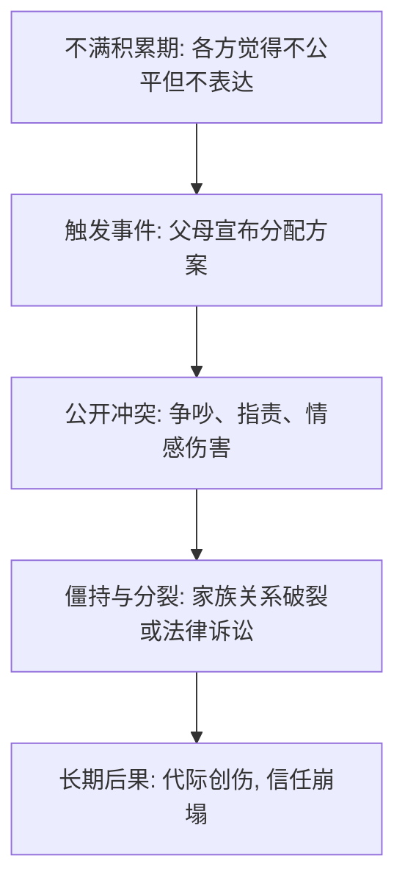
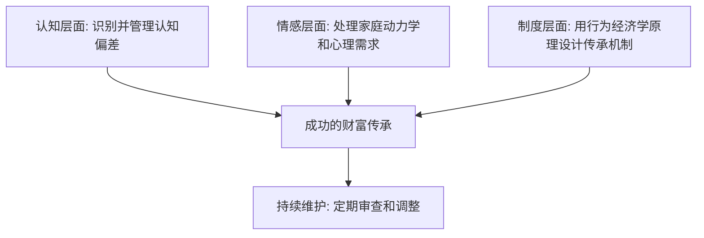

## 九、财富传承中的心理与行为经济学

财富传承表面上是法律和金融问题，本质上是**人的心理问题**。斯坦福大学商学院对500个家族企业的跟踪研究显示，传承失败的案例中，仅有15%源于税务或法律失误，**超过65%的失败源于家庭内部的心理冲突和行为决策失误**。理解心理学和行为经济学原理，是成功传承的认知基础。

本章从三个维度展开：传承决策中的认知偏差（为什么人们会做出不合理的传承决策）、传承中的情感与家庭动力学（家庭关系如何影响传承结果）、以及行为干预策略（如何利用行为经济学原理设计更优的传承机制）。

### 9.1 传承决策中的认知偏差

行为经济学奠基人Daniel Kahneman和Amos Tversky的研究表明，人类决策系统性地偏离理性模型。在财富传承场景中，这些偏差的影响被放大——因为传承决策的后果跨越代际，且往往不可逆。

#### 9.1.1 现状偏差（Status Quo Bias）

**定义与机制**：Samuelson和Zeckhauser（1968）首次系统描述了这一现象——人们倾向于维持当前状态，即使改变能带来更好的结果。在传承场景中，现状偏差表现为"不立遗嘱""不设信托""不讨论传承计划"。

**深层原因**：
- **决策成本不对称**：不行动不需要承担决策责任，而行动可能带来"如果做错了"的后悔感
- **可得性偏差的叠加**：人们更容易想象"改了之后出问题"的场景，而非"不改之后出问题"的场景
- **默认选项的力量**：在没有任何安排的情况下，默认选项就是"一切保持现状"，而人类心理将默认选项等同于推荐选项

**数据佐证**：Caring.com 2023年调查显示，美国55岁以上成年人中，仅有33%立有遗嘱。中国的情况更为严峻——根据中华遗嘱库数据，截至2023年底，全国仅有约45万人登记遗嘱，而60岁以上人口超过2.6亿。

**真实案例**：2018年，一位拥有约2亿元资产的深圳企业家突然去世，未留下任何遗嘱。其妻子、父母和三个子女陷入长达4年的遗产诉讼。期间企业无人管理导致核心客户流失，资产价值缩水超过60%。最终法院判决的分配方案与任何一个家庭成员的期望都不一致。

**纠正策略**：
1. 设置"反现状"默认选项——例如每年1月1日自动触发家族财富审查会议
2. 将"不决策"的后果具象化——列出如果今天发生意外，资产会按什么法定路径分配
3. 引入外部触发点——每五年生日或重大生命事件时，强制启动传承计划审视

#### 9.1.2 过度自信偏差（Overconfidence Bias）

**定义与机制**：财富创造者往往对自己的判断过度自信。这种偏差有三种表现形式：
- **过度精确**：对自己寿命、健康、市场回报的预测过于确定
- **过高估计**：高估自己管理复杂局面的能力
- **过高定位**：认为自己的传承方案优于平均水平

**传承场景中的典型表现**：
- "我身体很好，现在考虑后事太早了"
- "我的企业会一直这么赚钱，不需要特别安排"
- "我的孩子们不会因为遗产闹矛盾"
- "我能活到90岁"（统计上只有一半概率）

**量化分析**：过度自信偏差会导致财富创造者系统性地**延迟传承规划**、**低估风险准备金需求**、**高估继承人的管理能力**。一项对200位企业家的调查显示，72%认为自己"比大多数同龄人更健康"，但客观健康指标显示，这一群体的心血管疾病和代谢综合征发病率与普通人群无显著差异。

**纠正策略**：
1. 使用"预验尸"技术（pre-mortem）：假设传承已经失败，回溯可能的原因
2. 引入外部第三方评估——专业顾问的客观视角可以有效对冲过度自信
3. 建立定期健康和财务压力测试机制

#### 9.1.3 损失厌恶（Loss Aversion）

**定义与机制**：Kahneman和Tversky的前景理论指出，损失带来的痛苦约是等量收益带来快乐的**2-2.5倍**。在传承决策中，将资产转移给下一代会让财富创造者产生强烈的"失去"感受，即使这种转移在理性上是必要的。

**传承中的具体表现**：
- 不愿在生前进行资产转移——"钱在我手里最安全"
- 对信托安排的抗拒——"万一我需要这些钱怎么办"
- 对企业股权稀释的过度恐惧——即使代际交替需要逐步放权

**心理学根源**：对很多财富创造者来说，财富不仅是物质资源，更是**身份认同和权力象征**。失去财富意味着失去社会地位、家庭话语权和自我价值感。这种心理联结使得传承从一个"理性的资产配置问题"变成了"自我认同的存在性威胁"。

**纠正策略**：
1. 重新框架传承——不是"失去财富"，而是"扩展影响力"（从个人到家族）
2. 采用渐进式转移——分阶段、小步骤地放权，降低每次"损失"的心理冲击
3. 设计"保留条款"——在转移资产的同时保留一定收益权或决策参与权
4. 将注意力从"失去的"转移到"获得的"——例如，获得的是看到下一代成长的满足感

#### 9.1.4 锚定效应（Anchoring Effect）

**定义与机制**：Tversky和Kahneman（1974）发现，人们在做数值估计时，会被最先接触到的数字强烈影响，即使这个数字是随机的。在传承场景中，锚定效应有多种表现形式。

**传承中的典型锚定**：
- **时间锚**："我父亲60岁才做传承规划，我不用着急"（忽略环境已完全不同）
- **金额锚**："企业当年值5000万"（忽略当前实际估值可能已变化数倍）
- **分配锚**："当年我和兄弟每人分了50%"（不代表这个比例对当前家庭仍然最优）
- **情绪锚**："上次家庭会议上吵了一架"（将一次不愉快的体验泛化为"传承讨论必然引发冲突"）

**案例分析**：一位上海房产投资者在2008年时将名下6套房产分配方案定为"三套给大儿子，三套给小儿子"。到2023年，由于不同区域房价涨幅差异巨大，大儿子获得的三套房产总价值约4500万，小儿子的三套仅约1800万。但父亲始终以2008年"大致公平"的记忆为锚，拒绝重新调整方案。

**纠正策略**：
1. 建立定期资产评估机制，用最新数据替代旧有参照
2. 在做传承决策前，明确列出所有相关的"锚"并评估其是否仍然适用
3. 使用"反锚"技术——故意从相反的角度审视决策

#### 9.1.5 沉没成本谬误（Sunk Cost Fallacy）

**定义**：人们倾向于基于已经投入的成本（时间、金钱、精力）继续当前路径，即使理性上应该放弃。

**传承中的表现**：
- "我在这家企业干了30年，不能让外人来管"（忽略子女可能不适合接手）
- "这个投资我已经持有15年了"（忽略它可能已经不再适合当前的资产配置目标）
- "我花了500万建的厂房，不能卖"（忽略它的机会成本和实际产出）

**纠正策略**：引导决策者关注"从今天起，什么是最好的选择"，而非"过去投入了多少"。

#### 9.1.6 代表性偏差（Representativeness Heuristic）

**定义**：人们倾向于根据表面相似性来判断事物，而忽略基础概率和统计规律。

**传承中的表现**：
- "大儿子最像我，所以最适合接班"（性格相似≠经营能力）
- "他读了MBA，一定能管好企业"（学历≠管理能力）
- "隔壁老王家的信托出了问题，所以信托不靠谱"（个案≠普遍规律）

**纠正策略**：使用结构化评估工具（如胜任力模型、360度反馈）替代直觉判断。

#### 9.1.7 框架效应（Framing Effect）

**定义与机制**：同样的信息，用不同的方式呈现，会导致截然不同的决策。Tversky和Kahneman的经典实验证明，即使是专业决策者也难以免疫框架效应。

**传承中的应用**：
- "你将获得100万元"vs"你将获得家族财富的10%"——后者更能激发家族认同感和责任意识
- "每年可以从家族基金领取50万"vs"每年家族基金为你保留50万的使用权"——同样的事实，前者暗示"施舍"，后者暗示"权利"
- "如果你不参与家族企业管理，你的股权将被稀释"vs"参与管理的成员将获得额外的认可和激励"——前者是惩罚框架，后者是奖励框架

### 9.2 传承中的情感与家庭动力学

传承不仅是资产的重新分配，更是**家庭关系的重新洗牌**。美国心理学家Murray Bowen的家庭系统理论为理解传承中的情感动力学提供了重要框架。

#### 9.2.1 公平感的主观性

**核心矛盾**：每个家庭成员对"公平"的理解可能完全不同。研究表明，至少存在四种公平观：

| 公平观 | 定义 | 支持者典型心态 | 潜在问题 |
|--------|------|--------------|---------|
| 均等分配 | 每人分到相同数额 | "大家都是一样的，凭什么你多我少" | 忽略需求差异和贡献差异 |
| 按需分配 | 需要更多的人得到更多 | "弟弟身体不好，应该多照顾他" | 可能被滥用，激励依赖行为 |
| 按贡献分配 | 贡献大的人得到更多 | "我帮爸打了10年工，凭什么和不干事的弟弟一样" | 贡献难以量化 |
| 按能力分配 | 能力强的人获得更多管理权 | "企业交给能管好的人" | 能力评估本身可能有偏见 |

**冲突升级模型**：公平感冲突通常经历四个阶段——

**实操建议**：在宣布正式方案之前，先进行"公平感知调查"——分别与每个家庭成员私下沟通，了解他们心目中的"公平"是什么。这不能消除差异，但能让冲突在可控环境中暴露，而非在正式场合爆发。

#### 9.2.2 代际信任的建立

**信任的三个维度**（基于Mayer等人的信任理论）：
1. **能力信任**（Ability）：相信下一代有能力管理和经营资产
2. **善意信任**（Benevolence）：相信下一代会从家族整体利益出发行事
3. **正直信任**（Integrity）：相信下一代会遵守家族规则和价值观

**信任发展的阶段模型**：

| 阶段 | 时间跨度 | 关键任务 | 常见障碍 |
|------|---------|---------|---------|
| 观察期 | 继承人20-30岁 | 了解其品格、能力、价值观 | 代际沟通不足 |
| 试炼期 | 继承人30-40岁 | 在可控范围内给予实践机会 | 过度保护或过度放任 |
| 扶持期 | 继承人40-50岁 | 逐步移交实质性权力 | 创始人难以放手 |
| 过渡期 | 创始人60岁+ | 完成交接，退居顾问角色 | 缺乏明确的退出机制 |

**信任崩塌的典型场景**：
- 继承人出现重大财务失误（如不当投资、个人债务）
- 家族成员之间的利益冲突公开化
- 继承人的生活方式与家族价值观严重冲突
- 外部婚姻关系对家族资产构成威胁

#### 9.2.3 "放手"的心理学

**难以放手的深层原因**：
- **身份认同危机**：对很多创始人来说，"企业家""家长"是核心身份标签，放手意味着失去自我
- **死亡焦虑的转移**：传承规划隐含着对自身有限性的承认，很多人通过回避传承来回避死亡焦虑
- **控制感需求**：长期的决策权形成心理惯性，放手会产生失控感和焦虑
- **遗产焦虑**：担心下一代会"败家"，自己的毕生心血付之东流

**心理学家Robert Kegan的"成人发展理论"**指出，真正能够优雅放手的人通常达到了"自我转化"的发展阶段——他们的自我价值不依赖于外在的角色和控制权。

**实操"放手训练"**：
1. **角色缩减计划**：每年减少一个自己直接管理的事务，逐步培养"不在场"的管理能力
2. **导师角色转型**：从"做决定的人"转型为"提供咨询的人"，关键是只在被请求时才提供意见
3. **个人意义重构**：找到传承之外的人生意义来源——公益、教育、艺术、旅行等
4. **心理支持**：必要时寻求专业心理咨询，处理与放手相关的焦虑和悲伤

#### 9.2.4 继承人的心理压力

传承讨论往往只关注创始人的心理，忽略了继承人同样承受巨大压力：

- **能力焦虑**：担心自己不如父母，无法胜任管理者角色
- **身份困惑**：财富是"我的"还是"我父母的"？如何建立独立的自我认同？
- **道德绑架**：被期望继承家族事业，而非追求自己的兴趣
- **内疚感**：享受未曾自己挣得的财富所带来的内疚
- **兄弟姐妹竞争**：为了获得父母认可而形成的长期心理竞争

**"银勺综合征"（Silver Spoon Syndrome）**：部分继承人在优渥环境中长大，缺乏挫折经历，导致自我效能感低下、延迟满足能力不足、风险感知能力弱。这不是道德缺陷，而是环境塑造的心理模式，需要通过系统性干预来修正。

#### 9.2.5 手足关系与传承冲突

**兄弟姐妹竞争的心理学根源**（Alfred Adler个体心理学）：
- **出生顺序效应**：长子/长女通常更具责任感但更保守，次子/次女更具竞争意识，幼子/幼女可能更擅长社交但也更依赖
- **家庭星座理论**：每个孩子在家庭中的"位置"不同，形成不同的性格模式和价值观
- **父母偏好的感知**：即使父母自认为公平，子女往往能感知到（或误认为存在）偏爱

**兄弟姐妹冲突在传承中的常见爆发点**：
1. 股权分配比例
2. 企业管理权归属
3. 家族房产和实物资产的分配
4. 父母养老责任的分担
5. 对"外姓配偶"的接纳程度
6. 家族企业中不同家庭分支的利益平衡

**预防和调解策略**：
- 建立正式的家族议事规则，将冲突在制度框架内解决
- 引入中立的家族顾问或调解人
- 区分"所有权""管理权""收益权"——不同维度可以有不同的分配方案
- 鼓励兄弟姐妹发展各自的专业领域，减少直接竞争

### 9.3 行为经济学在传承机制设计中的应用

理解了认知偏差和情感动力学之后，关键问题是：**如何设计传承机制来对冲这些非理性因素？** 行为经济学的"选择架构"（Choice Architecture）理论提供了系统性的解决方案。

#### 9.3.1 默认选项设计（Default Design）

**原理**：Johnson和Goldstein（2003）的研究表明，器官捐献的同意率在"默认同意"（opt-out）国家高达90%以上，而在"默认不同意"（opt-in）国家仅为15%左右。默认选项对行为有巨大的引导作用。

**传承中的应用**：
- **自动加入机制**：家族新成员（如新婚配偶、新生儿）自动成为家族信托的受益人，而非需要主动申请
- **自动再投资**：家族基金的收益默认自动再投资，除非受益人主动申请领取
- **默认的定期沟通**：家族会议默认每季度举行一次，除非家族投票决定调整频率
- **默认的风险管理**：家族资产的一定比例默认配置于保守型资产，调整需要投资委员会批准

**设计原则**：
1. 默认选项应该是对大多数人最有利的选择
2. 保留自由退出（opt-out）的权利，但让退出有一定"摩擦成本"
3. 默认选项应该透明，所有家族成员都知道默认设置是什么

#### 9.3.2 承诺机制（Commitment Devices）

**原理**：Thaler和Sunstein在《Nudge》中指出，人类倾向于做出对自己长期利益有利的"元决策"（meta-decisions），但在执行层面往往会因为短期诱惑而偏离。承诺机制帮助锁定长期决策。

**传承中的承诺机制设计**：

| 承诺类型 | 具体设计 | 执行机制 |
|---------|---------|---------|
| 时间承诺 | "创始人在70岁前完成管理权移交" | 家族宪章明文规定，第三方监督 |
| 行为承诺 | "每年至少举行4次家族会议" | 家族秘书负责日程安排和记录 |
| 财务承诺 | "每年将净利润的5%投入家族发展基金" | 家族CFO管理，年度审计 |
| 学习承诺 | "继承人须完成指定的管理培训" | 培训费用由家族基金承担 |
| 透明度承诺 | "所有家族企业财务信息每季度向全体成员公开" | 独立审计师监督 |

**惩罚机制的设计**：承诺需要约束力才能生效。建议设计"阶梯式惩罚"——第一次违反给予提醒，第二次违反暂时限制部分权利，第三次违反启动正式的争议解决程序。惩罚力度要适度，过重会导致承诺机制本身被规避。

#### 9.3.3 选择简化与信息架构

**原理**：选择过多会导致"决策瘫痪"（Decision Paralysis）。Iyengar和Lepper（2000）的果酱实验证明，选择从6种增加到24种时，购买率反而从30%下降到3%。

**传承中的应用**：
- 遗产分配方案不宜提供超过3-4个选项
- 家族投资选择应由专业委员会筛选后呈现给成员
- 家族宪章应分为"核心不可修改条款"和"可调整的实施细则"两个层级
- 传承方案应有清晰的"一页纸版本"，避免用海量法律术语让家庭成员无所适从

#### 9.3.4 社会规范与社会证明

**原理**：Cialdini的研究表明，人们倾向于参照他人的行为来决定自己的行为。在传承场景中，社会规范可以成为强大的行为引导力量。

**应用策略**：
- 引用同行业、同阶层家族的传承案例作为参照——"很多像我们这样的家族都这样做"
- 在家族内部建立"传承榜样"——成功完成交接的家族成员可以获得公开认可
- 组织家族间的交流活动，让年轻一代看到同龄人如何承担传承责任
- 使用数据展示不规划传承的风险——用统计数字而非说教来影响决策

#### 9.3.5 心理账户（Mental Accounting）

**定义**：Thaler提出，人们会在心理上将资金划入不同的"账户"，并对不同账户的钱有不同的态度和行为模式。

**传承中的应用**：
- 将家族财富划分为"保障基金""发展基金""公益基金"等不同心理账户
- 每个账户对应不同的投资策略和支出规则
- 继承人可以自由管理"发展基金"，但"保障基金"的支出需要严格审批
- 这种分账户方式既给予继承人自主空间，又保护了家族财富的核心安全

### 9.4 "突然继承"的心理冲击

**"突然财富综合征"（Sudden Wealth Syndrome）**：当一个人突然获得大额财富时（无论来源是彩票、遗产还是创业退出），往往会经历一系列心理冲击。

**典型心理反应阶段**：

**各阶段特征与应对**：

| 阶段 | 典型表现 | 持续时间 | 关键应对 |
|------|---------|---------|---------|
| 震惊与否认 | 不敢相信，回避处理 | 数天到数周 | 给予缓冲时间，不要急于做重大决定 |
| 兴奋与过度消费 | 报复性消费，随意借贷给亲友 | 数周到数月 | 设置消费冷静期，引入财务顾问 |
| 焦虑与信任危机 | 不知道该信任谁，担心被利用 | 数月 | 建立可信赖的顾问团队，限制信息传播范围 |
| 身份困惑 | "这些钱是我的吗？""我是谁？" | 持续数月甚至数年 | 心理咨询，探索自我价值的非财务来源 |
| 整合与适应 | 建立健康的财富观和生活习惯 | 长期过程 | 持续的财务教育和心理支持 |

**预防措施**：
1. **渐进式财富转移**：避免一次性大额传承，分批次、有节奏地进行
2. **前置教育**：在继承发生前就开始对继承人进行财务素养和心理准备教育
3. **顾问团队预置**：在继承发生前就建立好律师、会计师、心理咨询师等顾问关系
4. **家族治理框架**：通过家族宪章、信托结构等制度性安排来约束冲动决策

### 9.5 代际心理差异与传承沟通

#### 9.5.1 代际价值观差异

不同世代在财富观、风险偏好和人生目标上存在显著差异，这些差异直接影响传承的有效性。

| 维度 | 创业一代（50-70岁） | 继承二代（30-50岁） | 孙辈（18-30岁） |
|------|-------------------|-------------------|---------------|
| 财富观 | 财富 = 安全感 | 财富 = 选择权 | 财富 = 意义感 |
| 风险偏好 | 保守，重视保值 | 适度进取 | 两极化：极保守或极激进 |
| 工作态度 | 工作即人生 | 追求工作与生活平衡 | 追求兴趣驱动的事业 |
| 沟通方式 | 面对面，权威式 | 邮件/电话，协商式 | 即时通讯，平等式 |
| 社会责任 | 慈善捐赠 | ESG投资 | 社会企业、影响力投资 |

#### 9.5.2 传承沟通的有效方法

**"财富对话"的五个层次**（基于Virginia Satir家庭治疗模型）：

1. **事实层**：分享家族财务的基本状况——资产总额、投资组合、法律结构
2. **观点层**：讨论对财富和传承的看法——什么是"足够"？财富的目的是什么？
3. **感受层**：表达对传承的情感——恐惧、期待、不满、感激
4. **需求层**：探索深层需求——安全感、被认可、自主性、公平
5. **愿景层**：共同描绘家族的未来——五年、十年、二十年后，家族应该是什么样子？

**沟通策略**：
- 从第一层开始，逐步深入，不要跳过
- 使用"我"句式而非"你"句式——"我担心"而非"你总是"
- 设定时间限制——每次讨论不超过2小时，避免疲劳导致情绪失控
- 每次讨论后有书面记录，避免"各说各话"的记忆偏差
- 引入专业引导者（family facilitator）处理高度敏感议题

### 9.6 常见误区与纠正

#### 误区一："传承规划只需要考虑财务和法律"

**现实**：财务和法律是工具层面，心理和关系才是底层逻辑。即使有了最完善的信托结构，如果家庭内部充满猜忌和怨恨，传承仍然会失败。

**纠正**：将心理评估和家庭关系诊断纳入传承规划流程。在设计方案之前，先了解每个家庭成员的心理状态、需求和顾虑。

#### 误区二："公平就是平均分配"

**现实**：平均分配只在一种情况下是公平的——当所有家庭成员的需求、能力和贡献都完全相同时。这种条件几乎永远不成立。

**纠正**：公平不等于平均。真正的公平需要考虑需求差异、能力差异、贡献差异和期望差异。关键是分配过程的透明和参与性，而非结果的数学平均。

#### 误区三："孩子们还小，不需要现在考虑"

**现实**：行为模式和财务习惯在年轻时就已形成。等到"需要"的时候再教育，往往为时已晚。

**纠正**：从孩子进入青少年期就开始有意识地培养财务素养和家族责任感。这不是在"讨论遗产"，而是在"培养未来的管理者"。

#### 误区四："我不在了就管不了了"

**现实**：通过家族治理结构、信托条款、投资政策声明等工具，创始人可以在生前就建立长期有效的管理框架。

**纠正**：将"管不了"的心态转变为"提前建好框架"。用制度替代个人，用规则替代直觉。

#### 误区五："找个好律师就够了"

**现实**：法律工具解决的是"如何执行"的问题，但"执行什么"的决策往往取决于心理学。一个技术上完美但心理上不可接受的方案，注定无法执行。

**纠正**：传承规划团队应该包括律师、税务顾问、心理咨询师和家族顾问。至少在方案设计阶段，需要心理学专业人士的参与。

#### 误区六："谈钱伤感情，所以不谈"

**现实**：不谈钱不会消除矛盾，只会让矛盾在暗处发酵，最终在最不适当的时机爆发。

**纠正**：有结构、有引导的财富对话远好过无结构的争吵。建立定期的家族沟通机制，让讨论成为常态而非例外。

### 9.7 行为经济学工具箱：传承决策的质量检查清单

以下是基于行为经济学研究整理的实用检查清单，用于在做出传承决策时进行系统性的偏差审查：

**决策前检查**：
- [ ] 我是否因为"一直这么做"而拒绝改变？（现状偏差检查）
- [ ] 我是否过度自信，低估了不确定性？（过度自信检查）
- [ ] 我是否被某个特定数字或时间点锚定？（锚定效应检查）
- [ ] 我是否因为已经投入了很多而不愿放弃？（沉没成本检查）
- [ ] 我是否根据直觉而非数据做判断？（代表性偏差检查）
- [ ] 我是否只考虑了最坏或最好的情况？（可得性偏差检查）

**方案评估检查**：
- [ ] 这个方案换一种方式表述，我还会同样接受吗？（框架效应检查）
- [ ] 如果这是我第一次看到这个方案，我还会选择它吗？（剥离锚定后的重新评估）
- [ ] 如果一个我尊重的人提出相反的方案，我会如何反应？（反对意见测试）
- [ ] 五年后回看，我会为这个决定感到骄傲吗？（时间透视检查）

**执行检查**：
- [ ] 是否有承诺机制来确保方案的执行？（承诺机制检查）
- [ ] 默认选项是否引导了好的行为？（默认设计检查）
- [ ] 信息是否以易于理解的方式呈现？（信息架构检查）
- [ ] 是否预留了修订和调整的空间？（灵活性检查）

### 9.8 进阶专题：神经经济学视角下的传承决策

神经经济学（Neuroeconomics）结合神经科学、心理学和经济学，通过脑成像技术研究人类的经济决策机制。以下是与传承决策相关的关键发现：

**前额叶皮层与延迟满足**：前额叶皮层负责长期规划和延迟满足。年龄增长导致前额叶功能下降，这解释了为什么一些年长的财富创造者更难做出需要"延迟收益"的传承决策。

**杏仁核与损失厌恶**：杏仁核在感知威胁和产生恐惧反应中起核心作用。脑成像研究显示，当人们面对可能的财务损失时，杏仁核的激活程度与损失厌恶的程度正相关。这意味着损失厌恶不仅是认知偏差，更是**神经层面的生物反应**。

**多巴胺系统与风险偏好**：多巴胺系统的个体差异影响风险偏好。有些人天生更倾向于冒险（更强的多巴胺反应），有些人更保守。这解释了为什么同一家庭的不同成员对传承方案的风险偏好可能截然不同。

**催产素与信任**：催产素被称为"信任激素"。研究发现，催产素水平更高的人更容易信任他人。家族成员之间的信任可以通过共同经历（如家族旅行、共同完成项目）来提升，这也间接提高了催产素水平。

**实践启示**：
1. 理解传承决策中的"非理性"有其神经生物学基础，不是简单的"不听话"或"不讲道理"
2. 重大传承决策不宜在情绪激动时做出——杏仁核的过度激活会干扰前额叶的理性分析
3. 家族成员之间的信任建设需要真实的共同经历，而非仅靠语言承诺
4. 不同家庭成员的神经生物学差异是正常的，传承方案需要包容这种多样性

### 9.9 总结与行动框架

财富传承中的心理与行为经济学，归根结底是一个关于**人**的问题。再精妙的法律架构和金融工具，如果忽略了人的心理和情感需求，都无法有效执行。

**核心行动框架**：

**十大行动清单**：
1. 进行家族成员的"公平观调查"，了解每个人对公平的理解
2. 建立定期的"财富对话"机制，从简单事实开始逐步深入
3. 使用"预验尸"技术评估传承方案的潜在失败点
4. 设计合理的默认选项，引导好的传承行为
5. 建立承诺机制，将长期决策锁定
6. 为继承人设计渐进式的责任和权力交接路径
7. 将家族财富划分为不同的"心理账户"，对应不同的管理规则
8. 在做重大传承决策前，进行系统性的偏差检查
9. 为突然继承做好心理和制度准备
10. 将心理咨询师纳入传承规划团队

记住：**传承的终极目标不是传递财富，而是传递价值观、能力和家族凝聚力。** 心理和行为经济学提供了理解"人"的框架，是实现这一目标不可或缺的认知工具。
