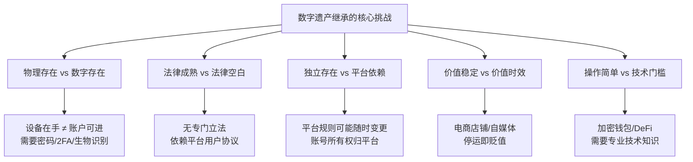
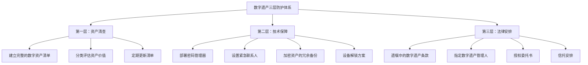
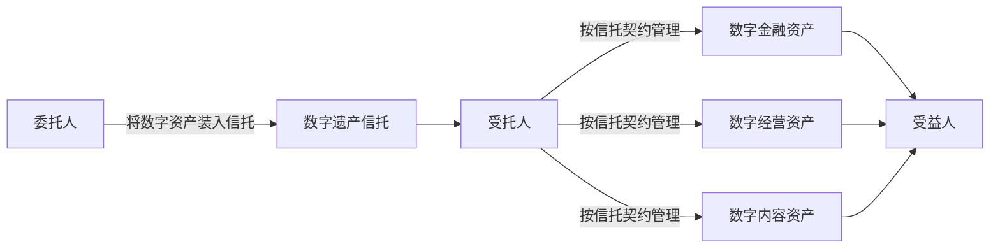

## 十、数字遗产与新型资产的传承

### 10.1 什么是数字遗产

#### 10.1.1 数字遗产的定义与范畴

数字遗产（Digital Legacy）是指自然人死亡后遗留的一切以数字形式存在的、具有经济价值或精神价值的权益总和。与传统遗产不同，数字遗产没有物理形态，其存在依赖于互联网平台、服务器和加密算法，继承人面临的第一道难题往往是"找不到、打不开、转不走"。

数字遗产可以按照价值属性分为三大类：

| 类别 | 定义 | 典型示例 | 价值特征 |
|------|------|----------|----------|
| 数字金融资产 | 以数字形式存储的资金和投资 | 支付宝余额、微信支付、证券账户、虚拟货币、数字人民币 | 直接经济价值，可量化 |
| 数字经营资产 | 依托互联网平台的经营性资产 | 电商店铺、自媒体账号、域名、网站、APP、SaaS订阅 | 持续产生收益，价值取决于运营状态 |
| 数字精神资产 | 具有精神价值或知识产权的数字内容 | 社交媒体记录、照片视频、邮件通信、游戏装备、NFT | 价值主观性强，难以量化 |

这三类资产的继承难度、法律保护程度和操作流程截然不同。数字金融资产继承难度最低（有明确的金融监管框架），数字经营资产继承难度中等（取决于平台政策），数字精神资产继承难度最高（法律几乎空白，平台规则各异）。

#### 10.1.2 数字遗产的规模与增长趋势

数字遗产的规模正在以惊人的速度增长。根据行业研究数据：

- **全球视角**：McAfee 2023年的调查显示，全球消费者平均每人拥有价值约37,000美元的数字资产，包括数字媒体订阅、电子邮件账户、社交媒体账户、数字照片和在线存储等
- **中国视角**：根据中国互联网络信息中心（CNNIC）数据，截至2025年中国网民规模超过11亿，人均注册网络账户超过50个，涉及支付、社交、电商、娱乐等多个领域
- **虚拟货币**：全球加密货币市值在2025年超过3万亿美元，持有者超过5亿人。Chainalysis估计，约有370万BTC（约占总量的20%）因私钥丢失而永久无法访问，价值超过2000亿美元

这些数字揭示了一个严峻的现实：如果不对数字遗产进行提前规划，大量数字资产将在持有人去世后永久丢失或长期冻结。

#### 10.1.3 数字遗产与传统遗产的本质区别

理解数字遗产的特殊性是做好传承规划的前提。数字遗产与传统遗产存在五个维度的根本差异：

**维度一：存在形式**

传统资产以实物或纸质凭证为载体——房产证放在保险柜里，银行存折夹在笔记本中，继承人即使不知道密码，也可以凭身份证件到柜台办理。数字资产则存在于云端服务器和加密算法中，没有正确的认证信息就完全无法访问。

**维度二：法律框架**

传统资产的继承有数百年法律实践积累，《民法典》继承编的核心条款都是围绕有形财产设计的。数字资产继承的法律框架在全球范围内都处于建设初期，中国至今没有专门的数字遗产继承立法。

**维度三：平台依赖性**

银行账户里的钱不会因为你不登录就消失，但电商店铺可能因为三个月不运营就被平台降权甚至关闭。社交媒体账号可能因为违反"用户协议"被永久封禁。数字资产的价值高度依赖平台的政策和规则。

**维度四：价值时效性**

一个淘宝店铺的价值可能在店主去世后的一周内就开始贬值——客户流失、竞争对手抢占、店铺权重下降。传统资产（如房产、黄金）通常不会因为持有人去世而立即贬值。

**维度五：技术门槛**

继承一套房产不需要任何技术知识，但继承一个加密货币钱包需要理解公钥、私钥、助记词、Gas费等概念。这种技术门槛使得很多继承人即使拿到全部密码也无法完成操作。



### 10.2 数字资产的法律地位

#### 10.2.1 中国现行法律框架

中国现行法律对数字资产的保护主要体现在以下条款中：

**《民法典》第127条**："法律对数据、网络虚拟财产的保护有规定的，依照其规定。"这一条款被普遍解读为确认了网络虚拟财产的法律地位，但它只是一个指引性条款，没有规定具体的保护方式和继承规则。

**《民法典》第1122条**："遗产是自然人死亡时遗留的个人合法财产。"这一条的"兜底"性质使得理论上合法的数字资产可以作为遗产继承，但法律并未明确列举数字资产的范围。

**《民法典》第1127条**：规定了法定继承人的顺序，适用于数字资产继承，但数字资产的特殊性（如账号使用权的不可转让性）使得这一条款在实践中难以直接适用。

**《网络安全法》和《数据安全法》**：侧重于数据安全和隐私保护，对数字遗产继承中的隐私权与继承权冲突问题没有给出明确的解决方案。

**司法实践中的关键案例**：

| 案例 | 时间 | 核心判决 | 意义 |
|------|------|----------|------|
| 王某淘宝店铺继承案 | 2019 | 法院认定淘宝店铺经营权属于可继承的网络虚拟财产 | 首次确认电商平台店铺的可继承性 |
| 李某QQ号继承案 | 2011 | 腾讯以用户协议为由拒绝继承人访问，法院调解后允许获取部分内容 | 揭示了用户协议与继承权的冲突 |
| 某比特币继承纠纷案 | 2022 | 法院认定虚拟货币属于合法财产，但因无法确定钱包控制权而无法执行 | 暴露了加密资产继承的执行困境 |

#### 10.2.2 用户协议的限制与突破

几乎所有互联网平台的用户协议都包含类似的条款："用户仅获得账号的使用权，账号所有权归平台所有，账号不可转让、不可继承。"这意味着从合同法的角度，用户的继承人并没有继承账号使用权的权利。

但司法实践中，法院已经多次对这种格式条款进行了限制性解释：

- **格式条款效力**：根据《民法典》第497条，排除对方主要权利的格式条款无效
- **权益保护**：账号中的数字资产（如余额、作品版权）不应因账号使用权的限制而丧失
- **利益平衡**：法院倾向于在继承权和平台规则之间寻找平衡点

#### 10.2.3 国际立法比较

全球数字遗产立法呈现出三种模式：

| 模式 | 代表国家/地区 | 核心思路 | 优劣分析 |
|------|-------------|----------|----------|
| 立法先行模式 | 美国特拉华州（2014）、俄克拉荷马州 | 制定专门法律，赋予遗嘱执行人访问数字账户的权力 | 法律确定性高，但可能与平台规则冲突 |
| 判例推动模式 | 德国（联邦最高法院2018年Facebook案） | 通过个案判决逐步确立数字遗产继承规则 | 灵活性强，但确定性不足 |
| 平台自治模式 | 中国当前状态 | 由平台自行制定数字遗产处理规则 | 缺乏统一标准，继承人权利保障不足 |

**美国《统一受托人访问数字资产法》（RUFADAA）**是目前全球最成熟的数字遗产立法框架，其核心设计思路是：

1. **三层优先级**：用户生前通过在线工具指定的意愿 > 遗嘱中的意愿 > 平台服务条款的默认设置
2. **访问层级**：区分"访问内容"（如邮件内容、聊天记录）和"访问目录"（如账号清单），对隐私保护设置了不同级别
3. **受托人权利**：遗嘱执行人、受托人和监护人可以在法律授权下访问逝者的数字账户

这一框架对中国的数字遗产立法具有重要的借鉴意义。

#### 10.2.4 数字遗产继承的法律路径选择

在当前法律框架下，继承人可以通过以下路径主张数字遗产的继承权：

**路径一：基于《民法典》继承编的一般原则**

直接引用第1122条"遗产是自然人死亡时遗留的个人合法财产"，主张数字资产属于"合法财产"。这一路径适用于有明确经济价值的数字资产（如账户余额、虚拟货币），但对账号使用权等"非财产权益"的保护力度不足。

**路径二：基于合同法的权利义务继承**

部分平台服务合同中的权利义务关系是可以继承的。例如，电商平台店铺经营权涉及持续的商业收益，法院可能认定这种合同权利可以作为遗产继承。

**路径三：基于知识产权法的保护**

原创内容（文章、图片、视频、代码）的著作权在创作者去世后仍有50年的保护期（自然人为作者的），继承人可以继承这些著作权的财产权部分。

**路径四：通过遗嘱进行专项安排**

在遗嘱中专门设置数字遗产条款，明确数字资产的范围、分配方案和执行人。这是目前最有效、最务实的法律工具。

### 10.3 主要数字资产类型的传承机制

#### 10.3.1 电子支付与金融账户

**支付宝**：支付宝是数字金融资产继承中最成熟的平台之一。其继承流程为：

```text
第一步：拨打支付宝客服 95188，告知账户持有人已去世
第二步：准备以下材料：
  - 死亡证明原件及复印件
  - 继承人身份证原件及复印件
  - 与逝者的关系证明（结婚证/户口本/出生证明）
  - 公证处出具的继承权公证书（大额资金提取）
第三步：将材料提交至支付宝指定渠道
第四步：支付宝审核（通常3-7个工作日）
第五步：审核通过后，账户余额可转入继承人指定账户
```

需要注意的细节：支付宝账户余额可以提取，但支付宝账号本身不能继承。也就是说，继承人不能继续使用逝者的支付宝账号进行交易。

**微信支付**：流程与支付宝类似，但微信账号同样不可继承，只能提取余额。微信中存储的聊天记录、朋友圈内容等无法被继承人合法获取（在RUFADAA框架下可以获取"目录"但不一定能获取"内容"）。

**银行网银与证券账户**：银行账户的继承有完善的法律框架，但网银/手机银行有独立密码。继承人需要携带死亡证明和继承权公证书前往银行柜台办理。证券账户更为严格——非交易过户需要所有法定继承人到场签字，或者提供其他继承人放弃继承的公证书。

**数字人民币**：数字人民币（e-CNY）目前仍在试点阶段，其继承机制尚未明确。但可以预见的是，数字人民币作为法定货币的数字化形式，其继承保障将优于第三方支付平台。

#### 10.3.2 虚拟货币与加密资产

虚拟货币是数字遗产继承中最复杂、风险最高的资产类型。其继承难度取决于存储方式：

| 存储方式 | 继承难度 | 核心依赖 | 典型损失场景 |
|----------|----------|----------|-------------|
| 中心化交易所（币安、OKX） | ★★★☆☆ | 账户密码 + 2FA + KYC身份 | 密码/2FA丢失，交易所倒闭 |
| 热钱包（MetaMask、Trust Wallet） | ★★★★☆ | 助记词（12/24个英文单词） | 助记词丢失或泄露 |
| 硬件钱包（Ledger、Trezor） | ★★★★★ | 设备 + PIN码 + 助记词 | PIN码连续错误导致设备清除 |
| 冷钱包（纸钱包、脑钱包） | ★★★★★ | 私钥的物理存储 | 存储介质损坏、记忆遗忘 |

**继承虚拟货币的核心挑战：**

1. **不可逆性**：区块链交易不可逆，私钥丢失意味着资产永久丢失，没有任何"找回密码"的机制
2. **匿名性**：继承人可能根本不知道逝者持有虚拟货币，更不知道放在哪里
3. **波动性**：继承过程中（通常需要数月）币价可能发生剧烈波动
4. **监管不确定性**：中国对虚拟货币交易采取禁止态度，继承时可能面临法律风险

**助记词管理的最佳实践：**

助记词（Mnemonic Phrase）是加密资产继承的核心。正确的管理方式是：

- 将助记词刻在不锈钢金属板上（防火、防水、防腐蚀），而非写在纸上
- 制作至少两份副本，存放在不同的物理位置（如家庭保险柜 + 银行保管箱）
- 不要将助记词存储在任何联网设备上（手机、电脑、云盘）
- 不要将助记词拍摄为照片（手机照片可能同步到云端）
- 定期验证备份的可用性（每半年用备份恢复一次测试钱包，然后立即转移资金到新钱包）

#### 10.3.3 电商平台店铺

电商店铺是数字遗产中最特殊的"活资产"——它不像银行存款可以静置不动，而是需要持续经营才能维持价值。一旦停止运营，店铺的权重、客户评价、搜索排名都会迅速下降。

**店铺传承的核心机制：**

电商平台店铺的传承本质上是"经营主体变更"。不同平台的政策差异很大：

| 平台 | 个人店铺 | 企业店铺 | 继承难度 | 关键条件 |
|------|----------|----------|----------|----------|
| 淘宝 | 不可直接过户，需注销后重新注册 | 通过企业主体变更过户 | ★★☆☆☆ | 营业执照、法人变更 |
| 天猫 | 仅支持企业入驻 | 通过企业主体变更过户 | ★★★☆☆ | 天猫审核周期长（15-20工作日） |
| 京东 | 不支持个人店铺 | 通过企业主体变更过户 | ★★★☆☆ | 京东对品牌资质要求严格 |
| 拼多多 | 不可直接过户 | 通过企业主体变更过户 | ★★☆☆☆ | 需提前绑定企业主体 |
| 抖音小店 | 不可直接过户 | 通过企业主体变更过户 | ★★★★☆ | 涉及抖音账号关联问题 |

**经营权传承的关键要素：**

店铺的价值不仅在于账号本身，更在于其背后的运营能力。传承成功需要同时满足三个条件：

1. **合法的主体变更**：完成工商变更和平台审批
2. **运营能力的移交**：包括供应商关系、客服团队、运营策略
3. **客户关系的维护**：在变更期间保持服务质量，避免差评

#### 10.3.4 社交媒体与自媒体账号

社交媒体账号的继承在全球范围内都是难题。几乎所有平台的用户协议都规定账号所有权归平台所有，用户仅获得使用权，且使用权不可转让。

**各主流平台的数字遗产政策（截至2025年）：**

| 平台 | 纪念账号 | 数据下载 | 账号继承 | 资产处置 |
|------|----------|----------|----------|----------|
| 微信 | 不支持 | 部分支持（需司法途径） | 不支持 | 余额可提取 |
| QQ | 不支持 | 不支持 | 不支持 | 余额可提取 |
| 抖音 | 支持设为纪念账号 | 不支持 | 不支持 | 可申请收益结算 |
| 微博 | 支持设为纪念账号 | 不支持 | 不支持 | 不适用 |
| 小红书 | 不支持 | 不支持 | 不支持 | 可申请收益结算 |
| Facebook | 支持纪念账号或删除 | 支持（生前设置） | 不支持 | 不适用 |
| Google | 非活动账户管理器 | 支持 | 不支持 | 余额可退还 |
| Apple | 数字遗产联系人 | 部分支持 | 不支持 | 余额可退还 |

**自媒体账号的特殊价值与传承困境：**

自媒体账号的价值由三部分构成：粉丝关系、内容资产和品牌效应。粉丝关系无法继承（粉丝关注的是"人"而非"账号"），内容资产可以通过备份部分保留，品牌效应则高度依赖持续运营。

一个拥有50万粉丝的抖音账号，如果账号主人去世后停止更新，3个月内粉丝活跃度可能下降80%以上。这意味着自媒体账号的价值具有极强的时效性——越早处理，损失越小。

#### 10.3.5 数字内容与知识产权

原创数字内容（文章、代码、图片、视频、音乐等）的著作权在创作者去世后可以继承。根据《著作权法》，著作权中的财产权保护期为作者终身加上死后50年。

**可继承的权利：**
- 复制权、发行权、信息网络传播权等财产权
- 著作权许可使用合同中的获酬权
- 未发表作品的发表权（由继承人行使）

**不可继承的权利：**
- 署名权、修改权、保护作品完整权（人身权，永久保护但不可转让）

**实操建议：**
- 对于高价值的原创内容，建议在生前完成版权登记（中国版权保护中心，费用约100-300元/件）
- 建立完整的数字内容清单，包括存储位置、版权归属、许可协议等信息
- 对于开源代码项目，提前安排项目维护者交接方案

#### 10.3.6 域名与互联网基础设施

域名资产的继承相对简单，因为域名注册遵循明确的注册协议和转让规则：

- 域名可以通过注册商提供的转让功能转移到继承人名下
- 需要提供域名所有者的死亡证明和继承权证明
- .com/.net/.org等国际域名的转让规则由ICANN统一管理
- .cn域名的转让规则由CNNIC管理，需要提供实名认证信息

云服务器（阿里云、腾讯云、AWS等）的继承则更为复杂，因为服务器上可能存储着大量的业务数据、代码和配置文件。继承人需要尽快备份关键数据，因为服务器到期未续费将导致数据被清除。

### 10.4 新型资产的传承问题

#### 10.4.1 NFT与数字藏品

NFT（Non-Fungible Token，非同质化代币）和国内的数字藏品是近年来出现的新型数字资产。其传承面临的核心挑战是：

**所有权验证问题**：NFT的所有权记录在区块链上，通过私钥控制。继承人如果没有私钥，即使能证明自己是合法继承人，也无法转移或出售NFT。

**价值评估问题**：NFT市场波动极大，一个NFT在购买时可能价值数十万美元，在继承时可能一文不值。国内数字藏品平台（如鲸探、幻核）的价值更依赖于平台的运营状况——如果平台倒闭，数字藏品将失去展示和交易的载体。

**平台依赖问题**：国内数字藏品平台大多采用联盟链而非公链，数字藏品的流转受到平台规则的严格限制。如果平台关闭，数字藏品可能无法迁移到其他平台。

#### 10.4.2 AI生成内容与数字人

随着AI技术的快速发展，一个新的传承问题正在浮现：如果一个人生前创建了AI数字人（如AI克隆、数字分身），这些数字人是否可以作为遗产继承？

从技术角度，AI数字人由三部分构成：
1. **模型数据**：训练数据和模型参数，属于知识产权
2. **交互记录**：与AI数字人的聊天记录和对话历史，属于个人数据
3. **人格权**：数字人使用的逝者的肖像、声音、姓名等，涉及人格权保护

目前全球范围内都没有针对AI数字人继承的法律规定。但可以预见的是，这个问题将在未来5-10年内变得越来越紧迫。

#### 10.4.3 数据资产与个人数据

在大数据时代，个人数据本身也具有价值。一个人的消费记录、浏览历史、健康数据、位置数据等，经过分析和加工后可以产生商业价值。

但从法律角度，个人数据的继承面临两个根本性问题：

1. **隐私权与继承权的冲突**：个人数据涉及逝者的隐私，继承人是否有权访问这些数据是一个伦理和法律难题
2. **数据控制权**：个人数据通常存储在第三方平台上（如社交媒体、电商、健康App），继承人无法直接控制这些数据

GDPR（欧盟通用数据保护条例）和中国的《个人信息保护法》都侧重于保护在世者的个人信息权利，对逝者个人数据的保护和继承缺乏明确规定。

#### 10.4.4 订阅服务与数字消费

订阅服务（如Netflix、Spotify、Adobe Creative Cloud、各类SaaS工具）在持有人去世后的处理也是一个容易被忽视的问题：

- **已付费但未到期的订阅**：通常无法退款，但可以继续使用直到到期
- **自动续费的订阅**：如果绑定的支付方式仍然有效，会继续扣费，造成不必要的损失
- **团队/企业订阅**：如果逝者是团队订阅的管理员，需要及时转移管理权限

**实操建议**：在数字资产清单中列出所有订阅服务及其到期时间，确保继承人能够及时取消不需要的订阅，避免持续扣费。

### 10.5 数字遗产传承的方法论框架

#### 10.5.1 "三层防护"体系

基于数字遗产的特殊性，建议采用"三层防护"体系进行系统化管理：



**第一层：资产清查**——知道有什么。建立一份完整的数字资产清单，涵盖所有有价值的数字账户和资产。清单应包含：平台名称、账号、资产类型、估值、密码存放位置、继承难度评级。

**第二层：技术保障**——能打开。通过密码管理器、紧急联系人机制、助记词备份等技术手段，确保继承人能够在持有人去世后访问关键数字账户。

**第三层：法律安排**——合法转移。通过遗嘱条款、授权委托书、信托安排等法律工具，确保数字资产的转移有明确的法律依据。

#### 10.5.2 数字资产清单的构建方法

一份有效的数字资产清单应该包含以下维度：

| 维度 | 说明 | 示例 |
|------|------|------|
| 账号标识 | 平台名称 + 账号/ID | 支付宝：138XXXX5678 |
| 资产类型 | 金融/经营/精神 | 金融类 |
| 资产价值 | 估算金额或定性描述 | 约50万元 |
| 认证方式 | 密码/2FA/生物识别 | 密码 + TOTP两步验证 |
| 密码位置 | 密码管理器中的路径 | 1Password → 支付宝文件夹 |
| 继承难度 | 低/中/高/极高 | 低 |
| 紧急程度 | 继承时的处理优先级 | 第一优先级 |
| 备注 | 特殊注意事项 | 需要公证书才能提取余额 |

**构建清单的系统化方法：**

1. **邮箱回溯法**：搜索所有邮箱中的注册确认邮件、账单通知，发现曾注册过的服务
2. **支付记录法**：导出支付宝/微信支付的年度账单，识别所有定期扣费项目
3. **浏览器数据法**：导出Chrome/Firefox等浏览器保存的密码列表和书签
4. **手机应用法**：查看手机应用商店的下载记录和已安装应用列表
5. **密码管理器法**：如果已经使用密码管理器，直接导出所有存储的账户信息

#### 10.5.3 遗嘱中数字遗产条款的设计

在遗嘱中设置专门的数字遗产条款，是目前最有效的法律保障手段。一份完善的数字遗产条款应包含以下要素：

**要素一：数字资产的定义和范围**

明确界定哪些数字资产纳入遗嘱管理，避免遗漏或争议。建议采用"列举+兜底"的方式："本人名下的数字资产包括但不限于：电子支付账户中的资金、网络平台店铺及经营权、虚拟货币及数字资产、域名和云服务器等互联网基础设施、数字内容的知识产权等。"

**要素二：数字遗产管理人的指定**

指定一名技术能力较强的继承人或可信任的第三方作为数字遗产管理人，负责执行遗嘱中的数字遗产条款。管理人应具备基本的互联网操作能力和信息安全意识。

**要素三：密码和访问信息的安排**

说明密码管理器的主密码存放位置、加密资产助记词的保管方式、设备解锁方案等关键信息。建议采用"分段保管"策略——将关键信息分成两部分，由不同的人保管，确保安全性。

**要素四：特殊资产的处置指令**

对不同类型数字资产的处置方式给出明确指令：哪些资产继续经营、哪些资产变现、哪些账号设为纪念账号、哪些订阅服务取消。

### 10.6 数字遗产传承的风险管理

#### 10.6.1 信息安全风险

数字遗产规划的最大悖论是：为了方便继承人访问，需要提前记录和存储大量敏感信息（密码、助记词等），但这些信息一旦泄露，将面临严重的安全风险。

**风险一：密码信息泄露**

如果数字资产清单以明文形式存储，一旦被不法分子获取，所有数字资产都将面临被盗的风险。2023年全球因密码泄露导致的数字资产损失超过30亿美元。

**风险二：内部人作案**

数字遗产规划中涉及的敏感信息（密码、助记词）需要与可信任的人分享，但"可信任"的判断可能存在偏差。在遗产纠纷中，掌握密码信息的家庭成员可能利用信息优势侵吞遗产。

**风险三：社会工程攻击**

犯罪分子可能利用公开的死亡信息，冒充继承人联系平台客服，试图获取逝者账户的访问权限。

**应对策略：**

| 风险类型 | 应对措施 | 具体方法 |
|----------|----------|----------|
| 密码泄露 | 加密存储 | 使用密码管理器，主密码分段保管 |
| 内部人作案 | 制衡机制 | 关键信息分两人保管，需共同取出 |
| 社会工程攻击 | 平台侧防护 | 设置账户恢复的严格验证机制 |
| 设备丢失 | 多重备份 | 至少三份副本，存放在不同物理位置 |
| 自然灾害 | 异地备份 | 至少一份副本存放在不同城市 |

#### 10.6.2 平台政策变动风险

互联网平台的政策不是一成不变的。平台可能：
- 突然关停服务（如2023年幻核数字藏品平台关停）
- 修改用户协议中关于账号继承的条款
- 调整店铺继承的条件和流程
- 改变账号注销和纪念账号的政策

**应对策略**：不要过度依赖单一平台，数字资产清单应定期（建议每年至少一次）更新，及时反映平台政策的变化。

#### 10.6.3 技术迭代风险

技术在不断发展，今天广泛使用的加密方式、存储格式和认证机制，未来可能被淘汰或破解。

**应对策略**：
- 每3-5年审查一次数字遗产规划的技术方案
- 使用标准化、开放格式存储关键信息（如KeePass格式的.kdbx文件）
- 避免使用过于小众或封闭的技术方案

### 10.7 常见误区与纠正

**误区一："我没有什么数字资产，不需要规划"**

几乎每个使用智能手机的人都拥有数字资产。支付宝/微信余额、电商账户余额、游戏充值余额、付费订阅服务、社交媒体账号中的创作内容——这些都属于数字资产的范畴。即使总额不大，不做规划也会给继承人带来不必要的麻烦。

**误区二："把密码告诉家人就够了"**

口头告知密码存在多重风险：家人可能忘记、密码可能变更、口头信息无法作为法律依据。更重要的是，仅知道密码并不能解决所有问题——继承人还需要知道账户的存在、资产的类型、以及如何处理不同平台的继承流程。

**误区三："遗嘱中写一句'所有财产归XX'就够了"**

笼统的遗嘱条款无法处理数字遗产。因为数字资产的继承需要具体的账户信息、密码、操作步骤和平台对接流程。没有这些信息，继承人将面临"知道有遗产但找不到"的困境。

**误区四："虚拟货币放在交易所就安全了"**

交易所不是银行，没有存款保险制度。FTX交易所2022年的崩溃导致数十亿美元的客户资产损失。建议大额加密资产使用硬件钱包存储，并妥善保管助记词的物理备份。

**误区五："我还年轻，不需要考虑这些"**

数字遗产规划不是老年人的事。年轻人通常拥有更多的数字资产——社交媒体账号、游戏账号、虚拟货币等。而且，越早规划，积累的数字资产越多，提前布局的难度越小。

**误区六："用一个Excel表格记录所有密码就行"**

明文存储密码是极其危险的做法。Excel文件没有加密保护，一旦电脑被入侵或文件被泄露，所有密码都将暴露。应使用专业的密码管理器，采用零知识加密架构。

### 10.8 进阶：数字遗产的前沿趋势

#### 10.8.1 平台内置的数字遗产功能

越来越多的科技巨头开始在产品中内置数字遗产功能：

- **Apple 数字遗产联系人**（iOS 15.2+）：用户可以在设置中指定最多5位遗产联系人，在去世后这些联系人可以申请访问用户Apple账户中的数据
- **Google 非活动账户管理器**：用户可以设置账户在指定时间内未活动时自动触发的处理方案，包括向指定联系人发送数据或删除账户
- **Facebook/Instagram 纪念账号**：账户被设为纪念状态后，"纪念"标签会出现在用户名旁边，好友仍可访问其发布的内容

这些功能虽然还不够完善，但代表了一个重要趋势：平台正在从"拒绝继承"转向"协助继承"。

#### 10.8.2 区块链原生的继承方案

区块链技术为数字遗产传承提供了新的可能性：

**智能合约遗嘱**：通过部署在区块链上的智能合约，在满足特定条件（如持有多重签名的确认、可信预言机提供的死亡确认信号）时，自动将加密资产转移到指定地址。这种方案的优势是去中心化、不可篡改、自动执行，但技术门槛较高，且"死亡确认"的链上信号仍是难题。

**时间锁定（Time-lock）机制**：将资产设置为时间锁定，持有人需要定期（如每6个月）"续期"以证明自己仍在世。如果超过设定时间未续期，资产自动转移到预设的继承人地址。这种方法简单有效，但需要持有人定期操作。

**多重签名钱包**：设置一个2-of-3或3-of-5的多重签名钱包，持有人持有大部分私钥，律师或家人持有其余私钥。持有人去世后，家人凭继承权证明，与律师的私钥配合，共同完成资产转移。

#### 10.8.3 数字遗产信托

将数字资产纳入信托管理，是高净值人群可以考虑的方案。数字遗产信托的基本架构是：



数字遗产信托面临的主要挑战是：受托人需要具备数字资产管理的专业能力，包括加密货币钱包操作、电商平台运营、自媒体账号管理等。目前中国信托公司在这方面的专业能力普遍不足。

#### 10.8.4 遗产规划的数字化转型

未来的遗产规划将越来越数字化：

1. **在线遗嘱平台**：通过数字化平台完成遗嘱的起草、见证、存储和更新
2. **数字遗产规划AI助手**：基于AI技术，自动分析用户的数字资产状况，生成个性化的遗产规划建议
3. **区块链存证遗嘱**：将遗嘱的哈希值记录在区块链上，确保遗嘱不被篡改
4. **自动化资产发现工具**：自动扫描用户的在线账户，生成数字资产清单

### 10.9 行动清单

**立即行动（本周内）：**

- [ ] 下载并安装密码管理器（推荐1Password或Bitwarden）
- [ ] 将所有重要账户的密码迁移到密码管理器
- [ ] 设置紧急联系人功能（1Password的"紧急联系人"或Bitwarden的"紧急访问"）
- [ ] 为加密货币钱包制作助记词金属备份

**短期行动（1个月内）：**

- [ ] 建立完整的数字资产清单（参考10.5.2节的清单模板）
- [ ] 评估各数字资产的价值和继承难度
- [ ] 与家人沟通数字遗产规划的重要性
- [ ] 检查并更新所有平台的安全设置（启用2FA、更新恢复邮箱等）

**中期行动（3个月内）：**

- [ ] 咨询律师，在遗嘱中增加数字遗产条款
- [ ] 指定数字遗产管理人
- [ ] 建立加密资产的冗余备份体系
- [ ] 为电商平台店铺安排"备份运营者"

**长期维护（每年一次）：**

- [ ] 更新数字资产清单
- [ ] 验证密码管理器紧急联系人机制是否正常工作
- [ ] 验证加密资产备份是否可用
- [ ] 审查平台政策变化对遗产规划的影响
- [ ] 审查技术方案的时效性，必要时更新

***
