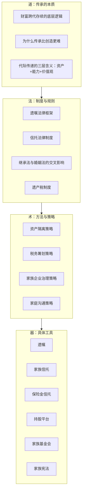
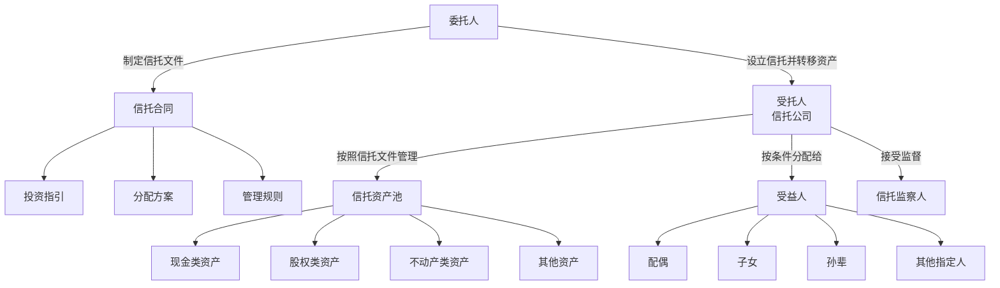
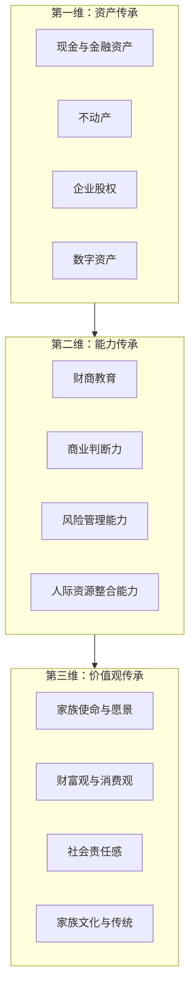
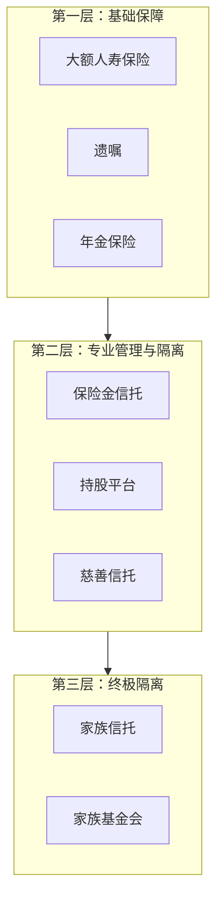
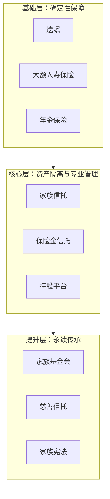

## 本节小结：理论基础核心要点回顾

理论基础部分共十个小节，从"为什么要关注财富传承"到"数字遗产与新型资产的传承"，构建了一套完整的财富传承理论框架。本小结将十个小节的核心知识浓缩为可快速查阅的结构化索引，帮你建立从"道"到"术"的全景认知。

### 一、十大核心知识点速览

| 序号 | 主题 | 一句话核心 | 关键数字/事实 |
|------|------|-----------|--------------|
| 01 | 为什么关注财富传承 | "富不过三代"是规划缺失的必然结果，而非诅咒 | 三代后财富保持率不到5%；中国高净值人群立遗嘱比例不足10% |
| 02 | 遗嘱规划的理论框架 | 遗嘱是传承的基础法律工具，但形式要件极严 | 六种法定遗嘱形式；民法典取消公证遗嘱优先效力 |
| 03 | 家族信托的理论基础 | 信托的核心价值是资产隔离——独立于任何一方的债务和风险 | 中国家族信托门槛通常1000万起；信托期限可达永续 |
| 04 | 代际传承的理论框架 | 传承不只是资产转移，更是价值观、能力、资源的全面传递 | 家族企业传承到第二代成功率约30%，到第三代约12% |
| 05 | 财富保全工具体系 | 工具组合使用，不依赖单一工具——保险、信托、持股平台各有分工 | 保险+信托+持股平台形成三层防护体系 |
| 06 | 家族企业传承 | 企业传承是最复杂的传承类型，涉及股权、治理、接班人三维问题 | 中国家族企业约85%面临"接班人荒" |
| 07 | 遗产税的理论与实践 | 虽然中国尚未开征，但提前规划可节省55%以上的潜在税负 | 日本最高遗产税率55%；美国联邦遗产税率40% |
| 08 | 传承中的沟通艺术 | 传承失败的60%以上源于家庭内部沟通不足 | 遗产诉讼中因继承纠纷导致家庭反目的案例超过60% |
| 09 | 心理与行为经济学 | 认知偏差（现状偏差、过度自信、损失厌恶）是阻碍传承规划的隐形杀手 | 多数人因"现状偏差"一拖再拖，直到突发事件措手不及 |
| 10 | 数字遗产与新型资产 | 加密货币、网络账号、数字内容等新型资产的传承需要专门安排 | 中国数字经济规模超50万亿，数字遗产问题日益突出 |

### 二、核心理论框架总结

#### 2.1 传承的"道法术器"体系

**道**——传承的本质不是"把钱给谁"，而是"让财富在代际间持续存活并增值"。第一章用数据证明，缺乏规划的财富在三代后存活率不到5%，这不是运气问题，而是系统工程缺失的问题。

**法**——传承必须在法律框架内进行。中国《民法典》继承编规定了六种遗嘱形式，《信托法》提供了信托制度基础，《婚姻法》影响夫妻共同财产的界定。不理解法律规则，任何传承方案都可能失效。

**术**——策略层面需要综合运用资产隔离（信托）、税务筹划（保险+信托）、企业治理（持股平台+家族宪法）等方法。没有放之四海而皆准的方案，必须因家制宜。

**器**——工具有明确的分层：基础层（遗嘱+保险）人人需要，核心层（信托+持股平台）中产以上需要，提升层（家族基金会+家族宪法）超高净值家族需要。

#### 2.2 传承规划的核心逻辑链

这六个环节缺一不可。大多数人只做了A（知道重要），少数人做了B-D（学了知识、做了规划、落了地），但忽略了E和F——不与家人沟通导致身后纷争，不维护导致方案过时失效。

### 三、各主题核心要点详述

#### 3.1 为什么关注财富传承（第一节）

**核心结论**：财富传承是整个"搞钱"体系中最容易被忽视、却最具破坏力的环节。

关键数据：
- 全球范围内，家族财富三代后存活率不到5%
- 中国高净值人群已立遗嘱的比例不足10%
- 因继承纠纷导致家庭反目的案例超过60%（遗产诉讼中）

**传承失败的三大根因**：

| 根因 | 占比 | 典型表现 | 解决方向 |
|------|------|----------|----------|
| 没有规划 | 50%以上 | 认为"我还年轻""等以后再说" | 建立传承意识，立即启动 |
| 规划错误 | 约30% | 遗嘱形式不合法、代持协议无效、分配不均引发诉讼 | 学习法律知识，引入专业人士 |
| 执行失败 | 约20% | 遗嘱锁在抽屉未更新、接班人培养失败 | 建立定期审视和动态调整机制 |

**四步法**：资产盘点 → 传承规划 → 法律执行 → 持续维护（每3-5年循环一次）。

#### 3.2 遗嘱规划的理论框架（第二节）

**核心结论**：遗嘱是传承的基础法律工具，门槛最低但法律要求极严。

中国《民法典》规定了六种遗嘱形式：

| 遗嘱类型 | 形式要求 | 优势 | 劣势 | 适用场景 |
|----------|----------|------|------|----------|
| 自书遗嘱 | 亲笔书写全文，签名，注明年月日 | 最简单，无需他人协助 | 字迹可能引发真伪争议 | 简单家庭结构 |
| 代书遗嘱 | 两个以上见证人在场，其中一人代书，注明日期 | 解决书写能力问题 | 见证人资格要求严格 | 身体不便者 |
| 打印遗嘱 | 两个以上见证人在场，每页签名+注明日期 | 内容清晰无歧义 | 民法典新增，实务经验不足 | 复杂财产分配 |
| 录音录像遗嘱 | 两个以上见证人在场，记录姓名或肖像+日期 | 直观表达真实意愿 | 存储介质可能损坏 | 需要表达情感和理由 |
| 口头遗嘱 | 危急情况+两个以上见证人在场 | 紧急情况下唯一选择 | 危急情况解除后可书面/录音录像的，口头遗嘱无效 | 生命垂危等极端情况 |
| 公证遗嘱 | 经公证机构公证 | 证明力最强 | 程序繁琐、成本较高 | 高净值家庭、复杂财产 |

**关键变化**：民法典取消了公证遗嘱的优先效力，以**最后一份遗嘱**为准。这意味着即使之前立过公证遗嘱，之后的自书遗嘱也可以撤回或变更。

**遗嘱有效性的四大要件**：
1. **主体适格**：立遗嘱人必须是完全民事行为能力人，必须是本人真实意愿
2. **形式合法**：严格按照法定形式要件，缺少任何一项都可能导致无效
3. **内容合法**：不能处分他人财产（如夫妻共同财产中配偶的份额）、不能违反公序良俗
4. **必留份义务**：必须为缺乏劳动能力又没有生活来源的继承人保留必要的遗产份额

**遗嘱的常见无效情形**：
- 受胁迫或欺骗所立的遗嘱
- 伪造的遗嘱
- 被篡改的遗嘱内容
- 处分了不属于自己的财产（如把夫妻共同房产全部留给子女）
- 见证人不符合资格要求（无民事行为能力人、继承人、与继承人有利害关系的人不能做见证人）

#### 3.3 家族信托的理论基础（第三节）

**核心结论**：信托的核心价值是**资产隔离**——信托资产独立于委托人、受托人、受益人的固有资产，不因任何一方的债务、离婚、破产而受影响。

**家族信托的基本结构**：

**家族信托的五大核心功能**：

| 功能 | 说明 | 典型应用场景 |
|------|------|------------|
| 资产隔离 | 信托资产不因委托人/受益人的债务、离婚、破产而受影响 | 企业主破产，信托资产不受债权人追索 |
| 专业管理 | 专业机构进行资产配置和投资管理 | 防止继承人挥霍或投资失败 |
| 灵活分配 | 可设置复杂的分配条件 | 子女教育金、创业金、结婚奖励、防挥霍条款 |
| 税务筹划 | 遗产税开征后存在筹划空间 | 提前将资产装入信托，降低遗产税税基 |
| 隐私保护 | 信托文件不公开 | 避免遗产分配信息被公众知晓 |

**设立条件**：
- 最低门槛：大多数信托公司要求1000万元人民币起（部分300万起）
- 信托期限：通常5年以上，可设定20年、30年甚至永续
- 资产类型：现金、股权、不动产、艺术品等均可装入
- 法律文件：需制定详细的信托合同、投资指引、分配方案

**信托 vs 遗嘱的本质区别**：

| 维度 | 遗嘱 | 家族信托 |
|------|------|----------|
| 生效时间 | 立遗嘱人死亡时 | 信托设立时立即生效 |
| 资产控制 | 生前完全控制 | 资产转移给受托人管理 |
| 资产隔离 | 无隔离功能 | 核心功能 |
| 分配灵活性 | 一次性分配为主 | 可设置任意复杂的分配条件 |
| 门槛 | 零门槛 | 通常1000万起 |
| 持续性 | 一次性文件 | 持续管理，可达永续 |

#### 3.4 代际传承的理论框架（第四节）

**核心结论**：传承不只是资产的物理转移，更是**资产、能力、价值观**的三维传递。

**代际传承的三维模型**：

**"富不过三代"的深层原因**：
- **第一代**：创造财富，具备强大的创业能力和风险承受力
- **第二代**：守成为主，经历过父辈创业但缺乏同等的磨炼
- **第三代**：生于富贵，对财富来之不易缺乏认知，容易挥霍

打破这一规律的关键不是"少给钱"，而是系统性的能力培养和价值观传递。洛克菲勒家族七代传承的核心秘诀：每周的家庭会议、详细的家族宪章、严格的财商教育体系。

**代际传承的四个阶段**：

| 阶段 | 关键任务 | 时间跨度 | 常见错误 |
|------|----------|----------|----------|
| 准备期 | 接班人培养、家族治理制度建立 | 10-20年 | 起步太晚，错过最佳培养窗口 |
| 过渡期 | 逐步移交权力和资产 | 3-5年 | 一次性交权导致失控 |
| 巩固期 | 新一代独立运作，老一代退居顾问 | 3-5年 | 老一代"垂帘听政"干扰决策 |
| 稳定期 | 新一代全面掌权，传承方案更新 | 持续 | 认为传承"已完成"不再维护 |

#### 3.5 财富保全工具体系（第五节）

**核心结论**：财富保全需要工具组合使用，单一工具无法覆盖所有风险。

**保全工具的三层防护体系**：

**各工具的核心功能与适用场景**：

| 工具 | 核心保全功能 | 适用风险类型 | 门槛 | 成本 |
|------|------------|------------|------|------|
| 大额人寿保险 | 锁定传承金额，指定受益人避开遗产分割 | 死亡风险、婚姻风险 | 年缴数千元起 | 中等 |
| 保险金信托 | 保险杠杆+信托隔离双重功能 | 债务风险、挥霍风险 | 保额100万起 | 中等 |
| 家族信托 | 全面资产隔离，最高等级保护 | 所有类型 | 300-1000万起 | 较高 |
| 持股平台 | 股权控制权与分红权分离 | 企业经营风险、婚姻风险 | 视企业规模 | 中等 |
| 家族宪法 | 家族治理制度化，预防内部冲突 | 家庭纠纷、代际冲突 | 无资产门槛 | 低 |
| 婚前/婚内财产协议 | 明确夫妻财产归属 | 婚姻风险 | 无 | 低（律师费） |

#### 3.6 家族企业传承的特殊考量（第六节）

**核心结论**：企业传承是所有传承类型中最复杂的，涉及**股权结构、公司治理、接班人培养**三个维度的交织。

**家族企业传承的三大核心挑战**：

**挑战一：股权结构设计**
- 控制权与分红权的分离：通过AB股、有限合伙持股平台等实现
- 多子女间的股权分配：避免均分导致控制权分散
- 外部投资者的引入：如何在融资中保持家族控制

**挑战二：公司治理转型**
- 从"人治"到"法治"：建立董事会、监事会、职业经理人制度
- 家族成员与职业经理人的关系：明确权责边界
- 家族宪章与公司章程的衔接：双重治理框架

**挑战三：接班人培养**
- 内部培养 vs 外部引进：家族成员必须经过基层锻炼
- "扶上马送一程"的过渡安排：老一代逐步放权
- 接班人不愿意接班的应对：家族办公室、职业经理人制度

**家族企业传承的五种模式对比**：

| 模式 | 适用条件 | 优势 | 劣势 | 典型案例 |
|------|----------|------|------|----------|
| 子女接班 | 子女有能力且愿意 | 保持家族控制 | 能力和意愿风险 | 李嘉诚家族 |
| 职业经理人 | 子女不愿或不能接班 | 专业化管理 | 委托代理风险 | 美的集团 |
| 家族信托持股 | 多子女或复杂家庭 | 控制权集中，受益权灵活 | 设计复杂，成本高 | 李锦记 |
| 出售变现 | 无合适接班人 | 一次性变现 | 企业传承中断 | — |
| 分拆业务 | 子女各有所长 | 各展所长 | 规模效应降低 | — |

#### 3.7 遗产税的理论与实践（第七节）

**核心结论**：中国目前尚未开征遗产税，但提前规划可在未来开征时节省55%以上的潜在税负。

**全球主要国家/地区遗产税率对比**：

| 国家/地区 | 最高税率 | 免税额度 | 特点 |
|-----------|----------|----------|------|
| 日本 | 55% | 约2200万人民币 | 全球最高，采用分遗产税制 |
| 美国 | 40%（联邦）+州税 | 约8800万人民币（2024年） | 联邦和州双重征收 |
| 英国 | 40% | 约2800万人民币 | 赠与和遗产统一计算 |
| 德国 | 50% | 约40万欧元（配偶） | 直系亲属税率较低 |
| 中国香港 | 0% | — | 已于2006年废除 |
| 中国大陆 | 尚未开征 | — | 曾多次讨论但未实施 |

**遗产税的提前筹划策略**：
1. **生前赠与**：利用赠与免税额度逐步转移资产（注意：赠与可能涉及赠与税）
2. **保险规划**：人寿保险理赔金在多数国家免征遗产税
3. **信托规划**：将资产装入信托，降低个人遗产总额
4. **慈善捐赠**：公益捐赠可抵扣遗产税
5. **跨司法管辖区规划**：利用不同地区的税率差异（需合法合规）

#### 3.8 传承中的沟通艺术（第八节）

**核心结论**：传承失败的根源往往不是法律问题或金融问题，而是**家庭沟通问题**。

**传承沟通的四大核心议题**：

| 议题 | 沟通要点 | 常见冲突 | 解决方法 |
|------|----------|----------|----------|
| 分配方案 | 让每位家庭成员理解分配逻辑 | "为什么他多我少" | 提前沟通，解释差异化分配的理由 |
| 接班安排 | 让接班人清楚角色和期望 | "凭什么是我/不是我" | 基于能力和意愿，而非长幼顺序 |
| 家族价值观 | 传递"钱从哪来，该怎么用"的认知 | 代际消费观冲突 | 家族宪章制度化 |
| 风险认知 | 让家人了解传承的紧迫性 | "我还年轻不用想这些" | 用数据和案例说明 |

**沟通的最佳时机**：
- 家庭聚会时自然引入（而非正式会议的压迫感）
- 子女成年后尽早开始（18-25岁建立基本认知）
- 重大生活事件后（结婚、生子、创业等）及时更新
- 每年至少一次正式的家庭财务会议

**沟通的"四不要"原则**：
1. **不要等到生病才谈**：会增加家人的焦虑和不安
2. **不要单独与一个子女谈**：容易引发其他子女的猜疑
3. **不要只谈钱不谈情**：传承的核心是爱，不是数字
4. **不要回避争议**：争议越早暴露越容易解决

#### 3.9 财富传承中的心理与行为经济学（第九节）

**核心结论**：认知偏差是阻碍传承规划的隐形杀手，理解这些偏差是采取行动的前提。

**影响传承决策的四大认知偏差**：

| 偏差类型 | 表现 | 后果 | 应对策略 |
|----------|------|------|----------|
| 现状偏差 | "现在一切都好，为什么要改变" | 传承规划一拖再拖 | 设定截止日期，强制启动 |
| 过度自信 | "我还能掌控局面" | 低估意外风险 | 用客观数据替代主观判断 |
| 损失厌恶 | "把资产给出去我就没了" | 不愿生前转移资产 | 理解"控制权"和"所有权"可以分离 |
| 锚定效应 | "十年前的方案够用了" | 方案严重过时 | 每3-5年强制审视 |

**行为金融学在传承中的应用**：
- **默认选项设计**：将传承方案设置为"默认参与"而非"自愿加入"，提高执行率
- **框架效应**：将"你将获得100万元"改为"你将获得家族财富的10%"，后者更能激发家族认同感
- **承诺机制**：在家族宪章中规定，修改方案需全体成员一致同意，确保方案稳定性

**公平感的主观性**是家庭纠纷的重要根源——父母认为"按需分配"是公平的，子女认为"平均分配"才是公平的。解决方法：提前沟通分配逻辑，让每位成员理解并接受。

#### 3.10 数字遗产与新型资产的传承（第十节）

**核心结论**：数字遗产是传承领域中最新、最容易被忽视的资产类型。

**数字遗产的主要类型**：

| 类型 | 具体内容 | 传承难点 | 解决方向 |
|------|----------|----------|----------|
| 加密货币 | 比特币、以太坊等 | 私钥丢失即永久丧失；匿名性强 | 私钥备份方案、多签钱包 |
| 网络账号 | 微信、支付宝、邮箱、社交媒体 | 平台条款限制；隐私与传承的平衡 | 账号清单+密码管理工具 |
| 数字内容 | 自媒体账号、付费课程、电子书 | 知识产权归属；平台规则 | 遗嘱中明确数字资产条款 |
| 虚拟财产 | 游戏装备、域名、NFT | 价值评估困难；法律定性不明 | 专业评估+遗嘱指定 |
| 云端数据 | 照片、视频、文档 | 平台关停风险；访问权限 | 定期备份+账号信息告知 |

**数字遗产传承的四个实操建议**：
1. **建立数字资产清单**：列出所有数字资产、对应平台、账号密码、预估价值
2. **使用密码管理工具**：如1Password、Bitwarden，设置"紧急访问"功能
3. **在遗嘱中增加数字资产条款**：明确各数字资产的分配方式和继承人
4. **定期备份重要数据**：将云端数据下载到本地或加密硬盘中

### 四、传承工具全景对比

| 工具 | 核心功能 | 门槛 | 成本 | 灵活性 | 隔离性 | 适用人群 |
|------|----------|------|------|--------|--------|----------|
| 遗嘱 | 确定分配方案 | 零门槛 | 几乎为零 | 高（可随时修改） | 无 | 所有人 |
| 大额人寿保险 | 锁定传承金额、快速理赔 | 年缴数千元起 | 中等 | 中 | 部分 | 有家庭责任者 |
| 保险金信托 | 保险+信托双重功能 | 保额100万起 | 中等 | 较高 | 强 | 中产及以上 |
| 家族信托 | 资产隔离+专业管理+灵活分配 | 300-1000万起 | 较高 | 最高 | 最强 | 中高净值家庭 |
| 持股平台 | 股权控制权与分红权分离 | 视企业规模 | 中等 | 中 | 部分 | 企业主 |
| 家族基金会 | 永续传承+社会公益 | 数千万起 | 高 | 低 | 强 | 超高净值家族 |
| 家族宪法 | 家族治理制度化 | 无资产门槛 | 低 | 最高 | 无 | 所有家族 |

### 五、理论基础与后续章节的衔接

理论基础回答的是"是什么"和"为什么"，接下来的核心技巧部分将回答"怎么做"：

| 理论基础（本节） | 核心技巧（下一节） |
|-----------------|-------------------|
| 遗嘱的六种形式和有效性要件 | 遗嘱撰写实操指南：模板、要素、注意事项 |
| 家族信托的结构和功能 | 家族信托搭建实操：选信托公司、设计方案、资产过户 |
| 保险在传承中的角色 | 保险在传承中的应用技巧：产品选择、受益人设计 |
| 全球传承工具体系 | 全球视野下的传承策略：跨境资产、海外信托 |
| 家族企业传承理论 | 家族企业传承实操方法：股权设计、接班人培养 |
| 传承方案的理论框架 | 传承方案的动态调整：定期审视、情景应对 |
| 特殊资产的理论认知 | 特殊资产的传承安排：数字资产、艺术品、知识产权 |
| 风险管理理论 | 传承中的风险管理：风险识别、评估、应对 |
| 常见认知偏差和沟通障碍 | 传承规划的常见错误与规避：9大实操错误 |

### 六、行动清单：读完理论基础后该做什么

即使还没有学完核心技巧，你现在就可以开始以下行动：

**本周完成**：
- [ ] 列出你所有资产的清单（不动产、金融资产、保险、数字资产、债权债务）
- [ ] 确认你的法定继承人是谁（《民法典》第1127条：配偶、子女、父母为第一顺序）
- [ ] 如果已婚，了解夫妻共同财产的范围

**本月完成**：
- [ ] 与配偶进行一次关于传承的初步沟通
- [ ] 了解所在城市是否有可靠的公证处和律师事务所
- [ ] 如果有子女，开始思考"我希望孩子成为什么样的人"（价值观传承的起点）

**本季度完成**：
- [ ] 完成本章核心技巧和实战案例的学习
- [ ] 根据自身情况选择合适的传承工具组合
- [ ] 咨询专业律师或理财师，获取个性化建议

> 传承规划的最佳时机是十年前，其次是现在。不要等到理论全部学完才行动——边学边做，在实践中加深理解。
