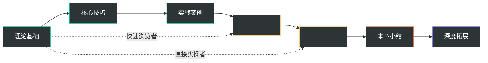
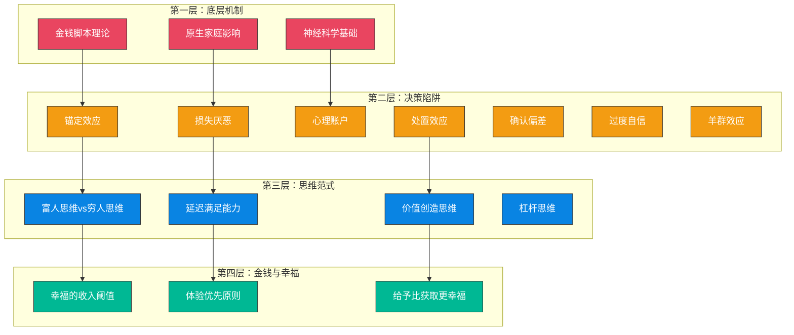

# 第32章：搞钱心理学

## 为什么这一章是整本书的核心枢纽

搞钱是一门技术活——你需要懂投资、懂理财、懂商业模式。但技术只是表层，真正决定你财富上限的，是你和金钱之间的心理关系。行为金融学研究反复证明：在所有影响财务表现的变量中，心理因素的解释力超过50%，远超专业知识、信息获取能力、甚至市场环境。

一个掌握了全部投资理论的人，可能因为"处置效应"而反复赢小亏大；一个精通消费心理学的营销专家，可能因为"金钱逃避脚本"而在无意识中破坏自己的财务成功。这不是知识问题，是心理问题。

本章的目标不是让你"知道"这些心理偏差——知道和做到之间隔着一道巨大的鸿沟。本章的目标是通过理论理解、工具训练、实战案例三重路径，帮你真正改变与金钱的心理关系。

```mermaid
graph TD
    A["搞钱心理学总览"] --> B["理论基础"]
    A --> C["核心技巧"]
    A --> D["实战案例"]
    A --> E["常见误区"]
    A --> F["练习方法"]
    A --> G["深度拓展"]

    B --> B1["金钱脚本理论"]
    B --> B2["消费心理学"]
    B --> B3["投资心理学"]
    B --> B4["富人思维vs穷人思维"]
    B --> B5["延迟满足"]
    B --> B6["金钱与幸福"]

    C --> C1["识别消费陷阱"]
    C --> C2["校正投资偏差"]
    C --> C3["培养富人思维"]
    C --> C4["建立延迟满足"]
    C --> C5["修复金钱关系"]
    C --> C6["理性决策框架"]

    D --> D1["月光族逆转"]
    D --> D2["投资心理校正"]
    D --> D3["金钱脚本改写"]
    D --> D4["延迟满足训练"]
    D --> D5["富人思维实践"]

    F --> F1["金钱脚本测试"]
    F --> F2["消费觉察日记"]
    F --> F3["投资心理复盘"]
    F --> F4["延迟满足训练"]
    F --> F5["富人思维培养"]

    style A fill:#1a1a2e,stroke:#e94560,color:#fff
    style B fill:#16213e,stroke:#0f3460,color:#fff
    style C fill:#16213e,stroke:#0f3460,color:#fff
    style D fill:#16213e,stroke:#0f3460,color:#fff
    style E fill:#16213e,stroke:#0f3460,color:#fff
    style F fill:#16213e,stroke:#0f3460,color:#fff
    style G fill:#16213e,stroke:#0f3460,color:#fff
```

---

## 核心问题：你要回答的五个关键问题

本章围绕五个核心问题展开，每个问题对应一个关键的心理学维度：

| # | 核心问题 | 对应维度 | 为什么重要 |
|---|---------|---------|-----------|
| 1 | 你的金钱观是如何形成的？原生家庭在其中扮演了什么角色？ | 金钱脚本 | 你的财务行为有80%是由你意识不到的深层信念驱动的 |
| 2 | 为什么你总是忍不住买买买？消费心理的底层机制是什么？ | 消费心理 | 平均每人每年有30%-40%的消费属于非理性消费 |
| 3 | 为什么你总是在高点买入、低点卖出？投资心理偏差有哪些？ | 投资心理 | 散户投资者的长期年化收益比市场平均低3-5个百分点 |
| 4 | 富人和穷人的思维方式有什么本质区别？ | 思维模式 | 思维模式决定了你能创造的财富上限 |
| 5 | 延迟满足真的是成功的关键吗？ | 延迟满足 | 延迟满足能力是预测长期财务成功的最强单一指标之一 |

---

## 本章内容导航

### 节次结构总览

| 节次 | 主题 | 文件数量 | 核心内容 | 建议学习时间 |
|------|------|---------|---------|-------------|
| 01-理论基础 | 搞钱心理学的理论框架 | 8个文件 | 金钱脚本、消费心理机制、投资心理偏差、富人vs穷人思维、延迟满足、金钱与幸福 | 3-4小时 |
| 02-核心技巧 | 识别和克服心理偏差的实操方法 | 7个文件 | 消费陷阱破解、投资偏差校正、富人思维培养、延迟满足训练、金钱关系修复、理性决策框架 | 3-4小时 |
| 03-实战案例 | 真实场景中的心理学应用 | 6个文件 | 月光族逆转、股市心理校正、金钱脚本改写、延迟满足训练、富人思维实践 | 2-3小时 |
| 04-常见误区 | 关于金钱心理的10大错误认知 | 1个文件 | 运气论、省钱致富、心理不重要、延迟满足=压抑等 | 1小时 |
| 05-练习方法 | 可立即使用的6套练习体系 | 1个文件 | 金钱脚本测试、消费觉察日记、投资复盘、延迟满足训练、富人思维培养、金钱关系修复 | 持续练习 |
| 06-本章小结 | 核心原则回顾与行动清单 | 1个文件 | 5大核心原则、分级行动清单 | 30分钟 |
| 07-深度拓展 | 神经科学、社会学、大数据视角 | 1个文件 | 大脑奖励系统、消费主义分析、投资行为大数据、心理干预方法、金钱与亲密关系 | 2-3小时 |

### 建议学习路径

**标准路径**（推荐）：按 01→02→03→04→05→06→07 顺序学习，约需 12-16 小时。

**快速路径**：如果时间有限，按 01→02→05→06 顺序学习核心内容，约需 7-9 小时。

**实操路径**：如果偏好动手练习，从 05-练习方法 开始，遇到不理解的概念再回到理论基础查阅。

---

## 关键概念速览

以下是本章涉及的核心概念，在后续各节中会详细展开。先建立全局认知框架，有助于理解后续内容之间的逻辑关系。

### 第一层：底层机制——你的金钱心理是如何形成的

**金钱脚本（Money Script）**：美国心理学家布拉德·克朗茨（Brad Klontz）提出的概念。指关于金钱的深层信念和假设，通常在童年时期形成，像"脚本"一样指导着你一生的财务行为——而你往往意识不到它的存在。克朗茨将金钱脚本分为四大类型：

| 脚本类型 | 核心信念 | 典型表现 | 财务后果 |
|---------|---------|---------|---------|
| 金钱逃避 | "钱是坏的/我不配有钱" | 回避看账单、无意识破坏财务成功 | 收入越高花钱越凶，难以积累财富 |
| 金钱崇拜 | "有钱就有一切" | 过度追求金钱、牺牲健康和关系 | 即使很富仍然不满足，可能陷入工作狂 |
| 金钱地位 | "我的价值=我的财富" | 炫耀性消费、买超出能力的东西 | 过度消费、债务危机 |
| 金钱警觉 | "钱要小心看管" | 过度节俭、不敢花钱、财务焦虑 | 可能过度储蓄但无法享受生活 |

**神经可塑性（Neuroplasticity）**：大脑的结构和功能可以通过经验和训练发生改变。这意味着金钱脚本虽然在童年形成，但并非不可改变——通过有意识的训练，可以建立新的神经通路，改写旧的金钱信念。

### 第二层：决策陷阱——你的每个财务决策都可能被扭曲

**锚定效应（Anchoring Effect）**：人们在做决策时过度依赖最先获得的信息（"锚"），即使这个信息与决策无关。在消费中，"原价1000，现价500"中的1000就是锚；在投资中，你的买入价就是锚。

**损失厌恶（Loss Aversion）**：诺贝尔经济学奖得主卡尼曼和特沃斯基的核心发现——人们对损失的痛苦感受是同等收益快乐感受的约2-2.5倍。这解释了为什么投资者过久持有亏损股票（不愿确认损失），以及为什么"限时优惠"如此有效（害怕损失优惠机会）。

**心理账户（Mental Accounting）**：诺贝尔经济学奖得主理查德·塞勒提出——人们在心理上将钱分成不同的"账户"，对不同来源、不同用途的钱有截然不同的态度。工资精打细算，年终奖挥金如土——这就是心理账户在起作用。

**处置效应（Disposition Effect）**：投资者倾向于过早卖出盈利的资产（锁定收益的快感），而过久持有亏损的资产（不愿确认损失的痛苦）。大数据分析显示，散户投资者普遍存在的"赢小亏大"模式，主要就是处置效应造成的。

**确认偏差（Confirmation Bias）**：人们倾向于寻找、解释和记住支持自己已有信念的信息，而忽视或低估与之矛盾的信息。在投资中，买入一只股票后只看正面消息，就是确认偏差的典型表现。

**过度自信偏差（Overconfidence Bias）**：人们倾向于高估自己的知识、能力和判断的准确性。研究表明，约74%的基金经理认为自己的业绩高于平均水平——这在统计学上是不可能的。

**羊群效应（Herd Behavior）**：人们倾向于跟随大多数人的行为，即使这些行为可能是不理性的。在投资市场中，追涨杀跌、FOMO（害怕错过）都是羊群效应的表现。

### 第三层：思维范式——你的思维模式决定了财富上限

**富人思维 vs 穷人思维**：这不是指有钱人和没钱人的区别，而是两种截然不同的思维模式。核心差异在于：

| 维度 | 穷人思维 | 富人思维 |
|------|---------|---------|
| 对金钱的基本态度 | 金钱是目的（为了赚钱而赚钱） | 金钱是工具（用钱实现目标） |
| 时间与金钱的关系 | 用时间换钱（打工思维） | 用钱买时间（杠杆思维） |
| 面对风险的反应 | 回避风险、追求安全 | 理解风险、管理风险 |
| 面对机会的反应 | "我买不起" → 停止思考 | "我如何买得起" → 寻找方案 |
| 收入模式 | 单一线性收入（工资） | 多元非线性收入（工资+投资+被动收入） |
| 对失败的态度 | 失败是终点，证明"我不行" | 失败是学费，告诉我"此路不通" |

**延迟满足（Delayed Gratification）**：为了更大的长远利益而放弃眼前的即时满足。斯坦福大学的棉花糖实验是这个概念最著名的验证——能等待的孩子在成年后的收入和财富水平显著更高。但延迟满足不是压抑欲望，而是选择在什么时候、以什么方式满足。

### 第四层：终极关系——金钱与幸福的真实关系

**幸福的收入阈值**：普林斯顿大学经典研究发现，年收入约7.5万美元（约合人民币50万元）以下时，收入增加会显著提升幸福感；超过这个门槛后效果大幅减弱。2023年沃顿商学院的最新研究则发现，收入超过阈值后幸福感仍然持续提升，但提升速度明显放缓。

**体验优先原则**：行为科学研究一致表明，将钱花在体验（旅行、学习、社交）上比花在物品上更能提升幸福感。体验带来的回忆会随时间"增值"，而物品带来的满足感会随时间"贬值"。

---

## 学习目标

完成本章学习后，你将能够：

### 基础层（理解）

1. **理解金钱脚本的形成机制**——知道自己的金钱观从何而来，识别四大脚本类型及其影响
2. **掌握消费心理学的核心原理**——理解锚定效应、损失厌恶、心理账户等机制如何影响你的每一次消费决策
3. **认知投资心理的主要偏差**——了解过度自信、羊群效应、处置效应等偏差的运作机制

### 应用层（识别与干预）

4. **觉察自己的心理偏差**——在做出财务决策的当下，能够识别出哪些心理偏差正在影响你
5. **使用具体工具校正偏差**——掌握独立估值法、冷静期规则、预设止损等实操工具
6. **培养富人思维模式**——从"我买不起"到"我如何买得起"的思维转换

### 内化层（改变行为）

7. **建立更健康的金钱关系**——修复与金钱的心理创伤，建立积极、理性、平衡的金钱态度
8. **形成可持续的财务行为系统**——用规则和环境设计代替意志力，让理性财务行为成为默认模式

---

## 适用人群

### 直接受益人群

| 人群特征 | 典型症状 | 本章重点章节 |
|---------|---------|-------------|
| 月光族/存不下钱 | 收入不低但月月光，不知道钱花哪了 | 消费心理学、心理账户、消费觉察日记 |
| 冲动消费者 | 经常买不需要的东西，买完后悔 | 锚定效应、损失厌恶、延迟满足训练 |
| 投资反复亏损 | 明明学了很多投资知识，但总在亏钱 | 投资心理偏差、处置效应、投资复盘 |
| 金钱焦虑者 | 对钱有强烈的焦虑、恐惧或内疚感 | 金钱脚本、金钱关系修复、CBT技术 |
| 知行不合一者 | 知道该怎么做但就是做不到 | 全章——这正是本章要解决的核心问题 |

### 间接受益人群

- **行为经济学和心理学爱好者**：本章提供了一个完整的"金钱心理学"知识体系
- **金融从业者**：理解客户的心理偏差，有助于提供更好的服务
- **创业者**：理解消费心理，有助于产品设计和营销策略
- **家长**：理解金钱脚本的形成机制，有助于为孩子建立健康的金钱观

### 学习前提

- **无硬性前提**：本章从零开始讲解，不需要心理学或金融学背景
- **建议先修**：如果你已经读过本书前面关于投资理财的章节，学习效果会更好——你能更清楚地看到"知道"和"做到"之间的差距
- **心态准备**：准备面对一些不太舒服的真相——你可能发现自己一直在犯一些"显而易见"的错误

---

## 知识体系全景图

本章的知识结构可以用一个四层金字塔来表示：

**自下而上的逻辑**：底层机制（金钱脚本）塑造了你的决策模式（心理偏差），决策模式固化为思维范式（富人/穷人思维），思维范式最终决定了你与金钱的关系质量（幸福还是焦虑）。

**自上而下的干预**：要改变与金钱的关系，需要从思维范式入手（意识层面），通过识别和校正心理偏差（行为层面），最终改写深层的金钱脚本（潜意识层面）。

---

## 核心理论来源与学术基础

本章的内容建立在以下学术传统之上，确保每一个观点都有实证支撑：

| 学术领域 | 代表人物 | 核心贡献 | 本章应用 |
|---------|---------|---------|---------|
| 行为经济学 | 丹尼尔·卡尼曼、阿莫斯·特沃斯基 | 前景理论、损失厌恶、启发式偏差 | 投资心理偏差分析 |
| 行为金融学 | 理查德·塞勒 | 心理账户、禀赋效应、助推理论 | 消费心理、理性决策框架 |
| 金钱心理学 | 布拉德·克朗茨 | 金钱脚本理论（四大类型） | 金钱脚本识别与改写 |
| 发展心理学 | 沃尔特·米歇尔 | 棉花糖实验、延迟满足理论 | 延迟满足训练 |
| 认知行为疗法 | 阿伦·贝克 | 认知扭曲识别、思维记录技术 | 金钱关系修复、CBT财务干预 |
| 神经经济学 | 布赖恩·克努森 | 金钱奖励的神经机制 | 理解心理偏差的生物学基础 |
| 社会学 | 凡勃伦、鲍德里亚 | 炫耀性消费、符号消费理论 | 消费主义批判、社交比较分析 |
| 积极心理学 | 马丁·塞利格曼 | 幸福理论、体验消费研究 | 金钱与幸福的关系 |

---

## 本章的独特价值

与其他搞钱指南相比，本章有三个独特之处：

**第一，不只是"知道"，更是"做到"。** 市面上的搞钱内容大多停留在"教你怎么做"的层面——告诉你该定投、该存钱、该控制消费。但如果你知道该怎么做却做不到，问题不在知识而在心理。本章直接解决"知行不合一"的问题。

**第二，提供完整的诊断-干预体系。** 从金钱脚本测试（诊断你的金钱心理类型）到具体的干预工具（消费觉察日记、投资复盘模板、延迟满足训练计划），本章提供了一套完整的自助体系，不只是概念介绍。

**第三，跨学科视角。** 本章综合了行为经济学、神经科学、发展心理学、社会学、认知行为疗法等多个学科的研究成果，为你提供了一个多维度的金钱心理学知识框架，而非单一视角的片面解读。

---

## 阅读建议

1. **先完成金钱脚本测试**：在学习理论基础之前，先做 05-练习方法 中的金钱脚本测试，了解自己的金钱心理类型，这样后续学习时会更有代入感
2. **带着自己的案例学习**：每学一个心理偏差，立即回想自己是否有过类似的经历，用真实案例来印证理论
3. **不要跳过练习**：本章的练习方法不是"可选的附加内容"，而是核心内容的一部分——没有练习的理论只是信息，经过练习的理论才是能力
4. **允许不适感**：识别自己的心理偏差可能会让你不舒服，这是正常的。不适感是改变的信号，不是学习出问题的信号
5. **循序渐进**：不需要一次性完成所有练习，每天花10-15分钟进行觉察和练习，持续30天以上才能看到真正的改变

***

> **一句话预告**：搞钱的底层是心理。你的金钱脚本决定了你与金钱的关系，你的心理偏差扭曲了你的每一个财务决策，你的思维模式设定了你的财富上限。改变搞钱的结果，首先要改变搞钱的心理。接下来的七节内容，将带你完成这个改变。
