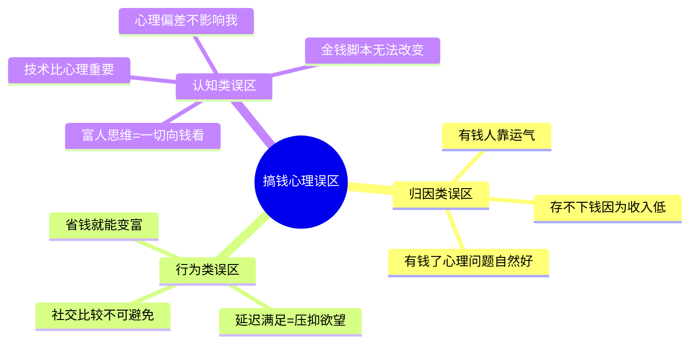
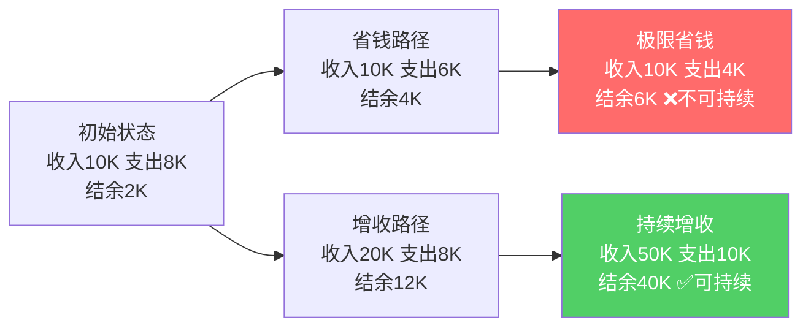
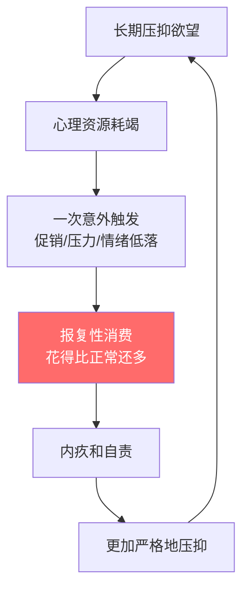
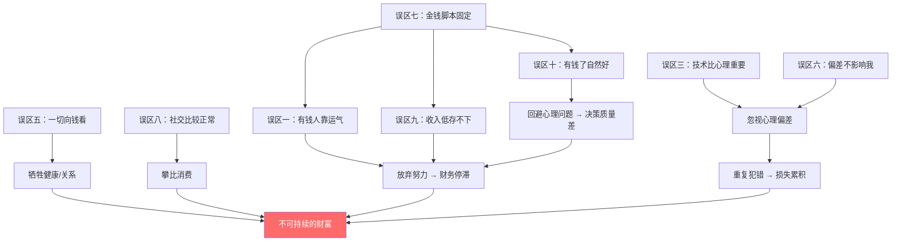

# 第四节 常见误区：搞钱心理学的认知陷阱

## 为什么误区比无知更危险

搞钱路上，最大的敌人往往不是缺乏知识，而是持有错误的信念。错误信念之所以危险，是因为它们披着"合理"的外衣——听起来逻辑自洽、符合直觉，甚至被周围人反复强化。你不会质疑一个你认为是"常识"的东西，而这些"常识"可能正在系统性地破坏你的财务决策。

心理学家称之为"元认知盲区"——你不仅不知道正确答案，你还不知道自己不知道。这种双重无知比单纯的无知更难纠正，因为你根本没有意识到需要纠正什么。

本节梳理搞钱心理学中最常见的十个认知误区。每个误区都包含三个层次：误区的典型表现、误区背后的深层逻辑、以及纠正后应该采取的行动。建议按顺序阅读，因为后面的误区往往建立在前面误区的基础之上。



---

## 误区一："有钱人都是靠运气"

### 典型表现

"他不过是赶上风口了"、"我要是生在那个家庭我也行"、"现在机会都没了"——这些话你一定听过。持有这种信念的人，把财富完全归因于外部因素：时机、出身、贵人、政策红利。由此推导出一个结论：既然运气不可控，那我赚不到钱也不是我的问题。

这种想法极具诱惑力，因为它同时解决了两个心理需求：解释了现状（我没运气），又免除了责任（不是我不努力）。

### 深层分析：为什么这个信念有害

从心理学角度看，这是一种典型的**外部归因偏差**（External Attribution Bias）。Martin Seligman 的习得性无助研究表明：当一个人反复将失败归因于外部、稳定、不可控的因素时，会逐渐放弃尝试，因为"努力也没用"。

更关键的是，这个信念存在严重的逻辑漏洞：

| 维度 | "靠运气"的解释 | 更完整的解释 |
|------|--------------|------------|
| 时间维度 | 他赶上了好时机 | 他在好时机之前已经准备了多年 |
| 能力维度 | 他遇到了贵人 | 他的能力和品格让贵人愿意投资他 |
| 风险维度 | 他赌对了 | 他系统性地管理风险，赌对的概率更高 |
| 复制性维度 | 他的成功不可复制 | 他的底层方法论可以迁移 |

**关键认知**：运气确实存在，但运气是概率事件。你能做的不是控制运气本身，而是控制"与运气相遇的概率"和"抓住运气的能力"。Nassim Taleb 在《随机漫步的傻瓜》中指出：幸存者偏差让人只看到运气的成分，忽略了大量有同样运气但没有成功的人——他们缺的恰恰是准备和能力。

### 纠正后的行动框架

**第一步：从外部归因转向可控归因**
- 问自己："在同样的外部环境下，我能做什么？"
- 列出你所在领域内，过去3年通过持续努力实现阶层跃迁的案例
- 分析他们做了哪些"非运气"的事情

**第二步：主动增加"运气暴露面"**
- 每周至少认识一个新朋友（来自不同行业/背景）
- 每月参加至少一次行业活动或社群
- 保持对新趋势的敏感度，定期阅读行业报告
- 记录你遇到的每一个"机会"，分析为什么抓住了或错过了

**第三步：建立"机会准备基金"**
- 保持6个月以上的应急储蓄，让你有能力在机会出现时投入
- 持续提升核心技能，让你在机会出现时能胜任
- 维护好核心人脉，让你在机会出现时能获取信息

> **一句话纠正**：运气是准备遇到机会时的副产品。你能控制的是准备的程度和遇到机会的频率。

---

## 误区二："省钱就能变富"

### 典型表现

把每一分钱都掰成两半花，研究各种薅羊毛技巧，为了省5块钱花半小时比价，甚至为了省房租住在离公司两小时通勤距离的地方。这类人往往有一个共同特征：对支出极度敏感，对收入增长几乎无感。

他们不是不努力，而是努力的方向错了——把80%的精力花在了"节流"上，只留20%给"开源"。

### 深层分析：数学模型揭示的真相

假设一个人月收入 10,000 元，每月支出 8,000 元，结余 2,000 元。

**省钱路径**：把支出从 8,000 压缩到 6,000，结余变成 4,000。提升了 100%。但要继续压缩到 4,000 元？生活质量会急剧下降，几乎不可持续。而且，6,000 元已经是很多城市的生存底线了。

**增收路径**：保持支出 8,000 不变，把收入从 10,000 提升到 20,000，结余变成 12,000。提升了 500%。而且收入的上限远高于支出的下限。



这个模型揭示了三个关键事实：

1. **支出有下限，收入没有上限**。你可以把支出压缩到接近零（理论上），但收入可以无限增长。
2. **省钱存在边际递减**。从花8000省到6000相对容易，从6000省到4000就很痛苦，再往下基本不可能。
3. **过度省钱会产生隐性成本**。住在远郊省了2000房租，但每天通勤4小时——这4小时如果用来学习新技能、做副业、拓展人脉，价值远超2000。

### 纠正后的行动框架

**支出端：建立"智能消费"系统**
- 区分"投资性消费"和"消耗性消费"：买书学习是投资，买奢侈品是消耗
- 设定支出上限而非追求极限压缩：支出控制在收入的 70%-80%
- 对大额支出（>月收入10%）设置48小时冷静期
- 每月复盘支出结构，砍掉"无感消费"（订阅了但不用的服务）

**收入端：投入80%精力在增收上**
- 梳理自己的可变现技能，找出收入增长的最大杠杆
- 每季度学习一项新技能或拓展一条收入渠道
- 把"省钱时间"重新分配给"增收行动"（比价30分钟 vs 学习新技能30分钟）
- 建立收入增长的里程碑和追踪机制

> **一句话纠正**：省钱是守，增收是攻。只守不攻，永远赢不了比赛。

---

## 误区三："我不需要了解心理学，只要学技术就行"

### 典型表现

热衷于学习各种投资分析方法、理财工具、商业模型，但对行为经济学、投资心理学毫无兴趣。他们的书架上摆满了《聪明的投资者》《富爸爸穷爸爸》，但没有一本关于心理偏差或情绪管理的书。他们相信"只要掌握了正确的方法，执行不是问题"。

### 深层分析：知道和做到之间的鸿沟

这是搞钱路上最致命的认知盲区之一。Daniel Kahneman（诺贝尔经济学奖得主）在《思考，快与慢》中揭示：人类大脑有两套系统——系统1（快速、直觉、情绪化）和系统2（慢速、理性、需要努力）。绝大多数财务决策是在系统1主导下做出的，即使你以为自己在"理性分析"。

来看一个真实的研究数据：

| 实验场景 | 预期行为（理性人） | 实际行为 | 偏差来源 |
|---------|----------------|---------|---------|
| 股票盈利20%时 | 继续持有（趋势可能延续） | 78%的人选择卖出 | 损失厌恶的反面——急于锁定收益 |
| 股票亏损20%时 | 止损卖出（控制风险） | 73%的人选择持有 | 损失厌恶——不愿承认亏损 |
| 收到意外奖金5万 | 按计划储蓄/投资 | 65%的人用于享乐消费 | 心理账户——"意外之财"不心疼 |
| 市场暴跌30% | 逢低买入 | 82%的人恐慌卖出 | 从众效应+损失厌恶叠加 |

数据来源：Odean (1998), Barberis & Thaler (2003) 等行为金融学经典研究。

这些数据说明什么？**技术分析告诉你"应该怎么做"，心理偏差决定了你"实际怎么做"**。两者之间的差距就是你的损失。

### 关键心理偏差速查表

| 偏差名称 | 表现 | 对搞钱的影响 | 应对策略 |
|---------|------|------------|---------|
| 损失厌恶 | 损失的痛苦是收益快乐的2倍 | 不愿止损、过度保守 | 设定自动止损规则 |
| 锚定效应 | 被第一个数字"锚住" | 对价格判断失准 | 多方比价，独立估值 |
| 确认偏差 | 只关注支持自己观点的信息 | 忽略风险信号 | 主动寻找反面证据 |
| 过度自信 | 高估自己的判断准确率 | 交易过于频繁、杠杆过大 | 记录预测准确率 |
| 从众效应 | 跟随大多数人的决策 | 追涨杀跌 | 建立独立决策框架 |
| 心理账户 | 对不同来源的钱区别对待 | "意外之财"乱花 | 统一财务管理 |
| 现状偏差 | 倾向于维持现状 | 错过调整时机 | 定期强制复盘 |
| 近因偏差 | 过度重视最近发生的事 | 被短期波动影响长期决策 | 看3年以上的数据 |

### 纠正后的行动框架

**每周投资1小时在心理学习上**
- 书单：《思考，快与慢》《助推》《行为经济学讲义》《投资中最简单的事》
- 实践：每次做完重大财务决策后，写下"我为什么做这个决定"，一周后回顾

**建立"心理检查清单"**
每次做重大财务决策（>月收入10%）前，必须回答以下问题：
1. 我现在的情绪状态是什么？（愤怒/兴奋/焦虑/平静）
2. 这个决策是否有时间压力？（紧急决策更容易被偏差主导）
3. 我是否只看了支持我观点的信息？（确认偏差检查）
4. 如果反向操作，结果会怎样？（逆向思维检查）
5. 一年后我会怎么看这个决定？（长期视角检查）

> **一句话纠正**：技术决定你能看到什么机会，心理决定你能抓住什么机会。

---

## 误区四："延迟满足就是压抑欲望"

### 典型表现

把延迟满足理解为"现在不享受，将来再享受"，过着极度节俭的生活，拒绝一切非必要支出。典型口头禅是"等我攒够了钱再说"、"现在不是享受的时候"。

### 深层分析：棉花糖实验的误读

"延迟满足"这个概念来自 Walter Mischel 的棉花糖实验。实验告诉孩子："如果你能等15分钟不吃这块棉花糖，就可以得到两块。"后来的跟踪研究发现，能等待的孩子在学业、收入、健康等方面表现更好。

但这个实验被广泛误读了。关键的误读在于：

**误读1：延迟满足=无限期延迟**
- 原实验的延迟时间是15分钟，不是15年
- 延迟满足的核心是"选择最优时机满足"，不是"永远不满足"
- 无限制的延迟会导致心理资源耗竭，最终报复性消费

**误读2：成功靠意志力**
- Mischel 后续研究发现，成功的儿童使用的不是"硬扛"，而是**注意力转移策略**——他们把棉花糖推到视线之外、唱歌、看别处
- 这意味着：延迟满足是一种**策略**，不是一种**品格**
- 环境设计比意志力更重要

**误读3：只延迟消费，不延迟其他**
- 人们只把延迟满足应用在消费上，却不会延迟"即时安全感"（比如过度储蓄）或延迟"即时认同"（比如为了面子买奢侈品）
- 真正的延迟满足是对所有即时冲动的管理

### 报复性消费的心理机制

当一个人长期压抑欲望，会发生以下恶性循环：



研究数据：Laran & Salerno (2013) 的研究表明，当人们经历了一段时间的自我控制后，会产生"自我控制反弹效应"——他们比没有经历自我控制的人更倾向于选择放纵性的产品。

### 纠正后的行动框架

**第一步：建立"快乐预算"**
每月收入的5%-10%专门用于"无理由快乐消费"。这笔钱花出去不需要任何理由，不需要内疚。它的存在本身就是对心理资源的保护。

**第二步：区分"延迟满足"和"替代满足"**
| 延迟满足（正确） | 压抑欲望（错误） |
|---------------|---------------|
| 今天不买奢侈品，但喝一杯好咖啡 | 什么非必要消费都不做 |
| 把大额消费推迟到下月再决定 | 永远不买想要的东西 |
| 先投资，用投资收益奖励自己 | 先不享受，等"有钱了"再说 |
| 找到低成本的快乐替代方案 | 用意志力硬扛不快乐 |

**第三步：设计环境而非依赖意志力**
- 卸载购物App的推送通知（减少触发源）
- 设置消费上限提醒（到达阈值自动提示）
- 把储蓄设为自动扣款（先储蓄后消费，而不是先消费再看剩多少）
- 准备一个"冲动购物等待清单"——想买的东西先写下来，等48小时再决定

> **一句话纠正**：延迟满足不是"不满足"，而是"在最优时机用最优方式满足"。

---

## 误区五："富人思维就是一切向钱看"

### 典型表现

认为富人就是"满脑子只有钱"的人，把"搞钱"理解为"一切以金钱为标准"。为了赚钱可以加班到凌晨三点、可以牺牲所有社交、可以忽略身体健康、可以不择手段。口头禅是"赚钱最重要，其他的以后再说"。

### 深层分析：这恰恰是穷人思维

这个误区的讽刺之处在于：**把"一切向钱看"当成富人思维，恰恰是最典型的穷人思维**。

真正的富人思维有三个层次：

**第一层：金钱是工具，不是目的**
- 富人思考的是"我想要什么样的人生"，然后用金钱作为实现手段
- 穷人思维是"我想要钱"，然后把获得金钱本身当作目标
- 区别：目标导向 vs 手段导向

**第二层：财富是系统，不是数字**
- 富人建立的是一个持续产生价值的系统（企业、投资组合、知识产权）
- 穷人追求的是一个具体的数字（月薪多少、存款多少）
- 区别：系统思维 vs 数字思维

**第三层：价值创造是根本，财富是副产品**
- 富人关注"我能为多少人解决什么问题"，财富是价值创造的自然结果
- 穷人关注"我能从中赚多少钱"，忽略了价值创造这个前提
- 区别：价值思维 vs 利润思维

哈佛商学院的研究追踪了1500名企业创始人，发现：以"赚钱"为首要动机的创始人，其企业5年存活率为34%；以"解决问题"为首要动机的创始人，5年存活率为62%。后者的平均收入反而更高。

### "过度追求金钱"的代价清单

| 牺牲的维度 | 短期代价 | 长期代价 | 反噬表现 |
|----------|---------|---------|---------|
| 健康 | 疲劳、失眠 | 慢性病、猝死 | 医疗支出远超多赚的钱 |
| 关系 | 忽视家人朋友 | 孤独、离婚 | 情感空虚、缺乏支持系统 |
| 道德 | 侥幸心理 | 信誉崩塌 | 机会成本远大于短期收益 |
| 成长 | 停止学习 | 能力停滞 | 被时代淘汰 |
| 意义 | 充实感 | 存在危机 | "有钱了但不快乐" |

### 纠正后的行动框架

**建立"人生资产负债表"**

不仅记录财务资产，还记录以下维度：

| 维度 | 资产（加分项） | 负债（减分项） |
|------|-------------|-------------|
| 财务 | 收入、存款、投资 | 负债、不良消费习惯 |
| 健康 | 运动习惯、体检正常 | 久坐、熬夜、三高 |
| 关系 | 深度关系数量、家庭满意度 | 社交孤立、家庭矛盾 |
| 成长 | 新技能、新视野、阅读量 | 停滞、舒适区 |
| 意义 | 使命感、价值感、贡献感 | 空虚、迷茫、无意义感 |

每月评估一次，确保所有维度都在正向发展，而不是用一个维度的"资产"去填补另一个维度的"负债"。

> **一句话纠正**：真正的富人思维是"通过为他人创造价值来实现自己的富足"，不是"一切向钱看"。

---

## 误区六："心理偏差只影响别人，不影响我"

### 典型表现

学完了各种心理偏差后，产生一种"知识免疫"的错觉：我知道了锚定效应，所以我不会再被锚定；我知道了确认偏差，所以我会主动寻找反面证据。甚至在看到别人犯这些错误时，会觉得"他不懂行为经济学，我懂，所以我不会犯"。

### 深层分析：这本身就是一种偏差

这种信念在心理学中被称为**偏差盲点**（Bias Blind Spot）——研究发现，了解心理偏差的人，反而可能高估自己的理性程度。Pronin 等人（2002）的研究表明：人们对自身偏差的觉察能力，远低于对他人偏差的觉察能力。换句话说，你看到别人的偏差很清楚，但对自己的偏差视而不见。

更深层的原因是：**心理偏差运作在意识层面之下**。它不是你"选择"要犯的错误，而是大脑自动处理信息时的系统性偏差。就像视觉错觉——即使你知道缪勒-莱尔错觉的原理，两条线看起来仍然不一样长。知道不等于免疫。

专业投资者也逃不掉：
- 长期资本管理公司（LTCM）：两位诺贝尔经济学奖得主创立，因过度自信和杠杆管理失误，在1998年亏损46亿美元
- 大量研究表明，专业基金经理的交易频率与收益负相关——越自信的人交易越频繁，收益越差（Odean, 1999）

### 纠正后的行动框架

**原则：用系统代替意志力**

既然"知道"不能让你免疫，那就要建立外部系统来约束自己：

**系统一：决策日志**
```text
日期：____
决策内容：____
决策时的情绪状态（1-10）：____
决策的依据（列出3个）：____
反面证据（列出2个）：____
预期结果：____
实际结果（1个月后填写）：____
偏差复盘（回看时识别出哪些偏差）：____
```

**系统二：预承诺机制**
- 投资：设定买入/卖出的规则，到点自动执行，不给情绪介入的机会
- 消费：设置每日/每月消费上限，到限额自动锁卡
- 储蓄：发工资日自动转账到投资账户，剩多少花多少

**系统三：外部问责**
- 找一个"决策伙伴"，重大财务决策前互相审查
- 加入投资社群，定期分享决策和复盘
- 每季度做一次"偏差审计"：回顾过去3个月的决策，识别哪些受到了偏差影响

> **一句话纠正**：了解偏差是第一步，建立对抗偏差的系统才是真正的免疫。

---

## 误区七："金钱脚本是固定的，改不了"

### 典型表现

"我从小家里就穷，所以我对钱没概念"、"我爸妈就是这样的，我也没办法"、"我这个性格不适合赚钱"。这类人把自己当前的金钱行为归因于原生家庭，并认为这些模式已经"固化"了，无法改变。

### 深层分析：神经科学怎么说

金钱脚本（Money Script）是 Brad Klontz 提出的概念，指我们在成长过程中内化的关于金钱的无意识信念。常见的四种金钱脚本：金钱逃避（"钱是万恶之源"）、金钱崇拜（"有钱就有一切"）、金钱地位（"有钱才有尊严"）、金钱警觉（"随时可能失去一切"）。

这些脚本确实根深蒂固，但**并非不可改变**。神经科学提供了坚实的理论基础：

1. **神经可塑性（Neuroplasticity）**：大脑在任何年龄都能形成新的神经连接。伦敦出租车司机的海马体比普通人更大——这是长期空间导航训练的结果。同样的原理适用于金钱思维的重塑。

2. **认知行为疗法（CBT）的有效性**：大量随机对照试验表明，CBT 可以有效改变深层信念。Hofmann 等人（2012）的元分析涵盖了 269 项研究，确认 CBT 对焦虑、抑郁等多种心理问题有显著效果。金钱脚本本质上是一种认知模式，同样适用。

3. **习惯形成的可操作性**：James Clear 在《原子习惯》中指出，习惯的改变不需要巨大的意志力，只需要正确的小步骤。每天改变1%，一年后就是37倍。

### 金钱脚本识别与改写工作表

| 金钱脚本类型 | 典型信念 | 行为表现 | 改写后的信念 |
|------------|---------|---------|------------|
| 金钱逃避 | "钱是肮脏的"、"有钱人都不善良" | 回避赚钱机会、有钱后无意识地花光 | "金钱是中性的工具，善良的人用它做好事" |
| 金钱崇拜 | "有钱就幸福"、"钱能解决一切问题" | 过度追求金钱、忽视其他人生维度 | "金钱是重要的资源之一，但不是唯一" |
| 金钱地位 | "有钱才有价值"、"别人看不起我没钱" | 炫耀性消费、攀比、用金钱定义自我 | "我的价值不由银行余额定义" |
| 金钱警觉 | "钱随时会没了"、"不能让别人知道我有钱" | 过度节俭、不敢花钱、焦虑 | "我有能力管理好我的财务" |

**改写步骤：**
1. **识别**：写下你关于金钱的第一反应（不加思考，直接写）
2. **溯源**：这个信念最早是什么时候、从谁那里学到的？
3. **检验**：这个信念在现实中是否有足够的证据支持？有哪些反例？
4. **改写**：用一个更准确、更有建设性的信念替代
5. **强化**：每天早上默念改写后的信念，持续21天
6. **行动**：设计一个与新信念一致的小行动，立即执行

> **一句话纠正**：金钱脚本是后天习得的，既然是"学到的"，就可以"重新学"。

---

## 误区八："社交比较是正常的，不需要改变"

### 典型表现

看到同事换了新车，心里不舒服；朋友圈里有人晒旅行照片，觉得自己过得不如人；同学聚会上听说别人年薪百万，回家后闷闷不乐。但你认为这些都是"人之常情"，不需要也不值得去改变。

### 深层分析：社交媒体时代的比较陷阱

社交比较是人类的本能——Leon Festinger 在1954年就提出了社会比较理论。适度的向上比较可以激励人进步，但问题在于**现代社会的社交比较已经被严重扭曲了**：

**扭曲一：信息不对称**
你看到的是别人的"精选集"，不是"完整版"。朋友圈里的旅行照看不到背后的信用卡账单，同事的新车看不到他的车贷压力，同学的高薪看不到他的工作时长和健康状况。

研究数据：一项针对3000名成年人的调查发现，72%的社交媒体用户表示使用社交媒体后会感到嫉妒或不满，但同时91%的人承认他们在社交媒体上只展示积极的一面。

**扭曲二：比较维度错位**
你拿自己的"日常"和别人的"高光时刻"比。你拿自己的"全部维度"和别人的"单一维度"比。这种不对称的比较必然导致失衡感。

**扭曲三：无限升级**
向上比较没有终点。月薪1万时羡慕月薪3万的，月薪3万时羡慕月薪10万的，月薪10万时羡慕年入百万的。总有比你更有钱的人。这种"跑步机效应"让你永远处于不满足的状态。

### 社交比较的自我诊断

回答以下问题（是/否）：
1. 刷完朋友圈/社交媒体后，经常感到焦虑或不满？
2. 购买某个东西的主要原因是"别人都有"？
3. 会因为别人的收入/消费水平而质疑自己的选择？
4. 经常在心里默默和身边的人比较？
5. 比较的结果通常是"我不如别人"？

如果回答了3个以上的"是"，说明社交比较正在显著影响你的财务决策和心理状态。

### 纠正后的行动框架

**环境层面：减少比较触发源**
- 取关或屏蔽经常发布炫耀性内容的账号
- 设定社交媒体的使用时段和时长（如每天不超过30分钟）
- 清理朋友圈：只保留给你带来积极影响的人

**认知层面：建立正确的比较框架**
- **纵向比较取代横向比较**：和昨天的自己比，而不是和今天的别人比
- **全面比较取代单一比较**：如果你要比较，就比较全部维度（财务、健康、关系、成长、意义感），而不是只比收入
- **过程比较取代结果比较**：比学习投入度、成长速度，而不是比当前的绝对值

**行动层面：把比较能量转化为行动**
- 每次产生比较冲动时，转化为一个具体的学习目标
- 建立自己的"成功标准"，不以他人的标准定义自己的成功
- 每周记录3件自己做得好的事情（无论大小），培养自我肯定的习惯

> **一句话纠正**：你唯一的竞争对手是昨天的自己。和别人比是消耗，和自己比是成长。

---

## 误区九："我存不下钱是因为收入太低"

### 典型表现

"等我月薪2万就能存钱了"、"这个月开销太大了，下个月再存"、"我挣的钱刚够花，哪有余钱存"。这类人有一个共同的思维模式：储蓄 = 收入 - 支出，只有当收入"足够高"时才能存下钱。

### 深层分析：帕金森定律的无情验证

帕金森定律原本描述的是"工作会膨胀到填满所有可用时间"，但在财务领域同样适用：**支出会膨胀到填满所有可用收入**。

多项研究和实际数据支持这一点：

- 2019年的一项研究追踪了2000名获得加薪的员工：在加薪后的12个月内，78%的人支出增长幅度超过了收入增长幅度
- 彩票中奖者的破产率：约70%的彩票大奖得主在7年内破产或回到中奖前的财务水平
- 中国家庭金融调查（CHFS）数据：不同收入群体的储蓄率差异远小于预期，低收入群体中仍有相当比例的人能存下钱

这些数据共同指向一个事实：**储蓄是一个习惯，不是一个条件**。

### 正确的储蓄公式

错误公式：储蓄 = 收入 - 支出（储蓄是"剩下的"）
正确公式：支出 = 收入 - 储蓄（储蓄是"先拿走的"）

这个公式转换的意义在于心理账户的重构。当储蓄是"剩下的"，它永远是0，因为支出总能找到理由膨胀。当储蓄是"先拿走的"，你的消费会自动适应剩余的金额。

**实证数据**：Thaler & Benartzi (2004) 的"明天储蓄更多"计划（SMarT）证明了这一点。该计划的核心就是每次加薪时自动增加储蓄比例。参与者在40个月内，储蓄率从3.5%提升到了13.6%——接近4倍。

### 纠正后的行动框架

**第一步：从1%开始**
不要想着一步到位存30%。从收入的1%开始。月薪1万，每月存100。这个金额小到不会影响任何生活方式，但它建立了"储蓄"这个行为本身。习惯建立后再逐步提升比例。

**第二步：自动化执行**
- 设置发工资日（或次日）自动转账到储蓄/投资账户
- 转账金额 = 收入 × 目标比例（从1%开始，每3个月提升1%）
- 剩下的钱就是你这个月可以花的钱

**第三步：建立储蓄里程碑**
| 阶段 | 储蓄比例 | 里程碑 | 心理意义 |
|------|---------|--------|---------|
| 启动期 | 1%-5% | 建立自动储蓄习惯 | "我能存钱" |
| 成长期 | 5%-15% | 存够1个月应急金 | "我有安全垫" |
| 加速期 | 15%-25% | 存够3个月应急金 | "我有选择权" |
| 成熟期 | 25%-35% | 开始投资，钱生钱 | "我的钱在为我工作" |

**第四步：收入增长时的"储蓄优先"策略**
- 每次加薪或获得额外收入，先将50%增加到储蓄中
- 剩下的50%用于提升生活品质
- 这样你既享受了收入增长的成果，又避免了帕金森定律的陷阱

> **一句话纠正**：存不下钱不是因为挣得少，是因为没有把储蓄放在支出前面。

---

## 误区十："心理问题不重要，有钱了自然就好了"

### 典型表现

"我现在焦虑是因为没钱，有钱了就不焦虑了"、"我现在忍不住乱花钱是因为想买的东西买不起，有钱了就不会乱花了"、"等我赚到第一个100万，一切都会好起来"。

### 深层分析：为什么金钱不能治愈心理问题

这是十个误区中最具破坏力的一个，因为它让人把解决心理问题的希望寄托在一个可能永远不会到来（或者到来后也不会起作用）的条件上。

**事实一：富人同样有心理问题**

美国国家心理健康研究所的数据显示，高收入群体中焦虑症和抑郁症的患病率并不比低收入群体低多少。很多亿万富翁公开谈论过自己的心理健康挑战。这不是个例，而是规律。

**事实二：金钱可能放大已有的心理问题**

| 心理问题 | 没钱时的表现 | 有钱后的表现 |
|---------|------------|------------|
| 焦虑倾向 | 担心下个月的房租 | 担心投资亏损、财富缩水、被人盯上 |
| 冲动消费 | 买了不需要的小东西 | 买了不需要的大东西（豪车、奢侈品） |
| 自我价值感低 | "我没钱所以没价值" | "我有钱了但还是觉得空虚" |
| 关系问题 | "等有钱了关系就好了" | "他/她是看上我的钱还是我这个人" |

**事实三：财富会带来新的心理挑战**

心理学家 Stephen Goldbart 称之为"突然财富综合征"（Sudden Wealth Syndrome），症状包括：
- **内疚感**：为什么是我？别人比我更努力但没我赚得多
- **孤立感**：朋友疏远了，不知道该信任谁
- **身份危机**：我不再是"那个穷小子"了，我是谁？
- **决策瘫痪**：突然有了太多选择，不知道该怎么管理
- **目标迷失**：当初的目标是赚钱，现在赚到了，然后呢？

### 纠正后的行动框架

**原则：心理建设和财富建设同步进行**

**现在就开始的心理工作：**
1. **觉察金钱情绪**：每次和钱相关的决策或互动后，记录自己的情绪反应。不需要分析，只需要记录。一个月后回顾，你会看到清晰的模式。
2. **找到金钱脚本**：用前面误区七的工作表，识别自己的核心金钱信念
3. **建立情绪缓冲机制**：在冲动消费/冲动投资前，强制等待24小时
4. **发展非金钱的自我价值来源**：培养至少一个不依赖金钱的成就感来源（技能、关系、创造、贡献）

**什么时候该寻求专业帮助：**
- 金钱焦虑影响了日常睡眠和工作
- 无法控制消费行为，即使知道后果
- 因为金钱问题导致了严重的家庭矛盾
- 对金钱有极端的情绪反应（恐惧、愤怒、羞耻）
- 重复性的财务自我破坏行为（每次快成功时就会"搞砸"）

> **一句话纠正**：心理问题是搞钱路上的"隐形杀手"。不先解决它，你赚到的每一分钱都会被它吃掉。

---

## 综合诊断：十大误区的关联与自检

这十个误区不是孤立存在的，它们之间存在深层关联：



### 自检清单

在结束本节之前，做一次诚实的自我评估。对以下每条，用1-5分评估你的认同程度（1=完全不认同，5=非常认同）：

| 序号 | 自检项目 | 得分 |
|------|---------|------|
| 1 | 我倾向于把别人的成功归因于运气或背景 | ____ |
| 2 | 花在研究省钱上的时间多于研究赚钱 | ____ |
| 3 | 很少阅读行为经济学或投资心理学的内容 | ____ |
| 4 | 认为延迟满足就是不享受 | ____ |
| 5 | 为了赚钱可以牺牲其他所有维度 | ____ |
| 6 | 认为自己不会受到心理偏差的影响 | ____ |
| 7 | 认为自己的金钱观无法改变 | ____ |
| 8 | 经常因为别人的消费水平感到焦虑 | ____ |
| 9 | 认为收入提高后自然就能存下钱 | ____ |
| 10 | 认为心理问题不重要，有钱了就解决了 | ____ |

**评分解读：**
- 10-20分：你的金钱心理基础很健康，继续保持
- 21-30分：有一些误区需要关注，建议定期复盘
- 31-40分：多个误区正在影响你的财务决策，需要系统性地纠正
- 41-50分：严重的认知误区正在系统性地阻碍你的财富增长，建议从最认同的3条开始逐个突破

---

## 本节小结

搞钱心理学的十大误区可以归纳为三个核心问题：

1. **归因错误**：把成功归因于运气/外部条件（误区一、九），把自己的行为归因于不可改变的因素（误区七），把解决问题的希望寄托于未来的条件（误区十）

2. **认知盲区**：高估技术的重要性、低估心理的影响（误区三），认为自己免疫于心理偏差（误区六），把社交比较当作正常现象不加管理（误区八）

3. **行为偏差**：只节流不开源（误区二），把延迟满足理解为压抑欲望（误区四），把富人思维理解为一切向钱看（误区五）

克服这些误区的关键不在于"知道"它们存在，而在于**建立系统性的应对机制**——因为心理偏差的特点就是"知道也不会自动免疫"。每个误区后面的行动框架，才是本节最有价值的内容。选择你认同度最高的3个误区，从今天开始行动。
