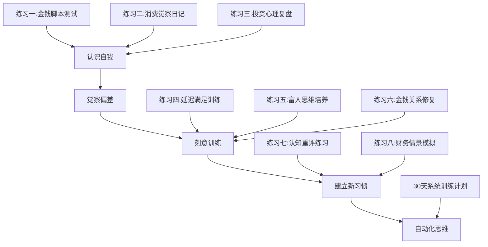
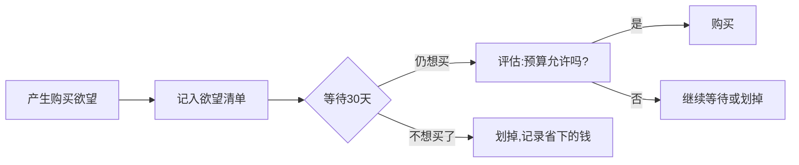

# 第32章 练习方法：搞钱心理学

## 为什么需要练习？

前几节我们学习了金钱脚本理论、消费心理学、投资心理学、富人思维等知识。但知识本身不会改变行为——神经科学研究表明，大脑中的思维通路是通过反复练习才得以强化的。正如你不能通过阅读游泳教材学会游泳，你也不能通过阅读心理学理论改变自己的金钱行为。

本节提供一套系统化的练习体系，覆盖从"认识自我"到"建立新习惯"的完整链路。每个练习都标注了：

- **难度等级**：入门 / 进阶 / 高阶
- **时间投入**：单次练习时长 + 推荐持续周期
- **心理学原理**：这个练习为什么有效
- **预期效果**：完成练习后你会获得什么



---

## 练习一：金钱脚本测试

| 属性 | 内容 |
|------|------|
| **难度** | 入门 |
| **单次时长** | 15-20分钟 |
| **推荐周期** | 首次完整测试 + 每3个月复测一次 |
| **心理学原理** | Klontz金钱脚本理论（Money Script Theory），通过结构化问卷识别童年时期形成的无意识金钱信念 |
| **预期效果** | 识别你的主导金钱脚本类型，理解自身金钱行为的心理根源 |

### 什么是金钱脚本？

金钱脚本（Money Script）是由心理学家Brad Klontz和Ted Klontz提出的概念，指的是我们在童年时期通过观察父母、家庭环境和社会文化而内化的一系列关于金钱的无意识信念。这些信念像"自动运行的程序"一样，在我们意识不到的情况下驱动着我们的财务行为。

Klontz等人的研究（2011年发表在Journal of Financial Therapy）将金钱脚本分为四类：

| 脚本类型 | 核心信念 | 典型行为 | 财务后果 |
|----------|----------|----------|----------|
| **金钱逃避** | "钱是肮脏的/危险的" | 回避财务话题、破坏财务成功 | 收入自我设限、财务混乱 |
| **金钱崇拜** | "钱能解决一切问题" | 过度追求金钱、用消费填补空虚 | 永远觉得不够、消费成瘾 |
| **金钱地位** | "人的价值由财富决定" | 炫耀性消费、攀比 | 过度负债、身份焦虑 |
| **金钱警觉** | "必须时刻警惕金钱安全" | 极度节俭、对金钱保密 | 错失机会、生活质量低 |

### 测试题目

请对以下每个陈述打分（1=完全不同意，5=完全同意）。回答时不要过度思考，选择你第一时间的真实反应。

**金钱逃避类**：

1. 有钱人通常是不道德的 ___分
2. 钱是万恶之源 ___分
3. 我不配拥有很多钱 ___分
4. 有钱会让关系变质 ___分
5. 我经常回避处理财务问题 ___分

**金钱崇拜类**：

6. 如果我有更多钱，一切都会好起来 ___分
7. 赚钱是我人生最重要的事情 ___分
8. 我永远觉得自己的钱不够多 ___分
9. 钱能买到幸福 ___分
10. 我经常幻想如果我中了彩票会怎样 ___分

**金钱地位类**：

11. 别人会通过我的消费来评判我 ___分
12. 买贵的东西才能显示我的身份 ___分
13. 我需要让别人知道我有钱 ___分
14. 我经常买自己负担不起的东西 ___分
15. 我的价值取决于我有多少钱 ___分

**金钱警觉类**：

16. 存钱是非常重要的 ___分
17. 花钱应该非常谨慎 ___分
18. 我不应该让别人知道我有多少钱 ___分
19. 我经常担心自己的财务状况 ___分
20. 要为未来做好充分的准备 ___分

### 计分方法

分别计算四类脚本的总分（每类5题，总分5-25分）：

- 金钱逃避总分：___分
- 金钱崇拜总分：___分
- 金钱地位总分：___分
- 金钱警觉总分：___分

**得分最高的一类就是你的主导金钱脚本。**

> **注意**：多数人不是单一脚本，而是以某一种为主、其他为辅的混合型。比如"金钱警觉为主 + 金钱逃避为辅"意味着你既极度谨慎又在潜意识中排斥金钱。混合型的干预策略需要同时针对两种脚本。

### 解读与行动指南

**如果主导脚本是金钱逃避**：

你的核心问题是"对金钱的排斥"。你可能在无意识中破坏自己的财务成功——比如快要加薪时突然辞职、投资快盈利时恐慌卖出、接到大项目时莫名拖延。这种行为的根源往往是童年时期目睹了金钱带来的家庭冲突（父母因为钱吵架、因为钱被伤害），你的大脑得出了"钱=危险"的结论。

- **觉察练习**：记录一个月内所有"无意识回避财务"的行为（不看账单、不查余额、拖延报税、回避加薪谈判）
- **认知重构**：写出"钱是中性的工具，它能带来安全和自由，也能带来贪婪和冲突——关键在于使用它的人"，每天读三遍
- **行为实验**：每天花5分钟查看自己的财务状况，从面对数字开始，逐步培养对金钱的中性态度
- **进阶**：尝试一次小额投资（如100元买基金），体验"钱为我工作"的感觉

**如果主导脚本是金钱崇拜**：

你的核心问题是"把金钱神化"。你相信只要有钱就能解决所有问题，这导致你在缺钱时极度焦虑，有钱时又迅速挥霍——因为你把花钱等同于"解决问题"。根源往往是童年时期经历过经济匮乏（家庭贫困、突然破产），你的大脑得出了"钱=安全"的过度泛化结论。

- **觉察练习**：每次感到焦虑时，问自己"这个问题真的只有钱能解决吗？"
- **认知重构**：列出你人生中最重要的5件事，标注哪些是钱买不到的（健康、真爱、时间、内心平静、真挚友谊）
- **行为实验**：尝试一周"低消费日"——每天消费不超过50元，记录自己的情绪变化
- **进阶**：练习"非金钱满足"——用运动、阅读、社交、创作来获得快乐，而不是消费

**如果主导脚本是金钱地位**：

你的核心问题是"用金钱定义自我价值"。你的消费不是为了满足需求，而是为了维护身份形象。你害怕别人觉得你穷，所以宁可负债也要维持"体面"。根源往往是童年时期家庭条件不好，被同龄人嘲笑或排挤，你的大脑得出了"有钱=被尊重"的等式。

- **觉察练习**：每次购物前问自己"如果没有人知道我买了这个，我还会买吗？"
- **认知重构**：列出5个你尊敬的人，思考你尊敬他们是因为财富还是品质？
- **行为实验**：尝试一次"低调消费日"——穿最普通的衣服、去最普通的餐厅，记录别人的反应和自己的感受
- **进阶**：在朋友圈/社交媒体停发一个月消费相关内容，观察自己的焦虑变化

**如果主导脚本是金钱警觉**：

你的核心问题是"对金钱的过度恐惧"。你把大量精力用在"防止失去"上，而不是"创造更多"上。你可能有很好的储蓄习惯，但不敢投资、不敢创业、不敢花钱提升自己。根源往往是童年时期经历过经济不稳定（父母失业、家庭变故），你的大脑得出了"随时可能失去一切"的结论。

- **觉察练习**：记录你每天花在"担心钱"上的时间和精力，换算成机会成本
- **认知重构**：计算你过去5年的储蓄增长率，用数据证明"失去一切"的概率极低
- **行为实验**：每月给自己一笔"自由消费"预算（建议月收入的5%），必须花完，练习享受消费
- **进阶**：尝试一次小金额投资（如500元买指数基金），体验"让钱生钱"的过程

---

## 练习二：消费心理觉察日记

| 属性 | 内容 |
|------|------|
| **难度** | 入门 |
| **单次时长** | 每笔消费记录2-3分钟，每日汇总10分钟 |
| **推荐周期** | 连续30天（第一轮），之后每月抽查一周 |
| **心理学原理** | 元认知（Metacognition）——"对自己思维的觉察"本身就能改变行为。记录消费时的心理状态，能让你从"自动驾驶"模式切换到"手动驾驶"模式 |
| **预期效果** | 识别你的消费触发因素和心理偏差模式，减少冲动消费30%-50% |

### 为什么记录比克制更有效？

很多人试图通过"忍住不买"来控制消费，但心理学研究表明，单纯依靠意志力的自我控制策略（ego depletion）在疲劳时会失效。更有效的方法是**觉察**——当你清楚地意识到"我现在的消费冲动是因为焦虑"时，冲动往往会自动减弱。

这背后的机制是"元认知觉察"：当你把注意力放在自己的思维过程上时，你就从情绪驱动的"系统1"（快速、自动、情绪化）切换到了理性分析的"系统2"（缓慢、刻意、逻辑化）。记录日记就是强迫你切换到系统2的过程。

### 操作方法

连续记录30天的消费，每笔消费（超过10元的）都回答以下问题：

| 日期 | 消费项目 | 金额 | 消费前的情绪（1-10分） | 触发因素 | 是"需要"还是"想要" | 心理偏差类型 | 等待时间 | 是否后悔 |
|------|----------|------|----------------------|----------|-------------------|-------------|----------|----------|
| 示例 | 网红奶茶 | 28元 | 焦虑(7) | 同事都在点 | 想要 | 从众效应 | 0分钟 | 否 |
| 示例 | 某品牌包 | 2800元 | 空虚(8) | 刷到广告 | 想要 | 情绪消费 | 0分钟 | 是 |

### 消费触发因素分类

记录消费前的情绪状态，常见的触发因素包括：

| 触发因素 | 描述 | 典型场景 | 对策 |
|----------|------|----------|------|
| **开心/庆祝** | 心情好，想犒赏自己 | 发工资、项目完成、周末放松 | 设定"奖励预算"上限 |
| **压力/焦虑** | 压力大，用消费来缓解 | 加班、吵架、被批评 | 找替代解压方式（运动/散步） |
| **无聊/空虚** | 没事做，用消费来打发时间 | 深夜刷手机、等人时 | 设置"无聊时"的替代活动清单 |
| **社交压力** | 别人都在买，我也要买 | 朋友聚餐、同事购物 | 提前设定社交预算 |
| **广告诱导** | 被营销信息触发 | 刷短视频、看直播、收推送 | 卸载购物App/关闭推送 |
| **习惯性消费** | 无意识的重复行为 | 每天买咖啡、每周逛商场 | 打破固定模式（换路线/换时间） |
| **平静/理性** | 在平静状态下做出的理性决策 | 提前规划好的购买 | ——这是健康消费 |

### 心理偏差分类

每笔消费对照以下偏差类型标记：

| 偏差类型 | 定义 | 消费场景举例 | 识别信号 |
|----------|------|-------------|----------|
| **锚定效应** | 被"原价"、"折扣"等信息影响 | "原价999，现在只要299！" | 你是因为"便宜"而买，还是因为"需要"而买？ |
| **损失厌恶** | 害怕"错过"优惠 | "限时3小时""最后10件" | 你是因为紧迫感而买，还是因为需要而买？ |
| **心理账户** | 因为是"额外收入"所以花得大方 | 年终奖/红包/退款 | 如果是工资收入，你还会花这笔钱吗？ |
| **从众效应** | 别人都在买所以我也买 | 网红产品、排队餐厅 | 如果没有人推荐，你会知道这个东西存在吗？ |
| **情绪消费** | 用消费来调节情绪 | 心情不好就购物 | 买完之后情绪真的改善了吗？改善了多久？ |
| **沉没成本** | 因为已经花了钱所以继续投入 | 游戏充值、会员续费 | 如果从零开始，你还会做同样的选择吗？ |
| **无偏差** | 理性决策 | 提前规划的必需品购买 | ——这是健康消费 |

### 30天分析框架

30天后，用以下框架统计你的消费数据：

**第一步：分类汇总**

```text
总消费金额：______元

按情绪分类：
- 开心/庆祝消费：______元（____%）
- 压力/焦虑消费：______元（____%）
- 无聊/空虚消费：______元（____%）
- 社交压力消费：______元（____%）
- 平静/理性消费：______元（____%）

按需求分类：
- "需要"类消费：______元（____%）
- "想要"类消费：______元（____%）

按偏差分类：
- 受心理偏差影响的消费：______元（____%）
- 无偏差的理性消费：______元（____%）
```

**第二步：模式识别**

问自己以下问题：

1. 我最常见的消费触发因素是什么？（压力？无聊？社交？）
2. 我最容易在什么时间段冲动消费？（深夜？周末？发工资后？）
3. 我最容易在什么场景下冲动消费？（刷手机？逛商场？和朋友在一起？）
4. 我最常受到哪种心理偏差的影响？（锚定？从众？情绪？）
5. 我后悔的消费占比多少？（超过20%需要重点关注）

**第三步：制定改善计划**

根据你的模式，制定针对性策略：

| 你的模式 | 改善策略 |
|----------|----------|
| 压力消费为主 | 建立"压力缓冲"机制：压力大时先运动/散步30分钟再决定是否消费 |
| 无聊消费为主 | 建立"无聊清单"：列出10个不花钱的消遣活动，无聊时优先执行 |
| 社交消费为主 | 提前设定社交预算，超过预算时学会说"我这个月预算用完了" |
| 深夜冲动消费 | 晚上10点后不打开任何购物App，手机设置"专注模式" |
| 受锚定效应影响 | 购物时忽略"原价"，只关注"这个东西值这个钱吗？" |
| 受从众效应影响 | 取消关注所有种草类账号，减少被动接收营销信息 |

---

## 练习三：投资心理复盘

| 属性 | 内容 |
|------|------|
| **难度** | 进阶 |
| **单次时长** | 首次完整复盘2-3小时，之后每季度1小时 |
| **推荐周期** | 每季度一次完整复盘，每月一次快速回顾 |
| **心理学原理** | 反馈循环（Feedback Loop）——通过系统性回顾过去的决策和结果，建立"决策-结果-偏差"的关联认知，减少未来决策中的偏差 |
| **预期效果** | 识别你在投资中最常犯的心理偏差类型，建立个人化的"偏差防护清单" |

### 为什么投资复盘特别重要？

投资和消费不同——消费的后果是即时的（花了就花了），而投资的后果是延迟的（几个月甚至几年后才知道对错）。这种延迟反馈让人很难从错误中学习。更糟糕的是，人类有一种"自我归因偏差"：赚钱了归功于自己的能力，亏钱了归咎于运气或外部因素。

投资复盘的目的就是打破这种自我欺骗。通过强制记录每笔交易的决策过程和心理状态，你能看到真实的决策质量——而不是大脑美化后的版本。

### 操作方法

回顾过去一年的所有投资决策（包括股票、基金、房产、加密货币、理财产品等），填写以下表格：

| 日期 | 投资标的 | 买入/卖出 | 决策理由 | 信息来源 | 当时情绪（1-10） | 实际结果 | 持有时长 | 是否受偏差影响 | 偏差类型 |
|------|----------|----------|----------|----------|-----------------|----------|----------|---------------|----------|
| 示例 | 某科技股 | 买入 | 看好行业前景 | 财经博主推荐 | 贪婪(8) | -30% | 2个月 | 是 | 从众+过度自信 |
| 示例 | 指数基金 | 卖出 | 恐慌下跌 | 新闻报道 | 恐惧(9) | 后续涨50% | 3个月 | 是 | 损失厌恶+可得性 |

### 偏差识别清单

每笔交易都对照以下清单逐项检查：

**过度自信偏差**
- [ ] 我是否认为自己比市场更聪明？
- [ ] 我是否忽略了反对意见？
- [ ] 我是否基于少量信息就做出了大额决策？
- **典型表现**："这只股票我研究过，肯定涨"——但实际上你只看了几篇分析文章
- **后果**：仓位过重、忽视风险、不做止损

**羊群效应**
- [ ] 我是否因为别人都在买/卖而跟风？
- [ ] 我的决策有多少是基于独立分析，有多少是基于"大家都在说"？
- [ ] 如果没有人讨论这个投资标的，我还会买吗？
- **典型表现**：朋友圈/群里有人晒收益，第二天你就开户买入
- **后果**：高位接盘、低位割肉

**处置效应**
- [ ] 我是否过早卖出了盈利的资产？（"落袋为安"心态）
- [ ] 我是否过久持有了亏损的资产？（"等回本"心态）
- [ ] 我卖出盈利资产的速度是否比卖出亏损资产的速度快？
- **典型表现**：赚了10%就卖掉，亏了30%还拿着
- **后果**：截断盈利、放大亏损——这是散户最常见的亏损原因

**沉没成本偏差**
- [ ] 我是否因为"已经投入了这么多"而继续持有亏损资产？
- [ ] 我是否因为"已经研究了这么久"而坚持错误的决策？
- [ ] 如果我现在是空仓，我还会以当前价格买入这个标的吗？
- **典型表现**："我在这只股票上已经亏了5万，不能现在卖"
- **后果**：越套越深，错失其他机会

**确认偏差**
- [ ] 我是否只关注支持自己观点的信息？
- [ ] 我是否忽略了或贬低了反对意见？
- [ ] 我搜索信息时是否使用了倾向性的关键词？
- **典型表现**：持有某股票后，只看利好新闻，把利空新闻解读为"利空出尽"
- **后果**：信息茧房、错误判断、错过卖出时机

**锚定效应**
- [ ] 我是否被买入价格锚定，影响了后续决策？
- [ ] 我是否因为"跌了这么多"就认为"肯定要反弹"？
- [ ] 我是否因为"涨了这么多"就认为"肯定要回调"？
- **典型表现**："这只股票最高到过100块，现在才60块，肯定能涨回去"
- **后果**：忽视基本面变化、盲目抄底

**可得性偏差**
- [ ] 我是否因为近期的信息而高估/低估了风险？
- [ ] 我是否被最近发生的"爆款"或"暴雷"事件影响了判断？
- [ ] 我的投资决策有多少是基于长期数据，有多少是基于短期事件？
- **典型表现**：看到某基金去年涨了50%，就认为它今年也会涨
- **后果**：追涨杀跌、过度交易

### 统计与改进

完成复盘后，统计各类偏差出现的频率：

```text
总交易笔数：______笔

各类偏差出现次数：
- 过度自信：______次（____%）
- 羊群效应：______次（____%）
- 处置效应：______次（____%）
- 沉没成本：______次（____%）
- 确认偏差：______次（____%）
- 锚定效应：______次（____%）
- 可得性偏差：______次（____%）
- 无偏差交易：______次（____%）

受偏差影响的交易平均收益率：______%
无偏差的交易平均收益率：______%
```

**关键发现**：如果受偏差影响的交易平均收益率明显低于无偏差交易，说明偏差确实在"偷走"你的收益。

**个人化防护清单**：根据你最常犯的3种偏差，建立专属的投资决策检查清单：

1. 我的头号偏差是______，防护规则是______
2. 我的二号偏差是______，防护规则是______
3. 我的三号偏差是______，防护规则是______

**示例**：
- 头号偏差：处置效应 → 防护规则：设好止损线（-15%），触发即卖，不犹豫
- 二号偏差：过度自信 → 防护规则：单只股票仓位不超过总资金的10%
- 三号偏差：从众效应 → 防护规则：买入前必须写出3个不买的理由

---

## 练习四：延迟满足训练

| 属性 | 内容 |
|------|------|
| **难度** | 入门 → 进阶（渐进式） |
| **单次时长** | 每日5-10分钟记录 |
| **推荐周期** | 4周基础训练 + 长期维持 |
| **心理学原理** | Walter Mischel的棉花糖实验（Stanford, 1972）表明，延迟满足能力与长期成功高度相关。后续研究（2018年Watts等人）修正为：延迟满足能力可以通过策略训练来提升，而非纯粹的先天特质 |
| **预期效果** | 建立"等待-评估-决策"的消费习惯，减少冲动消费 |

### 延迟满足的神经科学基础

当你看到想要的东西时，大脑的"快系统"（边缘系统，特别是伏隔核）会立即释放多巴胺，产生"想要"的冲动。而"慢系统"（前额叶皮层）负责理性分析和长期规划。

问题在于：快系统的反应速度是毫秒级的，慢系统需要几秒到几分钟才能启动。这就是为什么冲动消费往往发生在"看到就想买"的瞬间——快系统抢占了决策权。

延迟满足训练的本质，就是通过反复练习，在"看到"和"购买"之间插入一个"暂停窗口"，让慢系统有机会启动。神经科学研究表明，这种练习可以增强前额叶皮层对边缘系统的控制能力。

### 训练一：渐进式等待挑战

这是一个4周的渐进式训练，逐步延长你的"等待耐力"：

**第1周：1小时规则**
- 规则：想买东西时，强制等待1小时再决定
- 适用范围：所有非必需品消费（单笔超过50元）
- 记录项：等待后还是买了 / 等待后不想买了 / 省下了多少钱

**第2周：1天规则**
- 规则：想买东西时，等待24小时再决定
- 适用范围：所有非必需品消费（单笔超过100元）
- 进阶技巧：等待期间写下"为什么我想买这个"和"买了之后我会怎么用"

**第3周：3天规则**
- 规则：想买东西时，等待3天再决定
- 适用范围：所有非必需品消费（单笔超过200元）
- 进阶技巧：3天后重新评估，问自己"这3天我一直在想这个东西吗？"

**第4周：1周规则**
- 规则：想买东西时，等待1周再决定
- 适用范围：所有非必需品消费（单笔超过500元）
- 进阶技巧：这一周内去研究3个竞品或替代方案，再做决定

**四周训练记录表**：

| 周次 | 触发购买次数 | 等待后仍购买 | 等待后放弃 | 省下金额 | 发现 |
|------|------------|------------|-----------|---------|------|
| 第1周 | | | | | |
| 第2周 | | | | | |
| 第3周 | | | | | |
| 第4周 | | | | | |

**预期结果**：大多数人会发现，等待后放弃的比例在40%-60%之间。这意味着你之前的消费中有将近一半是"冲动"而非"需要"。

### 训练二：储蓄挑战

**52周递增储蓄挑战**：

| 阶段 | 周次 | 每周存入 | 阶段累计 | 占比 |
|------|------|---------|---------|------|
| 起步期 | 第1-13周 | 10-130元 | 910元 | 6.6% |
| 成长期 | 第14-26周 | 140-260元 | 5,070元 | 36.8% |
| 加速期 | 第27-39周 | 270-390元 | 12,090元 | 87.7% |
| 冲刺期 | 第40-52周 | 400-520元 | 13,780元 | 100% |

52周后总计存入：13,780元

**变体方案**：

| 方案 | 起始金额 | 每周增加 | 52周总计 | 适合人群 |
|------|---------|---------|---------|---------|
| 保守版 | 5元 | 5元/周 | 6,890元 | 学生/低收入 |
| 标准版 | 10元 | 10元/周 | 13,780元 | 普通工薪族 |
| 激进版 | 20元 | 20元/周 | 27,560元 | 收入较高者 |
| 反向版 | 520元 | -10元/周 | 13,780元 | 喜欢"先苦后甜"的人 |

**心理技巧**：
- 把储蓄当作"必须支付的账单"，而不是"剩下的钱"
- 设置自动转账，发工资当天自动转出
- 用专门的储蓄账户（不绑定任何支付App），增加"取钱"的摩擦力

### 训练三：欲望清单管理法

**核心规则**：所有非必需品的"想要"消费，必须先进欲望清单，等待30天后才能购买。

**操作流程**：



**欲望清单模板**：

| 加入日期 | 物品名称 | 价格 | 想买的原因 | 30天后是否还想买 | 是否购买 | 实际感受 |
|----------|---------|------|-----------|----------------|---------|---------|
| 1月1日 | 某品牌耳机 | 1299元 | 旧耳机音质不好 | 是 | 是 | 满意 |
| 1月5日 | 某潮牌卫衣 | 599元 | 看到博主穿 | 否 | 否 | 省了好 |
| 1月8日 | 某游戏 | 298元 | 朋友在玩 | 部分 | 否 | 等打折 |

**进阶技巧**：
- 每月底审视清单，统计"加入数 vs 放弃数 vs 购买数"
- 计算欲望清单帮你省下的总金额，这是你的"理性储蓄"
- 分析你最容易冲动想要的商品类型，未来对该类型提高警惕

### 训练四：价格换算练习

每次想买东西时，进行三种换算，让抽象的金额变成具体的"代价"：

**时间换算**：这件东西值我工作多少小时？

```text
计算公式：商品价格 ÷ 你的税后时薪 = 工作小时数

示例：
- 一双鞋800元，税后时薪50元 → 需要工作16小时
- 一部手机6000元，税后时薪50元 → 需要工作120小时（15个工作日）
- 一个包15000元，税后时薪50元 → 需要工作300小时（37.5个工作日）
```

**投资换算**：这笔钱如果投资，10年后值多少？

```text
计算公式：商品价格 × (1 + 年化收益率)^年数 = 未来价值

假设年化收益8%（沪深300长期年化收益约8-10%）：
- 一双鞋800元 → 10年后：800 × 2.16 = 1,728元
- 一部手机6000元 → 10年后：6000 × 2.16 = 12,960元
- 一个包15000元 → 10年后：15000 × 2.16 = 32,400元
```

**生活换算**：这笔钱够我生活多久？

```text
计算公式：商品价格 ÷ 每日基本生活支出 = 生活天数

假设每日基本生活支出（餐饮+交通）为80元：
- 一双鞋800元 = 10天生活费
- 一部手机6000元 = 75天生活费
- 一个包15000元 = 187.5天（半年多）生活费
```

**实操建议**：把这三种换算做成手机备忘录模板，每次购物前花30秒算一下。你不需要每次都拒绝购买，但这个计算过程会让"抽象的金额"变成"具体的代价"，帮助你做出更清醒的决策。

---

## 练习五：富人思维培养

| 属性 | 内容 |
|------|------|
| **难度** | 进阶 |
| **单次时长** | 每日10-15分钟 |
| **推荐周期** | 持续练习，至少90天形成初步习惯 |
| **心理学原理** | Carol Dweck的成长型思维理论 + Robert Kiyosaki的现金流象限理论。思维模式不是固定的，通过刻意练习可以从"固定型思维"转变为"成长型思维" |
| **预期效果** | 从"打工者思维"转变为"创造者思维"，学会用杠杆和系统思考财富 |

### 思维转换一：从"我买不起"到"我如何买得起"

**核心原理**："我买不起"是一个句号——它关闭了思考。"我如何买得起"是一个问号——它开启了创造力。这不是盲目的乐观主义，而是从"受害者心态"（我被限制）转变为"主动者心态"（我有选择）。

**规则**：当遇到想买但买不起的东西时，禁止说"我买不起"，必须说"我如何买得起？"然后开始思考解决方案。

**记录表**：

| 想买的东西 | 价格 | "如何买得起"的方案 | 方案可行性（1-5） | 是否执行 |
|-----------|------|-------------------|-----------------|---------|
| 示例：MacBook Pro | 15000元 | 1. 分期免息 2. 接私活赚 3. 等教育优惠 | 4 | 是，用了分期+教育优惠 |
| 示例：学区房首付 | 50万 | 1. 三年储蓄计划 2. 股票投资增值 3. 副业收入 | 3 | 进行中 |

**注意**："如何买得起"不等于"一定要买"。它的价值在于训练你的创造力和解决问题的思维模式。很多东西在你认真思考"如何买得起"之后，反而会发现"其实我不需要这个"。

### 思维转换二：机会成本计算

**核心原理**：每一笔消费都有"看不见的代价"——你花掉的钱本可以用来投资增值。这就是经济学中的"机会成本"（Opportunity Cost）。

**方法**：每次做超过月收入5%的消费决策时，计算机会成本：

1. 确定消费金额
2. 假设这笔钱投资年化收益8%
3. 计算5年、10年、20年后的价值
4. 问自己：这个消费值得放弃未来的收益吗？

**机会成本速查表**（假设年化收益8%）：

| 消费金额 | 5年后价值 | 10年后价值 | 20年后价值 |
|---------|----------|-----------|-----------|
| 100元 | 147元 | 216元 | 466元 |
| 500元 | 735元 | 1,079元 | 2,330元 |
| 1,000元 | 1,469元 | 2,159元 | 4,661元 |
| 5,000元 | 7,347元 | 10,795元 | 23,305元 |
| 10,000元 | 14,693元 | 21,589元 | 46,610元 |
| 50,000元 | 73,466元 | 107,946元 | 233,048元 |

**使用方法**：不是要求你每笔消费都计算机会成本（那太累），而是对"大额非必需品"使用。比如你想买一个2万元的包，查表可知10年后这笔钱会变成4.3万——你真的觉得这个包值得放弃4.3万的未来收益吗？

### 思维转换三：价值创造思维

**核心原理**：穷人为钱工作，富人让钱为自己工作。更进一步，最富有的人让"系统"和"他人"为自己工作。这背后的本质是"价值创造"——你能为多少人创造多大的价值，决定了你能获得多少财富。

**每周练习**：想一个能为他人创造价值的点子。

不要求立即执行，只是训练"价值创造"的思维模式：

1. **识别需求**：观察你身边的人（同事、朋友、家人）有什么烦恼、不便、未被满足的需求
2. **设计方案**：思考如何满足这个需求或解决这个痛点
3. **评估价值**：这个方案能帮到多少人？每个人愿意为这个解决方案付多少钱？
4. **思考杠杆**：如何让这个方案"一次创造，多次收益"？（代码化？内容化？产品化？）

**价值创造思维训练记录**：

| 日期 | 观察到的需求 | 解决方案 | 潜在用户数 | 杠杆方式 | 可行性 |
|------|------------|---------|-----------|---------|--------|
| 第1周 | 同事每天花30分钟找午餐 | 开发一个午餐推荐小程序 | 50人/公司 | 代码杠杆 | 中 |
| 第2周 | 朋友不知道怎么选基金 | 写一个基金选择指南 | 1000人+ | 内容杠杆 | 高 |

### 思维转换四：杠杆思维

**核心原理**：普通人用时间换钱（1小时 = 1份工资），富人用杠杆放大产出（1份投入 = N份回报）。杠杆是财富增长的核心机制。

**五种杠杆及其特点**：

| 杠杆类型 | 原理 | 示例 | 启动门槛 | 收益上限 |
|----------|------|------|---------|---------|
| **代码杠杆** | 写一次，运行无数次 | SaaS产品、自动化脚本、App | 需要编程能力 | 极高（边际成本趋近于零） |
| **内容杠杆** | 创作一次，传播无数次 | 文章、视频、课程、书 | 需要表达能力 | 高（受平台算法影响） |
| **团队杠杆** | 雇人放大产出 | 创业、带团队、外包 | 需要管理能力和启动资金 | 高（受限于管理半径） |
| **资本杠杆** | 用钱生钱 | 投资、理财、借贷 | 需要初始资本 | 中高（受限于本金和收益率） |
| **平台杠杆** | 借助平台放大影响力 | 社交媒体、电商、加盟 | 需要平台运营能力 | 中高（受限于平台规则） |

**练习**：审视你目前的工作或副业，思考：

1. 你目前的收入主要来自哪种模式？（时间换钱 / 杠杆放大）
2. 你最容易上手的杠杆是什么？（根据你的技能和资源）
3. 你可以在未来3个月内尝试的杠杆行动是什么？

**示例**：
- 程序员：写一个解决常见问题的工具，开源或收费
- 设计师：制作可复用的设计模板，在平台上销售
- 教师：把教学内容录制成线上课程
- 销售：建立客户社群，用内容营销替代一对一推销

---

## 练习六：金钱关系修复

| 属性 | 内容 |
|------|------|
| **难度** | 入门 → 进阶 |
| **单次时长** | 5-20分钟不等 |
| **推荐周期** | 至少21天（形成习惯），长期维持 |
| **心理学原理** | 正念心理学（Mindfulness）+ 叙事疗法（Narrative Therapy）。通过觉察和重新叙述，修复与金钱的情感关系 |
| **预期效果** | 减少金钱焦虑，建立与金钱的健康、中性关系 |

### 为什么要"修复"与金钱的关系？

很多人和金钱的关系是"病态的"：要么极度焦虑（永远担心不够），要么极度回避（不敢看账单），要么极度依赖（用消费来获得快乐）。这些病态关系的根源通常是童年经历——父母因为钱吵架、家庭经历过贫困、被灌输了"钱是万恶之源"的观念。

修复金钱关系不是让你"爱上钱"，而是让你和钱之间建立一种**中性的、工具性的**关系——钱就是钱，它是一种资源，不多也不少。

### 练习一：金钱正念冥想

**原理**：正念冥想（Mindfulness Meditation）已被大量研究证明可以降低焦虑水平。将正念应用于金钱话题，可以帮助你觉察和释放与金钱相关的情绪反应。

**每天5分钟，按以下步骤进行**：

1. 找一个安静的地方坐下，关掉手机通知
2. 闭上眼睛，做3次深呼吸（吸气4秒-屏住4秒-呼气6秒）
3. 想象金钱是一种能量，在你的生活中自由流动——它来，它走，就像呼吸一样自然
4. 感受金钱带来的安全感：你有住处、有食物、有衣服——这些都来自金钱的转化
5. 觉察身体中与金钱相关的紧张感（通常是胸口、肩膀、胃部），想象呼气时释放这些紧张
6. 对金钱说："谢谢你提供的安全和自由，我会善用你"
7. 慢慢睁开眼睛，记录冥想中浮现的任何想法或感受

**进阶版**（第2周开始）：在冥想中加入"金钱脚本觉察"——回忆童年中与金钱相关的场景，观察那个场景带来的情绪，然后用成年后的视角重新解读它。

### 练习二：感恩金钱日记

**原理**：积极心理学研究表明，每天记录感恩事项可以显著提升幸福感和生活满意度（Emmons & McCullough, 2003）。将感恩练习应用于金钱领域，可以帮助你从"匮乏感"转变为"丰盛感"。

**每天晚上花5分钟记录**：

1. **今天金钱为我做了什么好事？**
   - 示例：买了一杯好喝的咖啡，让我下午工作更有精神
   - 示例：坐地铁上班，比走路快了40分钟
   - 示例：交了电费，家里有暖气很舒服

2. **今天我对金钱的感受是什么？**
   - 诚实记录，不要美化——焦虑、平静、感激、恐惧、无所谓……都可以
   - 如果是负面感受，试着追问"这个感受从哪里来？"

3. **今天我做出的一个明智的财务决策是什么？**
   - 可以很小：带了午饭而不是点外卖、没有冲动买零食
   - 也可以是"没有做的决策"：今天看到一个打折信息但没有买

### 练习三：金钱故事重写

**原理**：叙事疗法（Narrative Therapy）认为，我们对自己的故事（叙事）塑造了我们的身份和行为。通过重新解读过去的故事，我们可以改变当下的行为模式。

**步骤**：

**第一步：写出你的金钱故事**（第1天）

回忆并写下你童年时期关于金钱的三个记忆。要尽量具体——场景、人物、对话、你的感受。

示例：
> 记忆1：小学三年级，妈妈在超市反复比较两袋洗衣粉的价格，最后选了便宜的那袋。我当时觉得很难为情。
> 记忆2：初中时，爸爸丢了钱包，在家里发了一整天的脾气。我从此觉得"丢钱"是一件很严重的事。
> 记忆3：高中时，同学都穿名牌鞋，我穿的是地摊货。我暗暗发誓"以后一定要赚很多钱"。

**第二步：分析影响**（第2天）

分析这些记忆对你的金钱观有什么影响：

| 记忆 | 形成的信念 | 对当下的影响 |
|------|-----------|------------|
| 妈妈比较洗衣粉价格 | "花钱要精打细算" | 我在小额消费上花太多时间比较 |
| 爸爸丢钱包发脾气 | "钱丢了是灾难" | 我对财务损失过度恐惧 |
| 同学穿名牌我穿地摊 | "有钱才能被尊重" | 我有炫耀性消费的倾向 |

**第三步：重新解读**（第3天）

用成年后的视角重新解读这些记忆：

| 记忆 | 原来的解读 | 新的解读 |
|------|-----------|---------|
| 妈妈比较洗衣粉价格 | "我家很穷" | "妈妈是一个理性消费者，她在有限的预算内做出了最优选择" |
| 爸爸丢钱包发脾气 | "钱丢了是灾难" | "爸爸的压力来自于经济负担，但发脾气并不能解决问题——我可以学习更好的应对方式" |
| 同学穿名牌我穿地摊 | "有钱才能被尊重" | "真正的尊重来自于能力和品格，而不是鞋子品牌" |

**第四步：写新的金钱故事**（第4天）

写下你希望拥有的新的金钱信念和故事：

> "我与金钱的关系是健康的。金钱是工具，不是主人也不是敌人。我善用金钱来创造安全和自由，同时也知道我的价值不由金钱定义。我有能力创造财富，也有智慧善用财富。"

### 练习四：财务健康月度检查

**原理**：定期的"财务体检"可以帮助你及时发现问题、保持觉察、调整方向。这类似于定期体检——你不需要每天去医院，但定期检查可以预防大问题。

**每月一次，固定日期（建议发工资后的第一个周末）**：

**第一步：数据检查**（10分钟）

- 查看所有银行账户余额
- 查看所有投资账户净值
- 记录本月总收入和总支出
- 计算本月储蓄率（储蓄 ÷ 收入）

**第二步：决策回顾**（10分钟）

- 本月有没有冲动消费？有几笔？金额多少？
- 本月有没有后悔的消费决策？
- 本月有没有好的财务决策值得肯定？
- 本月的心理偏差表现如何？（参考练习二的分类）

**第三步：目标设定**（10分钟）

- 下个月的储蓄目标是多少？
- 下个月有什么大额支出需要提前规划？
- 下个月的"自由消费"预算是多少？
- 有没有需要调整的投资配置？

**第四步：健康评分**（5分钟）

给自己的财务健康打分（1-10分），从以下维度评估：

| 维度 | 本月评分 | 上月评分 | 变化 |
|------|---------|---------|------|
| 消费控制 | /10 | /10 | |
| 储蓄执行 | /10 | /10 | |
| 投资决策质量 | /10 | /10 | |
| 金钱情绪健康 | /10 | /10 | |
| 财务知识学习 | /10 | /10 | |
| **综合评分** | /10 | /10 | |

---

## 练习七：认知重评训练

| 属性 | 内容 |
|------|------|
| **难度** | 进阶 |
| **单次时长** | 10-15分钟 |
| **推荐周期** | 每周至少3次，持续8周 |
| **心理学原理** | 认知行为疗法（CBT）核心技术——通过识别和重构不合理信念来改变情绪反应。James Gross的情绪调节模型表明，认知重评（Cognitive Reappraisal）比情绪压抑（Suppression）更有效 |
| **预期效果** | 在面对金钱相关的情绪触发时，能自动进行理性重构，减少情绪化决策 |

### 什么是认知重评？

认知重评（Cognitive Reappraisal）是认知行为疗法中最核心的技术之一。它的原理是：**不是事件本身让你产生情绪，而是你对事件的解读（认知）产生了情绪**。改变解读方式，就能改变情绪反应。

在搞钱心理学中，认知重评的应用场景包括：

- 看到账户亏损时的恐慌
- 错过投资机会时的懊悔
- 朋友炫耀消费时的嫉妒
- 面对账单时的焦虑
- 收入不如预期时的沮丧

### ABC认知重评模型

心理学家Albert Ellis提出的ABC模型是认知重评的经典框架：

- **A（Activating Event）**：触发事件——发生了什么？
- **B（Belief）**：信念——你对这件事的解读是什么？
- **C（Consequence）**：结果——这个解读导致了什么情绪和行为？

**关键洞察**：A（事件）本身不会直接导致C（情绪反应），是B（信念/解读）在中间起了决定性作用。改变B，就能改变C。

### 训练方法

**步骤一：识别触发场景**

当出现与金钱相关的情绪波动时，立即记录ABC：

| A（触发事件） | B（我的信念/解读） | C（情绪和行为） |
|-------------|-------------------|----------------|
| 股票今天跌了5% | "我亏钱了，我是个失败者" | 恐慌、想立即卖出 |
| 朋友买了新车 | "别人都比我有钱" | 嫉妒、想也买一辆 |
| 月底发现超支了 | "我永远管不好钱" | 自责、想放弃记账 |

**步骤二：挑战不合理信念**

对每个B（信念）进行质疑：

| 不合理信念 | 质疑问题 | 更合理的信念 |
|-----------|---------|------------|
| "我亏钱了，我是个失败者" | 短期波动=失败吗？投资的目的是什么？ | "短期波动是正常的，我的投资策略是基于长期的" |
| "别人都比我有钱" | 我看到的是全貌吗？别人可能负债 | "每个人的财务状况不同，我只需要和昨天的自己比" |
| "我永远管不好钱" | "永远"是真的吗？有没有做得好的时候？ | "这个月超支了，但我可以分析原因并改进" |

**步骤三：练习认知重评**

每周练习3次，每次选一个最近的金钱相关情绪事件，完成完整的ABC重评。

**认知重评练习模板**：

```text
日期：______
触发事件（A）：______
原始信念（B1）：______
原始情绪反应（C1）：______

质疑B1：
- 这个信念有证据支持吗？
- 这个信念是绝对的吗？
- 如果朋友遇到同样的事，我会怎么跟他说？

新的合理信念（B2）：______
新的情绪反应（C2）：______
```

---

## 练习八：财务情景模拟

| 属性 | 内容 |
|------|------|
| **难度** | 高阶 |
| **单次时长** | 20-30分钟 |
| **推荐周期** | 每月1-2次 |
| **心理学原理** | 心理预演（Mental Rehearsal）——运动心理学中广泛使用的技术，通过在脑中预演特定场景来提升实际表现。研究显示，心理预演可以激活与实际执行相同的神经通路 |
| **预期效果** | 在真实面对高压力财务决策时，能更冷静、更理性地应对 |

### 为什么需要情景模拟？

很多财务决策发生在高压力场景下——市场暴跌、突发失业、意外大额支出、亲友借钱。在这些场景下，你的理性思维（系统2）会被压力压制，情绪化反应（系统1）会占据主导。

情景模拟的作用是：**提前在安全环境中"经历"这些场景**，建立应对方案，这样当真实场景出现时，你已经有"预案"，不需要在压力下临时决策。

### 模拟场景一：市场暴跌应对

**场景设定**：你持有的投资组合一天内下跌了15%，相当于你损失了3个月的工资。新闻铺天盖地都在说"股灾来了"，社交媒体上一片恐慌。

**你的应对练习**：

1. **暂停**：设定规则——任何单日跌幅超过5%，不当天做任何交易决策
2. **检查清单**：
   - 我的投资逻辑变了吗？（公司基本面、行业趋势、宏观环境）
   - 我是用"闲钱"投资的吗？（不影响生活的钱）
   - 我的投资期限是多少？（如果是3年以上，一天的波动不重要）
   - 历史上大跌后市场恢复了吗？（答案是：几乎每次都恢复了）
3. **预设方案**：提前写好"如果市场跌X%，我会怎么做"

**预设方案模板**：

| 跌幅 | 我的应对方案 | 理由 |
|------|------------|------|
| -5% | 不操作 | 正常波动 |
| -10% | 检查持仓，确认基本面未变 | 关注但不恐慌 |
| -20% | 用预留资金小幅加仓 | 越跌越买，拉低成本 |
| -30% | 重新评估整体策略，但不做恐慌性卖出 | 极端情况需要冷静分析 |
| -50% | 坚信长期策略，如有可能加大定投 | 历史上最大的机会往往出现在最大的恐慌中 |

### 模拟场景二：突发失业

**场景设定**：你突然被裁员，需要3-6个月才能找到新工作。你目前有X个月的应急储备金。

**你的应对练习**：

1. **立即行动**：
   - 申请失业保险（如果有）
   - 计算每月最低生活支出（砍掉所有非必需品）
   - 计算应急储备金能撑几个月
2. **财务调整**：
   - 暂停所有投资定投
   - 取消所有订阅服务
   - 评估是否需要出售非核心资产
3. **心理准备**：
   - 提醒自己"失业不等于失败"
   - 把这段时间当作"投资自己的机会"
   - 维持规律的作息和运动

**事前准备清单**（现在就做）：

- [ ] 建立3-6个月的应急储备金
- [ ] 维护职业社交网络（LinkedIn、行业社群）
- [ ] 持续更新简历和作品集
- [ ] 了解失业保险政策
- [ ] 记录每月最低生活支出

### 模拟场景三：亲友借钱

**场景设定**：关系很好的朋友/亲戚向你借5万元，你知道他/她目前经济困难，但你也不确定他/她什么时候能还。

**你的应对练习**：

1. **决策框架**：
   - 借出这笔钱会影响你的生活吗？
   - 如果对方不还，你能接受吗？
   - 你们的关系能承受"借钱"带来的张力吗？
2. **预设回应话术**：
   - 如果决定借："我可以借你，但我需要你写个借条，我们约定一个还款时间"
   - 如果决定不借："我目前也有一些财务安排，没办法借这么多，但我可以帮你想想其他办法"
   - 如果只能借一部分："5万我现在拿不出来，但我可以先借你1万"
3. **核心原则**：借钱=送礼的心理准备。如果借出去的钱不还能接受，就借；不能接受，就不借或少借。

### 模拟场景四：意外大额支出

**场景设定**：你的车突然需要大修，费用8000元；或者家人突然生病，需要一笔医疗费。

**你的应对练习**：

1. **检查应急资金**：是否有专门的应急储备金账户？
2. **评估优先级**：这笔支出是必须的还是可以延迟的？
3. **寻找替代方案**：是否有更便宜的维修方案？是否可以分期支付？
4. **调整其他支出**：本月哪些非必需支出可以暂时取消？

---

## 30天系统训练计划

将以上8个练习整合为一个30天的系统训练计划，循序渐进：

| 天数 | 训练内容 | 时间 | 核心目标 |
|------|---------|------|---------|
| 第1天 | 练习一：金钱脚本测试 | 20分钟 | 认识自我 |
| 第2天 | 练习六-三：金钱故事重写（第一步） | 15分钟 | 梳理童年记忆 |
| 第3天 | 练习六-三：金钱故事重写（第二步） | 15分钟 | 分析影响 |
| 第4天 | 练习六-三：金钱故事重写（第三步） | 15分钟 | 重新解读 |
| 第5天 | 练习六-三：金钱故事重写（第四步） | 15分钟 | 写新故事 |
| 第6-7天 | 练习六-一：金钱正念冥想 + 练习六-二：感恩日记 | 各10分钟 | 建立日常觉察 |
| 第8-14天 | 练习二：消费心理觉察日记（第1周） | 每日15分钟 | 消费觉察 |
| 第15天 | 练习二：第一周数据回顾 | 30分钟 | 模式识别 |
| 第16-21天 | 练习二（续）+ 练习四-一：1天等待规则 | 每日15分钟 | 消费控制 |
| 第22天 | 练习三：投资心理复盘 | 2小时 | 投资觉察 |
| 第23-28天 | 练习五：四种思维转换练习 + 练习七：认知重评 | 每日15分钟 | 思维重塑 |
| 第29天 | 练习八：财务情景模拟（选择最相关的场景） | 30分钟 | 压力测试 |
| 第30天 | 练习六-四：财务健康月度检查 + 总结复盘 | 45分钟 | 整合评估 |

### 30天后的持续计划

完成30天系统训练后，进入"维持模式"：

| 频率 | 练习内容 | 时间 |
|------|---------|------|
| 每天 | 感恩金钱日记 + 正念冥想 | 10分钟 |
| 每笔消费 | 消费觉察（简化版：只记录情绪和偏差） | 2分钟 |
| 每周 | 价值创造思维练习 + 认知重评 | 20分钟 |
| 每月 | 财务健康检查 + 欲望清单审视 | 45分钟 |
| 每季度 | 金钱脚本复测 + 投资心理复盘 | 2小时 |

---

## 练习效果追踪

为了确保练习真正产生效果，需要建立可量化的追踪指标：

### 核心指标

| 指标 | 测量方法 | 基线（练习前） | 30天后 | 90天后 |
|------|---------|--------------|--------|--------|
| 月储蓄率 | 月储蓄 ÷ 月收入 | ____% | ____% | ____% |
| 冲动消费次数 | 记录每月冲动消费笔数 | ____次 | ____次 | ____次 |
| 情绪消费占比 | 情绪消费金额 ÷ 总消费金额 | ____% | ____% | ____% |
| 投资决策质量 | 受偏差影响的交易占比 | ____% | ____% | ____% |
| 金钱焦虑水平 | 自评1-10分 | ____分 | ____分 | ____分 |
| 延迟满足成功率 | 等待后放弃的比例 | ____% | ____% | ____% |

### 常见问题与应对

**问题一："我坚持不下来怎么办？"**

这是最常见的问题。应对策略：

- **降低门槛**：如果每天15分钟做不到，从5分钟开始
- **绑定习惯**：把练习绑定到已有的习惯上（比如"刷牙后写感恩日记"）
- **设置提醒**：手机闹钟 + 便利贴
- **找同伴**：找一个朋友一起练习，互相监督
- **允许中断**：中断一天不要自责，第二天继续就好。完美是坚持的敌人

**问题二："我做了练习但感觉没变化怎么办？"**

心理学练习的效果通常是"潜移默化"的，不会像吃药一样立竿见影。建议：

- **看数据**：对比练习前后的储蓄率、冲动消费次数等客观指标
- **看时间**：至少坚持30天再评估，21天是习惯形成的最低门槛
- **看模式**：你可能还是会冲动消费，但区别在于——你现在能"觉察"到自己在冲动，这就是进步

**问题三："我的金钱脚本太根深蒂固了，改不了怎么办？"**

金钱脚本确实在童年时期就形成了，但神经科学已经证明大脑具有可塑性。不过，如果以下情况持续存在，建议寻求专业心理咨询师的帮助：

- 金钱焦虑严重影响了日常生活（失眠、食欲不振）
- 有强迫性消费行为（停不下来、事后极度后悔）
- 因为金钱问题导致严重的人际关系冲突
- 有自伤或自杀的想法

---

## 本节小结

完成以上八个练习后，你将获得以下能力：

| 层级 | 能力 | 对应练习 |
|------|------|---------|
| **认识自我** | 知道自己的金钱脚本类型和消费心理模式 | 练习一、二、三 |
| **觉察偏差** | 能在消费和投资中实时识别心理偏差 | 练习二、三、七 |
| **建立新习惯** | 形成延迟满足、价值创造、杠杆思维的新习惯 | 练习四、五 |
| **情感修复** | 与金钱建立健康、中性的关系 | 练习六 |
| **压力应对** | 面对高压财务场景能冷静理性地决策 | 练习八 |

这些练习不是一次性的任务清单，而是一套需要持续运行的"心理操作系统"。正如身体需要持续锻炼才能保持健康，金钱心理也需要持续觉察和训练才能保持理性。

从今天开始，选择最适合你当前阶段的练习，迈出第一步。
