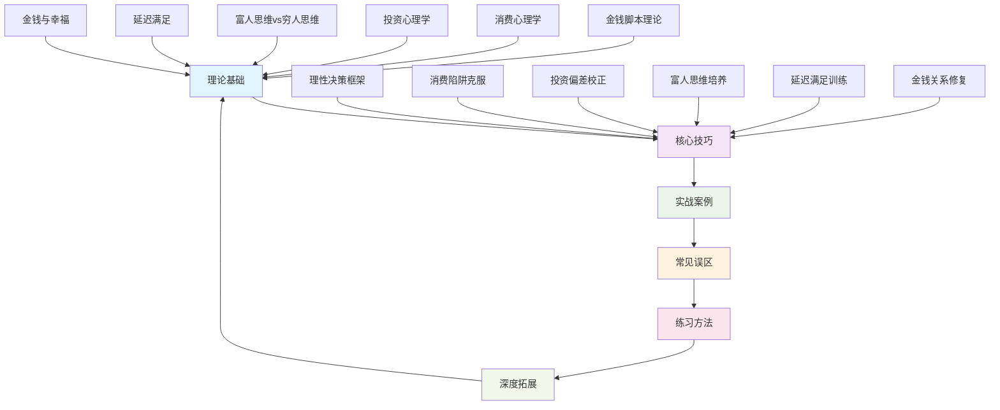
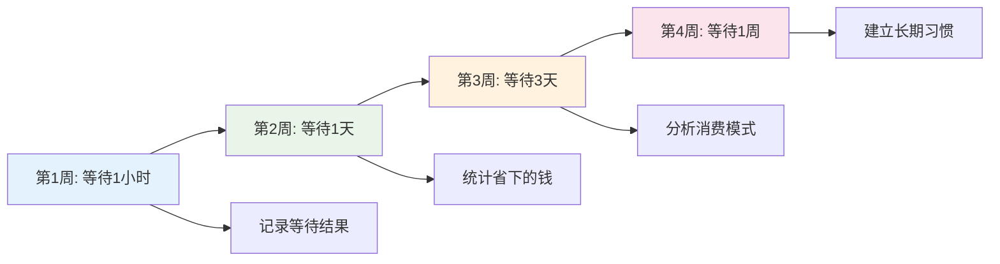

# 第32章 本章小结：搞钱心理学

## 一、本章核心框架回顾

搞钱心理学的核心命题是：**财务问题的根源往往不在技术层面，而在心理层面**。很多人掌握了足够的理财知识和投资技能，却依然陷入"知道却做不到"的困境——问题不在于你不知道该怎么做，而在于你的心理模式在暗中操控你的财务行为。

本章构建了一个完整的搞钱心理学知识体系，从理论认知到实操技巧，从个体心理到社会文化，从问题诊断到系统干预，形成了一个闭环的学习路径：

## 二、六大理论模块深度回顾

### 2.1 金钱脚本：你的财务命运密码

金钱脚本（Money Script）是由心理学家布拉德·克朗茨（Brad Klontz）提出的概念，指个体在童年时期通过家庭环境、父母言行、个人经历逐渐形成的关于金钱的深层信念系统。这些信念通常在潜意识层面运作，深刻影响着成年后的财务行为。

**四种金钱脚本类型详解：**

| 脚本类型 | 核心信念 | 典型行为 | 财务后果 | 干预重点 |
|----------|----------|----------|----------|----------|
| 金钱逃避 | "有钱是不好的"、"我不配有钱" | 回避财务问题、无意识破坏财务成功 | 收入低于能力水平、储蓄不足 | 每日财务觉察、正面金钱 affirmation |
| 金钱崇拜 | "钱能解决一切"、"有钱就能快乐" | 过度追求金钱、用消费填补内心空虚 | 工作狂倾向、消费成瘾 | 识别金钱买不到的价值、平衡生活 |
| 金钱地位 | "别人通过我的消费评判我" | 炫耀性消费、超出能力的社交支出 | 高消费、低储蓄、债务累积 | 区分内在价值与外在展示 |
| 金钱警觉 | "必须时刻关注钱"、"不能让别人知道" | 过度节俭、财务信息保密 | 生活品质下降、社交回避 | 适度享受、建立财务信任关系 |

**关键认知突破：** 金钱脚本不是固定不变的。神经科学研究表明，大脑具有可塑性，通过持续的觉察和练习，可以建立新的神经通路，改写限制性的金钱信念。认知行为疗法（CBT）在改写金钱脚本方面已被证实有效。

### 2.2 消费心理学：你为什么会买不需要的东西

消费决策受到多种心理机制的系统性影响，这些机制往往是商家精心设计的"心理陷阱"：

**六大消费心理陷阱深度解析：**

**陷阱一：锚定效应**
- **机制**：人们在做决策时过度依赖最先获得的信息（"锚"）
- **商家应用**：先展示高价商品（锚定价格），再展示目标商品，让目标商品显得"便宜"
- **实例**：一件衣服标价"原价1999，现价599"，即使599仍然高于成本很多，但因为有了1999的锚定，消费者觉得"赚到了"
- **防御策略**：忽略"原价"，只关注实际价格是否在你的预算范围内；比较多个商家的价格

**陷阱二：损失厌恶**
- **机制**：人们对损失的痛苦感受是同等收益快乐感受的约2倍（卡尼曼和特沃斯基的前景理论）
- **商家应用**："限时优惠"、"最后3件"、"错过再等一年"——制造"损失"的紧迫感
- **实例**：双十一的"前2小时半价"让你觉得不买就"亏了"
- **防御策略**：问自己"如果这个商品明天还是这个价格，我还会买吗？"

**陷阱三：心理账户**
- **机制**：人们会在心理上将钱分成不同的"账户"，对不同来源的钱有不同的消费态度
- **商家应用**：鼓励你把"奖金"、"年终奖"、"意外之财"当作"可以随便花的钱"
- **实例**：月薪5000时精打细算，拿到2万年终奖却轻易花光
- **防御策略**：把所有收入都视为"辛苦钱"，统一管理

**陷阱四：情绪消费**
- **机制**：用购物来调节情绪，获得短暂的愉悦感
- **触发场景**：压力大、心情差、无聊空虚、社交受挫
- **实例**：加班到深夜，打开购物APP"犒赏自己"
- **防御策略**：识别情绪触发点，建立非消费的情绪调节方式（运动、阅读、社交）

**陷阱五：从众效应**
- **机制**：看到别人购买，自己也跟着购买
- **商家应用**："已有10万人购买"、"好评率99%"、"网红同款"
- **实例**：小红书"种草"后冲动购买
- **防御策略**：问自己"如果没有人推荐，我还会买吗？"

**陷阱六：禀赋效应**
- **机制**：人们对已经拥有的东西赋予更高的价值
- **商家应用**："免费试用7天"、"先用后付"、"7天无理由退货"
- **实例**：试用了7天后，即使不太满意也舍不得退
- **防御策略**：试用前设定明确的评估标准，不满意果断退货

### 2.3 投资心理学：为什么你总是在高点买入、低点卖出

投资决策中的心理偏差比消费决策更为隐蔽，因为投资涉及更大的金额、更长的时间跨度和更高的不确定性：

**七大投资心理偏差及校正方法：**

| 偏差类型 | 表现 | 后果 | 校正方法 |
|----------|------|------|----------|
| 过度自信 | 高估自己的判断能力 | 过度交易、集中持仓 | 记录预测准确率、分散投资 |
| 羊群效应 | 跟风买卖 | 追涨杀跌 | 建立独立判断框架、逆向思考 |
| 处置效应 | 赢小亏大 | 卖出盈利股、持有亏损股 | 设定止盈止损点、机械执行 |
| 沉没成本谬误 | 不愿止损 | 越套越深 | 只看未来价值、忽略已投入成本 |
| 确认偏差 | 只看支持自己的信息 | 忽视风险信号 | 主动寻找反面证据、多元化信息源 |
| 锚定效应 | 被买入价格锚定 | 错过卖出时机 | 关注当前价值而非买入价格 |
| 可得性偏差 | 被近期信息影响 | 过度反应短期波动 | 拉长时间视角、关注长期趋势 |

**投资心理的双系统模型：**

诺贝尔经济学奖得主卡尼曼提出的"双系统"理论在投资决策中尤为适用：

- **系统1（快思考）**：基于直觉和情感的快速决策，由杏仁核等区域驱动。在投资中表现为：看到涨停就想追、看到暴跌就想卖、听到"内幕消息"就兴奋
- **系统2（慢思考）**：基于逻辑和分析的审慎决策，由前额叶皮层驱动。在投资中表现为：分析基本面、评估估值、制定长期策略

**关键启示：** 优秀的投资者不是没有情绪，而是能够在情绪冲动时"暂停"，激活系统2进行理性分析。这种能力可以通过训练获得。

### 2.4 富人思维 vs 穷人思维：思维模式决定财富上限

富人和穷人的根本区别不在于起点，而在于思维模式：

| 维度 | 穷人思维 | 富人思维 | 转变方法 |
|------|----------|----------|----------|
| 时间与金钱 | 用时间换钱 | 用钱买时间 | 计算时间的机会成本 |
| 财富策略 | 省钱优先 | 赚钱优先 | 投资自己的能力和成长 |
| 风险态度 | 回避风险 | 管理风险 | 学习风险管理知识 |
| 收入模式 | 线性收入（工资） | 非线性收入（投资、创业） | 建立被动收入来源 |
| 时间视野 | 短期满足 | 长期规划 | 设定长期财务目标 |
| 机会视角 | "我买不起" | "我如何买得起" | 培养解决问题的思维 |
| 价值创造 | 消费导向 | 创造导向 | 每周想一个价值创造点子 |
| 杠杆使用 | 亲力亲为 | 善用杠杆 | 代码、内容、团队、资本、平台杠杆 |

**富人思维的核心公式：** 财富 = 价值创造 × 杠杆倍数 × 时间复利

### 2.5 延迟满足：不是压抑欲望，而是战略选择

斯坦福大学的"棉花糖实验"揭示了延迟满足与人生成功的相关性，但延迟满足常被误解为"压抑欲望"：

**延迟满足的正确理解：**

1. **优先级排序**：不是不花钱，而是把钱花在最重要的地方
2. **适度满足**：每月留出"自由消费"预算，满足合理欲望
3. **替代满足**：用低成本方式获得类似满足感
4. **投资优先**：先投资（为未来），再消费（为现在）

**延迟满足的神经科学基础：**
- 前额叶皮层负责延迟满足的执行
- 前额叶皮层在25岁左右才完全成熟（解释了年轻人更容易冲动消费）
- 延迟满足能力可以通过训练增强，就像肌肉可以锻炼一样

**四阶段延迟满足训练法：**

### 2.6 金钱与幸福：超越"有钱就快乐"的迷思

金钱与幸福的关系远比"有钱就快乐"复杂：

**关键研究发现：**

1. **基本需求满足**：金钱能买到基本的安全感、健康保障和生活自由，在这个阶段，收入增加显著提升幸福感
2. **幸福阈值**：普林斯顿大学研究显示，当年收入超过约7.5万美元（约合人民币50万元）后，收入增加对日常幸福感的提升非常有限
3. **体验优于物质**：康奈尔大学研究发现，在体验消费（旅行、学习、演出）上的支出比物质消费（衣服、电子产品）更能提升幸福感
4. **给予优于获取**：哈佛大学研究发现，把钱花在别人身上（送礼物、捐款）比花在自己身上更能提升幸福感
5. **时间优于金钱**：哥伦比亚大学研究发现，重视时间甚于金钱的人通常更幸福

**幸福的金钱使用公式：**
- 用金钱购买时间（减少通勤、外包家务）
- 用金钱购买体验（旅行、学习、社交）
- 用金钱帮助他人（捐款、送礼、请客）
- 用金钱投资健康（运动、饮食、医疗）
- 用金钱减少压力（应急基金、保险）

## 三、六大核心技巧体系

### 3.1 理性财务决策框架

建立系统化的决策流程，减少情绪干扰：

**五步决策法：**
1. **暂停**：在做重大财务决策前，强制等待24-72小时
2. **信息收集**：从多个独立来源收集信息，避免确认偏差
3. **成本收益分析**：列出所有成本（显性和隐性）和收益（短期和长期）
4. **机会成本计算**：这笔钱如果用于其他用途，回报如何？
5. **外部视角**：请信任的人审视你的决策，提供第三方意见

### 3.2 消费心理陷阱的系统性防御

**三层防御体系：**

**第一层：环境设计**
- 取消购物APP的推送通知
- 删除保存的支付信息，增加支付摩擦
- 设定每日屏幕使用时间限制
- 清理社交媒体上的"种草"账号

**第二层：规则系统**
- 实施"24小时规则"：想买的东西先等24小时
- 设定每月"自由消费"预算上限
- 建立"欲望清单"：想买的东西先记下来，30天后还想买再买
- 使用"时间换算"：这件东西值我工作多少小时？

**第三层：认知升级**
- 学习消费心理学知识，识别商家的营销策略
- 定期复盘消费记录，分析心理偏差的影响
- 培养非消费的兴趣爱好，减少对购物的情绪依赖

### 3.3 投资心理偏差的校正系统

**建立投资纪律的四根支柱：**

1. **投资政策声明（IPS）**：书面记录你的投资目标、风险承受能力、资产配置策略、买卖规则
2. **定期再平衡**：每季度或半年调整一次资产配置，机械执行，不依赖判断
3. **交易日志**：记录每笔交易的理由、情绪状态、预期结果，定期复盘
4. **外部监督**：找一个理性的投资伙伴，重大决策前互相咨询

### 3.4 富人思维的系统性培养

**七个思维转换练习：**

1. **从"我买不起"到"我如何买得起"**：遇到买不起的东西，禁止说"买不起"，必须思考解决方案
2. **从"时间换钱"到"钱换时间"**：计算你的时间价值，把低价值任务外包
3. **从"省钱"到"投资"**：把省下的钱用于投资自己或资产
4. **从"消费"到"创造"**：每周想一个能为他人创造价值的点子
5. **从"线性"到"杠杆"**：寻找可以放大你努力的杠杆（代码、内容、团队、资本、平台）
6. **从"短期"到"长期"**：设定5年、10年的财务目标，倒推现在的行动
7. **从"恐惧"到"管理"**：学习风险管理，用知识代替恐惧

### 3.5 延迟满足能力的训练体系

**四维度训练法：**

1. **等待训练**：逐步延长消费决策的等待时间（1小时→1天→3天→1周）
2. **储蓄训练**：52周储蓄挑战，每周递增，培养储蓄习惯
3. **欲望管理**：建立欲望清单，30天冷却期
4. **换算训练**：把消费金额换算为工作时间、投资收益、生活成本

### 3.6 金钱关系的全面修复

**四步修复法：**

1. **觉察**：通过金钱脚本测试、消费日记、投资复盘，识别问题根源
2. **理解**：理解金钱脚本的形成机制，对原生家庭的影响保持觉知
3. **训练**：通过系统化的练习，逐步改写限制性信念，建立新的行为模式
4. **维护**：定期进行财务健康检查，持续练习，防止退步

## 四、实战案例的核心启示

本章的五个实战案例揭示了搞钱心理学应用的共性规律：

| 案例 | 核心问题 | 关键转折 | 核心方法 |
|------|----------|----------|----------|
| 小林的消费逆转 | 情绪消费、社交消费 | 记录30天消费日记 | 消费心理觉察 + 欲望清单 |
| 老王的股市教训 | 处置效应、沉没成本 | 记录交易日志 | 投资纪律系统 + 机械执行 |
| 张女士的脚本改写 | 金钱逃避脚本 | 金钱故事重写 | 认知行为疗法 + 正面 affirmation |
| 小陈的储蓄之路 | 即时满足倾向 | 52周储蓄挑战 | 延迟满足训练 + 自动化储蓄 |
| 李总的创业故事 | 穷人思维 → 富人思维 | 杠杆思维转变 | 价值创造 + 杠杆放大 |

**共性启示：**
1. 觉察是改变的第一步——不记录就不知道问题在哪
2. 系统优于意志——用规则和环境设计代替纯粹的自控力
3. 小步前进比一步到位更可持续
4. 外部支持（伙伴、导师、专业咨询）能显著提高成功率

## 五、十大常见误区警示

本章揭示的十大误区，本质上可以归为两类：

**第一类：忽视心理因素**
- "有钱人都是靠运气"——外部归因，忽视努力和选择
- "省钱就能变富"——只关注支出端，忽视收入端
- "我不需要了解心理学"——知道不等于做到
- "心理问题不重要，有钱了自然就好了"——金钱不能治愈心理问题

**第二类：错误理解心理因素**
- "延迟满足就是压抑欲望"——会导致反弹，不可持续
- "富人思维就是一切向钱看"——牺牲健康和关系的代价
- "投资心理偏差只影响别人"——知道不等于免疫
- "金钱脚本是固定的"——大脑具有可塑性
- "社交比较是正常的"——信息不对称，无限攀比
- "存不下钱是因为收入太低"——帕金森定律：支出随收入增加

**破除误区的核心原则：** 承认心理因素的重要性，正确理解心理学概念，并将其系统性地应用到实际的财务决策中。

## 六、深度拓展：从个体心理到社会系统

本章的深度拓展部分将视角从个体心理扩展到更广阔的社会文化层面：

### 6.1 神经科学视角

- 金钱在大脑中激活的奖励回路与食物、性等基本生理需求高度重叠
- 损失厌恶有明确的神经基础：杏仁核对损失的反应强度是收益的2-2.5倍
- 前额叶皮层的成熟程度（约25岁）影响延迟满足能力
- 肠脑轴、镜像神经元、催产素等新发现为理解金融行为提供了新视角

### 6.2 社会学视角

- 消费主义从工业革命到数字时代的演进
- 凡勃伦的炫耀性消费、鲍德里亚的符号消费、鲍曼的液态现代性
- 中国社交媒体消费的独特现象：小红书种草、直播带货、拼团经济、国潮消费
- 反消费主义运动：极简主义、慢生活、共享经济、二手经济

### 6.3 大数据视角

- 大数据验证了处置效应、过度交易、追涨杀跌等投资行为偏差
- 社交媒体情绪指标可以预测短期市场走势
- 机器学习在投资者行为分析中的应用

### 6.4 干预方法视角

- 认知行为疗法（CBT）在财务决策中的应用
- 正念练习对财务决策的改善作用
- 财务治疗作为新兴跨学科领域的发展
- 原生家庭对金钱心理的深远影响

### 6.5 亲密关系视角

- 金钱问题是亲密关系的首要冲突来源
- 伴侣财务沟通的有效策略
- 婚前财务规划的重要性
- 财务独立与关系健康的平衡

## 七、核心原则提炼

从本章的所有内容中，提炼出五条核心原则：

### 原则一：觉察先于改变

**原理**：你无法改变你没有意识到的东西。大多数财务问题的根源在于潜意识层面的金钱信念和行为模式，只有通过系统的觉察练习，才能将这些潜意识模式意识化。

**实践方法**：
- 金钱脚本测试：识别你的主导金钱脚本类型
- 消费心理日记：连续30天记录每笔消费的心理因素
- 投资复盘：定期回顾投资决策，识别心理偏差

### 原则二：系统优于意志

**原理**：意志力是有限的资源，依赖意志力来控制财务行为注定失败。更有效的方法是建立规则系统和环境设计，让"正确的行为"成为默认选项。

**实践方法**：
- 自动化储蓄：发工资后自动转出储蓄部分
- 环境设计：取消购物APP推送、删除支付信息
- 规则系统：24小时等待规则、欲望清单制度

### 原则三：理解优于压抑

**原理**：简单地压抑欲望会导致反弹和报复性消费。更有效的方法是理解欲望背后的心理需求，找到更健康的满足方式。

**实践方法**：
- 识别情绪消费的触发点，建立非消费的情绪调节方式
- 理解"想要"和"需要"的区别，但不完全禁止"想要"
- 建立"自由消费"预算，在可控范围内满足欲望

### 原则四：持续优于突击

**原理**：每天的小改变比偶尔的大行动更有效。财务心理的改变是一个渐进的过程，需要持续的练习和强化。

**实践方法**：
- 每天花5-10分钟进行金钱觉察练习
- 每周进行一次小规模的思维训练
- 每月进行一次财务健康检查
- 每季度进行一次深度复盘

### 原则五：平衡优于极端

**原理**：在节俭与享受、当下与未来、安全与成长之间找到平衡。极端的做法往往不可持续，中庸之道才是长久之计。

**实践方法**：
- 在省钱和赚钱之间找到平衡点
- 在消费和储蓄之间设定合理比例
- 在安全和成长之间分配资产
- 在个人目标和关系需求之间协调

## 八、行动清单：从知道到做到

### 立即行动（今天）

- [ ] 完成金钱脚本测试，识别你的主导脚本类型
- [ ] 记录今天的一笔消费，分析背后的心理因素
- [ ] 设定一个"24小时等待"的消费决策规则

### 短期行动（本周）

- [ ] 开始30天消费心理觉察日记
- [ ] 回顾过去一年的投资决策，识别心理偏差
- [ ] 建立"欲望清单"，把想买的东西先记下来
- [ ] 取消购物APP的推送通知

### 中期行动（本月）

- [ ] 开始延迟满足训练（等待挑战或储蓄挑战）
- [ ] 建立投资纪律系统（投资政策声明、交易日志）
- [ ] 进行一次"金钱故事重写"练习
- [ ] 设定本月的"自由消费"预算上限

### 长期行动（持续）

- [ ] 每月进行一次财务健康检查
- [ ] 每季度进行一次投资心理复盘
- [ ] 持续练习富人思维转换
- [ ] 必要时寻求专业心理咨询或财务治疗
- [ ] 每年重新进行金钱脚本测试，评估变化

## 九、推荐资源

### 书籍推荐

| 书名 | 作者 | 核心内容 | 推荐理由 |
|------|------|----------|----------|
| 《思考，快与慢》 | 丹尼尔·卡尼曼 | 双系统理论、认知偏差 | 了解人类决策的心理机制 |
| 《助推》 | 理查德·塞勒、卡斯·桑斯坦 | 选择架构、行为设计 | 学习如何设计更好的决策环境 |
| 《金钱心理学》 | 摩根·豪泽尔 | 金钱与心理的关系 | 通俗易懂的金钱心理学入门 |
| 《邻家的百万富翁》 | 托马斯·斯坦利 | 富人的消费习惯 | 了解真正的富人是如何对待金钱的 |
| 《小狗钱钱》 | 博多·舍费尔 | 理财基础、金钱观念 | 适合理财入门和金钱观念重塑 |
| 《认知行为疗法》 | 贝克 | CBT理论与实践 | 学习改写金钱脚本的心理学方法 |

### 工具推荐

- **记账APP**：随手记、MoneyWiz、YNAB——记录消费，分析模式
- **投资日志**：Evernote、Notion——记录投资决策和复盘
- **预算工具**：信封法、50/30/20法则——控制消费
- **储蓄工具**：自动转账、定投计划——强制储蓄

## 十、一句话总结

> **搞钱的底层是心理。改变搞钱的结果，首先要改变搞钱的心理。觉察、理解、训练——这是改变金钱命运的三步曲。但真正的改变不是一蹴而就的，而是每天的小练习、小觉察、小进步的累积。系统优于意志，持续优于突击，平衡优于极端。从今天开始，用心理学的智慧，重新设计你与金钱的关系。**

***

## 下一章预告

下一章我们将探讨**搞钱与人生规划**——如何定义财务自由、如何制定搞钱与人生平衡的规划、如何利用复利思维让人生指数级增长。从心理学的"内在修炼"转向人生规划的"外在设计"，让搞钱成为实现人生目标的工具，而不是人生的目标本身。
