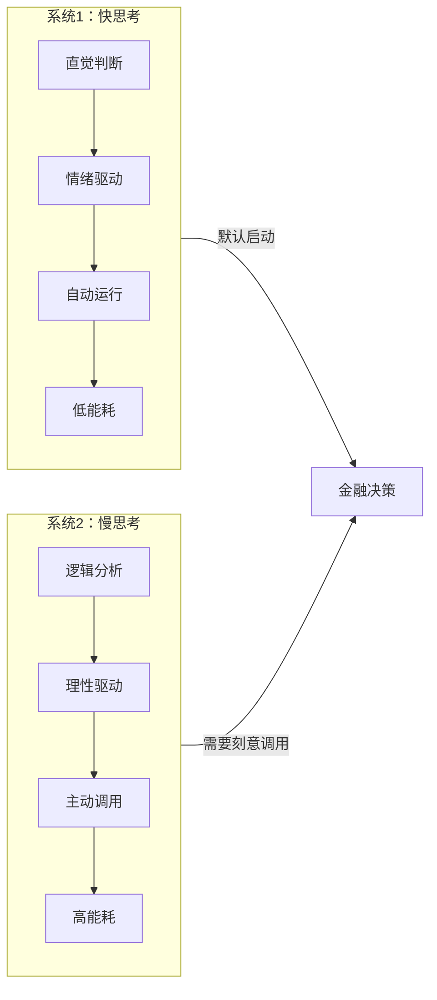
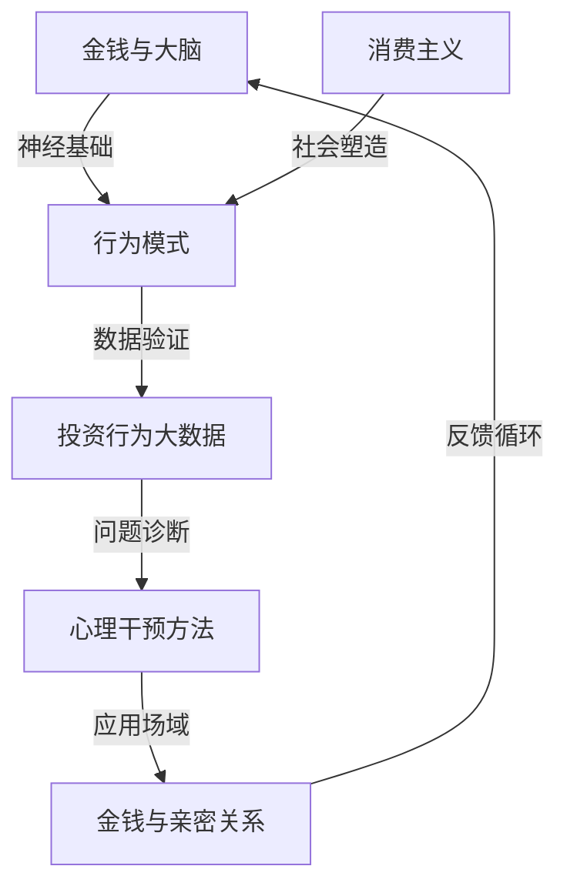

# 搞钱心理学深度拓展

本章从神经科学、社会学、大数据、心理干预和亲密关系五个维度，系统拆解"钱"与"心"的深层关系。每一节都遵循"原理→证据→实操→工具"的递进结构，让你不仅知道"是什么"，更掌握"怎么做"。

---

## 一、金钱与大脑的神经科学研究

### 1.1 金钱与大脑的奖励系统

现代神经科学研究揭示，金钱在大脑中激活的神经回路与食物、性等基本生理需求的奖励回路高度重叠。当我们获得金钱时，大脑的伏隔核（Nucleus Accumbens）和腹侧被盖区（Ventral Tegmental Area）会被激活，释放多巴胺，产生愉悦感。

**关键发现：预期比获得更令人兴奋**

2001年，布赖恩·克努森（Brian Knutson）等人在斯坦福大学的fMRI实验中发现，当受试者预期获得金钱奖励时，伏隔核的血氧水平依赖（BOLD）信号显著增强；而真正拿到钱时，该区域的激活反而减弱。换句话说，**大脑的快乐峰值出现在"即将得到"的那一刻，而非"已经得到"之后**。

这解释了为什么：
- 双十一前夜的"加购物车"比下单后更兴奋
- 新手炒股盯着盘面等涨停比真正涨停后更刺激
- 彩票开奖前的幻想比中奖后的实际感受更强烈

**金钱的"类药物效应"：多巴胺耐受与戒断**

反复的金钱奖励会导致大脑奖励系统的适应性变化，其机制与药物成瘾惊人地相似：

| 维度 | 药物成瘾 | 金钱成瘾 |
|------|---------|---------|
| 耐受性 | 需要更大剂量才能获得同样的快感 | 需要更多收入/更大的盈利才能感到满足 |
| 戒断反应 | 停药后出现焦虑、失眠、躯体不适 | 失去收入来源时出现严重焦虑、自我价值感崩塌 |
| 渴望 | 对药物的强烈渴求 | 对"更多钱"的持续执念 |
| 失控 | 明知有害仍无法停止使用 | 明知过度工作/投机有害仍无法停下来 |

**自我检测：你是否出现了"金钱耐受"？**

回答以下问题，如果"是"超过3项，需要警惕：
1. 以前月薪1万就很开心，现在月薪3万仍然觉得不够？
2. 看到银行账户数字增长已经不再有兴奋感？
3. 只有在"大赚一笔"时才会短暂感到满足？
4. 一旦收入减少或投资亏损，就会陷入严重的焦虑？
5. 为了维持或增加收入，愿意牺牲健康、关系或睡眠？
6. 周围人觉得你"已经够好了"，但你内心总觉得还不够？

### 1.2 损失厌恶的神经基础

诺贝尔经济学奖得主丹尼尔·卡尼曼（Daniel Kahneman）和阿莫斯·特沃斯基（Amos Tversky）提出的损失厌恶理论——**失去100元的痛苦约是得到100元快乐的2-2.5倍**——已经在神经科学层面得到精确验证。

**杏仁核：恐惧的哨兵**

杏仁核（Amygdala）是大脑的威胁检测中心。fMRI研究显示，当受试者面临潜在的金钱损失时，杏仁核的激活强度是获得同等金额奖励时伏隔核激活强度的2-2.5倍。这种不对称性进化的根源在于：对远古人类来说，漏掉一次食物的机会（损失）可能导致饿死，而多吃一块肉的收益（获得）相对有限——**躲避危险比追求收益更关乎生存**。

**前额叶皮层：理性的刹车**

前额叶皮层（Prefrontal Cortex，简称PFC）是大脑的"CEO"，负责理性分析和冲动控制。加州理工学院的一项研究对比了新手投资者和资深交易员的大脑活动，发现：

- 新手投资者面对亏损时，杏仁核的激活完全压过PFC的信号，导致恐慌性抛售
- 资深交易员的PFC对杏仁核有显著的"自上而下"的抑制能力，能够在亏损情境下保持相对冷静
- 这种PFC-杏仁核的调节能力可以通过训练和经验积累来增强

**实操建议：如何训练你的"投资大脑"**

1. **暴露练习**：用模拟账户反复经历亏损场景（每天15分钟，持续2周），让杏仁核对"亏损"脱敏
2. **冷认知框架**：投资决策前写下"如果这笔钱不是我的，我会怎么建议朋友？"
3. **决策日志**：记录每次买卖时的情绪状态和理性理由，事后复盘哪些决策是情绪驱动的
4. **10-10-10法则**：做决策前问自己——10分钟后我会怎么想？10个月后呢？10年后呢？

### 1.3 金融决策的双系统模型

丹尼尔·卡尼曼在《思考，快与慢》中系统阐述的双系统理论，在神经科学层面已被精确验证：



**系统1在投资中的典型陷阱：**

| 陷阱 | 系统1的直觉反应 | 系统2的理性判断 |
|------|----------------|----------------|
| 看到股票涨停 | "快买！再不买就来不及了！" | "涨停意味着今天已经涨了10%，追高风险大" |
| 账户亏损20% | "赶紧卖掉！再跌就血本无归了！" | "我的投资逻辑还在吗？当初买入的理由变了吗？" |
| 朋友推荐一只股票 | "他赚了我也能赚！" | "他的投资目标和风险承受能力跟我一样吗？" |
| 看到"限时优惠" | "现在不买就亏了！" | "我原本就需要这个东西吗？" |

**训练系统2的三步法：**

1. **强制冷却期**：任何超过500元的消费决策，强制等待24小时；任何投资决策，强制等待48小时
2. **检查清单**：在做金融决策前，过一遍标准化的检查清单（见下方模板）
3. **预设规则**：提前设定好"如果发生X，我就执行Y"的条件反射式规则，减少实时决策的认知负担

**投资决策检查清单模板：**

```text
□ 我是在什么情绪状态下做出这个决定的？（1-10分）
□ 如果这笔钱全部亏掉，我的生活会受影响吗？
□ 我能清楚地解释我为什么要做这个投资吗？
□ 我是否做过独立研究，还是只听信了别人的话？
□ 这个决策符合我的长期财务计划吗？
□ 一年后回头看，我可能会后悔做这个决定吗？
□ 如果我最好的朋友问我该不该做，我会怎么建议？
```

### 1.4 神经经济学的最新进展

**肠脑轴与金融决策**

2019年，《Scientific Reports》发表的一项研究发现，肠道微生物群的组成与个体的风险偏好存在相关性。具体来说，肠道中厚壁菌门（Firmicutes）与拟杆菌门（Bacteroidetes）的比例较高的人群，在赌博任务中表现出更强的风险寻求倾向。

这一发现的实际意义在于：
- **饮食影响决策**：不规律的饮食和肠道健康问题可能间接影响你的财务决策质量
- **压力的肠道通道**：长期压力通过"压力→肠道菌群失调→肠脑轴信号异常→决策能力下降"的路径影响投资表现
- **实践建议**：在做重大财务决策前，确保充足的睡眠、规律的饮食和适度的运动——这不是鸡汤，而是神经科学

**镜像神经元与投资从众**

镜像神经元（Mirror Neurons）是1992年由意大利帕尔马大学的研究团队意外发现的一类神经元——当猴子自己抓食物和看到别人抓食物时，同一组神经元都会放电。在金融领域，镜像神经元可能是"从众效应"的神经基础：

- 当你看到同事炒股赚了钱，你的镜像神经元会模拟他的"赚钱体验"，产生"我也应该参与"的冲动
- 当社交媒体上人人晒收益时，镜像神经元的集体激活可能形成"全民FOMO"（Fear of Missing Out）
- 这解释了为什么牛市末期往往出现开户潮——不是人们经过理性分析认为市场还会涨，而是镜像神经元驱动的模仿行为

**催产素与信任投资**

荷兰阿姆斯特丹大学的保罗·扎克（Paul Zak）教授的研究发现，鼻喷催产素（Oxytocin）可以显著提高受试者在"信任博弈"中的投资金额——受试者愿意将更多的钱交给陌生人管理。

这解释了几个常见的金融现象：
- 面对面的销售比线上销售更容易成功（肢体接触和眼神交流促进催产素分泌）
- 带有个人故事的投资骗局比纯数据骗局更有效（情感共鸣促进催产素释放）
- 伴侣之间的共同投资决策往往偏向乐观（亲密关系中的高催产素水平降低了风险感知）

**警惕：不要在"感觉良好"时做重大投资决策。** 如果你刚参加了一场热情洋溢的投资说明会，或者刚和一位"非常靠谱"的推荐人聊完，先等24小时让催产素水平回落，再做决定。

---

## 二、消费主义的社会学分析

### 2.1 消费主义的历史演进

消费主义不是从来就有的——它是工业革命、广告业和大众媒体共同塑造的产物。理解它的历史，才能看清它的操控机制。

**第一阶段：生存消费（工业革命前）**

在工业革命之前，绝大多数人的消费仅限于基本生存需求——食物、衣物、住所。商品是按功能购买的，没有"品牌"的概念，也没有"消费升级"的冲动。

**第二阶段：大众消费（1850-1950）**

18-19世纪的工业革命使商品生产成本大幅下降。1852年，巴黎Le Bon Marché百货公司的开业标志着一个新时代——购物不再是"去集市买必需品"，而是一种社交活动和休闲体验。百货公司用华丽的橱窗、优雅的环境和分期付款的方式，创造了"逛"的概念。

**第三阶段：欲望营销（1920s-1990s）**

爱德华·伯奈斯（Edward Bernays）——弗洛伊德的外甥——在1920年代做了一件改变商业史的事情：他把精神分析理论引入广告业。在他之前，广告只说"这个肥皂洗得干净"；在他之后，广告说"用了这个肥皂，你就是优雅的女人"。

伯奈斯最著名的案例是1929年的"自由火炬"运动：他让一群年轻女性在纽约复活节游行中公开抽烟（当时女性在公共场合抽烟是禁忌），并将香烟重新定位为"女性解放的象征"。烟草公司的销量暴涨。

从此，广告的核心从"功能"转向"情感"，商品成为承载意义的符号。

**第四阶段：算法消费（2010s至今）**

互联网和算法创造了前所未有的消费渗透方式：

- **精准推荐**：算法比你更了解你的欲望——它知道你搜索了什么、在哪里停留了多久、什么让你犹豫
- **社交种草**：小红书、抖音上的"真实分享"模糊了广告与内容的边界
- **直播带货**：李佳琦的"Oh my god，买它！"创造了单场直播数十亿的销售记录，其核心机制是**限时紧迫感+社会认同+情感连接**的三重催化
- **盲盒经济**：泡泡玛特的盲盒利用了"可变比率强化"（赌博的核心机制），让购买行为本身变成了上瘾体验

### 2.2 消费主义的社会学理论

**凡勃伦的炫耀性消费**

托尔斯坦·凡勃伦（Thorstein Veblen）在1899年的《有闲阶级论》中提出了一个至今仍然锋利的观点：**人们购买昂贵商品的主要目的不是实用性，而是向他人展示自己的社会地位**。

凡勃伦将这种行为称为"炫耀性消费"（Conspicuous Consumption），并指出两个核心机制：
1. **金钱竞赛**：通过消费来展示自己的财富水平，获得社会尊重
2. **歧视性对比**：通过消费来与低阶层划清界限，维护自己的社会地位

在当代，炫耀性消费已经演化出多种形式：

| 形式 | 传统版本 | 当代版本 |
|------|---------|---------|
| 物质炫耀 | 开豪车、戴名表 | 晒限量版球鞋、发米其林餐厅打卡 |
| 知识炫耀 | 读名校、说外语 | 晒读书清单、聊区块链和AI |
| 体验炫耀 | 环球旅行 | 小众旅行、极限运动、"数字游民"生活 |
| 公益炫耀 | 慈善晚宴 | 晒公益捐款、发环保生活打卡 |

**鲍德里亚的符号消费**

法国社会学家让·鲍德里亚（Jean Baudrillard）将消费理论推进了一步：在消费社会中，**我们消费的不是商品的使用价值，而是商品的符号价值**。

举例来说，一杯星巴克咖啡的成本（原料+制作）不超过10元，但售价30-50元。你多付的钱买的是什么？是"第三空间"的概念、是杯身上的logo、是"我是喝星巴克的人"的身份认同。

鲍德里亚的洞察在于：在符号消费的逻辑下，**商品的功能差异变得不重要，符号差异变得最重要**。两个功能完全相同的包，一个打上奢侈品logo就能卖100倍的价格——因为消费者购买的不是包，而是logo承载的社会意义。

**鲍曼的液态现代性**

齐格蒙特·鲍曼（Zygmunt Bauman）的"液态现代性"理论解释了为什么当代人比任何时代都更依赖消费来定义自己：

在传统社会中，人的身份由出身、职业、社区稳定地定义。但在液态现代社会中，工作不稳定、社区解体、关系流动，**消费成了唯一可靠的"身份建构"手段**——"我穿什么"、"我用什么"、"我去哪里旅行"成了"我是谁"的核心答案。

这意味着：**消费主义的本质不是"贪婪"，而是"身份焦虑"**。当一个人疯狂购物时，她真正需要的可能不是那些商品，而是一个稳定的自我认同。

### 2.3 社交媒体与消费行为

社交媒体对消费行为的影响是系统性的，它从四个层面同时作用于我们的购买决策：

**层面一：社会比较放大器**

心理学家利昂·费斯廷格（Leon Festinger）在1954年提出"社会比较理论"——人类天生需要通过与他人比较来评估自己。在社交媒体出现之前，我们的比较对象是身边的邻居、同事；社交媒体将比较对象扩展到了全世界。

斯坦福大学2023年的一项研究发现，**每天使用社交媒体超过2小时的人，其物质欲望水平比使用30分钟以下的人高出47%**。这不仅仅是"看到别人有我也想要"，更是一种系统性的心理暗示：算法不断向你展示"比你更好的生活"，让你产生"我的生活还不够好"的持续焦虑。

**层面二：信任转移**

传统广告中，消费者对品牌持天然的警惕；但在社交媒体上，推荐来自"真实的人"（朋友、网红、KOL），信任的转移更加隐蔽和有效。

数据佐证：2024年的一项全球调查显示，**72%的Z世代消费者表示他们的购买决策受到社交媒体创作者的影响**，而只有23%表示受传统广告影响。

**层面三：即时满足回路**

社交媒体的"滑动-发现-购买"模式将消费决策的时间压缩到了几秒钟。抖音上的一条15秒视频→点击购物车→完成支付，整个过程可能不超过30秒。这种"即时满足回路"绕过了系统2的理性审查，让冲动消费成为默认行为。

**层面四：社群身份绑定**

消费行为成为特定社群的身份标识。穿Lululemon的人属于"健康生活"社群，用Notion的人属于"效率工具"社群，喝精酿啤酒的人属于"品味生活"社群。当消费与身份绑定，购买就不再是"要不要"的问题，而是"我是谁"的问题。

**中国社交媒体消费的独特现象：**

- **小红书种草文化**：用户分享产品使用体验，形成"种草-拔草"的消费循环。其核心机制是"真实感"——即使是广告，也被包装成"真实体验分享"，降低了消费者的心理防线。小红书的月活用户已超过3亿，其中70%为女性，日均搜索次数超过6亿
- **直播带货**：头部主播创造了惊人的销售记录。直播带货的核心心理学机制包括：限时倒计时（紧迫感）、实时弹幕互动（社会认同）、主播人格魅力（信任转移）、"全网最低价"锚定（价格感知扭曲）
- **拼团经济**：拼多多通过社交拼团模式改变了下沉市场的消费习惯。其深层机制是"社交裂变"——将购物变成一种社交行为，利用人际关系网络实现病毒式传播
- **国潮消费**：年轻消费者对中国品牌和传统文化元素的认同。其心理学基础是"社会认同理论"——通过消费国货来表达"我是中国人，我为国货自豪"的身份认同

### 2.4 反消费主义运动与实践

面对过度消费带来的环境问题、债务压力和心理焦虑，全球范围内出现了多种反消费主义的实践。这些不是"苦行僧"式的自我惩罚，而是经过理性计算的生活方式优化。

**极简主义：少即是多的量化实践**

极简主义不是"什么都不要"，而是"只保留真正重要的"。日本的近藤麻理惠（Marie Kondo）提出了一个简单但有效的方法：对每件物品问"它是否让我怦然心动？"，如果不心动就丢弃。

实操层面的极简主义框架：
1. **物品审计**：用一个周末时间，将所有物品按类别清点，记录数量和最近使用时间
2. **90天规则**：如果一件物品90天内没有使用过（季节性物品除外），就处理掉
3. **一进一出原则**：每买一件新物品，必须处理掉一件同类旧物品
4. **需求延迟**：想买东西时先记在"欲望清单"上，等待30天后重新评估

**FIRE运动：财务独立，提前退休**

FIRE（Financial Independence, Retire Early）运动的核心公式：

```text
FIRE数字 = 年支出 × 25
```

这意味着，如果你每年花10万元，你需要250万元的投资资产（按4%的年提取率计算）就能实现财务独立。FIRE运动的反消费主义体现在：它不是通过增加收入来致富，而是通过**降低支出来缩短致富时间**。

**实操：反消费主义的7天实验**

如果你想测试自己是否被消费主义过度影响，尝试以下7天实验：

| 天数 | 实验内容 | 观察目标 |
|------|---------|---------|
| 第1天 | 不打开任何购物APP | 观察自己有多少次"习惯性打开"的冲动 |
| 第2天 | 记录所有"想买"的冲动，但不行动 | 记录冲动来源（广告？社交？情绪？） |
| 第3天 | 不刷社交媒体 | 观察没有"种草"信息时，自己的物质欲望是否降低 |
| 第4天 | 整理衣柜/房间 | 发现自己已经拥有了多少"遗忘的购买" |
| 第5天 | 用现有物品替代一件"想买"的东西 | 验证"我真的需要新的吗？" |
| 第6天 | 和朋友聊"最满意的非消费体验" | 发现快乐不一定需要花钱 |
| 第7天 | 总结7天的感受和发现 | 写下3条关于自己消费习惯的洞察 |

---

## 三、投资行为的大数据分析

### 3.1 大数据揭示的散户行为模式

随着金融科技的发展，研究者能够利用海量的交易数据（数百万投资者、数十亿笔交易）来精确描绘散户投资者的行为画像。以下发现来自全球多个市场的实证研究，每一条都有硬数据支撑。

**行为模式一：处置效应（Disposition Effect）**

定义：投资者倾向于过早卖出盈利的股票（"落袋为安"），而长期持有亏损的股票（"不愿割肉"）。

数据佐证：
- 以色列经济学家Hersh Shefrin和Meir Statman的经典研究显示，散户卖出盈利股票的概率比卖出亏损股票高出约50%
- 中国A股市场的研究发现，散户的处置效应比欧美市场更为严重，卖出盈利股票/持有亏损股票的比例差异可达1.5-2倍
- 处置效应的代价：加州大学的研究估算，处置效应每年使美国散户投资者损失约2-3%的年化收益

为什么会这样？心理机制在于：
1. **后悔规避**：卖出亏损股票意味着"确认损失"，这是一种痛苦的心理体验；不卖则可以告诉自己"还没亏，只是浮亏"
2. **自我保护**：卖出盈利股票可以证明"我是对的"，满足了自我肯定的需求
3. **锚定效应**：投资者将买入价作为"锚"，股价低于锚点时不愿卖出，高于锚点时急于锁定利润

**行为模式二：过度交易（Overtrading）**

数据佐证：
- 加州大学Barber和Odean的经典研究发现，交易最频繁的20%散户投资者，其年化收益比交易最少的20%低约7个百分点
- 扣除交易成本后，最频繁交易者的年化收益甚至低于银行定期存款
- 中国A股市场的数据显示，散户的平均持股周期仅约30天，远低于机构投资者的6-12个月

**行为模式三：追涨杀跌（Momentum Chasing）**

数据佐证：
- 多项研究发现，资金流入最多的基金（上季度表现最好），在下一个季度的表现往往低于平均水平——散户追涨的结果恰恰是买在高点
- 中国市场特有的"涨停板敢死队"现象：散户倾向于在涨停板排队买入，但统计显示，涨停次日继续涨停的概率仅约15-20%，而下跌的概率超过40%

**行为模式四：本地偏好（Home Bias）**

数据佐证：
- 全球范围内，投资者将约70-80%的股票资产配置在本国市场，而按照全球市值权重，这一比例应该只有约50%（美国）或更低（小国市场）
- 中国投资者的A股配置比例更高，绝大多数散户仅持有A股，忽视了港股、美股和全球基金的分散化价值
- 本地偏好的代价：错失全球分散化投资带来的风险降低和收益提升

### 3.2 社交媒体数据与市场预测

社交媒体数据已经成为金融市场预测的重要另类数据源（Alternative Data）。

**推特情绪与股市**

约翰·博伦（Johan Bollen）等人2011年发表在《Journal of Computational Science》上的研究堪称该领域的里程碑。他们使用"意见挖掘"（Opinion Finder）和"情绪总况"（GPOMS）两个工具分析了2008年全年的推特数据，并与道琼斯工业指数（DJIA）进行关联分析。

核心发现：推特的"冷静"（Calm）情绪指标能够在提前2-6天的时间窗口内以87.6%的准确率预测DJIA的收盘涨跌。这个准确率已经超过了大多数传统技术分析工具。

**中国社交媒体与A股**

中国市场的社交媒体数据与股市走势同样存在显著关联：

| 数据源 | 发现 | 预测能力 |
|--------|------|---------|
| 东方财富网股吧 | 帖子情绪与次日股价涨跌相关性约0.15-0.25 | 短期（1-3天）有一定预测能力 |
| 雪球 | 大V的持仓变动信息引发跟风交易 | 大V调仓后3天内，相关股票交易量增加30-50% |
| 微信公众号 | 财经公众号的阅读量峰值往往出现在市场顶部 | 阅读量激增是市场情绪过热的信号 |
| 百度搜索指数 | "股票开户"搜索量激增出现在牛市中后期 | 可作为市场情绪的反向指标 |

**实操：如何利用社交媒体数据辅助投资决策**

1. **情绪监控工具**：使用雪球、东方财富的"热度排行"功能，当某只股票讨论热度异常升高时，提高警惕——热度越高，散户参与越多，波动越大
2. **反向指标**：当社交媒体上"全民炒股"的氛围浓厚时，往往是市场接近顶部的信号；当"股市没人聊了"时，反而可能是布局的好时机
3. **信息差利用**：社交媒体上的信息传播存在时间差，专业投资者往往在社交媒体讨论之前就已经行动

### 3.3 行为金融学的大数据验证

大数据分析为行为金融学的经典理论提供了更加精确和大规模的验证：

**锚定效应的量化**

研究发现，投资者的买卖决策显著受到以下"锚点"的影响：
- **买入价格**：当股价回到买入价附近时，卖出意愿显著增加——即使基本面已经完全不同
- **52周高点**：股价接近52周高点时，投资者倾向于"恐高"不敢买入；但统计显示，接近52周高点的股票在随后3个月的平均表现优于远离高点的股票
- **整数关口**：股价接近整数关口（如100元、200元）时，交易量显著增加——这是心理锚点在起作用

**羊群效应的交易数据证据**

通过分析订单流数据，研究者发现：
- 当某只股票在短时间内出现大量同方向的买单（或卖单）时，后续跟风的订单会在30秒-5分钟内涌入
- 这种羊群行为在市场波动加剧时尤为明显——2020年3月全球股市熔断期间，散户的卖出订单呈现出高度同步的"蜂拥"模式
- 羊群效应的直接后果是：加剧市场波动、增加交易成本、降低个人收益

**过度自信的性别差异**

加州大学Barber和Odean的经典研究分析了35,000个券商账户的交易数据，发现：
- 男性的交易频率比女性高45%
- 男性的年化净收益比女性低约1.4个百分点（主要因为过度交易的摩擦成本）
- 未婚男性的过度交易最为严重，年化收益比市场平均低约3个百分点

这并不是说"女性天生更适合投资"，而是过度自信——而非能力——导致了过度交易，而过度自信在统计上与性别相关。

### 3.4 机器学习在行为分析中的应用

机器学习正在从四个方向改变我们对投资者行为的理解和预测：

**方向一：投资者画像（Clustering）**

使用K-means等聚类算法，可以从交易频率、持仓集中度、止损习惯、换手率等维度将投资者分为不同的行为类型：

| 类型 | 特征 | 典型表现 | 建议干预 |
|------|------|---------|---------|
| 趋势追随型 | 高换手率，追涨杀跌 | 牛市赚钱，熊市亏更多 | 设置自动止损止盈 |
| 价值投资型 | 低换手率，集中持仓 | 长期表现较好但波动大 | 增加分散化 |
| 投机型 | 极高换手率，偏好小盘股 | 大部分时间亏损 | 限制单日交易次数 |
| 恐惧型 | 极低换手率，大量现金 | 错失市场上涨机会 | 定投策略强制参与 |
| 跟风型 | 交易决策与社交媒体高度相关 | 买入时往往已是高点 | 减少社交媒体使用 |

**方向二：异常检测（Anomaly Detection）**

金融机构使用Isolation Forest、Autoencoder等算法检测异常交易行为：
- **内幕交易识别**：在重大消息公布前，检测是否存在异常的买入/卖出模式
- **市场操纵识别**：通过分析交易时间和数量的分布，识别"拉高出货"等操纵行为
- **洗钱检测**：通过分析资金流动模式，识别可疑的资金转移

**方向三：情感分析（Sentiment Analysis）**

使用NLP技术分析投资者在社交媒体和论坛上的情绪变化：
- 基于BERT、GPT等预训练模型的情感分析准确率已超过90%
- 情感指标与股价走势的相关性在短期内（1-5天）显著
- 多数量化基金已经将情感数据纳入投资模型，作为辅助信号

**方向四：强化学习（Reinforcement Learning）**

使用强化学习算法优化投资策略：
- 智能体（Agent）在模拟环境中学习买卖决策
- 通过数百万次模拟交易，算法可以发现人类投资者难以察觉的模式
- 目前最先进的强化学习投资模型在回测中的夏普比率（风险调整后收益）已经超过大多数人类基金经理

---

## 四、财富心理学的干预方法

### 4.1 认知行为疗法在财务决策中的应用

认知行为疗法（Cognitive Behavioral Therapy，简称CBT）是目前循证最充分的心理治疗方法之一。其核心理念简洁有力：**不是事件本身让你痛苦，而是你对事件的解读让你痛苦**。将CBT应用于财务决策，就是识别和改变那些导致非理性财务行为的"金钱认知扭曲"。

**常见的金钱认知扭曲及纠正方法：**

| 认知扭曲 | 典型想法 | 理性替代 |
|---------|---------|---------|
| 灾难化思维 | "如果投资亏了50%，我的人生就完了" | "50%的亏损很痛苦，但我有应急储备金，生活不会崩溃" |
| 全有或全无 | "我要么成为千万富翁，要么就是失败者" | "财务成功是一个光谱，不是二元的" |
| 情绪推理 | "我对这只股票感觉很好，它一定涨" | "感觉不能作为投资依据，数据和逻辑才是" |
| 过度泛化 | "我上次投资亏了，我不是投资的料" | "一次失败不能定义我的投资能力，我可以学习和改进" |
| 心理过滤 | "经济形势这么差，投资一定亏" | "坏消息总是比好消息更引人注目，我需要全面评估" |
| 读心术 | "别人都觉得我没钱，看不起我" | "我无法知道别人真正在想什么" |
| 应该思维 | "我这个年纪应该已经买房了" | "每个人有不同的时间线，我按自己的节奏来" |

**CBT在财务领域的四步实操法：**

**第一步：记录触发情境**

当出现财务焦虑或非理性消费/投资冲动时，记录以下信息：
```text
时间：___________
情境：___________（发生了什么？）
自动思维：___________（脑子里冒出什么想法？）
情绪：___________（给情绪强度打分1-10）
身体反应：___________（心跳加速？手心出汗？胃部紧缩？）
行为冲动：___________（想要做什么？）
```

**第二步：识别思维模式**

对照上面的表格，识别自己属于哪种认知扭曲。注意：很多人同时存在多种扭曲。

**第三步：寻找证据**

为自动思维寻找支持和反对的证据：
```text
支持"投资一定会亏"的证据：
1. ___________
2. ___________

反对"投资一定会亏"的证据：
1. ___________
2. ___________
```

**第四步：生成理性替代思维**

基于证据的权衡，形成更平衡、更现实的想法，并记录情绪变化。

**一个完整案例：**

```text
情境：看到投资账户亏损了15%
自动思维："完了，我亏了这么多钱，我根本不该投资！"
情绪：恐惧（8/10），后悔（7/10）
身体反应：心跳加速，手心出汗

识别：过度泛化 + 灾难化思维

支持证据：
- 账户确实显示亏损15%

反对证据：
- 我的投资期限是10年以上，现在才过了1年
- 历史上沪深300在任意3年持有期内，亏损概率不到10%
- 我用的是闲钱，不影响生活
- 我的投资逻辑（低估值指数基金定投）没有变

理性替代思维："短期亏损是投资的正常组成部分。
我的策略是长期定投，短期波动不影响我的计划。
事实上，市场下跌意味着我能用更低的价格买入更多份额。"
情绪变化：恐惧降至4/10，后悔降至2/10
```

### 4.2 正念与财务决策

正念（Mindfulness）是一种专注于当下、不加评判的觉知状态。哈佛大学2010年的一项研究发现，人类有47%的清醒时间处于"走神"状态，而走神通常与不快乐相关。在财务决策中，走神和分心是导致冲动决策的重要因素。

**正念改善财务决策的四个机制：**

1. **减少冲动决策**：正念练习增强了对情绪的觉知和调节能力。当你能够觉察到"我现在很兴奋/焦虑"，你就获得了"暂停"的能力——而暂停是理性决策的前提
2. **降低损失厌恶**：威斯康星大学的一项研究发现，长期冥想者在面对损失时，杏仁核的激活程度比非冥想者低约30%，这使他们能够更冷静地评估投资风险
3. **增强延迟满足能力**：正念练习提高了对即时诱惑的抵抗力。如果你能够在"想买"的冲动出现时，先觉察它、接受它、但不立刻行动，你就能避免大量冲动消费
4. **改善财务沟通**：正念练习有助于在与伴侣讨论财务问题时保持冷静和同理心，减少因情绪升级导致的无效争吵

**"STOP"技术：4秒钟的财务决策干预**

当你面临任何财务决策（消费、投资、转账）时，练习STOP技术：

- **S**（Stop）：停下来，什么都不做
- **T**（Take a breath）：做一次深呼吸，感受气息进出身体
- **O**（Observe）：观察自己的身体感觉、情绪和想法，不加评判
- **P**（Proceed）：有意识地决定下一步行动

这个过程只需要4秒钟，但它将你从系统1的自动反应模式切换到了系统2的有意识决策模式。

**10分钟正念冥想入门（财务决策专用）：**

1. 找一个安静的地方坐下，闭上眼睛（第1分钟）
2. 注意呼吸的进出，不控制呼吸，只观察（第2-4分钟）
3. 将注意力转向与金钱相关的想法——不评判、不跟随、只观察（第5-7分钟）
4. 如果发现自己开始焦虑或兴奋，温柔地将注意力拉回呼吸（第7-9分钟）
5. 缓慢睁开眼睛，带着平静的状态去面对财务决策（第10分钟）

### 4.3 财务治疗

财务治疗（Financial Therapy）是2010年正式成立的财务治疗协会（Financial Therapy Association）所定义的新兴跨学科领域。它结合了财务规划的专业知识和心理治疗的干预方法，专门处理"知道该怎么做但做不到"的财务行为问题。

**财务治疗与传统财务咨询的区别：**

| 维度 | 传统财务咨询 | 财务治疗 |
|------|------------|---------|
| 关注点 | 财务数据和策略 | 财务行为背后的心理驱动 |
| 典型问题 | "我应该怎么投资？" | "为什么我总是无法存下钱？" |
| 干预方式 | 提供信息和建议 | 探索信念、情感和行为模式 |
| 适用场景 | 财务知识不足 | 财务知识充足但行为失控 |
| 核心假设 | 人是理性的，只需要正确信息 | 人是情感的，需要理解情感才能改变行为 |

**财务治疗的核心领域：**

1. **金钱脚本（Money Scripts）**：识别和改变从原生家庭继承的金钱信念。这些脚本通常在7岁前形成，并在潜意识中持续影响成年后的财务行为
2. **财务创伤（Financial Trauma）**：处理因破产、失业、欺诈、家庭财务危机等事件带来的心理创伤。财务创伤可能导致回避行为（不敢看账单）、过度补偿（疯狂存钱）或强迫性消费
3. **伴侣财务冲突**：帮助伴侣理解彼此的金钱脚本差异，建立有效的财务沟通模式
4. **行为改变**：帮助客户将"知道"转化为"做到"——建立预算习惯、自动化储蓄、设置投资纪律等

### 4.4 原生家庭对金钱心理的影响

我们的金钱心理很大程度上受到原生家庭的影响，这种影响通常在童年期（0-7岁）就已经深刻形成，并在潜意识中持续运行数十年。

**金钱脚本的四种类型：**

布拉德·克朗茨（Brad Klontz）博士的研究识别出四种核心金钱脚本：

**1. 金钱逃避脚本**
- 核心信念："钱是肮脏的"、"有钱人是贪婪的"、"我不配有钱"
- 典型行为：回避财务话题、不愿查看账单、在即将赚到更多钱时自我破坏
- 常见来源：家庭中对富人的负面评价、宗教信仰中对财富的贬低
- 干预方向：重新定义金钱的中性本质——金钱只是工具，善恶在于使用它的人

**2. 金钱崇拜脚本**
- 核心信念："金钱是万能的"、"有钱就能快乐"、"赚更多钱就能解决一切问题"
- 典型行为：过度工作、忽视健康和关系、永远觉得"还不够"
- 常见来源：童年经历过贫困或经济不安全
- 干预方向：认识到金钱与幸福感的关系在满足基本需求后急剧递减（卡尼曼的研究表明，年收入超过约7.5万美元后，幸福感与收入的相关性显著降低）

**3. 金钱地位脚本**
- 核心信念："我的价值等于我的财富"、"别人通过我的财富来评判我"
- 典型行为：炫耀性消费、为了面子超支、过度关注他人对自己的财务评价
- 常见来源：家庭中将爱和关注与物质表现挂钩
- 干预方向：建立不依赖财务的自我价值感——你的价值在于你是谁，不在于你拥有什么

**4. 金钱警觉脚本**
- 核心信念："必须时刻警惕"、"不能让别人知道我有多少钱"、"钱随时可能消失"
- 典型行为：过度节俭、财务秘密、对伴侣隐瞒收入、囤积行为
- 常见来源：童年经历过经济危机或家庭财务秘密
- 干预方向：在保持合理警惕的同时，允许自己享受适度的消费和财务透明

**识别自己的金钱脚本：练习**

拿出一张纸，诚实地回答以下问题：

1. 你的父母如何谈论金钱？他们最常见的金钱相关表达是什么？
2. 你的家庭中，金钱是公开讨论的话题还是禁忌？
3. 你童年时家庭的经济状况如何？这种状况给你带来了什么感受？
4. 你第一次意识到"钱很重要"是什么时候？当时发生了什么？
5. 你目前的财务行为中，有哪些是你"知道不合理但就是忍不住"的？
6. 如果你的银行账户突然多了100万，你的第一反应是什么？（是兴奋？焦虑？内疚？恐惧？）

将你的回答与四种金钱脚本对照，找出主导你的脚本类型。**觉察是改变的第一步——当你能够意识到自己的金钱脚本时，它就从"自动运行的程序"变成了"可以选择是否执行的脚本"。**

---

## 五、金钱与亲密关系

### 5.1 金钱：亲密关系中的首要冲突来源

多项大规模研究一致发现，金钱问题是亲密关系中最常见的冲突来源，甚至超过性、家务分配和育儿分歧。

数据佐证：
- 堪萨斯州立大学的一项纵向研究发现，关于金钱的争吵是离婚的最强预测因素，其预测力超过了性、家务和育儿等其他冲突类型
- 美国个人理财网站LearnVest的调查显示，68%的夫妻表示金钱是他们关系中的主要压力来源
- 英国的一项研究发现，财务冲突平均每周消耗夫妻45分钟的争吵时间，一年累计近40小时

**金钱冲突的深层根源：**

表面上看，伴侣之间的金钱冲突是"你花多了"或"你赚少了"，但深层根源往往在于：

1. **价值观差异**：伴侣双方对金钱的态度可能存在根本性差异。一方可能重视储蓄和安全感（"存钱才有安全感"），另一方可能更重视享受和体验（"人生苦短，及时行乐"）。这种差异通常不是谁对谁错，而是不同的金钱脚本在碰撞
2. **权力不平衡**：收入较高的一方可能有意无意地在关系中拥有更多的决策权——"钱是我赚的，我说了算"。这种权力不平衡会逐渐侵蚀关系中的平等和尊重
3. **秘密与欺骗**：财务欺骗（如秘密账户、隐瞒债务、偷偷给原生家庭转钱）会严重损害信任。调查显示，约1/3的伴侣承认对另一半隐瞒过财务信息
4. **消费习惯差异**：对"必需品"和"奢侈品"的不同定义可能引发日常冲突——一个人觉得200元的护肤品是必需品，另一个人觉得是浪费

### 5.2 伴侣财务沟通的有效策略

**策略一：定期财务约会**

不要等到出了问题才谈钱。将财务沟通变成定期的、积极的活动。

推荐频率和结构：
- **每周一次快速对账**（15分钟）：本周各自的支出概况，是否有意外支出
- **每月一次预算回顾**（30-45分钟）：本月预算执行情况，下月预算调整
- **每季度一次目标检查**（1小时）：短期和长期财务目标的进展，是否需要调整策略
- **每年一次财务年会**（2-3小时）：全年的财务回顾，下一年的财务计划

关键原则：
- 选择双方都放松的时间，不要在疲惫或争吵后讨论财务
- 在舒适的环境中进行（咖啡厅、安静的客厅），不要在卧室（卧室应该与休息和亲密关联）
- 先从积极话题开始——"我们这个月在XX方面做得不错"

**策略二：使用"我"语句**

避免指责性的"你总是乱花钱"，改用"我"语句表达自己的感受和需求：

| 指责性语句 | "我"语句 |
|-----------|---------|
| "你又乱花钱了！" | "看到这个月的支出超过预算，我感到担心" |
| "你怎么这么不会理财！" | "我希望我们能一起制定一个储蓄计划，这会让我更有安全感" |
| "你瞒着我买了什么？" | "当我发现有我不知道的支出时，我会感到不安" |
| "你就知道买买买！" | "我觉得我们在消费优先级上可能有不同的看法，我们聊聊？" |

**策略三：理解对方的金钱脚本**

每个人对金钱的态度都受到原生家庭的深刻影响。理解对方的金钱成长经历，有助于增进同理心和理解。

实操：各自完成以下"金钱自传"练习，然后交换分享：

```text
我的金钱自传

1. 我最早关于金钱的记忆是：___________
2. 在我的成长家庭中，金钱通常被描述为：___________
3. 我父母的金钱管理方式是：___________
4. 我家最紧张的一次财务经历是：___________
5. 我从家庭中学到的最重要的金钱教训是：___________
6. 我最害怕的财务情景是：___________
7. 对我来说，金钱意味着：___________
```

**策略四：设定共同目标**

共同设定财务目标，将财务讨论从"冲突"转变为"协作"：

- **短期目标**（3-6个月）：旅行基金、节日礼物预算、技能学习投资
- **中期目标**（1-3年）：购房首付、结婚基金、创业启动金
- **长期目标**（5年以上）：子女教育基金、退休规划、财务自由

关键：目标必须是双方都认同的，而不是一方强加给另一方的。使用SMART原则（具体、可衡量、可实现、相关、有时限）来定义目标。

### 5.3 婚前财务规划

越来越多的伴侣选择在婚前进行系统的财务规划。这不是"不够浪漫"，而是对关系负责的表现。

**婚前财务四步规划：**

**第一步：财务透明**

互相披露完整的财务信息，包括：
- 收入（工资、奖金、投资收益、其他收入来源）
- 资产（存款、投资、房产、车辆、其他资产）
- 债务（学生贷款、信用卡债务、房贷、其他负债）
- 信用记录（信用评分、是否有逾期记录）

**第二步：讨论财务价值观**

- 你们各自的金钱脚本是什么？
- 你们对"储蓄vs消费"的比例有什么偏好？
- 你们愿意为哪些事情花钱？不愿意为哪些事情花钱？
- 你们对财务独立和财务共享的边界在哪里？

**第三步：确定账户结构**

三种常见的账户模式，各有优劣：

| 模式 | 描述 | 适合人群 |
|------|------|---------|
| 完全共同账户 | 所有收入和支出都通过一个共同账户 | 收入相近、财务价值观高度一致的伴侣 |
| 完全独立账户 | 各自管理自己的收入和支出，共同支出AA | 收入差距大、重视财务独立的伴侣 |
| 混合模式（推荐） | 共同账户用于共同支出和储蓄，各自保留独立账户用于个人消费 | 大多数伴侣的最佳选择 |

**混合模式的具体操作：**
```text
每月发工资后：
1. 各自将约定比例（如70%）转入共同账户
2. 共同账户用于：房贷/房租、水电、日用品、共同储蓄
3. 剩余30%留在各自独立账户，自由支配，互不干涉
4. 共同账户的支出超过XXX元时需双方同意
```

**第四步：明确财务分工**

| 职责 | 负责人 | 频率 |
|------|--------|------|
| 日常记账 | ？ | 每天/每周 |
| 账单支付 | ？ | 每月 |
| 投资管理 | ？ | 每季度 |
| 税务申报 | ？ | 每年 |
| 保险规划 | ？ | 每年检查 |
| 财务报告 | 双方共同 | 每月/每季度 |

### 5.4 财务独立与关系健康

在亲密关系中保持一定程度的财务独立，不仅是经济安全的保障，更是心理健康的需要。

**完全财务依赖的风险：**

1. **权力失衡**：经济上依赖的一方在关系中的议价能力降低，可能被迫接受不公平的条件
2. **自主感丧失**：花每一分钱都需要"汇报"或"请示"，严重损害个人的自主感和尊严
3. **退出成本过高**：当关系已经不健康时，经济依赖可能成为"想走走不了"的枷锁
4. **身份认同危机**：如果自我价值完全建立在"XX的伴侣"的身份上，一旦关系破裂，自我认同也随之崩塌

**健康财务独立的实操框架：**

```text
三账户体系：
├── 共同账户（用于共同支出、共同储蓄、共同投资）
├── 个人账户A（你的自由支配、你的个人储蓄、你的应急基金）
└── 个人账户B（伴侣的自由支配、伴侣的个人储蓄、伴侣的应急基金）

核心原则：
- 共同账户的贡献比例按收入比例分配（而非固定金额）
- 个人账户的钱完全自由支配，互不干涉
- 每个人都应有自己的应急基金（至少覆盖3-6个月的个人支出）
- 定期（每半年或每年）重新评估贡献比例和分配方式
```

### 5.5 金钱与爱情的文化叙事

不同文化对金钱与爱情的关系有不同的叙事，这些叙事深刻影响着人们的婚恋观和财务决策。

**西方叙事："爱情不应被金钱玷污"**

西方文化强调"为爱结婚"的理想，将金钱与爱情对立起来。但研究显示，即使在西方社会，经济因素仍然是婚姻选择的重要考量——社会学家发现，人们倾向于与自己教育水平和收入水平相近的人结婚（"门当户对"的西方式表达），经济学家称之为"同类婚配"（Assortative Mating）。

**中国叙事："没有物质的爱情是一盘散沙"**

中国的婚恋市场中，经济因素的权重更高且更公开：
- **彩礼与嫁妆**：传统上是两个家庭之间的经济交换，虽然现代社会中形式有所变化，但经济考量仍然是婚恋中的重要组成部分
- **房产**：在很多中国城市，拥有房产被视为结婚的前提条件。这种观念的深层心理是——房产代表着"安全感"和"承诺"
- **收入预期**：研究显示，中国女性在择偶时对男性收入的期望值是男性自身收入的1.5-2倍

**如何在"爱情"与"金钱"之间找到平衡：**

1. **接受现实**：金钱是生活的一部分，承认经济因素在婚恋中的重要性不是"不浪漫"，而是"负责任"
2. **坦诚沟通**：在关系早期就讨论金钱话题，避免在关系深入后才发现不可调和的财务分歧
3. **区分"底线"和"偏好"**：底线是不可妥协的（如对方是否有稳定的收入来源、是否有严重的债务问题），偏好是可以协商的（如收入的具体数字、消费的具体习惯）
4. **共同成长**：最健康的财务关系不是"一方养另一方"，而是"双方一起变好"——共同学习财务知识、共同制定财务目标、共同承担财务责任

---

## 本章小结

搞钱心理学的五个维度构成了一个完整的知识体系：



- **神经科学**告诉你为什么大脑会做出非理性的金钱决策——伏隔核的多巴胺冲动、杏仁核的损失恐惧、镜像神经元的从众驱动
- **社会学**告诉你消费主义如何塑造你的欲望——从凡勃伦的炫耀性消费到鲍德里亚的符号消费，从欲望营销到算法消费
- **大数据**用硬数据验证了你的投资行为有多非理性——处置效应、过度交易、追涨杀跌，每一条都有数百万账户的证据
- **心理干预**给你具体的工具来改变行为——CBT的认知重构、正念的STOP技术、财务治疗的金钱脚本识别
- **亲密关系**提醒你搞钱不是独角戏——金钱冲突是关系的第一杀手，但也是关系深化的催化剂

理解这些心理学维度，不仅能帮助你做出更好的财务决策，更能帮助你建立与金钱的健康关系——**不是成为金钱的奴隶，也不是假装不在乎金钱，而是在充分理解自己的心理机制的基础上，有意识地、理性地与金钱共处。** 这才是真正的财务自由。
