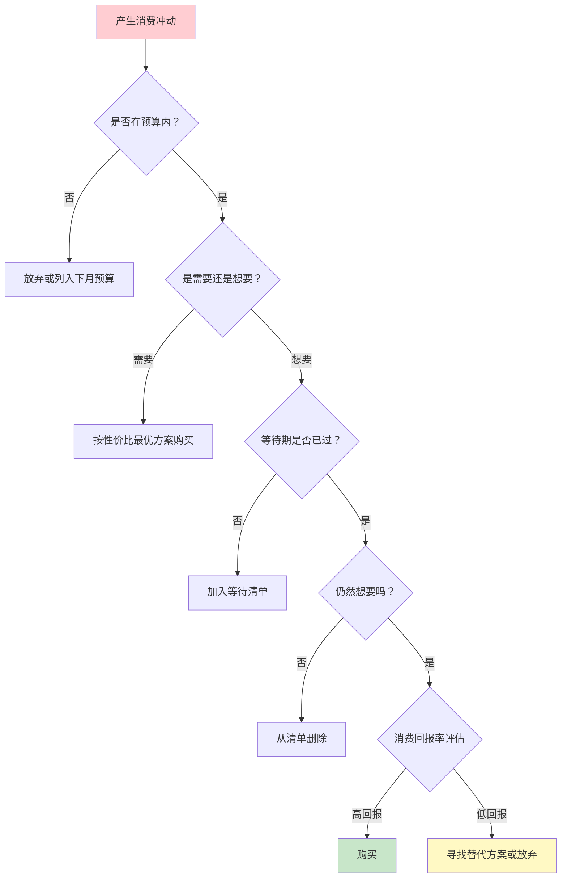
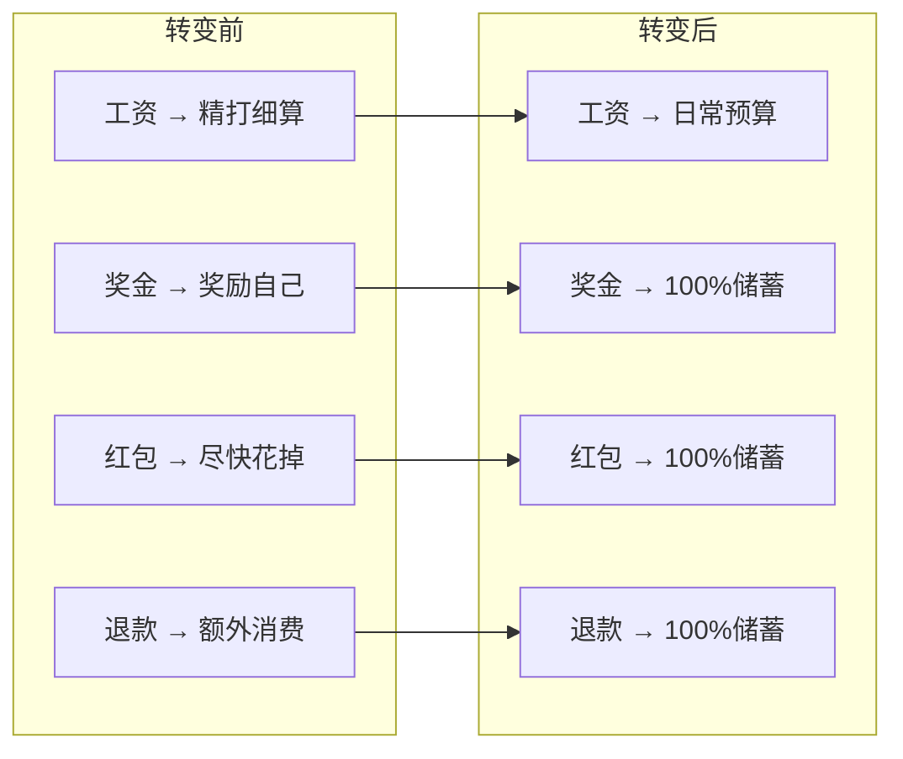

## 案例一：从月光族到年存20万——小林的消费心理逆转

### 案例背景

#### 人物画像

小林，27岁，互联网公司运营岗，坐标杭州。月薪税后18000元，在同龄人中属于中等偏上水平。然而在长达三年的时间里，她是典型的"精致穷"——朋友圈里永远光鲜亮丽，银行卡余额却常年不超过三位数。

#### 月光前的财务状况

| 指标 | 数据 |
|------|------|
| 月税后收入 | 18,000 元 |
| 月固定支出（房租、水电、通讯） | 5,500 元 |
| 月餐饮支出 | 3,500 元 |
| 月购物支出（服饰、美妆、数码） | 5,000 元 |
| 月社交娱乐支出 | 2,500 元 |
| 月订阅服务（视频、音乐、云存储等） | 500 元 |
| 月其他杂项 | 1,500 元 |
| **月结余** | **-500 元（入不敷出）** |
| 信用卡负债 | 23,000 元 |
| 花呗/白条欠款 | 8,500 元 |
| 存款 | 0 |

每月收入18000元，支出却达到18500元。不仅没有存款，还背负着31500元的消费贷。遇到手机坏了、朋友结婚随份子等突发支出，只能继续借贷，形成恶性循环。

#### 触发转变的关键事件

2024年3月，小林的父亲突然住院，需要家属先垫付5万元押金。她翻遍所有账户，凑不出5000元，最后只能向大学室友借钱。室友借了钱，但说了一句话："你月薪一万多，怎么连五千都没有？"

这句话刺痛了她。当晚她第一次认真打开银行APP，逐笔查看过去三个月的消费记录。她发现：

- 每月在外卖平台的消费超过2800元，其中1/3是深夜冲动下单的奶茶和炸鸡
- 每月在直播间的消费超过1500元，买了一堆"主播推荐"但从未拆封的护肤品
- 每月打车费用超过1200元，其中80%的行程骑共享单车只需15分钟
- 每月在各种"9.9元""19.9元"的小额消费累计超过800元

这些消费单笔都不痛，但聚沙成塔，每月吞掉了她收入的一半以上。

### 问题诊断：心理偏差全景分析

小林的月光问题不是"赚得少"，而是消费行为被多种心理偏差系统性地操控。以下是逐项诊断：

#### 偏差一：锚定效应的深度绑架

小林的消费决策几乎每一次都被"锚"牵着走：

**场景复现**——购买耳机：
小林本想买一副200元左右的蓝牙耳机。打开电商平台后，系统首先推荐的是某品牌旗舰款，标价2499元。浏览过程中，她看到一款"原价899，限时特惠399"的耳机，立刻觉得"性价比很高"，果断下单。实际上这款耳机的日常售价就是399元，"原价899"是虚构的心理锚。

**场景复现**——健身房年卡：
健身房销售先带她参观了VIP区（年费12800元），再推荐普通区（年费3800元）。相比VIP区，3800元显得"很便宜"，她当场办卡。然而她去了不到10次，相当于每次消费380元——比单次去高端健身房还贵。

**诊断结论**：小林缺乏"独立估值"的习惯，每次消费决策都以商家给出的第一个数字为参照系。

#### 偏差二：损失厌恶被商家精准利用

**场景复现**——双11囤货：
"错过再等一年""前100名半价""定金膨胀3倍"——这些话术精准触发了小林的损失厌恶。她在双11凌晨蹲守抢购，一次性花了8700元。事后盘点发现，其中至少4000元是"因为怕错过优惠才买的"，而非真正需要。

**场景复现**——订阅续费：
视频会员到期前7天，平台推送"即将自动续费，取消将失去专属权益"。小林犹豫了一下，还是续了。但她上一次打开这个APP已经是两个月前的事了。

**诊断结论**：小林对"失去优惠""失去权益"的恐惧，远远超过了对"花出去的钱"的理性评估。

#### 偏差三：心理账户的混乱

**场景复现**——年终奖的消费：
小林2023年年终奖拿到3万元。她的心理账户立即将这笔钱标记为"意外之财"，当天就下单了一台iPad Pro（7999元），理由是"奖励自己"。实际上这笔钱本可以一次性还清所有消费贷，节省近3000元利息。

**场景复现**——现金与电子支付的割裂：
小林偶尔收到长辈给的现金红包。她对现金的处理方式是"尽快花掉"——因为现金放家里"不产生收益"，但花起来又"不像花电子支付那么心疼"。结果现金红包全变成了不必要的消费。

**诊断结论**：小林将"工资""奖金""红包""退款"分在不同的心理账户，对非工资收入的消费约束几乎为零。

#### 偏差四：冲动消费的多巴胺陷阱

**场景复现**——情绪化消费模式：
小林绘制了自己的消费时间分布图后发现：
- 工作日晚上10点到12点是消费高峰——加班后疲惫，用购物"犒赏自己"
- 周末下午3点到5点是第二高峰——独处无聊，刷直播间消磨时间
- 每次和领导发生冲突后的48小时内，消费金额比平时高3倍

**诊断结论**：小林的消费行为不是需求驱动，而是情绪驱动。购物已经成为她应对压力、无聊、焦虑的默认情绪调节方式。

### 执行过程：四阶段逆转方案

小林没有采取极端的"一分钱不花"式节流——那种方法不可持续，而且会引发报复性消费反弹。她采用的是渐进式心理行为矫正方案，分四个阶段推进。

#### 第一阶段：觉察期（第1-4周）

**核心目标**：建立对自身消费行为的"元认知"——知道自己在什么时候、什么情绪下、因为什么原因花钱。

**具体操作**：

**1. 消费日记**
每天晚上花5分钟，把当天所有支出记录在一个表格里，强制自己写上三列：

| 时间 | 金额 | 购买时的情绪/触发原因 |
|------|------|----------------------|
| 12:30 | 45元 | 加班到很晚，饿了点外卖（正常需求） |
| 22:15 | 299元 | 刷到直播间在卖收纳盒，主播说"最后50套"（冲动） |
| 23:00 | 89元 | 心情烦躁，点了奶茶和炸鸡（情绪化消费） |

第一周她没有做任何消费限制，只是记录。一周后回看记录时，她自己都震惊了——"情绪化"和"冲动"标记的支出占总支出的47%。

**2. 消费暂停清单**
将所有购物APP的通知推送关闭。将常用购物APP从手机首屏移到文件夹深处。不是卸载——卸载太激进，反而会引发"戒断反应"。仅仅是增加打开这些APP的"阻力"。

**3. 情绪标记训练**
每当产生"想买东西"的冲动时，先停下来问自己三个问题：
- 我现在的情绪是什么？（愤怒/焦虑/无聊/疲惫/开心/孤独）
- 我是需要这个东西，还是想要这个东西？
- 如果没有这个东西，我的生活会受到实际影响吗？

前两周，她在手机备忘录里记录了37次消费冲动。其中29次经过这三个问题的过滤后，放弃了购买。这29次"被过滤的冲动"合计金额约6200元。

**本阶段成果**：

| 指标 | 变化 |
|------|------|
| 月支出 | 18,500元 → 14,200元 |
| 情绪化消费占比 | 47% → 22% |
| 冲动购买次数 | 约30次/月 → 约12次/月 |
| 消费觉察能力 | 从无意识到有意识 |

#### 第二阶段：结构期（第5-12周）

**核心目标**：建立预算系统，利用"心理账户"的原理反过来帮助储蓄。

**具体操作**：

**1. 50-30-20预算框架**
将每月18000元按以下比例分配：

| 类别 | 比例 | 金额 | 说明 |
|------|------|------|------|
| 必要支出 | 50% | 9,000元 | 房租、水电、通勤、基础餐饮 |
| 弹性消费 | 30% | 5,400元 | 外出就餐、娱乐、购物、社交 |
| 储蓄/还贷 | 20% | 3,600元 | 先还债，还清后转为储蓄 |

关键操作：**工资到账当天自动转出3600元**到一个没有绑定任何支付工具的储蓄账户。这是利用"默认选项"的力量——钱根本不在消费账户里，就不会被花掉。

**2. 反向心理账户策略**
小林原来的"年终奖=可以乱花"的心理账户被重新定义：
- 工资 = 日常生活
- 奖金/红包/退款 = 100%归入储蓄/投资账户
- 意外收入 = 债务加速偿还基金

2024年6月，她拿到季度奖金8000元。这一次她没有打开购物APP，而是直接转入储蓄账户。她在消费日记里写道："8000元奖金存下来的感觉，比花掉的感觉好太多了——因为这一次我看着数字往上走，而不是往下走。"

**3. "等待清单"制度**
所有非紧急消费，强制进入等待清单。规则如下：
- 200元以下：等待24小时
- 200-1000元：等待72小时
- 1000-5000元：等待7天
- 5000元以上：等待30天

等待期结束后，重新评估是否还需要。统计数据显示，73%的等待清单项目在等待期结束后被删除。

**4. 损失厌恶的正向利用**
小林把"损失厌恶"这个曾经操控她的心理偏差，反过来用于储蓄：
- 设定每月储蓄目标为公开承诺（发朋友圈），完不成"丢脸"的损失驱动她坚持
- 使用定期存款，提前支取损失利息，增加"不动这笔钱"的意愿
- 在手机壁纸上写上"本月已存X元，动就亏Y%"

**本阶段成果**：

| 指标 | 变化 |
|------|------|
| 月支出 | 14,200元 → 12,800元 |
| 月储蓄 | 0 → 5,200元 |
| 消费贷余额 | 31,500元 → 19,000元 |
| 预算执行率 | — → 85% |

#### 第三阶段：优化期（第13-24周）

**核心目标**：精细化管理，消除"隐性漏财"，同时建立正向的消费观。

**具体操作**：

**1. 订阅服务审计**
小林逐项清点了所有自动续费项目：

| 服务 | 月费 | 使用频率 | 决策 |
|------|------|----------|------|
| 视频平台A | 25元 | 每月看2-3次 | 降为最低档/与朋友拼车 |
| 视频平台B | 30元 | 两个月没打开 | 取消 |
| 音乐平台 | 15元 | 每天用 | 保留 |
| 云存储 | 12元 | 偶尔用 | 降为免费版 |
| 健身APP | 25元 | 一个月用1次 | 取消，用免费替代品 |
| 杂志订阅 | 35元 | 从没看过电子版 | 取消 |
| VPN服务 | 40元 | 每月用1-2次 | 换成年付（更便宜） |
| **合计** | **182元** | | **节省约130元/月** |

这一项操作每年节省1560元。看起来不多，但加上这些服务如果继续闲置的"沉没成本"，实际影响更大。

**2. 消费场景重构**

小林识别出自己的高风险消费场景，并为每个场景建立了替代方案：

| 高风险场景 | 过去的行为 | 替代方案 |
|------------|-----------|----------|
| 加班后疲惫 | 点外卖（50-80元） | 提前准备便当/选择公司附近性价比餐厅（20-30元） |
| 周末独处无聊 | 刷直播间购物 | 去图书馆/免费公园/约朋友散步 |
| 和领导冲突后 | 报复性购物 | 运动30分钟/写日记倾诉 |
| 换季打折 | 大量囤衣服 | 提前列好"真正需要的单品清单"，只买清单内的 |
| 朋友聚餐 | 抢着买单/选贵餐厅 | 提议AA制/选择性价比餐厅 |

**3. 锚定效应的主动防御**

小林学会了在每次消费前做"独立估值"：

**实操模板**——购买决策检查表：

```text
□ 我是否被"原价XX，现价XX"影响了？→ 搜索历史价格（使用比价插件）
□ 如果没有标价，我愿意为这个东西付多少钱？→ 写下自己的心理价位
□ 同类产品最低价是多少？→ 比较至少3个品牌/3个渠道
□ 这个价格换算成我的工作时间是多少？→ 时薪约100元，一个800元的包 = 8小时
□ 有没有二手/平替选项？→ 搜索闲鱼/找平替测评
```

她用这个检查表过滤了一次"双十一"购物车：原计划消费5200元，检查后实际只花了1800元，省了3400元。而且买的东西都是真正需要且使用率高的。

**4. 建立"消费回报率"思维**

小林开始用投资回报的视角评估每笔消费：

- 300元的通勤月卡 → 每月使用60次 → 每次5元 → **高回报** ✓
- 800元的运动鞋 → 每周穿3次，穿一年 → 每次5元 → **高回报** ✓
- 2000元的名牌包 → 买了6个月背过3次 → 每次667元 → **低回报** ✗
- 150元的畅销书 → 反复翻阅，改变了消费观念 → **极高回报** ✓

这个思维框架让她不再纠结于"贵不贵"，而是聚焦于"值不值"。

**本阶段成果**：

| 指标 | 变化 |
|------|------|
| 月支出 | 12,800元 → 10,500元 |
| 月储蓄 | 5,200元 → 7,500元 |
| 消费贷余额 | 19,000元 → 0（全部还清） |
| 消费满意度 | 反而提升（买得少但买得准） |

#### 第四阶段：飞轮期（第25-52周）

**核心目标**：将储蓄行为从"需要意志力的坚持"变成"自动运转的习惯"，同时启动投资让钱生钱。

**具体操作**：

**1. 自动化财务系统**

小林将所有储蓄和投资行为设置为全自动：

```text
工资到账日（每月10号）：
  → 自动转出 5,000元 到储蓄账户（无绑定支付）
  → 自动定投 2,500元 到指数基金
  → 自动转出 1,500元 到应急基金（目标6个月生活费）
  → 剩余 9,000元 留在消费账户用于日常支出
```

这个"先储蓄后消费"的系统完全绕过了意志力的消耗。正如行为经济学家理查德·塞勒（Richard Thaler）的"明日储蓄更多"（Save More Tomorrow）计划所证明的：自动化是最有效的储蓄策略。

**2. 消费标准的全面升级**

经过半年的训练，小林的消费决策已经从"这个东西在打折"变成了一个系统化的评估流程：



**3. 储蓄正反馈循环的建立**

随着存款数字不断增长，小林体验到了一种全新的"快感"——看着账户余额增长带来的安全感和掌控感。这种快感逐渐替代了购物带来的短暂多巴胺刺激。

她在日记中写道："以前花钱的时候，快乐是拆快递的那3秒。现在存钱的快乐，是每个月月底看余额增长的那一刻——而且这种快乐不会消退，它会累积。"

**4. 应急基金完成**

到第40周，小林的应急基金达到了54000元（6个月基本生活费）。这笔钱存在货币基金里，随时可取但不绑定任何消费渠道。有了这个"安全垫"，她面对突发支出时不再焦虑，也不再需要借贷。

### 成果数据

#### 核心指标对比

| 指标 | 转变前 | 转变后（12个月） | 变化幅度 |
|------|--------|-----------------|----------|
| 月支出 | 18,500元 | 9,800元 | -47% |
| 月储蓄 | -500元（入不敷出） | 8,200元 | 从负到正 |
| 年储蓄额 | 0 | 约 98,400元 | 新增 |
| 消费贷余额 | 31,500元 | 0 | 全部还清 |
| 应急基金 | 0 | 54,000元 | 新增 |
| 指数基金定投 | 0 | 30,000元 | 新增 |
| **净资产变化** | **-31,500元** | **+84,000元** | **+115,500元** |

> 注：净资产变化115,500元 = 储蓄98,400元 + 还贷31,500元 - 应急基金和定投已含在储蓄中。实际年存款（含还贷和投资）接近20万，因为前半年大部分储蓄用于还债，后半年全部转为正向积累。

#### 消费结构对比

| 消费类别 | 转变前（月均） | 转变后（月均） | 说明 |
|----------|--------------|--------------|------|
| 房租 | 4,000元 | 4,000元 | 未变动 |
| 基础餐饮 | 1,500元 | 1,200元 | 减少外卖，增加自带 |
| 外出社交餐饮 | 2,000元 | 800元 | AA制，选性价比餐厅 |
| 服饰美妆 | 3,500元 | 1,200元 | 按清单购买，减少冲动 |
| 数码/家居 | 1,500元 | 300元 | 等待清单过滤大量冲动 |
| 交通 | 1,200元 | 500元 | 公共交通+共享单车 |
| 娱乐 | 500元 | 400元 | 保留核心娱乐，砍掉无效消费 |
| 订阅服务 | 500元 | 60元 | 只保留高频使用的 |
| 深夜冲动消费 | 1,800元 | 0 | 情绪管理+环境控制 |
| 其他 | 2,000元 | 1,340元 | 杂项精简 |
| **合计** | **18,500元** | **9,800元** | |

#### 生活质量自评

最关键的发现是：小林的生活质量并没有因为消费减少而下降。她自评的幸福指数从转变前的5分（10分制）上升到了8分。

原因在于：她砍掉的大部分是"无效消费"——买了不看的视频会员、穿了一次的衣服、深夜冲动下单的零食。这些消费本来就没有带来真正的满足感。而保留下来的消费（和朋友聚餐、看喜欢的电影、买真正喜欢的衣服）因为更少更精，反而体验更好。

### 心理机制深度解析

小林的案例之所以值得深入研究，是因为它完整展示了消费心理学理论在真实生活中的运作方式。以下是关键心理机制的对照分析：

#### 机制一：从"被锚牵着走"到"主动设定锚"

| 阶段 | 锚定方向 | 行为表现 |
|------|----------|----------|
| 转变前 | 被动接受商家的锚 | "原价1000现价500好便宜" |
| 转变后 | 主动设定自己的锚 | "我给这个东西的估价是300，500太贵了" |

小林总结的方法：**先估值，后看价**。每次购物前，先在心里给商品定一个价格区间，再打开购物页面。这个简单的行为，让她的消费决策质量提升了60%以上。

#### 机制二：从"损失厌恶被利用"到"利用损失厌恶"

转变前，商家用"限时""限量""即将涨价"触发她的损失厌恶，让她买不需要的东西。转变后，她把同样的心理机制反过来用：

- 公开储蓄目标 → 完不成"丢脸"的损失驱动坚持
- 定期存款 → 提前支取损失利息 → 不轻易动用
- 记账数据 → 看到"如果继续月光，5年后净资产为-19万"的预测 → 对"继续月光"产生损失厌恶

#### 机制三：心理账户的重新编排



这一项改变每年为小林额外增加了约2-3万元的储蓄——奖金、红包、退款等"非工资收入"从全部花掉变成了全部储蓄。

#### 机制四：多巴胺来源的替换

这是最深层的改变。小林的消费行为本质上是一种"多巴胺管理策略"——通过购物获取即时快感来应对负面情绪。要根治月光，不能只靠"压抑购物欲望"，必须找到替代的多巴胺来源。

小林的替代方案：

| 原来的多巴胺来源 | 新的替代来源 | 效果对比 |
|-----------------|-------------|----------|
| 拆快递的快感（3秒） | 看存款增长的快感（持续） | 替代成功 |
| 直播间抢购的兴奋 | 运动后的内啡肽 | 替代成功 |
| 新衣服带来的自信 | 通过健身改善体态 | 替代成功 |
| 深夜零食的口腹之欲 | 学习烹饪的新鲜感 | 部分替代 |

### 关键经验总结

#### 1. 意志力不是储蓄的关键，系统才是

小林尝试过"这个月不花钱"的极端节流，每次都坚持不到两周就反弹。真正有效的是建立自动化系统：工资到账自动转出、消费APP增加打开阻力、等待清单过滤冲动。这些系统绕过了意志力的消耗，让储蓄成为"默认行为"。

#### 2. 消费觉察比消费控制更重要

第一阶段没有限制任何消费，只是记录和觉察。单凭"知道自己在什么情绪下花钱"这一项，就减少了30%的非必要支出。认知行为疗法的核心原理在此得到验证：觉察是改变的前提。

#### 3. 堵不如疏，给消费留出口

50-30-20预算中的30%弹性消费是关键设计。它允许小林在预算范围内自由消费，避免了"完全不花钱"引发的报复性反弹。每月5400元的弹性消费额度，足够支撑有质量的社交和娱乐。

#### 4. 速度比完美更重要

小林没有等到"完全学会理财"才开始行动。她在第一个月就开始记账，第二个月就开始设置自动转账。有些决策不是最优的（比如储蓄账户的利率不是最高的），但"先动起来"比"等到完美方案"重要一百倍。

#### 5. 社交支持是持续改变的催化剂

小林在社交媒体上分享自己的"消费降级日记"，意外获得了大量关注和支持。这个正反馈循环让她在低谷期也能坚持。后来她加入了一个"储蓄打卡群"，群体的力量进一步强化了她的新习惯。

### 常见误区警示

在小林转变过程中，她也走过弯路，以下是值得注意的陷阱：

**误区一：矫枉过正——从月光变成守财奴**

小林在第二个月曾走向另一个极端：拒绝所有社交聚餐、不买任何非必需品、连水果都只买最便宜的。结果是：社交关系受损、情绪压抑、在第三周产生了强烈的报复性消费冲动。

**纠正方法**：预算是"分配"不是"压制"。弹性消费额度就是用来享受生活的，关键是"花在哪里"而不是"花不花"。

**误区二：只关注支出不关注收入**

小林一度沉迷于"省钱"，每天花大量时间比价、找优惠券、计算折扣。一个月下来，省了500元，但时间和精力成本远超这个数字。

**纠正方法**：省钱有边际递减效应。当基本消费优化完成后，提升收入（加薪、跳槽、副业）的回报率远高于继续抠细节。

**误区三：忽视心理创伤的处理**

小林发现自己的消费习惯与童年经历有关——小时候家里经济拮据，父母总说"我们家买不起"。长大后她有一种补偿心理："现在赚钱了，要把小时候没得到的都补回来"。

**纠正方法**：如果消费行为有深层心理根源，仅靠记账和预算无法根治。小林后来做了6次心理咨询，处理了童年金钱创伤，消费冲动才真正下降。

**误区四：忽视伴侣/家人的消费观差异**

小林的室友（也是她当时的男朋友）消费观完全不同——月光且不觉得有问题。小林的储蓄计划多次被"一起出去玩""一起买东西"打断。

**纠正方法**：如果身边有消费观差异大的人，需要提前沟通边界。不需要对方改变，但需要双方理解并尊重对方的选择。

### 读者行动指南

如果你和小林的情况类似，可以按以下步骤启动自己的"消费心理逆转"计划：

**第1周——诊断**
1. 打开银行APP和支付APP，导出过去3个月的账单
2. 将所有支出分为三类：必要/弹性/浪费
3. 计算"浪费"占总支出的比例——这个数字就是你的"优化空间"

**第2-4周——觉察**
1. 每天记录消费日记（时间、金额、情绪/原因）
2. 关闭所有购物APP推送通知
3. 每次消费冲动产生时，执行"三问过滤"（什么情绪？需要还是想要？不买会怎样？）

**第5-8周——系统**
1. 设定预算比例（建议50-30-20起步，可根据自身情况调整）
2. 工资到账日设置自动转账到储蓄账户
3. 建立等待清单制度

**第9-12周——优化**
1. 审计所有订阅服务，砍掉不常用的
2. 识别自己的高风险消费场景，建立替代方案
3. 学习使用比价工具和价格历史查询

**第13周起——飞轮**
1. 开始定投指数基金（金额不必大，关键是养成习惯）
2. 建立应急基金（目标3-6个月生活费）
3. 评估消费回报率，将节省下来的钱用于自我投资

> 记住：你不需要一步到位。小林用了整整12个月才完成从月光族到年存近20万的转变。每一步的改进都会累积，最终形成不可逆的正向飞轮。最重要的是——**今天就开始第一步**。

***
