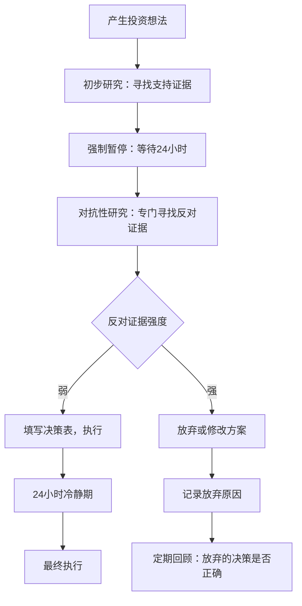

## 案例二：投资心理的校正——老王的股市教训

### 案例背景

**人物档案**

| 维度 | 详情 |
|------|------|
| 姓名 | 老王（化名） |
| 年龄 | 42岁 |
| 职业 | 某互联网公司中层管理，年薪35万 |
| 家庭 | 已婚，一个孩子上小学，有房贷 |
| 投资经验 | 2015年入市，经历过完整牛熊周期 |
| 投资本金 | 初始投入30万，高峰期曾追加到80万 |
| 性格特征 | 自信、好强、不服输、爱面子 |

**入市契机**

2015年4月，A股市场正处于牛市狂飙阶段。老王身边的同事、朋友几乎人人都在炒股，午饭时间的话题从"今天大盘又涨了"变成了"你买的什么票"。老王的妻子也劝他："隔壁老李上个月赚了两万，你也去开个户吧。"

老王最初的态度是谨慎的——他自认为是一个理性的人，学过MBA课程，读过几本投资入门书籍，觉得"炒股就是赌博"。但当他在2015年4月亲眼看到同事小赵一个月赚了5万块，又看到朋友圈里满屏的"牛市来了"，他内心的防线终于崩塌了。

2015年4月15日，老王在券商营业部开了户，转入30万，开始了他的股市生涯。

> **心理学视角**：老王的入市决策本身就是一个典型的**羊群效应**案例。他并非基于独立的投资分析做出决策，而是被周围人的赚钱效应和社会压力推动。同时，**可得性偏差**在此刻发挥了作用——身边赚钱的案例比亏钱的案例更容易被注意到，让他高估了投资收益的概率。

---

### 第一阶段：牛市蜜月期（2015年4月—6月）

#### 初战告捷

老王的第一笔交易是买入某热门券商股。他选择这只股票的逻辑很简单——券商是牛市的最大受益者，而且这只股票已经连续涨了两周，"趋势很好"。买入后三天，股价上涨了8%，老王赚了约1.2万。

这一次的成功给了老王巨大的信心。他开始觉得自己"有投资天赋"，开始频繁交易。两个月内，他的账户从30万增长到了42万，收益率高达40%。

#### 过度自信的膨胀

随着收益的增长，老王的行为模式发生了显著变化：

1. **加大投入**：他把家庭储蓄中的20万也投入了股市，总仓位达到60万
2. **频繁交易**：从最初的一周交易一两次，变成了每天交易，甚至一天交易多次
3. **忽视风控**：不再设止损线，认为"跌了还会涨回来"
4. **社交炫耀**：在朋友圈晒收益截图，在饭局上主动聊股票

> **心理学视角**：这是典型的**过度自信偏差**。老王把市场β收益（牛市普涨）错误归因为自己的α能力（选股天赋）。诺贝尔经济学奖得主丹尼尔·卡尼曼的研究表明，人类天生倾向于将好结果归因于自己的能力，将坏结果归因于运气——这种"自我归因偏差"在投资新手中尤为明显。

#### 过度自信的量化指标

| 行为指标 | 正常状态 | 过度自信状态 |
|----------|----------|--------------|
| 交易频率 | 每月2-4次 | 每天2-3次 |
| 单笔投入比例 | 不超过总仓位10% | 经常达到30%-50% |
| 止损设置 | 每笔都设 | 从不设置 |
| 信息来源 | 多维度研究 | 只看利好消息 |
| 持仓周期 | 数周至数月 | 数小时至数天 |
| 仓位管理 | 保持现金缓冲 | 满仓操作 |

---

### 第二阶段：牛熊转换的崩溃（2015年6月—2016年1月）

#### 第一次重击

2015年6月15日，A股市场开始了暴跌。上证指数从5178点开始急速下挫。老王的账户在一周内回吐了大部分利润，从最高点的42万缩水到28万。

此刻，老王面临了他投资生涯中第一个关键决策点。他需要决定：是止损离场，还是继续持有等待反弹。

**老王的选择**：继续持有，并且加仓"抄底"。

他的逻辑是："这轮牛市的逻辑没有变，国家不会让股市崩盘。现在跌了正好是买入机会，别人恐惧我贪婪。"

> **心理学视角**：老王在这里同时触发了多种心理偏差：
> - **确认偏差**：只关注"牛市未结束"的论点，忽视"泡沫破裂"的警告信号
> - **沉没成本谬误**：已经投入的本金和时间让他不愿意承认错误
> - **锚定效应**：以之前的高点作为"正常价格"的锚点，觉得当前价格"太便宜了"
> - **损失厌恶**：宁可冒更大风险也不愿确认已经发生的损失

#### 越陷越深

2015年7月，市场出现了短暂反弹。老王的账户回升到35万。他没有利用这次反弹减仓，反而更加确信自己的判断是正确的，继续追加投入10万，总投入达到70万。

2015年8月，第二轮暴跌来袭。老王的账户跌破了成本线，浮亏达到15万。这时候，他的心理状态发生了根本性的变化：

1. **睡眠质量下降**：每天晚上看美股走势，凌晨2点还在刷财经新闻
2. **工作效率降低**：白天频繁看手机行情，开会时心不在焉
3. **情绪波动剧烈**：股市涨就开心，股市跌就暴躁
4. **社交回避**：不再和同事聊股票，因为"亏了不好意思说"

> **心理学视角**：这是**损失厌恶**的典型表现。行为经济学研究表明，亏损带来的痛苦感是同等收益带来的快乐感的2.5倍。老王每天面对浮亏，其心理痛苦远超当初赚钱时的快乐。这种痛苦会导致决策质量进一步下降，形成恶性循环。

#### 底部割肉

2016年1月初，熔断机制触发，A股连续暴跌。老王的账户已经缩水到38万，总浮亏超过30万。在一次和妻子的激烈争吵后（妻子质问"孩子的教育金你是不是也投进去了"），老王在恐慌中卖出了所有持仓。

这次清仓，老王的总亏损约为32万——不仅吐出了全部利润，还亏掉了一大笔本金。

---

### 第三阶段：反思与认知重建（2016年1月—2017年6月）

#### 心理创伤期

清仓后的老王陷入了严重的心理困境：

- **自责**："我明明看过那么多投资书，为什么还会犯这种错误？"
- **怀疑**："股市是不是就是赌场？散户根本不可能赚钱？"
- **回避**：把股票软件卸载了，不愿再看任何财经新闻
- **迁怒**：对家人发火，认为"都是你们当初催我入市的"

这段时期持续了约三个月。老王的失眠问题加重，工作效率持续低下，甚至一度考虑辞职。

#### 寻求帮助

2016年4月，老王在一次校友聚会上遇到了一位做私募基金的老同学老张。老张在了解到老王的经历后，给出了一个关键建议："你不是技术问题，是心理问题。你需要系统地重建你的投资认知。"

老张推荐了三本书：
1. 《思考，快与慢》——丹尼尔·卡尼曼
2. 《投资中最简单的事》——邱国鹭
3. 《行为金融学》——詹姆斯·蒙蒂尔

#### 认知重建过程

老王用了整整一年的时间，系统地学习投资心理学。他做了以下几件事：

**1. 建立投资日记**

老王开始记录每一笔投资决策的完整过程：

```text
日期：2016年8月15日
标的：XX银行
决策：买入
逻辑：
  - 当前PE为6.5倍，处于历史低位
  - 股息率5.2%，高于十年国债收益率
  - 银行资产质量在改善，不良率见顶
风险：
  - 经济下行可能导致坏账增加
  - 利率市场化压缩息差
预期持有期：1年以上
止损线：-15%
```

**2. 识别自己的心理偏差模式**

通过复盘2015年的交易记录，老王总结出自己最容易犯的五种心理偏差：

| 偏差类型 | 2015年典型表现 | 校正策略 |
|----------|----------------|----------|
| 过度自信 | 日均交易2次以上，从不设止损 | 设定每月最多交易4次，每笔必设止损 |
| 羊群效应 | 听同事推荐就买，不独立研究 | 购买前必须完成独立分析报告 |
| 处置效应 | 赚10%就跑，亏30%还扛 | 设定对称止盈止损（如±20%） |
| 确认偏差 | 只看利好消息，忽视风险提示 | 买入前强制列出3个卖出理由 |
| 损失厌恶 | 亏损时焦虑失眠，冲动决策 | 降低仓位到不影响睡眠的水平 |

**3. 建立投资规则体系**

老王制定了严格的投资规则，并打印出来贴在电脑旁：

**买入规则（必须全部满足）**：
- 研究时间不少于2周
- 独立分析报告不少于2000字
- 估值处于历史30%分位以下
- 有明确的买入逻辑和风险清单
- 总仓位不超过70%

**持有规则**：
- 每季度审视一次基本面是否变化
- 不因短期波动改变长期判断
- 保持投资日记持续更新

**卖出规则（触发任一即执行）**：
- 基本面发生实质性恶化
- 估值超过历史80%分位
- 触及预设止损线
- 发现更好的投资机会

**4. 降低交易频率**

老王认识到，频繁交易是他亏损的重要原因之一。他设定了严格的交易限制：

- 每月最多进行4次交易（买入或卖出）
- 每笔交易前必须填写"交易决策表"
- 交易决策表填写后等待24小时再执行

> **心理学视角**：24小时等待规则是一种"冷静期"机制。研究表明，情绪驱动的决策通常在情绪高峰期做出，而等待24小时可以让前额叶皮层重新获得对杏仁核的控制，使决策更加理性。

---

### 第四阶段：重建与验证（2017年7月—2020年12月）

#### 重新入市

2017年7月，老王带着20万本金重新入市。这一次，他的行为模式发生了根本性的变化：

| 维度 | 2015年（旧模式） | 2017年（新模式） |
|------|------------------|------------------|
| 研究深度 | 听消息、看K线 | 阅读年报、行业研究 |
| 持仓数量 | 同时持有10+只股票 | 集中持有3-5只 |
| 交易频率 | 每天2-3次 | 每月2-3次 |
| 仓位管理 | 经常满仓 | 保持20%-30%现金 |
| 心理状态 | 焦虑、亢奋交替 | 平静、理性 |
| 止损执行 | 从不执行 | 严格执行 |

#### 实际执行案例

**案例A：成功止损——某环保股**

2018年3月，老王以18元/股的价格买入某环保龙头股，投入5万元。买入逻辑是"环保政策趋严，公司订单充足"。

然而，两个月后，公司暴露出应收账款过高的问题，股价跌至15元（-16.7%）。按照老王制定的止损规则（-15%），他在15.3元果断卖出，亏损约7500元。

三个月后，这只股票继续下跌至9元。如果老王没有止损，亏损将达到2.5万元——是实际亏损的3.3倍。

> **止损的心理成本**：老王事后复盘时写道："止损的那一瞬间非常痛苦，觉得自己'割肉割在地板上'。但事后看，这是最正确的决定。痛苦5分钟，避免了痛苦5个月。"

**案例B：成功持有——某白酒股**

2018年10月，老王以65元/股的价格买入某白酒龙头股，投入8万元。买入逻辑是"消费升级+品牌壁垒+估值合理"。

2019年初，股价一度下跌至55元（-15.4%）。按照旧模式，老王会恐慌卖出。但这次，他仔细审视了自己的买入逻辑——基本面没有变化，下跌只是市场情绪波动。他不仅没有卖出，反而在58元时小幅加仓2万元。

到2020年底，这只股票的价格已经超过200元，老王的持仓市值超过30万元，收益率超过200%。

> **关键区别**：同样是面对浮亏，2015年的老王和2018年的老王做出了完全相反的决策。区别不在于技术分析能力，而在于心理状态——前者被恐惧驱动，后者被逻辑驱动。

#### 收益数据

| 时间段 | 总投入 | 期末市值 | 收益率 | 年化收益率 | 最大回撤 |
|--------|--------|----------|--------|------------|----------|
| 2015.4-2016.1 | 70万 | 38万 | -45.7% | N/A | -55% |
| 2017.7-2020.12 | 20万 | 58万 | +190% | +41.2% | -18% |

---

### 第五阶段：心理校正的核心方法论总结

老王经过五年的投资实践，总结出了一套完整的投资心理校正方法论。这套方法论不仅帮助他自己实现了扭亏为盈，也帮助了身边几位同样陷入困境的朋友。

#### 方法一：建立"决策-结果"分离意识

**核心理念**：好的决策可能带来坏的结果，坏的决策可能带来好的结果。评价投资行为应该看决策质量，而不是看结果。

**实践方法**：

```text
投资决策评估矩阵

           | 结果好  | 结果差
-----------|---------|--------
决策质量高 | 正确坚持 | 运气不好，继续坚持
决策质量低 | 侥幸获利，必须反省 | 预期之中，必须改正
```

**老王的实践**：2019年，他基于充分研究买入了一只医药股，买入后股价下跌了20%。但他给这次决策打了8分（满分10分），因为"研究过程扎实，逻辑清晰，下跌是因为行业政策变化而非个人判断失误"。他选择继续持有，最终该股票在一年后回升并盈利15%。

#### 方法二：设计"对抗性"决策流程

**核心理念**：人的大脑天生会寻找支持自己观点的证据（确认偏差）。对抗这种偏差的唯一方法是在决策流程中强制加入"反对派"环节。

**具体流程**：



**老王的"反对派清单"**（买入任何股票前必须回答）：

1. 这个公司最大的风险是什么？如果这个风险发生，股价会跌多少？
2. 市场上的聪明钱（如机构投资者）为什么不买这只股票？
3. 如果我今天是第一次看到这只股票，我还会以当前价格买入吗？
4. 有没有更好的投资机会被我忽略了？
5. 我能承受这只股票下跌30%而不恐慌卖出吗？

#### 方法三：量化情绪指标

**核心理念**：情绪是投资决策最大的敌人，但情绪不是不可量化的。通过建立"情绪温度计"，可以客观地评估自己的心理状态。

**老王的情绪管理工具**：

每次交易前，评估以下情绪指标（1-10分）：

| 情绪指标 | 评分标准 | 当前评分 | 安全阈值 |
|----------|----------|----------|----------|
| 焦虑程度 | 1=完全放松，10=极度焦虑 | ？ | ≤4 |
| 贪婪程度 | 1=完全理性，10=极度贪婪 | ？ | ≤4 |
| 恐惧程度 | 1=完全理性，10=极度恐惧 | ？ | ≤4 |
| 自信程度 | 1=完全不确定，10=极度自信 | ？ | ≤6 |
| 从众程度 | 1=完全独立，10=完全跟风 | ？ | ≤3 |

**规则**：任何一项情绪指标超过安全阈值，暂停交易，等待情绪平复后再决策。

> **心理学视角**：这个工具的原理是"元认知"——对自己思维过程的觉察。研究表明，仅仅是意识到自己正处于某种情绪状态，就能显著降低该情绪对决策的影响。这在心理学中被称为"情绪标注"效应。

#### 方法四：构建"投资心理检查清单"

老王将投资心理学的核心知识点浓缩为一张检查清单，贴在办公桌前：

```text
┌─────────────────────────────────────────────────┐
│           投资心理每日检查清单                     │
├─────────────────────────────────────────────────┤
│ □ 我今天是否因为情绪（而非逻辑）做了交易？         │
│ □ 我是否只关注了支持自己观点的信息？               │
│ □ 我是否在追逐热门股票/概念？                     │
│ □ 我的持仓是否让我晚上睡不好觉？                   │
│ □ 我是否因为已经投入了钱/时间而继续持有？           │
│ □ 我是否高估了自己的判断能力？                     │
│ □ 我是否在模仿别人的投资决策？                     │
│ □ 我的止损/止盈规则是否在执行？                    │
├─────────────────────────────────────────────────┤
│ 如果有3个以上回答"是"，暂停交易，复盘决策          │
└─────────────────────────────────────────────────┘
```

---

### 案例启示：老王的七条投资心理法则

经过五年的实战和反思，老王提炼出了七条投资心理法则。这些法则不是技术分析方法，而是心理层面的生存指南：

**法则一：承认无知是智慧的开始**

市场有无数变量，没有人能准确预测短期走势。承认自己的无知，才能保持谦逊和学习的态度。

**法则二：规则比判断更重要**

人的情绪会波动，但规则不会。把你的投资逻辑写成规则，然后像机器一样执行。

**法则三：孤独是投资者的常态**

如果你的投资决策和大多数人一样，那你大概率是错的。真正的投资机会往往在无人问津处。

**法则四：止损是保护，不是失败**

止损不是承认失败，而是保护本金。本金是投资者的生命线，没有本金就没有机会。

**法则五：时间是投资者的朋友**

频繁交易是投资者的敌人。降低交易频率，让时间成为你的盟友。

**法则六：情绪是最大的敌人**

恐惧和贪婪是投资决策的两大杀手。建立量化情绪管理机制，用规则对抗情绪。

**法则七：复盘是最好的老师**

每一笔交易——无论盈亏——都是学习的机会。建立投资日记，定期复盘，从错误中学习。

---

### 老王的现状（截至案例记录时）

| 维度 | 2015年 | 2020年 |
|------|--------|--------|
| 投资本金 | 70万（含追加） | 20万（重新起步） |
| 当前市值 | 38万（亏损状态） | 58万（盈利状态） |
| 年化收益率 | -45.7% | +41.2% |
| 最大回撤 | -55% | -18% |
| 交易频率 | 每天2-3次 | 每月2-3次 |
| 睡眠质量 | 严重失眠 | 正常 |
| 家庭关系 | 紧张 | 和谐 |
| 投资心态 | 焦虑、亢奋 | 平静、理性 |

老王经常对朋友说："我花了32万学费，学到了一个道理——投资最重要的不是技术，而是心理。技术可以学，心理必须练。"

***

