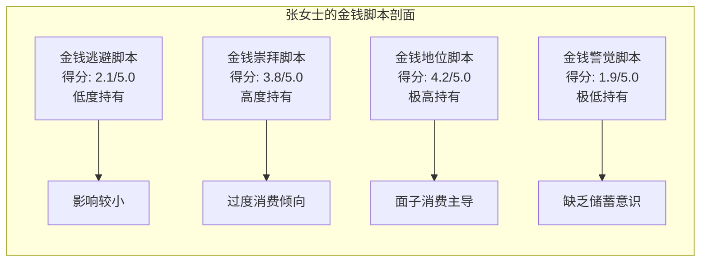
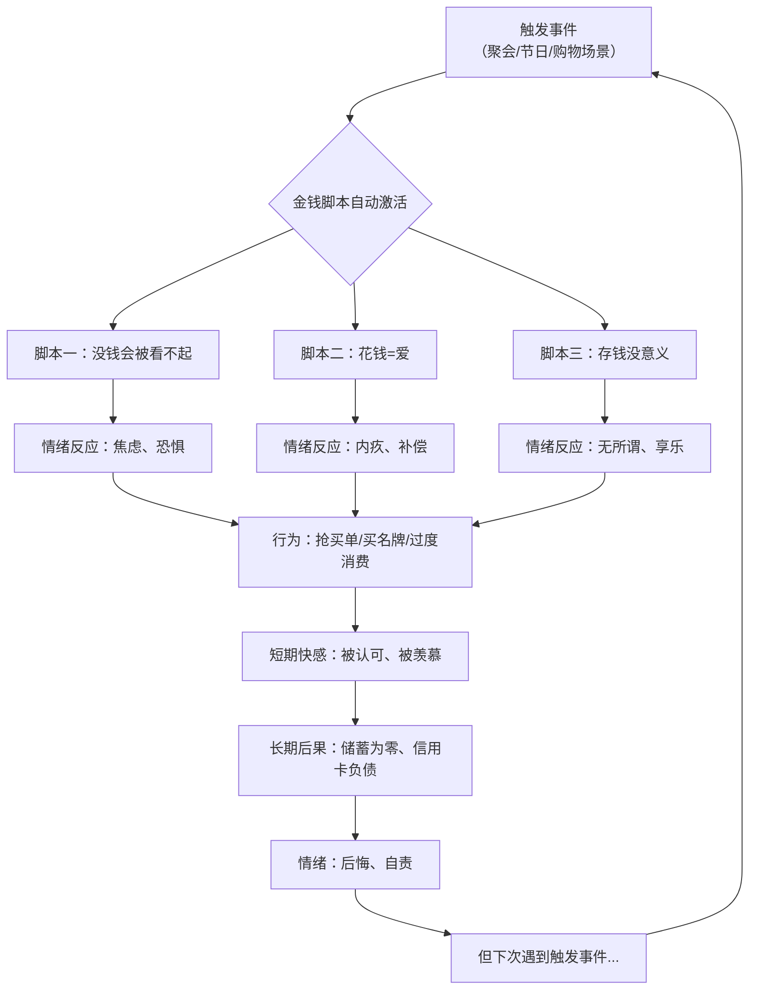
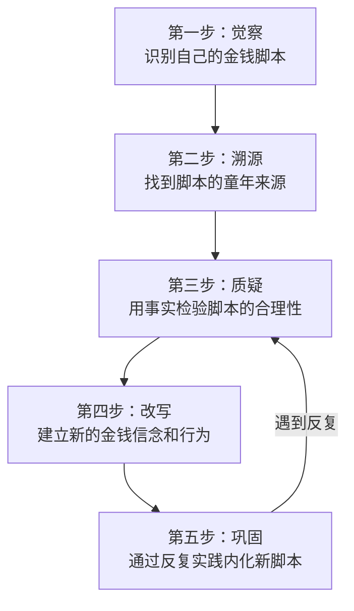

## 案例三：金钱脚本的改写——张女士的蜕变

### 一、案例概览

张女士，35岁，某三线城市小学教师，月薪6500元，丈夫在事业单位工作，家庭月收入约13000元。表面上看，这是一个收入稳定、生活安稳的中产家庭。但在2023年的一次家庭财务危机中，张女士发现自己对金钱的深层信念正在系统性地破坏整个家庭的财务健康——她不仅存不下钱，还在反复做出让自己后悔的财务决策。

本案例完整记录了张女士从发现自身金钱脚本、理解脚本来源、到系统性改写脚本并重建健康财务行为的全过程。这不是一个"副业赚钱"的故事，而是一个关于**内在信念如何决定外在财务结果**的深度案例。

---

### 二、背景：一场生日宴引发的财务危机

#### 2.1 事件经过

2023年10月，张女士的女儿过8岁生日。她花了4800元办了一场生日派对——租场地、请摄影师、定制蛋糕、买进口零食、准备伴手礼。这个数字相当于她大半个月的工资。

丈夫得知后非常生气，两人爆发了结婚以来最激烈的一次争吵。丈夫质问："你每次花钱都这样，从来不考虑以后！"张女士委屈地反驳："我就是想给孩子一个好的回忆，这有什么错？"

争吵过后，张女士开始反思一个一直困扰她的问题：**为什么她明明知道应该理性消费，却总是控制不住自己？**

#### 2.2 财务现状诊断

张女士梳理了过去一年的家庭财务数据，发现了触目惊心的模式：

| 指标 | 数据 | 问题 |
|------|------|------|
| 家庭年收入 | 156,000元 | 三线城市中等偏上 |
| 年储蓄额 | 3,200元 | 储蓄率仅2%，远低于健康水平 |
| 非必要消费占比 | 约45% | 近一半收入花在了"面子消费"上 |
| 信用卡分期 | 常年3-5笔 | 用分期掩盖真实消费能力 |
| 应急储备 | 不足1个月支出 | 抗风险能力极弱 |

更让她震惊的是，这些消费中**超过60%与"别人怎么看我"有关**：同事聚会抢着买单、给孩子买名牌衣服、送礼从不手软、装修房子追求"看起来有档次"。

#### 2.3 寻求专业帮助

在朋友推荐下，张女士预约了一次财务心理咨询。咨询师使用了克朗茨（Brad Klontz）开发的**金钱脚本量表（Klontz Money Script Inventory, KMSI）**对她进行评估。

KMSI量表包含48个题目，测量四大类金钱脚本的强度。张女士的评估结果如下：



**核心发现**：张女士的"金钱地位脚本"得分极高（4.2/5.0），这意味着她内心深处坚信**"一个人的价值取决于他有多少钱和消费水平"**。同时，她的"金钱警觉脚本"得分极低（1.9/5.0），几乎没有"应该存钱、谨慎消费"的内在驱动力。

这两个脚本的组合，完美解释了她过去十几年的财务行为模式。

---

### 三、诊断：金钱脚本的深度解析

#### 3.1 张女士的核心金钱脚本识别

通过6次深度访谈和金钱自传练习，咨询师帮助张女士识别出了她最核心的三条金钱脚本：

**脚本一："没钱就会被人看不起"**

> 触发场景：同事聚会、家长群、亲戚聚餐
>
> 内心独白："如果我不抢着买单，他们会觉得我小气""如果孩子穿得不好，老师和同学会看不起她"
>
> 行为模式：过度消费以维护"体面"，宁可借钱也要撑面子

**脚本二："花钱是对家人的爱"**

> 触发场景：节日、生日、纪念日
>
> 内心独白："我小时候家里穷，什么都没有，不能让孩子也这样""爱就是要给最好的"
>
> 行为模式：用消费表达情感，价格越高越觉得"有诚意"

**脚本三："存钱没有意义，钱花了才是自己的"**

> 触发场景：看到银行余额、考虑投资理财
>
> 内心独白："存那么点钱有什么用，又买不起房""通货膨胀，钱放着就贬值了""人活一辈子，何必那么委屈自己"
>
> 行为模式：有钱就想花，对储蓄和投资毫无兴趣

#### 3.2 脚本的溯源：原生家庭的金钱记忆

咨询师引导张女士回忆童年与金钱相关的关键记忆。以下是三个最核心的记忆节点：

**记忆一：小学三年级的"贫困羞辱"（约1996年）**

张女士回忆，小学三年级时学校组织春游，需要交15元费用。母亲犹豫了很久，最后只给了她10元，让她"跟老师说家里困难，能不能少交点"。她在全班同学面前被老师点名"家庭困难可以不参加"，那一刻的羞耻感至今清晰。

> 咨询师分析：这次经历在她潜意识中植入了一条等式——**"没钱=被羞辱=被人看不起"**。从此，她在任何可能暴露"不够有钱"的场景中，都会本能地用消费来掩盖。

**记忆二：母亲的"省吃俭用"（贯穿童年）**

张女士的母亲是典型的节俭型人格，但节俭的方式让童年的她感到压抑：从不下馆子、从不买新衣服、家里永远在"凑合"。母亲常说的一句话是："省着点，以后用钱的地方多着呢。"

> 咨询师分析：这种过度节俭让童年的张女士将**"存钱"与"匮乏感、压抑感"绑定**。她成年后的"报复性消费"，本质上是对童年匮乏的补偿——"我现在有能力了，我不要再过那种日子"。

**记忆三：父亲的一次"打肿脸充胖子"（约2000年）**

张女士14岁那年，家里经济并不宽裕，但父亲坚持花三个月工资买了一台大彩电，就因为"邻居老王家都换了，我们不能丢人"。母亲为此和父亲大吵一架，但父亲说："人在外面，面子比什么都重要。"

> 咨询师分析：父亲的行为直接示范了**"面子>理性"的金钱脚本**。张女士不仅继承了这条脚本，还将其内化为自己的核心价值观——"别人怎么看我"比"我实际有多少钱"更重要。

#### 3.3 脚本的运作机制

张女士的金钱脚本如何在日常生活中自动运行？咨询师用以下流程图帮助她理解：



这个循环的核心问题在于：**脚本绕过了理性思考，直接从触发事件跳到行为**。张女士并非不知道应该理性消费，而是当脚本被激活时，情绪反应会压过理性判断，让她做出"知道不对但控制不住"的决定。

---

### 四、改写过程：从觉察到重建

#### 4.1 第一阶段：觉察与记录（第1-4周）

**目标**：识别脚本的触发模式，打破"自动反应"链条。

**具体做法**：

**（1）金钱日记**

张女士开始每天记录所有消费决策的心理过程。模板如下：

```text
日期：____
消费事件：____
金额：____
当时的情绪：____
内心独白（花钱前想了什么）：____
消费后的真实感受：____
如果重来，会怎么做：____
```

**前两周的记录揭示了惊人的规律**：

| 触发场景 | 出现频率 | 平均金额 | 核心脚本 |
|----------|----------|----------|----------|
| 同事/朋友聚餐抢买单 | 每周1-2次 | 200-400元 | "没钱会被看不起" |
| 家长群里的攀比 | 每周3-4次 | 50-300元 | "没钱会被看不起" |
| 节日/纪念日送礼 | 每月2-3次 | 300-800元 | "花钱=爱" |
| 刷到购物推荐 | 每天1-2次 | 100-500元 | "存钱没意义" |
| 路过商场/超市 | 每周2-3次 | 200-600元 | "存钱没意义" |

**（2）"暂停按钮"练习**

每当感到消费冲动时，先做以下步骤再决定：

1. **暂停**：在心里说"停"，深呼吸三次
2. **命名**：识别此刻的情绪（焦虑？内疚？兴奋？）
3. **追问**：问自己"我花钱是为了东西本身，还是为了某种感觉？"
4. **等待**：非必需消费，强制等待24小时再决定

**四周练习成果**：

- 第1周：成功暂停2次/14次消费冲动（成功率14%）
- 第2周：成功暂停5次/16次消费冲动（成功率31%）
- 第3周：成功暂停9次/13次消费冲动（成功率69%）
- 第4周：成功暂停11次/12次消费冲动（成功率92%）

张女士发现，**等待24小时后，超过70%的消费冲动会自然消退**。那些冲动并不是"真的需要"，而是脚本驱动的自动反应。

#### 4.2 第二阶段：质疑与解构（第5-10周）

**目标**：用事实和逻辑挑战金钱脚本的合理性。

**（1）信念检验法**

对于每一条金钱脚本，张女士用以下框架进行检验：

| 检验维度 | 脚本一："没钱会被看不起" |
|----------|--------------------------|
| 证据支持 | 小学春游被羞辱的经历 |
| 证据反驳 | 现在的同事和朋友从未因为她的消费水平评价她；女儿班上最受欢迎的孩子并非穿得最好的 |
| 逻辑漏洞 | "看不起"是她的投射，不是别人的实际想法；真正的尊重来自人格而非消费 |
| 替代解释 | 同事聚餐AA制是社交常态，不丢人；孩子更需要的是陪伴而非名牌 |
| 新信念 | "真正的朋友不会因为我的消费水平评判我；我的价值不取决于钱包" |

**（2）"最坏情况"推演**

咨询师让张女士做一个练习：**如果真的被人看不起，最坏会怎样？**

张女士写下：
- 同事A觉得我小气 → 她以后不约我吃饭 → 我失去一个酒肉朋友 → 对我的人生有什么实质性影响？几乎没有
- 家长B觉得我家条件一般 → 她不让孩子跟我女儿玩 → 那说明这个家长本身就有问题，这种关系不值得维护

推演结束后，张女士意识到：**她花了大量金钱去维持的"面子"，保护的其实是不值得维护的关系。**

**（3）金钱自传重读**

张女士写了一篇3000字的金钱自传，记录从小到大所有与金钱相关的重要经历。写完后，她第一次清晰地看到了自己的金钱脚本是如何从童年一步步形成的：

> "我突然意识到，我现在花钱的方式，其实是在重复我父亲的模式——打肿脸充胖子。我讨厌他这样做，但我一直在做同样的事。我不是在给孩子最好的，我是在用孩子来满足自己的面子需求。"

这个觉察是整个改写过程中最关键的突破点。

#### 4.3 第三阶段：改写与重建（第11-20周）

**目标**：建立新的金钱脚本，用新的行为模式替代旧模式。

**（1）新脚本的制定**

张女士在咨询师帮助下，为每一条旧脚本制定了对应的新脚本：

| 旧脚本 | 新脚本 | 日常提醒语 |
|--------|--------|-----------|
| "没钱会被看不起" | "我的价值来自我的品格和能力，不是消费水平" | "我在为谁买单？" |
| "花钱是对家人的爱" | "爱是陪伴和引导，不是价格标签" | "孩子真正需要的是什么？" |
| "存钱没有意义" | "存钱是对未来的自己负责，是真正的安全感" | "未来的我会感谢现在的决定" |

**（2）新行为模式的建立**

| 旧行为 | 新行为 | 替代策略 |
|--------|--------|----------|
| 聚餐抢买单 | 提前约定AA制或轮流做东 | 第一次开口最难，说了之后反而轻松 |
| 节日买贵重礼物 | 手写信+实用礼物+陪伴时间 | 收到手写信的丈夫比收到贵重礼物更感动 |
| 随时随地购物 | 每月设定"购物日"，非购物日不浏览电商 | 卸载了3个购物App，取关了所有带货主播 |
| 不看账单 | 每周日固定30分钟家庭财务复盘 | 第一次看到真实数据时非常震撼 |

**（3）环境重塑**

张女士意识到，环境线索会持续激活旧脚本。她做了以下环境调整：

- **社交环境**：主动约AA制的朋友吃饭，减少与"炫富型"朋友的来往
- **信息环境**：取关所有"种草"类账号，关注理财知识类内容
- **物理环境**：把存钱目标（家庭旅行基金）的照片设为手机壁纸，每次想花钱就看一眼
- **家庭环境**：与丈夫建立了"大额消费（>200元）必须商量"的家庭规则

#### 4.4 第四阶段：巩固与深化（第21-30周）

**目标**：将新脚本内化为自动反应，处理可能的反复。

**（1）反复处理**

改写脚本不是线性的，张女士在第15周和第22周各经历了一次"旧脚本复发"：

- **第15周**：同事婚礼，她差点又花了2000元买礼物。关键时刻她用了"暂停按钮"，最终买了500元的实用礼物。
- **第22周**：女儿同学过生日，那位家长办了一场豪华派对。张女士感到强烈的"比较焦虑"，差点又要跟风。她用"信念检验法"提醒自己：**"我是在为女儿的快乐买单，还是在为自己的焦虑买单？"** 最终给女儿办了一个温馨的小型聚会，花了800元，女儿反而更开心。

**（2）正向强化**

每次成功运用新脚本做出理性决策后，张女士都会在金钱日记中记录感受。这些正面体验逐渐形成了新的情绪记忆：

> "今天同事聚餐AA，我主动说了。本来很紧张，结果没人觉得奇怪。反而有人说'这样最好，大家都轻松'。原来'被人看不起'只是我自己的想象。"

> "这个月存了2000元，看着余额增长的感觉比花钱的快感更持久。第一次觉得'有钱'比'花钱'更让人安心。"

**（3）家庭金钱观的同步**

张女士的改写不仅改变了自己，也影响了整个家庭的金钱文化：

- 她和丈夫建立了每周30分钟的"金钱对话"时间，坦诚讨论家庭财务
- 她开始用"体验"替代"物质"来表达爱——全家一起做饭、周末爬山、一起读一本书
- 她和女儿建立了"愿望清单"制度——想要的东西先写下来，等一周后再决定是否购买

---

### 五、改写成果

#### 5.1 财务数据对比

| 指标 | 改写前（2023年） | 改写后（2024年） | 变化 |
|------|------------------|------------------|------|
| 家庭年收入 | 156,000元 | 162,000元 | +3.8%（工资微涨） |
| 年储蓄额 | 3,200元 | 48,000元 | +1400% |
| 储蓄率 | 2% | 29.6% | 从几乎为零到健康水平 |
| 非必要消费占比 | 45% | 18% | 降低了27个百分点 |
| 信用卡分期 | 常年3-5笔 | 0笔 | 完全消除 |
| 应急储备 | 不足1个月 | 6个月 | 抗风险能力质的飞跃 |
| 家庭因金钱争吵次数 | 每月3-4次 | 每月0-1次 | 减少约90% |

#### 5.2 心理层面的变化

通过标准化心理量表的前后对比：

| 心理指标 | 改写前 | 改写后 | 说明 |
|----------|--------|--------|------|
| 金钱地位脚本得分 | 4.2/5.0 | 2.3/5.0 | 从极高降到中等偏低 |
| 金钱警觉脚本得分 | 1.9/5.0 | 3.6/5.0 | 从极低升到健康水平 |
| 财务焦虑量表得分 | 78/100 | 32/100 | 焦虑水平大幅下降 |
| 主观幸福感 | 5.2/10 | 7.8/10 | 整体生活满意度显著提升 |

#### 5.3 张女士自己的总结

> "改写金钱脚本不是学了一套理财技巧，而是**重新认识了自己**。我以前以为是自己意志力不够、管不住手，后来才发现是内心深处有一套从童年就开始运行的程序在控制我。当那个程序被看见、被理解、被改写之后，理性消费变得不需要'控制'，而是自然而然的事情。
>
> 最大的收获不是多存了钱，而是我不再被金钱控制了。花钱的时候我是清醒的，不花钱的时候我是安心的。这种自由感，比任何东西都值钱。"

---

### 六、关键方法论提炼

#### 6.1 金钱脚本改写的五步框架

从张女士的案例中，可以提炼出一个可复制的金钱脚本改写框架：



#### 6.2 每个阶段的核心工具

| 阶段 | 核心工具 | 使用频率 | 关键提示 |
|------|----------|----------|----------|
| 觉察 | 金钱日记 | 每天记录 | 重点记录情绪和内心独白，不只是金额 |
| 溯源 | 金钱自传 | 一次性完成 | 写得越详细越好，不要过滤感受 |
| 质疑 | 信念检验表 | 每遇到一个脚本就做一次 | 重点寻找"证据反驳"和"逻辑漏洞" |
| 改写 | 新脚本+替代行为 | 每天实践 | 先从最容易的场景开始，逐步扩大范围 |
| 巩固 | 正向强化记录 | 每次成功后记录 | 用新体验覆盖旧的情绪记忆 |

#### 6.3 常见反复及应对策略

| 反复类型 | 触发场景 | 应对策略 |
|----------|----------|----------|
| 情绪性反复 | 压力大、心情差时 | 先处理情绪，再处理消费决策。告诉自己"这不是紧急需求，等我平静了再决定" |
| 社交性反复 | 朋友炫富、攀比场合 | 提前准备好"社交话术"（如"我们家走简约路线"），减少解释成本 |
| 节日性反复 | 春节、生日、纪念日 | 提前制定预算，把"有诚意"重新定义为"用心"而非"花钱" |
| 突发性反复 | 看到限时折扣、直播带货 | 卸载App、取关主播、设置24小时冷静期 |

---

### 七、延伸思考：金钱脚本改写的边界与局限

#### 7.1 什么情况下需要专业帮助

自我改写适合轻度到中度的金钱脚本问题。以下情况建议寻求专业财务心理咨询：

- 金钱问题已经严重影响亲密关系或家庭稳定
- 存在强迫性消费行为（明知有害但无法控制）
- 有赌博、过度借贷等成瘾性财务行为
- 金钱焦虑已经影响到睡眠、食欲或日常工作
- 童年有严重的经济创伤经历（如因贫困被虐待、遗弃）

#### 7.2 脚本改写不是"变成抠门"

一个常见的误解是：改写金钱脚本=学会省钱=变成节俭的人。这是错误的。

**健康的金钱脚本改写不是从一个极端走向另一个极端**，而是找到平衡点。张女士的目标不是"一分钱不花"，而是"每一分钱都花得清醒"。她仍然会在值得的事情上大方消费，但现在她清楚地知道：**这个消费决策是出于理性判断，还是出于脚本驱动的自动反应？**

#### 7.3 与伴侣的脚本协调

张女士的丈夫本身偏节俭型（金钱警觉脚本得分较高），两人在消费观念上的冲突是家庭矛盾的主要来源。改写过程中，一个重要的收获是：**理解彼此的金钱脚本后，冲突从"谁对谁错"变成了"我们各自从哪里来，要一起去哪里"。**

这不是要求两个人变成一样的消费风格，而是建立共同的财务目标和沟通机制。张女士和丈夫最终达成的共识是：各自保留一定比例的"自由支配金"（每人每月800元），在自由支配金额内不需要向对方解释；超出部分共同商量。

---

### 八、可复制的行动清单

如果你怀疑自己也有类似的金钱脚本问题，以下是按优先级排列的行动步骤：

**本周就能做的（零成本）：**

1. 完成金钱脚本自测（搜索"Klontz Money Script Inventory"或参考本章理论基础部分的四类脚本描述，判断自己最可能持有的脚本类型）
2. 写一篇金钱自传（从童年回忆写起，记录所有与金钱相关的重大经历和感受）
3. 开始记录金钱日记（每天花3分钟记录一次消费决策的心理过程）

**本月内可以做的：**

4. 识别自己的3条核心金钱脚本，用信念检验表逐一分析
5. 与伴侣或家人进行一次坦诚的"金钱对话"（分享各自的金钱记忆和感受）
6. 制定替代行为清单，从最容易的场景开始实践

**需要持续坚持的：**

7. 每日金钱日记 → 逐步识别脚本模式
8. 每周财务复盘 → 用数据验证行为改变
9. 每月家庭金钱对话 → 同步家庭金钱文化

金钱脚本的改写不是一蹴而就的事情，它需要持续的觉察、耐心的练习和对自己的温柔。但张女士的案例证明：**那些从童年就开始运行的金钱程序，是可以被改写的。而改写的第一步，永远是看见它。**

---
