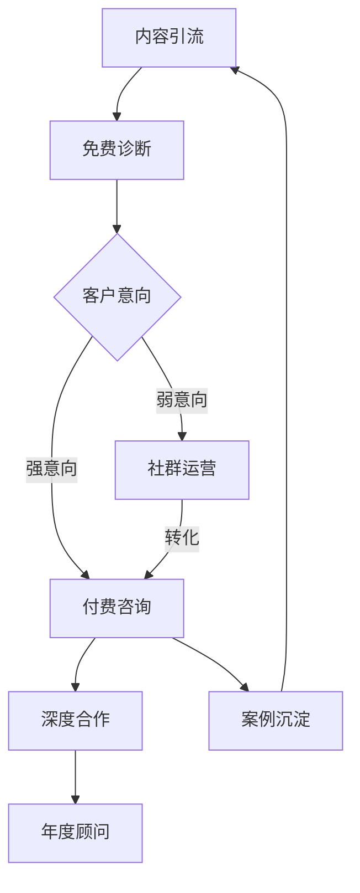

## 案例五：从富人思维到实际财富——李总的创业故事

### 一、案例背景

#### 1.1 人物画像

李明远，34岁，二线城市（成都）某中型制造企业的中层管理者，机械工程专业本科毕业，工作12年。在接触富人思维之前，他的财务状况和心理状态是典型的"高收入穷人"：

| 维度 | 具体情况 |
|------|----------|
| 月收入 | 税后18,000元（含年终奖均摊） |
| 月支出 | 16,500元（房贷6,200、车贷2,800、生活开销4,500、孩子教育2,000、其他1,000） |
| 月结余 | 1,500元 |
| 存款 | 8万元（6年积蓄） |
| 负债 | 房贷余额85万、车贷余额4.2万 |
| 投资 | 几乎为零，偶尔买点余额宝 |
| 心理状态 | 焦虑、疲惫、觉得"这辈子就这样了" |

#### 1.2 触发事件

2023年3月，公司裁员20%，李明远虽然保住了职位，但亲眼看着几位同事——包括一位工作了15年的老员工——被辞退。那天晚上他失眠了，脑子里反复回响一个念头：**"如果被裁的是我，我的存款撑不过3个月。"**

这个恐惧成为他心理转变的起点。他开始系统性地学习财务知识和富人思维模式，用6个月时间完成了从"穷人思维"到"富人思维"的认知升级，并在接下来的18个月内将月收入从18,000元提升到62,000元，实现了真正的财富起步。

### 二、思维转变：从穷人脚本到富人脚本

#### 2.1 识别旧有金钱脚本

李明远在学习金钱脚本理论后，识别出自己从小形成的三个核心限制性信念：

**脚本一："钱是省出来的"**
- 来源：父母从小教育"省一分就是赚一分"
- 表现：对每一笔支出都精打细算，但从不思考如何增加收入
- 代价：把大量精力花在砍价、凑满减、比价上，忽略了提升自身价值

**脚本二："稳定压倒一切"**
- 来源：父亲在国企工作一辈子，母亲反复强调"铁饭碗"
- 表现：不敢跳槽、不敢创业、不敢尝试任何有风险的收入方式
- 代价：12年工资涨幅跑不赢通胀，个人市场价值被严重低估

**脚本三："有钱人都不干净"**
- 来源：亲戚中有人做生意失败，家人常议论"为钱不值得"
- 表现：潜意识里排斥赚钱，觉得谈钱庸俗
- 代价：主动回避一切商业机会，甚至拒绝了两次朋友的合伙邀请

#### 2.2 新旧思维对照

李明远用了整整一个月时间，把自己所有的金钱信念写下来，逐条分析、逐条替换：

| 维度 | 旧思维（穷人脚本） | 新思维（富人脚本） | 转变方法 |
|------|-------------------|-------------------|----------|
| 收入观 | 靠工资，一份工作干到老 | 多元化收入，主动构建资产 | 计算时薪，识别可产品化的技能 |
| 支出观 | 省钱就是赚钱 | 花钱买时间，投资自己 | 区分消费、投资、浪费三类支出 |
| 风险观 | 追求100%确定性 | 管理风险而非逃避风险 | 学习概率思维，做期望值计算 |
| 时间观 | 用时间换钱 | 用钱买时间，用时间换资产 | 建立被动收入流 |
| 学习观 | 学历=能力=收入 | 持续学习，市场验证能力 | 每月投入收入的5%学习 |
| 社交观 | 社交是浪费时间 | 社交是资源杠杆 | 有目的地构建弱关系网络 |

#### 2.3 思维转变的关键工具

李明远使用了三个具体的心理工具来巩固新思维：

**工具一：财务日记**

每天花10分钟记录当天的财务决策和背后的思维模式。格式如下：

```markdown
## 日期：2023-05-15
### 今日财务决策
- 决策：花299元买了一门Excel高级课程
- 旧思维反应：又花钱了，网上免费教程不是一样吗？
- 新思维分析：这是投资不是消费。掌握高级Excel能提升工作效率，
  如果能因此升职或接外部项目，回报率远超299元。
- 情绪变化：焦虑 → 平静 → 期待
```

**工具二：机会成本计算器**

每次做重大财务决策前，用一个简单公式计算机会成本：

> 如果这笔钱以年化8%投资，10年后值多少？

| 今日支出 | 10年后价值（年化8%） | 换算 |
|----------|---------------------|------|
| 300元（一顿大餐） | 648元 | 两顿大餐 |
| 3,000元（一件衣服） | 6,480元 | 一套衣服 |
| 30,000元（一次旅行） | 64,800元 | 两次旅行+一笔投资 |

这个工具不是让人不花钱，而是让人**有意识地**花钱——知道每一笔消费的真实代价。

**工具三：身份锚定法**

每天早上用2分钟对自己说："我是一个会赚钱、会投资、会让钱为我工作的人。"这个方法来自认知行为疗法（CBT）中的"身份认同重塑"技术。心理学研究表明，当一个人认同某个身份时，行为会自动向身份靠拢——这就是所谓的"身份-行为一致性"效应。

### 三、创业执行：从思维到行动的完整路径

#### 3.1 机会识别：找到自己的"杠杆点"

李明远没有盲目辞职创业，而是用了"副业测试法"——在保住主业的同时，用业余时间验证商业想法。

**第一步：技能盘点**

他列出自己所有的技能，按"市场需求×个人擅长×利润率"三个维度打分：

| 技能 | 市场需求（1-10） | 个人擅长（1-10） | 利润率（1-10） | 综合得分 |
|------|-----------------|-----------------|---------------|----------|
| 机械制图 | 7 | 9 | 5 | 315 |
| 生产管理咨询 | 8 | 8 | 8 | 512 ✓ |
| Excel数据分析 | 6 | 7 | 4 | 168 |
| 摄影 | 5 | 5 | 6 | 150 |
| 写作 | 4 | 4 | 5 | 80 |

**第二步：市场需求验证**

他选择"生产管理咨询"作为方向后，没有立刻投入，而是做了三周的市场调研：

1. 在知乎、小红书搜索"生产管理""精益生产""工厂管理"等关键词，发现大量中小工厂老板在寻求管理优化方案
2. 在淘宝搜索"生产管理咨询"，发现单价从5,000到50,000不等，且销量不错
3. 找了5个目标客户（通过朋友介绍的工厂老板）做免费访谈，确认需求真实存在

**第三步：最小可行产品（MVP）**

他没有一开始就搭建完整服务体系，而是用最低成本测试：

- 第一个月：在知乎写5篇关于生产管理的深度文章（每篇3,000字+），展示专业能力
- 第二个月：文章获得总计2,000+赞，有8个人私信咨询
- 第三个月：为其中2个客户做免费诊断报告（每人2小时），换取推荐和案例授权

#### 3.2 商业模式设计

经过三个月的测试，李明远确定了自己的商业模式：



**收入结构设计（目标：三重收入流）：**

| 收入流 | 描述 | 定价 | 月目标 |
|--------|------|------|--------|
| 咨询项目 | 3-6个月的工厂管理优化项目 | 15,000-30,000元/项目 | 1-2个项目 |
| 线上课程 | 录制的系统化课程 | 999元/人 | 20-30人 |
| 年度顾问 | 长期跟踪服务 | 5,000元/月 | 3-5个客户 |

#### 3.3 关键执行节点与时间线

| 阶段 | 时间 | 关键动作 | 结果 | 心理挑战 |
|------|------|----------|------|----------|
| 测试期 | 第1-3月 | 写内容、做免费案例 | 2个免费案例，积累素材 | "免费干活值不值？"——穷人思维的抗拒 |
| 启动期 | 第4-6月 | 签下第一个付费客户 | 项目收入15,000元 | "我能收这么多钱吗？"——定价恐惧 |
| 增长期 | 第7-12月 | 内容矩阵扩展、课程上线 | 月均收入35,000元 | "要不要辞职？"——安全感思维的拉扯 |
| 稳定期 | 第13-18月 | 团队化、标准化 | 月均收入62,000元 | "如何管理团队？"——新能力的挑战 |

#### 3.4 从"时间换钱"到"钱买时间"的实操

这是李明远思维转变中最关键的一环。他计算了自己的时薪：

> 主业时薪：18,000 ÷ 22天 ÷ 8小时 = 102元/小时
> 副业时薪（初期）：15,000 ÷ 40小时 = 375元/小时

当副业时薪超过主业时薪后，他开始有策略地"购买时间"：

| 外包项目 | 月成本 | 节省时间 | 时间用于 | ROI |
|----------|--------|----------|----------|-----|
| 家政保洁 | 600元 | 4小时/月 | 客户方案撰写 | 极高 |
| 视频剪辑 | 1,200元 | 8小时/月 | 课程内容创作 | 高 |
| 行政助理（兼职） | 2,000元 | 12小时/月 | 高价值客户沟通 | 高 |
| 会计代账 | 500元 | 3小时/月 | 业务拓展 | 中 |

总外包成本：4,300元/月，释放27小时——这些时间创造的价值远超4,300元。

### 四、成果数据

#### 4.1 财务数据对比

| 指标 | 创业前 | 6个月后 | 12个月后 | 18个月后 |
|------|--------|---------|----------|----------|
| 月总收入 | 18,000元 | 28,000元 | 45,000元 | 62,000元 |
| 主业收入 | 18,000元 | 18,000元 | 18,000元 | 18,000元 |
| 副业/创业收入 | 0元 | 10,000元 | 27,000元 | 44,000元 |
| 月支出 | 16,500元 | 17,800元 | 19,500元 | 21,000元 |
| 月结余 | 1,500元 | 10,200元 | 25,500元 | 41,000元 |
| 储蓄率 | 8.3% | 36.4% | 56.7% | 66.1% |
| 存款总额 | 80,000元 | 141,200元 | 347,200元 | 785,200元 |
| 被动收入占比 | 0% | 0% | 12% | 28% |

#### 4.2 资产结构变化

| 资产类别 | 创业前 | 18个月后 | 变化 |
|----------|--------|----------|------|
| 现金/存款 | 80,000元 | 285,200元 | +256.5% |
| 投资理财 | 0元 | 300,000元 | 从零到30万 |
| 副业/业务估值 | 0元 | 200,000元 | 品牌+客户资产 |
| 房产净值 | 不变 | 不变 | 继续还贷 |
| 负债总额 | 892,000元 | 820,000元 | -8.1% |
| 净资产 | -812,000元 | -34,800元 | 接近转正 |

#### 4.3 非财务成果

- **时间自由度**：从完全绑定主业到每周有15小时自主支配
- **能力成长**：掌握了咨询、营销、内容创作、团队管理四项新技能
- **社交圈层**：从同事圈子扩展到创业者、投资人、行业专家圈
- **心理状态**：从焦虑恐惧到"知道自己能赚钱"的确定感
- **家庭关系**：经济压力减少后，与配偶的争吵频率下降70%

### 五、关键决策点复盘

#### 5.1 决策一：是否辞职全职创业？

**情境**：第8个月，副业月收入已达25,000元，超过主业。朋友劝他辞职。

**李明远的思考框架：**

```text
辞职条件检查清单：
□ 副业收入连续6个月超过主业 → 否（才2个月）
□ 存款能覆盖12个月家庭开支 → 否（只有6个月）
□ 副业收入来源已多元化 → 否（80%来自一个大客户）
□ 家人支持 → 妻子有顾虑
□ 社保/公积金有替代方案 → 未研究

结论：不辞职，继续双轨运行
```

**结果**：第14个月时，那个大客户果然因为预算削减暂停了合作。如果当时辞了职，将面临巨大财务压力。而因为保住了主业，他有缓冲时间拓展新客户。

**教训**：富人思维不是"all in"，而是**在风险可控的前提下大胆行动**。

#### 5.2 决策二：是否涨价？

**情境**：第10个月，咨询需求增加，但时间有限。面临两个选择：
- A：维持现价，接受更多客户（忙碌但收入线性增长）
- B：涨价50%，筛选高质量客户（可能丢掉一些客户）

**李明远用富人思维分析：**

| 分析维度 | 选项A（不涨价） | 选项B（涨价50%） |
|----------|----------------|-----------------|
| 月收入 | 30,000元（3个项目×10,000） | 37,500元（2.5个项目×15,000） |
| 工作量 | 满负荷 | 降低40% |
| 客户质量 | 参差不齐 | 筛选出高净值客户 |
| 品牌定位 | 中低端 | 中高端 |
| 空闲时间 | 几乎没有 | 用于课程开发和内容创作 |

**选择**：B——涨价50%。

**结果**：涨价后确实丢了40%的咨询客户，但剩下客户的项目质量更高、配合度更好、付款更爽快。更重要的是，空出来的时间用于开发线上课程，课程收入在3个月内从0增长到月均8,000元。

**教训**：穷人思维用"忙碌"衡量价值，富人思维用"每小时产出"衡量价值。

#### 5.3 决策三：第一个员工该不该招？

**情境**：第15个月，业务量增加到需要帮手。招一个兼职助理月成本3,500元。

**旧思维反应**："3,500块我能做很多事了，为什么要给别人？"

**新思维分析**：

> 我的时薪已经到了500元/小时（月收入60,000 ÷ 120小时）。
> 助理做的事情，市场时薪约50元/小时。
> 如果我花7小时做助理的活，我"浪费"了3,150元的机会成本（7×500-7×50=3,150）。
> 而雇助理只要3,500元/月，我不但没亏，还释放了7小时做高价值工作。

**结果**：招了兼职助理后，李明远把时间集中在课程开发和高价值客户上，月收入在两个月内从55,000元提升到62,000元。

### 六、心理转变的深层机制

#### 6.1 从"恐惧驱动"到"目标驱动"

创业初期，李明远的驱动力是恐惧——"怕被裁员""怕没钱"。但恐惧驱动有两个致命缺陷：

1. **决策短视**：为了快速赚钱，会接低价项目、牺牲长期价值
2. **情绪消耗**：长期处于焦虑状态，容易倦怠

他在第6个月做了一次心理调整，把驱动力从恐惧切换为目标：

| 驱动力 | 恐惧驱动 | 目标驱动 |
|--------|----------|----------|
| 核心问题 | "如果失败了怎么办？" | "成功了会怎样？" |
| 决策模式 | 避免损失 | 追求收益 |
| 情绪状态 | 焦虑、防御 | 兴奋、进取 |
| 行为特征 | 谨慎、保守 | 大胆、创新 |

**切换方法**：每天花5分钟可视化成功场景——不是空想，而是具体到"如果月入6万，我会怎么安排这一天？"这种细节层面的想象。

#### 6.2 "足够"的心理阈值

李明远发现一个有趣的现象：当月收入突破40,000元后，焦虑感并没有消失，反而增加了——因为他开始和月入10万的同行比较。

他通过学习"享乐适应"（Hedonic Adaptation）理论意识到：**人的幸福感不会随着收入持续增长，而是会适应新的水平。** 他建立了一个"足够清单"：

```markdown
## 我的"足够"标准
- 月收入覆盖家庭开支的3倍 → 63,000元 ✓（接近）
- 存款覆盖12个月开支 → 252,000元 ✓（已达成）
- 每周有20小时自主时间 → 还差5小时
- 孩子教育基金存满50万 → 进行中
- 每年带家人旅行2次 → 已实现
```

这个清单帮助他在追求更多和享受当下之间找到了平衡。

### 七、常见误区与避坑指南

#### 7.1 李明远踩过的坑

**坑一：内容创作的"完美主义陷阱"**

前三个月，他花了大量时间打磨文章的措辞和排版，导致更新频率很低（每月1-2篇）。后来他意识到，在内容创业领域，**持续输出比完美输出更重要**。他把标准从"完美"降到"80分以上"，更新频率提升到每周2篇，流量反而增长了3倍。

**坑二：定价的心理障碍**

第一个客户报价时，他原本想收8,000元，但开口时变成了5,000元。客户二话没说就答应了——这意味着他至少少赚了3,000元。后来他学了一个方法：**永远先报一个让自己"有点不好意思"的价格**，因为那个价格通常才是合理的市场价。

**坑三：忽视现金流管理**

第7个月，一个大项目尾款迟迟不到（客户拖延付款），而他已经预支了成本。那个月他不得不从存款中借钱周转。之后他建立了两条规则：
- 项目启动前收取40%预付款
- 保持至少3个月运营成本的现金储备

**坑四：社交中的"穷人思维"**

创业初期，他拒绝参加付费的行业社群（"为什么要花钱社交？"）。后来加入了一个年费3,000元的社群，第一个月就通过群里的推荐签下了一个15,000元的项目。他算了一笔账：**3,000元的社交投资，带来了15,000元的回报，ROI 400%。**

#### 7.2 富人思维创业的常见陷阱

| 陷阱 | 表现 | 纠正方法 |
|------|------|----------|
| 混淆"富人思维"和"投机取巧" | 追求一夜暴富，忽视基本功 | 富人思维的核心是长期主义，不是走捷径 |
| 过度乐观 | 低估困难，高估收入 | 用最悲观的假设做财务规划 |
| 忽视风险管理 | all in创业，不留退路 | 始终保持6个月以上的安全垫 |
| 把"花钱"等同于"投资" | 买各种课程但从不执行 | 投资必须有明确的回报预期和执行计划 |
| 社交攀比 | 为了"圈层"买超出能力的东西 | 社交的价值在于信息和机会，不在于消费 |

### 八、可复制的行动框架

李明远的经验可以提炼为一个五步框架，供其他想从"思维"走向"财富"的人参考：

#### 步骤一：财务体检（第1周）

```markdown
1. 列出所有资产和负债，计算净资产
2. 记录过去3个月的所有支出，分类统计
3. 计算：储蓄率 = (收入-支出) / 收入
4. 计算：财务安全月数 = 存款 / 月支出
5. 识别：哪些支出是消费？哪些是投资？哪些是浪费？
```

#### 步骤二：思维审计（第2-3周）

```markdown
1. 写下你关于金钱的所有信念（至少20条）
2. 对每条信念标注来源（父母/社会/经历/媒体）
3. 评估每条信念是"助力"还是"限制"
4. 为每条限制性信念写一个替代版本
5. 每天早上阅读你的新信念清单（至少21天）
```

#### 步骤三：技能变现评估（第4-5周）

```markdown
1. 列出你所有的技能（工作技能+业余技能+生活技能）
2. 按"市场需求×个人擅长×利润率"打分排序
3. 选择得分最高的1-2个方向
4. 在目标平台上搜索同类服务，了解定价和竞争
5. 找3-5个目标用户做免费访谈，验证需求
```

#### 步骤四：MVP测试（第2-4个月）

```markdown
1. 用最低成本做出你的第一个"产品"（文章/课程/服务样本）
2. 在1-2个平台上发布，观察反馈
3. 用免费或低价获取第一批用户，换取反馈和口碑
4. 根据反馈迭代产品
5. 当有3个以上付费用户时，进入下一步
```

#### 步骤五：规模化与系统化（第5个月起）

```markdown
1. 标准化你的服务流程，建立SOP
2. 逐步提价，筛选高价值客户
3. 用"收入-投资-时间"三角模型分配资源
4. 把重复性工作外包，聚焦高价值活动
5. 建立被动收入流（课程/产品/投资）
```

### 九、李明远的未来规划

截至案例记录时（创业第18个月），李明远的下一步计划是：

1. **短期（3个月）**：上线第二门课程，目标月课程收入突破15,000元
2. **中期（6个月）**：组建3人小团队，将咨询业务标准化，目标月收入突破100,000元
3. **长期（2年）**：实现"财务自由第一阶段"——被动收入覆盖基本生活开支

他的最终目标不是成为亿万富翁，而是**拥有对自己时间的完全掌控权**——这正是富人思维的核心：**钱是工具，自由才是目的。**

### 十、本案例核心启示

1. **思维转变是起点，行动才是关键**：李明远花了一个月转变思维，但真正的改变来自接下来18个月的持续行动
2. **副业创业比辞职创业更安全**：在有主业收入保障的情况下测试商业想法，失败的代价最小
3. **富人思维不是"敢花钱"，而是"会花钱"**：每一笔支出都要问"这是消费、投资还是浪费？"
4. **定价恐惧是最大的收入杀手**：大多数人低估自己的市场价值，解决方案是"先报让自己不好意思的价格"
5. **被动收入需要主动建设**：课程、投资组合、品牌资产——这些都不是天上掉下来的，需要前期投入大量时间和精力
6. **"足够"比"更多"更重要**：没有"足够"标准的人，永远在追逐下一个数字，永远不会满足
