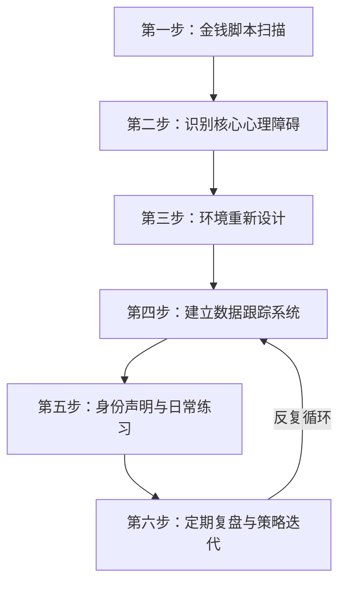

## 案例总结：从五个真实故事中提炼搞钱心理学的核心规律

前面五个案例分别从消费心理、投资心理、金钱脚本、延迟满足、富人思维五个维度，展示了普通人如何通过心理层面的转变实现财务状况的实质改善。本节将这些案例横向打通，提炼出贯穿所有成功转变的底层规律，帮你建立一套可迁移、可复制的搞钱心理学行动框架。

---

### 五个案例的核心线索回顾

| 案例 | 人物 | 核心心理问题 | 关键转变 | 核心成果 |
|------|------|-------------|---------|---------|
| 案例一 | 小林 | 消费成瘾、即时满足驱动 | 从"想要就买"到"72小时冷静期+需求分层" | 年存20万，消费支出降低40% |
| 案例二 | 老王 | 损失厌恶+处置效应+从众心理 | 从"追涨杀跌"到"纪律化投资系统" | 年化收益从-15%扭转为+12% |
| 案例三 | 张女士 | "钱是万恶之源"的金钱脚本 | 从"回避金钱话题"到"主动管理财务" | 家庭净资产3年增长180% |
| 案例四 | 小陈 | 缺乏延迟满足能力 | 从"月光"到"先储蓄后消费"的习惯系统 | 大学四年存款8万，毕业即有创业启动金 |
| 案例五 | 李总 | 穷人思维（时间换钱、单打独斗） | 从"打工思维"到"系统思维+杠杆思维" | 公司年营收500万，个人被动收入占比35% |

五个案例看似讲述不同的故事，但剥开表层，它们遵循同一条底层逻辑链：

**觉察 → 理解 → 重构 → 行动 → 固化**


---

### 跨案例的六大核心规律

#### 规律一：心理问题永远先于财务问题

五个案例的主人公在改变之前，都曾反复尝试过"技术层面"的解决方案——记账、选基金、找副业项目——但无一例外地失败了。直到他们直面心理层面的问题，改变才真正发生。

| 人物 | 曾经的技术尝试 | 为什么失败 | 心理层面的真正障碍 |
|------|--------------|-----------|------------------|
| 小林 | 记账App、预算表 | 坚持不到两周就放弃 | 消费是情绪调节手段，不解决情绪问题就无法控制消费 |
| 老王 | 学习K线、看研报 | 学得越多亏得越多 | 损失厌恶让理性分析在关键时刻失效 |
| 张女士 | 理财课程、记账 | 从内心抗拒管理金钱 | "钱是万恶之源"的脚本让她无意识地推开财富 |
| 小陈 | 多次制定储蓄计划 | 每次都因"犒劳自己"破功 | 从未建立过延迟满足的心理肌肉 |
| 李总 | 多次跳槽涨薪 | 收入增长但永远不够用 | 用时间换钱的思维天花板决定了收入上限 |

这个规律的核心启示是：**如果你在财务上反复失败，不要继续寻找更好的方法，而要先审视自己的心理模式。** 方法论层面的问题通常是心理问题的投射。

#### 规律二：金钱脚本是所有财务行为的底层代码

案例三的张女士最直观地展示了金钱脚本的威力——一句"钱是万恶之源"让她在长达20年的时间里无意识地回避一切与财富增长相关的机会。但这个规律在其他案例中同样存在：

- **小林的隐性脚本**："花钱让我感觉被爱"——源于童年父母用物质补偿陪伴缺失
- **老王的隐性脚本**："股市是赌场"——源于父亲在股市中亏损的创伤记忆
- **小陈的隐性脚本**："年轻人就该享受当下"——源于社交媒体和同辈压力的内化
- **李总的隐性脚本**："只有辛苦工作赚来的钱才干净"——源于母亲"勤劳致富"的单一叙事

金钱脚本的特征是：**你通常意识不到它的存在，但它在每一次财务决策中都在后台运行。** 就像操作系统的底层代码决定了上层应用的行为边界一样，金钱脚本决定了你在财务上的"天花板"。

识别自己的金钱脚本，有一个简单但有效的方法——完成以下句子：

> "有钱人都是______"
> "钱多了就会______"
> "我家从来没有人______过钱"
> "谈到钱我就感觉______"

你脑海中自动浮现的答案，就是你的核心金钱脚本。

#### 规律三：环境设计比意志力可靠一百倍

五个案例中，没有任何一个人是靠"咬牙坚持"成功的。他们的共同策略是：**改变环境，让正确的行为变容易，让错误的行为变困难。**

| 人物 | 环境设计策略 | 具体做法 |
|------|------------|---------|
| 小林 | 消费摩擦增加 | 卸载购物App、取消免密支付、设置信用卡额度上限 |
| 老王 | 交易摩擦增加 | 设置冷静期（想卖必须等48小时）、禁用手机交易端 |
| 张女士 | 信息环境重构 | 加入女性理财社群、关注财务自由主题播客、每周与丈夫做财务对话 |
| 小陈 | 储蓄自动化 | 工资到账当天自动转出40%、设置"取现需跑银行"的心理门槛 |
| 李总 | 社交圈层升级 | 参加创业社群、结识有系统思维的合伙人、远离抱怨型朋友 |

这背后的科学原理来自行为经济学家理查德·塞勒（Richard Thaler）的"助推理论"（Nudge Theory）：人类的自控力是有限资源，与其不断消耗意志力去抵抗诱惑，不如重新设计选择架构，让默认选项就是最优选项。

**实操建议——你的"环境审计清单"：**

1. **物理环境**：你的钱包、手机、电脑里有哪些"诱惑触发器"？（购物App推送、信用卡账单日设置、投资软件的实时行情提醒）
2. **社交环境**：你最常交流的5个人中，有多少人的消费/投资习惯是你不想模仿的？
3. **信息环境**：你每天接触的信息中，有多少在刺激你的消费欲望或投资冲动？
4. **时间环境**：你最容易冲动消费或冲动交易的时间段是什么？那个时间段你通常在做什么？

逐一审查并修改这些环境因素，效果远超任何"我要控制自己"的决心。

#### 规律四：身份认同的改变是持久改变的根基

五个案例中，所有人在成功转变后都经历了身份层面的重塑——他们不只是"做了不同的事"，而是"成为了不同的人"。

- 小林不再说"我存不下钱"，而是说"我是一个有财务纪律的人"
- 老王不再说"我运气不好"，而是说"我是一个系统化投资者"
- 张女士不再说"我不擅长管钱"，而是说"我是一个有能力管理家庭财务的人"
- 小陈不再说"年轻人穷是正常的"，而是说"我是一个为未来负责的人"
- 李总不再说"我就是一个打工的"，而是说"我是一个商业系统的构建者"

心理学家詹姆斯·克利尔（James Clear）在《原子习惯》中提出的"身份驱动习惯"理论完美解释了这一现象：**你不是在追求某个结果，你是在成为某种人。** 当你把目标从"我要存20万"转变为"我是一个会管理金钱的人"时，每一个具体的储蓄行为都变成了对你新身份的"投票"。

具体操作方法——**身份声明练习**：

1. 写下你想成为的那种人的3个特征（例如："我是一个理性消费、主动投资、持续增长财富的人"）
2. 每天早上对着镜子朗读一遍
3. 每次做财务决策时问自己："一个理性管理金钱的人，在这种情况下会怎么做？"
4. 记录每一个符合新身份的行为，无论多小（这叫"身份投票"）

坚持30天，你会发现自己做决策的底层逻辑已经发生了变化。

#### 规律五：数据反馈是心理转变的加速器

五个案例的主人公都不是"凭感觉"转变的——他们都建立了某种形式的数据跟踪系统，用客观数据来对抗内心的非理性声音。

| 人物 | 跟踪指标 | 数据如何帮助了他们 |
|------|---------|------------------|
| 小林 | 月度储蓄率、消费分类占比 | 当冲动消费的想法出现时，看一眼储蓄进度条就能忍住 |
| 老王 | 交易频率、持仓时间、情绪日志 | 发现自己80%的亏损都发生在情绪激动时的交易中 |
| 张女士 | 家庭净资产季度变化 | 看到数字增长带来的安全感远超"回避"带来的虚假平静 |
| 小陈 | 每周存款金额、"忍住没买"的累计金额 | 将延迟满足的抽象概念转化为可视化的成就感 |
| 李总 | 被动收入占比、系统运转效率 | 看到"不靠自己也能赚钱"的数字在持续增长 |

数据的价值不在于精确——**它是一面镜子，让你看到真实的自己，而非想象中的自己。** 心理学中的"邓宁-克鲁格效应"表明，人类普遍高估自己的能力和控制力。数据是打破这种幻觉的最有效工具。

**建议建立的三张核心数据表：**

**表1：月度财务健康仪表盘**

| 指标 | 本月 | 上月 | 变化 | 目标 |
|------|------|------|------|------|
| 总收入 | | | | |
| 总支出 | | | | |
| 储蓄率 | | | | ≥30% |
| 非必要支出占比 | | | | ≤20% |
| 投资收益 | | | | |
| 被动收入占比 | | | | |

**表2：消费心理日志**（每次大额消费前填写）

| 字段 | 内容 |
|------|------|
| 想买什么 | |
| 当下的情绪状态 | |
| 是"需要"还是"想要" | |
| 24小时后还想买吗 | |
| 这笔钱如果投资5年后值多少 | |

**表3：投资心理日志**（每次交易前后填写）

| 字段 | 内容 |
|------|------|
| 交易标的 | |
| 买入/卖出理由 | |
| 当时的情绪状态（1-10） | |
| 是否符合投资纪律 | |
| 一周后的反思 | |

#### 规律六：转变是一个非线性过程，反复是正常的

五个案例中，没有一个人的转变是一帆风顺的。小林在第三个月"破功"了一次大额消费，老王在第五个月又犯了一次追涨杀跌的错误，张女士在面对母亲的否定时一度想放弃管钱，小陈在室友的嘲笑中动摇过，李总在第一次创业失败后差点回到打工模式。

但他们最终都成功了，区别在于：**他们把"失败"重新定义为"数据"，而不是"放弃的理由"。**

```mermaid
graph TD
    A[开始改变] --> B[初期动力十足]
    B --> C[遇到第一次挫折]
    C --> D{如何解读挫折?}
    D -->|解读为"我不行"| E[放弃，回到旧模式]
    D -->|解读为"这是数据"| F[分析原因，调整策略]
    F --> G[继续前进]
    G --> H[遇到更多挫折]
    H --> I[每次调整都更精准]
    I --> J[新模式逐渐固化]
    J --> K[真正的转变完成]
```

心理学家卡罗尔·德韦克（Carol Dweck）的"成长型思维"理论在这里至关重要：**拥有成长型思维的人把失败视为学习的机会，而非能力的证明。** 在搞钱这件事上，每一次"没忍住"的消费、每一次"又犯了"的投资错误，都是你在训练新心理模式过程中必经的"练习回合"。

**实用策略——"复盘而非自责"三步法：**

1. **事实描述**：发生了什么？（"我在周三晚上花了3000元买了一双不需要的鞋"）
2. **归因分析**：触发因素是什么？（"那天工作压力很大，我在商场闲逛时经过了鞋店"）
3. **策略调整**：下次如何预防？（"压力大时不去商场，改为去公园散步或运动"）

永远不要问"我怎么又失败了"，而要问"这次失败告诉了我什么信息"。

---

### 五个案例的共同行动框架

将以上六条规律整合，我们得到一个适用于任何人的搞钱心理学行动框架：



**第一步：金钱脚本扫描**（第1周）

完成金钱脚本测试问卷，写完四个填空句子，与信任的人讨论你的金钱故事。目标不是立刻改变，而是"看见"。

**第二步：识别核心心理障碍**（第2周）

回顾过去一年你最后悔的3个财务决策，分析每个决策背后的心理因素。是恐惧？贪婪？从众？自卑？将最突出的1-2个心理偏差标记为你的"重点攻克目标"。

**第三步：环境重新设计**（第3周）

完成环境审计清单，执行至少3项环境改变。重点是增加"坏行为"的摩擦，减少"好行为"的阻力。

**第四步：建立数据跟踪系统**（第4周）

搭建三张核心数据表，坚持每天花5分钟填写。数据不需要完美，持续记录本身就是一种心理训练。

**第五步：身份声明与日常练习**（第5周起持续）

写下身份声明，每天朗读。在每个财务决策节点使用"身份投票"问题。记录所有符合新身份的行为。

**第六步：定期复盘与策略迭代**（每月一次）

每月末做一次全面复盘：数据趋势如何？哪些策略有效？哪些需要调整？哪些心理陷阱又出现了？用"复盘而非自责"三步法处理每一个挫折。

---

### 不同人群的重点策略对照

不同的人面临的核心心理障碍不同，行动的优先级也应有所差异：

| 你的情况 | 最可能的核心障碍 | 建议优先攻克的案例主题 | 预期转变周期 |
|---------|----------------|---------------------|------------|
| 月光族、存不下钱 | 即时满足偏好、消费作为情绪调节 | 案例一（消费心理逆转）+ 案例四（延迟满足） | 3-6个月 |
| 投资反复亏损 | 损失厌恶、处置效应、从众心理 | 案例二（投资心理校正） | 6-12个月 |
| 收入不错但总觉得不够 | 金钱脚本限制、安全感缺失 | 案例三（金钱脚本改写） | 6-18个月 |
| 想增加收入但总是原地踏步 | 穷人思维、时间换钱的模式锁定 | 案例五（富人思维→实际财富） | 12-24个月 |
| 以上都有 | 底层金钱脚本问题 | 从案例三开始，全面覆盖 | 18-36个月 |

注意：上表中的"预期转变周期"是指从开始行动到新模式基本固化的时间，不是指看到第一个成果的时间。事实上，大部分人在执行框架的第4-8周就能看到初步成果（比如第一笔储蓄、第一次控制住消费冲动），但要让新行为变成"不需要思考就自然发生"的习惯，需要更长的时间。

---

### 从案例到你：一份可直接使用的自检清单

在你开始自己的搞钱心理学旅程之前，用这份清单做一次全面自检：

**认知层自检**
- [ ] 我能清楚说出自己的3个核心金钱脚本
- [ ] 我知道自己最容易受到哪种心理偏差的影响
- [ ] 我理解"富人思维"和"穷人思维"的具体区别
- [ ] 我能区分"需要"和"想要"

**行为层自检**
- [ ] 我有一个可执行的消费控制方案（不仅仅是"少花钱"）
- [ ] 我有一套投资纪律规则，并且能遵守
- [ ] 我已经设置了自动储蓄/投资机制
- [ ] 我有定期复盘的习惯

**环境层自检**
- [ ] 我已经完成了环境审计并执行了至少3项改变
- [ ] 我的社交圈中有至少2个财务习惯良好的人
- [ ] 我的信息环境中消费诱惑已经大幅减少
- [ ] 我有支持我改变的"问责伙伴"或社群

**数据层自检**
- [ ] 我有月度财务健康仪表盘
- [ ] 我记录消费心理日志（至少对大额消费）
- [ ] 我能用数据而非感觉来评估自己的财务状况
- [ ] 我每月至少做一次数据复盘

**身份层自检**
- [ ] 我写下了自己的身份声明
- [ ] 我在做财务决策时会用"身份投票"问题
- [ ] 当别人问起我的财务习惯时，我会用新的身份来描述自己
- [ ] 我已经至少有过10次"符合新身份"的行为记录

每打一个勾，就代表你在搞钱心理学的旅程中前进了一步。如果某一项还没做到，回到上面的具体章节重新学习和练习。

---

### 最后的话：搞钱的本质是一场自我认知的修行

五个案例的主人公都不是天赋异禀的人。他们没有特殊的运气、没有显赫的背景、没有过人的智商。他们做到的事情，本质上只有三件：

1. **诚实地看见自己**——不回避自己的心理弱点，不用"我就是控制不住"来推卸责任
2. **系统地改变环境**——不依赖意志力这种稀缺资源，而是让环境替自己做正确的事
3. **耐心地等待复利**——不期待一夜之间的剧变，相信每天微小的正确选择会在时间的催化下产生惊人的结果

这三件事，每一件你都能做到。区别只在于——你是否愿意从今天开始。

