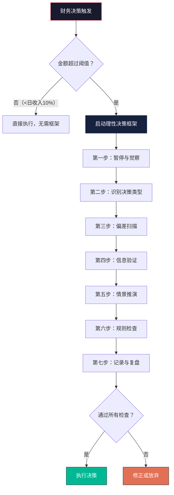
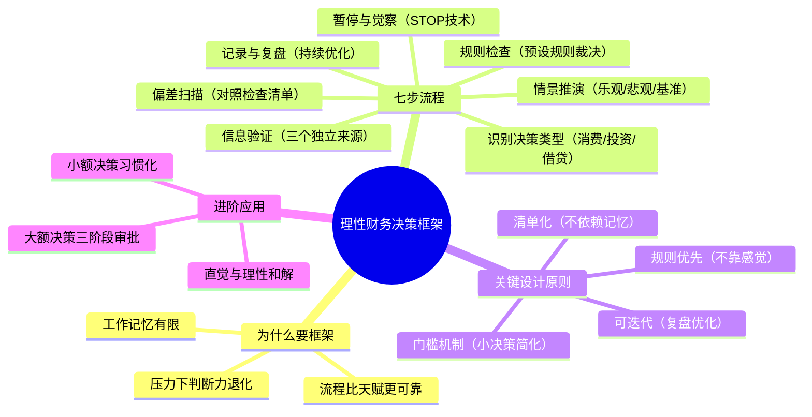

## 零、理性财务决策框架

### 0.1 为什么你需要一个"决策框架"而不是"正确答案"

在理论基础部分，我们认识了锚定效应、损失厌恶、处置效应、确认偏差、过度自信、羊群效应等十余种心理偏差。在后续章节中，我们会逐一学习针对消费陷阱、投资偏差的具体校正技巧。但这里存在一个根本性问题：**当你在做财务决策的当下，你不可能同时调用十几种校正技巧。**

认知心理学的研究表明，人类的工作记忆容量极为有限——心理学家乔治·米勒的经典论文标题就是《神奇的数字7±2》。你不可能在做一笔消费决策时同时检查锚定效应、损失厌恶、心理账户、情绪状态、沉没成本……等到你把所有偏差都想一遍，决策窗口早就关闭了。

这就是为什么你需要一个**结构化的决策框架**——一套固定的流程，把分散的心理校正技巧压缩成一个可重复执行的操作系统。就像飞行员在起飞前必须逐项检查清单，即使他们飞过上千次，也绝不跳过清单——因为人类的记忆和注意力不可靠，但流程可靠。

**本节的核心理念**：理性不是一种天赋，而是一种流程设计。你不需要变得更聪明、更冷静、更有自制力——你需要的是一个在你不够聪明、不够冷静、没有自制力时仍然能保护你的系统。



---

### 0.2 框架全景：七步理性决策流程

整个框架分为七个步骤，覆盖决策前、决策中、决策后三个阶段。下面是全景概览，后续逐一展开。

| 阶段 | 步骤 | 核心任务 | 对抗的主要偏差 | 耗时 |
|------|------|---------|--------------|------|
| 决策前 | ① 暂停与觉察 | 中断自动反应，觉察情绪状态 | 冲动决策、情绪消费 | 30秒-2分钟 |
| 决策前 | ② 识别决策类型 | 判断是消费、投资还是借贷决策 | — | 10秒 |
| 决策中 | ③ 偏差扫描 | 根据决策类型检查对应偏差清单 | 锚定、损失厌恶、从众等 | 2-5分钟 |
| 决策中 | ④ 信息验证 | 独立获取和验证关键信息 | 确认偏差、可得性偏差 | 5-30分钟 |
| 决策中 | ⑤ 情景推演 | 想象最佳、最差、最可能的结果 | 过度自信、乐观偏差 | 3-5分钟 |
| 决策后 | ⑥ 规则检查 | 对照预设规则做最终裁决 | 所有偏差的兜底防线 | 1分钟 |
| 决策后 | ⑦ 记录与复盘 | 记录决策过程，定期回顾 | 归因偏差、后见之明偏差 | 5分钟 |

**关键设计原则**：

1. **门槛机制**：不是每个决策都需要走完整框架。金额越小、可逆性越高，流程越简化
2. **清单化**：每一步都提供具体的检查清单，不需要你"记住"该检查什么
3. **规则优先**：最终决策不是靠"感觉对不对"，而是靠"符不符合预设规则"
4. **可迭代**：通过记录和复盘，框架本身会持续优化

---

### 0.3 第一步：暂停与觉察——中断自动驾驶

#### 0.3.1 为什么"暂停"是整个框架中最关键的一步

行为经济学家理查德·塞勒在《助推》一书中指出，人类有两种思维系统：系统1是快速、自动、情绪化的直觉反应；系统2是缓慢、刻意、理性的分析过程。绝大多数非理性财务决策都发生在系统1主导的瞬间——你还没来得及思考，手已经点下了"购买"按钮。

**暂停的神经科学原理**：前额叶皮层（负责理性决策的脑区）需要大约6-10秒才能完全"上线"。在情绪激动时（看到限时优惠、听到朋友暴富故事），杏仁核（负责情绪反应的脑区）会在几百毫秒内接管决策。一个简单的暂停动作——哪怕只是深呼吸三次——就足以让前额叶皮层重新获得控制权。

#### 0.3.2 暂停的具体操作：STOP技术

STOP技术是认知行为疗法中广泛使用的情绪管理工具，被改编后专门用于财务决策场景：

| 字母 | 步骤 | 具体操作 | 内部对话示例 |
|------|------|---------|------------|
| **S** | Stop（停） | 物理上停止动作。手离开鼠标/手机，站起来，离开当前环境 | "先不急，停下来" |
| **T** | Take a breath（呼吸） | 做3次深呼吸，每次吸气4秒、屏息4秒、呼气6秒 | （专注于呼吸） |
| **O** | Observe（观察） | 觉察自己当下的情绪、身体感受和冲动强度 | "我现在感到兴奋/焦虑/愤怒，身体有点紧绷，冲动强度大概7分（满分10分）" |
| **P** | Proceed mindfully（有意识地继续） | 在觉察的基础上，有意识地选择下一步行动 | "我选择启动决策框架来评估这个选择" |

#### 0.3.3 触发暂停的"红线信号"

以下任何一个信号出现时，你都应该立即启动STOP流程：

- **时间压力信号**："限时优惠"、"最后X件"、"今天截止"、"名额有限"
- **情绪异常信号**：心跳加速、手心出汗、感到兴奋或焦虑、坐立不安
- **社交压力信号**：朋友都在买、同事推荐、KOL种草、"大家都在赚"
- **金额异常信号**：消费金额超过日常水平的3倍，或者超过月收入的5%
- **频率异常信号**：今天已经做了3次以上的消费/投资决策

**实操建议**：在手机锁屏或电脑壁纸上设置一条提醒："金额超过200元？先STOP。"把外在提醒变成习惯触发器。

#### 0.3.4 情绪觉察：识别"决策污染源"

暂停之后，下一步是准确识别你当前的情绪状态。不同的情绪会导致不同方向的非理性决策：

| 情绪状态 | 常见的非理性决策方向 | 典型场景 |
|---------|-------------------|---------|
| 兴奋/乐观 | 低估风险，过度投入 | 听到暴富故事后all in某个投资 |
| 焦虑/恐惧 | 过度保守，错失机会；或者恐慌性抛售 | 市场大跌时清仓 |
| 愤怒/委屈 | 报复性消费，"犒劳自己" | 工作受挫后大额购物 |
| 嫉妒/攀比 | 超出能力的炫耀性消费 | 朋友买了新车后自己也要买 |
| 悲伤/孤独 | 情绪性消费，寻求即时快感 | 深夜独自刷购物APP |
| 自豪/得意 | 过度自信，忽视风险 | 连续几次投资成功后加大杠杆 |

**实操工具——情绪-决策记录表**：

每次做财务决策前（尤其是金额较大的），花30秒填写以下记录：

```text
日期：___________ 时间：___________
当前情绪：________（1-10分）
决策内容：________
情绪是否可能在影响这个决策？ □ 是 □ 否
如果是，影响方向是：________
我是否需要等情绪平复后再决定？ □ 是 □ 否
```

---

### 0.4 第二步：识别决策类型——不同决策需要不同的防御策略

财务决策可以分为三大类型，每种类型对应不同的心理陷阱组合，需要不同的防御策略：

#### 0.4.1 消费决策

**定义**：用金钱换取商品或服务，金钱流出。

**核心防御问题**：这笔消费是在创造长期价值，还是在购买短暂快感？

**高频陷阱组合**：
- 锚定效应（被"原价"影响）+ 损失厌恶（害怕错过优惠）→ 冲动购买
- 心理账户（"这是意外收入，可以随便花"）→ 预算失控
- 情绪消费（用购物缓解负面情绪）→ 非必要支出激增

**快速筛查清单**（全部回答后才能购买）：
1. 如果这件东西明天恢复原价，我还会买吗？
2. 如果这件东西没有人看得到（不能炫耀），我还会买吗？
3. 如果把这笔钱换成现金放在面前，我更想要现金还是这个东西？
4. 这笔钱如果不花，我可以怎么用？那个用途是否更有价值？
5. 一周后我会为这个决定感到高兴吗？一个月后呢？

#### 0.4.2 投资决策

**定义**：用金钱换取预期的未来回报，金钱形态转换但期望增值。

**核心防御问题**：我的判断是基于独立分析，还是基于情绪和从众？

**高频陷阱组合**：
- 过度自信（"我能预测市场"）+ 确认偏差（只看支持自己的信息）→ 高估收益
- 处置效应（赢小亏大）+ 沉没成本（不愿止损）→ 亏损扩大
- 羊群效应（跟风买入）+ 可得性偏差（被近期大涨吸引）→ 追高买入

**快速筛查清单**（全部回答后才能交易）：
1. 我能用一句话说清楚这笔投资的逻辑吗？
2. 如果我的朋友问我"为什么买这个"，我能给出3个独立理由吗？
3. 最坏情况是什么？我能承受吗？承受多久？
4. 我是从哪里得到这个投资信息的？信息来源是否多元？
5. 我有没有预设止损点和止盈点？

#### 0.4.3 借贷决策

**定义**：借入或借出金钱，涉及信用和杠杆。

**核心防御问题**：这笔借贷是在利用杠杆创造价值，还是在透支未来？

**高频陷阱组合**：
- 当下偏差（只看眼前需求，忽视未来还款压力）→ 过度负债
- 乐观偏差（"未来收入会增长"）→ 还款计划不切实际
- 社会比较（"别人都贷款买房/买车"）→ 盲目加杠杆

**快速筛查清单**（全部回答后才能借贷）：
1. 月还款额是否不超过月收入的30%？
2. 如果收入减少30%，我还能按时还款吗？
3. 这笔借贷产生的资产/价值，能否覆盖借贷成本？
4. 我有没有3-6个月的应急储备金来应对意外？
5. 借贷的真正原因是什么？是"需要"还是"想要"？

---

### 0.5 第三步：偏差扫描——对照检查清单

根据第二步识别的决策类型，使用对应的偏差扫描清单。这一步的核心思想是：**你不需要"记住"所有偏差，只需要按照清单逐项检查。**

#### 0.5.1 通用偏差扫描清单（适用于所有决策类型）

| # | 偏差名称 | 自检问题 | 如果答案为"是" |
|---|---------|---------|--------------|
| 1 | 锚定效应 | 我是否被某个初始数字（原价、别人的价格、历史价格）影响了判断？ | 忽略锚点，独立评估价值 |
| 2 | 损失厌恶 | 我是否因为害怕"失去"什么（优惠、机会、面子）而急于行动？ | 问自己"失去这个实际损失有多大" |
| 3 | 沉没成本 | 我是否因为已经投入了时间/金钱/精力而继续投入？ | 只看未来的收益和成本 |
| 4 | 确认偏差 | 我是否只关注了支持自己想法的信息？ | 主动搜索反面证据 |
| 5 | 过度自信 | 我是否认为自己比大多数人更了解这件事？ | 用数据验证，而不是用感觉 |
| 6 | 羊群效应 | 我是否因为"别人都在做"而做？ | 独立思考，即使与众人不同 |
| 7 | 可得性偏差 | 我是否因为最近频繁接触到某信息而高估其重要性？ | 查找基础概率和统计数据 |
| 8 | 现状偏差 | 我是否仅仅因为"一直这样做"而拒绝改变？ | 评估改变的实际收益和成本 |

#### 0.5.2 偏差扫描的"快速版"（适用于金额中等的决策）

如果决策金额不算特别大（比如日收入的10%-50%），可以使用快速版扫描，只检查最可能影响该决策类型的前三个偏差：

- **消费决策快速扫描**：锚定效应 → 情绪状态 → 24小时后还会买吗？
- **投资决策快速扫描**：确认偏差 → 从众心理 → 有止损计划吗？
- **借贷决策快速扫描**：乐观偏差 → 月还款比例 → 有应急储备吗？

---

### 0.6 第四步：信息验证——打破信息茧房

#### 0.6.1 为什么"做功课"比"凭感觉"重要十倍

诺贝尔经济学奖得主丹尼尔·卡尼曼在《思考，快与慢》中指出，人类有一个根深蒂固的倾向：**用"这个信息是否容易想到"来代替"这个信息是否正确"**（可得性启发式）。你在社交媒体上看到的"某人靠XX赚了100万"的帖子，因为生动、具体、容易记忆，会被大脑高估其代表性——但你没看到的是另外9999个亏了钱的人。

**信息验证的核心原则**：在做财务决策之前，至少要从三个独立来源验证关键信息。"三个独立来源"意味着不是同一篇文章被三个号转载，而是三个完全不同角度的信息。

#### 0.6.2 消费决策的信息验证清单

| 验证项目 | 具体操作 | 信息来源 |
|---------|---------|---------|
| 实际价值 | 同类产品的价格区间是多少？ | 比价网站、电商平台、二手市场 |
| 真实评价 | 已购买用户的体验如何？有没有系统性的差评？ | 购物平台评价（重点看中差评）、专业测评 |
| 替代方案 | 有没有更便宜或更合适的替代品？ | 搜索引擎、比价工具 |
| 价格走势 | 这个产品的历史价格是多少？是否真的在促销？ | 历史价格查询工具（如慢慢买、什么值得买） |
| 长期持有成本 | 维护、保养、耗材、升级的成本是多少？ | 产品说明书、用户论坛 |

#### 0.6.3 投资决策的信息验证清单

| 验证项目 | 具体操作 | 信息来源 |
|---------|---------|---------|
| 基本面数据 | 公司/资产的财务状况、盈利能力、增长趋势 | 年报、财报、行业研究报告 |
| 估值合理性 | 当前价格相对于内在价值是高估还是低估？ | 估值模型（PE/PB/DCF）、同行业对比 |
| 风险因素 | 有哪些可能的风险？宏观、行业、公司层面 | 分析师报告（重点看风险提示部分）、新闻 |
| 反面观点 | 看空的理由是什么？做空的逻辑是什么？ | 投资论坛的反对意见、做空报告 |
| 流动性 | 我能在需要时顺利卖出吗？ | 成交量、换手率、市场深度 |

#### 0.6.4 借贷决策的信息验证清单

| 验证项目 | 具体操作 | 信息来源 |
|---------|---------|---------|
| 真实利率 | 名义利率是多少？实际年化利率（IRR）是多少？ | 贷款计算器、银行客服 |
| 费用明细 | 除了利息，还有哪些费用（手续费、管理费、提前还款罚金）？ | 贷款合同（逐字阅读） |
| 对比方案 | 其他银行/平台的利率和条件是什么？ | 多家银行咨询、贷款比价平台 |
| 还款能力 | 我的收入稳定吗？如果收入下降30%还能还吗？ | 个人收支记录、行业就业数据 |

---

### 0.7 第五步：情景推演——想象三种未来

#### 0.7.1 为什么人类天生不擅长想象未来

心理学家丹尼尔·吉尔伯特在《撞上快乐》一书中揭示了一个令人不安的真相：**人类预测自己未来感受的能力极差。** 我们系统性地高估了好事带来的快乐（"买到这个我一定会很开心"），也系统性地高估了坏事带来的痛苦（"错过这个优惠我会后悔一辈子"）。

这种"情感预测偏差"在财务决策中特别危险——它让我们为了一个被高估的未来快感（买到新东西的兴奋），去承受一个被低估的未来痛苦（账单压力、投资亏损）。

#### 0.7.2 三种情景推演法

对每一笔重要决策，你需要推演三种情景：

**乐观情景（最好情况）**：
- 一切顺利时，最好的结果是什么？
- 这个结果出现的概率有多大？（通常我们高估了乐观情景的概率）
- 即使最好的结果出现，收益是否足以覆盖风险？

**悲观情景（最坏情况）**：
- 如果一切都往最坏的方向发展，最大的损失是什么？
- 这个损失我能否承受？会影响我的基本生活吗？
- 如果最坏情况发生，我的应对方案是什么？

**基准情景（最可能的情况）**：
- 抛开最好的和最坏的，最可能发生的结果是什么？
- 这个结果是否符合我的预期？
- 相比于不行动（维持现状），行动的净收益是否为正？

#### 0.7.3 情景推演模板

```text
决策内容：__________________________________________
日期：____________

【乐观情景】
最好结果：__________________________________________
实现概率：______%
净收益：__________元
这个结果足以让我觉得"值得冒险"吗？ □ 是 □ 否

【悲观情景】
最坏结果：__________________________________________
实现概率：______%
最大损失：__________元
我能承受这个损失吗？ □ 是 □ 否
如果不能承受，我的应对方案：__________________________

【基准情景】
最可能结果：__________________________________________
实现概率：______%
预期收益/损失：__________元
比不行动更优吗？ □ 是 □ 否

【最终判断】
三个情景综合考虑，这个决策值得执行吗？ □ 是 □ 否
```

---

### 0.8 第六步：规则检查——用预设规则替代临时判断

#### 0.8.1 为什么"规则"比"判断力"更可靠

这是整个框架中最反直觉但最重要的一步。大多数人认为，好的财务决策来自于"好的判断力"——在关键时刻做出正确选择的能力。但行为金融学的研究告诉我们，**判断力在压力下会系统性退化，而规则不会。**

投资大师霍华德·马克斯在《投资最重要的事》中写道："规则存在的意义，就是在你的判断力最差的时候保护你。"你不需要在市场恐慌时"保持冷静"——你需要的是一个在你恐慌时自动执行的止损规则。

**预设规则的核心特征**：
- 在冷静时制定，在冲动时执行
- 具体到没有歧义（"涨了就卖"不是规则，"盈利达到30%时卖出一半"是规则）
- 有强制执行机制（自动转账、提醒闹钟、第三方监督）

#### 0.8.2 你需要预设的五类财务规则

**规则一：消费规则**

```text
月消费总额上限：月收入的 _____%
单笔消费超过 _____ 元时，必须等待 _____ 小时才能购买
每月"自由消费"预算上限：_____ 元
以下类别不受预算限制：_______________（如：教育、健康）
以下类别完全禁止消费：_______________（如：借贷消费奢侈品）
```

**规则二：投资规则**

```text
单只资产占总资产比例上限：_____%
止损线：亏损 _____% 时强制卖出
止盈线：盈利 _____% 时卖出 _____%
每月最多交易 _____ 次
投资决策前必须等待 _____ 小时
只投资自己能说清楚逻辑的资产 □ 是
```

**规则三：借贷规则**

```text
月还款总额不超过月收入的 _____%（建议30%以下）
借贷用途仅限于：________________（如：自住房产、教育投资）
绝对不借贷用于：________________（如：消费、投机）
借贷前必须有的储备：_____ 个月应急资金
```

**规则四：储蓄规则**

```text
每月储蓄目标：收入的 _____%（建议先储蓄后消费）
储蓄自动化：发工资后第 _____ 天自动转入储蓄账户
储蓄用途分配：应急 _____% | 投资 _____% | 目标 _____%
```

**规则五：收入规则**

```text
副业/投资收入的 _____% 必须转入储蓄或投资账户
意外收入（奖金、退税等）的 _____% 必须储蓄
每年至少花 _____ 小时/_____ 元用于提升主业技能
```

#### 0.8.3 规则的执行机制

制定规则容易，执行规则难。以下是确保规则被执行的四种机制：

**机制一：自动化执行**
最可靠的执行方式是让机器替你执行。设置银行自动转账（发工资当天自动储蓄）、定投基金（每月固定日期自动买入）、信用卡自动还款。人类的意志力是有限资源，不要浪费在可以自动化的任务上。

**机制二：物理隔离**
把用于不同用途的钱放在不同的账户甚至不同的银行。日常消费账户只放当月预算，投资账户需要至少24小时才能转出。物理距离创造了心理距离，增加了冲动操作的摩擦成本。

**机制三：冷却期**
对所有超过阈值的决策设置强制冷却期。在冷却期内，你可以研究、比较、咨询，但不能执行。很多投资平台支持"延迟下单"功能，善用它。

**机制四：外部问责**
找一个你信任的人（伴侣、好友、理财顾问）作为你的"财务问责伙伴"。在做重大决策前，先跟他讨论。不是要他替你做决定，而是让你在向别人解释的过程中，发现自己的逻辑漏洞。

---

### 0.9 第七步：记录与复盘——让框架自我进化

#### 0.9.1 为什么"记录"是改变行为的最强工具

心理学研究一致表明，**单纯的"知道"几乎不能改变行为，但"记录"可以。** 当你把每次财务决策的过程记录下来，你就创造了三个价值：

1. **可回溯性**：半年后你可以看到自己当时的决策逻辑，而不是被"后见之明偏差"扭曲记忆
2. **模式识别**：记录足够多之后，你能发现自己的非理性模式——"我每次心情不好就买东西"、"我总是在大涨后追入"
3. **问责效应**：知道要记录本身就会提高决策质量——就像你知道有人在看着你，你会表现得更好

#### 0.9.2 决策记录模板

以下是一个简洁但完整的决策记录模板，建议对所有超过日收入10%的决策都做记录：

```text
═══════════════════════════════════════
财务决策记录
═══════════════════════════════════════
日期：___________ 时间：___________
决策类型：□ 消费  □ 投资  □ 借贷  □ 其他
决策内容：__________________________________________
金额：______________ 元

【决策前状态】
情绪状态：________（1-10分，10为最激动）
触发因素：□ 主动发起  □ 广告/推荐  □ 社交影响  □ 情绪驱动
是否使用STOP技术：□ 是  □ 否

【偏差扫描结果】
发现的偏差：__________________________________________
采取的应对：__________________________________________

【信息验证】
验证了哪些信息：______________________________________
信息来源数量：_____ 个
是否发现反面证据：□ 是（具体内容：__________）  □ 否

【情景推演】
乐观情景概率：______%  基准情景概率：______%  悲观情景概率：______%
能承受最坏损失吗：□ 是  □ 否

【规则检查】
符合预设规则：□ 全部符合  □ 部分违反（违反项：__________）  □ 完全违反

【最终决策】
□ 执行  □ 修正后执行  □ 放弃
修正内容（如有）：______________________________________

【事后跟踪】（一周后填写）
对这个决策的满意度（1-10）：______
实际结果与预期是否一致：□ 是  □ 否（差异：__________）
如果重来，我会做同样的决定吗：□ 是  □ 否
学到了什么：__________________________________________
═══════════════════════════════════════
```

#### 0.9.3 月度复盘流程

每月花30分钟进行一次财务决策复盘：

**第一步：统计数据**
- 本月共做 _____ 次财务决策
- 其中 _____ 次使用了决策框架，_____ 次跳过了框架
- 使用框架的决策，满意度平均 _____ 分（1-10）
- 跳过框架的决策，满意度平均 _____ 分（1-10）

**第二步：识别模式**
- 本月最常见的偏差类型：________________
- 最容易在什么情绪下做出非理性决策：________________
- 最容易在什么时间段做出非理性决策：________________
- 冲突最频繁的规则是哪条：________________

**第三步：优化规则**
- 需要调整的规则：________________
- 调整原因：________________
- 新规则内容：________________

**第四步：设定下月重点**
- 下月重点改进的一个方面：________________
- 具体行动：________________

---

### 0.10 框架的进阶应用

#### 0.10.1 大额决策的"三阶段审批"流程

对于超过月收入50%的重大财务决策（如买房、买车、大额投资、创业启动），标准的七步框架还不够。建议使用"三阶段审批"流程，模拟企业重大投资的决策机制：

**第一阶段：可行性研究（1-2周）**
- 完成七步框架的全部流程
- 收集至少5个独立信息源
- 咨询至少2位有相关经验的人
- 撰写一份简短的"投资可行性报告"（500字以上）

**第二阶段：冷却与反证（至少1周）**
- 完全不接触相关信息，让"冲动"消退
- 冷却期结束后，重新评估：我还想做这个决定吗？
- 如果仍然想做，刻意寻找至少3条反对理由

**第三阶段：最终决策（1-3天）**
- 召开"个人董事会"——如果你有一个董事会，他们会怎么看待这个决策？
- 使用"10-10-10法则"：这个决策在10分钟后、10个月后、10年后，我会怎么看？
- 做出最终决定，并设定执行和退出条件

#### 0.10.2 日常小额决策的"习惯化"策略

不是所有决策都值得启动完整框架。对于日常小额决策（如午餐吃什么、是否买杯咖啡），最好的策略是**习惯化**——通过预先设定规则，把决策完全自动化，释放认知资源。

**习惯化策略示例**：
- 工作日午餐预算固定为 _____ 元，不需要每天决策
- 每周允许 _____ 次"小额任性消费"（单笔不超过 _____ 元）
- 每月固定日期检查账单，其余时间不查看
- 投资组合设定好之后，每季度才审视一次，平时不看

#### 0.10.3 与"系统1"和解——不要试图消灭直觉

理性决策框架的最终目标不是消灭直觉和情绪，而是**在正确的场景中使用正确的系统**。心理学家加里·克莱因的研究表明，在你拥有大量经验的领域，直觉（系统1）的判断往往比理性分析（系统2）更快更准——一个有20年经验的投资者的"直觉"背后是数万小时的模式识别。

**和解策略**：
- 在你擅长的领域，允许直觉参与决策，但用规则设底线
- 在你不擅长的领域，完全依赖框架和规则，压制直觉
- 定期检验你的直觉是否可靠：记录直觉判断，统计准确率

---

### 0.11 常见问题与误区

#### 误区一："用框架做决策太慢了，会错过机会"

**真相**：真正的机会不会因为你多想24小时就消失。如果一个机会必须在几分钟内决定，那大概率不是机会而是陷阱——因为好的机会都有充分的分析时间。沃伦·巴菲特说过："投资没有 called strikes（没有三振出局）。你可以一直等，直到最好的球飞过来。"

#### 误区二："我做决策时根本想不起来用框架"

**真相**：这正是为什么需要把框架"外化"——做成清单打印出来贴在墙上、做成手机壁纸、设成浏览器首页。不要依赖记忆，依赖环境设计。把决策清单放在你最可能需要的地方。

#### 误区三："按框架做决策会让生活变得无趣"

**真相**：框架只用于超过阈值的重要决策，小额消费和日常选择依然可以随心所欲。实际上，当你知道大额决策有系统保护时，小额消费反而可以更放松——因为你不会有"我是不是又乱花钱了"的焦虑。

#### 误区四："我已经知道这些偏差了，不需要框架"

**真相**：知道偏差和对抗偏差是完全不同的两件事。研究显示，即使是行为经济学的教授，也会犯同样的认知偏差——知道并不等于能做到。框架的价值不在于告诉你偏差是什么，而在于在你被偏差控制时提供一个保护网。

#### 误区五："这些规则太死板了，实际情况要灵活处理"

**真相**：规则确实需要定期调整，但调整应该在冷静时进行，而不是在决策当下"灵活处理"。"这次例外"是规则最大的敌人。如果一条规则频繁需要例外，那说明规则本身需要修改——但修改也应该在复盘时进行，而不是在执行时。

---

### 0.12 本节核心要点回顾



**一句话总结**：理性不是"在关键时刻做出正确选择"，而是"在冷静时设计好保护系统，让它在关键时刻替你做出正确选择"。你不需要变成一个更理性的人——你需要的是一个理性的系统。

***

> **行动建议**：现在就花15分钟，填写0.8节中的五类预设规则。不需要完美——先写出一版，用一个月后再调整。规则的生命力在于执行，而不在于完美。第一次写下的规则，比永远在构思的"完美规则"有价值一万倍。
