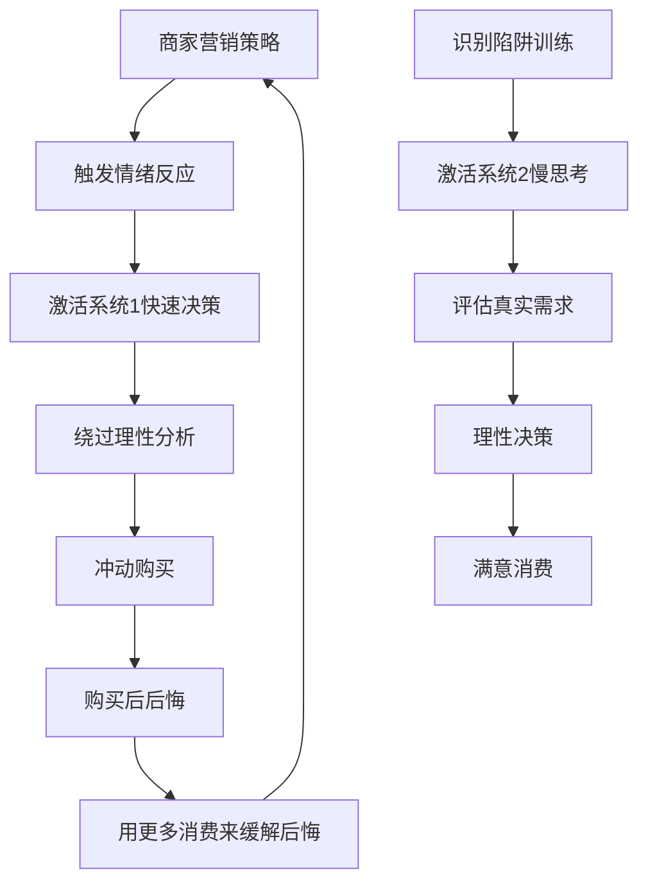
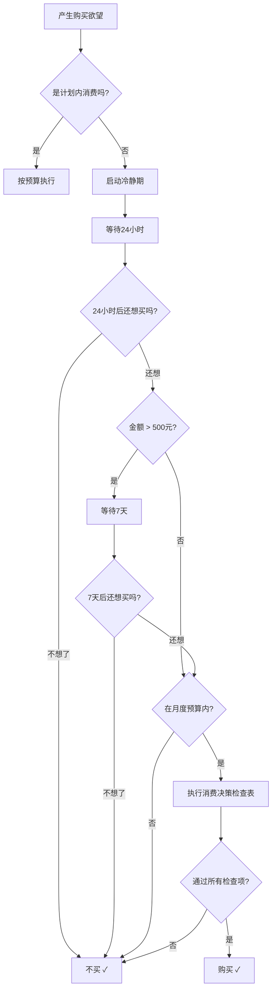

## 一、识别和克服消费心理陷阱

消费心理陷阱是商家利用人类认知偏差设计的营销策略。诺贝尔经济学奖得主丹尼尔·卡尼曼（Daniel Kahneman）在《思考，快与慢》中系统阐述了人类决策中的非理性模式——我们以为自己在理性消费，实际上大脑的"系统1"（快速、直觉、情绪化）在主导大部分购买决策。识别这些陷阱不是为了变成抠门的人，而是为了把每一分钱花在真正能提升生活质量的地方。

### 1.1 为什么消费陷阱如此有效

人类大脑在进化过程中形成了一套"快速决策"机制。在原始环境中，这套机制帮助我们快速判断食物是否安全、野兽是否危险。但在现代商业社会，商家精准地利用了这些机制：

- **认知吝啬**：大脑倾向于节省认知资源，用直觉代替分析
- **情绪优先**：情绪反应比理性分析快0.3秒，商家先触发情绪再呈现价格
- **社会压力**：从众本能让我们害怕"落后"于他人
- **即时偏好**：大脑高估即时满足的价值，低估长期收益



### 1.2 十大消费心理陷阱详解

#### 1.2.1 锚定效应（Anchoring Effect）

**原理**：大脑在做数值估计时，会过度依赖第一个接收到的数字。特沃斯基和卡尼曼的经典实验表明，即使锚定数字是随机生成的，也会显著影响人们的判断。

**商家如何利用**：
- 先展示高价商品（如3万元的包），再推荐"实惠"的8000元款——8000元突然显得合理了
- 标注"原价1999，现价599"——即使从未以1999元售出，599也感觉便宜
- 菜单上放几个超高价菜品，让其他菜品显得"正常"

**破解方法**：

| 方法 | 具体操作 | 适用场景 |
|------|---------|---------|
| 独立估值法 | 在看到标价前，先问自己"这个东西值多少钱" | 所有购买场景 |
| 三方比价法 | 至少比较3个不同品牌/渠道的价格 | 大额消费 |
| 时间换算法 | 将价格换算成工作时间："这个包值我工作5天" | 高价商品 |
| 反向锚定法 | 查询二手市场价、历史最低价、原材料成本 | 标注"原价"的商品 |

**实操模板——消费决策检查表**：

```text
商品名称：___________
标价：___________
我的独立估值：___________  （差距 > 30% 则警惕）
三家比价最低价：___________
换算为工作时间：___ 小时/天
24小时后还想买吗：是 / 否
```

#### 1.2.2 损失厌恶（Loss Aversion）

**原理**：人们对损失的痛苦感受是获得同等收益快乐感受的2-2.5倍（卡尼曼与特沃斯基，1979年前景理论）。这意味着"失去100元的痛苦"需要"获得200-250元的快乐"才能抵消。

**商家如何利用**：
- "限时优惠，倒计时3小时"——制造"错过就是损失"的压力
- "最后3件库存"——稀缺性触发"再不买就没了"的恐惧
- "免费试用7天"——试用期结束后，取消订阅感觉像"失去"已有权益
- "满300减50"——凑单到300感觉是"赚了50"，不凑则感觉"损失50"

**破解方法**：

- **反事实思维**：问自己"如果我现在不买，明天会因为错过而后悔吗？"大多数情况下答案是否定的
- **机会成本框架**：把这笔钱想象成已经拥有的一件东西——"用这个包换两个月的午餐，值吗？"
- **试用前决策法**：在开始免费试用前就决定——"如果必须付费，我还愿意继续吗？"如果答案是"不确定"，就不要开始试用
- **延迟满足训练**：把想买的东西加入收藏夹，设定7天后再决定

**利用损失厌恶帮助储蓄**：

将损失厌恶反过来用在自己身上：

- 设置工资日自动转账到储蓄账户，让储蓄变成"默认行为"，不储蓄反而感觉"损失"
- 使用定期存款，提前支取损失利息——用"损失"的痛苦约束自己
- 公开储蓄目标（告诉朋友/家人），放弃目标等于"丢面子"
- 使用带有"违约金"机制的储蓄APP（如某些海外APP会把钱捐给你讨厌的机构）

#### 1.2.3 心理账户（Mental Accounting）

**原理**：理查德·塞勒（Richard Thaler）提出，人们会在心理上把钱分成不同的"账户"——工资要精打细算，奖金可以挥霍，退税是"意外之财"可以随便花。这导致同一个人对同样金额的钱有截然不同的消费态度。

**典型表现**：
- 辛苦赚的1000元不舍得花，彩票中的1000元随便花
- 每月餐饮预算2000元已经超了，但"学习预算"还剩500——于是买了一本根本不会看的书
- 年终奖到手后觉得是"额外收入"，买了平时舍不得买的东西

**破解方法**：

- **收入账户合并**：把所有收入（工资、奖金、副业、退税、红包）视为同一个池子，按统一规则分配
- **价值导向预算**：不按"餐饮""娱乐""学习"分类，而是按"提升生活质量""投资未来""社交关系"分类
- **自由消费账户**：每月预留一笔"无负罪感消费金"（建议收入的5-10%），额度内随意花。这比完全压抑消费欲望更可持续
- **意外收入规则**：意外收入到手后，强制分配——50%投资、30%储蓄、20%消费

#### 1.2.4 禀赋效应（Endowment Effect）

**原理**：人们对自己已经拥有的东西，会赋予高于其市场价值的估值。即使这个东西是刚获得的，一旦"拥有"，大脑就认为它更有价值。

**商家如何利用**：
- "先试用再付款"——试用期间你已经感觉这是"你的"了，退货等于"失去"
- "个性化定制"——花了30分钟定制的鞋子，即使最终效果一般，你也舍不得放弃
- "会员积分"——攒了500积分，不舍得不用，于是为了用积分而额外消费

**破解方法**：
- 问自己："如果我现在没有这个东西，我愿意花同样的钱去买吗？"
- 把"沉没成本"和"未来收益"分开计算
- 定期清理物品，体验"放手"的感觉，降低对物品的依附感

#### 1.2.5 沉没成本谬误（Sunk Cost Fallacy）

**原理**：已经投入的不可回收成本（时间、金钱、精力）会影响未来的决策。"我已经花了这么多，不能放弃"——即使继续投入只会亏损更多。

**典型场景**：
- 看了一部烂电影，觉得"票都买了，不看完浪费"——结果又浪费了1.5小时
- 办了健身年卡，去了3次不想去了，但觉得"不去就亏了"——于是强迫自己去，心情不好，效率也低
- 买了一件不合适的衣服，觉得"花了这么多钱不能扔"——于是放在衣柜里占空间

**破解方法**：
- **向前看原则**：决策时只考虑"从现在开始，继续投入的收益是否大于成本"
- **止损清单**：为每个长期投入设定明确的止损条件——"如果3个月内没有达到X效果，就放弃"
- **时间价值计算**：你的时间也是成本——花2小时退一张50元的电影票，时薪25元，值吗？

#### 1.2.6 诱饵效应（Decoy Effect）

**原理**：当两个选项难以比较时，加入一个"明显更差"的第三个选项（诱饵），会让其中一个选项显得更有吸引力。

**商家如何利用**：

| 选项 | 价格 | 容量 | 商家意图 |
|------|------|------|---------|
| 小杯爆米花 | 20元 | 小份 | 基础选项 |
| 中杯爆米花 | 35元 | 中份 | **诱饵**——让大杯显得"超值" |
| 大杯爆米花 | 38元 | 大份 | 目标选项——仅比中杯贵3元但大很多 |

**破解方法**：
- 只在选项中寻找自己真正需要的规格，忽略其他选项
- 计算每个选项的"单价"（每克/每毫升的价格）
- 问自己："如果没有中杯选项，我会选大杯吗？"

#### 1.2.7 社会认同偏差（Social Proof）

**原理**：在不确定的情况下，人们倾向于参考他人的行为来决定自己的行为。这是进化遗留——在原始社会，跟随大多数人的选择通常是安全的。

**商家如何利用**：
- "累计销量100万+"——暗示"这么多人买，肯定没问题"
- "好评率99%"——但可能隐藏了大量差评或刷好评
- "网红同款""明星推荐"——利用偶像的权威性
- "你的3位好友已经购买"——社交压力

**破解方法**：
- 区分"很多人买"和"适合我买"——热销不等于适合
- 查看差评而非好评——差评更能反映真实问题
- 警惕"虚假共识"——社交媒体上看到的推荐可能是广告
- 使用第三方测评平台而非依赖销量和好评

#### 1.2.8 框架效应（Framing Effect）

**原理**：同样的信息，用不同的方式呈现，会导致截然不同的决策。卡尼曼的经典实验：当手术被描述为"90%存活率"时，更多人愿意接受；描述为"10%死亡率"时，愿意的人大幅减少。

**商家如何利用**：
- "每天只需3元"而非"每年1095元"——日均价格让人觉得便宜
- "省下500元"而非"花了1500元"——强调"赚了"而非"花了"
- "成功率95%"而非"失败率5%"——正面框架
- "含70%瘦肉"而非"含30%肥肉"——同样的肉，不同的感受

**破解方法**：
- 统一换算成年度总支出
- 同时计算"省了多少"和"花了多少"
- 用正反两种框架重新描述同一个选择

#### 1.2.9 稀缺性偏差（Scarcity Bias）

**原理**：人们对稀缺资源赋予更高的价值。即使客观价值不变，一旦感知到"稀缺"，主观价值就会上升。

**商家如何利用**：
- "限量版""限定款"——人为制造稀缺
- "仅剩最后2件"——库存压力
- "活动截止今晚24:00"——时间压力
- "会员专属""邀请制"——身份稀缺

**破解方法**：
- 问自己："如果这个东西永远有货，我现在还会买吗？"
- 区分"真稀缺"（限量手工品、绝版商品）和"假稀缺"（商家营销手段）
- 对"限时"优惠，先截图保存，下次活动通常还会再来

#### 1.2.10 零价格效应（Zero Price Effect）

**原理**：人们对"免费"的东西会产生非理性的偏好。"免费"不仅仅是价格为零——它触发了强烈的情绪反应，让人忽略隐性成本。

**商家如何利用**：
- "买一送一"——你真的需要两个吗？还是因为"送"字让你觉得赚了？
- "满299免运费"——为了免10元运费，多花了100元
- "免费领取"——需要填个人信息、关注公众号、下载APP
- "首月免费"——后续自动扣费

**破解方法**：
- 计算"免费"的真实成本（时间、隐私、后续消费）
- 问自己："如果这个东西标价1元，我还会要吗？"
- 把"免运费"换算成"多花的钱"——"为了省10元运费，我多买了80元的东西"

### 1.3 消费陷阱自评诊断

用以下清单评估你自己的消费弱点。每符合一项计1分，分数越高越需要警惕：

| 序号 | 行为表现 | 对应陷阱 | 你的得分 |
|------|---------|---------|---------|
| 1 | 看到"原价XX现价XX"就觉得很划算 | 锚定效应 | □ |
| 2 | 办了卡/订阅了服务，即使不用也不取消 | 损失厌恶 | □ |
| 3 | 年终奖/退税到手就想花掉 | 心理账户 | □ |
| 4 | 试用过的东西不舍得退 | 禀赋效应 | □ |
| 5 | "都花这么多了，不能半途而废" | 沉没成本 | □ |
| 6 | 经常买了"中号"然后发现"大号才多几块钱" | 诱饵效应 | □ |
| 7 | 看到销量高/好评多就放心下单 | 社会认同 | □ |
| 8 | "每天只需X元"让你觉得便宜 | 框架效应 | □ |
| 9 | "限量""最后X件"让你加速下单 | 稀缺性偏差 | □ |
| 10 | 看到"免费""送"就走不动路 | 零价格效应 | □ |
| 11 | 心情不好就打开购物APP | 情绪消费 | □ |
| 12 | 买了东西之后反复看物流信息 | 期待管理失衡 | □ |

**评分解读**：
- 0-3分：消费理性度较高，继续保持
- 4-6分：存在明显弱点，建议针对性练习
- 7-9分：消费决策受情绪影响较大，建议建立系统化的消费决策流程
- 10-12分：强烈建议进行为期30天的消费冷静期训练

### 1.4 系统化防陷阱流程

建立一套个人化的"消费决策系统"，让理性成为习惯而非意志力消耗：



**消费决策检查表**（每次非计划消费时填写）：

```text
1. 我现在的购买欲望是由什么触发的？
   □ 真实需求  □ 广告/推荐  □ 情绪波动  □ 社交压力  □ 限时促销

2. 如果这个东西明天恢复原价/不再促销，我还会买吗？
   □ 会  □ 不会  □ 不确定（不确定=不买）

3. 我有没有类似的东西已经闲置？
   □ 没有  □ 有（列出：____）

4. 这笔钱的机会成本是什么？
   相当于_____（换算成你在意的事物）

5. 一年后我会怎么看这次购买？
   □ 觉得值得  □ 无所谓  □ 后悔（后悔=不买）
```

### 1.5 高阶技巧：认知脱钩

当你能够识别基本的消费陷阱后，可以进一步练习"认知脱钩"——将情绪反应和购买行为分离：

**正念消费练习**：
1. 当你产生购买欲望时，暂停10秒
2. 观察这个欲望——它在身体的哪个部位？是胸口的紧迫感还是手指的冲动？
3. 给这个欲望命名——"这是锚定效应在起作用"或"这是稀缺性偏差"
4. 深呼吸3次，让情绪回落到基线
5. 然后再做决定

**定期审计**：
- 每月底花30分钟回顾本月所有非计划消费
- 统计每笔消费属于哪种心理陷阱驱动
- 计算"陷阱消费"占总消费的比例
- 下个月针对性练习弱点最大的陷阱类型

**环境设计**：
- 删除购物APP的支付密码保存功能——每次支付增加一步操作
- 将购物APP从手机首页移到文件夹深处——减少无意打开的机会
- 取消所有促销推送通知——主动获取信息而非被动接收
- 设置信用卡消费提醒——每笔消费即时感知

### 1.6 不同情境下的陷阱组合

在实际消费场景中，心理陷阱往往不是单独出现，而是组合出现：

| 场景 | 涉及的陷阱组合 | 应对策略 |
|------|---------------|---------|
| 电商大促（双11/618） | 锚定+稀缺+零价格+损失厌恶+社会认同 | 提前列清单，只买清单内的；忽略"销量排行" |
| 直播带货 | 稀缺+社会认同+框架+情绪消费 | 关闭弹幕，关闭倒计时，搜索同款比价 |
| 会员/订阅服务 | 损失厌恶+沉没成本+零价格 | 每季度审计所有订阅，不常用的立即取消 |
| 奢侈品消费 | 锚定+社会认同+禀赋效应+心理账户 | 区分"品牌溢价"和"实际使用价值" |
| 教育/知识付费 | 焦虑+稀缺+社会认同+沉没成本 | 先搜索免费资源，确认付费内容的独特价值 |

掌握消费心理陷阱的本质不是成为一毛不拔的守财奴，而是成为一个清醒的消费者——把钱花在真正能提升生活质量的地方，而不是被精心设计的营销策略牵着走。每一次成功抵制非理性消费，都是对自己决策能力的一次强化训练。
