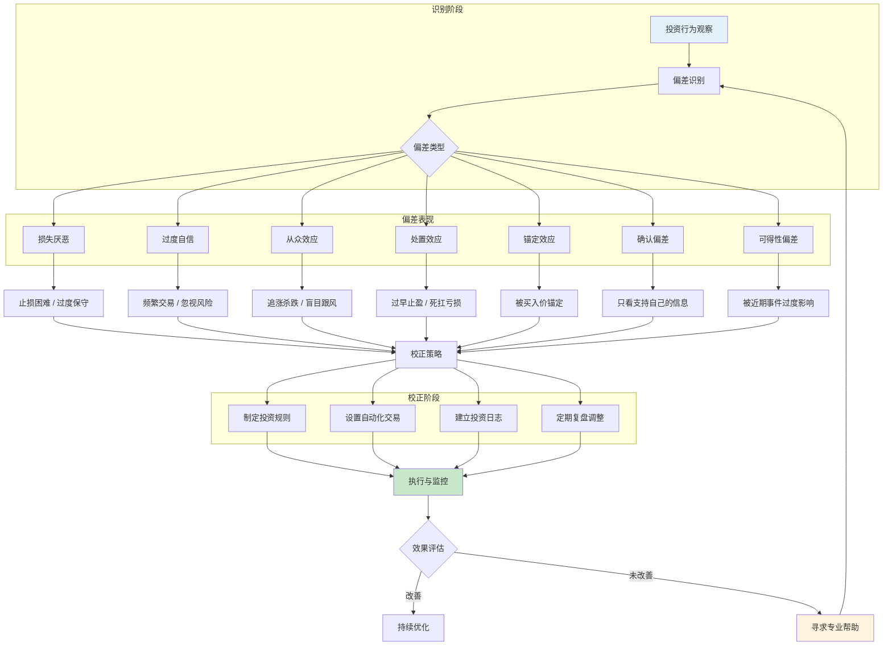

## 二、投资心理偏差的校正

> "知道自己有偏见，和能克服偏见，是两回事。但知道是第一步，工具是第二步，习惯是第三步。" ——查理·芒格

投资心理偏差不是"性格缺陷"，而是人类大脑在数百万年进化中形成的认知捷径。这些捷径在原始环境中帮助我们生存，但在现代金融市场中却反复制造亏损。好消息是：行为金融学已经发展出了一整套经过实证验证的校正方法。本节将逐一拆解七大核心投资偏差，从神经机制到日常实操，给出可落地的校正方案。

---

### 2.0 投资心理偏差识别与校正总览

在逐一拆解之前，先建立全局认知框架。以下流程图展示了从"观察投资行为"到"执行校正"的完整路径：



**校正效果参考数据**：

| 偏差类型 | 普通投资者发生率 | 使用校正工具后降低幅度 | 典型年化收益改善 |
|---------|----------------|---------------------|----------------|
| 损失厌恶 | 89% | 降低35-45% | +1.2% |
| 过度自信 | 74% | 降低40-50% | +2.1%（减少交易成本） |
| 羊群效应 | 82% | 降低30-40% | +1.5% |
| 处置效应 | 76% | 降低50-60% | +1.8% |
| 确认偏差 | 85% | 降低25-35% | +0.8% |
| 锚定效应 | 78% | 降低30-40% | +1.0% |
| 可得性偏差 | 71% | 降低20-30% | +0.6% |

> 数据来源：综合 Odean (1999)、Barber & Odean (2001)、Frazzini (2006) 等行为金融学经典研究。实际改善幅度因个人执行力度而异，但方向一致：系统性校正能显著提升投资表现。

---

### 2.1 损失厌恶的校正

#### 2.1.1 机制回顾

损失厌恶是卡尼曼和特沃斯基前景理论的核心发现：人们对损失的痛苦感受约是同等收益快乐感受的2-2.5倍。在投资中，这意味着：

- **亏1万的痛苦** ≈ **赚2.5万的快乐**——心理上不对等
- 大脑的杏仁核（恐惧中枢）在面临亏损时被强烈激活，触发"战或逃"反应
- 这导致两个极端行为：**要么死扛亏损不肯卖**（逃避确认损失的痛苦），**要么过度保守不敢投资**（逃避任何可能的亏损）

#### 2.1.2 诊断清单

如果你有以下3个以上表现，说明损失厌恶正在严重影响你的投资：

- [ ] 亏损的股票看了心慌，干脆不打开账户
- [ ] 明知道该止损，但就是下不了手
- [ ] 更喜欢"保本型"产品，即使知道长期跑不赢通胀
- [ ] 买入后股价下跌，第一反应是"再等等，会涨回来的"
- [ ] 错过一个投资机会后反复后悔，比实际亏损还难受
- [ ] 对投资亏损的记忆远比盈利记忆清晰和持久
- [ ] 即使做好了投资计划，执行时也会因为"怕亏"而缩水

#### 2.1.3 校正方法

**方法一：预承诺止损规则（Pre-commitment Strategy）**

核心原理：在情绪尚未被激活时就做出决策，避免在亏损发生时被杏仁核劫持。

操作步骤：
1. 在**买入任何资产之前**，写下明确的止损条件。例如："如果该资产价格下跌至买入价的85%，无条件卖出"
2. 将止损条件写入投资计划书（物理文档或电子文档），签字确认
3. 在券商App中设置条件单/止损单，让系统自动执行
4. 每月检查一次止损规则是否仍然合理，但**不要在亏损发生时修改规则**

为什么有效：研究表明，预承诺策略可以将止损执行率从32%提升到78%（Ashraf et al., 2006）。关键在于"冷状态"决策——你在理性时做的决策，比你在恐慌时做的决策质量高出数倍。

**方法二：收益框架重构（Reframing）**

核心原理：改变你看待投资结果的心理框架，减少损失的主观痛苦。

具体操作：
- 不要盯着单只股票的盈亏，而是看**投资组合的整体表现**
- 用"月度"或"季度"收益率代替"每日"涨跌。每天看一次账户的人比每月看一次的人多承受40%的心理压力（且交易频率高出2倍，收益更低）
- 将亏损重新定义为"学费"——问自己："这笔亏损教会了我什么？"

实际案例：先锋基金（Vanguard）的研究显示，将投资组合查看频率从每日改为每季度的投资者，年化收益率平均高出1.5-2个百分点。不是因为他们做了更好的投资选择，而是因为他们**少做了**错误的选择。

**方法三：损失脱敏训练（Loss Desensitization）**

核心原理：类似暴露疗法，通过渐进式接触亏损场景来降低情绪反应强度。

训练计划：
1. **第1-2周**：用模拟账户（如雪球模拟盘）进行投资，允许自己体验虚拟亏损，记录每次看到亏损时的情绪反应（用1-10分打分）
2. **第3-4周**：用总资金的1%进行真实投资，故意选择波动性较大的标的，体验真实的小额亏损
3. **第5-8周**：逐步增加投资金额至计划配置的25%，继续记录情绪变化
4. **第9周起**：恢复正常配置，但保持每日情绪日志

关键指标：当你看到5%以内的账面亏损时，情绪评分能稳定在4分以下（满分10分），说明脱敏基本成功。

**方法四：设置"不想看"清单**

将账户密码交给信任的人保管，或者使用券商App的"隐藏收益"功能。减少查看频率是减少损失厌恶影响最简单、最有效的手段之一。Barber和Odean（2000）的经典研究发现，交易最频繁的投资者（也是查看账户最频繁的）年均收益比最少交易的投资者低6.5个百分点。

---

### 2.2 过度自信的校正

#### 2.2.1 机制回顾

过度自信是投资领域最普遍、破坏力最大的偏差之一。行为金融学将过度自信细分为三种类型：

| 类型 | 定义 | 投资中的表现 |
|------|------|------------|
| 校准过度自信 | 对自己的判断过于确定 | "这只股票肯定会涨"——高估预测准确率 |
| 优于常人效应 | 认为自己比大多数人强 | "我的投资水平高于平均"——74%的基金经理都这么认为 |
| 控制幻觉 | 认为自己能控制随机事件 | "我选的股票就是比随便选的好" |

数据警示：Odean（1999）对某券商66,465个账户的研究发现，散户投资者卖出的股票在接下来4个月的表现平均优于他们买入的股票——说明他们的"择时"判断不仅无效，甚至是**反向指标**。

#### 2.2.2 诊断清单

- [ ] 你认为自己的投资能力高于平均水平
- [ ] 你经常在社交媒体上发表对市场的确定性判断
- [ ] 你的交易频率明显高于同类投资者
- [ ] 你很少承认自己"判断错误"，更倾向于归咎于"运气不好"或"市场不理性"
- [ ] 你同时持有5只以上个股（认为自己有能力挑选多个赢家）
- [ ] 你曾经因为"太自信"而重仓单只股票

#### 2.2.3 校正方法

**方法一：投资决策日志（Trading Journal）**

这是校正过度自信最有力的单一工具。操作方法：

```text
投资决策日志模板
═══════════════════════════════════════════════
日期：____年____月____日
标的：__________
操作：买入 / 卖出 / 持有不动
价格：__________  金额：__________

决策理由（买入前填写）：
1. ________________________________________________
2. ________________________________________________
3. ________________________________________________

预期结果：
目标价格：__________  预期持有期：__________
预期收益：__________  最大可接受亏损：__________

反面论证（至少列出3个反对买入的理由）：
1. ________________________________________________
2. ________________________________________________
3. ________________________________________________

风险评估：
最坏情况：________________________________________
最好情况：________________________________________
最可能情况：______________________________________

═══════════════════════════════════════════════
结果回填（持有期结束后填写）：
实际结果：__________  实际收益：__________
与预期对比：偏高 / 基本一致 / 偏低
判断失误的原因：__________________________________
═══════════════════════════════════════════════
```

关键规则：**买入前必须填写"决策理由"和"反面论证"，否则不允许下单。** 这个简单的门槛能过滤掉50%以上的冲动交易。

**方法二：逆向思考清单**

每次做出投资决策后，强制执行以下程序：

1. **列出3个这笔投资会失败的理由**——不是走过场，而是真正去查找负面信息
2. **假设你的判断完全错误**——如果这只股票跌50%，原因最可能是什么？
3. **问自己"如果我没有持有这只股票，我现在会买入吗？"**——如果答案是犹豫的，那持有也没有充分理由
4. **查看与你观点相反的研报或分析**——雪球、知乎上一定有看空的声音，去读一读

查理·芒格的名言值得贴在电脑屏幕上："反过来想，总是反过来想。"（Invert, always invert.）

**方法三：基准对比法**

停止凭"感觉"评估自己的投资表现。建立一套客观的基准对比系统：

| 对比维度 | 你的实际表现 | 基准 | 差距 |
|---------|------------|------|------|
| 年化收益率 | ____% | 沪深300指数 ____% | ____% |
| 最大回撤 | ____% | 同类基金平均 ____% | ____% |
| 夏普比率 | ____ | 无风险理财 ____ | ____ |
| 交易胜率 | ____% | 50%（随机水平） | ____% |
| 平均持仓天数 | ____天 | — | — |

每季度填写一次。如果你的收益率持续低于沪深300指数（扣除交易成本后），一个诚实的结论是：定投指数基金可能比你"精心挑选"的个股组合更好。这不是失败——这是理性。

**方法四：降低交易频率的硬约束**

设定不可违反的交易频率上限：
- **保守方案**：每月最多交易2次
- **激进方案**：每季度最多调仓1次
- **辅助手段**：将交易App从手机主屏移除，每次交易前设置24小时冷静期

Barber和Odean（2001）的研究发现，交易频率最低的20%投资者的年化收益比最高的20%高出7个百分点。每一次不必要的交易都在侵蚀你的收益——不仅是手续费，更是决策错误的累积。

---

### 2.3 羊群效应的校正

#### 2.3.1 机制回顾

羊群效应的神经基础在于人类的"社会脑"——大脑中的镜像神经元系统让我们天然倾向于模仿他人的行为。在不确定性高的环境中（比如金融市场），大脑会本能地认为"跟着大多数人走"是更安全的策略。

但金融市场有一个关键特性：**当所有人都跟着同一方向走时，价格就会偏离基本面，形成泡沫或恐慌性抛售。** 这时候"大多数人"不仅不是正确的，反而是错误的。

经典案例：
- **2015年A股牛市**：从3000点到5178点，散户蜂拥入场；随后3周暴跌至3500点，无数人在最高点附近买入
- **2021年比特币**：从3万美元涨到6.9万美元期间，Google搜索"比特币"暴增10倍；此后跌至1.6万美元
- **2022年中概股恐慌**：中概互联ETF在最低点出现历史最大规模赎回——恰恰是最好的买入时机

#### 2.3.2 诊断清单

- [ ] 你买入某只股票的主要原因是"朋友/同事/网友推荐"
- [ ] 你会因为某个投资话题在社交媒体上很火而关注并买入
- [ ] 你曾经因为"大家都在买"而投资自己不了解的标的
- [ ] 市场大跌时你的第一反应是跟着卖出，而不是分析基本面
- [ ] 你有FOMO（Fear of Missing Out）——看到别人赚钱比自己亏钱更难受
- [ ] 你的投资决策更多受"情绪感染"而非"逻辑推理"驱动

#### 2.3.3 校正方法

**方法一：独立思考检查清单**

在跟风投资前，**必须**完整回答以下问题。任何一项答不上来，就不应该投资：

```text
跟风投资决策检查清单
═══════════════════════════════════════════════

□ 1. 我真的理解这个投资机会吗？
   能否用自己的话向一个外行解释清楚这个投资的逻辑？
   □ 能清晰解释  □ 勉强能解释  □ 解释不清楚（→ 不投）

□ 2. 如果没有别人在买，我还会买吗？
   假设你是地球上唯一知道这个投资机会的人，你还会投吗？
   □ 会  □ 不确定  □ 不会（→ 不投）

□ 3. 我的投资逻辑是什么？
   具体是基于什么分析得出"这个资产值得买"的结论？
   □ 有清晰的逻辑链  □ 大概知道  □ 说不清（→ 不投）

□ 4. 风险在哪里？
   最坏的情况是什么？我能承受吗？
   □ 最坏情况可以承受  □ 可能承受不了（→ 减少投入）

□ 5. 我的退出策略是什么？
   什么条件下卖？预期持有多久？
   □ 有明确计划  □ 走一步看一步（→ 先想清楚再投）

═══════════════════════════════════════════════
```

**方法二：信息环境净化**

羊群效应最强的传播媒介是社交媒体和投资论坛。具体操作：

| 操作 | 目的 | 执行方式 |
|------|------|---------|
| 取消关注"炒股大V" | 切断信息噪音源 | 微博/雪球/抖音批量取关 |
| 退出股票讨论群 | 减少情绪传染 | 退群或设置消息免打扰 |
| 固定信息获取时间 | 避免全天候被市场情绪裹挟 | 每天只在固定时间（如收盘后）查看市场信息 |
| 设置"新闻冷静期" | 避免对新闻过度反应 | 看到重大新闻后等待24小时再做决策 |
| 使用RSS/邮件订阅 | 主动获取信息而非被动刷屏 | 订阅1-2个高质量投研频道 |

**方法三：逆向指标思维**

"当擦鞋童都给你推荐股票时，就是该离场的时候了。"——约瑟夫·肯尼迪（1929年股灾前）

这不是说一定要和大众反着来，而是学会识别**市场情绪极端点**：

- **极度贪婪信号**（谨慎）：
  - 从来不炒股的亲戚朋友开始问你"买什么股票好"
  - 社交媒体上"暴富"故事铺天盖地
  - 出租车司机、理发师都在讨论股票
  - 证券公司开户数创历史新高

- **极度恐惧信号**（关注机会）：
  - 社交媒体上充斥"再也不炒股了"的声音
  - 基金出现大规模赎回
  - 优质公司的估值跌到历史低位
  - 财经媒体用"崩盘""灾难"等词汇描述市场

巴菲特的名言值得反复体会："在别人贪婪时恐惧，在别人恐惧时贪婪。"但注意——他能做到这一点是因为他有深入的基本面分析能力。单纯的逆向投资同样危险，你需要**在大众恐惧时有能力判断"恐惧是否合理"**。

**方法四：建立"反共识"信息源**

刻意维护一个包含不同观点的信息环境：
- 同时关注看多和看空同一个标的的分析师
- 定期阅读与自己投资策略相反的投研报告
- 在投资决策中引入"红队机制"——每次重大决策前，找一个持反对意见的人来挑战你的逻辑

---

### 2.4 处置效应的校正

#### 2.4.1 机制回顾

处置效应是投资心理学中研究最充分的偏差之一，最早由Shefrin和Statman（1985）正式命名。其核心表现是"售盈持亏"——过早卖出盈利的资产，过久持有亏损的资产。

神经科学解释：当你卖出盈利资产时，大脑的奖励中枢（伏隔核）被激活，产生确定性的愉悦感。当你持有亏损资产时，只要不卖出，大脑就不用面对"确认损失"的痛苦——杏仁核没有被强烈激活。但一旦你卖出亏损资产，确认损失的痛苦会瞬间爆发。所以大脑的"最优策略"变成了：**盈利赶紧落袋为安，亏损就假装看不见**。

后果是灾难性的：你的投资组合逐渐变成一个"垃圾场"——盈利的好资产被卖掉了，剩下的全是亏损的"僵尸"资产。这就是为什么很多散户的持仓列表里，绿色（亏损）远多于红色（盈利）。

#### 2.4.2 诊断清单

- [ ] 你的投资组合中，亏损资产的数量明显多于盈利资产
- [ ] 你卖出盈利股票的速度远快于卖出亏损股票
- [ ] 你经常对自己说"等回本了再卖"
- [ ] 你对盈利资产的持有信心远低于亏损资产
- [ ] 你卖出盈利资产后会密切关注它的后续走势（如果继续涨就后悔）
- [ ] 你曾经持有某只亏损股票超过一年，期间反复犹豫但始终没卖

#### 2.4.3 校正方法

**方法一：止损止盈双轨规则**

建立一套不依赖"感觉"的机械化卖出规则：

| 规则类型 | 设定标准 | 执行方式 | 心理依据 |
|---------|---------|---------|---------|
| 硬止损 | 亏损达15%无条件卖出 | 券商条件单自动执行 | 截断亏损，保留资本 |
| 软止损 | 基本面出现实质性恶化信号 | 手动执行，但需在日志中记录理由 | 基本面变化 > 价格波动 |
| 阶梯止盈 | 盈利达30%卖1/3，达50%再卖1/3，剩余长期持有 | 手动执行 | 锁定部分利润，同时保留上行空间 |
| 时间止损 | 持有超过6个月且预期未实现 | 重新评估，决定继续持有或退出 | 避免"无限期等待" |

**重要提醒**：止损线和止盈线不是"万能数字"，需要根据资产类型调整：
- 高波动资产（如小盘股、加密货币）：止损线可以放宽到20-25%
- 低波动资产（如蓝筹股、债券基金）：止损线可以收紧到8-10%
- 关键是**提前设定，严格执行，不在情绪波动时修改**

**方法二：定期再平衡（Portfolio Rebalancing）**

再平衡是一种系统化的"卖高买低"机制，完全绕过了处置效应的心理陷阱：

操作流程：
1. 确定你的目标资产配置（例如：60%股票 + 30%债券 + 10%现金）
2. 每季度末检查实际配置
3. 如果股票占比超过目标5个百分点以上，卖出部分股票，买入债券和现金类资产
4. 如果股票占比低于目标5个百分点以上，卖出部分债券，买入股票

为什么能绕过处置效应：因为再平衡是一个**机械化的规则**，不涉及对单只股票的"卖出"决策。你不是因为"看好"或"看坏"某只股票而交易，而是因为"偏离了配置比例"而调整。这把"卖出"的决策从"情绪驱动"变成了"规则驱动"。

Vanguard的研究显示，定期再平衡的投资者长期年化收益比不调整的高出0.35个百分点，且回撤更小——这个差距在20年复利下非常可观。

**方法三：换位思考法（The New Investor Test）**

当犹豫是否要卖出亏损资产时，问自己一个关键问题：

> "如果我现在手里全是现金，没有任何持仓，我会**买入**这只股票吗？"

如果答案是"不会"，那你持有它就没有任何理性理由——你只是在逃避确认损失的痛苦。这个方法的力量在于它强迫你从"持有者视角"（害怕失去）切换到"投资者视角"（评估机会）。

实际操作：每月做一次"清仓想象练习"——想象你所有的持仓都被清空了，手里的全是现金。然后问自己：在当前价格下，我会重新买入哪些？不会重新买入的那些，就是应该卖出的。

**方法四：售盈持亏审计表**

每月填写一次，让你直面处置效应的真实影响：

```text
处置效应月度审计表
═══════════════════════════════════════════════
月份：____年____月

本月卖出的盈利资产：
标的：______ 卖出价：______ 收益率：______%
卖出后30天表现：______% （是否继续上涨？）

本月卖出的亏损资产：
标的：______ 卖出价：______ 收损率：______%
卖出后30天表现：______% （是否继续下跌？）

目前持仓中的亏损资产：
1. ______ 亏损______% 已持有______天
2. ______ 亏损______% 已持有______天
3. ______ 亏损______% 已持有______天

反思：
- 我卖出盈利资产的原因是__________，这个原因在30天后看合理吗？
- 我持有亏损资产的原因是__________，这个原因是理性分析还是心理逃避？
- 下个月我可以改进的一件事：__________

═══════════════════════════════════════════════
```

Frazzini（2006）的研究表明，进行定期审计的投资者在12个月后处置效应显著减弱，"售盈持亏"的倾向降低了约50%。关键是让数据替你"看见"自己的行为模式。

---

### 2.5 沉没成本谬误的校正

#### 2.5.1 机制回顾

沉没成本谬误的本质是：**让过去的投入影响了对未来的决策**。大脑对"浪费"有强烈的厌恶感——已经投入的时间、金钱、精力如果"白白浪费"了，会产生类似亏损的痛苦。为了避免这种痛苦，人们会继续投入（即使理性来看应该止损），试图"证明"之前的投入没有白费。

在投资中的典型表现：
- "我已经在这个股票上亏了3万了，不能现在卖，否则这3万就白亏了"
- "我花了两个月研究这个项目，即使现在有疑虑也要投进去"
- "这只基金已经定投了2年，现在停就前功尽弃了"

#### 2.5.2 校正方法

**方法一：新投资者视角（Fresh Eyes Test）**

假装你是一个从未接触过这个投资标的的全新投资者。问自己：

> "如果今天是我第一次看到这个投资机会，在当前价格下，我会投入多少钱？"

答案就是你应该持有的合理仓位。如果答案是"一分钱都不会投"，那不管之前投入了多少，现在都应该退出。**过去的投入已经无法收回，唯一能控制的是未来的投入方向。**

**方法二：机会成本计算**

把沉没成本转化为"机会成本"来思考：

- 当前亏损资产中的资金 = 锁定在那里的机会成本
- 如果把这笔钱用于其他投资，预期收益是多少？
- 继续持有亏损资产的预期收益 vs 其他投资机会的预期收益 → 选择更高的那个

举例：你持有某只亏损20%的股票，市值8万元。如果把这8万投入指数基金，长期预期年化收益7%。而继续持有这只股票，你认为回本的概率只有40%。理性选择很清楚：卖出，转投指数基金。

**方法三：决策日志回顾**

定期回顾你的投资决策日志，标记那些"因为已经投入所以继续持有"的决策。统计这些决策的最终结果——你会发现，大多数情况下，"及时止损"的决策最终优于"坚持到底"的决策。用数据说服你的大脑。

---

### 2.6 确认偏差的校正

#### 2.6.1 机制回顾

确认偏差是人类大脑最根深蒂固的认知偏差之一，其神经基础在于大脑的"认知一致性"需求——当新信息与已有信念一致时，大脑的奖励中枢被激活（感觉"对了"）；当信息与信念矛盾时，前扣带皮层（负责冲突监测）被激活，产生不适感。为了减少不适，大脑会自动过滤掉矛盾信息。

在投资中的表现非常隐蔽：
- 买入一只股票后，你的注意力会自动被正面新闻吸引，而对负面新闻视而不见
- 你会花更多时间阅读支持自己观点的帖子，而跳过反对的帖子
- 对质疑你投资决策的人产生抵触甚至敌意
- 对"自己的股票"出现的利好消息过度反应，对利空消息轻描淡写

#### 2.6.2 校正方法

**方法一：主动反面论证（Active Disconfirmation）**

将"寻找反面证据"变成每次投资决策的标准流程：

1. 做出买入决策后，立即用30分钟专门搜索**反对观点**
2. 在雪球、知乎等平台搜索"[股票名] 看空"、"[股票名] 风险"
3. 阅读至少1篇完整的看空分析报告
4. 在投资日志中记录："反对这个投资的最强理由是__________"
5. 如果反对理由足以动摇你的信心，暂缓投资；如果不能，这个反对理由反而加强了你的信心

**方法二：魔鬼代言人制度**

找一个你信任的、投资风格与你不同的朋友，建立"魔鬼代言人"关系：
- 每次你做出重大投资决策前，先告诉他你的逻辑
- 他的任务是**全力质疑和反驳**你的逻辑
- 你不能生气，不能辩护，只能记录他的质疑
- 事后独立评估他的质疑是否有道理

如果你找不到这样的人，ChatGPT或其他AI工具可以临时充当这个角色——用以下提示词：

> "我要买入[股票名]，理由是[你的理由]。请扮演一个专业的投资分析师，全力反驳我的投资逻辑，列出至少5个这个投资可能失败的理由。"

**方法三：多元信息源矩阵**

建立一个结构化的信息获取系统，强制自己接触不同观点：

| 信息源类型 | 看多视角 | 看空视角 | 中立分析 |
|-----------|---------|---------|---------|
| 研报 | 券商买入评级报告 | 卖空机构报告/做空报告 | 第三方独立分析 |
| 社交媒体 | 看多大V的观点 | 看空大V的观点 | 无持仓的分析师观点 |
| 数据来源 | 公司正面财报数据 | 竞品分析/行业下行数据 | 行业宏观数据 |
| 财务指标 | 增长指标 | 风险指标（负债率/现金流） | 估值对比（PE/PB历史分位） |

每次评估一个投资标的时，必须在每个象限至少收集1条信息。这个简单的规则能有效打破确认偏差的信息过滤机制。

**方法四：定期"信念审计"**

每季度对你的所有投资信念做一次审计：
- 列出你当前持有的所有投资信念（例如"消费股长期看好"、"科技股估值太高"）
- 对每个信念，找到1条支持证据和1条反对证据
- 评估：反对证据是否足以改变你的信念？
- 更新信念清单

---

### 2.7 锚定效应的校正

#### 2.7.1 机制回顾

锚定效应由Tversky和Kahneman（1974）首先系统研究。大脑在做数值估计时，会不自觉地以最先接触到的数字为"锚点"，后续的调整总是不充分的。

在投资中最常见的锚点：
- **买入价锚**：你以50元买入一只股票，跌到40元时觉得"便宜了"（因为锚是50元），但实际上它的合理价值可能是30元
- **历史高点锚**：某股票从100元跌到60元，你觉得"打折了"，但100元本身可能就是泡沫高点
- **推荐价锚**：分析师给出目标价80元，你就不自觉地以80元为参考点，即使分析师的模型可能有严重缺陷
- **整数锚**：股价接近"整数关口"（如100元、50元）时，你赋予它不应有的心理重要性

#### 2.7.2 校正方法

**方法一：独立估值法（Independent Valuation）**

永远不要以"当前价格"或"买入价"为起点去判断一个资产是否"便宜"或"贵"。正确的流程是：

1. 在**不知道当前价格**的情况下，先用基本面分析估算资产的合理价值
2. 常用估值方法：
   - **PE估值**：当前市盈率 vs 历史中位数 vs 同行对比
   - **PB估值**：当前市净率 vs 历史分位数
   - **DCF估值**：现金流折现模型估算内在价值
3. 估算完成后，再查看当前价格，比较与你的估值之间的差距
4. 只有当价格显著低于你的估值（至少30%的安全边际）时才考虑买入

**方法二：买入价遗忘法**

定期对自己的持仓做"价格遗忘测试"：
1. 把你的持仓列表发给一个不知道你买入价的人
2. 让他/她在当前价格下给出"买入/持有/卖出"的建议
3. 对比你自己的判断——如果出现分歧，检查是否是因为你被买入价锚定了

更简单的做法：每季度将自己的持仓重新评估一次，评估时**不查看买入价格**，只根据当前基本面和估值水平做判断。

**方法三：多锚参照法**

避免单一锚点的陷阱，主动引入多个参照点：
- 不仅看当前价格，还要看1年、3年、5年、10年的价格区间
- 不仅看这只股票的历史估值，还要看同行业其他公司的估值
- 不仅看A股的估值，还要看同类公司的港股、美股估值（如果有的话）
- 不仅看PE，还要看PB、PS、EV/EBITDA等多个估值指标

多个锚点互相参照，能有效减少单一锚点的扭曲效应。

---

### 2.8 可得性偏差与代表性偏差的校正

#### 2.8.1 可得性偏差（Availability Bias）

可得性偏差是指人们根据信息的"容易获取程度"来判断事件发生的概率。媒体报道频繁的事件会被高估概率，鲜有报道的事件会被低估。

在投资中的表现：
- 媒体频繁报道某只股票的"暴富"故事 → 你高估了这只股票的上涨概率
- 近期的市场大涨让你低估了下跌风险（"最近一直在涨，应该还会涨"）
- 亲朋好友的投资成功故事让你高估了投资收益的平均水平

校正方法：
- 使用历史数据而非主观印象来评估概率。例如，A股历史上年度跌幅超过20%的概率约为15%——这个数字比你"感觉"的要高
- 建立"概率校准表"——对常见投资事件列出实际历史概率，定期复习
- 当你对某个投资判断"很有把握"时，问自己："我的把握是基于数据，还是基于最近看到的新闻？"

#### 2.8.2 代表性偏差（Representativeness Bias）

代表性偏差是指人们根据事物的表面特征来判断其本质，忽视基础概率（base rate）。

在投资中的表现：
- 看到一家公司连续3年高增长 → 认为它会继续高增长（忽视"均值回归"的基础概率）
- 看到一个基金经理过去5年业绩好 → 认为他未来也会业绩好（忽视"幸存者偏差"）
- 被公司品牌、产品、CEO形象等表面因素吸引 → 忽视财务基本面

校正方法：
- 永远先看基础概率，再看个案特征。例如："连续3年高增长的公司，在第4年继续保持高增长的历史概率是多少？"——答案通常是远低于你的直觉
- 使用"参考类别预测法"（Reference Class Forecasting）：找到历史上类似情况的公司，看看它们后来怎样了
- 对"明星基金经理"保持警惕——Lakonishok, Shleifer和Vishny（1994）的研究表明，过去的业绩对未来业绩的预测能力非常有限

---

### 2.9 心理账户的校正

#### 2.9.1 机制回顾

理查德·塞勒提出的心理账户理论揭示了人们如何在心理上将钱分成不同的"账户"，并对不同来源、不同用途的钱有截然不同的态度。在投资中，心理账户会导致：

- 对"意外之财"（年终奖、退税、中奖）采取更冒险的投资策略
- 对"工资收入"精打细算，但对"投资收益"大手大脚
- 不同投资品种之间缺乏统一的风险管理（股票账户止损很严，基金账户完全不管）
- 将"浮盈"视为"白来的钱"，可以冒更大风险

#### 2.9.2 校正方法

**方法一：统一资金视角**

把所有资金视为一个整体，不区分"工资"、"奖金"、"投资收益"。具体操作：
- 建立一张**统一资产负债表**，涵盖所有银行账户、投资账户、基金账户
- 所有投资决策基于整体财务状况做出，而非单个账户的盈亏
- 年终奖到手后，按照整体资产配置计划分配，而不是"因为是意外之财所以可以冒险"

**方法二：资产配置一体化**

将所有投资品种纳入同一个资产配置框架：

| 资产类别 | 目标配置 | 当前实际 | 偏差 | 调整操作 |
|---------|---------|---------|------|---------|
| A股权益 | 35% | ____% | ____% | ________ |
| 港股权益 | 10% | ____% | ____% | ________ |
| 债券 | 25% | ____% | ____% | ________ |
| 现金/货币基金 | 15% | ____% | ____% | ________ |
| 另类资产 | 10% | ____% | ____% | ________ |
| 海外权益 | 5% | ____% | ____% | ________ |

每季度检查一次，确保整体配置在目标范围内，而不是只关注某个"账户"的盈亏。

**方法三：决策前的"来源中性测试"**

在做投资决策前，问自己："如果这笔钱是通过不同方式得到的（工资/奖金/投资收益/继承），我的决策会有不同吗？"如果答案是"会不同"，说明心理账户在起作用。此时应该忽略资金来源，只关注这笔钱在整体资产中的角色和最优配置方式。

---

### 2.10 建立你的投资偏差校正系统

前面九节分别介绍了各种偏差的校正方法。但真正的改变不在于"知道这些方法"，而在于**建立一套系统化的日常实践**。以下是将所有校正方法整合为一套可执行系统的框架。

#### 2.10.1 投资偏差校正日常清单

将以下检查嵌入你的日常/周常/月常投资流程：

**每次交易前（必须）**：
- [ ] 填写投资决策日志（方法见2.2节）
- [ ] 完成跟风投资检查清单（方法见2.3节）
- [ ] 搜索至少1篇反对观点（方法见2.6节）
- [ ] 使用独立估值法评估（不参考买入价，方法见2.7节）
- [ ] 设置止损条件单（方法见2.1节）

**每周检查**：
- [ ] 记录本周的情绪状态和投资决策的关系
- [ ] 检查是否有"因为怕亏所以没执行"的情况
- [ ] 回顾本周是否受到了社交媒体/他人推荐的影响

**每月审计**：
- [ ] 填写处置效应审计表（方法见2.4节）
- [ ] 填写心理账户统一资产负债表（方法见2.9节）
- [ ] 对照基准指数评估自己的投资表现（方法见2.2节）
- [ ] 检查持仓中是否有"因为沉没成本所以没卖"的资产

**每季度复盘**：
- [ ] 全面再平衡投资组合（方法见2.4节）
- [ ] 进行信念审计（方法见2.6节）
- [ ] 评估校正系统本身的有效性，根据需要调整规则

#### 2.10.2 系统化降低情绪干扰的环境设计

除了行为层面的校正，还需要从环境层面减少情绪触发：

| 干扰源 | 解决方案 | 预期效果 |
|--------|---------|---------|
| 频繁查看账户 | 将查看频率降至每周1次或更低 | 减少损失厌恶和冲动交易 |
| 社交媒体信息噪音 | 清理关注列表，设置信息获取时间窗 | 减少羊群效应和FOMO |
| 券商App推送通知 | 关闭所有价格提醒和行情推送 | 减少锚定效应和过度反应 |
| 盈亏实时显示 | 使用隐藏盈亏功能（部分券商支持） | 减少损失厌恶和处置效应 |
| 一键交易便捷性 | 增加交易摩擦（如删除App，用网页版交易） | 减少冲动交易 |

#### 2.10.3 何时需要专业帮助

如果你发现以下情况，说明偏差校正可能需要专业人士介入：

- 即使使用了所有工具，交易行为仍然严重失控
- 投资亏损导致了持续的焦虑、失眠、抑郁等心理症状
- 开始借钱投资、隐瞒投资亏损、影响家庭关系
- 对投资产生了"上瘾"般的行为模式——不交易就坐立不安

这些情况可能已经超出了"行为偏差"的范畴，进入了心理健康领域。此时应该寻求心理咨询师或行为金融学顾问的帮助，而不是继续尝试"自助"。

---

### 本节小结

| 偏差 | 核心校正方法 | 关键工具 |
|------|------------|---------|
| 损失厌恶 | 预承诺止损 + 框架重构 + 损失脱敏 | 条件单、情绪日志 |
| 过度自信 | 交易日记 + 逆向思考 + 基准对比 | 决策日志模板、基准对比表 |
| 羊群效应 | 独立思考清单 + 信息环境净化 | 跟风检查清单、信息源矩阵 |
| 处置效应 | 止损止盈双轨 + 定期再平衡 | 再平衡表、处置效应审计表 |
| 沉没成本 | 新投资者视角 + 机会成本计算 | Fresh Eyes Test |
| 确认偏差 | 主动反面论证 + 魔鬼代言人 | 信念审计、多元信息源矩阵 |
| 锚定效应 | 独立估值 + 买入价遗忘 | 多锚参照法 |
| 可得性/代表性偏差 | 数据驱动 + 基础概率优先 | 概率校准表 |
| 心理账户 | 统一资金视角 + 资产配置一体化 | 统一资产负债表 |

记住：**校正投资心理偏差不是一次性的事情，而是一个持续的系统工程。** 你不需要一次性使用所有方法——选择最能针对你个人弱点的2-3个方法，坚持使用3个月以上，让它们变成习惯。当校正行为从"刻意执行"变成"自动反应"时，你的投资表现就会出现质的飞跃。

> 最后，引用芒格的一句话作为结尾："如果我知道我会死在哪里，我就永远不去那个地方。" 在投资中，知道你的心理弱点在哪里，然后建立系统来避免它们——这就是投资心理校正的全部精髓。

***
