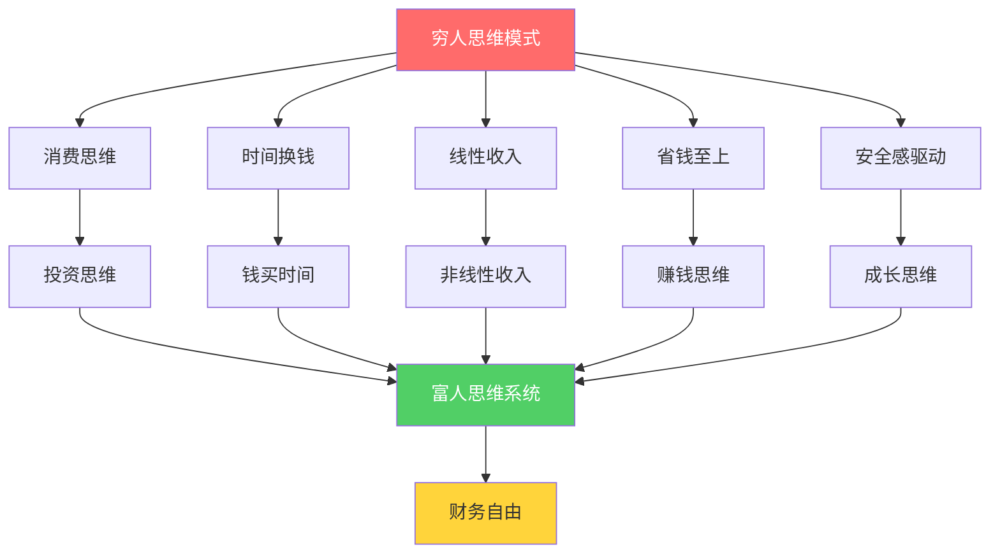
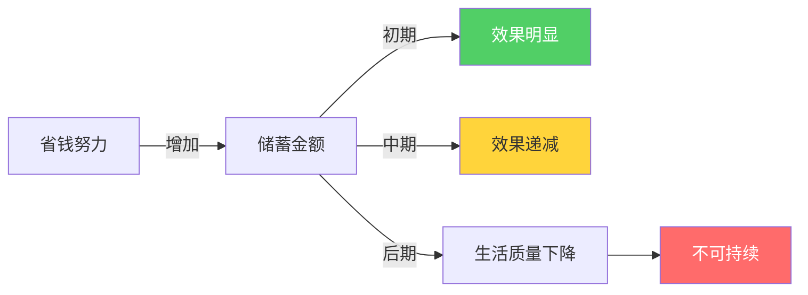

## 三、培养富人思维

富人思维不是"有钱人的想法"，而是一套经过验证的、能够系统性提升财务状况的认知操作系统。它与穷人思维的核心差异不在于智商或运气，而在于对金钱、时间、风险和价值的基本假设不同。

本节将五个最关键的思维转换逐一拆解：从理论机制到实操方法，从新手入门到进阶深化，帮助你完成认知底层的升级。

### 思维转换全景图



---

### 3.1 从"消费思维"到"投资思维"

#### 核心机制

消费思维和投资思维的根本区别在于对"当下"和"未来"的权重分配。行为经济学家理查德·塞勒（Richard Thaler）的"心理账户"理论指出：人们会把钱分到不同的心理账户中（生活费、娱乐费、储蓄等），而不同账户的钱具有不同的"消费倾向"。消费思维的人把大部分钱归入"可花"账户；投资思维的人则会优先建立"不可花"账户。

斯坦福大学的棉花糖实验（Walter Mischel, 1972）长期追踪发现：能够延迟满足的儿童，成年后的收入水平平均高出20%，投资行为更理性，负债率更低。这不是天赋差异，而是思维模式差异——投资思维本质上就是延迟满足在财务领域的具体表现。

#### 两种思维的日常表现对比

| 场景 | 消费思维 | 投资思维 |
|------|----------|----------|
| 发工资当天 | "终于发工资了，犒劳一下自己" | "先按计划分配，再看剩余可支配金额" |
| 看到新款手机 | "分期付款，每月才几百块" | "这部手机的机会成本是多少？我需要它还是想要它？" |
| 收到年终奖 | "存银行吧，反正也投不好" | "按照资产配置计划，分别投入不同标的" |
| 朋友聚餐 | "大家AA制，轻松无负担" | "这次聚餐对我人脉关系的投资回报如何？" |
| 网购促销 | "满300减50，不买就亏了" | "我不是省了50，而是多花了250" |

#### 实操方法：投资思维养成四步法

**第一步：建立"机会成本"计算习惯**

每次消费前，用这个公式快速估算：

```text
机会成本 = 消费金额 × (1 + 年化收益率)^年数

例如：买一部 6000 元的手机
- 假设年化收益率 8%，10年后的机会成本 = 6000 × 1.08^10 ≈ 12,953 元
- 假设年化收益率 12%，10年后的机会成本 = 6000 × 1.12^10 ≈ 18,635 元
```

这不需要你放弃每次消费，而是让你意识到：每一笔支出都有一个"隐性代价"。当这个习惯内化后，你会自然地对不必要的消费产生"痛感"。

**第二步：工资日自动化分配**

发工资当天（或次日），通过银行自动转账完成以下分配：

| 账户 | 比例 | 用途 | 存放位置 |
|------|------|------|----------|
| 生存账户 | 50% | 房租、饮食、交通、基本生活 | 日常银行卡 |
| 投资账户 | 30% | 长期投资（基金、股票、债券） | 证券/基金账户 |
| 成长账户 | 10% | 学习、技能提升、社交投资 | 专用储蓄卡 |
| 应急账户 | 10% | 突发支出（维修、医疗等） | 货币基金 |

关键原则：投资账户的钱在消费决策中"不存在"。就像交税一样——你不会觉得税后工资是"少发了钱"，而是把它当成你本来就没有的钱。

**第三步：区分"资产"和"负债"**

罗伯特·清崎在《富爸爸穷爸爸》中提出的核心概念：资产是把钱放进你口袋的东西，负债是从你口袋拿走钱的东西。

```text
资产举例：出租房产（收租>月供）、股票分红、版税收入、课程销售收入
负债举例：自住房贷（纯支出）、汽车贷款、消费分期、闲置物品的维护成本
```

每月做一次"资产负债审计"：把你拥有的东西分为资产和负债两类，计算你的净资产增长率。如果负债项在增加而资产项停滞，说明你的消费思维还在主导。

**第四步：建立"投资思维日记"**

每天花5分钟记录一个财务决策：

```markdown
## 日期：YYYY-MM-DD
- 今天最大的一笔支出：____元，用于____
- 这是"需要"还是"想要"：____
- 如果这笔钱投资10年（8%年化），价值：____元
- 我对这个决策的感受：____
- 如果重来，我会：____
```

坚持30天后回顾，你会清晰地看到自己的消费模式和改进空间。

#### 常见误区

1. **把投资思维等同于"不消费"**：投资思维不是苦行僧式省钱，而是把有限的资源分配到回报最高的地方。必要的消费（健康饮食、技能学习、关键社交）本身就是高回报投资。
2. **忽视小金额的复利效应**："就一杯奶茶钱"是典型的消费思维。每天30元的非必要消费，按8%年化计算，20年后的机会成本约为53万元。
3. **只在大额支出时才考虑机会成本**：投资思维应该是一种默认的思维模式，而不是只在买房子时才启用的临时工具。

---

### 3.2 从"时间换钱"到"钱买时间"

#### 核心机制

大多数人对时间的定价是模糊的——他们知道自己月薪多少，但不知道自己每小时值多少钱。一旦你把时间货币化，很多决策就会变得异常清晰。

哈佛商学院的研究表明：高收入人群与中等收入人群的一个关键差异是"时间分配策略"。高收入者倾向于将低价值任务外包，将时间集中在高杠杆活动上；中等收入者则倾向于亲力亲为，用时间换取节省的金钱。

#### 你的真实时薪计算

很多人只用"月薪÷工作小时数"来算时薪，但这忽略了隐性时间成本：

```text
真实时薪 = 月收入 ÷ 总投入时间（含通勤、加班、焦虑、恢复）

示例：
- 月薪 15,000 元
- 标准工作时间：8小时 × 22天 = 176小时
- 通勤：2小时 × 22天 = 44小时
- 加班：平均每月20小时
- 工作相关焦虑/恢复：每月约15小时
- 总投入时间：255小时
- 真实时薪：15,000 ÷ 255 ≈ 58.8元/小时
```

#### 任务外包决策矩阵

当你知道自己每小时值多少钱后，就可以系统地决定哪些事情该自己做、哪些该外包：

| 任务类型 | 时薪范围 | 是否外包 | 示例 |
|----------|----------|----------|------|
| 高价值+擅长 | 高于你时薪的2倍 | 绝不外包 | 核心业务、关键谈判、战略规划 |
| 高价值+不擅长 | 高于你时薪 | 学会后自己做或找高手 | 编程、数据分析、投资决策 |
| 低价值+擅长 | 低于你时薪 | 外包或自动化 | 日常做饭、基础设计、数据录入 |
| 低价值+不擅长 | 远低于你时薪 | 立即外包 | 家务清洁、跑腿、排队、简单客服 |

#### 外包实操指南

**入门级外包（月成本 500-2000 元）**

1. **家务清洁**：钟点工，每周2次，每次2-3小时，约30-50元/小时。你省下6小时/周，一年省下312小时。
2. **外卖/预制菜替代做饭**：如果你做饭不是为了享受，而是为了省钱——重新计算一下。一小时做一顿饭（含采购、烹饪、清洁），如果这一小时你用来学习或工作能创造更多价值，外卖就是更优选择。
3. **跑腿和排队**：用跑腿App处理取快递、排队挂号等事务。

**进阶级外包（月成本 2000-8000 元）**

1. **虚拟助理**：处理邮件、日程安排、信息搜集、简单文案。国内平台如猪八戒、威客，海外如Upwork、Fiverr。
2. **专业服务外包**：报税找会计师（省下的不只是时间，还有错误成本）、合同找律师审、装修找设计师。
3. **自动化工具**：用脚本/工具替代重复性工作——账单自动支付、报表自动生成、社交媒体定时发布。

#### 高阶应用：用钱购买"别人的时间"来赚钱

这是从"用钱买时间"到"用钱买别人的时间来产生更多钱"的进阶：

```text
初级：花钱请人打扫卫生 → 省下时间学习
中级：花钱请人执行具体任务 → 自己专注于策略和决策
高级：花钱雇团队运营项目 → 自己只负责方向和资源
顶级：花钱投资别人的公司 → 让别人的团队为你赚钱
```

#### 常见误区

1. **认为所有时间都应该"值钱"**：休息、娱乐、陪伴家人的时间不需要计算产出。过度优化时间会导致倦怠——这是对"钱买时间"最大的误解。
2. **只看金钱成本，不看学习成本**：外包某些任务可能让你失去了解业务细节的机会。在事业早期，亲自做很多事是必要的学习过程。
3. **外包后缺乏监督**：外包不是甩手不管。你需要建立质量标准、验收流程和反馈机制，否则外包可能比自己做更费时。

---

### 3.3 从"线性收入"到"非线性收入"

#### 核心机制

线性收入的本质是"时间零售"——你把自己的时间一小块一小块地卖给雇主。这种模式有两个致命缺陷：第一，你的时间有物理上限（每天最多24小时）；第二，一旦停止工作，收入立即归零。

非线性收入（也叫杠杆收入或被动收入）的核心是：一次投入，持续产出。你创造一个资产（一本书、一个课程、一个软件、一个投资组合），它可以反复销售或持续增值，而不占用你额外的时间。

纳西姆·塔勒布在《反脆弱》中指出：线性收入系统是"脆弱"的——任何中断（裁员、生病、行业衰退）都会导致收入归零。非线性收入系统则是"反脆弱"的——它可以承受冲击，甚至在冲击中变得更强。

#### 非线性收入的五大类型

| 类型 | 代表形式 | 启动门槛 | 天花板 | 典型收益率 |
|------|----------|----------|--------|------------|
| 知识产品 | 电子书、在线课程、付费专栏 | 低（需要专业能力） | 取决于市场规模 | 首次投入后边际成本趋近于零 |
| 知识产权 | 专利、版权、商标授权 | 中（需要创新或创作） | 高（可授权无限次） | 版税率通常3%-15% |
| 资本收益 | 股票、基金、房产租金 | 中（需要初始资金） | 高（复利效应） | 年化5%-15%（合理预期） |
| 数字产品 | App、SaaS工具、模板素材 | 中高（需要技术能力） | 极高（可无限复制） | 用户增长后边际成本趋近于零 |
| 系统收入 | 加盟体系、分销网络、自动化业务 | 高（需要管理和资源） | 极高 | 取决于系统效率 |

#### 实操：从零开始构建你的第一个非线性收入源

**第一步：盘点你的"知识资产"**

每个人都有可以产品化的知识和技能。用这个清单扫描自己：

```markdown
## 我的知识资产盘点

### 专业技能
- 我在工作中比同事做得更好的事：____
- 朋友经常向我请教的问题：____
- 我花了大量时间学习的领域：____

### 生活经验
- 我解决过别人也在面临的难题：____
- 我有独特视角或方法的领域：____

### 可产品化评估
- 有多少人需要这个知识？（市场规模）
- 他们愿意为此付费吗？（付费意愿）
- 我能否在3个月内创建一个最小可行产品？（可行性）
```

**第二步：选择最低成本的启动方式**

| 你的情况 | 推荐起步方式 | 时间投入 | 预期回报周期 |
|----------|------------|----------|------------|
| 有写作能力 | 公众号/知乎专栏 → 付费文章/电子书 | 每周3-5小时 | 3-6个月 |
| 有教学能力 | 录制短视频 → 系统课程（小鹅通、知识星球） | 每周5-8小时 | 6-12个月 |
| 有技术能力 | 开发小工具/App → 上架销售 | 集中2-4周 | 1-3个月 |
| 有投资知识 | 系统学习 → 先用模拟盘 → 小额实盘 | 持续学习 | 1-3年 |
| 有人脉资源 | 做中间人/代理商 → 建立分销体系 | 每周2-3小时 | 3-6个月 |

**第三步：建立"睡后收入"仪表盘**

每月追踪你的非线性收入进展：

```markdown
## 月份：YYYY-MM

### 非线性收入来源
| 来源 | 本月收入 | 累计投入时间 | 累计投入资金 | ROI |
|------|----------|------------|------------|-----|
| 电子书销售 | ____元 | ____小时 | ____元 | ____ |
| 课程收入 | ____元 | ____小时 | ____元 | ____ |
| 投资收益 | ____元 | ____小时 | ____元 | ____ |
| 其他 | ____元 | ____小时 | ____元 | ____ |

### 非线性收入占比
- 非线性收入总额：____元
- 月收入总额：____元
- 非线性收入占比：____%

### 目标
- 下月目标占比：____%
- 下月新增/优化的收入来源：____
```

#### 复利效应的数学真相

非线性收入的终极武器是复利。假设你每月投入2000元进行投资：

| 年化收益率 | 10年后 | 20年后 | 30年后 |
|-----------|--------|--------|--------|
| 5% | 31.0万 | 81.6万 | 166.5万 |
| 8% | 36.6万 | 118.6万 | 298.1万 |
| 12% | 46.0万 | 199.8万 | 649.4万 |
| 15% | 55.7万 | 305.4万 | 1,098.0万 |

注意：12%和5%的差距在30年后是3.9倍——这就是非线性收入的威力。每一百分点的收益率提升，经过足够长的时间，都会产生巨大的终值差异。

#### 常见误区

1. **急于求成，跳过线性收入阶段**：非线性收入需要前期积累。在线性收入阶段积累的能力、资金和经验，是非线性收入的基础。辞职去做"被动收入"是本末倒置。
2. **把"被动"理解为"不工作"**：所有非线性收入都需要前期大量投入，以及持续的维护和优化。"被动"是指边际成本低，不是指零投入。
3. **只追求一种非线性收入**：单一收入源的风险很高。理想状态是建立2-3个不同类型的非线性收入源，形成收入组合。

---

### 3.4 从"省钱思维"到"赚钱思维"

#### 核心机制

省钱思维和赚钱思维不是对立的，而是处于"财务能量谱"的两端。穷人思维只关注省钱端（降低支出），富人思维同时关注两端，但把主要精力放在赚钱端（提升收入）。

从数学角度看：支出有物理下限（你不可能把支出降到零以下），而收入没有理论上限。一个年收入10万、支出8万的人，如果把支出压缩到6万，存下了4万——这是省钱思维能做到的极限。但如果他把精力放在提升收入上，把年收入做到30万，即使支出提高到10万（生活质量也提升了），仍然存下了20万。

#### 省钱的边际效用递减



省钱遵循边际效用递减规律：前500元的节约很容易（少下几次馆子），接下来的500元需要更多努力（改变生活习惯），再往后500元可能严重影响生活质量（基本需求都无法满足）。

赚钱则不同——初期很慢（能力有限、资源不足），但随着能力提升和资源积累，收入增速会加快。这就是为什么富人思维把重心放在赚钱上。

#### 双轨策略：该省的省，该赚的赚

| 维度 | 省钱策略（防御性） | 赚钱策略（进攻性） |
|------|-------------------|-------------------|
| 时间分配 | 20%精力 | 80%精力 |
| 关注重点 | 消除浪费，不降低生活品质 | 提升能力，拓展收入来源 |
| 上限 | 有限（受支出底线约束） | 无限（取决于能力和市场） |
| 副作用 | 过度会降低生活质量和社交关系 | 过度会忽视健康和家庭 |
| 最佳实践 | 建立消费纪律后自动化执行 | 持续投入时间和精力 |

#### 赚钱思维的三条路径

**路径一：提升主业价值**

```text
当前状态评估 → 确定加薪/晋升所需技能 → 集中学习和实践 → 争取加薪或跳槽

具体操作：
1. 列出你所在行业薪资Top 10%的人具备的技能和经验
2. 与自己对比，找出3个最大差距
3. 制定6-12个月的提升计划
4. 每季度评估进展，必要时通过跳槽实现薪资跃升
```

数据显示：同一岗位内部加薪的年均涨幅约5%-10%，而跳槽的薪资涨幅通常在20%-50%。在能力达到瓶颈前，战略性跳槽是提升收入最有效的方式。

**路径二：开发副业收入**

副业选择的"三圈模型"：

```text
三个圈的交集就是你的最佳副业方向：
1. 你擅长什么（能力圈）
2. 什么能赚钱（市场圈）
3. 你喜欢做什么（兴趣圈）

只在能力圈内 → 可以做但没热情，容易放弃
只在市场圈内 → 能赚钱但不擅长，竞争不过别人
只在兴趣圈内 → 有热情但不赚钱，变成烧钱爱好
两圈交集 → 不错但缺一个维度
三圈交集 → 最佳状态，能持续做且有回报
```

**路径三：提升财务素养**

很多人不是赚不到钱，而是守不住钱、钱不能生钱。提升财务素养是"赚钱思维"的基础设施：

1. **学习基础投资知识**：理解复利、通货膨胀、资产配置、风险收益比这些核心概念。推荐阅读《漫步华尔街》《聪明的投资者》。
2. **建立个人财务系统**：记账（了解钱的流向）、预算（控制钱的分配）、投资（让钱增值）。
3. **定期进行财务复盘**：每月花1小时审视收支和投资，每年做一次全面的财务体检。

#### 常见误区

1. **"赚更多钱就能解决所有问题"**：很多高收入者依然月光甚至负债——因为他们没有建立消费纪律。赚钱思维和省钱纪律必须并行。
2. **为了赚钱牺牲健康**：透支身体赚来的钱最终会花在治病上。健康是最大的"资产"，不是可以压缩的"成本"。
3. **副业影响主业**：副业应该在保证主业质量的前提下开展。如果你的副业导致主业表现下降、可能被辞退，那就是得不偿失。

---

### 3.5 从"安全感思维"到"成长思维"

#### 核心机制

心理学家卡罗尔·德韦克（Carol Dweck）的研究表明：人的思维模式分为"固定型"和"成长型"。固定型思维认为能力是天生的、不可改变的；成长型思维认为能力可以通过努力和学习持续提升。

在财务领域，这两种思维的表现差异巨大：

| 维度 | 安全感思维（固定型） | 成长思维 |
|------|-------------------|---------|
| 对收入的态度 | "我的收入由岗位决定" | "我的收入由我创造的价值决定" |
| 对失败的态度 | "失败说明我不行" | "失败说明方法不对，需要调整" |
| 对风险的态度 | "风险是敌人，要回避" | "风险是朋友，要管理" |
| 对学习的态度 | "学校毕业就不用学了" | "持续学习是最高回报的投资" |
| 对不确定性的态度 | "不确定就是危险" | "不确定就是机会" |
| 对舒适区的态度 | "舒适区是安全的港湾" | "舒适区是成长的坟墓" |

#### 安全感思维的陷阱

"安全感"本身不是问题，问题在于很多人追求的是"虚假的安全感"：

1. **"铁饭碗"幻觉**：在今天的技术变革速度下，没有任何行业或岗位是永远安全的。2023年的大规模裁员潮证明：即使是最稳定的科技公司也会大规模裁员。
2. **"存银行最安全"幻觉**：银行存款利率（约1.5%-2%）低于通货膨胀率（约3%-5%），你的钱放在银行里其实在贬值。"安全"的存款实际上在缓慢地偷走你的财富。
3. **"不冒险就没有损失"幻觉**：不行动本身就是最大的风险——你失去的是时间、机会和复利效应。

#### 建立"反脆弱"的财务结构

成长思维的终极目标不是追求更高的收入，而是建立一个"反脆弱"的系统——即使某个部分出问题，整个系统仍然能正常运转甚至变得更强。

**反脆弱财务结构的五个支柱：**

```text
1. 多元收入来源（至少3个）
   - 主业收入：覆盖基本生活
   - 副业收入：覆盖额外需求
   - 投资收入：覆盖长期增长

2. 充足的应急储备
   - 6-12个月的基本生活费
   - 存放在高流动性资产中（货币基金、短期理财）

3. 持续增长的能力
   - 每年学习1-2项新技能
   - 建立可迁移的核心能力（沟通、分析、管理）

4. 健康的人际网络
   - 维护核心人脉（前同事、行业伙伴、导师）
   - 定期参加行业活动，拓展新关系

5. 合理的保险配置
   - 重疾险、医疗险、意外险（覆盖大额风险）
   - 定期寿险（如果有家庭负债）
```

#### 成长思维的日常训练

**习惯一：每周"舒适区挑战"**

每周做一件让你有点紧张但不会崩溃的事：

```text
第一周：和一个不太熟的同事吃午饭，了解他们的工作
第二周：在团队会议上主动发言，分享一个观点
第三周：报名参加一个行业活动或社群
第四周：开始写第一篇专业文章/博客
第五周：向领导提出一个改进建议
……
```

**习惯二：每月"恐惧审计"**

```markdown
## 本月恐惧审计

### 我在财务上最害怕的事：____
- 这个恐惧发生的概率有多大？____
- 如果发生了，最坏结果是什么？____
- 我现在可以做什么来降低这个风险？____
- 如果不行动，这个恐惧会如何影响我？____

### 我本可以做但因为害怕而没做的事：____
- 不做的代价是什么？____
- 做的最坏结果是什么？____
- 做的最好结果是什么？____
```

**习惯三：建立"失败档案"**

把每次失败的经历记录下来，包括：发生了什么、我学到了什么、下次如何改进。这是将"失败"从负面事件转化为正面学习资料的关键方法。

```markdown
## 失败档案 #___

- 日期：____
- 事件：____
- 我的预期：____
- 实际结果：____
- 根本原因：____
- 我学到了：____
- 下次我会：____
```

#### 常见误区

1. **把成长思维等同于"冒进"**：成长思维不是鲁莽冒险。它是有策略地接受挑战、有计划地提升能力、有准备地应对不确定性。
2. **忽视基础保障**：在追求成长之前，确保你有基本的应急储备和保险配置。没有安全垫的"成长"是赌博。
3. **盲目模仿富人的冒险行为**：富人可以承受更高的风险，因为他们有更多的资源和更强的抗风险能力。在你的资源有限时，应该采用与你当前阶段匹配的风险策略。

---

### 3.6 富人思维自测：你在哪个阶段？

完成以下评估，了解你当前的思维模式状态。每题1-5分（1=完全不符合，5=完全符合）。

#### 投资思维维度

| 题目 | 评分 |
|------|------|
| 发工资后，我会先分配投资金额，再安排消费 | ____ |
| 大额消费前，我会计算机会成本 | ____ |
| 我能清晰说出自己的资产和负债总额 | ____ |
| 我有至少一个正在产生收益的投资 | ____ |
| 我定期更新投资思维日记 | ____ |

#### 时间价值维度

| 题目 | 评分 |
|------|------|
| 我清楚自己的真实时薪 | ____ |
| 我会把低价值任务外包出去 | ____ |
| 我把省下来的时间用于高价值活动 | ____ |
| 我不会为了省小钱而花大量时间 | ____ |
| 我定期评估时间分配的效率 | ____ |

#### 非线性收入维度

| 题目 | 评分 |
|------|------|
| 我有至少一个非线性收入来源 | ____ |
| 我正在开发或维护一个可重复销售的产品 | ____ |
| 我清楚自己的非线性收入占总收入的比例 | ____ |
| 我理解复利效应并能计算投资终值 | ____ |
| 我有明确的非线性收入增长计划 | ____ |

#### 赚钱思维维度

| 题目 | 评分 |
|------|------|
| 我把80%以上的财务精力放在增加收入上 | ____ |
| 我有明确的主业加薪/晋升计划 | ____ |
| 我正在探索或经营一个副业 | ____ |
| 我持续学习投资和财务知识 | ____ |
| 我不会为了省钱而牺牲生活质量和健康 | ____ |

#### 成长思维维度

| 题目 | 评分 |
|------|------|
| 我有至少3个收入来源 | ____ |
| 我有6个月以上的应急储备金 | ____ |
| 我每年学习1-2项新技能 | ____ |
| 我定期走出舒适区做有挑战的事 | ____ |
| 我把失败视为学习机会而非终点 | ____ |

#### 评分解读

| 总分 | 阶段 | 建议 |
|------|------|------|
| 25-50分 | 觉醒期 | 从投资思维开始，先建立工资日自动分配的习惯 |
| 51-75分 | 成长期 | 巩固已有习惯，重点突破非线性收入和成长思维 |
| 76-100分 | 进阶期 | 优化已有系统，扩大非线性收入占比，建立反脆弱结构 |
| 101-125分 | 成熟期 | 帮助他人建立富人思维，在输出中深化自己的认知 |

---

### 3.7 本节小结

培养富人思维是一个渐进的过程，不需要一夜之间改变所有习惯。以下是五步行动指南：

**第一步：认知重建（第1周）**
- 完成富人思维自测，找到最大短板
- 计算你的真实时薪和当前的机会成本意识

**第二步：系统搭建（第2-4周）**
- 建立工资日自动分配系统
- 开始记录投资思维日记
- 盘点你的知识资产，选定第一个非线性收入方向

**第三步：能力提升（第1-3个月）**
- 阅读1-2本投资理财基础书籍
- 学习一项可以产品化的新技能
- 完成第一个月的舒适区挑战

**第四步：收入突破（第3-6个月）**
- 启动第一个非线性收入项目
- 制定主业加薪/晋升计划并执行
- 建立至少一个稳定的外包合作关系

**第五步：系统优化（持续）**
- 每月复盘财务数据和思维自测得分
- 每季度调整收入结构和投资配置
- 每年进行一次全面的财务体检

记住：富人思维不是一种"有钱了才能有的思维"，而是"有了才能变有钱的思维"。从今天开始，选择最小的一个改变——无论是工资日自动转账、计算一次机会成本，还是盘点你的知识资产——然后坚持下去。复利效应不仅适用于金钱，也适用于习惯和认知的积累。
