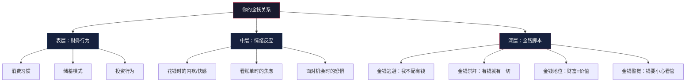
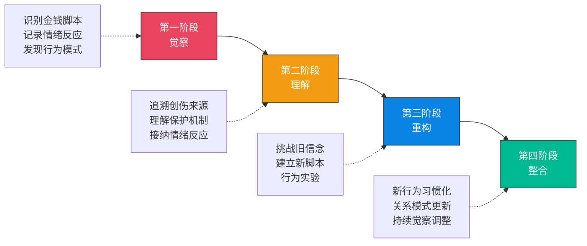

## 五、金钱关系修复

### 5.1 什么是"金钱关系"——你以为你在管钱，其实钱在管你

大多数人从未想过"我和钱的关系"这个说法。钱不就是工具吗？银行账户里的数字而已，有什么"关系"可言？

但这恰恰是问题的根源。

**金钱关系**（Money Relationship）是你对金钱的全部情感反应、行为模式和潜意识信念的总和。它不是你"知道"的东西，而是你在面对金钱时"自动发生"的东西——看到账单时的焦虑，花钱时的内疚，看到别人赚大钱时的嫉妒，面对投资机会时的恐惧或冲动。这些反应不是理性的计算，而是情感的自动化程序。

心理学家布拉德·克朗茨（Brad Klontz）在对超过1000名来访者进行临床研究后发现：**人们最深层的财务行为——赚钱、花钱、存钱、投资、赠予——有超过80%是由他们意识不到的金钱脚本驱动的**。你不是在"选择"怎么花钱，你是在"执行"一个从小就被写入潜意识的程序。



#### 金钱关系不健康的12个信号

如果你符合以下3个以上，说明你的金钱关系需要修复：

| 信号 | 具体表现 | 背后的金钱脚本 |
|------|---------|---------------|
| 财务回避 | 不看账单、不查余额、不想谈钱 | 金钱逃避 |
| 情绪化消费 | 心情不好就买东西，买完又后悔 | 情绪调节依赖 |
| 收入停滞 | 收入到了某个水平就怎么也上不去 | 潜意识自我设限 |
| 财务自我破坏 | 快要攒够钱时总有意外花掉 | 不配得感 |
| 炫耀性消费 | 买超出能力的东西给别人看 | 金钱地位脚本 |
| 过度节俭 | 有钱也不敢花，严重影响生活质量 | 金钱警觉过度 |
| 财务焦虑 | 对未来有持续的财务恐惧 | 安全感缺失 |
| 为钱争吵 | 和伴侣反复因钱产生冲突 | 金钱脚本冲突 |
| 用钱控制 | 用金钱来控制或操纵他人 | 金钱=权力 |
| 为钱出卖 | 为了钱做自己不喜欢的事 | 金钱崇拜脚本 |
| 财务秘密 | 对伴侣/家人隐瞒真实财务状况 | 金钱羞耻感 |
| 永远不够 | 无论赚多少都觉得不够 | 匮乏感内核 |

### 5.2 金钱关系的损伤从哪里来——六种常见创伤模式

金钱关系的损伤不是天生的，而是在成长过程中被"编程"进去的。了解你的损伤来源，是修复的第一步。

#### 5.2.1 匮乏创伤——"钱总是不够的"

**形成场景**：在经济困难的家庭中长大，经历过父母为钱发愁、争吵、甚至断粮断电的日子。

**核心信念**："资源是有限的，如果不紧紧抓住，就会失去一切。"

**典型行为模式**：
- 即使收入很高，仍然感到不安全
- 过度囤积（食物、物品、现金）
- 对"浪费"有强烈的道德审判感
- 无法享受消费，花钱时总有罪恶感
- 对价格极度敏感，花大量时间比价

**深层机制**：童年时期的资源匮乏在大脑的杏仁核中留下了深刻的威胁记忆。即使成年后经济状况已经改善，杏仁核仍然会对任何"可能失去资源"的信号产生过度反应——这就是为什么你明明有钱，却总觉得不够。

#### 5.2.2 遗弃创伤——"钱会离开我"

**形成场景**：经历过家庭经济的突然崩溃（破产、失业、父母离婚导致的经济剧变），或者在需要钱时被拒绝。

**核心信念**："好的东西不会持久，钱随时可能消失。"

**典型行为模式**：
- 有钱就想赶紧花掉（"反正会失去"）
- 无法做长期财务规划
- 对投资极度恐惧（"会亏光"）
- 或者相反——极度保守，只持有现金

#### 5.2.3 羞耻创伤——"我不配有钱"

**形成场景**：在成长过程中因为家庭贫穷而被嘲笑、歧视，或者被灌输"有钱人是坏人"的观念。

**核心信念**："有钱意味着变坏/背叛自己的出身。"

**典型行为模式**：
- 收入增加时莫名其妙地花钱或做错误投资
- 对"赚钱"有道德上的不适感
- 和穷朋友在一起时感到安全，和有钱人在一起时感到不适
- 在获得财务成功后感到"不像自己"

#### 5.2.4 背叛创伤——"钱让我被人利用"

**形成场景**：因为钱被人欺骗、背叛过（借钱不还、商业欺诈、亲友因钱翻脸）。

**核心信念**："钱会破坏关系，有钱就会被人利用。"

**典型行为模式**：
- 在金钱事务上过度戒备
- 不愿意借钱给任何人，包括亲密的人
- 在合作关系中过度控制财务
- 宁可少赚钱也要避免依赖他人

#### 5.2.5 欺骗创伤——"关于钱的话都是谎言"

**形成场景**：在成长中发现父母对钱撒谎（隐瞒债务、隐瞒收入、虚假的财务安全感），或者自己被金融诈骗过。

**核心信念**："不能相信任何关于钱的信息。"

**典型行为模式**：
- 对任何财务建议都持怀疑态度
- 不信任专业人士（理财师、会计师）
- 要么完全不管钱，要么事无巨细地控制

#### 5.2.6 控制创伤——"钱是权力和控制的工具"

**形成场景**：在家庭中，钱被用来作为控制手段——"我赚钱养家，所以你必须听我的"。

**核心信念**："有钱才有话语权，没钱就只能被控制。"

**典型行为模式**：
- 极度追求经济独立，不能接受任何经济帮助
- 或者反过来——通过赚钱来控制他人
- 在亲密关系中对财务权力分配极度敏感

### 5.3 金钱关系修复的四阶段模型

金钱关系的修复不是"想通了"就能完成的，它需要一个结构化的过程。以下是经过临床验证的四阶段修复模型：



#### 阶段一：觉察——看见你和钱的真实关系（第1-2周）

大多数人一辈子都没有真正"看见"过自己的金钱关系。他们只是在自动运行脚本，从不质疑。觉察阶段的目标是让你从"无意识执行者"变成"有意识的观察者"。

**练习1：金钱情绪日记**

连续7天，记录每一次与金钱相关的情绪反应：

```text
日期：____
时间：____
场景：（发生了什么？看到了什么？）
情绪反应：（具体感受：焦虑/内疚/兴奋/恐惧/愤怒...）
强度：（1-10分）
身体感受：（心跳加速/胸闷/手心出汗/胃部不适...）
自动想法：（脑海中闪过的念头）
行为反应：（你做了什么？）
```

**关键提醒**：不要评判自己的情绪。"我又乱花钱了"不是觉察，是自我批判。觉察是中立地观察——"我注意到在看到这件衣服时，我的情绪强度是8分，胸口发紧，脑海中闪过'我现在需要这个'的念头，然后我买了它。"

**练习2：金钱脚本回忆**

找一个安静的时间，用以下问题引导自己回忆童年中与金钱有关的关键记忆：

1. 你第一次意识到"钱"是什么时候？发生了什么？
2. 你父母最常说的关于钱的话是什么？（原话）
3. 你家里关于钱的争吵是什么样的？
4. 你第一次因为钱感到羞耻/恐惧/兴奋是什么时候？
5. 你家对"有钱人"和"穷人"的态度是什么？
6. 你小时候想要一个很贵的东西时，父母怎么回应的？
7. 你家有没有因为钱发生过重大事件？你当时的感受？

把回答写下来，不要分析，只是记录。这些记忆就是你金钱脚本的"源代码"。

#### 阶段二：理解——你的金钱关系是如何被塑造的（第2-4周）

在觉察到自己的金钱模式之后，下一步是理解这些模式从何而来。这个阶段不是为了找人背锅，而是为了**看到因果关系**——当你理解了"为什么我会这样"，你就能从自我批判中解脱出来。

**练习3：金钱脚本基因图谱**

画出你家庭中三代人的金钱模式：

```text
祖辈：
- 外公外婆的经济状况和金钱态度：____
- 爷爷奶奶的经济状况和金钱态度：____

父辈：
- 父亲的收入模式、消费习惯、投资态度：____
- 母亲的收入模式、消费习惯、投资态度：____
- 父母之间关于钱的互动模式：____

自己：
- 我继承了哪些金钱模式？____
- 我反叛了哪些金钱模式？____
- 我目前的金钱脚本类型：____
```

**案例：小王的金钱脚本基因图谱**

小王（化名）发现自己总是"赚多少花多少"，30岁了存款不到2万。通过画金钱脚本基因图谱，他发现：

- 爷爷辈：经历过三年困难时期，极度节俭，家里永远囤着大量粮食
- 父亲：从极度匮乏中长大，成年后"报复性消费"——"我小时候受够了苦，现在要对自己好一点"
- 小王自己：继承了父亲的"报复性消费"模式，但内核其实是爷爷辈的匮乏创伤——"如果现在不享受，以后就没机会了"

理解了这个链条之后，小王意识到：他的消费模式不是"贪图享受"，而是对匮乏恐惧的过度补偿。这个理解让他从自我批判中解脱出来，开始有针对性地修复。

#### 阶段三：重构——建立新的金钱信念和行为（第4-12周）

这是修复的核心阶段。你需要做三件事：**挑战旧信念、建立新脚本、用行为实验验证新信念**。

**技术1：认知重构——挑战你的金钱信念**

这是认知行为疗法（CBT）的核心技术。对于每一个你识别出的金钱脚本，用以下五个问题来挑战它：

| 步骤 | 问题 | 示例（针对"我不配有钱"） |
|------|------|------------------------|
| 1. 识别信念 | 我的核心金钱信念是什么？ | "我不配拥有很多钱" |
| 2. 寻找证据 | 支持这个信念的证据是什么？ | "我从小家里就没钱" |
| 3. 寻找反证 | 反对这个信念的证据是什么？ | "我通过努力获得了现在的工作，我的能力值这个薪水" |
| 4. 评估影响 | 这个信念对我的财务行为有什么影响？ | "我不敢要求加薪，不敢投资，赚到钱就想花掉" |
| 5. 建立替代 | 一个更合理、更有帮助的信念是什么？ | "我的价值不由出身决定，我有能力创造和管理财富" |

**技术2：行为实验——用行动验证新信念**

新信念如果不通过行为验证，就只是"想通了"但没有"做到"。行为实验是连接认知和行为的桥梁。

**行为实验模板**：

```text
实验名称：____
旧信念：____
新假设：____
实验设计：（具体做什么？）
预期结果：（旧信念预测会发生什么？）
实际结果：（实际发生了什么？）
结论：（这个实验支持旧信念还是新假设？）
```

**行为实验示例集**：

| 旧信念 | 行为实验 | 可能的结果 |
|--------|---------|-----------|
| "花钱就是浪费" | 刻意花100元买一件"不实用但让自己开心"的东西，观察一周后的感觉 | 发现这100元带来了持续的好心情，性价比极高 |
| "投资一定会亏" | 用500元买一只指数基金，持有3个月，不看日报只看月报 | 发现波动没有想象中可怕，3个月后可能小赚 |
| "我不配要求加薪" | 准备好自己的业绩清单，和主管约一次正式的薪资讨论 | 即使没加薪，也会获得有价值的反馈，且提升了自信 |
| "有钱人都是坏人" | 列出你认识或知道的5个"有钱且人品好"的人 | 发现"有钱=坏人"的信念根本站不住脚 |
| "钱会让关系变质" | 和伴侣进行一次坦诚的财务对话，分享各自的金钱恐惧 | 发现沟通后关系更亲密了，而不是变质了 |

**技术3：渐进式脱敏——降低金钱情绪的强度**

对于有严重金钱焦虑的人（比如看到账单就恐慌、谈钱就紧张），可以使用系统脱敏的方法逐步降低情绪强度：

**脱敏阶梯示例（以"查看财务状况"为例）**：

| 阶级 | 行为 | 预期焦虑（0-10） | 实际焦虑 |
|------|------|----------------|---------|
| 1 | 想象自己在查看银行余额 | 3 | __ |
| 2 | 打开银行APP但不看数字 | 4 | __ |
| 3 | 只看银行余额的个位数 | 5 | __ |
| 4 | 查看本月收入和支出总额 | 6 | __ |
| 5 | 逐项查看本月所有消费记录 | 7 | __ |
| 6 | 查看所有账户的总资产 | 8 | __ |
| 7 | 制作完整的资产负债表 | 9 | __ |
| 8 | 和伴侣/朋友讨论自己的财务状况 | 10 | __ |

**操作要点**：从焦虑等级最低的开始，每级练习到焦虑降至3分以下再进入下一级。每级可能需要重复3-5次。不要跳级，不要急于求成。

#### 阶段四：整合——让新的金钱关系成为默认模式（第12周以后）

修复的最终目标不是"知道"新的金钱信念，而是让新的行为模式变成自动化反应——就像旧脚本曾经自动运行一样，新脚本也需要被训练到自动运行的程度。

**练习4：金钱关系愿景板**

用文字或图像描述你理想中的金钱关系：

- 我希望在花钱时感到____（而不是焦虑/内疚）
- 我希望在赚钱时感到____（而不是恐惧/羞耻）
- 我希望和伴侣讨论钱时感到____（而不是紧张/防备）
- 我希望在查看财务状况时感到____（而不是逃避/恐慌）
- 我希望金钱在我的生活中扮演____的角色（而不是控制/被控制）

把这份愿景放在你每天能看到的地方。它不是"目标"，而是"方向"——你不需要完美地达到它，你只需要持续地朝它前进。

**练习5：新的金钱仪式**

用新的仪式替代旧的自动化反应：

| 旧的自动化反应 | 替代仪式 | 训练频率 |
|---------------|---------|---------|
| 看到打折就买 | 24小时冷静期：记下来，24小时后再决定 | 每次冲动 |
| 看到账单就逃避 | 固定"金钱时间"：每周日下午花20分钟查看财务 | 每周一次 |
| 投资亏损就恐慌 | 预设应对方案：提前写好"如果亏X%我会做Y" | 每次投资前 |
| 发工资就报复性消费 | "先储蓄后消费"：工资到账当天自动转入储蓄 | 每月一次 |
| 和伴侣因钱吵架 | "金钱约会"：每月一次，在轻松环境下讨论财务 | 每月一次 |

### 5.4 四种金钱脚本的专项修复方案

不同类型的金钱脚本需要不同的修复策略。以下是针对四种脚本的专项方案：

#### 5.4.1 金钱逃避脚本的修复

**核心挑战**：你不是不知道该管钱，而是潜意识在阻止你管钱——因为"管钱"意味着直面你和钱的关系，而你的脚本告诉你"钱是坏的/危险的"。

**修复策略**：

1. **最小行动法**：不要试图一次改变所有。从最小的行动开始——今天只做一件事：查看你的银行余额。就这一件事。做到了就是成功。

2. **重新定义"管钱"**：你不需要成为一个"理财高手"。把"管钱"重新定义为"照顾自己的财务安全"——就像每天刷牙一样，是一种自我照顾，而不是一种负担。

3. **设置自动化系统**：利用自动化工具绕过你的回避倾向——设置工资自动转账到储蓄账户、自动还信用卡、自动定投。这样你"不看"钱也会被管理。

4. **寻找财务伙伴**：找一个你信任的人（伴侣、朋友、理财师），让他们帮你定期检查财务状况。你不需要独自面对。

#### 5.4.2 金钱崇拜脚本的修复

**核心挑战**：你把过多的人生意义投注在金钱上，以至于金钱成了你情感需求的替代品。

**修复策略**：

1. **需求审计**：列出你希望通过金钱获得的5样东西（安全感、认可、自由、快乐、控制感）。然后问自己：除了钱之外，还有什么方式可以满足这些需求？

2. **"够了"清单**：写下"对我来说，财务上'够了'是什么标准"——具体到数字。当你达到了这个标准，允许自己停下来。

3. **情感账户充值**：每周至少做一件不花钱但能带来满足感的事——运动、社交、创作、志愿服务。逐步建立"不依赖金钱也能获得满足"的能力。

4. **感恩练习**：每天写下3件与金钱无关的、你感恩的事。训练大脑关注非金钱价值。

#### 5.4.3 金钱地位脚本的修复

**核心挑战**：你把自己的价值和金钱捆绑在一起，需要通过外在的财务表现来证明自己的价值。

**修复策略**：

1. **价值拆分练习**：写下"我是谁"的10个答案，其中不能有与金钱相关的。如果写不出来，这本身就说明了问题。

2. **消费觉察**：每次购物前问自己——"如果没有人知道我买了这个，我还会买吗？"如果答案是"不会"，这就是炫耀性消费。

3. **社交圈审计**：审视你的社交圈——你是因为"真实的连接"还是因为"经济水平相似"才和这些人在一起的？

4. **匿名善举**：做一些不被看到的好事。训练自己从"内在满足"而不是"外在认可"中获得价值感。

#### 5.4.4 金钱警觉脚本的修复

**核心挑战**：你的问题不是不够自律，而是过度自律——你已经把"节俭"变成了一种身份认同，以至于花钱会让你感到"不像自己"。

**修复策略**：

1. **"享受预算"**：每月专门拨出一笔钱，这笔钱的唯一用途就是"享受"。如果你不花完这笔钱，下个月不会累积——这是你"必须"花掉的钱。

2. **价值消费**：把消费分为"消耗型"（买了就贬值）和"投资型"（能带来长期价值）。允许自己在"投资型"消费上大方——比如健康、教育、体验、高质量的耐用品。

3. **安全边际计算**：计算你实际需要多少"安全垫"（通常6个月生活费）。超过这个数字的部分，允许自己更自由地使用。

4. **给予练习**：每月做一件"不求回报的给予"——请朋友吃饭、给家人买礼物、捐款。训练自己体验"钱流动出去"而不感到恐惧。

### 5.5 金钱关系修复中的伴侣工作

金钱关系不只是你一个人的事——如果你有伴侣，你们各自的金钱脚本会互相碰撞、放大或抵消。

#### 5.5.1 金钱脚本冲突的常见模式

| 脚本组合 | 冲突表现 | 典型场景 |
|---------|---------|---------|
| 逃避 vs 警觉 | 一方回避管钱，一方过度控制 | "你怎么连账单都不看！" "你怎么什么都要管！" |
| 崇拜 vs 警觉 | 一方追求更多收入，一方追求更多储蓄 | "我们应该投资！" "我们应该存钱！" |
| 地位 vs 逃避 | 一方要买贵的展示，一方觉得钱不重要 | "别人家都开这个车" "车不就是个代步工具吗" |
| 匮乏 vs 崇拜 | 一方害怕花钱，一方觉得花钱才能享受 | "这个太贵了" "人生苦短，对自己好一点" |

#### 5.5.2 伴侣金钱关系修复的五个步骤

**步骤1：各自独立完成金钱脚本测试**

不要一起做。各自独立识别自己的金钱脚本类型和创伤来源。在了解自己之前，不要试图"修正"对方。

**步骤2：分享各自的金钱故事**

安排一个专门的时间（不是在吵架之后），在轻松的环境下各自分享：
- 你小时候关于钱的记忆
- 你家对钱的态度
- 你最害怕的财务场景
- 你对钱最大的期望

**规则**：只听不评判。对方的金钱脚本是他的童年经历塑造的，不是他的"错"。

**步骤3：识别冲突模式**

对比两人的金钱脚本，找出冲突点。不是要分出谁对谁错，而是要看到——冲突不是因为"对方有问题"，而是因为两种不同的金钱脚本在碰撞。

**步骤4：建立共同的财务架构**

根据两人的脚本特点，设计一个兼顾双方需求的财务系统：

```text
共同账户：____（用于共同支出，每人贡献____%）
个人账户：____（各人自由支配，互不过问）
享受预算：____（每月固定的"不心疼"消费额度）
储蓄目标：____（共同商定的安全垫和目标）
大额消费规则：____（超过____元需要共同商议）
```

**步骤5：定期"金钱约会"**

每月安排一次"金钱约会"——在轻松的环境下（不是在家里对着电脑），花30-60分钟：
- 回顾本月的财务状况
- 讨论下个月的计划
- 表达对对方在财务方面努力的感谢
- 讨论任何财务上的担忧或需求

### 5.6 何时需要专业帮助

金钱关系修复大部分可以自助完成，但以下情况建议寻求专业心理咨询：

| 情况 | 为什么需要专业帮助 |
|------|-----------------|
| 一想到钱就恐慌发作 | 可能存在焦虑症，需要系统脱敏和可能的药物辅助 |
| 因为钱的问题有自杀想法 | 严重心理健康危机，需要立即干预 |
| 强迫性购物无法自控 | 可能是冲动控制障碍，需要专业治疗 |
| 金钱问题导致严重家庭暴力 | 人身安全优先，需要法律和心理双重支持 |
| 童年经历严重的经济虐待 | 深层创伤需要专业创伤治疗（如EMDR） |
| 自助6个月以上没有改善 | 可能存在你意识不到的深层障碍 |

**寻找合适的专业帮助**：
- 选择有认知行为疗法（CBT）背景的咨询师
- 最好有财务心理学或行为经济学的交叉知识
- 第一次咨询时，说明你的金钱脚本类型和主要困扰
- 准备好至少8-12次咨询的投入——金钱关系的修复不是一两次就能完成的

### 5.7 修复过程中的常见障碍与应对

#### 障碍1：反复——"我以为我已经好了，结果又犯了"

**真相**：反复是修复过程的正常组成部分，不是失败。旧脚本运行了几十年，不会因为你想通了几次就消失。

**应对**：把反复看作"数据"而不是"失败"。每次反复时问自己——"这次触发我的是什么？我在什么情境下最容易回到旧模式？"这些信息会帮你更精准地识别需要修复的深层模式。

#### 障碍2：伴侣不配合——"只有我一个人在努力"

**真相**：你只能改变自己，不能改变对方。但你的改变会影响整个关系系统。

**应对**：专注于修复自己的金钱关系。当你的金钱脚本变得更健康时，你和伴侣之间的互动模式自然会发生变化——因为你不再是那个"触发"对方旧脚本的人了。

#### 障碍3：进展太慢——"我都练习一个月了怎么还没好"

**真相**：金钱关系的修复是以"月"和"年"为单位的，不是以"天"和"周"为单位。几十年形成的模式，需要持续的练习才能改变。

**应对**：设置过程指标而不是结果指标。不要问"我的金钱焦虑好了吗"，而要问"这个星期我做了几次金钱情绪日记？我完成了几个行为实验？"过程做到了，结果自然会来。

#### 障碍4：自我批判——"我怎么这么蠢会相信这些"

**真相**：你的金钱脚本不是你"选择"的，它是你在童年时期为了适应环境而自动形成的保护机制。它在当时是合理的、有用的——只是现在不再适用了。

**应对**：对自己的旧脚本说"谢谢你的保护，但我不再需要你了"。感恩它曾经保护过你，同时坚定地选择新的模式。

### 5.8 本节小结

金钱关系修复的核心要点：

1. **你的财务行为有80%是由你意识不到的金钱脚本驱动的**——知道和做到之间的鸿沟，根源在心理而不在知识。

2. **金钱关系的损伤不是你的错**——它是你的成长环境、家庭经历、社会文化共同塑造的。理解这一点，是修复的起点。

3. **修复是一个四阶段的过程**：觉察（看见模式）→ 理解（追溯来源）→ 重构（建立新信念和行为）→ 整合（让新模式成为默认）。

4. **不同类型的金钱脚本需要不同的修复策略**——识别你的脚本类型，选择针对性的方案。

5. **修复不是一个人的事**——如果你有伴侣，你们的金钱脚本在互相影响。伴侣工作是修复的重要组成部分。

6. **反复是正常的**——不要因为反复而放弃。每一次反复都是更深入了解自己的机会。

> **行动清单**：今天就做第一件事——打开金钱情绪日记模板，记录今天与金钱相关的第一个情绪反应。不需要分析，不需要改变，只需要观察。这是你和金钱关系修复的起点。

***
