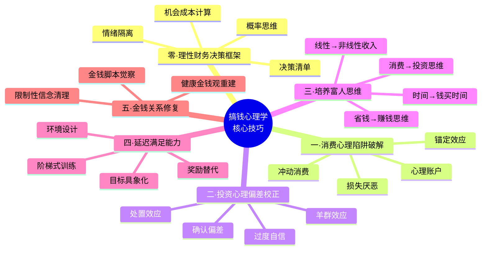
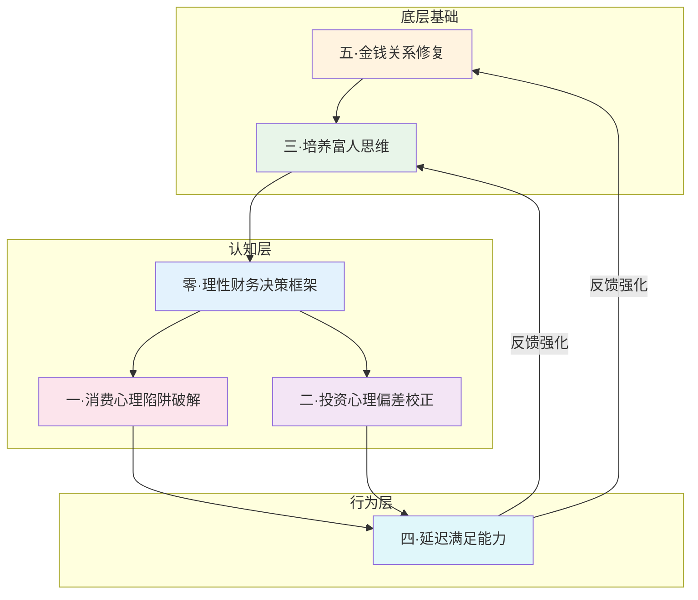

## 本节小结

本节围绕"搞钱心理学"的六大核心技巧展开，从理性决策框架到消费陷阱识别，从投资偏差校正到富人思维培养，从延迟满足能力建设到金钱关系修复，构建了一套完整的心理操作系统。以下是对本节内容的系统梳理、知识图谱和行动指南。

### 1. 六大核心技巧全景回顾



| 技巧编号 | 名称 | 核心问题 | 解决什么 |
|----------|------|----------|----------|
| 零 | 理性财务决策框架 | 如何在情绪干扰下做出理性财务决策？ | 建立系统化的决策流程，减少情绪化判断 |
| 一 | 消费心理陷阱破解 | 为什么总是忍不住多花钱？ | 识别并破解商家利用的心理弱点 |
| 二 | 投资心理偏差校正 | 为什么投资总是亏多赚少？ | 校正影响投资收益的认知偏差 |
| 三 | 培养富人思维 | 为什么努力工作却始终攒不下钱？ | 从思维模式层面重塑与金钱的关系 |
| 四 | 延迟满足能力 | 为什么明知道该存钱却总是做不到？ | 建立抵御即时诱惑的心理肌肉 |
| 五 | 金钱关系修复 | 为什么对金钱有莫名的焦虑或恐惧？ | 修复深层的金钱创伤和限制性信念 |

### 2. 六大技巧的逻辑关系

六大核心技巧并非孤立存在，而是构成了一个层层递进、相互支撑的体系：



**底层基础（技巧五 → 技巧三）**：金钱关系修复是所有改变的前提。如果你内心深处对金钱充满恐惧、羞耻或不安全感，任何技巧都难以持续执行。在此基础上，培养富人思维为你提供了正确的认知框架——从"为钱工作"转变为"让钱为你工作"。

**认知层（技巧零 → 技巧一/二）**：理性财务决策框架是日常操作的核心工具，它将底层思维转化为可执行的决策流程。消费陷阱破解和投资偏差校正则是这个框架在两个最重要场景中的具体应用——一个管"流出"，一个管"流入"。

**行为层（技巧四）**：延迟满足能力是连接认知与行动的桥梁。知道该怎么做（认知层）和真正能做到（行为层）之间的鸿沟，正是由延迟满足能力来填补的。而行为的正反馈又会反过来强化底层的金钱信念和富人思维，形成良性循环。

### 3. 各技巧核心要点提炼

#### 3.1 理性财务决策框架——做决策的"操作系统"

**核心原则**：在情绪平静时制定规则，在情绪波动时执行规则。

**四步决策流程**：
1. **暂停**——感受到冲动时，强制等待（24小时规则适用于消费，72小时规则适用于投资）
2. **记录**——写下决策理由、预期结果、最坏情况
3. **评估**——用机会成本框架计算这笔钱的替代用途
4. **执行**——如果通过了前三步，果断执行；如果没有，果断放弃

**关键工具**：
- 财务决策清单：列出你容易犯的错误，在每次重大决策前逐项检查
- 情绪温度计：1-10分评估自己当前的情绪状态，低于4分或高于8分时不做重大财务决策
- 机会成本计算器：将金额换算为"10年后的投资收益"（按年化8%计算，1万元10年后约等于2.16万元）

#### 3.2 消费心理陷阱破解——守住钱包的"防火墙"

**四大陷阱与对应策略**：

| 陷阱 | 商家怎么用 | 你怎么破 |
|------|-----------|---------|
| 锚定效应 | 先展示高价，再展示"优惠价" | 独立估值 + 至少三家比价 + 换算为工作时间 |
| 损失厌恶 | "限时""限量""免费试用" | 问自己"如果没有这个优惠，我还会买吗？" |
| 心理账户 | 让你把"意外收入"当"可以乱花的钱" | 所有收入统一管理，意外收入直接转入投资账户 |
| 冲动消费 | 制造情绪触发（焦虑、攀比、即时快感） | 24小时法则 + 购物清单 + 情绪检查 |

**日常习惯养成**：
- 每月初制定消费预算，分配到具体类别
- 取消关注所有购物类社交媒体和推送通知
- 每月底回顾实际支出与预算的差异，分析偏差原因
- 建立"想要清单"：把想买的东西写下来，30天后仍然想要再买

#### 3.3 投资心理偏差校正——投资收益的"隐形杀手"

**五大偏差的危害与校正**：

| 偏差 | 典型表现 | 校正方法 |
|------|---------|---------|
| 过度自信 | 频繁交易，认为自己能"跑赢市场" | 交易日记 + 与沪深300对比 + 降低交易频率 |
| 羊群效应 | 追涨杀跌，跟风投资 | 独立思考清单 + 远离噪音 + 反向指标思维 |
| 处置效应 | 赚了一点就卖，亏了死扛不卖 | 止损止盈规则 + 定期再平衡 + 换位思考 |
| 沉没成本 | "都投了这么多了，不能放弃" | 假装自己是新投资者重新评估 |
| 确认偏差 | 只看支持自己观点的信息 | 主动搜索反面证据 + 魔鬼代言人 |

**最重要的一个习惯**：建立投资日志。每一笔买入和卖出，都记录：(1) 决策理由，(2) 当时的情绪状态，(3) 预期收益和时间，(4) 实际结果。每季度复盘一次，你会惊讶地发现自己的判断准确率远低于想象。这个习惯本身就是对过度自信最有效的解药。

#### 3.4 富人思维培养——从"打工人心态"到"资产拥有者"

**五大思维转变**：

| 穷人思维 | 富人思维 | 实操行动 |
|----------|----------|----------|
| 这个月赚了多少能花多少 | 这个月能投资多少 | 发工资先转30%到投资账户 |
| 用更多时间赚更多钱 | 用钱买别人的时间 | 计算时薪，低于时薪的任务外包 |
| 工作1小时赚1小时的钱 | 一次投入持续产出 | 将知识/技能产品化（课程、工具） |
| 省钱就是赚钱 | 赚钱的空间远大于省钱 | 建立基本消费纪律后，全力提升收入 |
| 追求稳定和安全感 | 接受不确定性追求成长 | 用10%-20%资源探索新收入机会 |

**关键认知升级**：省钱有下限（不可能降到零），赚钱无上限。在建立了基本的消费纪律之后，把主要精力从"如何少花钱"转移到"如何多赚钱"上，才是财富增长的正道。

#### 3.5 延迟满足能力——连接"知道"和"做到"的桥梁

**为什么延迟满足是搞钱的核心能力**：所有财富积累的本质都是"现在少消费，未来多回报"。没有延迟满足能力，再好的理财知识也只是纸上谈兵。

**阶梯式训练法**：

| 阶段 | 训练内容 | 持续时间 | 目标 |
|------|---------|---------|------|
| 入门 | 每天推迟一个小消费（如下午茶） | 2周 | 建立"暂停"的神经通路 |
| 进阶 | 每周设置一个"无消费日" | 1个月 | 体验"不消费也不会怎样" |
| 高级 | 每月将一笔"想要"的钱转入投资账户 | 3个月 | 建立"延迟=增值"的正反馈 |
| 大师 | 制定1年/3年/5年财务目标并严格执行 | 持续 | 让延迟满足成为本能 |

**环境设计比意志力更可靠**：
- 删除手机上的支付快捷方式，增加消费的"摩擦力"
- 设置自动转账：工资到账当天自动转出储蓄和投资部分
- 将投资账户的APP放在手机首屏，将购物APP放在第三屏文件夹里
- 找一个同样在攒钱的朋友，互相监督和鼓励

#### 3.6 金钱关系修复——一切改变的地基

**为什么金钱关系修复排在最后讲但其实最重要**：如果你的潜意识里认为"有钱人都不是好人""钱是万恶之源""我不配拥有财富"，那么无论你学了多少技巧，都会在关键时刻"自我破坏"——在即将成功时做出错误决策，或者在赚到钱后无意识地把钱花光。

**金钱脚本觉察练习**：
1. 回忆童年时家里关于钱的场景和对话
2. 写下你父母常说的关于钱的话（如"钱要省着花""有钱人都很坏"）
3. 识别这些信念如何影响了你现在的财务行为
4. 有意识地用更健康的信念替代（如"钱是工具，善用它能帮助更多人"）

**修复的四个层次**：


### 4. 从知道到做到：90天行动计划

理论再好，不执行等于零。以下是将六大核心技巧转化为日常行为的90天行动计划：

#### 第一阶段：觉察与基础（第1-30天）

**目标**：了解自己的金钱心理现状，建立基本的决策框架。

| 周次 | 行动项 | 对应技巧 |
|------|--------|----------|
| 第1周 | 完成金钱脚本自测问卷，写下与金钱相关的童年记忆 | 技巧五 |
| 第2周 | 连续7天记录所有消费，标注每笔消费时的情绪 | 技巧一 |
| 第3周 | 制定月度消费预算，设置自动储蓄转账 | 技巧零 |
| 第4周 | 回顾过去3个月的投资决策，找出情绪化操作 | 技巧二 |

#### 第二阶段：训练与强化（第31-60天）

**目标**：通过刻意练习建立新的行为模式。

| 周次 | 行动项 | 对应技巧 |
|------|--------|----------|
| 第5周 | 实践"24小时法则"，记录每次冲动消费的前后对比 | 技巧一 |
| 第6周 | 开始阶梯式延迟满足训练（入门级） | 技巧四 |
| 第7周 | 建立投资日志，记录每一笔投资决策的理由 | 技巧二 |
| 第8周 | 计算自己的时薪，识别可以外包的低价值任务 | 技巧三 |

#### 第三阶段：巩固与扩展（第61-90天）

**目标**：将新行为固化为习惯，开始看到实际效果。

| 周次 | 行动项 | 对应技巧 |
|------|--------|----------|
| 第9周 | 升级延迟满足训练到进阶级别，每周一个无消费日 | 技巧四 |
| 第10周 | 识别一个可以产品化的技能，开始制作最小可行产品 | 技巧三 |
| 第11周 | 完成第一次投资复盘，对比实际收益与市场基准 | 技巧二 |
| 第12周 | 全面回顾90天变化，调整下阶段计划 | 全部 |

### 5. 常见误区与纠正

在学习和实践搞钱心理学的过程中，以下误区需要特别警惕：

**误区一：学了理论就能改变行为**
- 错误认知：看了很多理财书，感觉自己已经"懂了"
- 真实情况：知识≠能力，知道≠做到。神经科学研究表明，改变一个习惯平均需要66天的刻意练习
- 纠正方法：每学一个技巧，立刻设计一个21天的小实验去实践它

**误区二：矫枉过正——从乱花钱变成极度抠门**
- 错误认知：既然要延迟满足，那就什么都不买
- 真实情况：过度压抑消费欲望会导致报复性消费，比之前花得更多
- 纠正方法：保留"自由消费"预算（月收入的5%-10%），在这个额度内不需要有任何负罪感

**误区三：忽视金钱关系修复，直接学"技巧"**
- 错误认知：那些"原生家庭""金钱脚本"太虚了，我要的是实战技巧
- 真实情况：深层信念会在关键时刻自动激活，让你无意识地做出自我破坏的行为
- 纠正方法：花至少一周时间认真完成金钱脚本觉察练习，这是所有技巧的地基

**误区四：追求速效，期望立竿见影**
- 错误认知：学了搞钱心理学，下个月就能多赚一万
- 真实情况：心理模式的改变是渐进的，财务改善更是需要时间积累
- 纠正方法：设定90天为一个观察周期，关注行为改变而非收入数字

**误区五：把"富人思维"理解为"不花钱"**
- 错误认知：富人思维就是把所有钱都拿去投资
- 真实情况：富人思维的核心是"让每一块钱都产生最大价值"，包括合理消费带来的生活品质提升
- 纠正方法：区分"浪费"和"投资性消费"——花在学习、健康、人脉上的钱是投资，不是浪费

### 6. 进阶：建立你的个人财务心理档案

对于希望更深入地理解和改善自己财务心理的读者，建议建立一份个人财务心理档案，持续记录和追踪：

```markdown
# 我的财务心理档案

## 基本信息
- 当前阶段：[入门/进阶/高级]
- 主要财务目标：[具体、可量化、有时间限制]
- 最大的心理障碍：[具体描述]

## 金钱脚本记录
- 童年金钱记忆：[具体场景]
- 父母的金钱信念：[具体语句]
- 我继承的限制性信念：[具体表述]
- 我正在建立的新信念：[具体表述]

## 消费心理追踪
- 本月冲动消费次数：[数字]
- 最容易冲动消费的场景：[具体描述]
- 成功抵制冲动消费的次数：[数字]
- 使用的策略：[具体方法]

## 投资心理追踪
- 本月交易次数：[数字]
- 情绪化决策占比：[百分比]
- 与市场基准的收益对比：[具体数字]
- 最大的偏差类型：[过度自信/羊群效应/处置效应等]

## 延迟满足训练进度
- 当前阶段：[入门/进阶/高级/大师]
- 连续坚持天数：[数字]
- 累计延迟消费金额：[数字]
- 转入投资账户的金额：[数字]

## 月度复盘
- 最大的进步：[具体描述]
- 最需要改进的：[具体描述]
- 下月重点：[具体行动]
```

### 7. 核心技巧速查卡

以下速查卡可以打印出来贴在显眼位置，在需要时快速提醒自己：

**做消费决策前问自己（技巧零+一）**：
1. 我现在的情绪状态如何？（情绪温度计评分）
2. 如果没有标价，我愿意为这个东西付多少钱？
3. 这笔钱如果投资10年，能增值到多少？
4. 24小时后我还会想买吗？
5. 我是在用购物缓解情绪吗？

**做投资决策前问自己（技巧零+二）**：
1. 我真的理解这个投资机会吗？
2. 如果没有别人在买，我还会买吗？
3. 我能承受的最坏情况是什么？
4. 我有没有只看支持自己观点的信息？
5. 这个决策的理由写下来，经得起半年后的复盘吗？

**感觉坚持不下去时问自己（技巧四+五）**：
1. 我为什么想要财务自由？（具体化到生活场景）
2. 我的金钱信念中，哪些是父母的而不是我的？
3. 如果我今天不消费这笔钱，一周后我会在意吗？
4. 我是在追求"看起来有钱"还是"真的有钱"？

### 8. 与前面章节的衔接

本节作为"核心技巧"的总结，向下承接"理论基础"部分的心理学原理，向上对接"实战案例"部分的真实场景应用：

- **理论基础**提供了"为什么"——为什么我们会做出非理性的财务决策
- **核心技巧**提供了"怎么做"——用什么方法来纠正这些非理性行为
- **实战案例**提供了"看别人怎么做"——通过真实故事加深理解和信心

建议在阅读实战案例时，尝试识别每个案例中涉及了哪些核心技巧，以及案例主人公是如何从"知道"一步步走向"做到"的。这种主动的关联思考，比被动阅读有效十倍。

---

> **一句话总结**：搞钱的本质不是学更多理财技巧，而是修复你与金钱的心理关系，建立理性的决策框架，然后通过延迟满足能力将认知转化为行动。心理操作系统升级了，财务结果自然会跟着改善。
