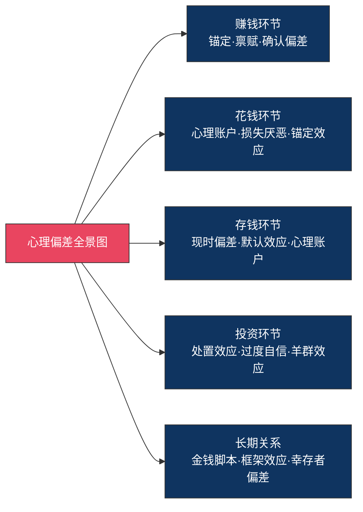

## 零、心理偏差对搞钱的影响全景图

### 为什么你需要一张全景图

先看一组数据：行为金融学的大量实证研究表明，普通散户投资者的长期年化收益率比市场大盘低 3-5 个百分点（Dalbar 年度 QAIB 报告），其中约 70% 的收益差距来自心理偏差驱动的错误决策，而非信息不足或技术不够。诺贝尔经济学奖得主丹尼尔·卡尼曼在《思考，快与慢》中总结道：**人类不是偶尔犯错的理性人，而是偶尔理性的犯错者。**

搞钱领域尤其如此。你的每一次消费决策、投资判断、储蓄行为、职业选择，都同时受到十几个心理偏差的影响——而你通常只意识到其中一两个，甚至一个都没有意识到。这就是为什么"知道怎么做"和"真正做到"之间隔着一道巨大的鸿沟。

本节是整个理论基础的开篇，目的是让你在深入学习每个具体偏差之前，先建立一张完整的认知地图。就像你去一个陌生城市，先看一眼全景地图，再逐个街区探索，效率远高于闷头乱走。

---

### 全景分类：12 个核心心理偏差速览

下面这张表概括了对搞钱影响最大的 12 个心理偏差，按影响的财务环节分类。每个偏差后面标注了"偏差强度"（对财务决策的影响程度，1-5 星）和"觉察难度"（一般人意识到自己有这个偏差的难度，1-5 星）。后续理论基础的各个文件会逐一深入讲解。

| 序号 | 心理偏差 | 影响环节 | 一句话解释 | 偏差强度 | 觉察难度 |
|:---:|---------|---------|-----------|:-------:|:-------:|
| 1 | 锚定效应 | 消费·投资 | 第一个看到的数字会"锚定"你的判断 | ★★★★ | ★★★★ |
| 2 | 损失厌恶 | 消费·投资 | 失去 100 元的痛苦是得到 100 元快乐的 2-2.5 倍 | ★★★★★ | ★★★ |
| 3 | 心理账户 | 消费·储蓄 | 同样是钱，来源和用途不同，花法完全不同 | ★★★★ | ★★★★ |
| 4 | 处置效应 | 投资 | 赢了急着卖，输了死拿着——赢小亏大 | ★★★★★ | ★★★★★ |
| 5 | 过度自信 | 投资·赚钱 | 高估自己的判断力，低估不确定性 | ★★★★ | ★★★★★ |
| 6 | 确认偏差 | 投资·赚钱 | 只看到支持自己判断的证据，忽略反面信息 | ★★★★ | ★★★★ |
| 7 | 羊群效应 | 投资·消费 | 别人都在做，所以我也应该做 | ★★★★ | ★★ |
| 8 | 现时偏差 | 储蓄·投资 | 今天的 100 元比明天的 100 元更有吸引力 | ★★★★★ | ★★★ |
| 9 | 禀赋效应 | 投资·消费 | 自己拥有的东西，总觉得比别人的更值钱 | ★★★ | ★★★★ |
| 10 | 框架效应 | 消费·投资 | 同样的信息，表述方式不同，决策完全不同 | ★★★★ | ★★★★★ |
| 11 | 幸存者偏差 | 赚钱·投资 | 只看到成功者，看不到失败者 | ★★★ | ★★★★ |
| 12 | 沉没成本谬误 | 消费·投资·赚钱 | 已经花了这么多，不能放弃——越陷越深 | ★★★★ | ★★★ |

> **阅读提示**：这张表不需要现在就全部记住。它的作用是建立全局认知——后续每一节都会深入讲解其中 1-3 个偏差，届时再回到这张表，你会发现理解不断加深。

---

### 按赚钱环节拆解：每个环节有哪些偏差在捣乱

#### 赚钱环节的偏差——你的收入天花板是怎么被压低的

很多人以为收入高低只取决于能力和努力，但心理偏差在赚钱环节的影响力被严重低估了。

**过度自信偏差**让你高估自己的市场价值，导致在该跳槽时不跳槽、该谈薪时不谈薪，或者相反——低估了创业的风险而盲目辞职。一项针对美国职场人的研究发现，约 68% 的人认为自己的工作能力排在前 25%，这种不切实际的自信会让人错过真正的成长机会。

**确认偏差**让你只关注支持自己职业选择的信息。选择留在体制内的人只看"35 岁被裁员"的新闻来安慰自己；选择创业的人只看"某某白手起家"的故事来鼓励自己。两种人都在用信息过滤器保护自己，而不是在做真正的职业规划。

**幸存者偏差**是赚钱领域最危险的偏差之一。你看到的是马云、比尔·盖茨的励志故事，看不到的是那些用了同样的策略却失败的成千上万人。这会让你对"高风险高回报"的路径产生系统性的乐观偏差。具体来说：

- 你看到有人靠短视频年入百万，看不到 99% 的创作者月收入不足 1000 元
- 你看到有人炒股翻了十倍，看不到同一时期 70% 的散户在亏钱
- 你看到有人辞职创业成功，看不到创业公司 5 年存活率不足 7%

**禀赋效应**在职场中的表现是"舒适区锁定"——你对已经拥有的工作、职位、人际关系产生过度的依恋，即使客观上已经到了该改变的时候。"这份工作虽然工资不高，但稳定啊"——这句话背后往往是禀赋效应在作祟。

#### 花钱环节的偏差——你的钱是怎么不知不觉流走的

消费环节是心理偏差最密集的战场。商家比你自己更了解你的心理弱点，并且系统性地利用它们。

**锚定效应**是消费领域最常见的偏差。"原价 999，现价 199"——这个 999 就是商家精心设置的锚。即使你理性上知道这个商品可能本来就值 199，但大脑会自动以 999 为参照点，让你觉得"赚了 800"。房产中介先带你看最贵最差的房子，再带你看目标房源，也是同样的原理。更隐蔽的锚定：

- 餐厅菜单上故意放几个超高价菜品，让其他菜品显得"合理"
- 电商平台的"划线价"——即使从未以那个价格销售过
- 薪资谈判中先出价的一方设定的锚

**损失厌恶**是消费心理学的核心引擎。"限时优惠，仅剩最后 3 件"——这不是在告诉你商品有多好，而是在激活你"怕错过"的恐惧。研究表明，人们对"失去一个机会"的敏感度是对"获得一个好处"的 2-2.5 倍。商家利用损失厌恶的常见手段包括：

- 限时折扣（你怕"损失"这个优惠）
- 免费试用（你怕"损失"已经习惯的服务）
- 积分即将过期（你怕"损失"已积累的积分）
- "你的购物车里有 3 件商品即将售罄"（你怕"损失"选好的商品）

**心理账户**让你对不同来源的钱有截然不同的消费态度。工资精打细算，年终奖挥金如土；中了 500 元彩票，当晚就花 800 元请客——大脑把"意外之财"归入"随便花"的账户，把"辛苦钱"归入"省着花"的账户。但钱就是钱，100 元的购买力不会因为来源不同而改变。

**框架效应**在消费中的威力巨大。同样一瓶水："含有 24 种矿物质"让你觉得健康值钱，"含有微量重金属"让你避之不及——而这两句描述可能说的是同一瓶水。"95% 瘦肉"和"5% 肥肉"让你做出完全不同的购买决策，尽管它们在数学上完全等价。

#### 存钱环节的偏差——为什么你总是存不下钱

存钱是所有财务行为中"反人性"程度最高的，因为它要求你用今天的确定性去交换明天的不确定性。这正是心理偏差最活跃的温床。

**现时偏差（Present Bias）**是存钱最大的敌人。行为经济学家发现，人们对即时满足的偏好是非线性的：今天的 100 元和明天的 105 元之间，大脑几乎毫不犹豫选今天的 100 元；但一年后的 100 元和一年零一天后的 105 元之间，大脑会理性地选 105 元。问题在于，"明天"永远是"明天"——你每天面对的都是"今天"的诱惑。

现时偏差的日常表现：

- "这个月先享受，下个月再存钱"——但下个月还是这句话
- "反正也存不了多少，不如花了"——用小数目合理化不存钱
- "投资太麻烦了，以后再说"——直到复利窗口期过去
- "先还最低还款额就行"——让信用卡利息滚雪球

**默认效应**是一个被严重低估的偏差。研究发现，当储蓄被设为默认选项时（如美国 401(k) 的自动加入机制），参与率从 50% 以下飙升到 90% 以上。仅仅因为"默认"的力量——人们倾向于不做改变，维持现状。这意味着：如果你没有主动设置自动转账到储蓄账户，你的默认状态就是"不存钱"。

**心理账户**在这里也有影响。很多人在心理上把"储蓄"和"消费"视为两个对立的账户，觉得存钱就是"亏待自己"。但如果把储蓄重新框架为"给未来的自己买自由"，心理感受会完全不同——这就是框架效应和心理账户的交互作用。

#### 投资环节的偏差——散户为什么总在亏钱

投资是心理偏差影响最直接、后果最严重的领域。散户的"赢小亏大"模式几乎完全由心理偏差驱动。

**处置效应**是投资心理学中被研究最充分的偏差之一。投资者倾向于：

- 过早卖出盈利的股票（"落袋为安"——锁定收益的快感）
- 过久持有亏损的股票（"不卖就没亏"——回避确认损失的痛苦）

以色列学者 Odean 分析了 10000 个散户账户的数据，发现投资者卖出盈利股票的概率比卖出亏损股票高 1.5 倍。如果反过来操作——持有赢家、卖出输家——收益率可以提高 4.1 个百分点。处置效应的根源是损失厌恶：确认亏损的痛苦太大，以至于大脑宁可选择"假装没亏"的鸵鸟策略。

**过度自信偏差**在投资中表现为：

- 高估自己的选股能力（"我研究过，这只股票一定会涨"）
- 低估市场的不确定性（"这次不一样"）
- 过度交易（交易越频繁，扣除手续费后收益越差——Barber & Odean 2000 年的经典研究证明，交易最频繁的 20% 散户年化收益比最不频繁的低 7 个百分点）
- 集中持仓（"我很有把握，不需要分散"）

**确认偏差**让投资者在买入一只股票后，自动过滤掉负面信息：

- 只关注利好新闻，忽略利空信号
- 在论坛和社群中只看多头的分析
- 对公司的问题"选择性失明"
- 当股价下跌时，到处找"这只是暂时调整"的证据

**羊群效应**是市场泡沫和恐慌的放大器。当身边所有人都在赚钱时，FOMO（Fear of Missing Out）驱使你入场——这往往发生在市场接近顶部的时候。当恐慌蔓延时，所有人都在卖出，你也会在最不该卖的时候卖出。2015 年 A 股从 5178 点暴跌到 2850 点的过程中，大量散户在 4000 点以上追涨、在 3000 点以下割肉，完美演绎了"追涨杀跌"。

**锚定效应**在投资中的表现是"成本锚定"——你的买入价成了心理锚点。当股价从 50 元跌到 30 元时，你不是客观评估 30 元是否是合理价格，而是一直拿 30 元和 50 元比，觉得"亏了 40%，太亏了"。反过来，当股价从 50 元涨到 80 元时，你觉得"已经涨了 60%，太高了"——而没有评估 80 元本身是否合理。

---

### 偏差之间的交互作用：1+1>2 的叠加效应

心理偏差很少单独起作用。在真实的财务决策中，多个偏差往往同时激活，产生叠加效应。

另一个典型的叠加场景是"冲动消费的陷阱"：

1. **锚定效应**：先看到原价 2000 元
2. **框架效应**：现在"只要" 599 元，打了三折
3. **损失厌恶**：限时优惠，过了今天就没了
4. **心理账户**：这是"省钱"，不是"花钱"
5. **现时偏差**：现在拥有比以后再说更爽

五个偏差叠加的结果：你买了一件根本不需要的东西，还觉得自己"赚了"。

更隐蔽的叠加发生在长期理财行为中。**现时偏差**让你今天不存钱，**过度自信**让你相信"以后能赚更多"，**心理账户**让你把年终奖当意外之财花掉，**默认效应**让你没有设置自动储蓄——结果是收入涨了，存款没涨，你始终在原地踏步。

理解偏差的交互作用之所以重要，是因为它解释了为什么单点突破（比如只学习"不要追涨杀跌"）往往效果有限。你需要建立一个系统性的偏差觉察能力，才能在复杂决策中识别出多个同时激活的偏差。

---

### 偏差的生物学基础：为什么它们如此根深蒂固

心理偏差不是"不理性"的产物——恰恰相反，它们是大脑在漫长的进化过程中形成的高效决策机制。理解这一点很重要，因为它决定了你应对偏差的策略：你不能"消灭"这些偏差，只能觉察它们、绕过它们。

| 偏差类型 | 进化起源 | 原始功能 | 现代失效场景 |
|---------|---------|---------|------------|
| 损失厌恶 | 草原生存 | 对危险的快速反应（丢失食物可能致命） | 投资止损、消费决策 |
| 群体跟随 | 部落生活 | 跟随多数人可以避免危险 | 投资追涨杀跌 |
| 现时偏差 | 食物稀缺环境 | 抓住眼前食物，因为明天可能没有 | 储蓄和长期投资 |
| 过度自信 | 狩猎竞争 | 自信者更容易获得资源和配偶 | 投资判断和职业决策 |
| 锚定效应 | 快速估计 | 用已知信息快速估算未知量 | 价格判断和谈判 |

这些偏差之所以难以克服，是因为它们运行在大脑的"系统 1"——快速、自动、直觉性的认知系统中（卡尼曼的双系统理论）。理性的"系统 2"虽然可以覆盖系统 1 的判断，但需要消耗大量认知资源，而且速度很慢。在你还没来得及启动系统 2 之前，系统 1 已经帮你做完了决策。

这就是为什么本章的核心策略不是"用意志力对抗偏差"，而是**通过环境设计和预设规则来绕过偏差**——在偏差激活之前就把正确的选择设为默认选项。具体的方法论会在核心技巧部分展开。

---

### 从全景到深入：后续各节的学习地图

理解了全景图之后，理论基础的后续各节会逐个深入：

| 后续文件 | 深入的心理偏差 | 与本节全景图的关系 |
|---------|-------------|----------------|
| 一、金钱脚本理论 | 金钱脚本的四大类型 | 第一层：偏差的深层根源——你为什么会有这些偏差 |
| 二、消费心理学 | 锚定效应、损失厌恶、心理账户、框架效应 | 第二层：花钱环节的偏差机制与商家利用手法 |
| 三、投资心理学 | 处置效应、过度自信、确认偏差、羊群效应 | 第二层：投资环节的偏差机制与市场行为 |
| 四、富人思维 vs 穷人思维 | 思维模式差异 | 第三层：偏差固化后的思维范式 |
| 五、延迟满足 | 现时偏差 | 第二层：储蓄环节的核心偏差 |
| 六、金钱与幸福 | 幸福的收入阈值 | 第四层：搞钱的终极目的——偏差校正后的人生目标 |

**学习建议**：在读完每个后续文件之后，回到本节的全景图，把学到的偏差放到整体框架中。你会发现，每多理解一个偏差，全景图就变得更清晰、更立体。当所有偏差都理解完毕后，你再看自己的每一个财务决策，都会像开了"偏差透视眼"一样。

---

### 快速自测：你目前受哪些偏差影响最大？

在深入学习之前，先做一个快速自检。对以下 12 个描述，诚实回答"是"或"否"：

| 序号 | 描述 | 对应偏差 | 如果回答"是" |
|:---:|------|---------|------------|
| 1 | 看到打折就忍不住买，即使不需要 | 锚定效应 + 损失厌恶 | 你的消费决策被价格框架深度影响 |
| 2 | 年终奖/红包花起来比工资大方得多 | 心理账户 | 你对不同来源的钱有不同的消费标准 |
| 3 | 股票赚了一点就想卖，亏了反而一直拿着 | 处置效应 | 你在投资中"赢小亏大" |
| 4 | 觉得自己比大多数人更懂投资 | 过度自信 | 你可能交易过于频繁 |
| 5 | 买入股票后只看利好消息 | 确认偏差 | 你在投资中存在信息过滤 |
| 6 | 别人都在买的东西，自己也想试试 | 羊群效应 | 你的决策受群体情绪影响较大 |
| 7 | 总是"下个月再开始存钱" | 现时偏差 | 你的储蓄行为被即时满足绑架 |
| 8 | 觉得自己手里的东西比别人的更值钱 | 禀赋效应 | 你可能高估了自己的持仓和资产价值 |
| 9 | "含 95% 瘦肉"比"含 5% 肥肉"更想买 | 框架效应 | 你的判断被信息呈现方式左右 |
| 10 | 看到成功者的故事就觉得自己也能行 | 幸存者偏差 | 你可能低估了失败的概率 |
| 11 | 已经投入了很多，不想放弃 | 沉没成本 | 你可能在错误的方向上越陷越深 |
| 12 | 不太敢看自己的账单或账户余额 | 金钱逃避脚本 | 你可能存在金钱焦虑 |

**评分方式**：回答"是"的数量越多，说明心理偏差对你的影响越大。但这不是考试——没有"好"或"差"的分数。认识到自己有偏差，本身就是改变的第一步。

如果你回答了 8 个以上"是"，不要焦虑——大多数人都是如此。行为经济学几十年的研究反复证明，心理偏差是人类的默认设置，不是你个人的缺陷。好消息是：觉察到偏差的存在，就等于把偏差的影响降低了一半。

---

### 本节核心要点回顾

1. **心理偏差是普遍存在的**——不是你不够聪明或不够理性，而是大脑的进化遗产。每个人都受影响。
2. **偏差影响搞钱的每个环节**——赚钱、花钱、存钱、投资，无一幸免。
3. **偏差会叠加**——在复杂决策中，多个偏差同时激活，产生 1+1>2 的效应。
4. **觉察是改变的第一步**——你不需要消灭偏差，只需要在偏差激活时认出它。
5. **系统性解决方案优于单点突破**——环境设计和预设规则比意志力更可靠。

> **下一步**：带着这张全景图，进入下一节"金钱脚本理论"，你会理解这些偏差的深层根源——它们不是随机出现的，而是根植于你童年形成的金钱信念之中。
