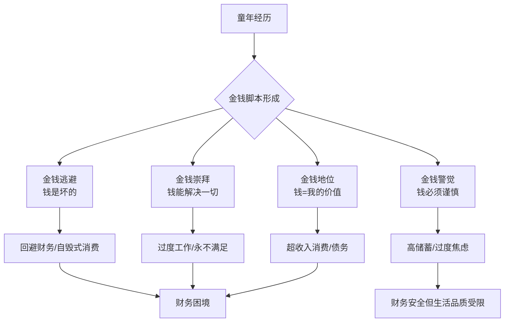
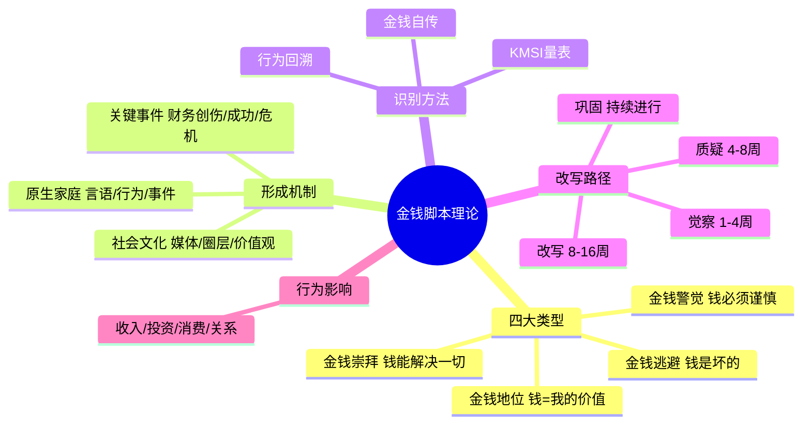

## 一、金钱脚本理论

### 1.1 什么是金钱脚本

金钱脚本（Money Script）是由美国心理学家布拉德·克朗茨（Brad Klontz）和他的父亲泰德·克朗茨（Ted Klontz）在2000年代初期提出的概念。克朗茨是临床心理学家、注册理财规划师（CFP），长期在林肯金融集团（Lincoln Financial Advisors）担任行为金融学顾问。他通过对数千名来访者的临床观察和实证研究，发现人们的财务行为背后存在一套深层的、往往是无意识的金钱信念系统——这就是"金钱脚本"。

**为什么叫"脚本"？** 这个隐喻来自埃里克·伯恩（Eric Berne）的交互分析理论（Transactional Analysis）。在伯恩的框架中，"人生脚本"是童年时期形成的一套无意识决策，决定着一个人一生的模式。克朗茨借用这一隐喻，指出金钱脚本同样具有以下特征：

| 特征 | 说明 |
|------|------|
| **无意识性** | 你不知道自己在"执行"它，就像演员不觉得自己在演戏 |
| **早期形成** | 绝大多数在7岁前就已基本定型 |
| **自我验证** | 脚本会引导你做出让它"看起来正确"的行为 |
| **代际传递** | 父母的脚本会几乎原封不动地传给子女 |
| **顽固性** | 即使理性上知道不对，情感上仍难以摆脱 |

克朗茨的研究成果发表在《金融治疗杂志》（Journal of Financial Therapy）和多本著作中，包括《Mind Over Money》（2009）和《The Financial Wisdom of Ebenezer Scrooge》（2006）。他在2012年的研究中开发了"金钱脚本量表"（Klontz Money Script Inventory, KMSI），这是一个经过信效度验证的心理测量工具，包含44个题项，能够系统地识别个体的主导金钱脚本类型。

#### 四大金钱脚本类型详解

克朗茨将金钱脚本分为四大类型。每一种都有独特的认知模式、行为表现和财务后果。

**第一类：金钱逃避脚本（Money Avoidance）**

核心信念：钱是坏的/危险的/不重要的，我不配拥有财富。

典型内在独白：
- "有钱人都是坏人、贪婪的人"
- "钱是万恶之源"
- "我配不上那么多钱"
- "谈钱伤感情，谈钱很俗"
- "钱会让人变坏"
- "追求金钱是精神上的堕落"

**行为表现：**
- 收入一旦增加，就无意识地加速花掉（潜意识在"处理掉"让他们不舒服的财富）
- 回避查看银行余额、账单、投资账户
- 在能赚钱的机会面前莫名退缩
- 拒绝加薪谈判或把价格定得很低（自雇者尤其常见）
- 把钱借给别人明知不会还的"朋友"
- 当面临财务成功时产生内疚感，做出自毁式消费

**心理机制：** 金钱逃避者往往在童年经历过与金钱相关的创伤——父母因钱吵架、家道中落的羞耻感、或被灌输"清贫即美德"的价值观。他们的大脑建立了"金钱=痛苦/罪恶"的条件联结，导致他们在无意识中回避财富。

**数据佐证：** 克朗茨2012年的研究表明，金钱逃避脚本与个人收入和净资产呈显著负相关（r = -0.28, p < 0.01）。持有高金钱逃避信念的人，年收入平均比同等条件者低23%。

---

**第二类：金钱崇拜脚本（Money Worship）**

核心信念：更多的钱能解决一切问题，钱是幸福的源泉。

典型内在独白：
- "如果我有更多钱，一切都会好起来"
- "钱能买到幸福"
- "赚钱是人生最重要的事"
- "我永远不会觉得钱够了"
- "只要赚到X万，我就满足了"（但X永远在提高）
- "没有钱什么都不是"

**行为表现：**
- 为了赚钱牺牲健康、家庭关系和个人兴趣
- 不断提高"足够"的标准，永远不满足
- 过度工作，无法休息，休假时焦虑
- 把生活中的问题都归因于"钱不够"
- 忽视人际关系的经营，认为"有了钱什么都会有"
- 可能为了赚钱走捷径甚至违法

**心理机制：** 金钱崇拜者通常在童年经历过匮乏感——不一定是真正的贫穷，而是父母对金钱的焦虑传递了"我们不够"的感觉。他们把金钱符号化为安全、爱、尊重和自我价值的替代品。即使外在条件改善了，内在的匮乏感依然存在，因为真正缺乏的不是钱，而是情感上的安全感和被接纳感。

**数据佐证：** 克朗茨的研究发现，金钱崇拜脚本与工作成瘾（r = 0.35）、婚姻不满（r = 0.31）和财务焦虑（r = 0.42）高度相关。有趣的是，它与实际收入的相关性很弱（r = 0.08），说明这个信念并不能真正带来财富增长。

---

**第三类：金钱地位脚本（Money Status）**

核心信念：我的价值等于我的净资产，别人通过我的消费来评判我。

典型内在独白：
- "我的价值取决于我有多少钱"
- "有钱就应该让别人看到"
- "别人会通过我开什么车、住什么房来评价我"
- "买贵的东西才能显示身份"
- "如果我看起来很成功，我就是成功的"
- "没钱就是失败者"

**行为表现：**
- 超收入水平消费——开超出自己负担能力的车、住超出负担的房
- 热衷购买奢侈品和名牌，尤其是可见的标志
- 隐瞒自己的财务困难，在朋友面前"装"
- 经常性地进行"地位消费"——不是因为需要，而是因为别人在看
- 社交媒体上炫耀消费
- 很容易陷入信用卡债务和消费贷款

**心理机制：** 金钱地位脚本的核心是"外在自我"主导了财务决策。这类人往往在成长过程中经历过社会比较带来的羞耻感——被嘲笑穿得差、家里穷、上的学校不好。他们长大后的消费模式本质上是在修复童年的自我价值创伤，用物质符号来"证明"自己的价值。

**数据佐证：** 金钱地位脚本是与财务问题最高度相关的脚本类型，与过度消费（r = 0.48）、财务压力（r = 0.45）和强迫性消费（r = 0.41）均呈强正相关。持有高金钱地位信念的人，信用卡债务平均高出同等收入者67%。

---

**第四类：金钱警觉脚本（Money Vigilance）**

核心信念：金钱需要谨慎管理，不应让别人知道我的财务状况。

典型内在独白：
- "存钱很重要"
- "不应该让别人知道我有多少钱"
- "花钱应该谨慎，每一分钱都要值得"
- "要为未来做好充分准备"
- "靠人不如靠己，只有钱靠得住"
- "借钱是可耻的"
- "不管赚多少都要低调"

**行为表现：**
- 高储蓄率，坚持记账，严格预算
- 对投资过度谨慎，偏向保守策略
- 拒绝借钱给别人，也拒绝向别人借钱
- 不愿和任何人（包括伴侣）讨论财务详情
- 对退休储蓄有过度焦虑
- 可能因为过度节俭而降低生活质量
- 对"享受性消费"有强烈内疚感

**心理机制：** 金钱警觉脚本通常来自经历过经济动荡的家庭——经历过大萧条的祖辈、经历过经济改革的父辈、或经历过家庭变故的童年。他们的核心恐惧是"失去一切"，因此发展出高度警觉的财务管理策略。适度的金钱警觉是唯一一个总体上"有益"的脚本——它与较高的净资产、较低的债务和较好的财务行为相关。但过度的警觉会导致生活品质下降、焦虑和社交回避。

**数据佐证：** 克朗茨的研究显示，金钱警觉脚本与净资产正相关（r = 0.22），与过度消费负相关（r = -0.19）。但当警觉程度超过阈值时，与焦虑障碍（r = 0.33）和亲密关系困难（r = 0.27）显著相关。这说明它是一把双刃剑。

#### 四大脚本对比总览

| 维度 | 金钱逃避 | 金钱崇拜 | 金钱地位 | 金钱警觉 |
|------|----------|----------|----------|----------|
| 核心恐惧 | 金钱让我变坏 | 永远不够 | 被人看不起 | 失去一切 |
| 消费模式 | 无意识挥霍 | 为赚钱不惜代价 | 超收入消费 | 过度节俭 |
| 储蓄行为 | 不看账单 | 储蓄率低 | 几乎为零 | 储蓄率过高 |
| 投资态度 | 回避投资 | 追逐高回报 | 跟风投机 | 过度保守 |
| 与收入的关系 | 负相关 | 弱相关 | 弱相关 | 正相关 |
| 与债务的关系 | 正相关 | 正相关 | 强正相关 | 负相关 |
| 与幸福感的关系 | 负相关 | 负相关 | 负相关 | 先正后负 |
| 最大代价 | 错失财富机会 | 牺牲健康与关系 | 债务危机 | 焦虑与吝啬 |

### 1.2 金钱脚本的形成机制

金钱脚本不是凭空产生的，它们是家庭、文化和个人经历共同塑造的产物。理解其形成机制，是改写脚本的前提。

#### 原生家庭：脚本的"出厂设置"

原生家庭是金钱脚本最核心的来源。孩子在0-7岁期间处于"海绵吸收期"，他们不是在"学习"金钱观念，而是在"下载"——不经过批判性思维的过滤，直接内化为自己的信念系统。

**四种家庭影响通道：**

**通道一：父母的言语**

父母反复说的话会变成孩子内心的声音。如果一个父亲每次看到别人开豪车都说"有钱人没一个好东西"，孩子的大脑会自动建立"有钱=坏人"的联结。这些话在当时的语境中可能只是发泄，但对孩子来说就是"真相"。

常见的有毒金钱言语清单：
- "我们家穷，买不起" → 孩子学到"匮乏是常态"
- "钱要省着花"（但不解释为什么） → 孩子学到"花钱是危险的"
- "你看看别人家的孩子/父母" → 孩子学到"金钱=比较=羞耻"
- "有钱有什么用，你看那谁家多有钱还不是离婚了" → 孩子学到"金钱和幸福矛盾"
- "好好读书以后赚大钱" → 孩子学到"学习的目的只是赚钱"
- "谈钱伤感情" → 孩子学到"金钱和关系是互斥的"

**通道二：父母的行为**

孩子更多地通过观察而非说教来学习。如果父母嘴上说"要节约"，但行为上频繁冲动消费，孩子学到的是"钱可以随便花"而非"要节约"。

关键观察点：
- 父母是如何赚钱的？稳定工资还是不稳定的收入？
- 父母是如何花钱的？是否有预算？冲动消费多吗？
- 父母是如何存钱的？是否有储蓄习惯？
- 父母之间如何讨论钱？公开透明还是回避吵架？
- 父母是否让孩子参与家庭财务讨论？

**通道三：家庭的经济事件**

重大经济事件会在孩子的金钱脚本中留下深刻的烙印：

- **家庭破产/重大损失：** 可能导致金钱逃避（"钱不可靠"）或极度金钱警觉（"永远要存够18个月的应急金"）
- **突然暴富：** 可能导致金钱崇拜（"赚钱很容易"）或金钱地位（"有钱就是不一样"）
- **长期贫困：** 可能导致金钱崇拜（"有了钱就有一切"）或金钱地位（"再也不让人看不起"）
- **父母失业：** 可能导致极度金钱警觉和对"稳定"的过度依赖

**通道四：代际传递**

金钱脚本有极强的代际传递性。克朗茨的研究发现，如果父母持有强烈的某种脚本，子女持有同类型脚本的概率超过70%。这种传递不是通过基因，而是通过环境——孩子在18年里每天8小时以上的"浸泡"中，几乎不可能不被塑造。

更重要的是，金钱脚本往往跨越代际"升级"：祖辈经历大萧条（极度节俭）→ 父辈"补偿性挥霍"（过度消费）→ 孙辈"罪疚性回避"（对钱产生复杂情绪）→ 曾孙辈"重置"为某种极端。这种模式被称为"财务创伤的代际回响"。

#### 社会文化：脚本的"社会操作系统"

家庭之外，社会文化也在持续塑造我们的金钱脚本：

**媒体与消费主义：** 现代媒体的核心商业模式就是制造"你还不够好"的感觉。广告不断告诉你：用了这个产品你会更美、开了这辆车你会更有地位、买了这个包你会更被尊重。长期暴露在这样的信息中，金钱地位脚本和金钱崇拜脚本会被强化。

**社交圈层：** 你的朋友圈决定了你的"参照系"。如果你的社交圈平均消费水平高于你的收入，你就很容易产生金钱地位脚本。研究发现，当一个人的邻居收入高于自己30%以上时，其消费支出会增加约12%——这不是因为收入增加了，而是因为"相对匮乏感"驱动了消费。

**文化价值观：** 不同文化对金钱的态度截然不同。儒家文化圈中"君子喻于义，小人喻于利"的传统可能强化金钱逃避脚本；美国梦叙事中"白手起家"的神话可能强化金钱崇拜脚本；中国改革开放后"让一部分人先富起来"的叙事可能强化金钱地位脚本。

#### 关键事件：脚本的"催化剂"

某些特定事件会显著强化或改变金钱脚本：

- **第一次感受到"穷"的羞耻：** 被同学嘲笑衣服旧、被老师区别对待、被喜欢的人因为穷而拒绝
- **第一次看到"钱的威力"：** 看到有钱人获得特权、看到钱解决了某个"不可能"的问题
- **第一次经历经济危机：** 家里突然没钱了、父母为钱吵架到离婚
- **第一次赚到"大钱"：** 强化了"我行"或"赚钱很容易"的信念
- **第一次重大财务损失：** 被骗、投资亏损、借钱不还

这些关键事件往往在情绪最强烈时被"刻印"进潜意识，形成脚本的"锚点"——此后每当遇到类似情境，大脑就会自动调用当时的信念和应对策略。

### 1.3 金钱脚本的识别方法

识别自己的主导金钱脚本是改写的第一步。以下提供三种层次递进的识别方法。

#### 方法一：克朗茨金钱脚本量表（KMSI）

克朗茨开发的标准化量表包含44个题项，分为4个子量表（每个类型11题）。以下是简化版的核心题项（每题1-5分，1=强烈不同意，5=强烈同意）：

**金钱逃避子量表（部分题项）：**
1. 有钱人往往不快乐
2. 我不配有钱
3. 拥有太多钱是不好的
4. 我不擅长管钱
5. 有钱人通常不诚实

**金钱崇拜子量表（部分题项）：**
1. 如果我有更多钱，我的问题就会消失
2. 钱是生活中最重要的东西
3. 我永远不会觉得钱够了
4. 钱能买到幸福
5. 我的收入应该比我父母高得多

**金钱地位子量表（部分题项）：**
1. 别人对我的看法取决于我有多少钱
2. 我只买最好的东西
3. 我的车/房子代表了我的成功程度
4. 花钱大方才能交到朋友
5. 如果我看起来成功，我就是成功的

**金钱警觉子量表（部分题项）：**
1. 我从来不告诉别人我有多少钱
2. 存钱比花钱更让我开心
3. 我应该在银行里始终有足够的应急金
4. 借钱是可耻的
5. 花钱时我总是很紧张

计算方法：将每个子量表的得分相加，得分最高的就是你的主导脚本类型。如果两个类型的得分接近，说明你是一个"混合型"脚本持有者——这比单一类型更常见。

#### 方法二：金钱自传法

量表给你分数，自传给你故事。写下你的"金钱自传"，这是深度识别脚本的有效方法。

**具体操作：**

1. **回忆童年：** 写下你最早关于金钱的记忆。不需要是很戏剧化的事件，日常画面更重要——妈妈数钱的样子、爸爸谈到工资时的表情、全家人讨论"买不买"的场景。

2. **梳理家庭叙事：** 你家关于金钱的"官方故事"是什么？是"我们家一直不富裕但很幸福"，还是"你爷爷那一代……"，还是"钱的事不用你操心"？

3. **识别情绪触发点：** 什么时候你对钱有最强烈的情绪反应？是看到别人炫富时的愤怒？是签大额合同时的恐惧？是花钱后第二天的内疚？是收到意外收入时的不安？

4. **模式分析：** 写完后回头看，找出反复出现的主题、情绪和叙事。

#### 方法三：行为回溯法

如果你不擅长回忆和文字表达，可以从"现在"入手——通过分析当前的财务行为来反推脚本。

**自问清单：**

| 行为特征 | 可能指向的脚本 |
|----------|---------------|
| 你有多少次查看银行余额时感到焦虑或刻意回避？ | 金钱逃避 |
| 你是否经常觉得"赚到X万就好了"，但到X后又提高标准？ | 金钱崇拜 |
| 你是否买过明知超出预算但"别人都有"的东西？ | 金钱地位 |
| 你是否有一个明确的储蓄目标并且从不放松？ | 金钱警觉 |
| 你是否有过"莫名其妙花光一大笔钱"的经历？ | 金钱逃避 |
| 你是否曾为了工作完全忽略家人和健康？ | 金钱崇拜 |
| 你是否在社交媒体上夸大自己的生活水平？ | 金钱地位 |
| 你是否拒绝任何形式的贷款，包括合理的房贷？ | 金钱警觉 |

### 1.4 金钱脚本的改写路径

识别脚本是第一步，但真正的改变需要系统化的改写。这不是"想通了就行"的事——脚本根植于神经回路中，改写它需要重复、刻意和持续的练习。

#### 第一阶段：觉察（1-4周）

目标：让你从"无意识地执行脚本"变成"有意识地观察脚本"。

**练习一：金钱日记**
每天花5分钟记录与金钱相关的想法、情绪和行为。重点关注：
- 今天我在什么时候想到了钱？想到了什么？
- 今天在花钱/赚钱/存钱时我的情绪是什么？
- 今天有没有什么财务行为让我事后感到奇怪或后悔？

**练习二：脚本触发器识别**
开始留意什么场景会触发你的脚本。比如：
- 金钱逃避者：收到大额账单、别人谈收入、被要求做财务规划
- 金钱崇拜者：看到别人赚大钱、自己收入增长停滞、需要做"不赚钱但重要"的事
- 金钱地位者：参加同学聚会、刷到炫富内容、被问到"你做什么工作"
- 金钱警觉者：看到高风险高回报的机会、伴侣要买"不必要的"东西、存钱进度落后

**练习三：家庭脚本回溯**
和父母或年长的家庭成员交谈，了解他们对金钱的态度和经历。你可能会发现惊人的代际模式——你正在无意识地重复或反叛父母的金钱脚本。

#### 第二阶段：质疑（4-8周）

目标：用理性分析动摇脚本的"天然正确性"。

**练习四：脚本法庭**
把你的主导脚本当成"被告"，你是法官。列出所有支持和反对这个信念的证据：
- "钱是万恶之源"——支持的证据？反对的证据？（钱也资助了教育、医疗、艺术）
- "有钱人都是坏人"——支持的证据？反对的证据？（有没有你认识的好人恰好有钱？）

**练习五：功能分析**
问自己：这个信念为我"做了什么"？
- 金钱逃避："钱是坏的"让我避免了什么？（避免了追求财富可能带来的失败和评判）
- 金钱崇拜："更多钱就好了"让我避免了什么？（避免了面对真实的情感和关系问题）
- 金钱地位："我得看起来成功"让我避免了什么？（避免了面对自我价值的内在空虚）
- 金钱警觉："不能让别人知道"让我避免了什么？（避免了被借钱、被利用的可能）

当你看到脚本其实在"保护"你免受某种恐惧时，改写就不是否定自己，而是升级策略。

**练习六：认知重构工作表**

| 原始脚本 | 识别来源 | 支持证据 | 反对证据 | 替代信念 |
|----------|----------|----------|----------|----------|
| 例：钱是万恶之源 | 父亲常说 | 一些犯罪因钱而起 | 钱也资助了公益事业 | 钱是中性工具 |
| 你的脚本：____ | ____ | ____ | ____ | ____ |

#### 第三阶段：改写（8-16周）

目标：建立新的神经回路，让健康信念逐渐成为自动反应。

**练习七：新脚本宣言**
将替代信念转化为第一人称的肯定句，每天早晚各朗读3遍。关键是用现在时态和肯定句式（大脑不善于处理否定词）：
- 不说"我不再觉得钱是坏的" → 说"金钱是帮助我实现目标的工具"
- 不说"我不会乱花钱" → 说"我的每一笔支出都经过有意识的选择"
- 不说"我不要焦虑" → 说"我对财务状况感到平静和掌控"

**练习八：行为实验**
用小规模的行为来测试新脚本：
- 如果你是金钱逃避者：每周主动查看一次银行余额，只看不动手，观察自己的情绪变化
- 如果你是金钱崇拜者：每周安排一个"无赚钱目标"的半天，纯粹做让自己快乐的事
- 如果你是金钱地位者：在社交媒体上发一条不涉及消费的生活内容
- 如果你是金钱警觉者：每周允许自己一次"合理但非必要"的消费，不带内疚

**练习九：财务环境重塑**
- 减少接触强化旧脚本的信息源（停止关注炫富账号、减少与消费攀比型朋友的接触）
- 增加接触健康金钱观的信息源（阅读行为金融学书籍、加入理性理财社群）
- 建立"脚本警报"系统：当你发现自己在执行旧脚本时，给自己一个信号（比如在心里喊"暂停"），然后做一个微小的不同选择

#### 第四阶段：巩固（持续进行）

目标：让新脚本变成默认反应，防止退行。

**练习十：季度金钱脚本审计**
每3个月重新做一次KMSI量表，追踪分数变化。通常在6-12个月的持续练习后，脚本分数会开始出现显著变化。

**练习十一：建立"脚本同盟"**
找一个信任的朋友或伴侣，互相分享各自的金钱脚本，在日常生活中互相提醒和监督。有研究表明，有"责任伙伴"的行为改变成功率比独自尝试高出3倍。

**练习十二：处理退行**
改写脚本不是线性的——压力大、情绪低落、遇到重大变故时，旧脚本会重新冒出来。这不是失败，而是正常现象。关键是在退行发生时不要自我批评，而是把它当成一个"数据点"——它告诉你旧脚本的核心恐惧是什么，这是进一步改写的线索。

### 1.5 金钱脚本与财务行为的关联

理解脚本如何具体影响日常财务决策，能帮助你更有针对性地改写。

#### 脚本对收入的影响

| 脚本类型 | 对收入的影响 | 典型职业模式 |
|----------|-------------|-------------|
| 金钱逃避 | 无意识压低自己的收入上限 | 频繁跳槽到"安全"但低薪的岗位，不敢要求加薪，自雇者定价过低 |
| 金钱崇拜 | 可能赚很多也可能赚很少 | 工作狂，同时做多个项目，但在"赚快钱"上浪费大量时间和金钱 |
| 金钱地位 | 收入波动大 | 倾向于高调但不稳定的行业，频繁"创业"但缺乏持续性 |
| 金钱警觉 | 稳定但增长缓慢 | 倾向于体制内或大公司，重视稳定大于收入增长 |

#### 脚本对投资的影响

| 脚本类型 | 投资风格 | 常见错误 |
|----------|----------|----------|
| 金钱逃避 | 完全不投资或极度保守 | 把所有钱存银行，错失复利效应 |
| 金钱崇拜 | 追逐高回报，频繁交易 | 过度交易、追涨杀跌、相信"内幕消息" |
| 金钱地位 | 跟风投资，追热点 | 买最热的基金/股票，在高点入场 |
| 金钱警觉 | 过度保守，现金为王 | 全部存款放定存，被通胀侵蚀 |

#### 脚本对消费的影响

| 脚本类型 | 消费模式 | 典型表现 |
|----------|----------|----------|
| 金钱逃避 | 无意识消费 | 月底才发现卡刷爆了，不记得买了什么 |
| 金钱崇拜 | 功能性消费 | 只买"能帮我赚钱"的东西，但不断高估其效果 |
| 金钱地位 | 地位性消费 | 买最贵的品牌但可能吃泡面，"外观优先" |
| 金钱警觉 | 计划性消费 | 做详细的预算但可能过于苛刻，导致偶尔的报复性消费 |

#### 脚本对关系的影响

金钱脚本深刻影响亲密关系和家庭关系：

- **金钱逃避者** 可能把财务完全交给伴侣管理，一旦关系破裂将面临巨大风险
- **金钱崇拜者** 可能因为过度工作而忽视伴侣，"我在外面赚钱还不是为了这个家"
- **金钱地位者** 可能在消费上与伴侣产生严重冲突，或找到一个同样地位脚本的伴侣共同陷入债务
- **金钱警觉者** 可能因为过度保密而让伴侣感到不信任，"你连银行余额都不告诉我"

### 1.6 特殊人群的金钱脚本

#### 创业者的脚本陷阱

创业者的金钱脚本尤其需要注意，因为它会直接决定企业的生死：

- **金钱逃避的创业者：** 定价过低、不好意思谈钱、把产品免费送、融资时估值自贬
- **金钱崇拜的创业者：** 只看利润忽视现金流、为了"做大"盲目扩张、见投资人时只谈"千亿市场"
- **金钱地位的创业者：** 租豪华办公室、雇不必要的员工、花钱做面子工程
- **金钱警觉的创业者：** 不敢融资、过度囤积现金、错失扩张窗口期

#### Z世代的新兴脚本

当代年轻人正在形成一些克朗茨原始框架未涵盖的新兴金钱脚本：

- **"搞钱"脚本：** 把"搞钱"当作人生信条，但往往缺乏系统性——表现为频繁尝试各种副业但缺乏持续性
- **"反消费"脚本：** 来自环保和极简主义运动，可能是金钱警觉的一种变体
- **"躺平"脚本：** 对金钱系统的失望导致的金钱逃避变体——"反正也买不起房，不如不赚"
- **"FIRE"脚本：** Financial Independence, Retire Early——结合了金钱警觉和金钱崇拜的某些特征

### 1.7 金钱脚本理论的局限性与补充

任何理论都有边界。金钱脚本理论的主要局限：

1. **文化适用性：** 该理论基于美国中产阶级的样本开发，在不同文化背景下可能需要调整。中国的"面子文化"和"关系型社会"使金钱地位脚本的表现更加复杂。

2. **阶层盲区：** 对于真正处于贫困中的人来说，"脚本改写"可能显得脱离现实——有时候问题确实是"钱不够"，而不是"信念不对"。

3. **个体差异：** 脚本类型不是非此即彼的——大多数人是2-3种脚本的混合体，且在不同人生阶段主导脚本可能发生变化。

4. **与行为经济学的互补：** 金钱脚本侧重"为什么"（深层动机），行为经济学侧重"怎么做"（认知偏差和决策机制）。两者结合使用效果更好——后面的章节将讨论行为经济学的具体偏差。

**与其他理论的关系：**
- 与**认知行为疗法（CBT）**的"核心信念"概念高度吻合——金钱脚本本质上就是关于金钱的核心信念
- 与**依恋理论**相关——不安全依恋类型（焦虑型、回避型）与特定的金钱脚本类型存在统计学关联
- 与**创伤后应激障碍（PTSD）**研究相关——重大财务创伤可能产生类似PTSD的反应模式

### 1.8 本节要点回顾

**核心概念清单：**

| 概念 | 一句话解释 |
|------|-----------|
| 金钱脚本 | 童年形成的无意识金钱信念系统 |
| KMSI量表 | 克朗茨开发的44题金钱脚本测量工具 |
| 代际传递 | 父母脚本通过环境（非基因）传给子女 |
| 脚本触发器 | 能激活特定脚本的情境或刺激 |
| 认知重构 | 用证据质疑旧脚本、建立新信念的过程 |
| 行为实验 | 小规模测试新信念的行为练习 |
| 脚本退行 | 压力下旧脚本重新出现的正常现象 |

**下一节预告：** 金钱脚本是"信念层"的理论，接下来我们将进入"消费层"——消费心理学将告诉你，即使你识别了脚本，在实际消费决策中还会遇到哪些认知陷阱。从信念到行为，从意识到决策，层层递进。

---
