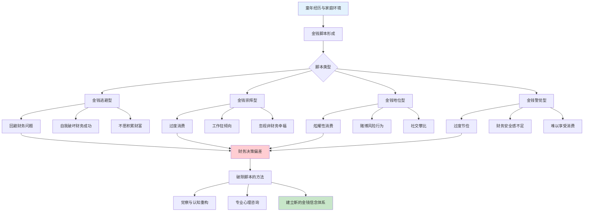

## 二、消费心理学

消费心理学研究消费者在获取、使用和处置商品或服务过程中的心理活动规律。对于搞钱者而言，理解消费心理学有两重意义：**一是识别商家如何操控你的消费决策，守住自己的钱包**；**二是掌握这些心理机制，将其应用于产品设计、定价策略和营销转化中，合法合规地提升收入**。

本节从金钱脚本出发，系统拆解消费决策中的认知偏差、情绪驱动和环境操纵，最终落脚到"如何利用这些知识搞钱"。

### 2.0 金钱脚本与消费决策全貌

每个人在童年时期就形成了关于金钱的深层信念——"金钱脚本"（Money Script）。这些脚本像操作系统一样，在你无意识的情况下驱动你的每一笔消费决策。

**金钱脚本的四种类型**（Brad Klontz 等人基于临床研究提出）：

| 脚本类型 | 核心信念 | 典型行为 | 搞钱障碍 |
|----------|---------|---------|---------|
| 金钱逃避型 | "钱是万恶之源"、"有钱人都是坏人" | 回避财务话题，自我破坏收入增长 | 潜意识排斥财富积累 |
| 金钱崇拜型 | "钱多了就幸福了"、"我需要更多才够" | 过度消费、工作狂、忽视非财务幸福 | 永远不满足，支出随收入同步膨胀 |
| 金钱地位型 | "我的价值=我的资产" | 炫耀性消费、社交攀比、赌博冒险 | 收入主要用于外部认同而非真实需求 |
| 金钱警觉型 | "钱随时会消失"、"我必须时刻警惕" | 过度节俭、难以享受消费、安全感匮乏 | 压力过大导致决策保守，错过增长机会 |



**如何识别自己的金钱脚本**：

1. **回溯法**：写下你最早关于钱的记忆。父母在讨论钱时的表情、语气和结论是什么？"我们家穷，别乱花钱"、"有钱人都不幸福"——这些就是脚本的种子。
2. **模式识别**：回顾你过去三年的消费记录，找出反复出现的非理性模式。比如每次发工资后三天内就花掉大半（金钱崇拜型），或者即使收入翻倍了生活质量几乎没变（金钱警觉型）。
3. **情绪探测**：当你看到银行账户余额时，第一个冒出来的情绪是什么？焦虑？兴奋？羞耻？恐惧？这个情绪就是你金钱脚本的直接体现。

**破除金钱脚本的四步法**：

1. **觉察**：识别出"这是脚本在说话，不是事实"
2. **质疑**：这个信念是被谁灌输的？它在今天还成立吗？
3. **替换**：用理性的金钱信念替代旧脚本（如从"钱是万恶之源"替换为"钱是中性的工具，用途取决于持有者"）
4. **验证**：用新的信念指导行为，观察结果是否改善

---

### 2.1 锚定效应（Anchoring Effect）

**理论基础**：锚定效应由 Tversky 和 Kahneman 在1974年通过经典实验发现。他们让受试者先转一个随机数字转盘（0-100），然后估计联合国中非洲国家的百分比。转到10的人平均估计25%，转到65的人平均估计45%——一个完全随机的数字就能显著影响判断。

**核心机制**：大脑在处理不确定信息时，会自动抓住第一个接触到的数字作为"锚点"，然后围绕这个锚点进行不充分的调整。这种调整是"不足的"——你离真实值越远，调整越不充分。

**在消费中的五种常见锚点**：

**1. 价格锚点——"原价"骗局**

商品标价1000元，打5折卖500元，你感觉省了500元。但如果这件商品本来就只值300元呢？"原价1000元"就是商家精心设置的锚。

真实案例：某电商平台的大促数据显示，标注"原价"的商品转化率比不标注的高出47%。即使消费者知道原价可能虚高，锚定效应仍然生效——因为大脑在看到"1000→500"的瞬间，就已经完成了"划算"的判断，后续的理性分析很难推翻这个第一印象。

**2. 序列锚点——先贵后便宜策略**

餐厅菜单的第一道菜标价888元，后面的388元就显得"不贵"了。这不是巧合——高端餐厅会刻意在菜单左上角放置高价菜品作为锚点。房产中介先带你看一套远超预算的"标杆房"，再看目标房时，你会觉得"性价比真高"。

**3. 数量锚点——分期付款的心理错觉**

一台电脑12000元感觉很贵，但分12期每月只要1000元，感觉"还可以接受"。商家甚至会提供"每天只需33元"的表述，进一步缩小感知金额。但实际上：你多付了利息，购买门槛降低导致你可能买了超出实际需求的配置。

**4. 参考锚点——"别人都在买"**

"已有10万人购买"、"好评率99%"——这些数字成为你判断价值的锚。你没有独立评估商品质量，而是用"别人的选择"作为参考锚点来推断"这应该不错"。

**5. 框架锚点——表述方式改变感知**

同样一杯咖啡，"80%脱咖啡因"比"含有20%咖啡因"更受欢迎。同样一笔交易，"现金折扣2%"和"刷卡手续费2%"的经济效果完全相同，但前者让人感觉赚了，后者感觉亏了。

**搞钱应用——如何利用锚定效应**：

- **产品定价**：先展示高价版本，再展示目标版本。三个定价方案（低-中-高），目标是让中价版显得"刚刚好"
- **折扣呈现**：永远展示原价和折扣价的对比，制造"省了多少"的感知
- **销售话术**：先报一个较高的价格区间，再给出实际报价，让对方感觉"比预期便宜"
- **内容营销**：先展示行业高端案例的价格（"某头部玩家投入了500万"），再引出你的方案（"只需1/10的预算"）

**防御策略**：

1. 做购买决策前，先用30秒独立评估商品的实际价值，不看任何标价信息
2. 问自己："如果没有这个'原价'，我愿意出多少钱？"
3. 关注总拥有成本（TCO），而非单次支付金额
4. 对分期付款一律换算成总价来评估

---

### 2.2 损失厌恶（Loss Aversion）

**理论基础**：Kahneman 和 Tversky 的前景理论（Prospect Theory, 1979）揭示了一个关键发现：**损失带来的心理痛苦大约是同等收益带来的快乐的2-2.5倍**。这意味着丢失100元的痛苦，需要捡到200-250元才能弥补。

**神经科学解释**：fMRI脑成像研究显示，当人们面临损失时，大脑的杏仁核（负责恐惧和焦虑的区域）活动显著增强；而获得收益时，伏隔核（负责奖赏的区域）的活动强度明显弱于杏仁核对损失的反应。进化心理学的解释是：在资源匮乏的远古环境中，失去食物意味着死亡，而获得额外食物的边际收益递减——因此"避免损失"比"追求收益"的生存价值更高。

**在消费中的七种表现**：

**1. 免费试用陷阱**

商家提供"免费试用7天"，试用期结束后你不想"失去"这个服务，就付费订阅了。SaaS产品的免费试用转化率通常在15-25%之间，其中很大比例的转化并非因为用户真的需要这个产品，而是因为损失厌恶——"我已经习惯了，不想失去"。

**2. 限时优惠恐惧**

"今天不买明天就涨价"、"仅剩最后3件"——你害怕"损失"这个优惠，冲动购买。电商大促中的"倒计时"和"库存告急"提示是最典型的损失厌恶操控。数据显示，加入倒计时的页面转化率提升22-37%。

**3. 沉没成本谬误**

花了500元办的健身卡，即使不想去了也觉得"不用就亏了"，强迫自己去。但实际上，去不去都不会改变已经花掉的500元。理性的做法是问自己："如果这张卡是免费送的，我今天想去健身房吗？"如果答案是"不想"，那就别去——500元已经是沉没成本，不应该影响未来的决策。

**4. 禀赋效应（Endowment Effect）**

人们对"已经拥有"的东西赋予更高的价值。经典实验：随机给一半学生一个杯子，然后让所有人给杯子定价。拥有杯子的学生平均估价7.71美元，没有杯子的学生平均估价2.87美元——同一个杯子，仅仅是"拥有"就让估值提高了近3倍。

商业应用："7天无理由退货"之所以有效，正是利用了禀赋效应——商品到手后，你已经心理上"拥有"了它，退货意味着"失去"，所以大多数人不会退。

**5. 现状偏差（Status Quo Bias）**

人们倾向于维持现状，即使改变能带来更好的结果。这就是为什么取消订阅比订阅难得多——商家故意让取消流程复杂化（要打电话、要填写表单、要等3-5个工作日），利用你的现状偏差让你"懒得取消"。

**6. 害怕错过（FOMO）**

"全场限量100份"、"朋友圈都在打卡的网红店"——FOMO（Fear of Missing Out）是损失厌恶在社交维度的延伸。你不仅害怕失去商品本身，更害怕失去"参与感"和"社交货币"。

**7. 保本心理**

投资中最常见的损失厌恶表现：宁愿持有亏损的股票不卖（"等回本再说"），却急着卖出盈利的股票（"先落袋为安"）。这叫"处置效应"（Disposition Effect），是损失厌恶的直接后果。

**搞钱应用——如何利用损失厌恶**：

- **限时策略**：设置真实的截止时间，制造紧迫感。"前100名享受早鸟价"比"欢迎购买"有效得多
- **免费→付费过渡**：先让用户免费使用，建立习惯后再收费。关键是让用户在免费期形成"我已经拥有"的心理
- **退款保障**：提供退款保障反而能提高购买率——因为"可以退"降低了初始损失恐惧，而一旦购买后禀赋效应会让大多数人不退
- **强调不买的损失**："不学这门课，你每年多损失3万元"比"学了这门课你能多赚3万元"更有效
- **会员体系**：等级制度让用户害怕"失去"已有的权益，从而持续消费保持等级

**防御策略**：

1. 区分"真正的损失"和"心理上的损失"——时间过了就过了，不存在"损失"优惠这种事
2. 面对限时优惠时，强制自己等24小时再做决定
3. 对沉没成本一律忽略，只看"从现在起，这件事值不值得做"
4. 定期检查订阅服务，问自己："如果今天是第一次看到这个服务，我会付费吗？"

---

### 2.3 心理账户（Mental Accounting）

**理论基础**：心理账户由诺贝尔经济学奖得主 Richard Thaler 系统提出。其核心洞察是：**人们并不是把所有的钱放在一个"大账户"里统一管理，而是在心理上把钱分成不同的"小账户"，每个账户有不同的消费规则和心理标签**。

从经济学角度，1元钱就是1元钱，无论来自工资还是彩票，价值完全相同。但心理账户让我们对"不同来源"和"不同用途"的钱产生截然不同的态度和行为。

**心理账户的三个核心维度**：

**1. 来源维度——钱从哪里来**

| 收入来源 | 心理标签 | 消费倾向 | 举例 |
|---------|---------|---------|------|
| 工资收入 | "辛苦钱" | 精打细算，节约使用 | 每月工资谨慎分配 |
| 年终奖 | "额外收入" | 较为随意 | 拿到奖金立刻想"犒劳自己" |
| 投资收益 | "白赚的" | 大手大脚 | 股票赚了5000元，请客花了3000元 |
| 彩票/红包 | "意外之财" | 挥霍无度 | 抢到200元红包立刻花掉 |
| 退款/返现 | "失而复得" | 当作"新钱"花 | 退货的500元比工资的500元花得快 |

**2. 用途维度——钱要花在哪里**

人们会为不同用途设立独立的心理预算：

- **生活必需账户**：买菜、交房租，每一分钱都精打细算
- **娱乐享受账户**：看电影、聚餐，花起来相对爽快
- **投资自我账户**：买书、上课，有些人很舍得，有些人一毛不拔
- **社交面子账户**：请客送礼，为了面子可以大出血
- **子女教育账户**：很多父母自己省吃俭用，给孩子花钱毫不手软

同一个家庭，买菜时为2块钱讲价，给孩子报兴趣班时几千块眼都不眨——这不是"不理性"，而是两个心理账户的规则不同。

**3. 支付方式维度——怎么花的钱**

| 支付方式 | 痛感程度 | 消费行为 |
|---------|---------|---------|
| 现金 | 最高（直接感受） | 花钱更谨慎，减少冲动消费 |
| 借记卡 | 较高（余额可见） | 比现金略放松 |
| 信用卡 | 较低（延迟支付） | 消费金额平均增加12-18% |
| 电子支付（微信/支付宝） | 低 | 扫码无感，容易超支 |
| 先用后付 | 最低 | 消费门槛最低，最容易超前消费 |
| 数字代币/充值卡 | 极低 | 游戏内购、平台充值的消费金额远超现金支付 |

MIT的一项著名实验发现，用信用卡支付的受试者愿意为同一张NBA比赛门票支付的金额比用现金支付的受试者高出约60%。支付的"痛感"越低，你的防御越弱。

**搞钱应用——如何利用心理账户**：

- **产品包装**：将产品归入消费者"更舍得花钱"的心理账户。比如把在线课程定位为"自我投资"而非"消费支出"，把健身年卡定位为"健康保障"而非"运动消费"
- **降低支付痛感**：提供多种支付方式，尤其是分期、先用后付等低痛感方式。充值返现机制让用户把"工资账户"的钱转入"平台账户"，降低后续消费的痛感
- **拆分定价**：把大额支出拆成多个小额心理账户。"每天只需16元"比"年费5800元"更容易接受——因为前者进入了"日常零花"账户，后者在"大额支出"账户
- **礼品卡与充值**：一旦消费者把钱充入你的平台，这笔钱就从"工资账户"转移到了"平台余额账户"，消费心理防御大幅降低

**防御策略**：

1. 建立"合并账户"意识：所有收入都归入同一个财务池，统一管理
2. 对所有消费一视同仁——花年终奖和花工资时，问自己同样的问题："如果这笔钱是从工资里出的，我还会买吗？"
3. 用现金或借记卡支付，恢复支付痛感
4. 建立月度预算制度，打破心理账户的边界

---

### 2.4 冲动消费的心理机制

冲动消费是指消费者在没有事先计划的情况下，受到外部刺激而做出的即时购买行为。据研究，超市中约50-70%的购买决策是在店内做出的冲动消费。在线购物中，这个比例更高——因为刺激更密集、支付更便捷、决策时间更短。

**冲动消费的四层触发机制**：

**第一层：情绪触发**

| 情绪状态 | 消费行为 | 背后机制 | 典型场景 |
|---------|---------|---------|---------|
| 压力/焦虑 | 通过购物缓解（"零售疗法"） | 购物提供控制感和即时满足 | 加班后打开购物App |
| 悲伤/孤独 | 用消费填补情感空缺 | 物质获取产生短暂安慰 | 分手后大量购物 |
| 兴奋/开心 | 犒赏自己 | 正面情绪降低风险评估 | 发工资当天大买特买 |
| 无聊/空虚 | 浏览购物平台消磨时间 | 降低决策质量，增加冲动概率 | 无事可做时刷淘宝 |
| 愤怒/委屈 | 报复性消费 | 通过"对自己好"来对抗负面经历 | 和伴侣吵架后买奢侈品 |

关键是：**冲动消费的根源往往不是对商品的需求，而是对情绪调节的需求**。商品只是情绪调节的载体。认识到这一点，就能在冲动来临时问自己："我真正需要的是什么？是这个商品，还是某种情绪上的满足？"

**第二层：社交触发**

- **从众压力**：朋友都在买，不买觉得不合群。"跟风消费"的本质是社交归属感需求
- **社交媒体种草**：KOL/KOC的"真实分享"其实是精心策划的营销内容，但消费者会将其当作"朋友推荐"来处理，降低了广告防御
- **直播带货的氛围感染**：主播的倒计时、"只剩最后XX件"、观众的"已下单"弹幕——多重社交压力叠加，让人来不及理性思考
- **社交攀比**：朋友圈里的生活方式展示制造了"别人都过得比我好"的错觉，驱动你用消费来追赶

**第三层：环境触发**

线下环境操控：
- **灯光**：暖色调灯光让人停留更久，冷色调让人快速决策（奢侈品店用暖光，便利店用冷光）
- **音乐**：慢节奏音乐让人放慢脚步、增加浏览时间；古典音乐让人对商品估值更高
- **气味**：烘焙区的面包香、咖啡店的咖啡香——气味直接作用于边缘系统（情绪脑），绕过理性分析
- **动线设计**：超市把必需品（牛奶、鸡蛋）放在最里面，让你穿过整个卖场；收银台旁摆满小零食，利用排队时的无聊和等待焦虑

线上环境操控：
- **算法推荐**："猜你喜欢"基于你的浏览历史，精准推送你最容易冲动购买的商品
- **满减/凑单**："再买38元就能减20"——你为了"省钱"多花了38元买了本来不需要的东西
- **购物车提醒**："您的购物车里有3件商品即将售罄"——把已经犹豫的商品再次推到你面前
- **无缝支付**：免密支付、一键下单——每减少一步操作，冲动消费的概率就增加一分

**第四层：生理触发**

购物时大脑释放多巴胺，产生愉悦感。但关键的发现是：**多巴胺的峰值出现在"期待购买"的阶段，而非"实际获得"的阶段**。也就是说，让你最快乐的是"加入购物车"和"点击下单"的瞬间，而不是收到包裹的时刻。这解释了为什么很多人买了东西后拆都不拆就扔在角落——因为多巴胺已经在下单时释放完了。

这种"期待-获得-失望"的循环会驱动你不断寻找新的购买目标来维持多巴胺水平，形成类似成瘾的行为模式。

**冲动消费的量化影响**：

假设一个普通人每月冲动消费占总支出的20%，月消费5000元，则每月冲动消费1000元。年化12000元。如果这笔钱用于指数基金定投（年化8%），20年后约为55万元。一次冲动消费的真正成本，不是商品标价，而是这笔钱的机会成本。

**搞钱应用——如何利用冲动消费机制**：

- **缩短决策路径**：减少从"想买"到"买到"之间的步骤。一键购买、免密支付、收藏→下单转化路径越短越好
- **创造多巴胺触发点**：设计"开箱体验"、"惊喜赠品"、"盲盒机制"——让消费者在购买前就产生期待感
- **营造稀缺与紧迫**：限量发售、倒计时、库存告急——让消费者的理性分析时间被压缩
- **利用情绪窗口**：在用户的"高情绪"时刻推送商品（如刚看完感人的电影、刚收到好消息）
- **社交裂变**：设计"拼团"、"砍价"、"晒单返现"机制，让社交压力成为转化动力

**防御策略——"冲动消费防火墙"**：

1. **24小时冷静规则**：将非必需品加入购物车后强制等待24小时，第二天再看——你会发现80%的东西你已经不想要了
2. **情绪检测**：购物前问自己"我现在是什么情绪？"如果是压力、无聊、悲伤、愤怒中的一种，关掉购物App
3. **预算上限**：每月设定"自由消费"上限（比如收入的5-10%），超过即停
4. **卸载触发App**：识别你的"冲动消费入口"（抖音、小红书、淘宝），在不需要购物时主动远离
5. **替代满足**：找到比购物更健康的情绪调节方式——运动、社交、阅读、冥想

---

### 2.5 消费者剩余与支付意愿

**消费者剩余**（Consumer Surplus）是经济学中的核心概念：你愿意为某件商品支付的最高价格与你实际支付的价格之间的差额。如果你愿意为一杯咖啡最多出30元，而实际只花了20元，那么你的消费者剩余就是10元。

**支付意愿的六种影响因素**：

**1. 参考价格（锚定效应）**

你对商品"应该值多少钱"的判断，很大程度上取决于你接触到的第一个价格信息。电商详情页展示的"划线价"就是在设置参考价格。

**2. 稀缺性**

限量版、限时供应、独家渠道——稀缺性直接提升支付意愿。行为经济学的"稀缺启发式"（Scarcity Heuristic）表明：当人们面对稀缺资源时，会自动推断"它一定很值"。饥饿营销（如限量球鞋、限量手机配色）正是利用这一机制。

**3. 社会认同**

"10万人已购买"、"好评率99%"、"明星同款"——当大量他人都在购买时，你的支付意愿会显著提升。这是从众心理在消费决策中的直接体现。

**4. 品牌叙事与情感连接**

为什么同一个工厂生产的白T恤，贴上Nike的logo就能卖5倍价格？因为Nike卖的不是T恤，而是"Just Do It"的精神认同。品牌故事、创始人传奇、用户社群——这些"非功能性价值"直接提升了消费者的支付意愿。

**5. 信息不对称**

消费者对商品真实成本的了解越少，支付意愿越容易被操控。这就是为什么"成分党"、"测评博主"能火——他们打破了信息不对称，帮消费者建立了更准确的价值判断基准。

**6. 心理定价策略**

- **尾数定价**：9.9元比10元感觉便宜很多（左位效应），尽管只差1毛钱
- **整数定价**：高端商品反而用整数价格（如2000元而非1999元），因为整数传递"品质感"
- **价格-质量推断**：消费者会用价格推断质量。一杯标价38元的咖啡和一杯标价12元的咖啡，即使原料完全相同，大多数人会认为前者更好喝（实验证实了这一点）
- **诱饵定价**（Decoy Effect）：当存在三个选项时，一个明显劣势的"诱饵"选项能引导消费者选择目标选项

**诱饵定价的经典案例**：

《经济学人》杂志的订阅方案：
- 仅电子版：59美元
- 仅纸质版：125美元
- 电子版+纸质版：125美元

"仅纸质版125美元"显然是个诱饵——没有人会选它，因为花同样的钱可以同时得到电子版+纸质版。但如果没有这个诱饵，很多人会选59美元的电子版；有了诱饵，大多数人会选125美元的组合版（感觉自己"赚了"）。

**搞钱应用——如何利用消费者剩余**：

- **差异化定价**：识别不同客群的支付意愿，设计不同版本的产品（基础版/专业版/旗舰版），最大化捕获消费者剩余
- **价值塑造**：在展示价格之前，先充分展示产品的价值——当消费者对产品的价值评估被拉高后，他们对价格的敏感度会降低
- **诱饵设计**：在产品线中加入一个"明显不如目标选项"的诱饵，引导消费者选择你希望他们买的版本
- **价格测试**：通过A/B测试找到最优定价点——不是"消费者愿意付的最高价"，而是"利润×销量"的最大值
- **信息控制**：适度控制消费者获得的信息量。完全透明的定价反而可能压缩利润空间（但要合法合规）

---

### 2.6 社会认同与从众消费

**理论基础**：Robert Cialdini 在《影响力》中将"社会认同"（Social Proof）列为六大说服原则之一。核心机制是：**当人们不确定如何行动时，会参考他人的行为来指导自己的决策**。在消费场景中，这种倾向尤其明显——因为大多数购买决策都存在不确定性。

**社会认同的五种形式**：

1. **数量认同**："已有10万人购买"——数量越大，认同感越强
2. **相似认同**："和你类似的用户也在用"——与自己越相似的人的选择越有说服力
3. **权威认同**："专家推荐"、"医生建议"——权威人士的背书具有超常的说服力
4. **朋友认同**："你的3位好友也在用"——来自熟人的推荐是最强的社会认同
5. **群体认同**："限时抢购，已有5000人加购"——群体行为制造紧迫感和从众压力

**线上消费中社会认同的放大效应**：

在实体店，你只能看到身边几十个人的消费行为；但在电商平台上，你面对的是数以万计的销量数据、数千条评价、无数的"已购买"标记。社交媒体进一步放大了这种效应——当你看到朋友圈、小红书上所有人都在晒同一款产品时，社会认同的压力呈指数级增长。

**搞钱应用**：

- **销量展示**：突出显示销量数据、用户数量、好评率等社会认同指标
- **UGC内容**：鼓励用户生成内容（晒单、评测、使用心得），这些"真实用户的声音"比任何广告都有效
- **KOC策略**：找与目标客群相似的普通人做推荐，比找明星更有说服力（因为"相似性"是社会认同的关键变量）
- **实时动态**："XX刚刚购买了此商品"的实时通知，制造"很多人在买"的即时感知
- **社群运营**：建立用户社群，让用户在社群中互相影响、互相推荐

---

### 2.7 禀赋效应与沉没成本

这两个概念已在损失厌恶部分涉及，这里补充它们在"搞钱"场景中的具体应用。

**禀赋效应的商业应用**：

- **试用/体验策略**：让消费者先"拥有"产品（免费试用、试驾、试穿），一旦产生"这是我的"心理，转化率大幅提升。汽车4S店鼓励你试驾一整周末——因为还车意味着"失去"
- **个性化定制**：让消费者参与产品定制（选颜色、刻字、配置方案），定制过程加深了"拥有感"，退货率显著降低
- **虚拟所有权**："您购物车中的商品即将售罄"——即使从未付款，购物车里的商品已经在心理上属于你了

**沉没成本的商业应用**：

- **会员积分体系**：累积的积分和等级让用户觉得"已经投入了这么多，不能放弃"，从而持续消费
- **游戏化机制**：连续签到奖励、成长任务——用户完成越多任务，越不舍得放弃
- **课程进度**：在线课程展示"您已完成68%"的进度条——这个进度本身就是沉没成本，驱动用户完成课程（并购买进阶课程）

**搞钱应用**：

1. 设计让用户"投入"的机制：时间投入（签到、任务）、情感投入（社群互动）、社交投入（邀请好友）
2. 每一份投入都是未来的沉没成本，降低流失概率
3. 但要注意：如果产品本身不过关，沉没成本只能暂时留住用户，长期来看用户会离开

---

### 2.8 数字时代的消费心理学新特征

传统消费心理学诞生于实体消费时代，但数字时代的消费行为呈现出全新的特征：

**1. 选择过载与决策疲劳**

Schwartz 在《选择的悖论》中指出：选择越多，满意度反而越低。电商平台上一个品类可能有上万种选择，消费者面对过多选项时会经历"决策瘫痪"——干脆不买了，或者随机选一个。

**搞钱应用**：减少消费者的选择焦虑。提供"编辑精选"、"最佳性价比"、"90%用户选择"等引导标签，帮消费者做减法。

**2. 注意力经济与时间货币**

在数字时代，最稀缺的资源不是钱，而是注意力。每一个App、每一个平台都在争夺用户的时间。消费者为内容付费的意愿本质上是在为"节省筛选时间"付费。

**搞钱应用**：如果你能帮消费者节省时间、降低信息搜索成本，你就创造了真实价值。信息整合、内容策展、个性化推荐都是基于这一逻辑的商业模式。

**3. 算法茧房与消费极化**

推荐算法会根据用户的偏好不断推送相似内容，形成"信息茧房"。在消费领域，这导致用户的消费偏好越来越极化——喜欢潮牌的人会不断被推送潮牌内容，消费结构越来越单一。

**搞钱应用**：精准定位细分人群，深耕垂直领域。在算法时代，"小而美"的垂直品牌比"大而全"的综合品牌更有生存空间。

**4. 订阅经济的心理学**

订阅模式的本质是将"一次性购买决策"转化为"持续的不决策"。消费者只需做一次购买决定，之后每月自动扣费。利用的就是现状偏差和损失厌恶——取消订阅意味着"失去服务"，而且需要主动行动（对抗现状偏差）。

**搞钱应用**：如果可能，将产品/服务设计为订阅模式。关键要素：首月低价（降低试用门槛）→ 习惯养成期 → 自动续费（利用现状偏差）→ 取消流程适当复杂化（合法范围内）。

**5. 社交电商与信任代理**

传统电商的信任建立在平台（如淘宝的信用体系）上；社交电商的信任建立在人际关系上。朋友的推荐比平台的评分更有说服力。拼多多的"拼团"机制正是利用了社交关系中的信任代理——你愿意参与拼团，不仅因为价格便宜，更因为发起拼团的是你认识的人。

**搞钱应用**：设计社交裂变机制时，要降低用户的"社交成本"——让用户分享出去的内容是有价值的（省钱信息、好物推荐），而不是令人反感的"帮我砍一刀"。

---

### 2.9 消费心理学的伦理边界

理解消费心理学赋予了你影响他人行为的能力，但能力越大，责任越大。

**灰度地带**：

| 策略 | 白帽（合理利用） | 灰帽（擦边） | 黑帽（欺诈） |
|------|---------------|-------------|------------|
| 锚定定价 | 展示合理原价 | 标高虚价再打折 | 从未以"原价"销售过 |
| 稀缺营销 | 真实限量 | 人为制造稀缺 | 永远"最后3件" |
| 损失厌恶 | 真实限时优惠 | 虚假倒计时 | 制造虚假恐慌 |
| 社会认同 | 展示真实销量 | 刷单刷好评 | 完全虚构数据 |
| 订阅模式 | 清晰告知续费规则 | 默认勾选自动续费 | 隐藏取消入口 |

**底线原则**：

1. **不欺诈**：所有营销信息必须基于事实
2. **不操纵弱势群体**：不对老年人、未成年人、心理疾病患者使用高压心理策略
3. **提供退出机制**：任何"进入"机制都应有对称的"退出"机制
4. **长期主义**：短期的套路可能带来一时的收益，但只有真诚的价值交付才能建立可持续的生意

---

### 2.10 实操工具箱

**工具一：消费决策清单**

在做任何超过200元的非必需消费前，过一遍这个清单：

```text
□ 我的情绪状态正常吗？（不是压力/无聊/悲伤驱动的冲动？）
□ 这个商品我真正需要还是只是想要？
□ 如果不打折，我还会买吗？
□ 我是从哪里知道这个商品的？（广告/KOL/朋友推荐？）
□ 有没有更便宜的替代品？
□ 这笔钱的机会成本是什么？（投资/储蓄/其他用途）
□ 24小时后我还会想买吗？
□ 买回来一周后我还会用吗？
```

**工具二：月度消费分析模板**

每月末花30分钟回顾消费记录，将每笔消费标记为：

- **必要支出**（房租、水电、基本饮食）
- **合理改善**（提升生活质量的消费）
- **冲动消费**（后悔的购买、未使用的商品）
- **社交消费**（为了面子或从众的消费）

重点不是削减"必要支出"和"合理改善"，而是识别和减少"冲动消费"和"无效社交消费"。

**工具三：搞钱者的消费心理学应用清单**

如果你在做产品/营销/销售，这个清单帮你系统运用消费心理学：

```text
□ 定价是否设置了合理的锚点？
□ 是否展示了社会认同（销量、评价、用户证言）？
□ 是否设计了"免费→付费"的过渡路径？
□ 是否利用了损失厌恶（限时、限量、专属权益）？
□ 是否降低了支付痛感（分期、多种支付方式）？
□ 是否有诱饵选项引导消费者选择目标产品？
□ 是否设计了让用户"投入"的机制（积分、等级、进度）？
□ 是否遵守了伦理底线？
```

---

### 2.11 进阶：消费心理学的经典实验与学术资源

**必读研究**：

| 研究 | 作者 | 核心发现 |
|------|------|---------|
| 前景理论 | Kahneman & Tversky (1979) | 损失厌恶、参考点依赖、概率加权 |
| 锚定效应实验 | Tversky & Kahneman (1974) | 随机数字显著影响数值估计 |
| 心理账户理论 | Richard Thaler (1985, 1999) | 人们对不同来源/用途的钱有不同态度 |
| 影响力六大原则 | Robert Cialdini (1984) | 互惠、承诺一致、社会认同、喜好、权威、稀缺 |
| 选择的悖论 | Barry Schwartz (2004) | 选择越多满意度越低 |
| 禀赋效应 | Thaler (1980); Kahneman, Knetsch & Thaler (1990) | 拥有者对同一物品的估价是非拥有者的2-3倍 |
| 多巴胺与期待 | Wolfram Schultz 等 | 多巴胺峰值在期待阶段而非获得阶段 |

**推荐书单**：

1. **《思考，快与慢》**（Daniel Kahneman）——认知偏差的百科全书，消费心理学的理论基石
2. **《影响力》**（Robert Cialdini）——六大说服原则，每个营销人必读
3. **《助推》**（Richard Thaler & Cass Sunstein）——如何通过"选择架构"影响决策
4. **《怪诞行为学》**（Dan Ariely）——非理性消费行为的趣味解读
5. **《上瘾》**（Nir Eyal）——如何设计让用户上瘾的产品
6. **《定价制胜》**（Hermann Simon）——定价策略的系统方法论
7. **《稀缺》**（Sendhil Mullainathan & Eldar Shafir）——稀缺心态如何影响决策质量

---

### 2.12 常见误区与纠正

**误区一："我是理性的，不受这些心理效应影响"**

事实：认知偏差是人类大脑的固有特征，无法通过"知道"就消除。研究显示，即使了解锚定效应的经济学教授，在实际购物中仍然会受到锚定效应的影响。正确做法是建立系统性的防御机制（如24小时冷静规则、月度消费分析），而非依赖意志力。

**误区二："消费心理学就是操控消费者"**

事实：消费心理学是一把双刃剑。它可以被用来操控消费者，也可以被用来帮助消费者做出更好的决策。比如"助推"（Nudge）理论主张通过改变"选择架构"来引导更好的决策——把健康食品放在食堂最显眼的位置，而不是禁止不健康食品。

**误区三："打折就是在省钱"**

事实：你不是因为打折而省钱，你是因为购买而花钱。如果你不需要这个商品，无论打几折你都是在花钱而不是省钱。"省下500元"是假的，"花了500元"才是真的。

**误区四："大家都在买的东西一定好"**

事实：社会认同是一个"启发式"（Heuristic），即心理捷径，而非可靠的判断标准。大家都在买可能是因为产品质量好，也可能只是因为营销做得好。真正的评估应该基于你自己的需求和商品的客观属性。

**误区五："便宜没好货，贵的一定好"**

事实：价格-质量推断是一种启发式，在信息不足时有一定参考价值，但远非可靠。很多高价商品的价格中，品牌溢价、渠道成本、营销费用占了大部分，与产品本身的品质关联并不大。
