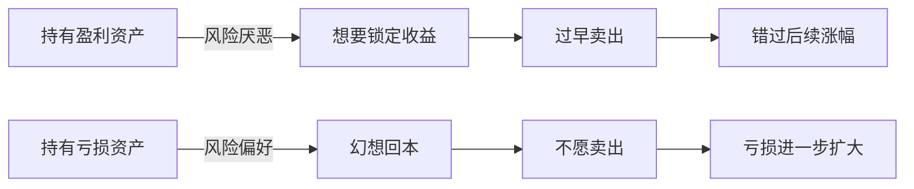
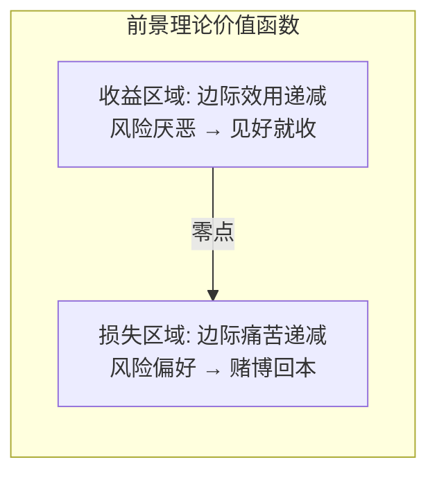

## 三、投资心理学

投资心理学研究的是人在投资决策中的心理偏差、情绪反应和认知陷阱。它回答一个核心问题：**为什么聪明人在投资中反复犯同样的错误？**

诺贝尔经济学奖得主丹尼尔·卡尼曼（Daniel Kahneman）和阿莫斯·特沃斯基（Amos Tversky）在20世纪70年代开创的行为金融学揭示了一个事实——**人不是理性的经济人，而是充满偏差的决策者**。传统金融学假设投资者理性、市场有效，但现实是：投资者系统性地犯错，市场反复出现非理性泡沫和崩盘。

理解投资心理学不是为了"变成机器人"，而是为了**识别自己的偏差，建立对抗机制**，从而做出更接近理性的决策。

### 3.1 过度自信偏差（Overconfidence Bias）

#### 3.1.1 定义与心理机制

过度自信是指人们系统性地高估自己的知识准确性、判断能力和控制力。这是投资中最普遍、破坏力最强的偏差之一。

心理学家将过度自信分为三种类型：

| 类型 | 定义 | 投资中的表现 |
|------|------|------------|
| **校准过度自信**（Overprecision） | 对自己判断的确定性过高 | 95%置信区间实际上只有50%的覆盖率 |
| **优于平均效应**（Better-than-average） | 认为自己高于平均水平 | 80%的投资者认为自己的投资能力高于平均 |
| **控制幻觉**（Illusion of control） | 认为自己能控制不可控的事件 | 认为频繁操作能"控制"投资收益 |

#### 3.1.2 在投资中的典型表现

**频繁交易**：过度自信的投资者相信自己能预测短期市场走势，频繁买卖。加州大学Barber和Odean的研究（2000年）追踪了66,465个家庭账户，发现交易最频繁的投资者年化收益比最不频繁的低7个百分点。扣除交易成本后，差距更大。

**集中持仓**：认为自己找到了"确定性机会"，将大量资金押注在少数标的上。研究表明，投资者的持仓集中度与过度自信程度正相关——越自信的人越不愿意分散。

**忽视反面证据**：对自己的投资逻辑过度信任，对负面消息选择性忽视或合理化。"利空出尽是利好"成为自我安慰的口头禅。

**杠杆投机**：自信地认为市场会按照自己的判断走，使用融资融券、期权等杠杆工具放大赌注。

#### 3.1.3 数据警示

- 中国证券投资者保护基金的调查显示，**约70%的散户投资者长期处于亏损状态**
- 标普SPIVA报告：**超过90%的主动管理基金在15年期内跑输基准指数**
- Barber和Odean的研究：男性投资者的交易频率比女性高45%，年化收益低1.4个百分点——男性通常更过度自信
- 股市中有一句残酷的话："你赚到的钱都是市场给的，不是你的能力"

#### 3.1.4 对抗策略

**量化检验法**：每次做出投资决策前，写下预期收益和时间框架。定期回顾，统计预测准确率。大多数人会发现自己的准确率远低于预期。

**魔鬼代言人法**：在做出决策前，强制自己写出至少3条反对意见。如果你找不到反对理由，说明你陷入了确认偏差。

**限制交易频率**：给自己设定每月或每季度的最大交易次数。Barber和Odean的研究表明，减少交易频率几乎必然提高收益。

**仓位上限规则**：单只标的的仓位不超过总资金的5-10%。即使你"非常确定"，也不要突破这个上限。

```python
# 过度自信自测问卷
overconfidence_quiz = [
    "你是否经常觉得自己比市场更聪明？",
    "你是否认为自己能准确预测短期市场走势？",
    "你的交易频率是否高于每月一次？",
    "你是否将大部分资金集中在少数几只股票上？",
    "你是否使用杠杆（融资融券）投资？",
    "你的投资决策是否主要基于直觉而非系统分析？",
    "你是否很难接受别人对你投资决策的质疑？",
    "你是否经常觉得自己"再坚持一下就能回本"？",
]

def score_overconfidence(answers: list[bool]) -> dict:
    """自测过度自信程度，True表示'是'"""
    score = sum(answers)
    if score <= 2:
        return {"level": "低", "score": score, "advice": "过度自信程度较低，继续保持理性的投资态度"}
    elif score <= 4:
        return {"level": "中等", "score": score, "advice": "存在一定程度的过度自信，建议建立决策日志记录和复盘机制"}
    elif score <= 6:
        return {"level": "较高", "score": score, "advice": "过度自信明显，建议强制分散持仓、限制交易频率、设置止损规则"}
    else:
        return {"level": "严重", "score": score, "advice": "过度自信严重，强烈建议转向被动投资策略（指数基金定投），避免主动选股"}

# 使用示例
answers = [True, True, False, True, False, True, False, True]
result = score_overconfidence(answers)
print(f"过度自信评分: {result['score']}/8 → {result['level']}")
print(f"建议: {result['advice']}")
```

### 3.2 羊群效应（Herd Behavior）

#### 3.2.1 定义与进化根源

羊群效应是指个体在不确定环境中倾向于模仿多数人的行为，即使这些行为可能不合理。从进化角度看，跟随群体是生存策略——在远古时代，脱离群体意味着被猛兽捕食的风险增加。但在金融市场中，这种本能常常导致集体性的非理性。

#### 3.2.2 在投资中的典型表现

**追涨杀跌**：看到某只股票连续上涨就冲进去，看到暴跌就恐慌性卖出。这是羊群效应最直接的表现。2021年GameStop事件中，大量散户在Reddit论坛的号召下涌入，股价从20美元暴涨至487美元，随后暴跌至40美元。

**热门概念追捧**：每当市场出现新概念——区块链、元宇宙、ChatGPT、AI——资金就会蜂拥而入，推动估值到荒谬水平。2021年"元宇宙"概念股中，许多公司只是改了个名字，股价就翻倍。

**社交媒体信号**：KOL的"推荐"、微信群里的"内幕消息"、雪球上的"大V持仓"成为投资决策的主要依据。本质上，这是把独立判断外包给了群体。

**FOMO（Fear of Missing Out）**：害怕错过机会是羊群效应的情绪驱动器。当朋友圈里有人晒出投资收益截图时，"别人都赚了我不能落后"的心态会压倒理性分析。

#### 3.2.3 经典案例深度分析

**案例一：2015年中国股市泡沫**

2014年下半年开始，杠杆资金和政策利好推动A股快速上涨。上证指数从2000点一路飙升至5178点。全民炒股热潮中，大学生、退休老人、甚至出租车司机都在讨论股票。场外配资泛滥，杠杆率极高。2015年6月，监管层清查配资引发连锁反应，股市在三周内暴跌30%以上，数千亿市值蒸发。许多投资者在高点买入，亏损惨重。

**案例二：2017年比特币泡沫**

比特币从年初的1000美元暴涨至近20000美元。全球媒体铺天盖地的报道引发了"FOMO浪潮"——从未了解过加密货币的人在12月份争相入场，很多人在15000-19000美元区间买入。随后比特币在2018年暴跌至3200美元，跌幅超过80%。在高点入场的投资者中，大多数在恐慌中割肉出局。

**案例三：2021年"散户大战华尔街"**

Reddit论坛r/WallStreetBets的用户集体买入GameStop（GME）看涨期权和股票，推动股价从20美元暴涨至487美元。大量散户在社交媒体的煽动下在300美元以上追入，认为"这次不一样"。当Robinhood限制GME交易后，股价迅速崩塌。很多追高者亏损超过90%。

#### 3.2.4 对抗策略

**信息隔离法**：在做出投资决策前，屏蔽社交媒体和论坛信息。先独立分析，再参考他人观点。

**反向思维练习**：当所有人都在买入时，问自己："如果我现在手里全是现金，还会在这个价格买入吗？"

**投资日记**：记录每次投资决策的逻辑和情绪状态。如果发现自己在"兴奋"或"焦虑"时做出决策，大概率是羊群效应在起作用。

**设定"冷静期"**：看到一个"绝好机会"后，强制等待48小时再做决定。如果48小时后仍然看好，再行动。

### 3.3 处置效应（Disposition Effect）

#### 3.3.1 定义与心理机制

处置效应是指投资者倾向于过早卖出盈利资产（落袋为安），同时过久持有亏损资产（不愿割肉）。这一现象由Shefrin和Statman在1985年首次系统描述。

其背后的核心心理机制是**前景理论（Prospect Theory）**中的损失厌恶——人们对损失的感受强度是对同等收益感受强度的2-2.5倍。具体来说：



#### 3.3.2 量化证据

Odean（1998）对某大型券商10000个账户的研究发现：
- 投资者卖出盈利股票的概率比卖出亏损股票的概率**高1.5倍**
- 卖出的盈利股票在后续12个月平均上涨**3.4%**
- 继续持有的亏损股票在后续12个月平均下跌**4.4%**

这意味着处置效应导致投资者**系统性地"截断盈利，放任亏损"**，与"让利润奔跑，截断亏损"的交易原则完全相反。

#### 3.3.3 实际后果

**赢小亏大**：赚了10%就跑，亏了30%还不卖。数学上，亏30%需要涨43%才能回本，亏50%需要涨100%。这意味着每次"赢小亏大"都会让回本变得更加困难。

**僵尸持仓**：投资组合中充斥着长期亏损、无人问津的"僵尸股"，它们占据了资金但无法产生回报。

**错过大牛股**：最具破坏力的是，在大牛股刚起步时就卖出。如果你在腾讯上市初期涨了50%时就卖出，你会错过后续数十倍的涨幅。

#### 3.3.4 对抗策略

**止损止盈规则**：在买入前就设定止损点（如-15%）和止盈点（如分批卖出），严格执行。止损不是承认失败，而是保护本金。

**重新定锚法**：不要用买入价作为参考点，而是问："如果我现在空仓，我会以当前价格买入这只股票吗？"如果答案是"不会"，就应该卖出。

**定期再平衡**：每季度或每半年对投资组合进行再平衡——卖出涨幅过大的资产，买入跌幅过大的资产。这能机械化地对抗处置效应。

**交易日志审查**：定期统计：你卖出的盈利股票后续表现如何？你持有的亏损股票后续表现如何？用数据让自己直面处置效应的真实代价。

```python
# 处置效应量化分析
def analyze_disposition_effect(trades: list[dict]) -> dict:
    """
    分析历史交易中的处置效应
    
    trades: [{"symbol": "股票代码", "buy_price": 买入价, "sell_price": 卖出价, 
              "hold_days": 持有天数, "sold": 是否已卖出}, ...]
    """
    winners = [t for t in trades if t.get("sell_price", 0) > t["buy_price"]]
    losers = [t for t in trades if t.get("sell_price", float("inf")) < t["buy_price"]]
    unsold_losers = [t for t in trades if not t["sold"] and t.get("current_price", 0) < t["buy_price"]]
    
    avg_win_hold = sum(t["hold_days"] for t in winners) / len(winners) if winners else 0
    avg_loss_hold = sum(t["hold_days"] for t in losers) / len(losers) if losers else 0
    
    # 处置效应指标：如果avg_win_hold < avg_loss_hold，说明存在处置效应
    disposition_ratio = avg_win_hold / avg_loss_hold if avg_loss_hold > 0 else float("inf")
    
    result = {
        "total_trades": len(trades),
        "winners_sold": len(winners),
        "losers_sold": len(losers),
        "losers_still_held": len(unsold_losers),
        "avg_winner_hold_days": round(avg_win_hold, 1),
        "avg_loser_hold_days": round(avg_loss_hold, 1),
        "disposition_ratio": round(disposition_ratio, 2),
        "has_disposition_effect": disposition_ratio < 1.0,
    }
    
    if result["has_disposition_effect"]:
        result["advice"] = f"存在明显处置效应：盈利股票平均持有{result['avg_winner_hold_days']}天卖出，" \
                          f"亏损股票平均持有{result['avg_loser_hold_days']}天才卖出。" \
                          f"建议设置强制止损规则，止盈分批执行。"
    else:
        result["advice"] = "处置效应不明显，继续保持纪律性交易。"
    
    return result
```

### 3.4 沉没成本谬误（Sunk Cost Fallacy）

#### 3.4.1 定义与心理机制

沉没成本谬误是指人们在决策时考虑已经投入且无法收回的成本（时间、金钱、精力），而不是只关注未来的收益和成本。在投资中，这表现为"因为我已经亏了这么多，所以不能卖"或"我已经花了这么多时间研究，不能放弃"。

其心理根源有两层：
1. **损失厌恶**：确认亏损等于直面损失，心理上难以接受
2. **自我合理化**：卖出意味着承认之前的买入决策是错误的，这威胁到自我形象

#### 3.4.2 在投资中的典型表现

**"补仓摊薄"陷阱**：在亏损时不断加仓，理由是"降低平均成本"。但问题是：如果一只股票的基本面已经恶化，补仓只是把更多资金投入一个错误的决策。摊薄成本不改变投资的总亏损额——你只是在用更多的钱赌一个越来越不可能的翻盘。

**"研究太多不舍得放弃"**：花了几个月研究一个项目或行业，即使发现了致命问题也不愿放弃，因为"已经投入了太多时间"。

**"等回本就卖"**：亏损30%后说"等涨回来就卖"，但这个回本目标可能永远无法实现，而在等待的过程中，资金被锁死在错误的资产中，错过了其他机会。

#### 3.4.3 正确的思考框架

遇到沉没成本困境时，问自己这个核心问题：

> **如果我现在手里是全部现金（没有任何持仓），我会以当前价格买入这只股票吗？**

如果答案是"不会"，那就应该卖出——无论之前的买入价是多少。买入价是沉没成本，与当前决策无关。

更进一步的分析框架：

| 问题 | 如果是 | 如果否 |
|------|--------|--------|
| 当前价格是否被低估？ | 可以继续持有 | 应该卖出 |
| 基本面是否改善或维持？ | 可以继续持有 | 应该卖出 |
| 是否有更好的投资机会？ | 应该换仓 | 继续评估 |
| 持有这只股票的机会成本是多少？ | 量化比较 | 继续评估 |

#### 3.4.4 对抗策略

**决策重置法**：每个月清零一次——假设你当前持有全部是现金，然后重新决定如何配置。如果你不会重新买入某只股票，就卖出它。

**机会成本思维**：不是问"这只股票能不能涨回来"，而是问"这笔钱放在哪里回报最高"。资金是有时间成本的——死守一只亏损股3年等待回本，即使最终回本了，年化收益可能只有0%，而同期其他投资可能涨了50%。

**设置时间止损**：除了价格止损，还设置时间止损——如果一只股票在买入后X个月没有达到预期表现，无论盈亏都重新评估。这能避免无限期的"等待回本"。

### 3.5 确认偏差（Confirmation Bias）

#### 3.5.1 定义与认知机制

确认偏差是指人们倾向于寻找、解释和记住支持自己已有信念的信息，而忽视或低估与之矛盾的信息。这是人类认知中最根深蒂固的偏差之一，几乎影响所有决策领域，在投资中尤为致命。

认知神经科学研究发现，当人们接收到支持自己观点的信息时，大脑的奖励中心（伏隔核）会被激活，产生愉悦感；而接收到反对信息时，前脑岛（与负面情绪相关）会激活。**从神经层面来说，确认偏差让我们"享受"支持性信息，"厌恶"反对性信息。**

#### 3.5.2 在投资中的典型表现

**选择性信息摄入**：买入一只股票后，只关注正面新闻和分析报告，自动过滤负面信息。在搜索引擎中只搜索支持自己观点的关键词。

**论坛信息过滤**：在投资社区中只阅读支持自己持仓的帖子，对质疑声音产生愤怒或不屑。"说不好的都是不懂的"——这句话本身就是确认偏差的产物。

**数据解读偏差**：同一份财报，持仓者看到的是"利润增长超预期"，空仓者看到的是"现金流恶化、应收账款激增"。数据本身不会说谎，但解读数据的大脑会。

**专家证言选择**：只引用支持自己观点的分析师和经济学家，忽略那些持相反观点的权威人士。

#### 3.5.3 深度案例

一位投资者在2021年初重仓某教育股，理由是"政策不会打压教育"。当监管文件出台时，他的反应是："这只是暂时的，不会真正执行。"当执行力度加大时，他说："公司会转型，业务不会受太大影响。"当股价暴跌80%时，他还在论坛里寻找"利空出尽"的帖子来安慰自己。最终，这只股票退市，他的投资归零。

在整个过程中，每一步都有明确的退出信号，但确认偏差让他一次又一次地合理化持有理由。

#### 3.5.4 对抗策略

**预写讣告法**：在买入任何投资前，先写一份"投资失败的讣告"——列出可能导致这笔投资归零的所有原因。如果任何一条原因你无法反驳，就需要重新考虑。

**强制阅读反方观点**：每次做出投资决策后，强制自己阅读至少3篇反对意见。不是为了推翻自己的判断，而是为了保持对风险的清醒认知。

**定期"红队测试"**：找一个投资伙伴，互相扮演对方持仓的"空头"，专门寻找看空的理由。好的投资者不怕质疑，怕的是没有人质疑。

**信息来源多元化**：不要只关注一个投资社区或一位分析师。订阅不同立场的信息源，定期交叉验证。

### 3.6 代表性偏差（Representativeness Bias）

#### 3.6.1 定义与认知机制

代表性偏差是指人们根据事物的表面特征（看起来像什么）来判断其本质（实际上是什么），忽视基础概率和统计规律。卡尼曼称之为"用相似性代替概率"。

在投资中，这意味着投资者会根据"故事"而非数据来做决策——一家公司看起来像下一个腾讯（有创新产品、年轻团队），就认为它会成为下一个腾讯，而忽视了一个残酷的基础概率：成为腾讯的概率低于万分之一。

#### 3.6.2 在投资中的典型表现

**连续增长幻觉**：看到一家公司连续三年营收增长30%+，就认为它会继续高增长。但统计数据显示，高增长公司的增长率通常会在3-5年内回归均值。

**明星基金经理陷阱**：某基金经理过去3年业绩排名前10%，就认为他未来也会表现优异。但研究显示，基金的短期业绩排名与长期业绩几乎无相关性。过去3年的冠军基金，未来3年大概率排名中游甚至下游。

**"这次不一样"思维**：因为市场出现了新情况（新技术、新政策），就认为历史规律不再适用。但历史一再证明，市场周期的基本规律从未改变。

**品牌光环效应**：被知名公司的品牌、产品或创始人光环影响，忽视其财务基本面可能已经在恶化。

#### 3.6.3 统计真相

- **均值回归**：几乎所有公司的增长率、利润率和回报率都会随时间回归行业均值。连续5年高速增长的公司，在接下来5年继续高速增长的概率不到20%。
- **基金业绩持续性**：标普SPIVA报告显示，5年前排名前25%的基金，5年后仍在前25%的比例不到5%。
- **幸存者偏差**：我们看到的"成功案例"是经过大量淘汰后幸存下来的极少数。在所有创业公司中，存活超过5年的不到10%，上市的不到1%。

#### 3.6.4 对抗策略

**基础概率思维**：在评估任何投资机会时，先问"这类投资成功的基准概率是多少"，再根据具体信息调整。例如：初创公司成功的基准概率约为10%，即使这家公司的团队看起来很优秀，成功的概率也不太可能超过20-30%。

**数据优先于故事**：在被一个"好故事"吸引之前，先看财务数据。营收、利润、现金流、负债率——这些硬指标比任何故事都可靠。

**回归均值意识**：对于任何异常优秀的业绩数据，问自己："这个数据会回归均值吗？回归的速度和幅度可能有多大？"

### 3.7 可得性偏差（Availability Bias）

#### 3.7.1 定义与认知机制

可得性偏差是指人们根据信息的容易获取程度来判断事件发生的概率。如果某个事件更容易被回忆或想象，人们就会认为它更可能发生。

在信息爆炸的时代，可得性偏差被无限放大——社交媒体、新闻推送和投资社区让某些信息变得异常"可得"，从而扭曲了投资者对概率的判断。

#### 3.7.2 在投资中的典型表现

**媒体放大效应**：当媒体密集报道某个投资机会（如比特币、AI概念股）时，投资者会高估该投资的盈利概率，低估其风险。媒体不会报道"今天没有发生金融危机"，但会大肆报道每一次暴跌——这导致投资者对极端事件的概率判断严重扭曲。

**身边样本偏差**：如果朋友圈里有人靠投资赚了大钱，你会高估投资的收益预期。如果身边有人亏了大钱，你会过度恐惧投资。身边样本不具有统计代表性。

**近期记忆加权**：在经历了一轮牛市后，投资者会低估熊市的风险；在经历了一轮熊市后，会低估牛市的机会。人们对最近经历的事件赋予过高的权重。

**生动性效应**：一个生动的投资失败案例（如某人倾家荡产）比一个枯燥的统计数字（如"长期持有股票的年化收益约为8-10%"）对决策的影响更大。

#### 3.7.3 对抗策略

**统计数据替代感性判断**：不要根据"感觉"来判断投资的风险和收益，而是查数据。例如，不要"感觉"股市风险很大，而是查看历史数据——A股过去20年的年化收益约为8-10%，波动率约为25%。

**扩大样本范围**：不要只看身边案例和近期新闻，而是查看更大样本、更长时间跨度的数据。10年的数据比1个月的数据可靠，1000个样本比10个样本可靠。

**信息断食**：定期（如每月一周）停止阅读投资新闻和社交媒体。这能帮助你从信息噪音中抽离，恢复对基础概率的判断力。

### 3.8 锚定效应（Anchoring Effect）

#### 3.8.1 定义与心理机制

锚定效应是指人们在做判断时过度依赖第一个接收到的信息（"锚"），即使这个信息与决策无关。卡尼曼和特沃斯基的经典实验中，让两组受试者估计联合国中非洲国家的比例——第一组看到的随机数是10，第二组看到的是65。结果第一组平均估计25%，第二组平均估计45%。一个完全随机的数字就能显著影响判断。

在投资中，最常见的"锚"就是**买入价格**。

#### 3.8.2 在投资中的典型表现

**买入价锚定**：所有决策都以买入价为参照——"这只股票已经从100跌到50了，不可能再跌了"或"这只股票已经从50涨到100了，太贵了"。但股票的合理价值与你的买入价毫无关系。

**历史高点锚定**："这只股票曾经到过200，现在只有100，肯定能涨回去"。但历史高点可能是一个泡沫高点，而不是合理估值。

**整数关口锚定**：对"100元"、"1000点"这样的整数关口赋予特殊意义，认为它们是"强支撑"或"强阻力"。这些关口在统计上没有特殊意义。

**分析师目标价锚定**：看到某券商给出"目标价150元"的研报，就认为股价一定会涨到150。但分析师的目标价平均准确率不到30%。

#### 3.8.3 对抗策略

**多锚策略**：在评估一只股票时，不要只用一个参考点，而是同时考虑多个锚：买入价、历史估值区间、行业平均估值、DCF估值。综合多个锚点能减少单一锚点的偏差影响。

**基本面估值法**：使用DCF（现金流折现）、PE/PB估值等方法得出合理估值区间，而不是根据价格走势来判断。

**忽略买入价**：在做持有/卖出决策时，完全忽略买入价，只根据当前价格和基本面分析来决策。

### 3.9 心理账户（Mental Accounting）

#### 3.9.1 定义与心理机制

心理账户是指人们在心理上将钱分成不同的"账户"，并对不同账户采用不同的决策规则，即使金钱本身是可互换的。这是理查德·塞勒（Richard Thaler）提出的重要概念。

例如：你辛苦工作赚的1000元和中彩票得到的1000元，在理性上是完全等价的，但你在花这两种钱时的"心疼程度"完全不同。

#### 3.9.2 在投资中的典型表现

**"本金"与"收益"的心理分离**：用10万元投资赚了5万元后，把5万元"利润"拿去冒险，因为"反正是赚来的钱"。但钱就是钱——那5万元的购买力与你的本金完全相同。

**"工资收入"与"投资收入"的差别对待**：对工资收入精打细算，但对投资收益挥霍无度（或反过来）。这导致投资收益没有被合理再投资或规划。

**"小钱不算钱"效应**：对小额支出不以为然——"一杯奶茶才15块"——但日积月累，这些"小钱"可能侵蚀大量本金。

**分账户投资**：将"养老钱"、"买房钱"、"闲钱"分开管理，但使用完全不同的风险标准。合理的做法是将所有资产作为一个整体组合来管理，统一配置风险。

#### 3.9.3 对抗策略

**统一资产管理**：将所有资产（包括房产、存款、投资）视为一个整体组合，统一评估风险和收益，而不是分账户管理。

**等价思维**：在做任何消费或投资决策时，问自己："如果这笔钱是我下个月的工资，我还会这样花吗？"如果答案是否，说明心理账户在扭曲你的决策。

**年度资产总览**：每年至少做一次全面的资产盘点——总收入、总支出、总投资收益、总净资产。不要被各个分账户的数字迷惑。

### 3.10 损失厌恶与前景理论（Loss Aversion & Prospect Theory）

#### 3.10.1 定义与理论框架

损失厌恶是前景理论的核心发现：**人们对损失的感受强度是对同等收益感受强度的约2倍**。失去100元的痛苦大约是得到100元快乐的2倍。

这意味着：
- 在确定性收益面前，人们变得风险厌恶（"见好就收"）
- 在确定性损失面前，人们变得风险偏好（"赌一把看能不能回本"）



#### 3.10.2 在投资中的影响

损失厌恶解释了多个投资偏差：
- **处置效应**：正是损失厌恶的直接表现
- **不愿止损**：卖出亏损股票等于确认损失，痛苦太强
- **过度保守**：为了避免损失而过度配置低收益资产（如存款），长期来看反而损失了购买力
- **禀赋效应**：自己持有的资产在心理上会被"高估"——你愿意卖出的价格高于你愿意买入的价格

#### 3.10.3 长期代价

过度的损失厌恶会导致：
- **错过权益类资产的长期回报**：因为害怕短期波动而长期持有现金或存款，年化收益可能只有2-3%，远低于股票的长期8-10%。
- **在底部割肉**：在市场最恐慌时卖出（因为损失的痛苦达到极限），然后错过反弹。
- **为"确定性"付出过高代价**：选择确定的低收益而非不确定的高收益，长期下来差距巨大。

#### 3.10.4 对抗策略

**长期视角**：将投资评估周期从日/周拉长到年/10年。短期波动在长期趋势面前微不足道。

**自动化投资**：通过定投等方式自动化投资决策，减少情绪对决策的影响。定投的本质是"在不知道市场涨跌的情况下持续买入"，它天然地对抗了损失厌恶。

**预承诺策略**：在投资前就制定好完整的交易计划（包括买入理由、目标价、止损价、持有期限），然后承诺严格执行。这把决策从"当下"（容易受情绪影响）转移到"之前"（更理性）。

### 3.11 投资者情绪周期

理解投资心理学不只是识别单个偏差，还要理解投资者情绪随市场周期的变化规律。市场的情绪周期通常遵循以下模式：

```mermaid
graph TD
    A[市场底部: 绝望与恐惧] -->|市场开始上涨| B[怀疑: "只是反弹"]
    B -->|继续上涨| C[乐观: "趋势确认"]
    C -->|大涨| D[兴奋: "这次不一样"]
    D -->|疯狂上涨| E[极度贪婪: "永远涨"]
    E -->|见顶| F[否认: "只是回调"]
    F -->|开始下跌| G[恐惧: "还会跌"]
    G -->|暴跌| H[恐慌: "全部卖出"]
    H -->|继续跌| I[投降: "再也不炒股了"]
    I -->|底部形成| A
```

**最佳买入时机**：在I阶段（投降/绝望），此时大多数人恐惧，估值最低。但这需要极大的勇气和反人性的自律。

**最佳卖出时机**：在D-E阶段（兴奋/极度贪婪），此时大多数人贪婪，估值最高。但这需要克服"再等等还能赚更多"的诱惑。

**普通投资者的行为**：在E阶段（极度贪婪）入场，在I阶段（绝望）离场——完全颠倒。

### 3.12 构建投资决策防御系统

理解了以上心理偏差后，关键是如何系统性地对抗它们。以下是构建个人投资决策防御系统的完整框架：

#### 3.12.1 投资检查清单

在每笔投资决策前，完成以下检查：

```markdown
## 投资决策检查清单

### 一、信息质量检查
- [ ] 我是否独立分析了基本面数据？
- [ ] 我是否阅读了至少2篇反方观点？
- [ ] 我的信息来源是否多元化？
- [ ] 我是否在情绪激动时做出的决策？

### 二、偏差自检
- [ ] 我是否过度自信？（感觉"非常确定"？）
- [ ] 我是否在跟风？（别人在买我也想买？）
- [ ] 我是否被锚定？（以买入价而非基本面判断？）
- [ ] 我是否在沉没成本上纠结？（"已经亏了不能卖"？）
- [ ] 我是否在确认偏差中？（只看好消息？）

### 三、风险管理检查
- [ ] 仓位是否符合分散原则？（单只<10%？）
- [ ] 是否设置了止损点？
- [ ] 是否设置了止盈策略？
- [ ] 这笔投资的最大可能亏损是多少？我能承受吗？

### 四、机会成本检查
- [ ] 这笔资金是否有更好的去处？
- [ ] 如果我现在空仓，会以当前价格买入吗？
- [ ] 这笔投资的机会成本（无风险收益率）是多少？
```

#### 3.12.2 自动化对抗工具

**定投策略**：消除择时焦虑，平均成本，对抗情绪波动。最适合普通投资者的方式——不需要判断市场顶部和底部。

**再平衡规则**：每半年或每年将投资组合恢复到目标配置比例。这机械化地执行了"卖出涨多的、买入跌多的"，完美对抗处置效应。

**止损自动化**：在交易系统中设置条件单——当股价跌破止损线时自动卖出，不给人为犹豫留空间。

**决策日志**：用表格记录每笔投资的决策逻辑、预期、实际结果。定期回顾，用数据暴露自己的系统性偏差。

#### 3.12.3 长期心态培养

投资最终是一场**与自己内心博弈的游戏**。技术分析、基本面分析、宏观经济判断——这些都可以学习和提升。但对抗自身心理偏差的能力，才是决定长期投资成败的关键因素。

培养长期心态的核心原则：

1. **接受不确定性**：市场本质上是不可预测的。你的目标不是预测准确，而是在不确定性中做出概率最优的决策。
2. **拥抱波动**：波动不是风险，永久性亏损才是风险。短期波动是获得长期收益的"门票"。
3. **延迟满足**：投资的回报是指数增长的——前几年可能看不到明显效果，但10年、20年后，复利的力量会让你惊叹。
4. **保持谦逊**：市场比你聪明。承认自己的局限性，建立系统性的投资方法，而不是依赖个人判断力。
5. **持续学习**：投资心理学是一个不断发展的领域。定期阅读行为金融学的新研究，更新自己的认知框架。

> 巴菲特说过："投资中最大的敌人不是市场，而是你自己。"理解投资心理学，就是为这场"与自己博弈"的战争做好准备。
