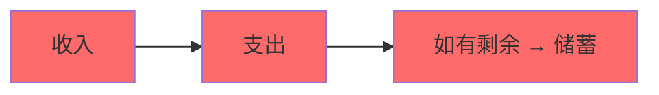
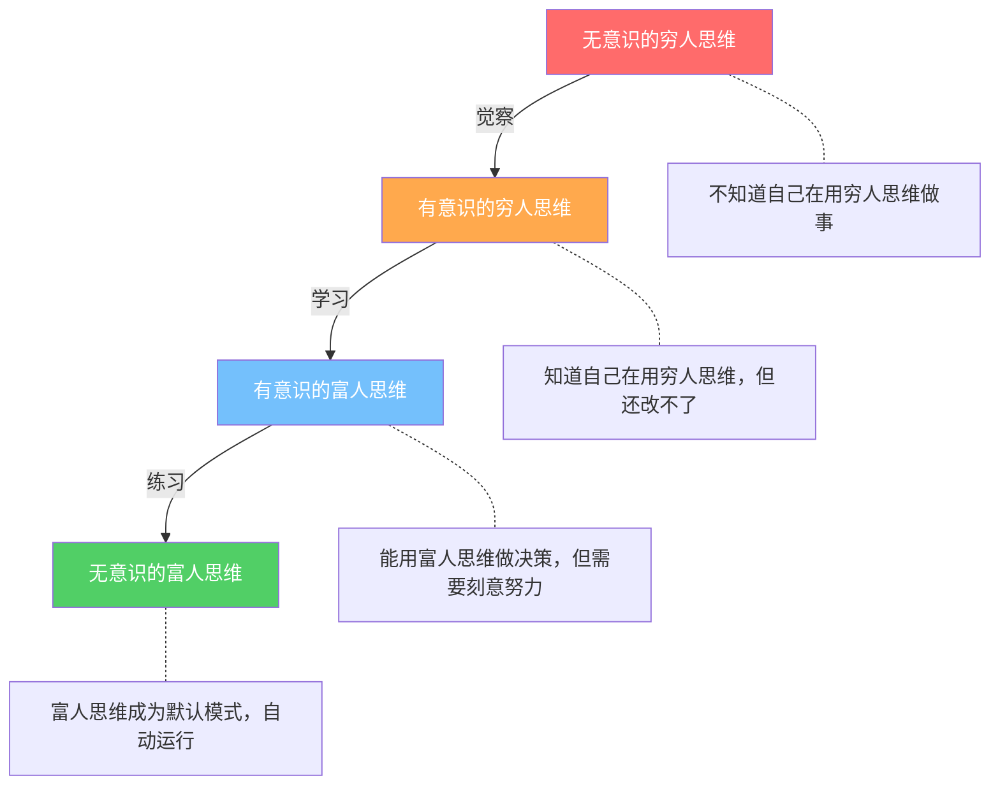

## 四、富人思维 vs 穷人思维

### 4.1 为什么思维方式比起点更重要

先看一组数据：美国国家经济研究局（NBER）追踪了近万名彩票大奖得主，发现其中约70%在5-7年内回到了中奖前的财务水平，甚至比中奖前更穷。与此形成对比的是，大量白手起家的企业家经历了多次破产后仍然能东山再起——比如唐纳德·特朗普在1990年代负债90亿美元后重新积累财富，史玉柱在巨人集团倒闭后通过脑白金再次崛起。

这些现象指向一个核心结论：**决定一个人长期财富水平的，不是他拥有的资源，而是他处理资源的思维方式**。思维方式就像操作系统的底层代码——你给它再好的硬件（金钱），如果代码有bug，系统照样会崩溃。

T. Harv Eker在《有钱人和你想的不一样》中提出了一个简洁的框架：

```text
思维方式 → 感受 → 行动 → 结果
（Thought）  （Feeling）（Action）（Result）
```

思维方式是因，财务结果是果。要改变果，必须先改变因。这就是为什么单纯的理财技巧（怎么买基金、怎么做预算）对很多人效果有限——如果不改变底层的思维方式，新学到的技巧会被旧的思维模式拉回原点。

### 4.2 穷人思维的深层机制

"穷人思维"不是一个道德标签，而是一套在资源稀缺环境中演化出来的心理适应机制。它本身不是缺陷——在真正的贫困环境中，这些思维模式有其生存价值。问题在于，当环境改变后，这些思维模式会变成财富积累的障碍。

#### 4.2.1 稀缺心态（Scarcity Mindset）

哈佛大学教授塞德希尔·穆来纳森（Sendhil Mullainathan）和普林斯顿大学教授埃尔德·沙菲尔（Eldar Shafir）在《稀缺》一书中提出了"稀缺心态"理论。核心发现：

**稀缺会俘获注意力**。当一个人长期处于资源不足的状态时，大脑会自动将大量认知带宽分配给"如何获取更多资源"这个任务，导致用于其他决策的认知资源被严重压缩。实验表明，仅仅是让受试者想到财务困难，他们的认知测试分数就下降了相当于13个IQ点——相当于一整夜没睡觉的效果。

稀缺心态的具体表现：

- **隧道视野**：只关注眼前的财务需求，忽略长期机会。比如为了省50块钱花2小时比价，却不把这2小时用于学习一个能提升收入的技能。
- **借用倾向**：用未来的资源填补今天的缺口（信用卡分期、网贷），形成"借→还→借"的恶性循环。
- **带宽税**：因为持续担忧财务问题，导致决策质量全面下降——不仅财务决策变差，连人际交往、工作表现都受影响。

#### 4.2.2 消费者身份认同

穷人思维的一个隐蔽特征是**通过消费来定义自我价值**：

- "我值得拥有这个"——用购买行为来证明自己的价值
- "别人都有，我也应该有"——通过消费来维持社会地位感知
- "辛苦了一周，应该犒劳一下自己"——用消费来补偿情绪劳动

这些心理机制的根源在于：当一个人感觉自己在其他维度（能力、成就、社会地位）上缺乏足够的"证据"时，消费成为最容易获取的"我过得还不错"的证明。品牌logo本质上是一个便携式的身份符号。

#### 4.2.3 时间折现率过高

行为经济学中的"双曲折现"（Hyperbolic Discounting）在穷人思维中表现尤为明显：人们倾向于严重低估未来的收益，过度偏好即时满足。

具体表现：
- "投资10年才能翻倍？太慢了"——对复利效应缺乏体感认知
- "先享受再说，以后的事以后考虑"——未来自我在心理上被当作"另一个人"
- "现在100块的快乐 vs 30年后1000块的收益，我选前者"——即时快感的神经信号远强于远期收益的抽象概念

普林斯顿大学的神经影像研究显示，当人们考虑即时奖励时，大脑的中脑边缘多巴胺系统（与快感和成瘾相关）会被强烈激活；而考虑延迟奖励时，前额叶皮层（与理性规划相关）需要主动"压制"这个冲动。穷人思维本质上是多巴胺系统在与前额叶皮层的较量中频繁获胜。

#### 4.2.4 外部归因倾向

穷人思维倾向于将财务状况归因于外部因素：
- "大环境不好"
- "没有贵人相助"
- "运气不好"
- "社会不公平"

这种归因模式的问题不在于这些因素是否真实存在——它们确实存在——而在于**外部归因会剥夺行动力**。如果财富主要由外部因素决定，那个人努力就没有意义，于是行动的动力被瓦解。

#### 4.2.5 损失厌恶过强

丹尼尔·卡尼曼和阿莫斯·特沃斯基的前景理论发现，损失带来的痛苦是等额收益带来的快乐的2-2.5倍。穷人思维中，这个比例被进一步放大：

- 宁可把钱存在银行承受通胀侵蚀，也不愿学习投资
- 一只股票亏了10%就恐慌卖出，却不肯在涨了10%时锁定利润
- 对"亏钱"的恐惧远大于对"错过赚钱机会"的遗憾
- "稳稳的幸福"成为回避一切风险的借口

### 4.3 富人思维的核心特征

富人思维不是"有钱人的思维"——很多有钱人并不具备富人思维（这就是为什么会有"富不过三代"）。富人思维是一套**最大化长期财富积累概率**的认知框架。

#### 4.3.1 生产者身份认同

与消费者的"我买故我在"相反，富人思维的核心身份认同是**生产者和创造者**：

- 走进一家餐厅，穷人思维想的是"菜单上哪个好吃"，富人思维想的是"这家店的商业模式是什么，翻台率多少，利润率大概多少"
- 看到一个热门产品，穷人思维想的是"我要买一个"，富人思维想的是"这个需求我能怎么满足"
- 面对一段空闲时间，穷人思维想的是"刷会儿手机放松一下"，富人思维想的是"这段时间能创造什么价值"

这不是说富人思维者不消费——他们当然消费——而是他们的**默认心理模式**是观察机会而非满足欲望。

#### 4.3.2 资产优先思维

罗伯特·清崎在《富爸爸穷爸爸》中提出的最核心概念是**资产与负债的区分**：

- **资产**：能把钱放进你口袋的东西（产生现金流的投资、知识产权、能带来收入的技能）
- **负债**：能把钱从你口袋取走的东西（消费贷款、贬值的汽车、闲置的奢侈品）

穷人思维的现金流模式：



富人思维的现金流模式：


关键区别不是"花多少存多少"的问题，而是**收入的流向顺序**。穷人思维是"收入→消费→剩余存起来"，富人思维是"收入→先投入资产→用资产收益消费"。

#### 4.3.3 杠杆思维

富人思维者天然地思考"如何用更少的资源撬动更大的结果"：

| 杠杆类型 | 具体形式 | 示例 |
|----------|----------|------|
| 时间杠杆 | 让一份时间产出多份价值 | 写一本书、开发一个软件产品、创建在线课程 |
| 人力杠杆 | 用别人的时间为自己创造价值 | 雇佣员工、外包、建立团队 |
| 资本杠杆 | 用钱生钱 | 投资、贷款买房出租、入股创业公司 |
| 技术杠杆 | 用技术放大个人能力 | 自动化工具、AI辅助、构建系统 |
| 媒体杠杆 | 一次创作，无限传播 | 自媒体内容、播客、YouTube视频 |

穷人思维的典型模式是"出售时间"——每小时工作赚固定的时薪，不工作就没有收入。这种模式的问题在于时间是有限的，收入天花板天然存在。

富人思维者会不断寻找将**一次投入转化为持续回报**的方式。一个程序员写一个SaaS产品，可能前6个月没有收入，但一旦上线，它可以24小时不间断地为全球客户服务——这就是时间杠杆和技术杠杆的叠加。

#### 4.3.4 概率思维与风险校准

富人思维者不是"不怕风险"——他们是对风险有更精确的认知。

穷人思维中的风险认知：
- "投资有风险，不如存银行"——忽略了通胀这个确定的风险
- "创业太危险了"——忽略了打工也有失业风险
- "万一亏了怎么办"——只考虑下行风险，不考虑不行动的机会成本

富人思维中的风险认知：
- 任何决策都有风险，关键是对风险进行**量化评估**
- 用"期望值"做决策：期望值 = 成功概率 × 成功收益 - 失败概率 × 失败损失
- 通过**分散化**控制单一决策的下行风险
- 接受"小亏大赚"的策略——允许小额亏损存在，只要整体期望值为正

举个具体例子：假设一个创业项目的成功概率是30%，成功了赚500万，失败了亏50万。

```text
期望值 = 30% × 500万 + 70% × (-50万) = 150万 - 35万 = 115万
```

穷人思维看到"70%概率亏50万"就退缩了。富人思维看到"期望收益115万"就认真考虑了——前提是那50万的亏损在自己能承受的范围内。

#### 4.3.5 长期主义

富人思维者理解**复利效应**不仅适用于金钱，也适用于知识、技能、人脉和信誉。

沃伦·巴菲特99%的财富是在50岁之后获得的。这不是因为他50岁之后突然变聪明了，而是因为前几十年的积累在复利效应下开始加速增长。但大多数人无法坚持到复利曲线的"拐点"——他们在指数增长初期的平坦阶段就放弃了。

富人思维的长期主义表现：
- 愿意花3-5年建立一项核心技能，而不是频繁跳槽追短期薪资
- 愿意在看不到回报的阶段持续投入（学习、社交、品牌建设）
- 做决策时考虑5-10年的时间跨度，而不只是下个月
- 理解"慢就是快"——前期的慢积累会带来后期的加速度

### 4.4 系统性对比：富人思维 vs 穷人思维

以下对比涵盖12个核心维度。每个维度都不仅仅是"态度"的差异，而是**认知框架**的根本不同。

| 维度 | 穷人思维 | 富人思维 | 认知根源 |
|------|----------|----------|----------|
| 收入目标 | "我想要更多钱" | "我想要更多能产生钱的资产" | 消费导向 vs 资产导向 |
| 时间观 | 时间是消费/享受的资源 | 时间是投资/创造的资源 | 即时满足 vs 延迟回报 |
| 对学习的态度 | "学这个有什么用？能赚钱吗？" | "学什么能提升我的认知和能力？" | 工具性学习 vs 内在性学习 |
| 面对机会 | "万一失败了怎么办？" | "万一成功了怎么办？不尝试的代价是什么？" | 损失厌恶 vs 机会成本思维 |
| 对有钱人的态度 | "肯定是靠关系/运气/不正当手段" | "他们做对了什么？我能学到什么？" | 外部归因 vs 学习心态 |
| 消费习惯 | 收入高了就提高消费水平 | 收入高了就提高投资比例 | 消费升级 vs 资产升级 |
| 对债务的态度 | 所有债务都是坏的 | 区分好债（买资产）和坏债（买消费品） | 一刀切 vs 分类思维 |
| 解决问题的方式 | "我没有钱所以做不到" | "我怎样才能做到？需要多少资源？怎么获取？" | 资源限制思维 vs 目标导向思维 |
| 对失败的态度 | 失败是终点，证明自己不行 | 失败是数据，优化下次尝试 | 固定型思维 vs 成长型思维 |
| 社交策略 | 和相似处境的人抱团 | 主动接触比自己强的人 | 舒适区 vs 成长区 |
| 收入结构 | 单一工资收入 | 多元收入流（工资+投资+副业+被动收入） | 线性收入 vs 非线性收入 |
| 对金钱的情感 | 焦虑、恐惧、或过度渴望 | 中性——金钱是工具，不是目的 | 情感驱动 vs 理性驱动 |

### 4.5 神经科学视角：两种思维的大脑差异

近年来的脑科学研究揭示了富人思维和穷人思维在神经层面的真实差异。

#### 4.5.1 前额叶皮层 vs 边缘系统

前额叶皮层（Prefrontal Cortex）负责理性决策、长期规划和冲动控制。边缘系统（Limbic System），特别是杏仁核和伏隔核，负责情绪反应和即时快感。

穷人思维倾向于**边缘系统主导**：看到喜欢的东西就买（伏隔核的多巴胺冲动）、面对风险就恐慌（杏仁核的恐惧反应）、被眼前利益吸引（即时奖励的神经激活）。

富人思维倾向于**前额叶皮层主导**：能够在冲动产生时按下暂停键，进行理性分析，考虑长期后果。

好消息是，大脑具有神经可塑性（Neuroplasticity）。通过刻意练习，前额叶皮层的功能可以被强化，就像肌肉一样。冥想、延迟满足训练、复盘反思等习惯都被证实能增强前额叶皮层的活动。

#### 4.5.2 心理账户效应

诺贝尔经济学奖得主理查德·塞勒发现，人们会在大脑中为不同来源和用途的钱建立"心理账户"，并对不同账户应用不同的决策规则。

穷人心理账户的典型表现：
- 工资要省着花，但"意外之财"（年终奖、红包）可以挥霍
- 存了10万块钱不舍得动，但信用卡刷了2万觉得"还好"
- 投资赚了5000块觉得是"白赚的"，可以冒险；自己辛苦赚的5000块则要存起来

富人思维者理解**钱是可替代的（fungible）**——不管是工资、奖金还是投资收益，1块钱就是1块钱，应该用统一的标准来决策其最优用途。

### 4.6 思维模式的形成：童年、环境与"金钱脚本"

布拉德·克朗茨（Brad Klontz）的金钱脚本理论在前面章节已经详细介绍，这里聚焦于穷人思维和富人思维的形成路径。

#### 4.6.1 穷人思维的常见形成路径

**匮乏型家庭**：家中长期经济紧张，父母经常为钱争吵。孩子形成的信念是"钱永远不够"，成年后即使收入增加，仍然活在匮乏的焦虑中。

**突然失去型家庭**：曾经富裕但因为某种原因（生意失败、被骗、天灾）突然陷入困境。孩子形成的信念是"财富随时会消失"，成年后可能过度保守或过度焦虑。

**被否定型环境**：孩子的需求被反复否定（"我们买不起""你以为钱是从天上掉下来的？"）。形成的信念是"我的需求不重要""我不配拥有好东西"。成年后可能过度补偿性消费，或者压抑自己的需求到极端。

**道德绑定型家庭**：父母将金钱与道德挂钩（"有钱人都不是好人""赚钱要干干净净，所以赚不了大钱"）。形成的信念是"追求财富在道德上有问题"，成年后在无意识中破坏自己的财务成功。

#### 4.6.2 富人思维的常见形成路径

**创业型家庭**：父母是企业家或自雇者，孩子从小耳濡目染商业思维。家庭对话中经常出现"成本""利润""客户""机会"等概念。

**投资型家庭**：父母有投资习惯，孩子从小接触复利、资产配置等概念。饭桌上的对话可能是"这只股票的市盈率是多少"而不是"这个月又花了多少钱"。

**成长型教育环境**：父母强调努力和学习而非天赋和运气。孩子形成"能力可以通过努力提升"的信念，面对挫折时更有韧性。

**赋权型养育**：父母给孩子适度的财务自主权（零花钱管理、参与家庭财务决策），让孩子从小建立对金钱的掌控感而非恐惧感。

### 4.7 诊断：你目前处于哪种思维模式？

以下是一份自我评估问卷。对每道题，诚实地选择最符合你真实反应（不是你认为"正确"的反应）的选项。

**情境1**：你收到了一笔5万元的年终奖。
- A. 终于可以换那台新手机/买那个包了（+1穷人思维）
- B. 先看看有没有好的投资机会或用来还高息贷款（+1富人思维）
- C. 存起来，以备不时之需（中性，取决于后续行为）

**情境2**：朋友邀请你参加一个付费的行业交流会，门票2000元。
- A. 太贵了，不去了（+1穷人思维——关注成本）
- B. 2000元能认识什么级别的人？有没有可能带来合作机会？（+1富人思维——关注回报）
- C. 看看有没有免费的替代方案（中性）

**情境3**：你看到一个同事在做副业，每个月多赚1万块。
- A. 他运气好/他有关系/他那个领域我做不了（+1穷人思维——外部归因）
- B. 他具体是怎么做的？我能不能借鉴？需要投入多少时间和精力？（+1富人思维——学习心态）
- C. 做副业太累了，还是本职工作做好吧（中性偏穷人思维）

**情境4**：你投资的一只基金半年亏了15%。
- A. 赶紧卖掉止损，再也不碰投资了（+1穷人思维——恐惧驱动）
- B. 检查当初买这只基金的逻辑是否还成立，如果成立就继续持有甚至加仓（+1富人思维——逻辑驱动）
- C. 先不管了，等涨回来再说（中性偏回避）

**情境5**：你需要学习一个新技能（比如编程/数据分析/短视频制作）来提升收入潜力。
- A. 不知道学了有没有用，万一白费功夫呢（+1穷人思维——不确定性回避）
- B. 先花少量时间做个最小化验证，看看这个方向是否有前景（+1富人思维——小成本试错）
- C. 等有时间了再说（中性偏拖延）

**评分解读**：
- 5个富人思维选项：你的思维模式已经相当成熟，重点是持续强化和扩展
- 3-4个富人思维选项：基础良好，但某些场景下旧模式会回来，需要针对性训练
- 1-2个富人思维选项：你的默认模式偏向穷人思维，好消息是你现在有了觉察，这是改变的第一步
- 0个富人思维选项：你需要认真审视自己的金钱脚本，建议结合金钱脚本理论章节做深度自我探索

### 4.8 常见误解与纠正

#### 误解1："富人思维就是不顾一切地冒险"

**纠正**：富人思维的核心是**计算过的冒险**，而不是赌博。富人思维者会：
1. 评估最坏情况是否在承受范围内
2. 将大风险拆解为多个小风险
3. 通过分散化降低单一事件的冲击
4. 确保自己有足够的"试错资本"——即失败了不会致命

真正的富人思维包含一个穷人思维经常忽略的维度：**生存底线管理**。在冒险之前，先确保基本生活有保障（应急资金、保险、可迁移的技能），然后用"多余"的资源去冒险。

#### 误解2："富人思维就是不花钱，把所有钱都存起来"

**纠正**：极端节俭不是富人思维。富人思维区分三种花钱方式：
- **消耗性支出**：纯消费，花完就没了（餐饮、娱乐、服装）——控制在合理比例内
- **投资性支出**：花出去的钱未来会带来更多回报（教育、健康、人脉经营）——应该积极投入
- **战略性消费**：短期内看起来是消费，但长期有正向回报（买一套得体的衣服去参加重要社交场合）

关键不是"花不花"的问题，而是"这笔支出的长期回报是什么"的问题。

#### 误解3："我收入太低，不可能有富人思维"

**纠正**：思维模式与当前收入水平没有必然关系。月入3000的人可以：
- 存下300块（10%）用于学习一项新技能
- 用免费资源（公开课、图书馆、开源工具）提升自己
- 开始观察身边成功者的决策模式
- 建立记账习惯，了解自己的消费模式

富人思维的起点不是"有多少钱"，而是"如何对待已有的钱"。

#### 误解4："富人思维就是自私、功利"

**纠正**：研究显示，最成功的富人思维者往往高度重视**价值创造**和**互惠关系**。亚当·格兰特在《给予与索取》中的研究发现，最成功的人往往是"给予者"（Givers）——他们主动帮助别人，建立广泛的人脉网络和信誉资本，这些在长期会带来巨大的回报。

富人思维的"利他"不是无私奉献，而是理解**创造价值→获得回报**的因果关系。你为越多的人解决越大的问题，你获得的回报就越大。

#### 误解5："思维转变了就能变富"

**纠正**：思维方式是必要条件，不是充分条件。你还需要：
- 可执行的技能和知识
- 足够的行动力和执行力
- 一定的外部条件和时机
- 持续的反馈和调整机制

思维模式的作用是让你**做出更优的决策**，但决策需要通过行动才能转化为结果。一个有富人思维但从不行动的人，和一个有穷人思维但疯狂行动的人，后者可能反而积累更多——虽然前者一旦行动，效率会高得多。

### 4.9 从穷人思维到富人思维的过渡模型

思维转变不是一蹴而就的，它有一个可预测的过程：



**阶段1→2（觉察）**：这是最关键的一步。大多数人一辈子停留在阶段1，因为他们不知道自己的思维模式有问题。本章的学习本身就在推动这个转变。

**阶段2→3（学习）**：通过阅读、观察、请教，建立富人思维的认知框架。这个阶段你会经常"知道但做不到"——这很正常，因为旧的神经通路比新的强。

**阶段3→4（内化）**：通过反复实践，让富人思维从"需要刻意调用"变成"自动运行"。研究显示，一个新的思维习惯大约需要66天的持续练习才能达到自动化（伦敦大学学院Phillippa Lally的研究）。

### 4.10 跨文化视角：中国语境下的富人思维

在中国语境下，富人思维还有一些特殊的文化维度需要考虑。

#### 4.10.1 "面子消费"与"关系投资"

中国文化中，"面子"是一个强大的消费驱动力。请客吃饭、送礼、展示性消费在社交中有实际功能。富人思维者的做法是**区分面子消费和关系投资**：

- 纯粹为了面子的消费（买超出能力的奢侈品、打肿脸充胖子请客）→ 穷人思维
- 有策略的关系投资（在关键人脉上投入资源、维护社会资本）→ 富人思维

区别在于：前者是为了**自我感觉良好**，后者是为了**长期回报**。

#### 4.10.2 "稳定"偏好与风险校准

中国社会普遍偏好"稳定"（考公、进体制、买房），这本身不是穷人思维——**不加分析地追求稳定才是**。富人思维者会评估：
- 所谓的"稳定"真的稳定吗？（体制内也有裁员、降薪）
- 为了这个"稳定"放弃了什么？（机会成本）
- 有没有既能降低风险又不限制天花板的方式？

#### 4.10.3 "关系"与"能力"的权重

穷人思维："没关系什么都干不成"——完全依赖外部条件。
富人思维："先把自己变成有价值的人，关系自然会来"——能力是1，关系是后面的0。

两者不矛盾。最好的策略是**持续提升能力的同时，有意识地建立和维护人脉**。但优先级是明确的：没有能力作为基础，再多的关系也无法持续创造价值。

### 4.11 本节要点总结

1. **思维方式决定财务结果**：思维方式→感受→行动→结果，这个因果链比具体的理财技巧更重要
2. **穷人思维是适应机制**：它在资源稀缺的环境中有生存价值，但会成为财富积累的障碍
3. **富人思维是认知框架**：包括生产者认同、资产优先、杠杆思维、概率思维和长期主义
4. **两种思维有神经科学基础**：前额叶皮层 vs 边缘系统的主导权之争，可以通过刻意练习改变
5. **思维模式可以被诊断**：通过自我评估识别自己的默认模式
6. **转变有可预测的路径**：无意识→有意识→学习→内化，大约需要66天达到初步自动化
7. **文化语境需要本地化**：面子消费、稳定偏好、关系文化在中国语境下有特殊表现
8. **思维方式是必要非充分条件**：还需要技能、行动力、时机的配合
